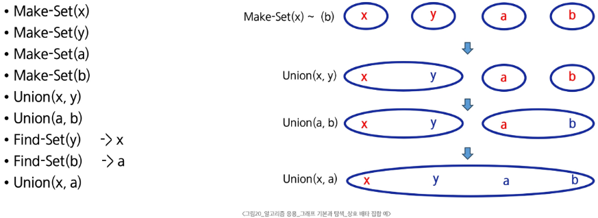

# 그래프의 기본과 탐색, 그리고 서로소 집합(Union-Find)

- 🎯 글의 목표: 그래프를 어떻게 문제의 구조로 바꿔서 바라보는지 이해하고, 그래프 탐색의 대표 방법인 DFS/BFS와 집합 관리에 강력한 서로소 집합 자료구조의 흐름을 함께 정리한다.
- 🧩 핵심 키워드: 그래프, 정점, 간선, 인접 행렬, 인접 리스트, DFS, BFS, Disjoint Set, Union-Find, Path Compression, Rank
- ⭐ 중요도: 높음
- 📝 한눈에 보는 내용: 이번 강의는 “연결 관계를 어떻게 표현할 것인가”에서 시작해, “그 연결을 어떻게 탐색할 것인가”, 마지막으로 “연결된 집합을 어떻게 빠르게 관리할 것인가”까지 이어진다. 즉, 그래프의 표현 → 탐색 → 집합 관리라는 큰 줄기를 한 번에 잡는 수업이다.
- 🔗 관련 문제 / 주제(있다면): 그래프 완전 탐색, 연결 요소 개수 세기, 사이클 판별, 네트워크/연결성 문제, MST(최소 신장 트리)의 기초

---

## 1. 들어가며

그래프는 현실의 많은 문제를 가장 자연스럽게 추상화할 수 있는 도구다.  
사람과 사람의 친구 관계, 도시와 도시를 잇는 도로, 컴퓨터 네트워크, 웹페이지 링크 구조처럼 “무언가와 무언가가 연결되어 있다”는 문제는 선형 자료구조만으로는 표현하기 어렵다.

이번 강의는 바로 그 연결 관계를 그래프로 표현하는 법부터 시작한다.  
그리고 표현한 그래프를 실제로 탐색하는 DFS와 BFS를 살펴본 뒤, “같은 집합인지”, “두 집합을 하나로 합칠 수 있는지”를 빠르게 다루는 서로소 집합까지 확장한다.

겉보기에는 주제가 나뉘어 보이지만, 실제로는 하나의 흐름이다.

- 먼저 **그래프를 어떤 구조로 저장할지** 결정하고,
- 그다음 **그 구조를 따라 방문 순서를 설계**하며,
- 마지막에는 **연결된 집합을 효율적으로 묶고 관리하는 방법**까지 배우는 것이다.

그래서 이번 노트는 단순히 개념을 따로 떼어 적기보다,  
그래프 문제를 풀 때 머릿속에서 어떤 순서로 떠올려야 하는지를 중심으로 정리한다.

---

## 2. 핵심 개념 정리

이번 강의의 큰 흐름은 아래처럼 잡아두면 이해가 잘 된다.

1. **그래프 기본 개념 이해**
   - 그래프는 정점(Vertex)과 간선(Edge)으로 연결 관계를 표현하는 자료구조다.
   - N:N 관계처럼 복잡한 연결 구조를 다룰 때 특히 강하다.

2. **그래프 표현 방식 선택**
   - 인접 행렬: 연결 여부를 빠르게 확인하기 좋다.
   - 인접 리스트: 실제로 연결된 정보만 저장해서 공간을 아낄 수 있다.
   - 어떤 방식이 더 좋은지는 문제의 정점 수, 간선 수, 연산 종류에 따라 달라진다.

3. **그래프 탐색**
   - DFS: 갈 수 있을 때까지 깊게 내려간다.
   - BFS: 가까운 노드부터 넓게 퍼져 나간다.
   - 둘 다 “한 번씩 방문한다”는 공통점은 있지만, 방문 순서와 쓰임새가 다르다.

4. **서로소 집합(Union-Find)**
   - “같은 그룹인가?”, “이 두 그룹을 합쳐도 되는가?”를 빠르게 처리하는 자료구조다.
   - 연결 요소 판별, 사이클 검사, 크루스칼 알고리즘 같은 문제에서 매우 자주 쓰인다.

5. **Union-Find 최적화**
   - 경로 압축(Path Compression)
   - 랭크 기반 합치기(Union by Rank)
   - 이 두 가지를 쓰면 Find/Union 연산이 매우 빨라진다.

즉, 이번 강의는 단순히 그래프 용어를 외우는 수업이 아니라,  
**연결 구조를 표현하고, 탐색하고, 집합으로 관리하는 사고 흐름**을 익히는 수업이라고 볼 수 있다.

---

## 3. 본문 정리

이 섹션에서는 그래프의 핵심 개념과 탐색, 그리고 서로소 집합까지를 한 흐름으로 묶어서 정리한다.  
이해가 끊기지 않도록 각 개념 아래에서 예시 그림과 코드, 해설을 바로 연결한다.

### 3.1 그래프란 무엇인가

그래프는 **정점들의 집합과 그 정점들을 잇는 간선들의 집합**으로 이루어진 자료구조다.  
쉽게 말하면, “무엇이 무엇과 연결되어 있는가”를 표현하는 틀이다.

선형 자료구조나 트리로는 표현이 까다로운 N:N 관계를 다룰 때 특히 유용하다.  
예를 들어 한 사람이 여러 사람과 친구일 수 있고, 여러 도시가 서로 다른 도로로 이어질 수 있는데, 이런 구조는 그래프로 보는 것이 가장 자연스럽다.

그래프를 볼 때 기본이 되는 요소는 다음과 같다.

- **정점(Vertex)**: 대상, 지점, 객체
- **간선(Edge)**: 정점과 정점 사이의 연결
- **차수(Degree)**: 한 정점에 연결된 간선 수
- **경로(Path)**: 간선을 따라 이동한 순서
- **사이클(Cycle)**: 출발한 정점으로 다시 돌아오는 경로

정점이 `V`개인 무향 그래프는 최대 `V * (V - 1) / 2`개의 간선을 가질 수 있다.  
이 식은 “모든 정점 쌍이 서로 연결된 완전 그래프”를 떠올리면 이해하기 쉽다.

#### 그래프의 대표 유형

- 무향 그래프: 간선에 방향이 없다.
- 유향 그래프: 간선에 방향이 있다.
- 가중치 그래프: 간선마다 비용, 거리, 시간 같은 값이 있다.
- DAG: 방향은 있지만 사이클이 없는 그래프
- 완전 그래프: 가능한 모든 간선이 존재하는 그래프
- 부분 그래프: 원래 그래프의 일부 정점/간선만 사용한 그래프

아래 그림은 그래프의 대표 유형을 시각적으로 보여준다.


#### 경로와 사이클

경로는 간선을 순서대로 따라가는 것이다.  
이때 같은 정점을 최대한 한 번만 지나는 경로를 **단순 경로**라고 부른다.  
그리고 출발한 정점으로 다시 돌아오는 경로는 **사이클**이다.


💡 포인트  
그래프 문제를 처음 볼 때는 “정점이 무엇이고, 간선이 무엇인지”부터 먼저 치환해야 한다.  
이 단계가 흔들리면 뒤의 탐색과 구현도 자연스럽게 흐트러진다.

📌 핵심  
그래프는 “연결 관계”를 다루기 위한 자료구조이며, 정점과 간선으로 문제를 추상화하는 것이 출발점이다.

---

### 3.2 그래프를 어떻게 저장할 것인가: 인접 행렬과 인접 리스트

그래프 문제에서 가장 먼저 부딪히는 구현 선택은 **어떤 형태로 저장할 것인가**이다.  
같은 그래프라도 저장 방식에 따라 공간 사용량과 탐색 방식이 달라진다.

#### 1) 인접 행렬

인접 행렬은 `V x V` 크기의 2차원 배열을 사용해 연결 여부를 저장한다.  
`graph[i][j] == 1`이면 `i`와 `j`가 연결된 것이고, `0`이면 연결되지 않은 것이다.

- 장점: 두 정점이 연결되어 있는지 빠르게 확인할 수 있다.
- 단점: 간선이 적은 희소 그래프에서는 공간 낭비가 크다.

무향 그래프에서는 행과 열의 의미가 대칭이다.  
그래서 `i`번째 행의 합과 `i`번째 열의 합이 모두 정점 `i`의 차수가 된다.


유향 그래프에서는 방향이 있으므로 행과 열의 역할이 달라진다.

- 행의 합: 진출 차수(out-degree)
- 열의 합: 진입 차수(in-degree)


그리고 정점 수가 많지만 실제 연결은 적다면, 아래처럼 많은 0을 저장하게 된다.  
이것이 인접 행렬의 대표 단점이다.


#### 2) 인접 리스트

인접 리스트는 각 정점마다 **실제로 연결된 정점들만** 따로 저장하는 방식이다.  
그래서 희소 그래프에서 훨씬 효율적이다.


무향 그래프에서는 간선 하나가 양쪽 정점 정보에 모두 들어가므로,  
전체 인접 리스트 노드 수는 보통 `간선 수 * 2`가 된다.


유향 그래프에서는 시작 정점 쪽에만 정보가 저장되므로,  
전체 노드 수는 보통 간선 수와 같은 수준으로 본다.


#### 그래프 표현 코드

강의의 코드 셀을 바탕으로, 인접 행렬과 인접 리스트를 한 번에 비교할 수 있도록 주석을 보강해 정리하면 다음과 같다.

```python
# 정점 수 V, 간선 수 E 입력
V, E = map(int, input().split())

# -----------------------------
# 1. 인접 행렬 방식
# -----------------------------
# V개의 정점이 있다고 가정하면 V x V 2차원 배열을 만든다.
# graph[a][b]가 1이면 a와 b가 연결되었다는 뜻이다.
graph = [[0] * V for _ in range(V)]

for _ in range(E):
    start, end = map(int, input().split())

    # start -> end 연결 표시
    graph[start][end] = 1

    # 무향 그래프라면 반대 방향도 함께 연결한다.
    graph[end][start] = 1

# 전체 연결 상태 출력
for row in graph:
    print(row)

# -----------------------------
# 2. 인접 리스트 방식
# -----------------------------
# 각 정점마다 "어디와 연결되어 있는지"를 리스트로 저장한다.
graph = [[] for _ in range(V)]

for _ in range(E):
    start, end = map(int, input().split())

    # 무향 그래프라면 양쪽에 모두 추가
    graph[start].append(end)
    graph[end].append(start)

# 각 정점의 연결 정보 출력
for vertex in range(V):
    print(vertex, "->", graph[vertex])
```

#### 코드 흐름 해설

먼저 인접 행렬은 모든 정점 쌍의 연결 여부를 저장하므로,  
연결 확인 자체는 빠르지만 크기가 `V x V`로 고정된다.

반면 인접 리스트는 실제 연결된 정점만 저장하므로,  
탐색할 때는 훨씬 실용적인 경우가 많다. 특히 DFS/BFS에서는 인접 리스트를 더 자주 사용한다.

⚠️ 주의  
정점 번호가 `0 ~ V-1`인지, `1 ~ V`인지에 따라 배열 크기가 달라진다.  
이 부분을 놓치면 `IndexError`가 자주 발생한다.  
강의에서도 “`V` 또는 `V + 1`을 잘 확인하라”는 점이 핵심으로 나온다.

📌 핵심  
그래프 표현 방식은 문제 풀이의 첫 선택이다.  
간선 밀도가 높고 연결 여부 확인이 중요하면 인접 행렬, 실제 연결 정보 위주 탐색이면 인접 리스트를 우선 떠올리면 된다.

---

### 3.3 DFS와 BFS: 그래프를 실제로 탐색하는 방법

그래프를 저장했다면, 이제는 그 그래프를 따라 움직여야 한다.  
이때 가장 기본이 되는 탐색이 DFS와 BFS다.

#### DFS: 깊이 우선 탐색

DFS는 **갈 수 있을 때까지 깊게 들어가는 탐색**이다.  
쉽게 말하면, 현재 갈 수 있는 길이 있으면 먼저 끝까지 내려가 보고, 막히면 되돌아오는 방식이다.

그래프를 완전 탐색해야 할 때 매우 자주 쓰이며,  
재귀 또는 스택으로 구현하는 경우가 많다.

강의의 재귀 형태 의사코드는 다음 흐름을 보여준다.

```text
DFS_Recursive(G, v)

    visited[v] <- True

    FOR each all w in adjacency(G, v)
        IF visited[w] != True
            DFS_Recursive(G, w)
```

이 의사코드에서 중요한 점은 아주 단순하다.

1. 현재 정점을 방문 처리한다.
2. 인접 정점들을 확인한다.
3. 아직 방문하지 않은 정점이 있으면 그쪽으로 다시 DFS를 수행한다.

즉, DFS의 핵심은 **방문 체크 + 재귀적 확장**이다.

#### DFS를 왜 이렇게 이해해야 할까

처음 DFS를 배우면 “재귀가 더 어렵다”는 느낌을 받기 쉽다.  
하지만 실제로는 “현재 정점에서 갈 수 있는 다음 정점으로 넘어간다”는 자연스러운 사고를 코드로 옮긴 것이다.

스택을 직접 쓰는 반복형 DFS도 본질은 같다.  
단지 시스템 호출 스택 대신, 우리가 스택 자료구조를 눈에 보이게 관리하는 것뿐이다.

강의의 반복형 의사코드도 결국 같은 구조를 가진다.

- 스택에 시작점을 넣고
- 꺼내서
- 인접 정점을 다시 넣고
- 더 이상 갈 곳이 없으면 이전 분기점으로 돌아간다

#### BFS: 너비 우선 탐색

BFS는 **가까운 정점부터 차례대로 넓게 퍼져 나가는 탐색**이다.  
DFS가 한 방향으로 깊게 들어가는 느낌이라면, BFS는 한 층씩 넓게 확장하는 느낌에 가깝다.

강의 의사코드는 다음 흐름으로 정리된다.

```text
BFS(G, v)
    큐 생성
    시작점 v를 큐에 삽입
    시작점 v를 인큐된 것으로 표시

    WHILE 큐가 비어있지 않은 경우
        t <- 큐의 첫 번째 원소를 꺼냄

        FOR t와 연결된 모든 정점 u에 대해
            u가 아직 인큐되지 않았다면
            u를 큐에 넣고, 인큐된 것으로 표시
```

여기서 핵심은 스택이 아니라 **큐**를 쓴다는 점이다.  
그래서 먼저 들어간 정점의 인접 정점들이 먼저 처리되고,  
자연스럽게 시작점으로부터 가까운 정점부터 방문하게 된다.

#### DFS와 BFS를 함께 놓고 보기

| 탐색 방식 | 핵심 아이디어 | 사용하는 구조 | 잘 어울리는 상황 |
|---|---|---|---|
| DFS | 한 방향으로 끝까지 탐색 | 재귀 / 스택 | 경로 추적, 백트래킹, 연결 요소 탐색 |
| BFS | 가까운 곳부터 넓게 탐색 | 큐 | 최단 거리(가중치 없음), 레벨 탐색 |

💡 포인트  
두 탐색 모두 “중복 방문 방지”가 핵심이다.  
방문 체크를 언제 하느냐에 따라 코드가 조금씩 달라질 수 있지만,  
방문 배열 없이 구현하면 같은 정점을 반복 방문해 무한 루프에 빠지기 쉽다.

⚠️ 주의  
DFS/BFS 문제에서 가장 흔한 실수는 다음 세 가지다.

- 방문 표시를 너무 늦게 해서 같은 정점이 여러 번 들어가는 경우
- 인접 정점 순회 범위를 잘못 잡는 경우
- 시작 정점 하나만 탐색하고 그래프 전체 탐색이 끝났다고 착각하는 경우

특히 연결 요소 개수 세기 문제에서는  
**모든 정점에 대해 아직 방문하지 않았다면 새 DFS/BFS를 시작해야 한다.**

📌 핵심  
DFS는 “깊게”, BFS는 “넓게” 탐색한다.  
둘의 차이는 방문 순서를 만드는 자료구조, 즉 스택/재귀와 큐의 차이에서 나온다.

---

### 3.4 서로소 집합(Disjoint Set, Union-Find)의 기본 개념

그래프 탐색이 “어디를 방문할 것인가”에 가깝다면,  
서로소 집합은 “누가 같은 집합에 속해 있는가”를 관리하는 문제에 가깝다.

서로소 집합은 **공통 원소가 없는 집합들의 모음**이다.  
각 집합은 대표자(representative)를 하나 가지며, 그 대표자를 기준으로 집합을 구분한다.

강의에서는 다음 세 가지 기본 연산을 중심으로 설명한다.

- **Make-Set(x)**: 원소 `x` 하나만 가진 새 집합 생성
- **Find-Set(x)**: `x`가 속한 집합의 대표 원소 찾기
- **Union(x, y)**: `x`가 속한 집합과 `y`가 속한 집합 합치기

이 구조가 중요한 이유는,  
여러 원소가 현재 같은 그룹인지 빠르게 판단해야 하는 문제에서 매우 강력하기 때문이다.

예를 들어 다음과 같은 질문을 빠르게 처리할 수 있다.

- 두 정점이 현재 같은 연결 그룹에 속하는가?
- 이 간선을 추가하면 사이클이 생기는가?
- 여러 집합을 합친 뒤 최종적으로 몇 개의 그룹이 남는가?

아래 그림은 상호 배타 집합의 예를 직관적으로 보여준다.


그리고 아래 이미지는 Make-Set, Union, Find-Set이 순서대로 어떤 의미를 가지는지를 보여주는 예시다.



#### 서로소 집합의 표현 방식

강의에서는 연결 리스트와 트리 두 관점으로 설명한다.

연결 리스트 방식에서는 같은 집합 원소들을 한 줄로 묶고,  
대표 원소가 맨 앞에서 집합 전체를 대표한다.


트리 방식에서는 각 노드가 부모를 가리키고,  
루트 노드가 그 집합의 대표자가 된다.


실제 코딩 테스트나 구현에서는 연결 리스트보다 **배열 기반 트리 표현**을 훨씬 더 많이 쓴다.  
부모를 배열 하나로 관리하면 구현이 간단하고 빠르기 때문이다.


📌 핵심  
서로소 집합은 “같은 집합인지 판별하고, 집합을 합치는 일”을 빠르게 처리하기 위한 자료구조다.

---

### 3.5 Union-Find 구현: Make-Set, Find-Set, Union

이제 서로소 집합을 실제 코드로 옮겨보자.  
핵심 아이디어는 간단하다. 각 원소에 대해 **부모 정보**를 저장하고,  
루트 노드를 대표자로 삼는 것이다.

강의 자료와 첨부된 `상호베타집합.py` 파일을 바탕으로,  
기본 구현 흐름을 학습용 주석과 함께 정리하면 다음과 같다.

```python
N = 10

# p[x] : x의 부모를 저장하는 배열
# 처음에는 각 원소가 자기 자신을 부모로 가지게 만들어
# "원소 하나짜리 집합"을 만든다.
p = [0] * (N + 1)

def make_set(x):
    # x 자신이 대표인 집합 생성
    p[x] = x

def find_set(x):
    # x가 자기 자신을 부모로 가지면
    # 그 노드는 곧 대표(루트)라는 뜻이다.
    if x == p[x]:
        return x

    # 대표가 아니라면 부모를 따라 계속 올라간다.
    return find_set(p[x])

def union(x, y):
    # x와 y가 속한 집합의 대표를 각각 찾는다.
    root_x = find_set(x)
    root_y = find_set(y)

    # 이미 같은 집합이면 합칠 필요가 없다.
    if root_x == root_y:
        return

    # root_y가 root_x를 가리키게 만들어 두 집합을 합친다.
    p[root_y] = root_x
```

#### 이 코드에서 중요한 흐름

- `make_set(x)`는 시작 준비 단계다.
- `find_set(x)`는 대표를 찾는 단계다.
- `union(x, y)`는 대표끼리 연결해서 집합을 합치는 단계다.

즉, 합치기 전에 항상 먼저 대표를 찾아야 한다.  
그렇지 않으면 원소끼리 바로 연결하는 실수를 하게 되고, 트리 구조가 쉽게 꼬인다.

강의 자료에 있는 의사코드를 정리하면 아래와 같은 흐름이다.

```text
Make-Set(x)
    p[x] <- x

Find-Set(x)
    IF x == p[x] : RETURN x
    ELSE         : RETURN Find-Set(p[x])

Union(x, y)
    p[Find-Set(y)] <- Find-Set(x)
```

그리고 반복문으로 `Find-Set`을 구현할 수도 있다.

```text
Find-Set(x)
    while x != p[x]
        x = p[x]
    return x
```

재귀형과 반복형은 표현만 다를 뿐,  
결국은 부모를 타고 루트까지 올라간다는 점에서 같은 원리다.

#### 연산 예시 그림


⚠️ 주의  
Union-Find에서 가장 많이 하는 실수는 **원소를 직접 연결하는 것**이다.  
항상 `find_set()`으로 대표를 찾은 뒤 대표끼리 연결해야 한다.

📌 핵심  
Union은 “원소를 잇는 것”이 아니라, **대표를 찾아 집합 단위로 합치는 것**이다.

---

### 3.6 왜 최적화가 필요한가: 편향 트리와 경로 압축, Rank

기본 Union-Find는 구조가 단순해서 좋지만,  
계속 한쪽으로만 붙는 식으로 합쳐지면 트리가 길게 늘어질 수 있다.

이런 상태를 편향 트리처럼 생각하면 된다.  
그러면 `find_set(x)`를 할 때 루트까지 올라가는 비용이 커진다.


그래서 강의에서는 두 가지 최적화를 소개한다.

#### 1) Rank를 이용한 Union

각 집합의 트리 높이 정보를 `rank`로 관리하고,  
항상 더 낮은 트리를 더 높은 트리에 붙인다.


두 랭크가 같을 때는 한쪽을 대표로 삼고, 그 대표의 rank를 1 증가시킨다.


#### 2) Path Compression

`find_set(x)`를 하면서 만나는 중간 노드들도 한 번에 루트를 직접 가리키게 바꾼다.  
즉, “대표를 찾는 김에 경로도 납작하게 펴는 것”이다.


#### 최적화된 코드

첨부된 파이썬 파일의 흐름을 유지하면서, 오탈자와 설명을 다듬어 정리하면 다음과 같다.

```python
N = 10

# 부모 정보와 랭크(트리 높이 근사치)를 저장
parent = [i for i in range(N + 1)]
rank = [0] * (N + 1)

def find_set(x):
    # x가 루트가 아니라면
    if x != parent[x]:
        # 대표를 찾는 과정에서
        # 중간 노드도 바로 루트를 가리키게 만든다.
        parent[x] = find_set(parent[x])
    return parent[x]

def union(x, y):
    root_x = find_set(x)
    root_y = find_set(y)

    # 이미 같은 집합이면 종료
    if root_x == root_y:
        return

    # rank가 더 큰 쪽을 루트로 유지
    if rank[root_x] > rank[root_y]:
        parent[root_y] = root_x
    else:
        parent[root_x] = root_y

        # rank가 같았다면 새 루트의 rank를 1 증가
        if rank[root_x] == rank[root_y]:
            rank[root_y] += 1

print(parent)

union(1, 6)
print(parent)
union(2, 6)
print(parent)
union(3, 6)
print(parent)
union(4, 6)
print(parent)
union(8, 7)
print(parent)
union(9, 8)
print(parent)
union(9, 3)
print(parent)

print('=========================')

# 한 번씩 대표를 다시 찾게 하면
# 경로 압축 효과로 parent 배열이 더 납작하게 정리된다.
for i in range(N + 1):
    find_set(i)

print(parent)
```

#### 코드 흐름 해설

이 코드의 핵심은 `find_set()` 안에 있다.  
대표를 찾는 과정에서 `parent[x]`를 루트로 바로 갱신하므로,  
다음부터는 같은 노드의 대표를 더 빨리 찾을 수 있다.

또 `union()`에서는 무조건 한쪽에 붙이지 않고 `rank`를 비교한다.  
그래서 트리가 한쪽으로만 심하게 늘어지는 것을 막을 수 있다.

⚠️ 주의  
아래 두 실수는 꼭 구분해야 한다.

- `parent[x] = y`처럼 원소끼리 바로 연결하는 것
- `rank`는 트리의 “정확한 높이”가 아니라, 높이를 제어하기 위한 보조 정보라는 점을 잊는 것

📌 핵심  
Union-Find의 성능은 `Find`를 얼마나 빠르게 하느냐에 달려 있다.  
그래서 **경로 압축 + rank 기반 union**이 거의 기본 세트처럼 함께 쓰인다.

---

## 4. 적용 관점에서 다시 보기

이제 이번 강의를 실제 문제풀이 관점에서 다시 묶어보자.  
중요한 것은 개념을 따로 외우는 것이 아니라, 문제를 보았을 때 어떤 신호를 보고 어떤 도구를 떠올릴지다.

### 4.1 그래프 문제를 보면 먼저 할 일

그래프 문제를 보면 가장 먼저 아래 두 가지를 생각하면 된다.

1. **정점은 무엇인가?**
2. **간선은 무엇인가?**

예를 들어 사람 관계라면 사람 = 정점, 친구 관계 = 간선이다.  
도시 이동 문제라면 도시 = 정점, 도로 = 간선이다.

이렇게 정점과 간선을 먼저 확정해야,  
그다음에 저장 방식과 탐색 방식을 고를 수 있다.

### 4.2 인접 행렬과 인접 리스트를 어떻게 고를까

다음 기준으로 떠올리면 실전에서 빠르다.

- 정점 수가 작고, 두 정점의 연결 여부를 자주 바로 확인해야 하면 → **인접 행렬**
- 실제 연결 정보만 순회하면 되고, 간선 수가 상대적으로 적다면 → **인접 리스트**

특히 DFS/BFS 구현 문제에서는 인접 리스트가 더 자주 쓰인다.  
탐색 시 실제 연결된 정점만 순회하면 되기 때문이다.

### 4.3 DFS와 BFS는 어떤 신호에서 떠올릴까

- **DFS**
  - 끝까지 내려가 보는 구조
  - 연결 요소 탐색
  - 경로 존재 여부 확인
  - 백트래킹과 결합되는 문제

- **BFS**
  - 가까운 곳부터 차례대로 퍼져야 하는 구조
  - 시작점으로부터 최소 이동 횟수
  - 레벨 단위 탐색
  - “가중치가 없는 최단 거리” 문제

문제에서 “최소 몇 번 만에 도달하는가”가 보이면 BFS를 먼저 의심하는 습관이 중요하다.

### 4.4 Union-Find는 어떤 문제에서 강한가

다음 문장이 보이면 Union-Find를 떠올릴 가능성이 높다.

- 두 원소가 같은 그룹인지 빠르게 판별
- 연결할 때 사이클이 생기는지 확인
- 여러 연결 작업 후 최종 그룹 수 계산
- 간선을 하나씩 추가하면서 연결 상태 관리

즉, 그래프 전체를 매번 탐색하는 대신,  
집합 정보만 빠르게 갱신해도 되는 문제에서 아주 강하다.

### 4.5 실전에서 자주 틀리는 패턴

- 정점 번호 기준을 0번부터로 볼지 1번부터로 볼지 혼동
- 무향 그래프인데 간선을 한쪽만 추가
- BFS인데 큐 대신 스택처럼 다뤄서 순서가 꼬임
- Union 전에 대표를 찾지 않고 원소끼리 바로 연결
- 경로 압축/랭크 최적화를 빼먹고 시간 초과

🧠 기억할 것  
그래프 문제는 “표현 방식 선택”과 “탐색 도구 선택”이 절반이다.  
Union-Find는 그중에서도 “연결된 집합 관리”에 특화된 도구라고 정리해두면 좋다.

---

## 5. 배운 점 / 느낀 점 / 확장 포인트

이번 강의에서 특히 중요한 점은,  
그래프가 단순히 새로운 자료구조 하나가 아니라 **문제를 바라보는 방식**이라는 점이다.

같은 문제라도  
“무엇을 정점으로 볼지”, “어떤 관계를 간선으로 볼지”에 따라 전혀 다른 형태가 된다.  
그래서 그래프를 잘 다룬다는 것은 코드를 잘 쓰는 것보다 먼저,  
문제를 연결 구조로 추상화하는 힘을 기르는 것에 가깝다.

또 DFS/BFS와 Union-Find는 서로 다른 주제처럼 보이지만,  
실제로는 모두 연결 관계를 다룬다는 공통점이 있다.

- DFS/BFS는 연결을 **따라가며 방문**하는 도구이고,
- Union-Find는 연결을 **집합 단위로 관리**하는 도구다.

다음 학습으로 확장하면 좋은 주제는 다음과 같다.

- 연결 요소 개수 구하기
- 사이클 판별
- 위상 정렬(DAG)
- 최소 신장 트리(MST)와 크루스칼 알고리즘
- 최단 경로 알고리즘

특히 MST를 배울 때는 Union-Find가 왜 강력한지 훨씬 더 선명하게 느껴진다.

---

## 6. 요약 정리

📌 핵심

- 그래프는 정점과 간선으로 연결 관계를 표현하는 자료구조다.
- 그래프 저장 방식은 인접 행렬과 인접 리스트가 대표적이다.
- DFS는 깊게, BFS는 넓게 탐색한다.
- 서로소 집합은 같은 집합 판별과 집합 합치기를 빠르게 처리한다.
- Union-Find의 핵심 연산은 Make-Set, Find-Set, Union이다.
- 경로 압축과 rank 기반 union을 적용하면 연산 효율이 크게 좋아진다.

🧠 기억할 것

- 그래프 문제는 먼저 정점과 간선을 정의한다.
- 탐색 문제면 DFS/BFS를, 집합 관리 문제면 Union-Find를 우선 떠올린다.
- Union은 원소끼리 직접 연결하는 것이 아니라 대표끼리 연결하는 것이다.
- 구현에서 가장 많이 틀리는 부분은 방문 처리 시점과 정점 번호 기준이다.

---

## 7. 미니 퀴즈 또는 체크리스트

1. 인접 행렬과 인접 리스트는 각각 어떤 상황에서 더 적합한가?
2. DFS와 BFS는 방문 순서를 어떤 자료구조 차이로 만들어내는가?
3. 무향 그래프에서 간선을 입력받을 때 왜 양쪽 정점 모두에 정보를 추가해야 하는가?
4. `union(x, y)`를 수행하기 전에 반드시 `find_set()`을 먼저 해야 하는 이유는 무엇인가?
5. 경로 압축과 rank 기반 union이 없는 Union-Find는 왜 느려질 수 있는가?

### 이해 점검 체크리스트

- [ ] 문제를 보고 정점과 간선을 스스로 정의할 수 있다.
- [ ] 인접 행렬과 인접 리스트 중 무엇을 쓸지 이유와 함께 선택할 수 있다.
- [ ] DFS와 BFS의 차이를 “깊이/너비”만이 아니라 자료구조 관점에서도 설명할 수 있다.
- [ ] Union-Find의 세 연산을 직접 구현할 수 있다.
- [ ] 경로 압축과 rank 최적화가 왜 필요한지 설명할 수 있다.
