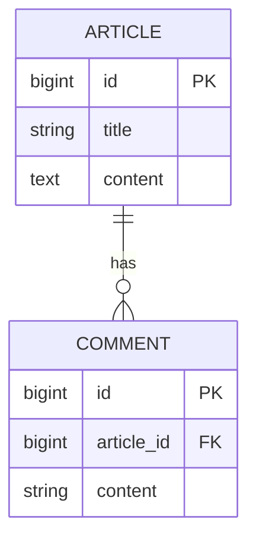
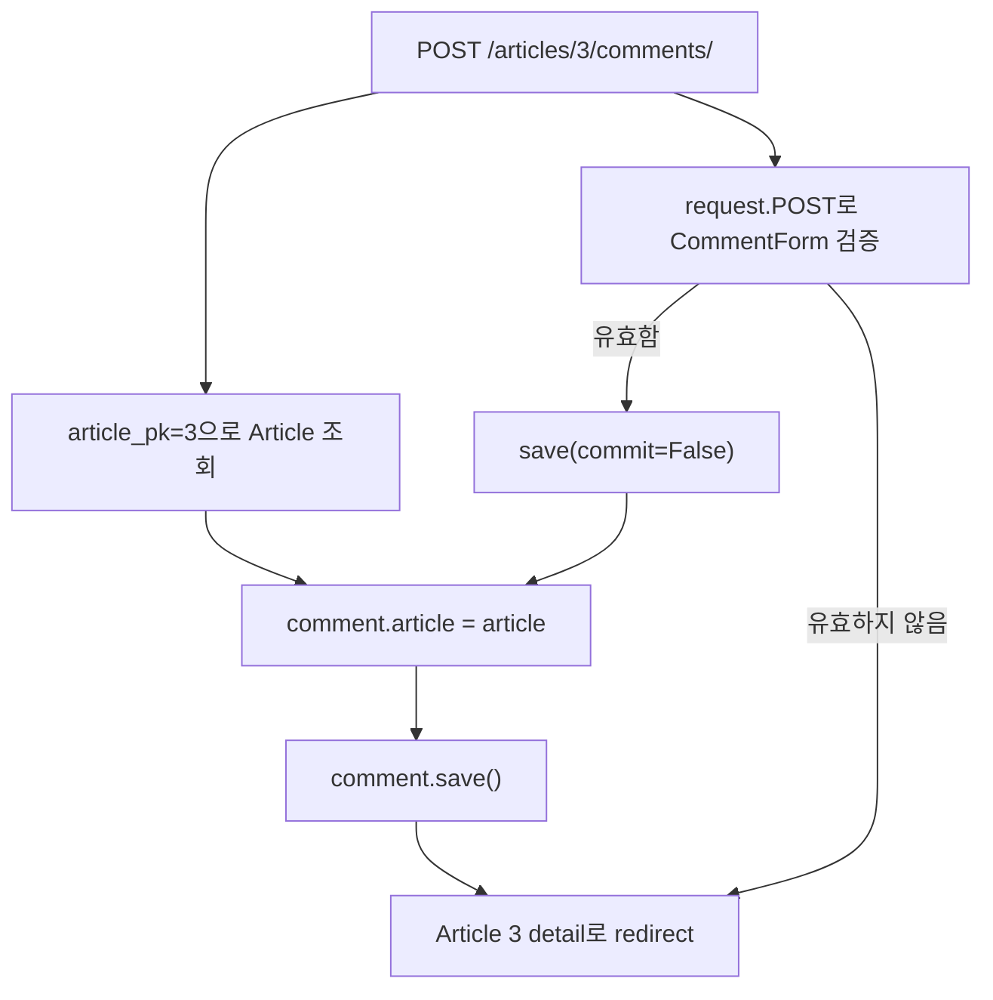

# DB N:1 1: ForeignKey로 게시글과 댓글 연결하기

- 🎯 글의 목표: 관계형 데이터베이스의 N:1 관계를 이해하고, Django `ForeignKey`로 게시글과 댓글의 생성·조회·삭제 흐름을 구현한다.
- 🧩 핵심 키워드: N:1, Primary Key, Foreign Key, `on_delete`, migration, 정참조, 역참조, related manager, `commit=False`
- ⭐ 중요도: 매우 높음. 사용자-게시글, 게시글-댓글처럼 대부분의 웹 서비스 데이터 모델을 구성하는 기본 관계다.
- 📝 한눈에 보는 내용: 댓글 테이블에 게시글 외래 키를 두고, Django ORM의 정참조와 역참조로 관계를 조회하며, ModelForm 저장 전에 게시글을 연결한다.
- 🔗 관련 문제 / 주제: Django ORM, ModelForm, 댓글 CRUD, 데이터 모델링, 참조 무결성

---

## 1. 들어가며

게시글과 댓글을 각각 저장하는 것만으로는 "이 댓글이 어느 게시글에 달렸는가"를 알 수 없다. 댓글에 게시글 제목을 문자열로 복사하면 제목이 바뀔 때마다 댓글 데이터도 수정해야 하고, 존재하지 않는 게시글 제목이 저장될 수도 있다.

관계형 데이터베이스는 다른 행의 기본 키를 참조하는 외래 키로 이 문제를 해결한다. 댓글은 하나의 게시글에 속하고, 하나의 게시글에는 여러 댓글이 달릴 수 있으므로 관계는 N:1이다. 여러 개가 존재하는 댓글 쪽에 게시글의 PK를 저장하면 댓글 하나가 어느 게시글에 속하는지 분명해진다.

이번 강의는 테이블 설계에서 끝나지 않는다. 모델 필드를 추가해 migration하고, ORM으로 양방향 조회를 수행하며, 댓글 form에는 노출하지 않은 게시글 정보를 view에서 채워 저장하는 과정까지 이어진다.

## 2. 핵심 개념 정리

이 강의가 해결하는 질문은 "독립적으로 존재하던 두 테이블을 어떻게 연결하고, 그 관계를 Django 코드에서 어떻게 다룰 것인가"이다.

먼저 N:1 관계에서 외래 키를 N 쪽에 둬야 하는 이유를 테이블 관점에서 확인한다. Django 모델에 `ForeignKey`를 선언하고 migration하면 실제 DB에는 참조 대상의 PK를 저장하는 `article_id` 컬럼이 생긴다.

그다음 댓글에서 게시글로 가는 정참조와 게시글에서 댓글 모음을 찾는 역참조를 구분한다. 마지막으로 댓글 생성 form에서 게시글 필드를 숨기고, URL로 식별한 게시글을 `commit=False`로 연결한 뒤 저장한다.



까마귀 발 모양이 있는 Comment 쪽이 여러 개가 될 수 있는 N 쪽이다. `ARTICLE ||--o{ COMMENT`는 게시글 하나가 댓글 0개 이상을 가질 수 있고, 각 댓글은 게시글 하나에 속한다는 뜻으로 읽을 수 있다.

## 3. 본문 정리

### 3.1 N:1 관계와 외래 키의 위치

N:1 관계는 여러 행이 하나의 행을 참조하는 관계다. 게시글 하나에 댓글이 여러 개 달리지만, 댓글 하나는 한 게시글에만 속한다. 이때 외래 키는 N에 해당하는 댓글 테이블에 둔다.


댓글 행에는 게시글의 모든 데이터를 복사할 필요가 없다. 참조 대상 게시글을 유일하게 식별하는 PK 하나만 저장하면 된다.

관계를 이해하려면 PK와 FK의 역할을 먼저 구분해야 한다.

| 키 | 역할 | 게시글-댓글 예시 |
|---|---|---|
| Primary Key | 자기 테이블의 행을 유일하게 식별 | `Article.id`, `Comment.id` |
| Foreign Key | 다른 테이블의 행을 참조 | `Comment.article_id` |

PK는 중복되지 않는 식별자이고, FK는 참조 대상 테이블의 PK 값을 저장한다. FK 값이 실제로 존재하는 PK를 가리키도록 유지하는 성질을 참조 무결성이라고 한다.

| Comment | 값 예시 |
|---|---|
| `id` | 7 |
| `content` | 관계 설정 복습 완료 |
| `article_id` | 3 |

`article_id = 3`은 이 댓글이 PK가 3인 게시글에 속한다는 뜻이다. 여러 댓글 행이 같은 `article_id`를 가질 수 있으므로 한 게시글과 여러 댓글의 관계가 표현된다.

⚠️ 주의: 외래 키를 1 쪽인 게시글에 두고 댓글 PK 하나만 저장하면, 두 번째 댓글부터 저장할 자리가 없다. "어느 쪽 행 하나가 상대방 하나만 가리키는가"를 보면 FK 위치를 결정하기 쉽다.

### 3.2 Django ForeignKey 선언과 on_delete

Django에서는 모델 필드 `ForeignKey`로 관계를 선언한다. 댓글 모델에 `article` 필드를 추가하면 Python 코드에서는 게시글 객체처럼 접근하고, 데이터베이스에는 기본적으로 `article_id` 컬럼이 생성된다.


```python
# articles/models.py
from django.db import models


class Article(models.Model):
    title = models.CharField(max_length=100)
    content = models.TextField()
    created_at = models.DateTimeField(auto_now_add=True)
    updated_at = models.DateTimeField(auto_now=True)


class Comment(models.Model):
    # 댓글 N개가 하나의 게시글을 참조한다.
    # 게시글이 삭제되면 소속을 잃은 댓글도 함께 삭제한다.
    article = models.ForeignKey(
        Article,
        on_delete=models.CASCADE,
    )
    content = models.CharField(max_length=200)
    created_at = models.DateTimeField(auto_now_add=True)
    updated_at = models.DateTimeField(auto_now=True)
```

필드 이름을 `article_id`가 아니라 `article`로 선언하는 점이 중요하다. Django ORM은 `comment.article`에서 Article 객체를 돌려주고, 실제 정수 FK 값이 필요할 때 `comment.article_id`를 제공한다.

`on_delete=models.CASCADE`는 참조하던 게시글이 삭제되면 댓글도 함께 삭제한다는 정책이다. 댓글이 게시글 없이 독립적으로 의미를 갖기 어렵기 때문에 자연스럽다. 모든 관계에 기계적으로 CASCADE를 쓰는 것이 아니라, 부모가 삭제될 때 자식 데이터를 어떻게 처리할지 도메인 규칙에 맞춰 선택해야 한다.

대표적인 삭제 정책의 차이는 다음과 같다.

| 정책 | 참조 대상 삭제 시 동작 | 사용을 검토할 상황 |
|---|---|---|
| `CASCADE` | 현재 객체도 함께 삭제 | 게시글 없는 댓글처럼 독립 의미가 없음 |
| `PROTECT` | 참조 중이면 삭제 거부 | 데이터가 남아 있는 동안 부모 삭제를 막아야 함 |
| `SET_NULL` | FK를 `NULL`로 변경 | 작성자 탈퇴 뒤에도 콘텐츠를 보존하며 `null=True` 사용 |
| `SET_DEFAULT` | 지정한 기본값으로 변경 | 대체 대상이 명확하게 정해져 있음 |

이번 강의에서는 Article이 사라진 Comment를 남기지 않기 위해 `CASCADE`를 사용한다.

📌 핵심: 모델 필드 `article`은 객체 관계를 표현하고, DB 컬럼 `article_id`는 실제 참조 PK를 저장한다.

### 3.3 기존 테이블에 관계 필드를 추가할 때 migration

모델을 수정한 뒤에는 migration 파일을 만들고 DB에 적용해야 한다.

```bash
python manage.py makemigrations
python manage.py migrate
```

이미 댓글 행이 존재하는 테이블에 `null=False`인 `article` 필드를 추가하면 Django는 기존 행에 어떤 게시글을 넣어야 하는지 알 수 없다. 이때 `makemigrations`는 일회성 기본값을 제공할지, 모델에서 기본값을 직접 정할지 묻는다.


학습 중 DB를 초기화할 수 있다면 기존 DB와 migration을 정리한 뒤 다시 만드는 방법도 있다. 실제 서비스 데이터라면 임의의 게시글 PK를 모든 댓글에 넣으면 안 된다. nullable 필드로 먼저 추가하고 데이터 migration으로 관계를 채운 뒤 null 제한을 적용하는 단계적 migration이 더 안전하다.

모델 수정이 실제 DB까지 반영되는 과정도 분리해서 이해해야 한다.

```text
models.py 수정
  -> makemigrations: 변경 내용을 migration 파일로 기록
  -> migrate: migration을 DB 스키마에 적용
  -> ORM에서 새 관계 사용
```

`makemigrations`는 DB를 바로 바꾸지 않고 변경 명세를 만든다. `migrate`가 실제 테이블과 컬럼을 변경한다. 오류가 났을 때 현재 모델 코드, 생성된 migration, 실제 DB 적용 상태가 서로 일치하는지 확인해야 한다.

⚠️ 주의: 프롬프트에 보이는 `1`은 "첫 번째 게시글을 자동으로 찾아 준다"는 뜻이 아니다. 기존 모든 댓글 행의 새 FK 컬럼에 정수 1을 넣는 일회성 기본값일 뿐이며, 해당 PK가 실제로 존재해야 한다.

### 3.4 정참조: 댓글에서 소속 게시글 찾기

외래 키를 가진 N 쪽 객체에서 참조 대상 1 쪽으로 접근하는 것을 정참조라고 한다. 댓글 모델에 `article` 필드가 있으므로 점 표기법으로 바로 접근한다.

```python
# PK가 1인 댓글을 조회한다.
comment = Comment.objects.get(pk=1)

# ForeignKey 필드를 통해 연결된 Article 객체를 얻는다.
article = comment.article

print(article.title)
print(comment.article_id)  # DB에 저장된 실제 PK 값
```

`comment.article`을 처음 읽을 때 Django는 필요하면 연결된 게시글을 조회한다. 객체를 얻은 뒤에는 `comment.article.title`처럼 게시글의 필드에 이어서 접근할 수 있다.

정참조는 코드의 방향과 모델 필드 방향이 같다. Comment 모델 안에 `article` 필드가 보이므로 "댓글에서 게시글로 간다"는 흐름이 직접 드러난다.

정참조 표현을 한 단계씩 읽으면 다음과 같다.

```text
comment                 -> Comment 객체
comment.article         -> 연결된 Article 객체
comment.article.title   -> 연결된 Article의 title 필드
comment.article_id      -> Comment 행에 저장된 정수 FK 값
```

`comment.article`과 `comment.article_id`는 비슷해 보이지만 반환값이 다르다. 전자는 관계 객체를 얻기 위해 Article 조회가 필요할 수 있고, 후자는 Comment 행에 이미 들어 있는 정수 값이다.

### 3.5 역참조: 게시글에서 댓글 목록 찾기

Article 모델에는 `comments` 필드를 직접 선언하지 않았지만, Django는 ForeignKey 관계의 반대 방향을 위한 related manager를 자동으로 만든다. 기본 이름은 `<소문자 모델명>_set`이다.


```python
article = Article.objects.get(pk=1)

# 이 게시글을 참조하는 모든 댓글의 QuerySet을 얻는다.
comments = article.comment_set.all()

for comment in comments:
    print(comment.content)
```

`comment_set`은 댓글 하나가 아니라 관련 댓글을 조회·생성·관리하는 manager다. 따라서 `.all()`, `.filter()`, `.create()` 같은 QuerySet API와 관계 관리 메서드를 이어서 사용할 수 있다.

```python
# article과 연결된 댓글을 바로 생성한다.
article.comment_set.create(content='역참조 manager로 생성')

# 특정 문자열을 포함하는 댓글만 조회한다.
article.comment_set.filter(content__contains='복습')
```

필요하다면 ForeignKey에 `related_name='comments'`를 지정해 `article.comments.all()`처럼 도메인에 맞는 이름을 사용할 수 있다. 단, 이미 migration된 프로젝트에서 이름을 바꾸면 기존 코드의 역참조 표현도 함께 수정해야 한다.

related manager가 제공하는 대표 동작도 관계 방향과 함께 기억해 둘 수 있다.

```python
article.comment_set.all()                # 이 게시글의 전체 댓글
article.comment_set.filter(content__icontains='ORM')
article.comment_set.count()              # 댓글 개수
article.comment_set.exists()             # 댓글 존재 여부
article.comment_set.create(content='새 댓글')
```

`create()`를 역참조 manager에서 호출하면 현재 article 관계가 자동으로 채워진다. 반면 일반 `Comment.objects.create(...)`를 사용한다면 `article=article`을 직접 전달해야 한다.

```python
# 두 코드는 같은 관계를 가진 댓글을 만든다.
article.comment_set.create(content='첫 번째 방식')
Comment.objects.create(article=article, content='두 번째 방식')
```

어느 표현을 선택하든 최종적으로 Comment 행의 `article_id`가 현재 게시글 PK로 저장된다는 점은 같다.

⚠️ 주의: `article.comment_set`은 manager이고 `article.comment_set.all()`이 QuerySet이다. 반복하거나 템플릿에 목록으로 전달할 때 `.all()` 호출을 빠뜨리지 않았는지 확인한다.

### 3.6 CommentForm에서 article 필드를 제외하는 이유

사용자가 댓글 form에서 게시글을 직접 선택하게 하면 현재 보고 있는 게시글과 다른 게시글 PK를 제출할 수 있다. 댓글이 속할 게시글은 form 입력이 아니라 URL과 view의 문맥으로 결정하는 편이 안전하다.


```python
# articles/forms.py
from django import forms

from .models import Comment


class CommentForm(forms.ModelForm):
    class Meta:
        model = Comment
        # 사용자는 댓글 내용만 입력한다.
        fields = ('content',)
```

detail view는 게시글, 댓글 목록, 빈 CommentForm을 함께 템플릿에 전달한다.

detail 페이지가 필요로 하는 데이터를 역할별로 나누면 세 종류다.

1. 현재 URL이 가리키는 게시글 한 개
2. 그 게시글을 참조하는 기존 댓글 목록
3. 새 댓글 내용을 입력받을 빈 form

이 세 값이 같은 페이지에 있지만 생성 주체는 다르다. 게시글과 댓글 목록은 DB 조회 결과이고, 빈 form은 아직 저장할 데이터가 없는 입력 도구다.

```python
# articles/views.py
from django.shortcuts import get_object_or_404, render

from .forms import CommentForm
from .models import Article


def detail(request, article_pk):
    # URL이 가리키는 게시글을 기준으로 화면의 모든 데이터를 묶는다.
    article = get_object_or_404(Article, pk=article_pk)
    comment_form = CommentForm()
    comments = article.comment_set.all().order_by('-pk')

    context = {
        'article': article,
        'comment_form': comment_form,
        'comments': comments,
    }
    return render(request, 'articles/detail.html', context)
```

### 3.7 commit=False로 관계를 채운 뒤 저장하기

`CommentForm`에는 `article` 입력이 없으므로 `comment_form.save()`를 바로 호출하면 NOT NULL 제약을 만족하지 못한다. `save(commit=False)`로 아직 DB에 저장되지 않은 Comment 객체를 만든 뒤, view가 알고 있는 게시글을 연결하고 최종 저장한다.


```python
# articles/views.py
from django.shortcuts import get_object_or_404, redirect
from django.views.decorators.http import require_POST

from .forms import CommentForm
from .models import Article


@require_POST
def comments_create(request, article_pk):
    # URL의 게시글 PK를 신뢰 가능한 관계 기준으로 사용한다.
    article = get_object_or_404(Article, pk=article_pk)
    comment_form = CommentForm(request.POST)

    if comment_form.is_valid():
        # content가 채워진 객체를 만들되 아직 INSERT하지 않는다.
        comment = comment_form.save(commit=False)

        # form에서 제외한 ForeignKey를 서버가 직접 채운다.
        comment.article = article

        # 필요한 필드가 모두 준비된 뒤 한 번 저장한다.
        comment.save()

    return redirect('articles:detail', article.pk)
```


이 코드에서 입력은 `request.POST`의 댓글 내용과 URL의 `article_pk`다. form은 사용자가 입력한 `content`를 검증하고, view는 URL이 가리키는 Article 객체를 관계 필드에 넣는다. 둘을 합친 뒤에야 완전한 Comment 행이 된다.



`commit=False`는 검증을 미루는 옵션이 아니다. `is_valid()`로 form 검증은 이미 끝났고, DB INSERT 시점만 잠시 미룬다. 이 사이에 form에 없던 FK를 채운다.

⚠️ 주의: `commit=False` 뒤 `comment.save()`를 빠뜨리면 Python 객체만 만들어지고 DB에는 행이 생기지 않는다. 반대로 `save()`를 먼저 호출하면 필수 FK가 비어 있어 무결성 오류가 발생한다.

### 3.8 댓글 삭제에서 부모 게시글 문맥 유지하기

댓글을 삭제한 뒤에는 그 댓글이 속했던 게시글 detail로 돌아가야 한다. 삭제 전에 `comment.article.pk`를 얻거나, URL에 게시글 PK와 댓글 PK를 함께 포함해 두 객체의 관계를 검증한다.


```python
@require_POST
def comments_delete(request, article_pk, comment_pk):
    # article_pk까지 조건에 포함해 다른 게시글의 댓글을 잘못 지우지 않게 한다.
    comment = get_object_or_404(
        Comment,
        pk=comment_pk,
        article_id=article_pk,
    )
    comment.delete()

    return redirect('articles:detail', article_pk)
```

삭제는 서버 상태를 변경하므로 링크의 GET 요청이 아니라 CSRF 토큰을 포함한 POST form으로 요청하는 것이 적절하다. 이후 사용자 관계가 추가되면 댓글 작성자만 삭제할 수 있도록 권한 검사도 이어서 필요하다.

### 3.9 댓글 기능을 URL부터 템플릿까지 연결해서 읽기

댓글 CRUD는 파일별 코드만 보면 흐름이 조각나 보인다. 하나의 요청이 어떤 파일을 통과하는지 연결해서 읽으면 구조가 분명해진다.

```text
detail.html의 form action
  -> articles/urls.py의 comments_create path
  -> articles/views.py의 comments_create
  -> CommentForm으로 content 검증
  -> Comment 모델 저장
  -> detail URL로 redirect
  -> detail view가 갱신된 comment_set 조회
  -> detail.html이 댓글 목록 출력
```

URL의 `article_pk`는 단순히 redirect에 쓰이는 숫자가 아니다. 댓글이 어느 게시글에 속하는지 결정하는 관계 정보다. 따라서 hidden input으로 받은 게시글 PK보다 URL에서 조회한 Article 객체를 사용하는 흐름이 더 명확하다.

### 3.10 유효하지 않은 form을 어떻게 처리할 것인가

간단한 수업 코드에서는 댓글 form이 유효하지 않아도 detail로 redirect할 수 있다. 그러나 redirect하면 form의 오류 메시지가 사라진다. 사용자가 왜 저장되지 않았는지 보여 주려면 같은 요청에서 detail 템플릿을 다시 렌더링해야 한다.

```python
@require_POST
def comments_create(request, article_pk):
    article = get_object_or_404(Article, pk=article_pk)
    comment_form = CommentForm(request.POST)

    if comment_form.is_valid():
        comment = comment_form.save(commit=False)
        comment.article = article
        comment.save()
        return redirect('articles:detail', article.pk)

    # 검증 실패 시 입력값과 오류가 들어 있는 form을 그대로 전달한다.
    comments = article.comment_set.all().order_by('-pk')
    context = {
        'article': article,
        'comments': comments,
        'comment_form': comment_form,
    }
    return render(request, 'articles/detail.html', context)
```

이 보강은 강의의 핵심 관계 설정을 바꾸지 않는다. 다만 ModelForm의 검증 결과까지 사용자에게 돌려주는 완성된 요청 흐름을 보여 준다.

## 4. 적용 관점에서 다시 보기

새로운 관계를 모델링할 때는 다음 순서로 접근하면 된다.

1. 두 대상 중 "여러 개"와 "하나"가 어느 쪽인지 문장으로 확인한다.
2. N 쪽 모델에 ForeignKey를 선언하고 삭제 정책을 결정한다.
3. migration이 기존 데이터에 미칠 영향을 확인한 뒤 적용한다.
4. 정참조와 역참조 표현을 shell에서 먼저 시험한다.
5. form에는 사용자가 입력해야 하는 필드만 노출한다.
6. URL과 로그인 사용자처럼 서버가 아는 관계 값은 `commit=False` 뒤 view에서 채운다.
7. 삭제·수정 시 URL의 부모와 자식이 실제로 연결되어 있는지 검증한다.

"한 사용자가 여러 글을 작성한다", "한 카테고리에 여러 상품이 속한다"처럼 여러 객체가 하나의 객체에 소속된다는 문장이 보이면 N:1과 ForeignKey를 떠올리면 된다.

## 5. 배운 점 / 확장 포인트

### 5.1 이번 강의 이전에 몰랐던 것 또는 새로 이해된 것

ForeignKey는 단순히 정수 컬럼을 하나 추가하는 기능이 아니다. DB에서는 참조 무결성을 만들고, Django에서는 객체 접근과 역참조 manager까지 함께 제공하는 관계의 출발점이다.

### 5.2 앞으로 이어지는 연결점

댓글에 작성자 User를 연결하면 Comment는 Article과 User 두 개의 N:1 관계를 갖는다. 같은 `commit=False` 패턴으로 게시글과 로그인 사용자를 모두 채우게 된다.

### 5.3 더 파볼 만한 주제

`PROTECT`, `SET_NULL` 같은 삭제 정책, `related_name`, `select_related`를 이용한 정참조 최적화, DB 수준의 인덱스와 제약 조건을 이어서 살펴볼 수 있다.

## 6. 요약 정리

- N:1 관계의 외래 키는 N 쪽 테이블에 둔다.
- Django의 `ForeignKey` 필드는 객체 관계를 제공하고 DB에는 `<field>_id` 컬럼을 만든다.
- `on_delete`는 참조 대상이 삭제될 때 현재 행을 어떻게 처리할지 정한다.
- `comment.article`은 정참조, `article.comment_set.all()`은 역참조다.
- 사용자가 고를 필요 없는 관계 필드는 ModelForm에서 제외하고 view가 채운다.
- `commit=False`로 객체를 잠시 만든 뒤 FK를 넣고 최종 `save()`한다.

🧠 기억할 것: **form은 사용자의 입력을 검증하고, view는 URL과 서버 문맥에서 알 수 있는 관계를 완성한다.**

## 7. 미니 퀴즈 또는 체크리스트

- [ ] 게시글-댓글 관계에서 ForeignKey가 댓글 모델에 있어야 하는 이유를 설명할 수 있는가?
- [ ] `comment.article`과 `comment.article_id`가 각각 무엇을 반환하는지 설명할 수 있는가?
- [ ] 정참조와 역참조를 각각 ORM 코드로 작성할 수 있는가?
- [ ] 댓글 생성에서 `commit=False`가 필요한 이유와 저장 순서를 설명할 수 있는가?
- [ ] 기존 데이터가 있는 테이블에 필수 ForeignKey를 추가할 때 무엇을 검토해야 하는가?
