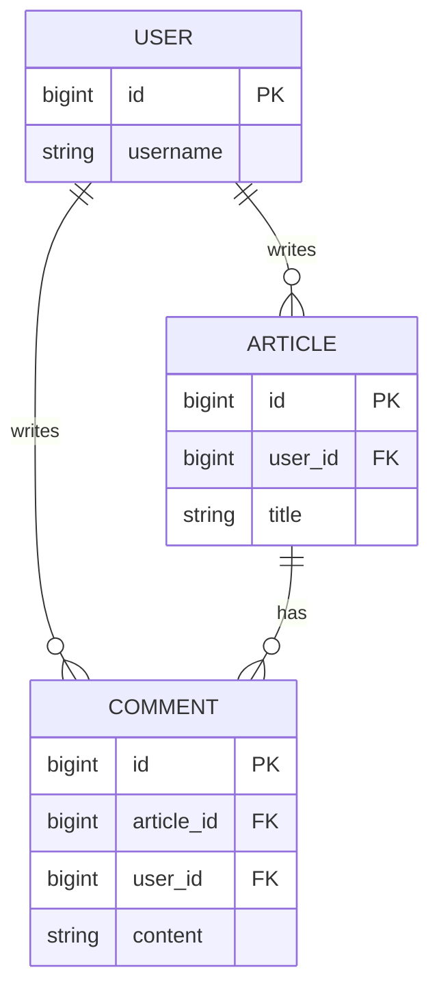
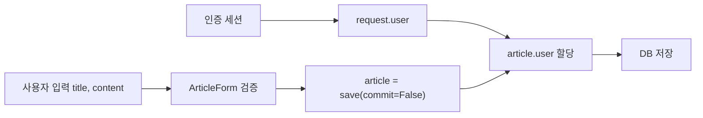
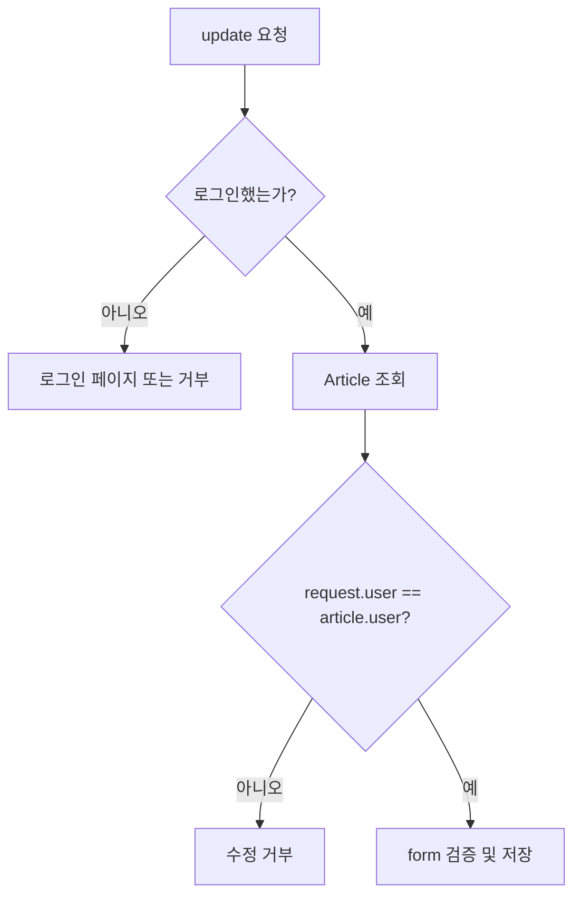

# DB N:1 2: 사용자와 게시글·댓글의 작성자 관계 만들기

- 🎯 글의 목표: Django의 User 모델을 게시글과 댓글에 ForeignKey로 연결하고, 로그인 사용자를 저장하며 작성자만 수정·삭제할 수 있게 보호한다.
- 🧩 핵심 키워드: `AUTH_USER_MODEL`, User-Article, User-Comment, `request.user`, `commit=False`, authorization, `login_required`, `require_POST`, ERD
- ⭐ 중요도: 매우 높음. 인증된 사용자의 행동을 실제 데이터 소유권과 연결하는 Django 애플리케이션의 핵심 단계다.
- 📝 한눈에 보는 내용: 게시글과 댓글에 작성자 FK를 추가하고 migration한 뒤, 생성 view에서 로그인 사용자를 저장하고 수정·삭제 view에서 소유권을 검증한다.
- 🔗 관련 문제 / 주제: Django Authentication, 권한 검사, CRUD, 댓글 작성자, 데이터 모델링, ERD

---

## 1. 들어가며

로그인 기능이 있어도 게시글 행에 작성자 정보가 저장되지 않으면 "누가 쓴 글인가"를 알 수 없다. 화면에 사용자 이름을 임시로 표시하는 것만으로는 소유권이 생기지 않으며, 수정과 삭제 권한도 판단할 수 없다.

사용자 한 명은 여러 게시글을 작성할 수 있고, 게시글 하나의 작성자는 한 명이다. 사용자와 댓글도 같은 N:1 관계다. 따라서 Article과 Comment에 User를 참조하는 ForeignKey를 두면 작성자 정보를 데이터베이스 수준에서 연결할 수 있다.

이번 강의는 관계 필드 추가에서 한 단계 더 나아간다. 생성 시 `request.user`를 직접 저장하고, 화면에서 버튼을 숨기는 것과 별개로 view에서도 작성자를 검사한다. 여기서 인증(authentication)과 인가(authorization)의 차이가 실제 코드로 드러난다.

## 2. 핵심 개념 정리

이 강의가 해결하는 질문은 "로그인한 사용자의 행동을 데이터 소유권으로 어떻게 기록하고 보호할 것인가"이다.

먼저 Article과 User 사이에 N:1 관계를 만든다. User 모델은 프로젝트에서 교체될 수 있으므로 모델 필드 선언에는 `settings.AUTH_USER_MODEL`을 사용한다. form에는 작성자 선택 필드를 노출하지 않고, view가 `request.user`를 저장한다.

그다음 수정과 삭제에서 `request.user == article.user`인지 확인한다. 템플릿의 조건문은 사용자 경험을 위한 표시 제어이고, view의 조건문은 실제 권한 보호다. 같은 패턴을 Comment와 User 관계에도 적용한 뒤, decorator와 ERD로 전체 구조를 정리한다.



Comment를 기준으로 보면 Article과 User 두 곳으로 각각 N:1 정참조가 있다. 하나는 "어느 게시글의 댓글인가"를, 다른 하나는 "누가 작성한 댓글인가"를 나타낸다.

## 3. 본문 정리

### 3.1 User와 Article의 N:1 관계

사용자 한 명은 글을 여러 개 쓸 수 있지만, 게시글 한 개의 작성자는 한 명이다. 따라서 Article이 N, User가 1이며 외래 키는 Article 모델에 둔다.


```python
# articles/models.py
from django.conf import settings
from django.db import models


class Article(models.Model):
    # 실행 중인 프로젝트가 사용하는 User 모델을 문자열 참조로 연결한다.
    user = models.ForeignKey(
        settings.AUTH_USER_MODEL,
        on_delete=models.CASCADE,
    )
    title = models.CharField(max_length=100)
    content = models.TextField()
    created_at = models.DateTimeField(auto_now_add=True)
    updated_at = models.DateTimeField(auto_now=True)
```

`settings.AUTH_USER_MODEL`은 기본 `auth.User`인지 커스텀 User인지에 관계없이 현재 프로젝트의 사용자 모델을 가리킨다. 모델 필드 선언 시점에는 이 설정을 사용하는 것이 Django가 권장하는 교체 가능한 관계 방식이다.

User 모델을 참조하는 대표 방식은 사용 위치가 다르다.

| 사용 위치 | 방식 | 이유 |
|---|---|---|
| 모델 필드 선언 | `settings.AUTH_USER_MODEL` | migration이 사용할 지연된 모델 참조 |
| view 등 실행 코드 | `get_user_model()` | 현재 활성 User 클래스 반환 |
| 현재 요청 사용자 | `request.user` | 인증 미들웨어가 확인한 사용자 객체 |

세 표현이 모두 User를 가리키지만 역할은 다르다. 모델 선언 코드에 특정 `User` 클래스를 직접 import하면 나중에 커스텀 User로 교체할 때 관계가 깨질 수 있다.

게시글이 삭제된다고 사용자가 삭제되어서는 안 된다. 관계의 삭제 방향은 "참조 대상 User가 삭제될 때 Article을 어떻게 할 것인가"다. `CASCADE`를 선택하면 사용자가 삭제될 때 그 사용자의 게시글도 삭제된다.

⚠️ 주의: `on_delete`의 방향을 반대로 이해하기 쉽다. Article의 `user` FK에서 CASCADE는 게시글 삭제가 사용자를 지운다는 뜻이 아니라, 참조하는 사용자가 지워질 때 게시글도 함께 처리된다는 뜻이다.

### 3.2 필수 작성자 필드를 추가할 때 migration 문제

이미 게시글 데이터가 있는 상태에서 null을 허용하지 않는 `user` 필드를 추가하면 기존 행의 작성자를 결정해야 한다. Django는 기존 행에 넣을 기본값을 요구한다.


학습 프로젝트에서는 DB를 초기화한 뒤 migration을 다시 적용할 수 있다. 데이터를 유지해야 한다면 다음과 같은 단계가 안전하다.

1. 임시로 `null=True`인 user FK를 추가한다.
2. 데이터 migration이나 관리 명령으로 기존 게시글의 작성자를 채운다.
3. 모든 행에 user가 생겼는지 검증한다.
4. `null=False`로 변경하는 migration을 적용한다.

일회성 기본값으로 특정 사용자 PK를 넣는 방법은 빠르지만, 실제 작성자 정보가 없다는 사실을 감춘다. 운영 데이터에서는 데이터의 의미와 복구 방안을 먼저 정해야 한다.

커스텀 User 모델을 사용할 프로젝트라면 일반적으로 첫 migration 전에 `AUTH_USER_MODEL` 설정을 마치는 것이 좋다. 프로젝트 중간에 User 모델을 교체하면 이미 연결된 FK와 migration 의존성을 함께 바꿔야 하므로 작업이 훨씬 복잡해진다.

### 3.3 ArticleForm에는 작성자 선택을 노출하지 않는다

작성자는 사용자가 form에서 선택하는 값이 아니라, 인증을 통과한 현재 요청의 사용자다. ArticleForm에서 `user`를 제외하면 악의적인 사용자가 다른 사용자의 PK를 보내 작성자를 위조하는 일을 막을 수 있다.

```python
# articles/forms.py
from django import forms

from .models import Article


class ArticleForm(forms.ModelForm):
    class Meta:
        model = Article
        # user는 서버가 request.user로 채운다.
        fields = ('title', 'content')
```

form이 화면에 없다고 해서 보안이 완성되는 것은 아니지만, 애초에 클라이언트 입력으로 받을 필요가 없는 값을 명확히 분리한다. 신뢰할 수 없는 입력은 form이 검증하고, 인증 문맥은 view가 채운다.

`fields = '__all__'`을 사용하면 나중에 모델에 `user`가 추가되었을 때 작성자 선택 필드까지 자동으로 노출될 수 있다. 학습 단계에서도 사용자가 입력해야 하는 필드를 명시적으로 나열하면 데이터의 출처가 분명해진다.

### 3.4 게시글 생성 시 request.user 저장하기

`ArticleForm`에는 user가 없으므로 검증된 form을 바로 저장할 수 없다. 댓글 생성과 마찬가지로 `commit=False`로 미완성 객체를 만든 뒤 로그인 사용자를 넣는다.


```python
# articles/views.py
from django.contrib.auth.decorators import login_required
from django.shortcuts import redirect, render

from .forms import ArticleForm


@login_required
def create(request):
    if request.method == 'POST':
        article_form = ArticleForm(request.POST)

        if article_form.is_valid():
            # title과 content가 채워진 객체를 아직 INSERT하지 않는다.
            article = article_form.save(commit=False)

            # 로그인 세션에서 확인된 사용자를 작성자로 연결한다.
            article.user = request.user
            article.save()

            return redirect('articles:detail', article.pk)
    else:
        article_form = ArticleForm()

    context = {'article_form': article_form}
    return render(request, 'articles/create.html', context)
```

`@login_required`가 없으면 익명 사용자의 `request.user`는 `AnonymousUser`이며 ForeignKey에 저장할 수 없다. 글쓰기 페이지 진입과 POST 처리 모두 로그인 사용자만 가능하도록 view 자체를 보호한다.

입력과 책임을 나누어 보면 흐름이 명확하다.

- `title`, `content`: 사용자가 보내고 ModelForm이 검증한다.
- `user`: 로그인 세션을 검증한 Django가 `request.user`로 제공한다.
- `created_at`: 모델의 `auto_now_add`가 저장 시점에 채운다.

📌 핵심: 작성자를 클라이언트가 보낸 PK로 정하지 말고, 서버가 인증한 `request.user`로 정한다.



이 흐름은 필드마다 신뢰할 수 있는 출처가 다르다는 점을 보여 준다. 제목과 본문은 사용자의 입력이므로 form 검증을 거치고, 작성자는 서버가 인증한 세션에서 가져온다.

### 3.5 템플릿에서 작성자 정보와 버튼 표시하기

ForeignKey가 연결되면 `article.user`로 작성자 객체에 정참조할 수 있다. 템플릿에서는 작성자 이름을 보여 주고, 현재 사용자가 작성자일 때만 수정·삭제 UI를 표시한다.

```django
<h1>{{ article.title }}</h1>
<p>작성자: {{ article.user.username }}</p>
<p>{{ article.content }}</p>


  <a href="">수정</a>

  <form action="" method="POST">
    
    <button type="submit">삭제</button>
  </form>

```

이 조건은 다른 사용자에게 실행할 수 없는 버튼을 보여주지 않는 UI 처리다. 하지만 사용자는 주소를 직접 입력하거나 별도 HTTP 요청을 보낼 수 있으므로, 템플릿 조건만으로 권한을 보호할 수 없다.

템플릿 조건이 필요한 이유도 있다. 권한이 없는 버튼을 숨기면 사용자가 실행할 수 없는 기능을 눌렀다가 실패하는 혼란을 줄인다. 다만 이것은 보안 검사를 대신하지 않고 서버 검사와 함께 사용한다.

### 3.6 수정은 대상 조회와 권한 검사를 모두 통과해야 한다

update view는 게시글 존재 여부, 로그인 여부, 작성자 일치 여부를 차례로 확인해야 한다. 권한이 없으면 수정 form을 보여 주어서도, POST 내용을 저장해서도 안 된다.


```python
from django.contrib.auth.decorators import login_required
from django.shortcuts import get_object_or_404, redirect, render

from .forms import ArticleForm
from .models import Article


@login_required
def update(request, article_pk):
    article = get_object_or_404(Article, pk=article_pk)

    # 로그인만으로는 부족하다. 이 게시글의 작성자인지도 확인한다.
    if request.user != article.user:
        return redirect('articles:index')

    if request.method == 'POST':
        # instance를 주어야 새 글 생성이 아니라 기존 글 수정이 된다.
        article_form = ArticleForm(request.POST, instance=article)
        if article_form.is_valid():
            article_form.save()
            return redirect('articles:detail', article.pk)
    else:
        article_form = ArticleForm(instance=article)

    context = {
        'article': article,
        'article_form': article_form,
    }
    return render(request, 'articles/update.html', context)
```

⚠️ 주의: `@login_required`는 "누구인지 확인된 사용자"라는 인증만 보장한다. "이 글을 수정할 권한이 있는 사용자"라는 인가는 `request.user == article.user` 같은 추가 검사로 구현한다.

인증과 인가를 요청 흐름으로 나누면 다음과 같다.



두 조건의 순서를 나누어 보면 `login_required` 하나만으로 소유권이 보호되지 않는 이유가 분명해진다.

### 3.7 삭제는 POST로 제한하고 작성자를 다시 검사한다

삭제는 되돌리기 어려운 상태 변경이다. 링크를 방문하는 GET 요청으로 실행하면 미리보기 봇이나 실수로도 데이터가 삭제될 수 있다. POST로 제한하고 CSRF 및 작성자 검사를 함께 사용한다.


```python
from django.contrib.auth.decorators import login_required
from django.shortcuts import get_object_or_404, redirect
from django.views.decorators.http import require_POST


@login_required
@require_POST
def delete(request, article_pk):
    article = get_object_or_404(Article, pk=article_pk)

    # 작성자가 맞을 때만 실제 DELETE 쿼리를 실행한다.
    if request.user == article.user:
        article.delete()

    return redirect('articles:index')
```

`@require_POST`는 허용하지 않은 method에 405 응답을 돌려준다. URL을 알고 있어도 GET으로는 삭제할 수 없으며, POST 요청은 CSRF 토큰과 권한 검사를 모두 통과해야 한다.

### 3.8 User와 Comment 관계도 같은 원리로 확장한다

댓글도 작성자가 필요하다. Comment는 Article에 속하면서 동시에 User가 작성하므로 두 개의 N:1 관계를 가진다.


```python
# articles/models.py
class Comment(models.Model):
    # 댓글이 속한 게시글
    article = models.ForeignKey(
        Article,
        on_delete=models.CASCADE,
    )

    # 댓글을 작성한 사용자
    user = models.ForeignKey(
        settings.AUTH_USER_MODEL,
        on_delete=models.CASCADE,
    )

    content = models.CharField(max_length=200)
    created_at = models.DateTimeField(auto_now_add=True)
    updated_at = models.DateTimeField(auto_now=True)
```

댓글 생성에서는 form이 `content`만 검증하고, view가 Article과 User 두 관계를 모두 채운다.

```python
@login_required
@require_POST
def comments_create(request, article_pk):
    article = get_object_or_404(Article, pk=article_pk)
    comment_form = CommentForm(request.POST)

    if comment_form.is_valid():
        comment = comment_form.save(commit=False)

        # URL 문맥에서 게시글을, 인증 문맥에서 작성자를 가져온다.
        comment.article = article
        comment.user = request.user
        comment.save()

    return redirect('articles:detail', article.pk)
```

댓글 삭제도 `request.user == comment.user`인지 검사해야 한다. 게시글 작성자와 댓글 작성자는 서로 다를 수 있으므로 `article.user`를 검사하면 댓글 소유권을 잘못 판단한다.

```python
@login_required
@require_POST
def comments_delete(request, article_pk, comment_pk):
    # article_pk 조건까지 함께 사용해 URL 관계도 검증한다.
    comment = get_object_or_404(
        Comment,
        pk=comment_pk,
        article_id=article_pk,
    )

    # 댓글의 소유자는 comment.user다.
    if request.user == comment.user:
        comment.delete()

    return redirect('articles:detail', article_pk)
```

`comment_pk`만 조회하면 다른 게시글의 댓글 PK를 현재 article URL에 넣어도 객체가 찾아질 수 있다. `article_id=article_pk` 조건을 함께 사용하면 URL이 표현하는 부모-자식 관계까지 검증할 수 있다.

### 3.9 decorator로 요청의 전제 조건 표현하기

view 본문에서 모든 조건을 중첩해 처리할 수도 있지만, Django decorator를 사용하면 함수가 받아들일 요청의 전제를 위에 분명하게 표시할 수 있다.


| decorator | 보장하는 전제 |
|---|---|
| `@login_required` | 인증된 사용자만 view에 진입 |
| `@require_POST` | POST 요청만 허용 |
| `@require_http_methods(['GET', 'POST'])` | 지정한 method만 허용 |
| `@require_safe` | 조회 목적의 GET·HEAD만 허용 |

decorator의 순서와 적용 범위도 읽어야 한다. 삭제 view라면 로그인과 POST 둘 다 필요한 반면, 목록 조회는 익명 사용자의 안전한 GET을 허용할 수 있다. 모든 view에 같은 decorator를 붙이는 것이 아니라 기능의 의미에 맞춰 선택한다.

HTTP method를 기능 의미와 연결하면 선택이 쉽다.

| 기능 | 허용 method | 이유 |
|---|---|---|
| 목록·상세 조회 | GET | 서버 상태를 변경하지 않음 |
| 생성 form 표시와 저장 | GET, POST | 표시와 저장 두 흐름이 한 view에 있음 |
| 삭제 | POST | 상태 변경이며 재요청에 주의해야 함 |
| 좋아요·팔로우 토글 | POST | 관계 데이터 변경 |

GET 요청은 안전하고 반복 가능하다는 전제를 가져야 한다. 주소를 방문하는 것만으로 데이터가 삭제되거나 관계가 바뀌지 않게 한다.

### 3.10 ERD로 전체 관계 읽기

ERD(Entity Relationship Diagram)는 엔터티, 속성, 관계를 한눈에 표현한다. 이번 단계의 핵심 엔터티는 User, Article, Comment다.


- User 1명은 Article을 0개 이상 작성할 수 있다.
- Article 1개는 반드시 User 1명을 작성자로 가진다.
- Article 1개는 Comment를 0개 이상 가질 수 있다.
- Comment 1개는 Article 1개와 User 1명에 속한다.

까마귀 발 표기에서 갈라진 발 모양은 many를 나타낸다. ERD를 읽을 때는 선만 보지 말고 "한 사용자는 여러 게시글을 작성한다"처럼 자연어 문장으로 바꾸면 FK 위치와 null 허용 여부를 판단하기 쉬워진다.

ERD의 관계를 읽을 때는 최소 개수와 최대 개수를 함께 본다.

- `||`는 정확히 하나를 뜻한다.
- `o|`는 0 또는 1을 뜻한다.
- `|{`는 1개 이상을 뜻한다.
- `o{`는 0개 이상을 뜻한다.

이번 모델에서 새 User는 작성한 Article이 0개일 수 있으므로 User에서 Article 방향은 0개 이상이다. 반면 null을 허용하지 않는 `Article.user`는 각 게시글이 작성자 정확히 한 명을 가져야 한다.

### 3.11 한 요청에서 객체 존재와 권한을 구분하기

권한이 필요한 view는 보통 두 질문을 처리한다.

1. 요청한 PK의 객체가 존재하는가.
2. 현재 사용자가 그 객체를 변경할 수 있는가.

`get_object_or_404`는 첫 번째 질문을 처리하고, 작성자 비교는 두 번째 질문을 처리한다. 존재하지 않는 객체와 권한 없는 객체를 같은 문제로 섞지 않으면 코드의 책임이 선명해진다.

인가 실패 시 단순 redirect, 403 응답, 메시지 표시 중 어떤 방식을 선택할지는 프로젝트 정책에 따라 달라진다. 중요한 점은 권한 없는 요청에서 저장이나 삭제 코드에 도달하지 않는 것이다.

## 4. 적용 관점에서 다시 보기

사용자 소유 콘텐츠를 구현할 때는 생성, 표시, 변경, 삭제 전 과정에서 같은 관계를 일관되게 사용한다.

1. 모델에서는 콘텐츠 N 쪽에 User ForeignKey를 선언한다.
2. form에서는 작성자 필드를 제외한다.
3. 생성 view는 `commit=False` 뒤 `request.user`를 저장한다.
4. 템플릿은 작성자와 현재 사용자가 같을 때만 관리 UI를 표시한다.
5. 수정·삭제 view는 UI와 별개로 소유권을 다시 검사한다.
6. 상태 변경 요청은 POST로 제한하고 CSRF 보호를 유지한다.
7. ERD와 ORM 조회로 전체 관계 방향을 검토한다.

"로그인 사용자만 가능"은 인증 요구이고, "자신이 작성한 글만 가능"은 인가 요구다. 요구사항에 소유권 표현이 보이면 두 검사가 모두 필요한지 확인해야 한다.

## 5. 배운 점 / 확장 포인트

### 5.1 이번 강의 이전에 몰랐던 것 또는 새로 이해된 것

로그인 상태와 데이터 소유권은 자동으로 연결되지 않는다. `request.user`를 ForeignKey에 저장하고, 변경 시 다시 비교해야 비로소 사용자 행동이 권한 있는 데이터 작업이 된다.

### 5.2 앞으로 이어지는 연결점

사용자와 게시글 사이에는 작성 관계 외에도 좋아요처럼 별도의 의미를 가진 관계가 생긴다. 동일한 두 모델 사이에 여러 관계가 존재하면 `related_name`과 N:M 중개 테이블의 의미가 중요해진다.

### 5.3 더 파볼 만한 주제

class-based view의 `UserPassesTestMixin`, 객체 단위 permission, soft delete, 작성자 삭제 시 보존 정책, 감사 로그를 이어서 살펴볼 수 있다.

## 6. 요약 정리

- Article과 Comment는 각각 User를 참조하는 N:1 관계를 가질 수 있다.
- 모델 관계에는 교체 가능한 User 모델을 가리키는 `settings.AUTH_USER_MODEL`을 사용한다.
- 작성자는 form 입력이 아니라 서버가 인증한 `request.user`로 저장한다.
- `@login_required`는 인증을, 작성자 비교는 객체 수준의 인가를 담당한다.
- 템플릿의 버튼 숨김은 UX이고, 실제 보안은 view의 권한 검사다.
- 삭제 같은 상태 변경은 POST로 제한하고 CSRF 보호를 유지한다.

🧠 기억할 것: **인증은 사용자가 누구인지 확인하고, 인가는 그 사용자가 이 객체를 바꿀 수 있는지 확인한다.**

## 7. 미니 퀴즈 또는 체크리스트

- [ ] 모델 ForeignKey에 `settings.AUTH_USER_MODEL`을 사용하는 이유를 설명할 수 있는가?
- [ ] ArticleForm에서 user를 제외하고 view에서 저장해야 하는 이유를 설명할 수 있는가?
- [ ] 템플릿 조건문만으로 수정·삭제 권한을 보호할 수 없는 이유를 설명할 수 있는가?
- [ ] `@login_required`와 작성자 비교가 각각 인증과 인가 중 무엇을 담당하는지 구분할 수 있는가?
- [ ] User-Article-Comment 관계를 자연어와 ERD 방향으로 설명할 수 있는가?
