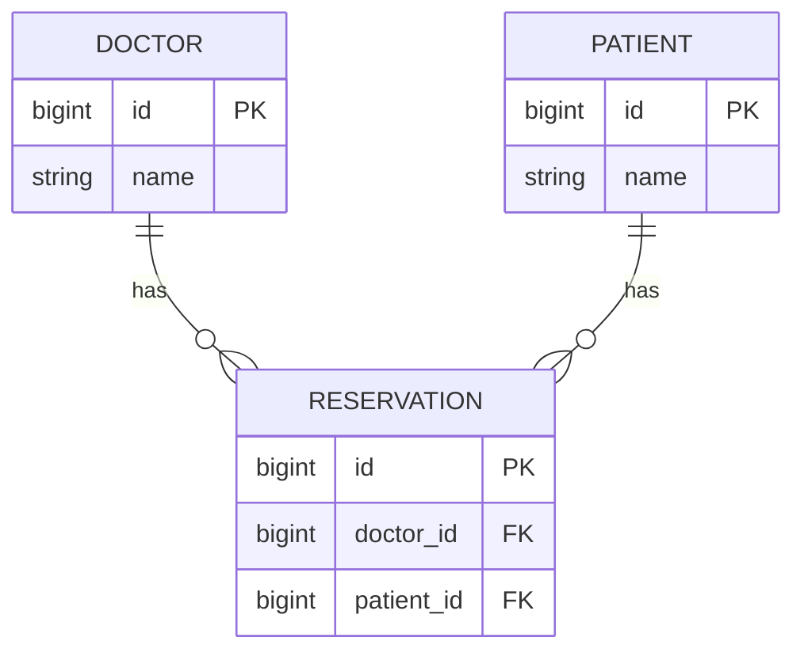
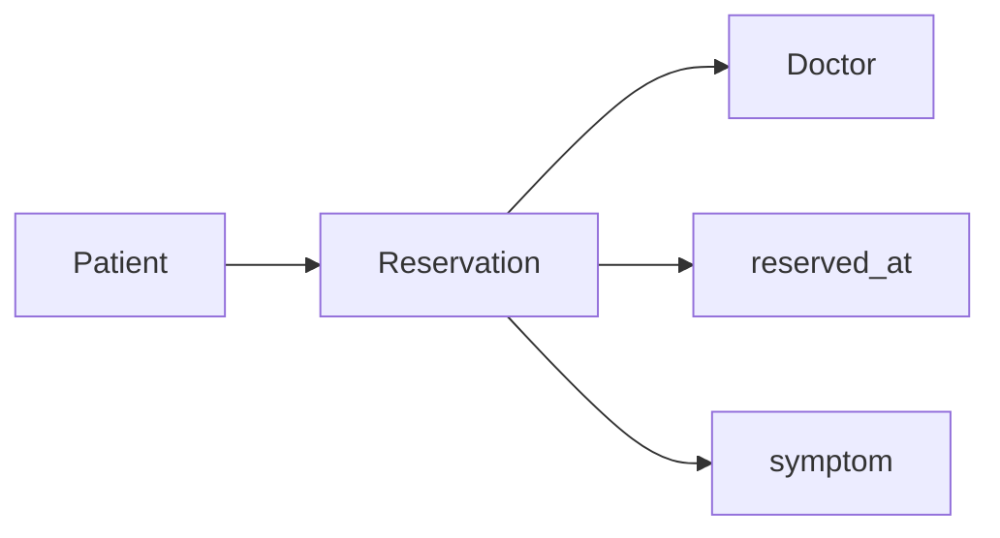

# DB N:M 1: 중개 테이블에서 좋아요 관계까지

- 🎯 글의 목표: N:1만으로 표현하기 어려운 다대다 관계를 이해하고, Django `ManyToManyField`와 중개 모델로 관계를 생성·조회·삭제한다.
- 🧩 핵심 키워드: N:M, intermediary table, `ManyToManyField`, related manager, `add`, `remove`, `through`, `symmetrical`, `related_name`, likes
- ⭐ 중요도: 매우 높음. 좋아요, 예약, 수강 신청, 태그처럼 양쪽이 여러 대상을 가질 수 있는 기능의 데이터 모델링 기반이다.
- 📝 한눈에 보는 내용: 의사-환자 관계에서 N:1의 한계를 확인하고 중개 모델을 도입한 뒤, `ManyToManyField`의 자동 중개 테이블과 추가 정보가 필요한 `through` 모델을 비교해 좋아요 기능에 적용한다.
- 🔗 관련 문제 / 주제: 데이터 모델링, 예약 시스템, 좋아요, 팔로우, 관계 manager, 역참조 이름 충돌

---

## 1. 들어가며

ForeignKey는 여러 객체가 하나의 객체를 참조하는 N:1 관계를 잘 표현한다. 하지만 환자 한 명이 여러 의사에게 진료받고 의사 한 명도 여러 환자를 담당할 수 있다면 어느 한쪽에 FK 하나를 두는 것만으로는 관계를 모두 저장할 수 없다.

N:M 관계는 실제 데이터베이스에서 두 테이블 사이의 세 번째 테이블로 풀어낸다. 이 중개 테이블의 한 행은 "의사 A와 환자 B가 연결되어 있다"는 관계 하나를 기록한다. Django의 `ManyToManyField`는 이 구조를 자동으로 만들고, `add()`와 `remove()` 같은 관계 중심 API를 제공한다.

이번 강의는 자동화된 문법만 외우지 않고 중개 테이블의 필요성부터 출발한다. 그래야 예약 시각이나 증상처럼 관계 자체에 추가 데이터가 생겼을 때 왜 직접 중개 모델을 선언해야 하는지 설명할 수 있다.

## 2. 핵심 개념 정리

이 강의가 해결하는 질문은 "양쪽 모두 여러 객체와 연결될 수 있는 관계를 행 단위로 어떻게 기록할 것인가"이다.

먼저 Doctor-Patient 예제로 ForeignKey 하나의 한계를 확인하고, Reservation 중개 모델을 직접 만들어 관계를 저장한다. 이어서 `ManyToManyField`가 자동으로 생성하는 중개 테이블과 related manager를 살펴본다.

관계에 추가 속성이 필요하면 `through`로 직접 만든 중개 모델을 연결한다. 자기 자신을 참조하는 N:M에서 `symmetrical` 옵션을 이해한 뒤, Article-User 좋아요 관계에서 `related_name` 충돌을 해결하고 토글 view를 완성한다.



Doctor와 Patient를 직접 선 하나로만 연결하는 대신 Reservation을 독립된 엔터티로 보면 구조가 분명해진다. Doctor-Reservation은 1:N, Patient-Reservation도 1:N이며, 두 관계를 합쳐 Doctor-Patient N:M을 표현한다.

## 3. 본문 정리

### 3.1 N:1 하나로는 다대다 관계를 표현할 수 없다

환자 모델에 Doctor ForeignKey 하나를 두면 환자 한 명은 의사 한 명만 참조할 수 있다. 두 번째 의사와의 관계를 저장하려면 컬럼을 계속 추가해야 하고, 의사 수가 달라질 때마다 스키마가 바뀐다.


```python
class Doctor(models.Model):
    name = models.TextField()


class Patient(models.Model):
    # 이 구조에서는 환자 한 명이 의사 한 명만 가리킬 수 있다.
    doctor = models.ForeignKey(
        Doctor,
        on_delete=models.CASCADE,
    )
    name = models.TextField()
```

Doctor 쪽에 Patient ForeignKey를 두어도 반대 문제가 생긴다. 관계의 어느 쪽도 "하나만" 참조하는 구조가 아니므로, 한쪽 테이블의 단일 FK 컬럼으로 해결할 수 없다.

N:M 관계를 자연어로 읽으면 판단이 쉽다.

- 한 의사는 여러 환자를 담당할 수 있다.
- 한 환자는 여러 의사에게 진료받을 수 있다.

두 문장 모두 "여러"가 나오므로 별도의 관계 저장 공간이 필요하다.

FK 컬럼을 여러 개 추가하는 방식이 잘못된 이유도 확인해 보자.

```text
Patient
id | name | doctor1_id | doctor2_id | doctor3_id | ...
```

이 구조는 환자마다 의사 수가 달라질 수 있다는 사실을 표현하지 못한다. 새로운 의사 관계가 필요할 때마다 테이블 컬럼을 바꿔야 하고, 사용하지 않는 빈 컬럼도 늘어난다. 관계를 행으로 분리하면 연결 수가 늘어날 때 Reservation 행만 추가하면 된다.

### 3.2 중개 모델은 관계 하나를 행 하나로 저장한다

Doctor와 Patient 사이에 Reservation 모델을 두면 예약 한 건이 두 객체의 연결을 나타낸다. Reservation은 Doctor 하나와 Patient 하나를 각각 ForeignKey로 참조한다.


```python
# hospitals/models.py
from django.db import models


class Doctor(models.Model):
    name = models.TextField()


class Patient(models.Model):
    name = models.TextField()


class Reservation(models.Model):
    # 예약 한 건은 의사 한 명과 연결된다.
    doctor = models.ForeignKey(
        Doctor,
        on_delete=models.CASCADE,
    )

    # 같은 예약 한 건은 환자 한 명과도 연결된다.
    patient = models.ForeignKey(
        Patient,
        on_delete=models.CASCADE,
    )
```

```python
doctor1 = Doctor.objects.create(name='alice')
patient1 = Patient.objects.create(name='carol')

# 중개 테이블에 의사-환자 연결 한 건을 저장한다.
reservation = Reservation.objects.create(
    doctor=doctor1,
    patient=patient1,
)
```

의사 한 명과 환자 한 명의 연결이 늘어날 때 Reservation 행만 추가하면 된다. Doctor와 Patient 테이블의 컬럼 수는 변하지 않는다. 데이터베이스 관점에서 N:M은 결국 중개 테이블을 사이에 둔 두 개의 N:1 관계다.

중개 테이블은 같은 연결이 중복 저장되지 않도록 제약을 둘 수도 있다.

```python
class Reservation(models.Model):
    doctor = models.ForeignKey(Doctor, on_delete=models.CASCADE)
    patient = models.ForeignKey(Patient, on_delete=models.CASCADE)

    class Meta:
        constraints = [
            models.UniqueConstraint(
                fields=('doctor', 'patient'),
                name='unique_doctor_patient',
            ),
        ]
```

예약이 날짜별로 여러 번 가능하다면 단순한 두 FK 조합을 unique로 만들면 안 된다. 어떤 조합이 한 번만 존재해야 하는지는 서비스 규칙에 따라 결정한다. 이 예시는 "중개 행도 하나의 데이터이므로 제약 조건을 가질 수 있다"는 점을 보여 준다.

📌 핵심: N:M 관계는 "목록을 한 컬럼에 저장"하는 방식이 아니라, **연결 한 건을 중개 테이블의 행 하나로 저장**하는 방식이다.

### 3.3 ManyToManyField가 자동 중개 테이블을 만든다

관계 자체에 추가 정보가 없다면 Reservation 모델을 매번 직접 작성하지 않아도 된다. `ManyToManyField`를 선언하면 Django가 두 FK를 가진 중개 테이블을 자동으로 생성한다.


```python
class Doctor(models.Model):
    name = models.TextField()


class Patient(models.Model):
    # 환자가 여러 의사와 연결될 수 있음을 객체 관계로 선언한다.
    doctors = models.ManyToManyField(Doctor)
    name = models.TextField()
```

실제 Patient 테이블에 `doctors` 컬럼이 생기는 것은 아니다. Django는 앱 이름과 모델 이름을 조합한 별도의 중개 테이블을 만들고, 그곳에 `patient_id`, `doctor_id`를 저장한다.

```python
doctor1 = Doctor.objects.create(name='alice')
patient1 = Patient.objects.create(name='carol')

# patient1과 doctor1의 관계 행을 중개 테이블에 추가한다.
patient1.doctors.add(doctor1)

# 환자에서 의사 목록으로 정참조한다.
patient1.doctors.all()

# 의사에서 환자 목록으로 역참조한다.
doctor1.patient_set.all()

# 관계 행만 제거하며 Doctor와 Patient 객체는 삭제하지 않는다.
patient1.doctors.remove(doctor1)
```

`add()`와 `remove()`는 상대 모델의 행을 생성하거나 삭제하는 메서드가 아니다. 중개 테이블의 연결 행을 추가하거나 제거한다. 의사와 환자 객체는 그대로 남는다.

ManyToMany related manager에는 관계 집합을 다루는 여러 메서드가 있다.

| 메서드 | 관계에 미치는 영향 |
|---|---|
| `add(obj)` | 대상과의 연결 추가 |
| `remove(obj)` | 특정 연결 제거 |
| `set(iterable)` | 관계 집합을 전달한 목록으로 교체 |
| `clear()` | 현재 객체의 모든 관계 제거 |
| `all()` | 연결된 객체 조회 |

```python
patient1.doctors.add(doctor1, doctor2)
patient1.doctors.remove(doctor1)
patient1.doctors.set([doctor2, doctor3])
patient1.doctors.clear()
```

`set()`과 `clear()`도 Doctor 객체를 삭제하지 않는다. 현재 Patient와 연결된 중개 행만 조정한다.

⚠️ 주의: `ManyToManyField`를 선언한 모델 테이블에 다중 값 컬럼이 생긴다고 생각하기 쉽다. migration 뒤 DB 스키마를 확인해 자동 중개 테이블이 별도로 생겼는지 살펴보면 구조가 분명해진다.

### 3.4 ManyToManyField 선언 위치와 역참조 이름

N:M은 관계 자체로는 방향이 없으므로 두 모델 중 어느 쪽에 `ManyToManyField`를 선언해도 중개 테이블의 의미는 같다. 다만 선언 위치는 ORM에서 정참조 이름과 역참조 이름을 결정하므로 읽기 좋은 쪽을 선택한다.

```python
class Patient(models.Model):
    doctors = models.ManyToManyField(
        Doctor,
        # Doctor에서 역참조할 때 doctor.patients.all()로 읽는다.
        related_name='patients',
    )
    name = models.TextField()
```

```python
patient1.doctors.all()   # 선언한 필드 이름을 사용한 정참조
doctor1.patients.all()   # related_name을 사용한 역참조
```

`related_name`은 단순히 짧은 이름을 만드는 옵션이 아니다. 같은 두 모델 사이에 여러 관계가 있을 때 각 관계의 의미를 구분하고 역참조 충돌을 막는다.

ManyToManyField에서 자주 보는 주요 옵션을 한자리에서 구분하면 다음과 같다.

| 옵션 | 해결하는 질문 |
|---|---|
| `related_name` | 반대쪽 모델에서 이 관계를 어떤 이름으로 조회할 것인가 |
| `symmetrical` | 자기 참조 관계를 반대 방향에도 자동으로 적용할 것인가 |
| `through` | 자동 중개 테이블 대신 어떤 모델을 사용할 것인가 |
| `blank=True` | form 검증에서 관계가 비어 있는 것을 허용할 것인가 |

옵션 이름을 외우기보다 관계의 역방향 이름, 방향성, 추가 데이터라는 설계 질문에 연결해 기억한다.

### 3.5 관계에 추가 데이터가 필요하면 through 모델을 사용한다

자동 중개 테이블은 두 객체의 연결만 저장한다. 예약 시각, 증상, 상태처럼 "두 객체 각각"이 아니라 "이 연결"에 속하는 정보가 필요하면 직접 중개 모델을 선언해야 한다.


```python
class Patient(models.Model):
    doctors = models.ManyToManyField(
        Doctor,
        # Django가 자동 테이블 대신 아래 Reservation을 사용한다.
        through='Reservation',
        related_name='patients',
    )
    name = models.TextField()


class Reservation(models.Model):
    doctor = models.ForeignKey(
        Doctor,
        on_delete=models.CASCADE,
    )
    patient = models.ForeignKey(
        Patient,
        on_delete=models.CASCADE,
    )

    # 이 값들은 의사나 환자 자체가 아니라 예약 관계에 속한다.
    reserved_at = models.DateTimeField()
    symptom = models.TextField()
```

```python
from django.utils import timezone

Reservation.objects.create(
    doctor=doctor1,
    patient=patient1,
    reserved_at=timezone.now(),
    symptom='두통',
)
```

`through`를 사용해도 `patient1.doctors.all()`과 `doctor1.patients.all()`처럼 연결된 객체 목록을 조회할 수 있다. 예약의 추가 필드가 필요할 때는 Reservation QuerySet을 직접 조회한다.

```python
# 환자와 연결된 예약 자체를 조회해 관계의 추가 정보까지 읽는다.
reservations = Reservation.objects.filter(
    patient=patient1,
).select_related('doctor')

for reservation in reservations:
    print(reservation.doctor.name)
    print(reservation.reserved_at)
    print(reservation.symptom)
```

`patient1.doctors.all()`은 연결된 Doctor 객체만 필요할 때 편리하고, `Reservation.objects...`는 예약 시각과 증상처럼 관계의 속성이 필요할 때 사용한다.



⚠️ 주의: 추가 필드가 필수인 through 모델에서는 단순 `add()`만으로 어떤 값을 넣어야 할지 결정할 수 없다. 중개 모델 객체를 직접 만들거나, 지원되는 경우 `through_defaults`로 추가 필드를 제공해야 한다.

### 3.6 자기 자신을 참조하는 N:M과 symmetrical

User가 다른 User를 팔로우하는 관계처럼 모델이 자기 자신을 참조할 수도 있다. 이때 관계가 대칭인지 방향성이 있는지 결정해야 한다.


친구 관계를 "A와 B가 친구면 B와 A도 친구"로 정의한다면 대칭 관계가 자연스럽다. 팔로우는 A가 B를 팔로우해도 B가 A를 자동으로 팔로우하지 않으므로 비대칭 관계다.

```python
class User(AbstractUser):
    followings = models.ManyToManyField(
        'self',
        symmetrical=False,
        related_name='followers',
    )
```

`symmetrical=False`를 지정하면 `user_a.followings.add(user_b)`가 반대 방향 관계를 자동으로 만들지 않는다. `user_b.followers`에서는 자신을 팔로우하는 user_a를 역참조할 수 있다.

대칭 여부는 모델이 자기 자신을 참조한다고 자동으로 정해지는 것이 아니라 관계 의미로 판단한다.

| 관계 | A가 B와 연결되면 B도 A와 연결되는가 | `symmetrical` |
|---|---|---|
| 친구 | 보통 예 | 기본 `True`를 고려 |
| 팔로우 | 아니오 | `False` |
| 차단 | 아니오 | `False` |
| 동료 관계 | 서비스 정의에 따라 다름 | 요구사항에 따라 결정 |

### 3.7 Article과 User 사이의 작성 관계와 좋아요 관계 구분하기

Article과 User는 이미 작성자 관계로 연결되어 있다. Article의 `user` ForeignKey는 소유권 관계다. 좋아요는 한 사용자가 여러 게시글을 좋아하고 게시글 하나도 여러 사용자에게 좋아요를 받을 수 있으므로 별도의 N:M 행동 관계다.


두 관계가 모두 User 쪽에서 기본 역참조 이름을 만들려고 하면 이름 충돌이 발생할 수 있다. 관계의 의미가 드러나는 `related_name`을 지정한다.

충돌이 생기는 과정을 이름으로 풀면 다음과 같다.

```text
Article.user ForeignKey의 기본 역참조
  -> user.article_set

Article.like_users ManyToManyField의 기본 역참조
  -> user.article_set

같은 User 모델에 article_set 두 개를 만들 수 없으므로 충돌
```

좋아요 관계에 `related_name='like_articles'`를 지정하면 작성 관계는 `user.article_set`, 좋아요 관계는 `user.like_articles`로 분리된다.


```python
# articles/models.py
from django.conf import settings
from django.db import models


class Article(models.Model):
    # 소유 관계: 이 사용자가 작성한 게시글
    user = models.ForeignKey(
        settings.AUTH_USER_MODEL,
        on_delete=models.CASCADE,
    )

    # 행동 관계: 이 게시글을 좋아한 사용자들
    like_users = models.ManyToManyField(
        settings.AUTH_USER_MODEL,
        related_name='like_articles',
    )

    title = models.CharField(max_length=100)
    content = models.TextField()
```

```python
article.user                   # 게시글 작성자 한 명
article.like_users.all()       # 게시글을 좋아한 사용자 여러 명
user.article_set.all()         # 사용자가 작성한 게시글
user.like_articles.all()       # 사용자가 좋아한 게시글
```

필드와 역참조 이름을 문장처럼 읽을 수 있으면 관계가 섞이지 않는다. `like_users`는 Article에서 User로, `like_articles`는 User에서 Article로 읽는 이름이다.

📌 핵심: 같은 두 모델이 연결되어 있어도 **작성자와 좋아요는 의미와 cardinality가 다른 별도 관계**다.

### 3.8 좋아요 토글 URL과 view

좋아요 기능은 현재 사용자가 이미 관계에 있으면 제거하고, 없으면 추가하는 토글이다. 상태를 변경하므로 POST로 받고 로그인 사용자만 허용한다.


```python
# articles/urls.py
app_name = 'articles'

urlpatterns = [
    path('<int:article_pk>/likes/', views.likes, name='likes'),
]
```

```python
# articles/views.py
from django.contrib.auth.decorators import login_required
from django.shortcuts import get_object_or_404, redirect
from django.views.decorators.http import require_POST

from .models import Article


@login_required
@require_POST
def likes(request, article_pk):
    article = get_object_or_404(Article, pk=article_pk)

    # 존재 여부만 필요하므로 filter + exists로 확인한다.
    if article.like_users.filter(pk=request.user.pk).exists():
        # 중개 테이블에서 현재 사용자와 게시글의 관계 행을 제거한다.
        article.like_users.remove(request.user)
    else:
        # 중개 테이블에 현재 사용자와 게시글의 관계 행을 추가한다.
        article.like_users.add(request.user)

    return redirect('articles:index')
```

```django
<form action="" method="POST">
  

  
    <button type="submit">좋아요 취소</button>
  
    <button type="submit">좋아요</button>
  
</form>
```

`remove()`는 사용자나 게시글을 삭제하지 않고 중개 테이블의 연결만 제거한다. 이 view가 다음 JavaScript 강의에서 `JsonResponse`를 반환하도록 바뀌면 페이지 새로고침 없는 좋아요가 된다.

좋아요 구현의 데이터 변화를 행 관점에서 보면 더 명확하다.

```text
좋아요 추가
  articles_article_like_users 중개 테이블에
  (article_id=3, user_id=7) 행 INSERT

좋아요 취소
  같은 조건의 중개 행 DELETE

Article 3 행과 User 7 행은 그대로 유지
```

`request.user in article.like_users.all()`은 템플릿에서 현재 상태를 읽기 쉽게 표현한다. view처럼 존재 여부만 필요할 때는 `filter(pk=request.user.pk).exists()`를 사용하면 목적이 더 분명하다.

⚠️ 주의: 좋아요처럼 데이터를 변경하는 작업을 GET 링크로 만들면 URL 방문만으로 상태가 바뀐다. POST form, CSRF, 로그인 검사를 함께 사용한다.

### 3.9 N:M 모델 변경과 migration 확인

`ManyToManyField`를 추가한 뒤에도 `makemigrations`와 `migrate`가 필요하다. 이 migration은 기존 Article 테이블에 여러 값 컬럼을 추가하는 것이 아니라 별도의 중개 테이블을 만든다.

```bash
python manage.py makemigrations
python manage.py migrate
```

적용 뒤에는 Django shell이나 DB viewer에서 다음을 확인해 볼 수 있다.

- Article과 User를 연결하는 중개 테이블이 생성되었는가.
- 중개 테이블에 두 FK 컬럼이 있는가.
- `article.like_users.add(user)` 뒤 연결 행이 생기는가.
- 같은 관계를 다시 추가했을 때 중복 행이 생기지 않는가.
- `remove()` 뒤 연결 행만 사라지는가.

모델 API와 실제 테이블 변화를 함께 확인하면 ManyToManyField를 추상적인 목록 필드로 오해하지 않게 된다.

### 3.10 관계 모델링을 결정하는 질문 순서

새 관계를 설계할 때는 코드보다 먼저 다음 질문에 답한다.

1. A 하나가 B 몇 개와 연결되는가.
2. B 하나가 A 몇 개와 연결되는가.
3. 한쪽만 여러 개면 ForeignKey로 충분한가.
4. 양쪽 모두 여러 개면 중개 테이블이 필요한가.
5. 관계에 추가 속성이 있는가.
6. 자기 참조라면 방향성이 있는가.
7. 같은 모델 사이에 다른 의미의 관계가 이미 있는가.

이 질문의 답이 나온 뒤 `ForeignKey`, 자동 `ManyToManyField`, `through` 중에서 알맞은 도구를 선택한다. 필드부터 작성하고 관계 의미를 나중에 맞추면 역참조 이름과 중개 모델 구조가 쉽게 꼬인다.

## 4. 적용 관점에서 다시 보기

N:M 관계를 설계할 때는 다음 질문을 순서대로 던진다.

1. 양쪽 객체가 모두 상대방 여러 개와 연결될 수 있는가.
2. 연결 자체에 시각, 상태, 수량 같은 추가 속성이 필요한가.
3. 추가 속성이 없다면 `ManyToManyField`의 자동 중개 테이블을 사용할 수 있는가.
4. 추가 속성이 있다면 명시적 중개 모델과 `through`가 필요한가.
5. 자기 참조라면 관계가 대칭인지 방향성이 있는가.
6. 같은 모델 사이에 다른 관계가 이미 있어 `related_name` 충돌이 생기지 않는가.
7. 관계 변경은 `add`·`remove`, 객체 삭제는 `delete`라는 차이를 지키는가.

좋아요, 태그, 수강 신청, 프로젝트 멤버처럼 "A 여러 개와 B 여러 개"라는 요구가 보이면 중개 테이블을 떠올린다. 그 연결에 역할이나 생성 시각이 필요하다는 문장이 추가되면 직접 중개 모델을 설계한다.

## 5. 배운 점 / 확장 포인트

### 5.1 이번 강의 이전에 몰랐던 것 또는 새로 이해된 것

`ManyToManyField`는 목록을 한 컬럼에 저장하는 편의 문법이 아니라 중개 테이블을 ORM으로 관리하는 추상화다. 이 구조를 알면 `add()`가 실제로 어떤 데이터를 바꾸는지 설명할 수 있다.

### 5.2 앞으로 이어지는 연결점

좋아요와 자기 참조의 개념은 팔로우 기능으로 이어진다. N:M 데이터가 많아지면 목록 화면에서 관련 객체를 반복 조회하는 N+1 문제가 생기므로 `prefetch_related`도 함께 필요해진다.

### 5.3 더 파볼 만한 주제

중개 모델의 `UniqueConstraint`, 관계 생성 시 동시성, `through_fields`, M2M signal, `Prefetch` 객체를 이용한 관련 데이터 최적화를 더 살펴볼 수 있다.

## 6. 요약 정리

- N:M 관계는 중개 테이블의 행으로 두 객체의 연결을 저장한다.
- `ManyToManyField`는 자동 중개 테이블과 관계 manager를 제공한다.
- `add()`와 `remove()`는 연결을 변경하며 대상 객체 자체를 삭제하지 않는다.
- 관계에 추가 속성이 있으면 직접 중개 모델을 만들고 `through`로 연결한다.
- 자기 참조 관계의 방향성은 `symmetrical`로 결정한다.
- 동일한 두 모델 사이에 여러 관계가 있으면 의미 있는 `related_name`으로 구분한다.

🧠 기억할 것: **N:M의 중심은 두 모델이 아니라, 두 객체 사이의 연결 한 건을 저장하는 중개 테이블이다.**

## 7. 미니 퀴즈 또는 체크리스트

- [ ] Doctor-Patient 관계를 ForeignKey 하나로 표현할 수 없는 이유를 설명할 수 있는가?
- [ ] 자동 중개 테이블에 어떤 두 FK가 저장되는지 설명할 수 있는가?
- [ ] `add`, `remove`, `delete`가 각각 무엇을 변경하는지 구분할 수 있는가?
- [ ] `through` 모델이 필요한 사례를 하나 설계할 수 있는가?
- [ ] 게시글 작성 관계와 좋아요 관계의 ORM 접근 이름을 구분해 설명할 수 있는가?
