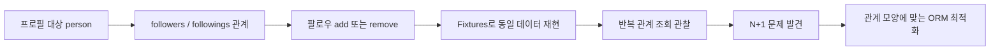
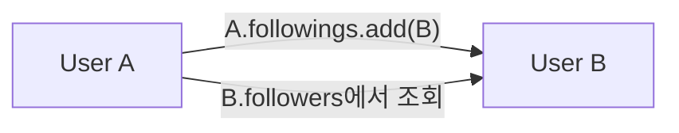
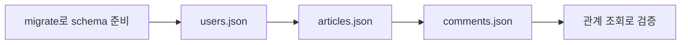
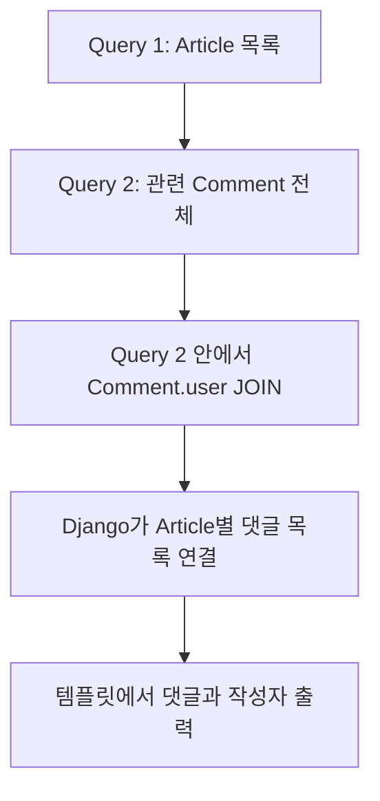
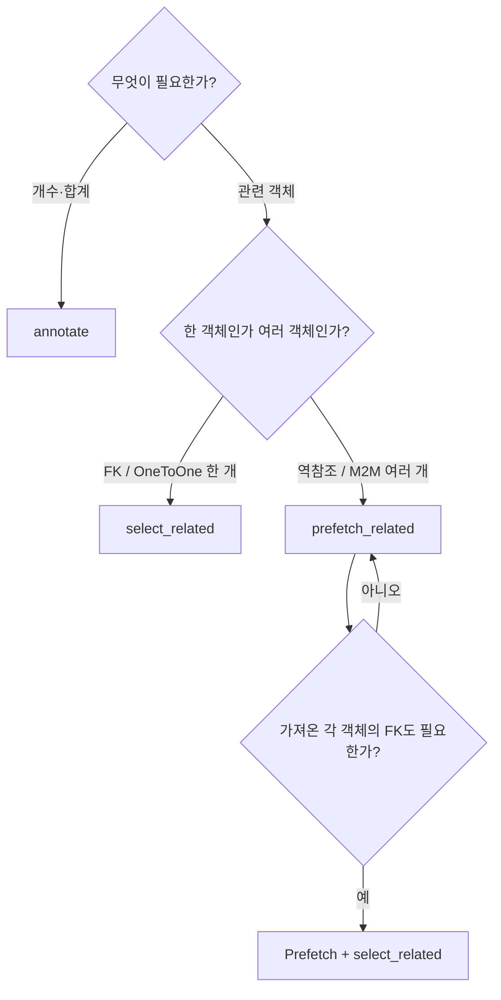

# DB N:M 2: 팔로우 구현, Fixtures, ORM 쿼리 최적화

- 🎯 글의 목표: 자기 참조 N:M으로 팔로우 기능을 구현하고, Fixtures로 데이터를 옮기며, 관계 조회에서 발생하는 N+1 문제를 Django ORM으로 개선한다.
- 🧩 핵심 키워드: profile, self ManyToManyField, followings, followers, fixtures, `dumpdata`, `loaddata`, N+1, `annotate`, `select_related`, `prefetch_related`, `Prefetch`, `exists`
- ⭐ 중요도: 매우 높음. 관계를 만드는 단계에서 더 나아가 실제 데이터 준비와 조회 성능까지 다루는 Django ORM의 핵심 강의다.
- 📝 한눈에 보는 내용: 사용자 프로필과 팔로우 토글을 완성하고 fixture의 저장·복원 순서를 익힌 뒤, 반복 관계 조회를 집계·JOIN·사전 조회로 최적화한다.
- 🔗 관련 문제 / 주제: 소셜 기능, 테스트 데이터, N+1 쿼리, 목록 성능, QuerySet 최적화

---

## 1. 들어가며

N:M 관계를 선언하고 `add()`와 `remove()`를 사용할 수 있게 되면 팔로우 기능을 만들 수 있다. 그러나 실제 애플리케이션에서는 관계를 만드는 것만으로 끝나지 않는다. 사용자 프로필에서 팔로워 수를 보여 주고, 반복 가능한 초기 데이터를 준비하며, 게시글 목록에서 작성자와 댓글을 효율적으로 조회해야 한다.

관계가 많아질수록 Python 코드 한 줄 뒤에서 실행되는 SQL 수가 중요해진다. 게시글 10개를 보여 주기 위해 11번, 댓글 작성자까지 표시하기 위해 수십 번의 쿼리를 실행한다면 데이터가 늘어날수록 화면이 느려진다. Django ORM은 `annotate`, `select_related`, `prefetch_related`로 이런 반복 조회를 줄일 수 있다.

이번 강의는 크게 세 덩어리다. 첫째, User가 User를 팔로우하는 방향성 N:M 구현. 둘째, fixture로 데이터베이스 데이터를 직렬화하고 불러오는 방법. 셋째, N+1 문제를 발견하고 관계 종류에 맞는 최적화 도구를 선택하는 방법이다.

## 2. 핵심 개념 정리

이 강의의 큰 질문은 "관계형 기능을 만들고, 반복 가능한 데이터와 효율적인 조회까지 어떻게 운영할 것인가"이다.

먼저 username을 URL에 포함한 프로필 페이지를 만들고, 커스텀 User 모델에 `followings` self M2M 필드를 선언한다. `symmetrical=False`와 `related_name='followers'`로 팔로우 방향을 표현하고, view에서 자기 자신을 제외한 add/remove 토글을 구현한다.

그다음 `dumpdata`와 `loaddata`로 fixture를 다룬다. ForeignKey 참조 순서 때문에 User, Article, Comment 순으로 불러와야 한다. 마지막으로 N+1 문제를 기준으로 댓글 개수는 `annotate`, 단일 FK 정참조는 `select_related`, 역참조와 N:M은 `prefetch_related`를 선택한다.



앞부분과 뒷부분은 분리된 주제가 아니다. 팔로우·댓글·좋아요처럼 관계 데이터가 늘어날수록 목록에서 관련 객체를 자주 읽게 되고, 그때 쿼리 수를 관리해야 한다.

## 3. 본문 정리

### 3.1 username 기반 프로필 페이지 만들기

프로필 페이지는 특정 사용자의 정보와 그 사용자가 작성한 콘텐츠를 보여 주는 화면이다. 로그인한 현재 사용자만 보여 주는 것이 아니라 URL에 포함된 `username`으로 대상 사용자를 찾아야 한다.


```python
# accounts/urls.py
from django.urls import path

from . import views

app_name = 'accounts'

urlpatterns = [
    path('profile/<str:username>/', views.profile, name='profile'),
]
```

```python
# accounts/views.py
from django.contrib.auth import get_user_model
from django.shortcuts import get_object_or_404, render


def profile(request, username):
    # 현재 프로젝트의 User 모델에서 URL username과 일치하는 사용자를 찾는다.
    person = get_object_or_404(
        get_user_model(),
        username=username,
    )

    context = {'person': person}
    return render(request, 'accounts/profile.html', context)
```

```django
<h1>{{ person.username }}님의 프로필</h1>

<h2>작성한 게시글</h2>

  <p>
    <a href="">
      {{ article.title }}
    </a>
  </p>

  <p>작성한 게시글이 없습니다.</p>

```

프로필 대상은 `person`, 요청을 보낸 로그인 사용자는 `request.user`로 구분한다. 두 변수를 모두 `user`라고 부르면 누구를 팔로우하는지 흐름이 헷갈리기 쉽다.

프로필 URL에 username을 쓰는 방식은 사람이 읽기 쉽다는 장점이 있다. 다만 username을 변경할 수 있는 서비스라면 기존 URL이 바뀔 수 있고, 대소문자나 중복 정책도 함께 고려해야 한다. 수업에서는 사용자를 식별하고 프로필 문맥을 만드는 데 초점을 둔다.

프로필 화면에서 자주 보여 주는 관계는 다음과 같다.

| 표현 | 의미 |
|---|---|
| `person.article_set.all` | 이 사용자가 작성한 게시글 |
| `person.comment_set.all` | 이 사용자가 작성한 댓글 |
| `person.like_articles.all` | 이 사용자가 좋아요한 게시글 |
| `person.followings.all` | 이 사용자가 팔로우하는 사람 |
| `person.followers.all` | 이 사용자를 팔로우하는 사람 |

실제 화면에 모두 출력할 필요는 없지만, 한 User 객체에서 여러 관계를 서로 다른 manager로 읽는다는 점이 중요하다.

### 3.2 User가 User를 참조하는 방향성 N:M

팔로우는 User와 User 사이의 N:M 관계다. 한 사용자는 여러 사용자를 팔로우할 수 있고, 한 사용자도 여러 사용자에게 팔로우될 수 있다. 하지만 A가 B를 팔로우한다고 B가 A를 자동으로 팔로우하는 것은 아니므로 방향성이 있다.


```python
# accounts/models.py
from django.contrib.auth.models import AbstractUser
from django.db import models


class User(AbstractUser):
    # 내가 팔로우하는 사용자 목록이다.
    followings = models.ManyToManyField(
        'self',
        # A -> B 관계가 B -> A를 자동 생성하지 않게 한다.
        symmetrical=False,
        # 상대방 입장에서는 자신을 팔로우하는 사용자 목록이다.
        related_name='followers',
    )
```

```python
user_a.followings.add(user_b)

user_a.followings.all()  # A가 팔로우하는 사용자: B
user_b.followers.all()   # B를 팔로우하는 사용자: A
```

`followings`와 `followers`는 테이블 두 개가 아니라 같은 중개 테이블을 서로 다른 방향에서 읽는 manager다. 중개 행의 from-user와 to-user 방향에 따라 의미가 달라진다.



관계 하나를 두 문장으로 읽을 수 있다.

- A의 입장: B는 내가 팔로우하는 사용자다.
- B의 입장: A는 나를 팔로우하는 사용자다.

이 두 표현이 같은 중개 행을 가리킨다. `followings`와 `followers`를 별도 데이터로 중복 저장하지 않는다.

⚠️ 주의: self M2M에서 `symmetrical=False`를 빠뜨리면 친구 관계처럼 대칭으로 처리되어 팔로우의 방향을 표현하지 못한다. 필드 이름도 `friends`가 아니라 `followings`처럼 방향이 드러나게 정한다.

### 3.3 팔로우 토글 URL과 view

프로필의 팔로우 버튼은 현재 로그인 사용자와 프로필 대상 사이의 관계를 추가하거나 제거한다. 자기 자신은 팔로우 대상에서 제외하고, 상태 변경이므로 로그인과 POST를 요구한다.


```python
# accounts/urls.py
urlpatterns = [
    path('profile/<str:username>/', views.profile, name='profile'),
    path('<int:user_pk>/follow/', views.follow, name='follow'),
]
```

```python
# accounts/views.py
from django.contrib.auth import get_user_model
from django.contrib.auth.decorators import login_required
from django.shortcuts import get_object_or_404, redirect
from django.views.decorators.http import require_POST


@login_required
@require_POST
def follow(request, user_pk):
    # request.user가 팔로우하려는 대상 사용자다.
    person = get_object_or_404(get_user_model(), pk=user_pk)

    # 자기 자신과의 관계는 만들지 않는다.
    if request.user != person:
        if person.followers.filter(pk=request.user.pk).exists():
            # 이미 팔로우 중이면 관계를 제거한다.
            person.followers.remove(request.user)
        else:
            # 팔로우 중이 아니면 관계를 추가한다.
            person.followers.add(request.user)

    return redirect('accounts:profile', person.username)
```

```django
<p>
  팔로잉 {{ person.followings.count }}
  /
  팔로워 {{ person.followers.count }}
</p>


  <form action="" method="POST">
    

    
      <button type="submit">언팔로우</button>
    
      <button type="submit">팔로우</button>
    
  </form>

```

`person.followers.add(request.user)`는 문장처럼 읽으면 "프로필 대상의 팔로워 목록에 현재 사용자를 추가한다"다. 반대로 `request.user.followings.add(person)`이라고 작성해도 같은 중개 관계를 만든다. 한 프로젝트에서는 읽기 쉬운 기준을 정해 일관되게 사용하는 편이 좋다.

팔로우 view의 조건문은 세 단계로 읽는다.

1. URL의 `user_pk`로 대상 `person`을 찾는다.
2. `request.user != person`으로 자기 자신인지 검사한다.
3. 현재 사용자가 `person.followers`에 있으면 제거하고, 없으면 추가한다.

여기서 2번 검사는 템플릿 버튼 숨김과 별개다. URL을 직접 호출하는 요청도 서버에서 막아야 하기 때문이다.

⚠️ 주의: 템플릿에서 자기 자신의 버튼을 숨기는 것은 UI 처리일 뿐이다. 사용자가 직접 POST 요청을 보낼 수 있으므로 view의 `request.user != person` 검사를 반드시 유지한다.

### 3.4 Fixtures가 필요한 이유

쿼리 성능을 비교하거나 여러 개발 환경에서 같은 화면을 재현하려면 일정한 초기 데이터가 필요하다. Fixture는 모델 인스턴스를 JSON, YAML, XML 같은 직렬화 형식으로 저장해 두었다가 데이터베이스에 다시 넣을 수 있게 한다.


Fixture는 schema migration을 대신하지 않는다. migration은 테이블 구조를 만들고, fixture는 그 구조 안에 들어갈 행 데이터를 제공한다. 따라서 새 DB에서는 migration을 먼저 적용한 뒤 fixture를 불러와야 한다.

| 구분 | Migration | Fixture |
|---|---|---|
| 대상 | 테이블·컬럼·제약 구조 | 모델 인스턴스 데이터 |
| 생성 | `makemigrations` | `dumpdata` 또는 직접 작성 |
| 적용 | `migrate` | `loaddata` |
| 주 용도 | DB schema 버전 관리 | 초기·테스트·예제 데이터 재현 |

fixture는 DB 전체 백업 도구와도 다르다. Django 모델 직렬화 형식에 맞춘 데이터 이동 수단이며, 운영 DB의 완전한 복구 전략을 대신하지 않는다.

### 3.5 dumpdata로 모델 데이터를 내보내기

`dumpdata`는 현재 DB의 모델 데이터를 직렬화해 표준 출력으로 보낸다. 리다이렉션을 사용해 앱의 `fixtures` 폴더에 JSON 파일로 저장할 수 있다.


```bash
# 읽기 쉽도록 4칸 들여쓰기를 적용해 Article 데이터만 저장한다.
python manage.py dumpdata --indent 4 articles.article > articles.json
```

일반적인 배치는 각 앱 아래의 `fixtures` 디렉터리다.

```text
articles/
├─ fixtures/
│  ├─ articles.json
│  └─ comments.json
├─ models.py
└─ views.py
```

모델을 구분하지 않고 여러 앱 데이터를 한꺼번에 내보낼 수도 있지만, 파일이 커지고 참조 순서를 파악하기 어려워질 수 있다. 수업처럼 User, Article, Comment를 이해하는 단계에서는 모델별 파일이 관계를 확인하기 쉽다.

`dumpdata`의 대상을 지정하는 방식도 구분할 수 있다.

```bash
# 특정 모델 하나
python manage.py dumpdata articles.article --indent 4 > articles.json

# 특정 앱 전체
python manage.py dumpdata articles --indent 4 > articles_app.json

# 여러 대상을 한 파일에 함께 저장
python manage.py dumpdata accounts.user articles.article articles.comment --indent 4 > data.json
```

한 파일에 함께 저장하면 한 번에 불러올 수 있지만 변경 범위가 커진다. 모델별 파일은 의존 순서를 직접 관리해야 하지만 데이터 종류를 확인하기 쉽다.

⚠️ 주의: fixture에는 비밀번호 해시나 개인 정보가 포함될 수 있다. 운영 DB를 그대로 dump해 저장소에 커밋하지 말고, 학습·테스트용으로 정제한 데이터만 사용한다.

### 3.6 loaddata와 참조 순서

`loaddata`는 fixture의 행을 DB에 넣는다. Article이 User FK를 참조하고 Comment가 Article과 User를 참조한다면, 참조 대상이 먼저 존재해야 한다.


```bash
python manage.py loaddata users.json
python manage.py loaddata articles.json
python manage.py loaddata comments.json
```

순서를 자연어로 읽으면 "부모가 먼저, 자식이 나중"이다.

1. User는 다른 두 fixture가 참조하므로 먼저 적재한다.
2. Article은 User를 참조하고 Comment가 참조하므로 두 번째다.
3. Comment는 User와 Article이 모두 준비된 뒤 적재한다.

새 환경에서 재현할 때의 전체 흐름은 `migrate → loaddata`다. fixture의 PK가 기존 데이터와 충돌하지 않는지, 모델 필드가 fixture 생성 이후 변경되지 않았는지도 확인해야 한다.



`loaddata users.json articles.json comments.json`처럼 한 명령에 여러 파일을 순서대로 전달할 수도 있다. 중요한 것은 앞 fixture가 뒤 fixture의 FK 참조 대상을 먼저 만들어야 한다는 점이다.

fixture를 불러온 뒤에는 행 수만 확인하지 말고 관계까지 확인한다.

```python
Article.objects.count()
Comment.objects.count()
Article.objects.first().user
Article.objects.first().comment_set.all()
```

데이터 개수는 맞아도 FK 값이 의도한 객체를 참조하지 않을 수 있으므로 대표 관계를 직접 조회하는 검증이 필요하다.

⚠️ 주의: Windows 환경에서 한글이 포함된 JSON을 불러올 때 인코딩 오류가 생길 수 있다. 파일이 UTF-8로 저장되었는지 먼저 확인하고, 콘솔 리다이렉션이 다른 인코딩으로 파일을 만들지 않았는지 점검한다.

### 3.7 N+1 문제: 객체 수만큼 관계 쿼리가 반복된다

N+1 문제는 목록을 가져오는 최초 쿼리 1번 뒤에, 각 객체의 관련 데이터를 얻기 위한 쿼리 N번이 추가로 실행되는 현상이다. 코드가 짧고 결과도 맞아서 데이터가 적을 때는 눈에 잘 띄지 않는다.

게시글 10개를 조회한 뒤 템플릿에서 각 게시글의 댓글 수를 구한다고 해 보자.

```python
articles = Article.objects.order_by('-pk')  # 게시글 목록 1회 조회
```

```django

  <p>{{ article.title }} - 댓글 {{ article.comment_set.count }}개</p>

```

게시글 목록 1회에 더해 각 게시글의 `comment_set.count`가 10회 실행되면 총 11회가 된다. 게시글이 N개라면 관계 조회도 N번 늘어난다.


N+1을 찾는 신호는 반복문 안의 관계 접근이다. 템플릿의 `` 안에서 `article.user`, `article.comment_set`, `article.like_users`를 읽는다면 실제 SQL 수를 확인해야 한다.

N+1 문제를 숫자로 읽어 보면 더 분명하다.

| 게시글 수 | 게시글 목록 쿼리 | 항목별 관계 쿼리 | 총 쿼리 수 |
|---:|---:|---:|---:|
| 5 | 1 | 5 | 6 |
| 10 | 1 | 10 | 11 |
| 100 | 1 | 100 | 101 |

문제는 N이 커질수록 쿼리 수도 선형으로 늘어난다는 점이다. 한 번의 요청에서 DB 왕복이 반복되므로 각 쿼리가 짧아도 전체 지연이 누적된다.

QuerySet은 보통 lazy하게 평가된다. `articles = Article.objects.all()`을 작성한 줄에서 즉시 모든 SQL이 실행된다고 단정할 수 없다. 템플릿 반복, `list()`, `len()`, 출력 등 실제 데이터가 필요한 시점에 평가된다. 그래서 view 코드만 보고는 N+1을 놓치고 템플릿 접근까지 함께 봐야 한다.

### 3.8 annotate: 집계 결과를 각 객체에 붙이기

댓글 객체 전체가 아니라 댓글 개수만 필요하다면 `annotate`가 적합하다. 집계 함수 `Count`로 계산한 값을 QuerySet 각 Article 객체의 임시 필드처럼 붙인다.


```python
# articles/views.py
from django.db.models import Count


def index(request):
    # 각 게시글에 comment_count라는 집계 결과를 붙인다.
    articles = (
        Article.objects
        .annotate(comment_count=Count('comment'))
        .order_by('-pk')
    )

    context = {'articles': articles}
    return render(request, 'articles/index.html', context)
```

```django

  <p>{{ article.title }} - 댓글 {{ article.comment_count }}개</p>

```

이제 템플릿은 `comment_set.count`를 반복 호출하지 않는다. DB가 게시글별 댓글 수를 집계해 결과에 포함하므로 추가 count 쿼리가 사라진다.

관계의 query name은 설정에 따라 달라질 수 있다. 기본 ForeignKey 역참조 accessor는 `comment_set`이지만 QuerySet lookup에서는 모델명 `comment`를 사용한다. `related_name='comments'`를 지정했다면 `Count('comments')`로 맞춰야 한다.

`annotate`는 원본 Article 행마다 계산 결과를 붙이는 방식이다. 전체 게시글의 댓글 합계 하나만 필요하다면 `aggregate`가 다른 선택이다.

```python
from django.db.models import Count

# 각 게시글마다 댓글 수: QuerySet의 각 객체에 값이 붙는다.
articles = Article.objects.annotate(comment_count=Count('comment'))

# 전체 댓글 수 하나: dict 형태의 최종 집계 결과가 나온다.
result = Comment.objects.aggregate(total=Count('pk'))
```

이번 목록 화면은 게시글별 댓글 수가 필요하므로 `annotate`가 맞다.

⚠️ 주의: `annotate` 결과인 `comment_count`는 모델에 저장된 실제 컬럼이 아니다. 해당 QuerySet으로 조회한 객체에만 존재하므로 다른 곳에서 일반 Article을 가져오면 같은 속성을 기대할 수 없다.

### 3.9 select_related: 단일 객체 관계를 SQL JOIN으로 가져오기

게시글 목록에서 각 작성자의 username을 보여 주면 `article.user`를 읽을 때마다 User 조회가 반복될 수 있다. Article에서 User로 가는 ForeignKey 정참조는 게시글 하나당 사용자 하나이므로 SQL JOIN으로 한 번에 가져오기 적합하다.


```python
def index(request):
    # Article과 연결된 단일 User를 JOIN한 한 쿼리로 가져온다.
    articles = (
        Article.objects
        .select_related('user')
        .order_by('-pk')
    )

    context = {'articles': articles}
    return render(request, 'articles/index.html', context)
```

```django

  <p>{{ article.title }} / 작성자 {{ article.user.username }}</p>

```

`select_related`는 ForeignKey와 OneToOne처럼 각 원본 행에 연결 대상이 최대 하나인 관계에 사용한다. SQL JOIN 결과 한 행 안에 관련 객체의 컬럼을 함께 담을 수 있기 때문이다.

개념적으로 실행되는 SQL은 다음과 비슷하다.

```sql
SELECT article.*, user.*
FROM article
INNER JOIN user ON article.user_id = user.id
ORDER BY article.id DESC;
```

Django가 실제 SQL을 생성하므로 직접 작성할 필요는 없다. 다만 한 SQL 결과의 각 행에 Article과 User 데이터가 함께 있다는 그림을 이해하면 왜 단일 관계에 적합한지 알 수 있다.

⚠️ 주의: 역참조 목록이나 ManyToMany처럼 관련 객체가 여러 개인 관계에 `select_related`를 사용할 수 없다. 한 행이 여러 행으로 늘어날 수 있는 관계는 `prefetch_related`를 사용한다.

### 3.10 prefetch_related: 여러 객체 관계를 별도 조회 후 결합하기

게시글 하나에 댓글이 여러 개 달릴 수 있으므로 Article과 Comment를 단순 JOIN하면 게시글 행이 댓글 수만큼 중복될 수 있다. `prefetch_related`는 게시글과 댓글을 각각 조회한 뒤 Django가 Python에서 관계를 연결한다.


```python
def index(request):
    # 1회: Article 목록 조회
    # 1회: 해당 Article들의 Comment를 IN 조건으로 조회
    articles = (
        Article.objects
        .prefetch_related('comment_set')
        .order_by('-pk')
    )

    context = {'articles': articles}
    return render(request, 'articles/index.html', context)
```

```django

  <h2>{{ article.title }}</h2>

  
    <p>{{ comment.content }}</p>
  
    <p>댓글이 없습니다.</p>
  

```

쿼리는 보통 Article 1회와 Comment 1회, 총 2회로 줄어든다. 게시글 수가 늘어나도 관련 댓글을 가져오는 쿼리가 게시글마다 반복되지 않는다.

`prefetch_related`는 역참조 ForeignKey와 ManyToMany 모두에 사용할 수 있다. 이미 가져온 관계는 객체의 prefetch cache에 저장되므로 템플릿의 `.all()`이 추가 쿼리를 실행하지 않는다.

개념적으로는 두 쿼리가 실행된다.

```sql
-- 첫 번째 쿼리: 게시글 목록
SELECT * FROM article ORDER BY id DESC;

-- 두 번째 쿼리: 위 게시글 PK들과 관련된 댓글을 한 번에 조회
SELECT * FROM comment WHERE article_id IN (1, 2, 3, ...);
```

Django는 두 번째 결과의 `article_id`를 보고 각 Article 객체에 댓글 목록을 연결한다. JOIN 한 번과 달리 Python에서 조립한다는 점이 `select_related`와의 핵심 차이다.

⚠️ 주의: prefetch한 뒤 `article.comment_set.filter(...)`처럼 다른 조건의 QuerySet을 요청하면 기존 cache를 그대로 사용할 수 없어 추가 쿼리가 발생할 수 있다. 필요한 필터 조건이 있다면 `Prefetch` 객체의 queryset으로 미리 지정한다.

### 3.11 Prefetch와 select_related를 조합하기

게시글마다 댓글 목록을 보여 주고 각 댓글의 작성자도 표시한다면 관계가 두 단계다.

- Article → Comment: 역참조 N 관계이므로 `prefetch_related`
- Comment → User: ForeignKey 1 관계이므로 `select_related`

```python
from django.db.models import Prefetch

from .models import Article, Comment


def index(request):
    articles = (
        Article.objects
        .prefetch_related(
            Prefetch(
                'comment_set',
                # 댓글을 가져오는 두 번째 쿼리에서 작성자까지 JOIN한다.
                queryset=Comment.objects.select_related('user'),
            )
        )
        .order_by('-pk')
    )

    context = {'articles': articles}
    return render(request, 'articles/index.html', context)
```

이 조합은 "바깥쪽의 여러 댓글은 별도 조회하고, 그 조회 안에서 댓글마다 하나인 작성자는 JOIN한다"는 뜻이다. 관계 경로를 한 번에 외우기보다 각 화살표가 하나인지 여러 개인지 판단하면 도구 선택이 자연스럽다.

쿼리 흐름을 단계별로 보면 다음과 같다.



게시글 수와 댓글 수가 늘어나도 댓글 작성자마다 추가 User 쿼리가 실행되지 않는 것이 목표다.

### 3.12 annotate, select_related, prefetch_related 선택 기준

| 필요한 값 | 관계 모양 | 적합한 도구 |
|---|---|---|
| 관련 객체의 개수·합계·평균 | 집계 | `annotate` |
| ForeignKey·OneToOne의 단일 객체 | 한 행에 하나 | `select_related` |
| 역참조 목록·ManyToMany 목록 | 한 행에 여러 개 | `prefetch_related` |
| 여러 객체와 그 내부 단일 FK | 여러 개 다음 하나 | `Prefetch(...select_related())` |

최적화는 메서드를 많이 붙이는 것이 목적이 아니다. 템플릿과 serializer가 실제로 접근하는 관계를 확인하고, 쿼리 수와 데이터 크기를 측정한 뒤 필요한 관계만 가져와야 한다.

선택 과정을 질문 형태로 바꿔 두면 실전에서 떠올리기 쉽다.



### 3.13 존재 여부만 필요할 때 exists 사용하기

좋아요나 팔로우 토글에서 필요한 것은 전체 사용자 목록이 아니라 현재 사용자의 관계가 존재하는지 여부다. `exists()`는 조건에 맞는 행이 하나라도 있는지만 효율적으로 확인한다.

```python
# 전체 like_users QuerySet을 Python으로 가져오지 않고 존재 여부만 묻는다.
is_liked = article.like_users.filter(pk=request.user.pk).exists()

if is_liked:
    article.like_users.remove(request.user)
else:
    article.like_users.add(request.user)
```

`request.user in article.like_users.all()`도 의미는 이해하기 쉽지만 관련 객체를 평가할 수 있다. 존재 확인이 목적이라는 사실을 코드에 드러내고 싶다면 `filter(...).exists()`가 적합하다.

다만 이미 prefetch된 작은 관계 목록을 다른 이유로 사용 중이라면 무조건 별도 `exists()` 쿼리를 추가하는 것이 더 낫다고 단정할 수는 없다. 쿼리 최적화는 현재 QuerySet의 평가 여부와 실제 사용 범위를 함께 봐야 한다.

### 3.14 강의의 네 가지 조회 사례를 비교하기

최적화 부분은 서로 다른 문제를 같은 메서드로 해결하는 내용이 아니다. 필요한 데이터 형태마다 도구가 달라진다.

| 사례 | 반복 접근 | 문제 | 해결 |
|---|---|---|---|
| 게시글별 댓글 수 | `comment_set.count` | 항목마다 COUNT | `annotate(Count(...))` |
| 게시글별 작성자 | `article.user` | 항목마다 User 조회 | `select_related('user')` |
| 게시글별 댓글 목록 | `article.comment_set.all` | 항목마다 Comment 조회 | `prefetch_related('comment_set')` |
| 댓글별 작성자까지 | `comment.user` | 댓글마다 User 조회 | `Prefetch` 안 `select_related('user')` |

이 표를 외우기보다 반복문 안에서 실제로 접근하는 값이 집계인지, 단일 객체인지, 객체 목록인지 분류한다.

### 3.15 최적화가 제대로 적용되었는지 검증하기

코드에 `select_related`를 붙였다고 최적화가 끝난 것은 아니다. 템플릿이 다른 관계를 추가로 읽거나 필터된 manager를 다시 호출하면 쿼리가 계속 발생할 수 있다.

검증할 때는 다음을 확인한다.

1. 동일한 fixture 데이터로 변경 전후를 비교한다.
2. Django Debug Toolbar 또는 쿼리 로그로 요청당 SQL 수를 확인한다.
3. 중복되는 SQL 패턴이 항목 수만큼 나타나는지 본다.
4. 최적화 뒤 템플릿이 prefetch cache를 사용할 수 있는 접근을 하는지 확인한다.
5. 쿼리 수뿐 아니라 한 번에 가져오는 데이터 양도 과도하지 않은지 본다.

예를 들어 댓글이 필요하지 않은 페이지까지 모든 댓글을 prefetch하면 쿼리 수는 적어도 메모리와 전송 데이터가 늘어난다. 필요한 화면에서 필요한 관계만 선택하는 것이 최적화의 기준이다.

## 4. 적용 관점에서 다시 보기

관계 기능과 성능을 함께 구현할 때는 다음 흐름으로 접근한다.

1. self N:M의 방향과 역참조 이름을 먼저 자연어로 정의한다.
2. URL에서 프로필 대상, `request.user`에서 행동 주체를 분리한다.
3. 자기 관계, 로그인, HTTP method를 서버에서 검증한 뒤 관계를 토글한다.
4. 재현 가능한 데이터가 필요하면 의존 관계 순서대로 fixture를 준비한다.
5. 목록 화면의 반복문 안에서 접근하는 관계를 표시한다.
6. 개수면 `annotate`, 단일 FK면 `select_related`, 목록 관계면 `prefetch_related`를 선택한다.
7. Django Debug Toolbar나 쿼리 로그로 실제 쿼리 수가 줄었는지 확인한다.

"목록은 한 번 조회했는데 항목마다 작성자·댓글을 읽는다"는 코드가 보이면 N+1을 의심한다. 결과가 맞는지뿐 아니라 데이터 수가 10배가 되었을 때 쿼리 수도 10배가 되는지 생각해야 한다.

## 5. 배운 점 / 확장 포인트

### 5.1 이번 강의 이전에 몰랐던 것 또는 새로 이해된 것

팔로우는 단순한 self M2M이 아니라 from-user와 to-user의 방향을 가진 관계다. 또한 ORM 코드가 간결해도 관계 접근 위치에 따라 SQL이 반복될 수 있으므로, 객체 관계와 쿼리 실행을 함께 읽어야 한다.

### 5.2 앞으로 이어지는 연결점

AJAX를 적용하면 팔로우 view가 redirect 대신 JSON을 반환하고 브라우저가 숫자와 버튼만 바꾼다. DRF serializer에서도 같은 N+1 문제가 생기므로 viewset QuerySet에 관계 최적화를 적용하게 된다.

### 5.3 더 파볼 만한 주제

QuerySet의 lazy evaluation, `EXPLAIN`, 데이터베이스 인덱스, `to_attr`를 사용한 Prefetch, 대규모 fixture 대신 factory를 사용하는 테스트 데이터 전략을 더 살펴볼 수 있다.

## 6. 요약 정리

- 팔로우는 방향성이 있는 User self N:M이므로 `symmetrical=False`가 필요하다.
- `followings`는 내가 팔로우하는 목록, `followers`는 나를 팔로우하는 목록이다.
- fixture는 데이터 행을 직렬화하며, migration은 DB 구조를 만든다.
- ForeignKey 의존성이 있으면 참조 대상부터 `loaddata`한다.
- N+1 문제는 목록 1회 뒤 관련 객체 조회가 N번 반복되는 현상이다.
- 집계는 `annotate`, 단일 FK는 `select_related`, 목록 관계는 `prefetch_related`가 기본 선택이다.
- 중첩 관계는 `Prefetch` 안에 `select_related`를 조합할 수 있다.

🧠 기억할 것: **관계의 개수와 방향을 먼저 읽으면 모델링 도구뿐 아니라 조회 최적화 도구도 결정할 수 있다.**

## 7. 미니 퀴즈 또는 체크리스트

- [ ] 팔로우 관계에서 `symmetrical=False`가 필요한 이유를 설명할 수 있는가?
- [ ] `person.followers.add(request.user)`를 자연어 문장으로 풀어 설명할 수 있는가?
- [ ] User, Article, Comment fixture를 어떤 순서로 불러와야 하는지 이유와 함께 말할 수 있는가?
- [ ] `select_related`와 `prefetch_related`를 관계의 cardinality 기준으로 구분할 수 있는가?
- [ ] 게시글-댓글-댓글 작성자 목록을 몇 번의 쿼리로 가져올지 최적화 코드를 설계할 수 있는가?
