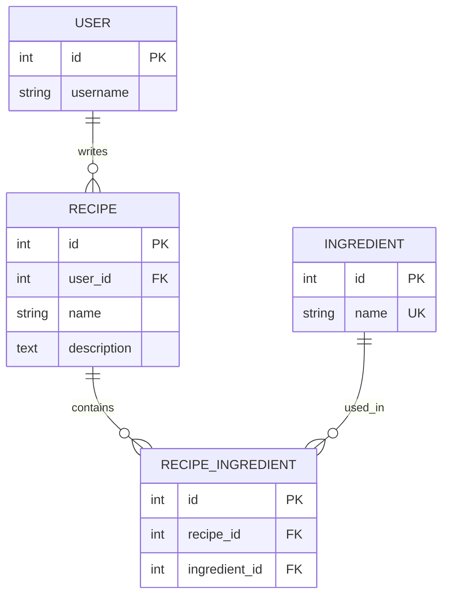

# 05_15 데이터베이스 모델링과 정규화

- 🎯 글의 목표: 요구사항을 엔터티와 관계로 바꾸는 모델링 과정을 이해하고, 이상 현상과 함수 종속을 기준으로 1NF·2NF·3NF·BCNF를 판단한다.
- 🧩 핵심 키워드: 데이터베이스 모델링, 무결성, ERD, Crow's Foot, 함수 종속, 이상 현상, 1NF, 2NF, 3NF, BCNF, 후보 키, 반정규화, `ManyToManyField`
- ⭐ 중요도: ★★★★★
- 📝 한눈에 보는 내용: 데이터베이스 모델링은 테이블을 그리는 작업이 아니라 데이터의 의미·관계·제약을 설계하는 과정이다. 요구사항 분석부터 개념·논리·물리 설계를 거쳐 구조를 구체화하고, 정규화를 통해 중복과 삽입·갱신·삭제 이상을 줄인다. 마지막에는 콤마 문자열로 저장하던 레시피 재료를 독립 테이블과 M:N 관계로 바꾸어 Django 모델과 폼에 적용한다.
- 🔗 관련 문제 / 주제: 관계형 데이터베이스, ERD, Django ORM, 다대다 관계, 데이터 무결성, 쿼리 최적화

---

## 1. 들어가며

데이터베이스 설계를 처음 배울 때는 모델 클래스나 `CREATE TABLE` 문부터 작성하기 쉽다. 그러나 컬럼을 먼저 만들면 실제 요구사항과 맞지 않는 구조가 생기기 쉽다. 예를 들어 레시피의 재료를 `"토마토, 파스타, 올리브"`처럼 한 문자열에 저장하면 처음에는 간단하다. 하지만 재료 이름을 일괄 수정하거나, 특정 재료가 들어간 레시피를 찾거나, 레시피와 무관하게 새 재료를 등록하려는 순간 문제가 드러난다.

데이터베이스 모델링은 이런 문제를 코드 작성 전에 발견하는 과정이다. 서비스가 관리할 개체, 개체가 가진 속성, 개체 사이의 관계와 허용할 값의 범위를 먼저 설계한다. 그다음 관계형 데이터베이스의 테이블과 키로 변환하고, 정규화를 통해 중복과 이상 현상을 줄인다.

이번 강의는 다음 질문을 해결한다.

1. 요구사항에서 엔터티·속성·관계를 어떻게 찾는가?
2. PK·FK·타입·범위는 어떤 무결성을 보장하는가?
3. 데이터 중복이 삽입·갱신·삭제 이상을 어떻게 만드는가?
4. 1NF, 2NF, 3NF, BCNF는 각각 어떤 종속을 제거하는가?
5. 정규화된 구조를 Django 모델과 ModelForm으로 어떻게 구현하는가?

핵심은 정규형 이름을 암기하는 것이 아니다. **어떤 값이 어떤 값을 결정하는지**를 찾아 데이터가 한 곳에서만 관리되도록 만드는 사고방식을 익히는 것이다.

## 2. 핵심 개념 정리

데이터베이스 설계는 요구사항에서 실제 운영 구조로 점차 구체화된다.


정규화는 논리적 설계의 핵심 작업이다.

```text
비정규 테이블
   │ 한 칸에 여러 값
   ▼
1NF: 모든 속성을 원자값으로
   │ 복합 키 일부에만 종속
   ▼
2NF: 비키 속성을 PK 전체에 완전 종속
   │ 비키 속성이 다른 비키 속성을 결정
   ▼
3NF: 이행 종속 제거
   │ 후보 키가 아닌 결정자가 남음
   ▼
BCNF: 모든 결정자를 후보 키로
```

정규화가 필요한 이유는 단순히 테이블을 많이 나누기 위해서가 아니다. 같은 사실을 여러 곳에 저장하지 않게 하여 한 번의 변경이 일관되게 반영되도록 만드는 데 목적이 있다.

## 3. 본문 정리

### 3.1 데이터베이스 모델링은 구조·관계·제약을 설계한다

데이터베이스 모델링은 데이터를 어떤 테이블과 컬럼에 넣을지뿐 아니라 다음을 함께 결정한다.

- 어떤 대상을 독립된 엔터티로 관리할 것인가?
- 각 엔터티를 유일하게 구분하는 키는 무엇인가?
- 엔터티 사이의 관계는 1:1, 1:N, N:M 중 무엇인가?
- 필수값, 중복 가능 여부, 값의 범위는 어떠한가?
- 삭제·수정 시 연관된 데이터는 어떻게 처리할 것인가?

좋은 모델은 저장 공간과 조회 성능뿐 아니라 데이터 일관성과 유지보수성에도 영향을 준다. 같은 재료 이름을 수백 개 레시피 문자열에 중복 저장하는 구조와 `Ingredient` 한 행에서 관리하는 구조는 수정 비용이 완전히 다르다.

### 3.2 무결성 제약은 잘못된 상태를 데이터베이스 경계에서 막는다

무결성은 삽입·수정·삭제 이후에도 데이터가 약속한 규칙을 지키는 상태다.

#### 3.2.1 개체 무결성

각 행은 유일한 PK를 가지며 PK는 중복되거나 `NULL`일 수 없다.

```sql
CREATE TABLE student (
    student_id INTEGER PRIMARY KEY,
    name VARCHAR(50) NOT NULL
);
```

#### 3.2.2 참조 무결성

FK는 참조 대상 테이블에 실제로 존재하는 키를 가리켜야 한다. 삭제 정책도 관계의 의미에 맞게 정한다.

```sql
CREATE TABLE employee (
    employee_id INTEGER PRIMARY KEY,
    department_id INTEGER,
    FOREIGN KEY (department_id)
        REFERENCES department(department_id)
        ON DELETE SET NULL
);
```

부서가 사라졌다고 직원을 함께 삭제하는 것이 맞는지, 부서만 `NULL`로 만들지, 삭제 자체를 막을지는 서비스 규칙에 따라 다르다.

#### 3.2.3 도메인 무결성

컬럼이 정해진 타입·길이·범위의 값만 갖도록 한다.

```sql
CREATE TABLE product (
    product_id INTEGER PRIMARY KEY,
    price DECIMAL(10, 2) CHECK (price > 0),
    category VARCHAR(20)
        CHECK (category IN ('전자제품', '의류', '도서')),
    email VARCHAR(254) UNIQUE NOT NULL
);
```

애플리케이션 검증은 사용자에게 친절한 오류를 보여 주고, DB 제약은 우회된 저장 경로에서도 마지막 방어선이 된다. 둘 중 하나만 사용하는 것이 아니라 같은 규칙을 서로 다른 경계에서 보장한다.

### 3.3 모델링은 네 단계로 진행한다

#### 3.3.1 요구사항 수집과 분석

요구사항에서 엔터티, 속성, 관계와 행위를 찾는다.

```text
요구사항: 사용자는 여러 레시피를 작성한다.
          레시피에는 여러 재료가 들어가며,
          같은 재료는 여러 레시피에 사용될 수 있다.

엔터티: User, Recipe, Ingredient
속성: Recipe.name, Recipe.description, Ingredient.name
관계: User 1:N Recipe, Recipe N:M Ingredient
```

명사는 엔터티나 속성의 후보이고, 동사는 관계나 기능의 후보가 된다. 다만 모든 명사를 테이블로 만드는 것은 아니다. 독립적인 생명주기와 식별자가 있는지, 여러 곳에서 재사용되는지를 함께 판단한다.

#### 3.3.2 개념적 설계

DB 제품과 프레임워크를 떠나 도메인의 큰 구조를 ERD로 표현한다. Chen 표기법은 개념 설명에 직관적이고, Crow's Foot 표기법은 테이블과 관계의 최소·최대 카디널리티를 실무적으로 표현한다.



#### 3.3.3 논리적 설계

ERD를 테이블·컬럼·PK·FK·제약으로 변환하고 정규화한다. RDB는 N:M 관계를 직접 한 FK로 표현할 수 없으므로 중개 테이블을 사용해 두 개의 1:N 관계로 분해한다.

중개 테이블의 키는 두 가지 방식이 있다.

| 방식 | 구성 | 적합한 상황 |
|---|---|---|
| 복합 PK | `(recipe_id, ingredient_id)` | 조합 자체가 식별자이며 중복 관계가 불가능 |
| 대리 PK | 별도 `id` + 두 FK의 `UNIQUE` | ORM 호환성과 참조 편의가 중요 |

Django는 기본적으로 중개 테이블에 단일 대리 PK를 만들고 두 관계의 조합 중복을 제한한다. 관계에 수량·단위·순서 같은 속성이 필요하면 `through` 모델을 직접 정의한다.

#### 3.3.4 물리적 설계

실제 DBMS에 맞춰 타입, 인덱스, 파티션, 저장 방식, 보안, 백업·복구를 결정한다. 논리적으로 올바른 모델이라도 자주 조회하는 FK에 인덱스가 없거나 데이터 증가를 고려하지 않으면 운영 성능이 떨어질 수 있다.

### 3.4 이상 현상은 중복된 사실이 여러 곳에 저장될 때 생긴다

다음처럼 재료를 한 문자열에 저장한 테이블을 생각해 보자.

| recipe_id | name | ingredients |
|---:|---|---|
| 1 | 뽀모도로 | 토마토, 파스타, 올리브유 |
| 2 | 알리오 올리오 | 파스타, 마늘, 올리브오일 |
| 3 | 명란 파스타 | 파스타, 명란젓, 올리브 |

같은 재료가 다른 표기로 중복되고 한 셀에 여러 값이 묶여 있다.

#### 삽입 이상

새 재료 `바질`만 미리 등록하고 싶어도 레시피 행을 만들어야 한다. 재료라는 독립된 사실을 레시피 없이는 저장할 수 없다.

#### 갱신 이상

`올리브`, `올리브오일`, `올리브유`를 하나로 통일하려면 모든 문자열을 찾아 수정해야 한다. 한 행이라도 놓치면 서로 모순된 데이터가 남는다.

#### 삭제 이상

명란 파스타를 삭제했는데 `명란젓` 정보가 그 행에만 있었다면 재료 정보까지 사라진다. 삭제하려는 사실과 보존해야 할 사실이 한 행에 섞여 있기 때문이다.

해결 방향은 레시피, 재료, 두 대상의 관계를 각각 분리하는 것이다.

### 3.5 함수 종속을 읽어야 정규화를 판단할 수 있다

함수 종속 `X → Y`는 같은 X 값에는 항상 같은 Y 값이 대응한다는 뜻이다. X를 **결정자**, Y를 **종속자**라고 한다.

```text
학생번호 → 학생이름
학과코드 → 학과명
(학생번호, 과목코드) → 성적
```

함수 종속은 우연히 현재 데이터가 그렇게 보인다는 뜻이 아니라 도메인 규칙상 항상 성립해야 한다. 동명이인이 없다는 현재 샘플만 보고 `이름 → 학생번호`라고 판단하면 안 된다.

키 관련 용어도 구분한다.

- 슈퍼 키: 행을 유일하게 식별하는 속성 집합
- 후보 키: 유일성과 최소성을 만족하는 슈퍼 키
- 기본 키: 후보 키 중 대표로 선택한 키
- 부분 집합을 하나라도 빼도 유일해야 한다면 최소성을 만족하지 못한다.

### 3.6 제1정규형은 한 칸에 한 값을 요구한다

1NF는 각 속성이 원자값 하나만 가져야 한다는 약속이다. 콤마로 연결된 재료 목록은 SQL 관점에서 하나의 문자열이지만 도메인 관점에서는 여러 재료를 묶은 반복 그룹이므로 1NF 설계로 보기 어렵다.

```text
Before
Recipe(id, name, ingredients="토마토,파스타,올리브")

After
Recipe(id, name)
Ingredient(id, name)
RecipeIngredient(recipe_id, ingredient_id)
```

원자성은 문자열을 한 글자씩 쪼개라는 뜻이 아니다. 서비스에서 독립적으로 검색·수정·관계 설정할 필요가 있는 최소 의미 단위를 한 값으로 둔다는 뜻이다.

### 3.7 제2정규형은 복합 키 전체에 대한 종속을 요구한다

2NF는 1NF를 만족하고, 비키 속성이 복합 PK의 일부가 아니라 **전체**에 완전 함수 종속되어야 한다.

| 학생번호(PK) | 과목코드(PK) | 학생이름 | 과목명 | 성적 |
|---|---|---|---|---:|
| 100 | CS01 | 김학생 | 자료구조 | 90 |
| 100 | OS01 | 김학생 | 운영체제 | 85 |

함수 종속은 다음과 같다.

```text
학생번호 → 학생이름
과목코드 → 과목명
(학생번호, 과목코드) → 성적
```

학생이름은 복합 키 중 학생번호에만, 과목명은 과목코드에만 종속된다. 이를 부분 함수 종속이라고 한다. 다음처럼 분리한다.

```text
Student(학생번호 PK, 학생이름)
Subject(과목코드 PK, 과목명)
Enrollment(학생번호 FK, 과목코드 FK, 성적,
           UNIQUE(학생번호, 과목코드))
```

PK가 단일 컬럼이면 일부에만 종속될 수 없으므로 부분 함수 종속 문제는 생기지 않는다. 따라서 2NF 판단은 복합 키 테이블에서 특히 중요하다.

### 3.8 제3정규형은 비키 속성을 거치는 이행 종속을 제거한다

3NF는 2NF를 만족하고, 비키 속성이 다른 비키 속성을 결정하여 PK의 영향이 간접적으로 전달되는 구조를 제거한다.

| 학생번호(PK) | 학생이름 | 학과코드 | 학과명 | 학과장 |
|---|---|---|---|---|
| 100 | 김학생 | KOR | 국어국문학과 | 이교수 |

```text
학생번호 → 학과코드
학과코드 → 학과명, 학과장
따라서 학생번호 → 학과코드 → 학과명, 학과장
```

학과명과 학과장은 학생번호가 아니라 학과코드라는 비키 속성에 직접 종속된다. 다음처럼 분리한다.

```text
Student(학생번호 PK, 학생이름, 학과코드 FK)
Department(학과코드 PK, 학과명, 학과장)
```

학과장 변경은 Department 한 행만 수정하면 되고, 학생을 모두 삭제해도 학과 자체의 정보는 남는다.

📌 핵심: 3NF의 직관은 “비키 속성은 PK에 직접 속해야 하며, 다른 비키 속성의 설명을 대신 들고 있지 않는다”이다.

### 3.9 BCNF는 모든 결정자가 후보 키이기를 요구한다

BCNF는 3NF보다 엄격하다. 테이블에서 성립하는 모든 비자명 함수 종속 `X → Y`에 대해 X가 후보 키여야 한다.

강의의 수강 정보 예시는 다음 규칙을 가정한다.

```text
(학생번호, 과목명) → 담당교수, 학점
(학생번호, 담당교수) → 과목명, 학점
담당교수 → 과목명  # 한 교수는 한 과목만 담당한다고 가정
```

후보 키는 `(학생번호, 과목명)`과 `(학생번호, 담당교수)`다. 그런데 `담당교수 → 과목명`의 결정자인 담당교수 단독은 후보 키가 아니다. 따라서 BCNF를 위반하고 교수–과목 정보가 학생 수만큼 중복될 수 있다.

다음처럼 분해한다.

```text
ProfessorSubject(담당교수 PK, 과목명)
StudentGrade(학생번호, 담당교수 FK, 학점,
             UNIQUE(학생번호, 담당교수))
```

분해할 때는 두 조건을 함께 살핀다.

- 무손실 분해: 분해한 테이블을 JOIN하면 잘못된 행 없이 원본을 복원할 수 있는가?
- 종속성 보존: 원래의 제약을 분해된 테이블에서 JOIN 없이 검사할 수 있는가?

BCNF 예시는 도메인 가정에 따라 결과가 달라진다. 현실에서 한 교수가 여러 과목을 담당할 수 있다면 `담당교수 → 과목명` 자체가 성립하지 않는다. 정규화는 샘플 데이터가 아니라 실제 업무 규칙을 기준으로 한다.

### 3.10 정규화는 목적이 아니라 일관성을 위한 수단이다

정규화된 구조는 중복과 이상 현상을 줄이지만 조회 시 JOIN이 늘어난다. 그렇다고 처음부터 중복 컬럼을 만드는 것은 좋지 않다.

권장 순서는 다음과 같다.

1. 우선 3NF 또는 필요한 경우 BCNF까지 정규화한다.
2. 실제 쿼리와 성능을 측정한다.
3. Django에서는 `select_related()`와 `prefetch_related()`로 N+1과 JOIN 비용을 먼저 다룬다.
4. 그래도 병목이 확인되면 캐시, 집계 테이블, Materialized View, 의도적 반정규화를 고려한다.
5. 중복을 만들었다면 동기화 책임과 갱신 전략을 명시한다.

```python
# 단일 FK는 JOIN으로 한 번에 가져온다.
recipes = Recipe.objects.select_related('author')

# M:N과 역참조는 별도 쿼리로 가져와 Python에서 연결한다.
recipes = Recipe.objects.prefetch_related('ingredients')
```

OLTP는 잦은 쓰기와 정확한 트랜잭션이 중요해 정규화를 지향한다. OLAP·리포팅 시스템은 읽기와 집계 성능을 위해 별도 분석 모델이나 반정규화된 구조를 사용할 수 있다.

⚠️ 주의: 반정규화는 정규화를 몰라서 중복을 남기는 것이 아니라, 측정된 성능 문제를 해결하기 위해 일관성 관리 비용을 감수하는 의도적인 선택이다.

### 3.11 레시피의 콤마 문자열을 M:N 관계로 바꾼다

초기 모델은 재료 코드를 하나의 `CharField`에 저장한다.

```python
class Recipe(models.Model):
    name = models.CharField(max_length=200)
    description = models.TextField(blank=True)
    ingredients = models.CharField(max_length=600, blank=True)
```

폼의 `MultipleChoiceField`는 `['TMT', 'PAS']` 같은 리스트를 반환하므로 저장 전에 `','.join(...)`이 필요하다. 하지만 검색·수정·무결성 면에서 재료를 독립 모델로 관리하는 편이 낫다.

```python
# foods/models.py
from django.db import models


class Ingredient(models.Model):
    name = models.CharField(max_length=100, unique=True)

    def __str__(self):
        return self.name


class Recipe(models.Model):
    name = models.CharField(max_length=200)
    description = models.TextField(blank=True)
    ingredients = models.ManyToManyField(
        Ingredient,
        related_name='recipes',
        blank=True,
    )

    def __str__(self):
        return self.name
```

Django는 Recipe와 Ingredient 사이에 중개 테이블을 만들고 FK 조합을 관리한다. 모델을 변경한 뒤에는 마이그레이션 파일과 실제 스키마를 반영한다.

```bash
python manage.py makemigrations
python manage.py migrate
```

기존 콤마 문자열 데이터가 이미 있다면 필드 삭제 전에 데이터 마이그레이션으로 Ingredient 행과 관계를 옮겨야 한다. 스키마 마이그레이션만 하면 기존 문자열은 자동 변환되지 않는다.

### 3.12 `ModelMultipleChoiceField`는 DB 레코드를 선택지로 사용한다

문자열 선택지를 폼에 고정해 두는 대신 실제 Ingredient QuerySet을 사용한다.

```python
# foods/forms.py
from django import forms

from .models import Ingredient, Recipe


class RecipeForm(forms.ModelForm):
    ingredients = forms.ModelMultipleChoiceField(
        queryset=Ingredient.objects.order_by('name'),
        widget=forms.CheckboxSelectMultiple,
        required=False,
        help_text='요리 재료를 선택하세요.',
    )

    class Meta:
        model = Recipe
        fields = ['name', 'description', 'ingredients']
```

`queryset`은 어떤 레코드를 선택지로 보여 줄지 정한다. 레이블은 기본적으로 각 객체의 `__str__()` 결과다. DB에 재료를 추가하면 폼 코드를 수정하지 않아도 선택지가 바뀐다.

필요하면 사용 가능한 재료만 필터링할 수 있다.

```python
queryset = Ingredient.objects.filter(is_active=True).order_by('name')
```

QuerySet을 모듈 import 시 리스트로 평가하지 않는다. QuerySet의 지연 평가를 유지해야 요청 시점의 최신 DB 상태를 반영할 수 있다.

### 3.13 M:N 필드의 위치가 ModelForm 저장 흐름에 영향을 준다

`Recipe.ingredients = ManyToManyField(...)`처럼 Recipe가 필드를 직접 가지면 RecipeForm이 관계를 인식한다. 일반적인 생성 뷰에서는 유효한 폼의 `save()`가 인스턴스와 다대다 관계를 처리한다.

```python
from django.shortcuts import redirect, render

from .forms import RecipeForm


def create_recipe(request):
    if request.method == 'POST':
        form = RecipeForm(request.POST)
        if form.is_valid():
            recipe = form.save()
            return redirect('foods:detail', recipe.pk)
    else:
        form = RecipeForm()

    return render(request, 'foods/create.html', {'form': form})
```

`commit=False`로 저장을 미룬다면 PK가 생긴 후 다대다 관계를 저장해야 한다.

```python
if form.is_valid():
    recipe = form.save(commit=False)
    recipe.author = request.user
    recipe.save()       # M:N 중개 행이 참조할 Recipe PK 생성
    form.save_m2m()     # 선택한 Ingredient 관계 저장
```

반대로 ManyToManyField가 Ingredient 쪽에 있고 Recipe가 역참조만 한다면 Recipe의 ModelForm이 그 필드를 자동 감지하지 못한다. 수동 `add()`가 필요할 수 있지만, 생성 흐름의 중심 모델에 필드를 두는 편이 보통 자연스럽다.

### 3.14 정규화된 관계를 조회한다

정참조는 `recipe.ingredients.all()`, 역참조는 `ingredient.recipes.all()`로 조회한다.

```django
<h2>{{ recipe.name }}</h2>

<ul>
  
    <li>{{ ingredient.name }}</li>
  
    <li>등록된 재료가 없습니다.</li>
  
</ul>
```

목록에서 여러 레시피의 재료를 반복 출력한다면 `prefetch_related('ingredients')`를 사용해 레시피마다 추가 쿼리가 발생하는 N+1 문제를 막는다.

```python
recipes = Recipe.objects.prefetch_related('ingredients').all()
```

정규화를 유지하면서도 ORM 조회 전략으로 성능을 관리하는 대표적인 사례다.

## 4. 적용 관점에서 다시 보기

새 기능의 DB를 설계할 때는 다음 순서로 검토한다.

1. 요구사항의 명사·동사에서 엔터티와 관계 후보를 찾는다.
2. 각 엔터티의 식별자와 필수 속성을 정한다.
3. 관계의 최소·최대 카디널리티와 삭제 정책을 정한다.
4. PK·FK·UNIQUE·NOT NULL·CHECK 제약을 정의한다.
5. 한 컬럼에 여러 의미나 반복 값이 들어갔는지 확인한다.
6. 함수 종속을 적고 부분 종속·이행 종속을 찾는다.
7. 필요하면 BCNF 위반 결정자를 확인한다.
8. 분해가 무손실인지, 중요한 종속을 보존하는지 검토한다.
9. Django 모델·폼·마이그레이션으로 구현한다.
10. 실제 쿼리를 측정한 뒤 조회 전략과 인덱스를 개선한다.

정규형을 빠르게 점검하는 질문은 다음과 같다.

| 단계 | 점검 질문 |
|---|---|
| 1NF | 한 컬럼에 콤마·슬래시로 여러 값을 넣었는가? |
| 2NF | 복합 키 일부만으로 결정되는 비키 속성이 있는가? |
| 3NF | 비키 속성이 다른 비키 속성을 결정하는가? |
| BCNF | 후보 키가 아닌 결정자가 존재하는가? |

정규화를 적용할 때 “테이블을 나눌 수 있는가?”보다 “서로 다른 사실이 한 테이블에 섞였는가?”를 묻는 편이 좋다.

## 5. 배운 점 / 확장 포인트

### 5.1 이번 강의 이전에 몰랐던 것 또는 새로 이해된 것

정규화는 중복 문자열을 단순히 제거하는 작업이 아니라 함수 종속과 키를 기준으로 사실의 저장 위치를 결정하는 과정이다. 삽입·갱신·삭제 이상은 서로 다른 문제처럼 보이지만, 같은 사실을 여러 행에 중복하거나 독립된 사실을 한 행에 묶은 구조에서 나온다.

### 5.2 앞으로 이어지는 연결점

정규화된 모델은 DRF Serializer와 API 설계에도 직접 연결된다. 중첩 응답, PK 기반 관계 입력, 별도 관계 엔드포인트 중 무엇을 선택할지 DB 관계와 쓰기 흐름을 바탕으로 판단할 수 있다.

### 5.3 더 파볼 만한 주제

관계 자체에 수량과 단위가 필요한 레시피를 `through` 모델로 구현하고, `UniqueConstraint`와 `CheckConstraint`를 추가해 볼 수 있다. 정규화 이론에서는 무손실 분해와 종속성 보존을 더 엄밀히 판별하고, 성능 측면에서는 실행 계획·복합 인덱스·Materialized View를 학습할 수 있다.

## 6. 요약 정리

- 데이터베이스 모델링은 데이터 구조, 관계, 제약을 설계하는 과정이다.
- 요구사항 분석, 개념적 설계, 논리적 설계, 물리적 설계 순으로 구체화한다.
- 개체·참조·도메인 무결성은 잘못된 데이터 상태를 저장 경계에서 막는다.
- 정규화는 중복을 줄이고 삽입·갱신·삭제 이상을 예방한다.
- 함수 종속 `X → Y`는 X가 같으면 Y도 같아야 한다는 도메인 규칙이다.
- 1NF는 한 속성에 원자값 하나만 저장한다.
- 2NF는 비키 속성이 복합 PK 전체에 완전 종속되도록 한다.
- 3NF는 비키 속성을 거치는 이행 종속을 제거한다.
- BCNF는 모든 결정자가 후보 키이도록 요구한다.
- 정규화 후 JOIN 비용은 ORM 조회 최적화로 먼저 다루고, 반정규화는 측정 후 선택한다.
- 레시피 재료처럼 독립적으로 관리되는 다중 값은 문자열보다 별도 모델과 M:N 관계가 적절하다.
- `ModelMultipleChoiceField`는 DB QuerySet을 선택지로 사용하고 ModelForm 저장과 연결한다.
- `commit=False`를 사용한 M:N 저장에서는 인스턴스 저장 후 `save_m2m()`이 필요하다.

🧠 기억할 것: 정규화의 핵심은 테이블 개수가 아니라 하나의 사실을 한 곳에서만 관리하여 변경이 일관되게 반영되도록 만드는 것이다.

## 7. 미니 퀴즈 또는 체크리스트

1. 개체 무결성, 참조 무결성, 도메인 무결성은 각각 무엇을 보장하는가?
2. 개념적 설계와 논리적 설계의 산출물은 어떻게 다른가?
3. 삽입·갱신·삭제 이상의 예를 각각 설명할 수 있는가?
4. 함수 종속에서 결정자와 종속자는 무엇인가?
5. 복합 키 테이블에서 2NF 위반을 어떻게 찾는가?
6. `학생번호 → 학과코드 → 학과장`이 3NF 문제인 이유는 무엇인가?
7. 후보 키가 만족해야 하는 유일성과 최소성은 무엇인가?
8. BCNF가 3NF보다 엄격한 지점은 무엇인가?
9. 콤마로 연결한 재료 문자열이 유지보수에 불리한 이유는 무엇인가?
10. `ManyToManyField`가 생성하는 중개 테이블은 어떤 두 FK를 갖는가?
11. `ModelMultipleChoiceField.queryset`과 모델의 `__str__()`는 선택지에 어떤 영향을 주는가?
12. `commit=False` 이후 `save_m2m()`을 호출해야 하는 이유는 무엇인가?
13. 다음 설계 검사를 수행했는가?
    - [ ] 한 컬럼에 여러 값을 묶지 않았다.
    - [ ] 복합 키의 부분 종속을 확인했다.
    - [ ] 비키 간 이행 종속을 확인했다.
    - [ ] FK 삭제 정책과 DB 제약을 정했다.
    - [ ] 반정규화 전에 실제 성능을 측정했다.
