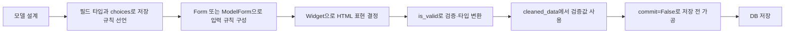
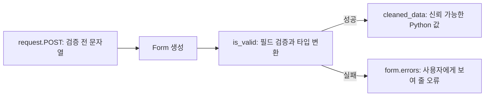

# 04_24 Django 모델 필드와 Form 심화

- 🎯 글의 목표: `AbstractUser`를 활용한 사용자 모델 확장을 복습하고, 모델 필드의 제약 조건과 Django Form의 검증·저장 흐름을 실제 코드로 이해한다.
- 🧩 핵심 키워드: `AbstractUser`, `choices`, `PositiveIntegerField`, `blank`, `null`, `Form`, `ModelForm`, Widget, `MultipleChoiceField`, `cleaned_data`, `save(commit=False)`
- ⭐ 중요도: ★★★★★
- 📝 한눈에 보는 내용: 모델은 데이터베이스 구조만 정의하지 않는다. 저장 가능한 값의 범위와 폼에서의 입력 규칙까지 표현한다. 이 글에서는 선택지를 코드와 레이블로 분리하고, 음수가 될 수 없는 값을 모델에 선언하며, 폼 검증과 DB의 빈 값을 구분한다. 이어서 일반 Form과 ModelForm, 폼 상속과 Widget을 비교하고, 여러 선택값을 검증한 뒤 저장 형식으로 변환하는 전체 과정을 살펴본다.
- 🔗 관련 문제 / 주제: Django 인증, 커스텀 사용자 모델, 모델 설계, 폼 검증, 관리자 페이지, 다중 선택 입력

---

## 1. 들어가며

Django에서 모델과 폼을 처음 배울 때는 모델은 데이터베이스, 폼은 HTML을 만드는 도구라고 나누어 기억하기 쉽다. 하지만 실제 프로젝트에서는 두 영역이 밀접하게 이어진다. 모델 필드에 `choices`를 지정하면 ModelForm과 관리자 페이지가 자동으로 선택 상자를 만들고, `blank` 설정은 폼의 필수 입력 여부에 영향을 준다. 사용자가 제출한 문자열은 Form의 검증을 통과하면서 정수나 날짜 같은 Python 값으로 바뀐다.

이번 강의는 이 연결을 구체적으로 보여 준다. 먼저 Django의 인증 기능을 유지하면서 사용자 정보를 확장하는 `AbstractUser`를 확인한다. 그다음 모델이 허용할 값을 `choices`와 `PositiveIntegerField`로 제한하고, 자주 혼동하는 `blank`와 `null`의 책임을 분리한다.

후반부에서는 여러 종류의 Form을 비교한다. 일반 `Form`은 입력과 검증 규칙을 직접 정의하고, `ModelForm`은 모델과 연결해 저장까지 맡는다. 폼 상속과 Widget은 검증 규칙을 재사용하면서 화면 표현을 조절하는 방법이다. 마지막으로 `MultipleChoiceField`가 반환하는 리스트를 `cleaned_data`에서 꺼내 모델이 저장할 문자열로 바꾸며, `save(commit=False)`가 필요한 이유를 확인한다.

이 흐름을 이해하면 폼 코드를 단순히 외우는 대신 다음 세 질문으로 설계할 수 있다.

1. 모델에는 어떤 값이 저장되어야 하는가?
2. 사용자에게는 어떤 입력 UI를 보여 주어야 하는가?
3. 검증된 입력을 저장 직전에 어떤 형태로 변환해야 하는가?

## 2. 핵심 개념 정리

이번 강의의 흐름은 다음과 같다.



본문은 다섯 갈래로 이어진다.

- `AbstractUser`: Django의 인증 필드를 유지하면서 프로젝트 필드를 추가한다.
- 모델 제약: `choices`와 적절한 필드 타입으로 잘못된 값이 들어갈 가능성을 줄인다.
- 빈 값 정책: 폼 검증의 `blank`와 DB 스키마의 `null`을 구분한다.
- 폼 구성: 일반 Form, ModelForm, 상속, Widget의 책임을 나눈다.
- 검증과 저장: `is_valid()`, `cleaned_data`, `commit=False`를 한 흐름으로 연결한다.

## 3. 본문 정리

### 3.1 `AbstractUser`로 기본 인증을 유지하며 확장한다

`AbstractUser`는 Django 기본 User가 가진 사용자 이름, 암호화된 비밀번호, 이메일, 이름, 권한, 가입일 등의 필드를 제공한다. 이를 상속하면 인증 기능을 새로 만들지 않고 프로젝트에 필요한 필드만 추가할 수 있다.

```python
# accounts/models.py
from django.contrib.auth.models import AbstractUser
from django.db import models


class User(AbstractUser):
    # 기본 인증 필드는 AbstractUser에서 상속받는다.
    nickname = models.CharField(max_length=30, blank=True)
    profile_image = models.ImageField(
        upload_to='profile_pics/',
        blank=True,
    )
    date_of_birth = models.DateField(
        null=True,
        blank=True,
    )
```

닉네임과 프로필 이미지는 문자열 또는 파일 경로를 저장하므로 폼에서 비워 둘 수 있게 `blank=True`를 사용했다. 생년월일은 날짜형 필드이므로 값이 없을 때 DB에도 `NULL`을 저장할 수 있도록 `null=True`를 함께 지정했다.

프로젝트가 이 모델을 사용자 모델로 사용하려면 설정에 연결해야 한다.

```python
# settings.py
AUTH_USER_MODEL = 'accounts.User'
```

다른 모델이 사용자를 참조할 때는 User 클래스를 직접 가져와 고정하지 않고 설정을 참조하는 방식이 안전하다.

```python
from django.conf import settings
from django.db import models


class Todo(models.Model):
    user = models.ForeignKey(
        settings.AUTH_USER_MODEL,
        on_delete=models.CASCADE,
    )
```

⚠️ 주의: 커스텀 사용자 모델은 프로젝트 첫 마이그레이션 전에 정하는 것이 가장 안전하다. 기본 User로 이미 여러 마이그레이션과 관계를 만든 뒤 교체하면 테이블과 외래 키를 다시 정리해야 해서 작업 범위가 크게 늘어난다.

### 3.2 `choices`는 저장값과 사용자용 레이블을 분리한다

상태처럼 허용할 값이 정해져 있다면 자유로운 문자열 입력을 받는 것보다 선택지를 제한하는 편이 낫다. `choices`의 각 항목은 `(DB에 저장할 값, 사용자에게 보여 줄 레이블)` 구조다.

```python
# todos/models.py
from django.db import models


class Todo(models.Model):
    STATUS_CHOICES = [
        ('TODO', '할 일'),
        ('DOING', '진행 중'),
        ('DONE', '완료'),
    ]

    status = models.CharField(
        max_length=5,
        choices=STATUS_CHOICES,
        default='TODO',
        verbose_name='상태',
        help_text='현재 작업 상태를 선택해 주세요.',
    )
```

사용자가 화면에서 `진행 중`을 선택하면 DB에는 `DOING`이 저장된다. 코드는 짧고 변경에 안정적인 값으로 유지하고, 레이블은 사용자에게 자연스러운 문장으로 보여 줄 수 있다. ModelForm이나 관리자 페이지는 이 정보를 읽어 기본 텍스트 입력 대신 `<select>`를 자동 생성한다.

| 역할 | 예시 | 변경 시 영향 |
|---|---|---|
| 저장값 | `DOING` | 코드 조건과 기존 DB 데이터에 영향 |
| 레이블 | `진행 중` | 화면에 보이는 문구만 바뀜 |

템플릿에서 저장값이 아닌 레이블을 보여 주려면 Django가 만들어 주는 `get_<필드명>_display()`를 사용할 수 있다.

```django
<p>저장값: {{ todo.status }}</p>
<p>표시값: {{ todo.get_status_display }}</p>
```

선택지 목록을 `STATUS_CHOICES`처럼 대문자로 쓰는 것은 PEP 8의 상수 표기 관례다. 실행 중 바꾸지 않는 고정 규칙이라는 의도를 전달한다.

💡 포인트: 최신 Django에서는 `models.TextChoices`와 `models.IntegerChoices`를 사용하면 선택지의 이름, 값, 레이블을 더 구조적으로 관리할 수 있다.

```python
class Todo(models.Model):
    class Status(models.TextChoices):
        TODO = 'TODO', '할 일'
        DOING = 'DOING', '진행 중'
        DONE = 'DONE', '완료'

    status = models.CharField(
        max_length=5,
        choices=Status.choices,
        default=Status.TODO,
    )
```

### 3.3 `PositiveIntegerField`는 도메인 규칙을 필드에 드러낸다

재고, 조회수, 우선순위처럼 음수가 될 수 없는 값은 `IntegerField`보다 `PositiveIntegerField`가 의도를 잘 표현한다. Django의 모델·폼 검증은 음수 입력을 허용하지 않는다.

```python
class Todo(models.Model):
    PRIORITY_CHOICES = [
        (1, '낮음'),
        (2, '보통'),
        (3, '높음'),
    ]

    priority = models.PositiveIntegerField(
        choices=PRIORITY_CHOICES,
        default=2,
        verbose_name='우선순위',
        help_text='1은 낮음, 2는 보통, 3은 높음입니다.',
    )
```

이 모델은 두 겹으로 범위를 제한한다. 필드 타입은 음수를 막고, `choices`는 사용자 입력을 1·2·3으로 제한한다. 다만 모든 데이터 변경 경로에서 모델의 `full_clean()`이 자동 호출되는 것은 아니다. DB 수준의 엄격한 범위가 중요하다면 `CheckConstraint`까지 둘 수 있다.

```python
from django.db import models
from django.db.models import Q


class Todo(models.Model):
    priority = models.PositiveIntegerField(default=2)

    class Meta:
        constraints = [
            models.CheckConstraint(
                condition=Q(priority__gte=1, priority__lte=3),
                name='todo_priority_between_1_and_3',
            ),
        ]
```

📌 핵심: 필드 타입은 단순 저장 형식이 아니라 “이 값은 어떤 의미와 범위를 갖는가”를 표현하는 모델 설계 도구다.

### 3.4 `blank`와 `null`은 서로 다른 레벨의 규칙이다

두 옵션은 모두 비어 있는 값과 관련 있지만 책임이 다르다.

| 옵션 | 적용 레벨 | `True`일 때의 의미 |
|---|---|---|
| `blank` | Form·ModelForm 검증 | 사용자가 비워 제출해도 됨 |
| `null` | 데이터베이스 스키마 | 컬럼에 SQL `NULL`을 저장할 수 있음 |

```python
class Profile(models.Model):
    # 문자열은 빈 값을 ''로 표현하는 것이 일반적이다.
    introduction = models.CharField(max_length=100, blank=True)

    # 날짜가 없으면 DB에서 NULL로 표현한다.
    date_of_birth = models.DateField(null=True, blank=True)
```

`null=True`만 지정해도 ModelForm에서는 여전히 필수 입력일 수 있다. 반대로 `blank=True`는 폼 검증을 통과하게 하지만 DB 컬럼이 `NULL`을 허용한다는 뜻은 아니다.

문자열 필드에 `null=True`를 함께 쓰는 것은 대개 피한다. “값 없음”이 빈 문자열 `''`과 `NULL` 두 종류가 되어 조회와 검증이 복잡해지기 때문이다. 단, 기존 DB 설계나 외부 연동처럼 두 상태를 구분해야 하는 명확한 이유가 있다면 예외가 될 수 있다.

⚠️ 주의: `blank=True, null=True, default=0`을 동시에 무심코 넣으면 “사용자가 입력하지 않음”, “DB의 NULL”, “실제 값 0”이라는 세 상태가 생긴다. 이 상태들을 서비스에서 구분할 필요가 있는지 먼저 결정해야 한다.

### 3.5 일반 `Form`과 `ModelForm`의 책임을 구분한다

두 클래스는 모두 입력을 렌더링하고 검증하지만 저장 대상이 다르다.

#### 3.5.1 일반 Form

DB 모델과 직접 연결되지 않은 검색, 문의, 로그인 조건 입력 등에 적합하다.

```python
# formsapp/forms.py
from django import forms


class ContactForm(forms.Form):
    subject = forms.CharField(max_length=100)
    message = forms.CharField(widget=forms.Textarea)
```

검증된 값을 사용해 이메일을 보내거나 검색 조건을 만들 수 있지만, `.save()`는 제공하지 않는다.

#### 3.5.2 ModelForm

모델 필드를 바탕으로 입력 필드와 기본 검증을 만들고, 유효한 데이터로 모델 인스턴스를 저장한다.

```python
from django import forms

from .models import Product


class ProductForm(forms.ModelForm):
    class Meta:
        model = Product
        fields = ['name', 'price', 'category']
```

`fields = '__all__'`은 모델에 필드가 추가될 때 의도하지 않은 입력까지 노출할 수 있다. 사용자에게 허용할 필드를 명시하는 편이 안전하다.

| 기준 | `Form` | `ModelForm` |
|---|---|---|
| 모델 연결 | 없음 | 특정 모델과 연결 |
| 저장 기능 | 직접 구현 | `save()` 제공 |
| 적합한 사례 | 검색·문의·인증 입력 | 생성·수정 CRUD |

### 3.6 폼 상속은 검증 규칙을 재사용한다

여러 폼이 이름과 이메일 같은 공통 입력을 가진다면 부모 Form에 정의하고 자식 Form에서 필드를 추가할 수 있다.

```python
from django import forms


class BaseForm(forms.Form):
    name = forms.CharField(max_length=50)
    email = forms.EmailField()


class ExtendedForm(BaseForm):
    address = forms.CharField(max_length=100)
```

상속은 필드만이 아니라 `clean_<field>()`와 `clean()`에 작성한 검증도 재사용한다. 다만 서로 목적이 다른 폼을 단지 필드 몇 개가 같다는 이유로 억지로 묶으면 부모 변경이 모든 자식에게 영향을 준다. 실제로 같은 규칙을 공유할 때 사용한다.

### 3.7 Widget은 표현을 바꾸고 Field는 검증을 맡는다

Form Field는 어떤 값을 받고 어떻게 검증할지를 결정한다. Widget은 그 필드를 어떤 HTML 요소로 표현할지를 결정한다.

```python
class WidgetForm(forms.Form):
    username = forms.CharField(
        widget=forms.TextInput(
            attrs={
                'class': 'form-control',
                'placeholder': '사용자 이름',
            },
        ),
    )
    bio = forms.CharField(
        required=False,
        widget=forms.Textarea(
            attrs={'rows': 5, 'class': 'form-control'},
        ),
    )
```

`Textarea`로 바꿔도 값은 여전히 `CharField`의 문자열 검증을 거친다. CSS 클래스와 placeholder는 UI를 바꾸지만 서버 검증을 대신하지 않는다.

### 3.8 `MultipleChoiceField`는 여러 선택값을 리스트로 만든다

여러 항목을 동시에 선택해야 할 때 `MultipleChoiceField`를 사용한다. 기본 Widget은 `<select multiple>`이며, `CheckboxSelectMultiple`로 체크박스 목록을 만들 수 있다.

```python
class ProductForm(forms.ModelForm):
    CATEGORY_CHOICES = [
        ('ELEC', 'Electronics'),
        ('BOOK', 'Books'),
        ('FASH', 'Fashion'),
    ]

    category = forms.MultipleChoiceField(
        choices=CATEGORY_CHOICES,
        required=False,
        widget=forms.CheckboxSelectMultiple,
        help_text='하나 이상의 카테고리를 선택하세요.',
    )

    class Meta:
        model = Product
        fields = ['name', 'price', 'category']
```

두 항목을 선택하면 검증 후 값은 다음처럼 Python 리스트가 된다.

```python
['ELEC', 'BOOK']
```

여기서 중요한 점은 폼의 자료형과 모델의 저장 형식이 자동으로 항상 일치하는 것은 아니라는 사실이다. 강의 실습의 모델은 `category`를 하나의 `CharField`로 저장하므로 리스트를 그대로 저장할 수 없다. 저장 전에 변환해야 한다.

### 3.9 `is_valid()`와 `cleaned_data`가 신뢰 경계를 만든다

`request.POST`는 브라우저가 보낸 검증 전 데이터다. 숫자와 날짜도 기본적으로 문자열 형태로 들어온다. `form.is_valid()`가 각 Field의 규칙을 검사하고 변환한 뒤, 성공한 값만 `cleaned_data`에 넣는다.



```python
def example_view(request):
    if request.method == 'POST':
        form = ProductForm(request.POST)

        if form.is_valid():
            # MultipleChoiceField이므로 list[str]가 들어 있다.
            categories = form.cleaned_data.get('category', [])
            print(type(categories), categories)
        else:
            print(form.errors)
```

`cleaned_data`는 반드시 `is_valid()`가 성공한 뒤 사용한다. 검증 실패 시에는 성공적으로 검증된 일부 필드만 존재할 수 있으므로 저장 로직으로 넘어가면 안 된다.

### 3.10 `save(commit=False)`는 저장 전에 인스턴스를 가공한다

ModelForm의 `save()`는 기본적으로 즉시 DB에 저장한다. 하지만 폼의 리스트 값을 모델의 문자열 형식으로 바꾸거나, 현재 사용자를 외래 키에 넣어야 한다면 저장 전 인스턴스가 필요하다.

```python
# formsapp/views.py
from django.contrib import messages
from django.shortcuts import redirect, render

from .forms import ProductForm


def form2(request):
    if request.method == 'POST':
        form = ProductForm(request.POST)

        if form.is_valid():
            # 아직 INSERT/UPDATE하지 않고 Product 인스턴스만 만든다.
            product = form.save(commit=False)

            category_values = form.cleaned_data.get('category', [])
            product.category = ','.join(category_values)

            # 가공이 끝난 시점에 한 번 저장한다.
            product.save()

            messages.success(
                request,
                f"제품 '{product.name}'이 성공적으로 저장되었습니다.",
            )
            return redirect('formsapp:form2')
    else:
        form = ProductForm()

    return render(request, 'formsapp/form2.html', {'form': form})
```

```text
체크박스 선택
['ELEC', 'BOOK']
        ↓ ','.join(...)
'ELEC,BOOK'
        ↓ product.save()
CharField에 저장
```

`commit=False`는 저장을 취소하는 옵션이 아니라 **저장을 잠시 미루는 옵션**이다. 마지막에 `product.save()`를 호출하지 않으면 DB에는 아무것도 반영되지 않는다.

⚠️ 주의: 콤마 문자열 저장은 학습용으로 간단하지만 검색과 수정에 약하다. 값 자체에 콤마가 들어갈 수 있고, 특정 카테고리 검색도 문자열 규칙에 의존한다. 카테고리가 독립된 데이터이고 여러 상품과 관계를 맺는다면 `ManyToManyField`가 더 적절하다.

```python
class Category(models.Model):
    code = models.CharField(max_length=20, unique=True)
    label = models.CharField(max_length=50)


class Product(models.Model):
    name = models.CharField(max_length=100)
    categories = models.ManyToManyField(Category, blank=True)
```

Many-to-Many가 포함된 ModelForm에서 `commit=False`를 사용했다면 인스턴스를 먼저 저장한 다음 `form.save_m2m()`도 호출해야 한다.

```python
product = form.save(commit=False)
product.save()     # PK가 먼저 필요하다.
form.save_m2m()    # 다대다 중간 테이블을 저장한다.
```

## 4. 적용 관점에서 다시 보기

모델과 폼 문제가 나오면 HTML부터 만들기보다 데이터의 의미를 먼저 분해한다.

1. 저장값의 타입과 허용 범위를 정한다.
2. 비어 있는 상태가 필요한지, 빈 문자열과 `NULL` 중 무엇으로 표현할지 정한다.
3. 저장 가능한 값이 고정되어 있다면 `choices`를 고려한다.
4. DB와 무관한 입력이면 `Form`, 모델 생성·수정이면 `ModelForm`을 선택한다.
5. Widget으로 화면 표현을 정하되 서버 검증은 Field에 남긴다.
6. POST 요청에서는 폼을 바인딩하고 `is_valid()`를 먼저 호출한다.
7. 추가 가공이 필요하면 `cleaned_data`와 `commit=False`를 사용한다.
8. 마지막에 실제 저장과 리다이렉트를 수행한다.

문제 문장에서 다음 신호를 포착하면 구현 도구를 선택하기 쉽다.

| 요구사항 신호 | 떠올릴 도구 |
|---|---|
| 정해진 값 중 하나 | 모델 필드의 `choices` |
| 여러 항목 동시 선택 | `MultipleChoiceField` 또는 관계 모델 |
| 음수가 될 수 없는 값 | `PositiveIntegerField`와 제약 조건 |
| 폼에서 선택 입력 | `blank=True` 또는 `required=False` |
| DB에서 값 자체가 없음 | `null=True` 검토 |
| 모델 저장과 직접 연결 | `ModelForm` |
| 저장 전에 사용자·변환값 추가 | `save(commit=False)` |
| 검증된 Python 값 필요 | `cleaned_data` |

오류가 발생하면 `request.POST → form.is_bound → form.errors → cleaned_data → 변환 결과 → save 호출 → DB 값` 순서로 좁힌다. 화면만 보고 추측하기보다 각 경계에서 자료형과 값을 확인하면 원인을 빠르게 찾을 수 있다.

## 5. 배운 점 / 확장 포인트

### 5.1 이번 강의 이전에 몰랐던 것 또는 새로 이해된 것

모델 필드는 DB 컬럼 타입만 정하는 것이 아니라 선택지, 기본값, 폼 필수 여부와 사용자용 설명까지 연결한다. 또한 `cleaned_data`는 단순한 POST 복사본이 아니라 검증과 타입 변환을 끝낸 값이라는 점이 중요하다.

### 5.2 앞으로 이어지는 연결점

이 구조는 회원 프로필, 상품 등록, 게시글 분류처럼 대부분의 CRUD 기능에 이어진다. 특히 `commit=False`로 현재 로그인 사용자를 연결하고, 다대다 관계는 `save_m2m()`로 저장하는 흐름은 이후 프로젝트에서 반복해서 사용된다.

### 5.3 더 파볼 만한 주제

모델 검증을 위한 `validators`, 여러 필드 관계를 검사하는 `Form.clean()`, DB 무결성을 보장하는 `CheckConstraint`와 `UniqueConstraint`를 이어서 학습할 수 있다. 선택값이 자주 바뀌거나 별도 속성을 가진다면 `choices` 대신 독립 모델과 외래 키·다대다 관계로 설계하는 기준도 살펴볼 만하다.

## 6. 요약 정리

- `AbstractUser`는 Django 인증 기능을 유지하면서 프로젝트 필드를 추가하는 표준적인 출발점이다.
- `choices`는 DB 저장값과 사용자용 레이블을 분리하고 입력값의 일관성을 높인다.
- `PositiveIntegerField`는 음수가 될 수 없는 도메인 규칙을 모델에 표현한다.
- `blank`는 폼 검증, `null`은 DB 스키마의 빈 값 정책이다.
- 문자열 필드는 특별한 이유가 없다면 `NULL`과 빈 문자열을 함께 사용하지 않는다.
- 일반 `Form`은 입력·검증, `ModelForm`은 모델 검증과 저장까지 연결한다.
- Field는 검증을, Widget은 HTML 표현을 담당한다.
- `MultipleChoiceField`의 검증 결과는 리스트이며 모델 저장 형식과 다를 수 있다.
- `cleaned_data`는 `is_valid()` 성공 후 사용 가능한 검증·변환 완료 데이터다.
- `save(commit=False)`는 저장 전에 인스턴스를 가공할 때 사용하며 마지막 저장을 직접 호출해야 한다.
- 여러 선택값이 실제 관계를 나타낸다면 콤마 문자열보다 `ManyToManyField`가 적절하다.

🧠 기억할 것: Django Form의 핵심은 HTML 자동 생성이 아니라, 신뢰할 수 없는 요청 데이터를 검증된 Python 값으로 바꾸고 모델의 저장 규칙에 안전하게 연결하는 데 있다.

## 7. 미니 퀴즈 또는 체크리스트

1. `choices`의 저장값과 레이블은 각각 어디에 사용되는가?
2. `blank=True`와 `null=True`가 적용되는 레벨을 설명할 수 있는가?
3. 문자열 필드에 `null=True`를 일반적으로 권장하지 않는 이유는 무엇인가?
4. `Form`과 `ModelForm` 중 검색 조건 입력에는 어느 쪽이 더 자연스러운가?
5. Field와 Widget은 각각 어떤 책임을 갖는가?
6. `MultipleChoiceField`의 값은 `cleaned_data`에서 어떤 자료형이 되는가?
7. `cleaned_data`를 `is_valid()` 전에 사용하면 안 되는 이유는 무엇인가?
8. `save(commit=False)` 뒤에 반드시 해야 할 일은 무엇인가?
9. 다대다 필드가 있는 ModelForm에서 `commit=False`를 사용했다면 왜 `save_m2m()`가 필요한가?
10. 다음 항목을 구현 전에 확인했는가?
    - [ ] 저장할 값과 사용자에게 보여 줄 레이블을 구분했다.
    - [ ] 빈 값의 의미와 저장 형태를 결정했다.
    - [ ] 폼 오류를 사용자에게 다시 보여 준다.
    - [ ] 검증 전 `request.POST`를 저장 로직에 직접 사용하지 않는다.
    - [ ] 다중 선택이 문자열인지 실제 관계인지 판단했다.
