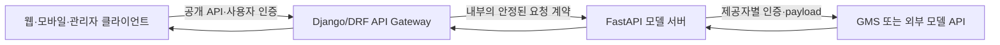

# FastAPI: API 기초부터 모델 서빙·중간 서버·멀티모달 연동까지

- 🎯 글의 목표: FastAPI로 요청과 응답의 규격을 정의하고, 외부 모델 API를 안전하게 감싼 뒤 Django/DRF 게이트웨이와 웹 클라이언트까지 연결하는 전체 흐름을 이해한다.
- 🧩 핵심 키워드: FastAPI, Uvicorn, OpenAPI, curl, Pydantic, 요청 검증, 응답 직렬화, 모델 서빙, 환경 변수, Structured Outputs, JSON Schema, Guardrail, API Gateway, DRF, CORS, 이미지 생성, TTS, Base64
- ⭐ 중요도: 높음
- 📝 한눈에 보는 내용: 작은 `GET` API에서 출발해 `POST` 본문 검증, GMS의 OpenAI 호환 API 호출, 구조화된 LLM 출력, 답변 평가와 Guardrail, Django 중간 서버, 이미지·음성 API와 브라우저 재생까지 하나의 요청 흐름으로 연결한다.
- 🔗 관련 문제 / 주제: AI 모델 서버 구축, 프론트엔드-백엔드 분리, 외부 API 프록시, API 보안, 장애 처리

---

## 1. 들어가며

웹 애플리케이션을 만들 때 Django는 데이터베이스 모델, 관리자 화면, 인증, 템플릿처럼 서비스 전반에 필요한 기능을 폭넓게 제공한다. 그러나 이미 학습된 AI 모델에 JSON을 보내고 결과만 받아야 하는 서버라면 이 모든 기능이 항상 필요한 것은 아니다. 이때 FastAPI는 비교적 작은 코드로 HTTP 경로와 입출력 규격을 정의하고, 자동 문서까지 만들 수 있는 좋은 선택지가 된다.

이번 강의는 FastAPI 문법만 익히는 데서 끝나지 않는다. 먼저 간단한 응답 API를 만들고 Postman과 curl로 확인한다. 이어서 Pydantic 모델로 요청과 응답의 계약을 정의하고, 외부 모델 서버를 호출하는 API로 확장한다. 그 위에 LLM의 답을 JSON Schema에 맞추는 구조화된 출력, 답변 점수 계산, Guardrail을 얹는다. 마지막에는 FastAPI 모델 서버 앞에 Django/DRF 중간 서버를 두고 웹·모바일·관리자 클라이언트가 안정적으로 같은 API를 사용하도록 만드는 구조까지 살펴본다.

이 흐름에서 계속 붙잡아야 할 질문은 하나다.

> 클라이언트가 보낸 데이터를 어디에서 검증하고, 외부 모델의 불안정한 응답을 어디에서 통제하며, 최종 사용자에게 어떤 계약으로 전달할 것인가?

FastAPI, Pydantic, DRF Serializer는 서로 문법은 다르지만 모두 이 계약을 명확하게 만드는 도구다. 따라서 각 코드를 외우기보다 요청이 어느 계층을 지나며 무엇으로 바뀌는지를 따라가는 것이 중요하다.

---

## 2. 핵심 개념 정리

이번 강의는 작은 API를 여러 계층으로 확장하는 순서로 진행된다.

처음에는 `FastAPI()`로 애플리케이션 객체를 만들고 경로 동작 함수를 등록한다. Uvicorn이 HTTP 서버 역할을 맡고, FastAPI는 코드의 타입 정보와 Pydantic 모델을 바탕으로 OpenAPI 명세와 대화형 문서를 생성한다. 이 단계에서는 서버를 만드는 일뿐 아니라 Postman, curl, 셸 스크립트로 계약을 반복 검증하는 습관도 함께 익힌다.

다음에는 메시지와 반복 횟수를 받는 POST API를 통해 입력 계약과 출력 계약을 분리한다. Python 타입 힌트는 일반 함수 호출을 강제로 막지 않지만, Pydantic 모델이 만들어지거나 FastAPI가 HTTP 요청을 모델에 바인딩하는 시점에는 실제 검증이 일어난다. 이 차이를 이해해야 422 검증 오류와 직접 만든 400 오류를 구분할 수 있다.

그 뒤부터 FastAPI는 모델 서버의 입구가 된다. 서버는 비밀 키를 환경 변수에서 읽고, GMS가 제공하는 OpenAI 호환 API에 인증 헤더와 JSON payload를 보낸다. LLM의 자유 형식 문자열이 필요한 곳도 있지만, 점수나 판정처럼 프로그램이 후속 처리할 값은 JSON Schema로 구조를 제한하고 다시 Pydantic으로 검증해야 한다.

마지막에는 클라이언트와 모델 서버 사이에 Django/DRF 게이트웨이를 둔다. 게이트웨이는 인증, 권한, CORS, 공개 API 호환성, 오류 변환을 담당하고 FastAPI는 모델 호출 방식에 집중한다. 같은 구조가 채팅뿐 아니라 이미지 생성과 TTS에도 적용되며, 최종적으로 브라우저가 Fetch API로 음성 데이터를 받아 `<audio>`로 재생하는 흐름까지 이어진다.

---

## 3. 본문 정리

### 3.1 FastAPI란 무엇이며 Django/DRF와 어떻게 다른가

FastAPI는 Python 타입 힌트를 적극적으로 활용해 API를 만드는 웹 프레임워크다. 경로, HTTP 메서드, 요청 데이터, 응답 데이터의 규격을 코드 가까이에 선언할 수 있고, 그 정보로 입력 검증과 OpenAPI 문서를 자동화한다.

강의에서는 FastAPI와 Django의 차이를 다음과 같은 개발 맥락에서 설명한다.

| 관점 | FastAPI | Django와 DRF |
|---|---|---|
| 주된 출발점 | API 경로와 입출력 모델 | Django 프로젝트, 앱, 데이터 모델 |
| 데이터베이스 | 없어도 자연스럽게 사용 가능 | Django 웹 앱은 DB를 사용하는 경우가 많음 |
| HTML 템플릿 | 기본 초점이 API이므로 제공하지 않음 | Django 템플릿 엔진 제공 |
| ORM·Admin·Auth | 프레임워크 핵심에 포함되지 않으며 필요 시 별도 선택 | Django가 통합 제공 |
| 데이터 검증 | Pydantic 모델 | DRF Serializer 또는 Django Form |
| 잘 맞는 강의 사례 | 가벼운 모델 서빙 API | DB 중심 서비스와 공개 API 게이트웨이 |

이 비교를 “FastAPI는 DB를 쓸 수 없고 Django는 반드시 DB가 필요하다”는 규칙으로 받아들이면 안 된다. FastAPI에서도 SQLAlchemy 같은 도구를 연결할 수 있고, Django도 DB 기능을 거의 쓰지 않는 API를 만들 수 있다. 여기서의 차이는 **기본 제공 범위와 이번 실습에서 맡길 책임**이다. 강의에서는 FastAPI를 AI 모델 호출에 가까운 서버로, Django/DRF를 사용자·권한·공개 API를 관리하는 중간 서버로 사용한다.

DRF를 배웠다면 Pydantic 모델과 Serializer가 닮아 보일 수 있다. 둘 다 입력을 검증하고 응답 구조를 표현한다. 다만 DRF의 `ModelSerializer`는 Django ORM 모델과 저장 흐름에 밀접하고, Pydantic `BaseModel`은 특정 ORM 없이도 일반적인 Python 데이터의 검증과 직렬화에 사용할 수 있다는 차이가 있다.

### 3.2 환경 구성, 첫 애플리케이션, Uvicorn과 자동 문서

프로젝트를 시작할 때는 가상 환경을 만들고 활성화한 뒤, 다음 내용을 `requirements.txt`에 적어 의존성을 설치한다. 강의 시점의 예시는 네 패키지를 사용한다.

```text
fastapi==0.128.0
uvicorn==0.40.0
python-dotenv==1.2.1
requests==2.32.5
```

`fastapi`는 경로 등록, 요청 처리, 검증과 OpenAPI 생성을 담당한다. `uvicorn`은 ASGI 애플리케이션인 FastAPI를 실제 HTTP 요청과 연결하는 서버다. `python-dotenv`는 로컬 `.env` 파일의 값을 환경 변수로 읽고, `requests`는 FastAPI 서버가 다시 외부 모델 API를 호출할 때 사용한다. 버전을 고정하면 수업 환경을 재현하기 쉽지만, 운영에서는 보안 수정과 호환성을 검토하며 갱신해야 한다.

첫 번째 실습은 애플리케이션 객체와 경로 동작 함수의 관계를 보여준다.

```python
from fastapi import FastAPI

# 이 객체가 Uvicorn이 실행할 ASGI 애플리케이션이다.
app = FastAPI(
    title="FastAPI 기초",
    description="학습용 FastAPI 예제",
    version="1.0.0",
)


# GET /hello 요청이 들어오면 hello 함수가 실행된다.
@app.get("/hello")
def hello() -> str:
    """간단한 문자열 응답을 반환한다."""
    return "안녕하세요"


# 첫 번째 실습 파일의 루트 경로도 같은 원리다.
@app.get("/")
async def root() -> dict[str, str]:
    return {"message": "Hello World"}
```

`@app.get("/hello")`는 단순한 주석이 아니라, `hello` 함수를 `GET /hello` 경로에 등록하는 데코레이터다. 반환한 Python 문자열이나 딕셔너리는 FastAPI가 JSON 응답으로 직렬화한다. 문자열은 JSON 문자열로, 딕셔너리는 JSON 객체로 전송된다.

서버는 프로젝트 디렉터리에서 다음과 같이 실행한다.

```bash
uvicorn main:app --reload
```

`main:app`의 앞부분은 `main.py` 모듈, 뒷부분은 그 안의 `app` 객체를 뜻한다. `--reload`는 파일 변경을 감지해 개발 서버를 다시 시작하는 옵션이다. 개발 중에는 편리하지만 추가 감시 프로세스를 사용하므로 운영 실행 방식으로 그대로 쓰지 않는다.

서버가 켜지면 다음 주소를 확인할 수 있다.

| 주소 | 의미 |
|---|---|
| `http://127.0.0.1:8000/hello` | 직접 만든 경로의 응답 |
| `http://127.0.0.1:8000/docs` | Swagger UI 기반 대화형 API 문서 |
| `http://127.0.0.1:8000/redoc` | ReDoc 형식의 API 문서 |
| `http://127.0.0.1:8000/openapi.json` | 도구가 읽는 OpenAPI 명세 |

자동 문서는 장식이 아니다. 요청 필드, 필수 여부, 타입, 가능한 응답을 서버 코드와 같은 출처에서 생성하므로 프론트엔드와 백엔드가 계약을 확인하는 기준이 된다. 다만 설명, 예시, 오류 응답을 코드에 충분히 선언하지 않으면 문서도 그만큼 빈약해진다.

#### `def`와 `async def`를 구분하는 기준

첫 실습의 `root`는 `async def`, 슬라이드의 `hello`는 `def`로 작성되어 있다. 둘 다 FastAPI 경로로 사용할 수 있다.

- `async def`는 비동기 라이브러리를 `await`하며 대기 시간을 다른 요청 처리에 양보할 때 적합하다.
- 일반 `def` 경로는 FastAPI가 별도의 스레드 풀에서 실행하므로 동기 I/O 라이브러리를 사용할 수 있다.
- `requests.post()`는 동기 함수다. 이를 `async def` 안에서 그대로 호출하면 이벤트 루프를 막을 수 있으므로, 이번 강의처럼 `requests`를 쓸 때는 일반 `def` 경로가 자연스럽다.
- 비동기 경로가 언제나 더 빠른 것은 아니다. CPU 연산, 동기 라이브러리, 동시 요청 수에 따라 병목이 달라진다. 비동기 호출이 필요하면 `httpx.AsyncClient` 같은 비동기 HTTP 클라이언트를 함께 선택해야 한다.

⚠️ 주의: `uvicorn main:app`에서 모듈명이나 객체명이 실제 코드와 다르면 애플리케이션을 불러오지 못한다. 실행 위치, 파일명, `app = FastAPI()` 선언을 함께 확인해야 한다.

### 3.3 Postman, curl, 셸 스크립트로 API 테스트하기

API 테스트는 “주소가 열리는지”만 보는 작업이 아니다. 클라이언트가 특정 메서드, 헤더, 본문으로 요청했을 때 서버가 약속한 상태 코드와 응답 본문을 반환하는지 검증하는 과정이다.

Postman은 GUI에서 메서드, URL, 헤더, body를 나누어 설정하고 요청을 컬렉션으로 저장할 수 있어 학습과 협업에 편하다. 반면 curl은 터미널에서 빠르게 실행할 수 있고 셸 스크립트나 CI에 넣기 쉽다. Postman이 무조건 더 좋거나 curl이 무조건 더 전문적인 것이 아니라, 탐색에는 GUI가 편하고 반복 자동화에는 명령형 도구가 유리하다.

가장 단순한 GET 요청은 다음과 같다.

```bash
curl -X GET http://127.0.0.1:8000/hello
```

`-X GET`은 HTTP 메서드를 명시한다. GET은 curl의 기본값이므로 생략할 수도 있지만, 학습 단계에서는 의도를 드러내는 데 도움이 된다. 자주 쓰는 옵션은 다음과 같다.

| 옵션 | 역할 |
|---|---|
| `-X POST` | 요청 메서드 지정 |
| `-H "Content-Type: application/json"` | JSON 본문임을 헤더로 알림 |
| `-d '{...}'` | 요청 body 전송 |
| `-s` | 진행률 등 부가 출력을 숨김 |
| `-i` | 응답 헤더와 상태 줄까지 출력 |
| `-o file` | 응답 본문을 파일로 저장 |
| `-w '%{http_code}'` | 응답 상태 코드를 별도로 출력 |

여러 요청을 반복하려면 셸 스크립트로 묶을 수 있다.

```bash
#!/usr/bin/env bash

BASE_URL="http://127.0.0.1:8000"

echo "API 테스트 시작"

# -sS는 평소 진행률은 숨기되 오류 메시지는 보여준다.
response=$(curl -sS -X GET "$BASE_URL/hello")

echo "서버 응답: $response"
```

Linux·macOS·Git Bash 환경에서는 `chmod +x test_api.sh`로 실행 권한을 준 뒤 `./test_api.sh`로 실행한다. Windows PowerShell에서는 같은 Bash 스크립트를 그대로 실행할 수 있는 셸인지 먼저 확인해야 한다.

단순히 응답을 출력하면 자동화는 되었지만 검증은 아직 약하다. HTTP 상태와 본문을 확인해야 실패를 놓치지 않는다.

```bash
#!/usr/bin/env bash

BASE_URL="http://127.0.0.1:8000"
body_file=$(mktemp)

# 본문은 임시 파일에, 상태 코드는 변수에 분리한다.
status=$(curl -sS -o "$body_file" -w "%{http_code}" \
  -X GET "$BASE_URL/hello")

body=$(cat "$body_file")
rm "$body_file"

if [[ "$status" != "200" || "$body" != '"안녕하세요"' ]]; then
  echo "실패: status=$status body=$body" >&2
  exit 1
fi

echo "성공: status=$status body=$body"
```

이제 서버가 500 오류 페이지를 반환해도 단순 성공 출력으로 착각하지 않는다. JSON 구조가 복잡해지면 문자열 전체를 비교하기보다 `jq` 같은 JSON 도구로 특정 필드와 타입을 검사하는 편이 안전하다.

⚠️ 주의: `Content-Type: application/json` 헤더만 붙이고 body에 잘못된 JSON을 보내면 파싱 단계에서 실패한다. 반대로 JSON body를 보내면서 헤더를 빠뜨리면 서버나 중간 프록시가 본문 형식을 다르게 해석할 수 있다.

### 3.4 POST 요청 설계와 Pydantic 검증: 메시지 반복 API

이제 클라이언트가 메시지와 반복 횟수를 보내면 반복한 문자열을 반환하는 API를 만든다. 요청과 응답의 계약은 다음과 같다.

```json
{
  "message": "안녕하세요",
  "count": 3
}
```

```json
{
  "new_message": "안녕하세요안녕하세요안녕하세요",
  "success": true
}
```

#### Python 타입 힌트와 런타임 검증은 다르다

Python의 타입 힌트는 개발 도구와 정적 타입 검사기가 코드를 이해하도록 돕지만, 일반적인 함수 호출 시 인자를 자동으로 차단하지 않는다.

```python
def show_value(value: int) -> None:
    print(value)


# 타입 힌트와 다르지만 Python 자체는 호출을 허용한다.
show_value("test")
```

따라서 `value: int`를 적었다는 사실만으로 런타임 검증이 끝난 것은 아니다. 반면 Pydantic `BaseModel`은 모델 인스턴스를 만드는 시점에 입력을 검사한다. FastAPI는 HTTP body를 함수 인자의 Pydantic 모델로 바인딩하면서 이 검증을 실행한다.

두 번째 실습 파일의 학습 의도를 유지하면서 반복 횟수의 범위를 보강하면 다음과 같다.

```python
from fastapi import FastAPI
from pydantic import BaseModel, Field

app = FastAPI()


class MessageRepeatRequest(BaseModel):
    # 빈 문자열은 의미 있는 반복 결과를 만들기 어려우므로 최소 길이를 둔다.
    message: str = Field(min_length=1, max_length=1_000)

    # 음수는 Python에서 오류가 아니라 빈 문자열을 만들기 때문에 명시적으로 막는다.
    # 과도한 응답 크기를 막기 위해 실습용 상한도 둔다.
    count: int = Field(ge=1, le=100)


class MessageRepeatResponse(BaseModel):
    new_message: str
    success: bool


@app.post("/repeat-test", response_model=MessageRepeatResponse)
def repeat_message(request: MessageRepeatRequest) -> MessageRepeatResponse:
    # 이 지점에 도달했다면 요청 body가 앞의 규격을 통과한 상태다.
    repeated_message = request.message * request.count

    # 응답 모델로 한 번 더 구조를 명확하게 만든다.
    return MessageRepeatResponse(
        new_message=repeated_message,
        success=True,
    )
```

원래 실습의 `count: int`만으로도 정수 타입은 검사되지만 값의 의미까지 보장하지는 않는다. 특히 Python에서 `"hi" * -1`은 예외 대신 빈 문자열을 만든다. 서버는 성공했다고 응답하지만 사용자의 의도에는 맞지 않는 조용한 버그가 된다. `ge=1`은 이를 입력 경계에서 막는다. 요구사항상 0회를 허용해 빈 문자열을 반환해야 한다면 `ge=0`으로 바꾸되, 그 선택을 API 계약에 적어야 한다.

`response_model=MessageRepeatResponse`는 응답 문서만 만드는 옵션이 아니다. 반환 데이터를 해당 모델에 맞게 직렬화하고 검증하며, 선언하지 않은 필드를 걸러내는 응답 계약으로도 작동한다. 요청 모델이 클라이언트 입력을 보호한다면 응답 모델은 서버가 클라이언트에게 내보내는 형태를 보호한다.

POST 요청은 다음과 같이 테스트한다.

```bash
curl -sS -X POST "http://127.0.0.1:8000/repeat-test" \
  -H "Content-Type: application/json" \
  -d '{"message":"hi","count":3}'
```

#### 오류 응답을 읽는 법

FastAPI에서 Pydantic 기반 요청 검증이 실패하면 일반적으로 **HTTP 422 Unprocessable Entity**가 반환된다. 슬라이드의 “자동 400”은 강의 중 간소화된 표현이며, 기본 동작과 구분해야 한다. 예를 들어 `count`가 0이면 오류의 `loc`에는 대개 `body`, `count`가 표시되고, `msg`와 `type`에는 어떤 제약을 어겼는지가 담긴다.

| 상황 | 일반적인 상태 | 의미 |
|---|---|---|
| JSON 문법 오류, 필드 누락, 타입·범위 불일치 | 422 | FastAPI가 함수 호출 전에 요청 모델 바인딩에 실패 |
| 문법은 맞지만 업무 규칙상 거부 | 개발자가 정한 400 | 함수 내부에서 `HTTPException(status_code=400, ...)` 등으로 처리 |
| `response_model`과 실제 반환값 불일치 | 보통 500 계열 | 서버 구현이 자신의 응답 계약을 지키지 못함 |

문자열 숫자 `"3"`처럼 일부 값은 Pydantic 설정에 따라 정수로 변환될 수 있다. 변환까지 금지해야 한다면 엄격한 타입 설정을 고려한다. “검증한다”는 말에는 타입 강제 변환을 허용할지까지 포함되어야 한다.

📌 핵심: 타입 힌트는 일반 Python 호출을 강제하지 않으며, 실제 API 입력 검증은 FastAPI가 요청을 Pydantic 모델에 바인딩하는 시점에 일어난다.

### 3.5 모델 서빙과 GMS의 OpenAI 호환 API 호출

모델 서빙은 학습된 모델의 기능을 HTTP API로 제공해 다른 프로그램이 요청과 응답으로 사용할 수 있게 하는 일이다. 대상은 GMS나 OpenAI 같은 외부 서비스일 수도 있고, Hugging Face 모델이나 직접 파인튜닝한 모델을 실행하는 내부 서버일 수도 있다.

#### 비밀 값과 환경 설정 분리

API 키를 소스 코드에 직접 적으면 Git 이력, 로그, 화면 공유를 통해 유출될 수 있다. 프로젝트 루트의 `.env`에는 로컬 비밀 값을 두고, `.gitignore`에는 적어도 다음 항목을 포함한다.

```gitignore
.env
venv/
__pycache__/
```

환경 변수 이름은 코드와 정확히 맞춰야 한다.

```dotenv
GMS_KEY=발급받은_API_키
GMS_URL=https://gms.example/gmsapi/api.openai.com/v1
```

실제 서비스에서는 `.env` 파일 배포보다 배포 플랫폼의 Secret Manager나 환경 변수 주입 기능이 더 적합하다. `.gitignore`는 새 커밋을 막을 뿐 이미 커밋된 비밀을 지워주지 않는다. 키가 이력에 들어갔다면 즉시 폐기하고 재발급해야 한다.

#### 요청과 응답 계약 만들기

강의에서는 GMS가 OpenAI 호환 형태의 `/chat/completions`를 제공한다고 가정한다. 다음 코드는 강의의 `messages → choices[0].message.content` 흐름을 유지하되, 운영에 필요한 방어 코드를 보강한 예시다.

```python
import os
from typing import Any, Literal

import requests
from dotenv import load_dotenv
from fastapi import FastAPI, HTTPException
from pydantic import BaseModel, Field

load_dotenv()

app = FastAPI()

GMS_KEY = os.getenv("GMS_KEY")
GMS_URL = os.getenv("GMS_URL")

if not GMS_KEY or not GMS_URL:
    # 잘못된 서버 설정은 요청을 받을 때까지 숨기지 않고 시작 단계에서 드러낸다.
    raise RuntimeError("GMS_KEY와 GMS_URL 환경 변수가 필요합니다.")

HEADERS = {
    "Authorization": f"Bearer {GMS_KEY}",
    "Accept": "application/json",
    "Content-Type": "application/json",
}


class ChatMessage(BaseModel):
    role: Literal["developer", "system", "user", "assistant"]
    content: str = Field(min_length=1)


class ChatRequest(BaseModel):
    messages: list[ChatMessage] = Field(min_length=1)


class ChatResponse(BaseModel):
    content: str


@app.post("/api/v1/chat", response_model=ChatResponse)
def get_chat_response(chat_request: ChatRequest) -> ChatResponse:
    payload: dict[str, Any] = {
        # 모델명은 강의 시점 GMS 예시이며 서비스 설정에 맞게 확인한다.
        "model": "gpt-5-nano",
        "messages": [message.model_dump() for message in chat_request.messages],
    }

    try:
        response = requests.post(
            f"{GMS_URL.rstrip('/')}/chat/completions",
            headers=HEADERS,
            json=payload,
            # 연결 제한과 응답 대기 제한을 분리한다.
            timeout=(3.05, 60),
        )
        response.raise_for_status()
    except requests.Timeout as exc:
        raise HTTPException(status_code=504, detail="모델 서버 응답 시간이 초과되었습니다.") from exc
    except requests.RequestException as exc:
        raise HTTPException(status_code=502, detail="모델 서버 호출에 실패했습니다.") from exc

    try:
        data = response.json()
        content = data["choices"][0]["message"]["content"]
        if not isinstance(content, str):
            raise TypeError("content가 문자열이 아닙니다.")
    except (ValueError, KeyError, IndexError, TypeError) as exc:
        raise HTTPException(status_code=502, detail="모델 서버 응답 형식이 올바르지 않습니다.") from exc

    return ChatResponse(content=content)
```

`json=payload`를 사용하면 `requests`가 JSON 직렬화와 `Content-Type` 처리를 돕는다. `timeout`을 생략하면 외부 서버가 응답하지 않을 때 작업 스레드가 오랫동안 붙잡힐 수 있다. `raise_for_status()`를 호출하지 않고 바로 `response.json()["choices"]`를 읽으면, 인증 실패나 사용량 제한 응답을 정상 모델 응답처럼 파싱하다가 엉뚱한 `KeyError`가 발생한다.

또한 외부 응답은 신뢰 경계를 넘어온 데이터다. HTTP 200이라고 해서 `choices[0].message.content`가 항상 존재한다고 가정하지 말아야 한다. 예외를 502로 바꾸면 클라이언트는 자신의 요청 형식 문제가 아니라 상위 모델 서버 또는 호환 계층의 문제임을 알 수 있다.

⚠️ 주의: GMS의 기본 URL, 지원 모델명, 인증 헤더, `developer` 역할, 요청 필드가 버전에 따라 바뀔 수 있다. 위 값은 강의 시점의 OpenAI 호환 규약을 설명하기 위한 예이며, 실제 사용 전 해당 GMS 문서를 확인해야 한다. 이 변화 가능성이 바로 중간 서버가 필요한 이유와도 연결된다.

### 3.6 Response Format과 JSON Schema로 구조화된 출력 받기

LLM에게 “정수만 답하고 `result` 안에 넣어 JSON으로 반환하라”고 자연어로 길게 지시할 수는 있다. 하지만 프롬프트만으로 형식을 요구하면 세 가지 문제가 생긴다.

첫째, 지시가 길어지고 업무 프롬프트와 출력 규칙이 섞인다. 둘째, 모델이 설명 문장이나 Markdown 코드 펜스를 덧붙일 수 있다. 셋째, HTTP 응답 안의 `content`는 여전히 문자열이므로 프로그램은 JSON 파싱과 검증을 해야 한다.

Response Format의 JSON Schema는 허용할 객체 구조를 기계가 읽을 수 있게 명시한다. 답변 점수 API의 출력 계약은 다음과 같이 만들 수 있다.

```python
response_format = {
    "type": "json_schema",
    "json_schema": {
        "name": "score_response",
        "strict": True,
        "schema": {
            "type": "object",
            "properties": {
                "score": {
                    "type": "integer",
                    "minimum": 0,
                    "maximum": 100,
                    "description": "질문에 대한 답변의 적절성 점수",
                },
                "reason": {
                    "type": "string",
                    "description": "점수의 근거를 설명하는 짧은 문장",
                },
            },
            "required": ["score", "reason"],
            "additionalProperties": False,
        },
    },
}
```

각 키의 역할은 분명하다.

| 키 | 의미 |
|---|---|
| `strict: True` | 제공자가 지원하는 범위에서 스키마를 엄격히 따르도록 요청 |
| `properties` | 허용할 필드와 각 필드의 JSON 타입 정의 |
| `required` | 반드시 있어야 할 필드 지정 |
| `additionalProperties: False` | 정의하지 않은 임의 필드 금지 |
| `description` | 모델이 각 필드의 의미를 이해하도록 보조 |

JSON Schema 타입 이름은 Python의 `int`, `str`, `bool`이 아니라 `integer`, `string`, `boolean`이다. `description`은 JSON Schema의 모든 상황에서 문법적으로 필수인 키는 아니지만, 모델이 점수와 이유의 의미를 정확히 따르도록 구체적으로 쓰는 것이 좋다. 강의에서 “포함해야 한다”고 강조한 부분은 구조화 출력의 품질을 높이기 위한 제공자 사용 규약으로 이해할 수 있다.

payload에는 `response_format`을 함께 넣는다.

```python
payload = {
    "model": "gpt-5-nano",
    "messages": messages,
    "response_format": response_format,
}
```

모델이 스키마에 맞는 텍스트를 반환하더라도 애플리케이션에서는 파싱과 최종 검증을 수행한다.

```python
import json

from pydantic import BaseModel, Field, ValidationError


class ChatScoreResponse(BaseModel):
    score: int = Field(ge=0, le=100)
    reason: str = Field(min_length=1)


def parse_score_content(content: str) -> ChatScoreResponse:
    try:
        parsed = json.loads(content)
        return ChatScoreResponse.model_validate(parsed)
    except (json.JSONDecodeError, ValidationError) as exc:
        raise ValueError("구조화된 점수 응답 검증에 실패했습니다.") from exc
```

`strict`는 오류 가능성을 크게 줄이지만 네트워크 오류, 제공자의 미지원 옵션, 안전 거부 응답, 호환 계층 차이까지 없애지는 않는다. 따라서 “스키마를 요청했다”와 “우리 서버가 유효한 객체를 확보했다”는 서로 다른 단계다.

### 3.7 LLM 답변 점수 API와 Guardrail API

#### 답변 점수 API

점수 API는 사용자의 질문 `prompt`와 LLM의 답 `answer`를 받아 적절성을 0~100점으로 평가하고 이유를 반환한다. 입력과 출력부터 고정하면 구현 의도가 분명해진다.

```python
import json

import requests
from fastapi import HTTPException
from pydantic import BaseModel, Field


class ChatScoreRequest(BaseModel):
    prompt: str = Field(min_length=1)
    answer: str = Field(min_length=1)


class ChatScoreResponse(BaseModel):
    score: int = Field(ge=0, le=100)
    reason: str = Field(min_length=1)


@app.post("/api/v1/chat/score", response_model=ChatScoreResponse)
def get_chat_score(request: ChatScoreRequest) -> ChatScoreResponse:
    messages = [
        {
            "role": "developer",
            "content": (
                "질문에 대한 답변의 적절성을 0부터 100까지 평가하고 "
                "점수와 간단한 이유를 반환하라. 사실성, 관련성, 명료성을 고려하라."
            ),
        },
        {
            "role": "user",
            "content": f"prompt: {request.prompt}\nanswer: {request.answer}",
        },
    ]
    payload = {
        "model": "gpt-5-nano",
        "messages": messages,
        "response_format": response_format,
    }

    try:
        response = requests.post(
            f"{GMS_URL.rstrip('/')}/chat/completions",
            headers=HEADERS,
            json=payload,
            timeout=(3.05, 60),
        )
        response.raise_for_status()
        content = response.json()["choices"][0]["message"]["content"]
        return ChatScoreResponse.model_validate(json.loads(content))
    except requests.Timeout as exc:
        raise HTTPException(status_code=504, detail="평가 모델 응답 시간이 초과되었습니다.") from exc
    except (requests.RequestException, KeyError, IndexError, TypeError, ValueError) as exc:
        raise HTTPException(status_code=502, detail="평가 모델 응답을 처리하지 못했습니다.") from exc
```

학습 예제로는 충분하지만, 이 점수를 절대적인 정답으로 사용하면 안 된다. 같은 모델도 프롬프트와 샘플링 설정에 따라 점수가 달라질 수 있고, 평가 모델이 사실을 잘못 알거나 장황함을 품질로 오해할 수 있다. 실제 품질 평가에서는 명확한 루브릭, 사람이 채점한 기준 데이터, 여러 번의 평가, 통계적 검증을 함께 사용해야 한다.

#### Guardrail API

Guardrail은 요청이 서비스 정책상 허용 가능한지를 판단하는 보호 계층이다. 강의에서는 선정적이거나 불법적인 질문뿐 아니라 직원 명단 요청, 경쟁사 비교, 등록 제품 가격 수정처럼 조직별 업무 규칙에 맞지 않는 요청도 예로 든다.

```python
from pydantic import BaseModel, Field


class GuardrailRequest(BaseModel):
    prompt: str = Field(min_length=1, max_length=10_000)


class GuardrailResponse(BaseModel):
    # 여기서는 True를 '허용'으로 정의한다. 이름과 의미를 문서에 고정해야 한다.
    result: bool
    reason: str
```

점수 API와 같은 구조화 출력 방식을 이용해 `result`와 `reason`을 받을 수 있다. 그러나 LLM Guardrail은 보안의 최종 결정자가 될 수 없다.

- 같은 뜻을 우회 표현하면 탐지를 피할 수 있고, 반대로 정상 질문을 차단할 수 있다.
- 사용자 입력 안의 지시가 분류 프롬프트를 흔드는 프롬프트 인젝션 가능성이 있다.
- “제품 가격 수정”처럼 실제 권한과 데이터 변경이 걸린 작업은 모델 판단이 아니라 인증·권한 검사와 서버의 업무 규칙으로 막아야 한다.
- 거부 이유에 내부 정책, 민감 키워드, 시스템 프롬프트를 그대로 노출하지 않는다.
- 입력 필터만 두지 말고 모델 출력, 도구 호출 인자, 최종 데이터 변경도 각각 검증한다.

따라서 Guardrail은 규칙 기반 검사, 인증과 권한, 속도 제한, 감사 로그, 사람 검토를 보완하는 계층으로 사용한다. 안전 판정이 불확실할 때 허용할지 거부할지에 대한 실패 정책도 서비스 위험도에 맞게 정해야 한다.

### 3.8 왜 중간 API 서버가 필요한가

클라이언트가 모델 서버를 직접 호출하면 처음에는 단순해 보인다. 하지만 모델 API의 `content` 필드가 `prompt`로 바뀌거나 인증 방식과 모델명이 변경되면 웹, 모바일, 관리자 도구를 모두 고쳐야 한다. 클라이언트가 많아질수록 외부 제공자의 변화가 서비스 전체로 퍼진다.

중간 서버는 공개 계약과 모델 제공자 계약 사이의 번역 계층이다. 이번 강의에서는 Django/DRF가 중간 서버, FastAPI가 모델 서버 역할을 맡는다.



각 계층의 책임을 나누면 다음과 같다.

| 계층 | 주요 책임 |
|---|---|
| 클라이언트 | 사용자 입력, 화면 표시, 공개 API 호출 |
| Django/DRF 게이트웨이 | 사용자 인증·권한, 요청 제한, 공개 계약 유지, CORS, 오류 변환 |
| FastAPI 모델 서버 | 모델별 payload 구성, 키 관리, 구조화 출력 파싱, 모델 응답 정규화 |
| 외부 모델 API | 실제 추론 수행 |

#### Django/DRF 게이트웨이의 입력 계약

프로젝트를 만든 뒤 모델 서버의 내부 주소를 환경 변수로 둔다. 강의의 `MODEL_SERVER_URL=http://localhost:8000/api/v1` 같은 값은 개발 예시이며 운영에서는 내부 DNS와 HTTPS 정책을 따른다.

메시지를 단순 `ListField(child=DictField())`로 받으면 딕셔너리 내부 구조까지 충분히 검증하지 못한다. 중첩 Serializer로 역할과 내용을 구체적으로 검사하는 편이 안전하다.

```python
# serializers.py
from rest_framework import serializers


class ChatMessageSerializer(serializers.Serializer):
    role = serializers.ChoiceField(
        choices=("developer", "system", "user", "assistant")
    )
    content = serializers.CharField(allow_blank=False, max_length=10_000)


class ChatRequestSerializer(serializers.Serializer):
    messages = ChatMessageSerializer(many=True, allow_empty=False)


class ChatResponseSerializer(serializers.Serializer):
    content = serializers.CharField()
```

URL은 프로젝트와 앱 두 단계에서 연결한다.

```python
# 프로젝트 urls.py
from django.contrib import admin
from django.urls import include, path

urlpatterns = [
    path("api/v1/", include("api.urls")),
    path("admin/", admin.site.urls),
]
```

```python
# api/urls.py
from django.urls import path

from . import views

urlpatterns = [
    path("chat", views.chat_view),
    path("audio/speech", views.audio_speech_view),
]
```

View는 클라이언트 요청을 검증한 뒤 내부 모델 서버로 전달하고, 모델 서버 응답도 다시 검증한다.

```python
# views.py
import requests
from django.conf import settings
from rest_framework import status
from rest_framework.decorators import api_view
from rest_framework.response import Response

from .serializers import ChatRequestSerializer, ChatResponseSerializer


@api_view(["POST"])
def chat_view(request):
    # 공개 API 경계에서 클라이언트 입력을 검증한다.
    request_serializer = ChatRequestSerializer(data=request.data)
    request_serializer.is_valid(raise_exception=True)

    try:
        model_response = requests.post(
            f"{settings.MODEL_SERVER_URL.rstrip('/')}/chat",
            json=request_serializer.validated_data,
            timeout=(3.05, 65),
        )
        model_response.raise_for_status()
        model_data = model_response.json()
    except requests.Timeout:
        return Response(
            {"error": "model_server_timeout"},
            status=status.HTTP_504_GATEWAY_TIMEOUT,
        )
    except (requests.RequestException, ValueError):
        return Response(
            {"error": "model_server_request_failed"},
            status=status.HTTP_502_BAD_GATEWAY,
        )

    # 내부 서버가 잘못된 형태를 돌려줘도 클라이언트까지 그대로 전파하지 않는다.
    response_serializer = ChatResponseSerializer(data=model_data)
    if not response_serializer.is_valid():
        return Response(
            {"error": "invalid_model_server_response"},
            status=status.HTTP_502_BAD_GATEWAY,
        )

    return Response(response_serializer.validated_data, status=status.HTTP_200_OK)
```

강의 코드는 중간 서버의 핵심을 잘 보여주지만, 실제 구현에서는 다음 경계를 더 분명히 해야 한다.

#### CORS와 인증·보안 경계

CORS는 브라우저가 다른 출처의 서버를 호출할 수 있는지를 제어하는 정책이다. 서버 대 서버 요청을 인증해주는 기능이 아니다. `django-cors-headers`를 등록하고 개발 중 `CORS_ALLOW_ALL_ORIGINS = True`를 사용할 수 있지만, 운영에서는 허용할 프론트엔드 출처를 명시해야 한다. 자격 증명을 허용하는 설정까지 모든 출처와 넓게 조합하면 보안 위험과 브라우저 정책 문제가 생긴다.

```python
# settings.py의 핵심 부분
INSTALLED_APPS = [
    # Django 기본 앱들 ...
    "corsheaders",
    "rest_framework",
    "api",
]

MIDDLEWARE = [
    # 응답에 CORS 헤더를 붙일 수 있도록 위쪽에 둔다.
    "corsheaders.middleware.CorsMiddleware",
    # Django 기본 미들웨어들 ...
]

# 개발 중 임시로 모든 출처를 열 수 있지만 운영 설정으로 유지하지 않는다.
# CORS_ALLOW_ALL_ORIGINS = True

# 운영에서는 실제 프론트엔드 출처를 구체적으로 허용한다.
CORS_ALLOWED_ORIGINS = [
    "https://app.example.com",
]
```

중간 서버에는 사용자 인증, 객체별 권한, 사용량 제한, 요청 크기 제한을 둘 수 있다. 반면 GMS 키는 클라이언트로 내려보내지 않고 FastAPI 모델 서버 안에만 둔다. 가능하다면 FastAPI 내부 주소도 외부 인터넷에 직접 공개하지 않고 게이트웨이만 접근하도록 네트워크를 제한한다.

#### 호환성과 실패 전파

게이트웨이의 장점은 모든 오류를 200으로 숨기는 데 있지 않다. 클라이언트가 대응할 수 있도록 실패의 성격을 안정된 공개 상태 코드로 번역하는 데 있다.

| 실패 지점 | 게이트웨이의 일반적인 표현 |
|---|---|
| 클라이언트 입력 검증 실패 | 400(DRF Serializer) |
| 인증되지 않은 사용자 | 401 |
| 권한 부족 | 403 |
| 모델 서버 연결·잘못된 응답 | 502 |
| 모델 서버 시간 초과 | 504 |
| 모델 제공자 사용량 제한 | 정책에 따라 429 전달 또는 안정된 오류로 변환 |

외부 오류 본문을 그대로 전달하면 내부 URL, 제공자 메시지, 디버그 정보가 노출될 수 있다. 클라이언트에는 안정된 오류 코드와 추적 ID를 주고, 상세 원인은 서버 로그에 남기는 방식이 좋다. 재시도는 멱등성과 중복 비용을 고려해야 하며, 생성 요청을 무조건 재시도하면 같은 과금 작업이 두 번 실행될 수 있다.

📌 핵심: 중간 서버의 목적은 단순 전달이 아니라 공개 API의 안정성, 사용자 보안, 제공자 변경의 격리를 한곳에서 책임지는 것이다.

### 3.9 멀티모달 API: 이미지 생성과 TTS

멀티모달 API는 텍스트만 반환하지 않는다. 강의에서는 텍스트 프롬프트로 이미지 URL을 받는 API와 텍스트를 MP3 음성으로 바꾸는 TTS API를 구현한다. 기본 패턴은 채팅과 같다.

1. 클라이언트용 요청 모델을 검증한다.
2. 제공자가 요구하는 모델명과 payload로 변환한다.
3. 외부 응답 상태와 구조를 검사한다.
4. 클라이언트가 사용하기 쉬운 형태로 정규화한다.

#### 이미지 생성

강의 시점의 예시는 `dall-e-3`, `/images/generations`, `data[0].url` 형태를 사용한다.

```python
from pydantic import BaseModel, Field, HttpUrl


class ImageGenerationRequest(BaseModel):
    prompt: str = Field(min_length=1, max_length=4_000)


class ImageGenerationResponse(BaseModel):
    url: HttpUrl


@app.post(
    "/api/v1/images/generations",
    response_model=ImageGenerationResponse,
)
def generate_image(request: ImageGenerationRequest) -> ImageGenerationResponse:
    payload = {
        "model": "dall-e-3",  # 강의 시점 GMS 모델명
        "prompt": request.prompt,
        "size": "1024x1024",
    }

    try:
        response = requests.post(
            f"{GMS_URL.rstrip('/')}/images/generations",
            headers=HEADERS,
            json=payload,
            timeout=(3.05, 120),
        )
        response.raise_for_status()
        image_url = response.json()["data"][0]["url"]
        return ImageGenerationResponse(url=image_url)
    except requests.Timeout as exc:
        raise HTTPException(status_code=504, detail="이미지 생성 시간이 초과되었습니다.") from exc
    except (requests.RequestException, ValueError, KeyError, IndexError, TypeError) as exc:
        raise HTTPException(status_code=502, detail="이미지 생성 응답을 처리하지 못했습니다.") from exc
```

이미지 생성은 채팅보다 오래 걸릴 수 있으므로 별도의 긴 읽기 타임아웃, 비동기 작업 큐, 진행 상태 API가 필요할 수 있다. 응답 URL도 영구 저장 주소가 아니라 만료되는 임시 URL일 수 있다. 서비스가 이미지를 장기간 보관해야 한다면 다운로드·검사·자체 저장소 업로드 정책을 별도로 설계한다.

#### TTS와 Base64 인코딩

TTS 제공자는 보통 MP3 같은 바이너리 바이트를 반환한다. JSON은 원시 바이트를 직접 담을 수 없으므로 강의에서는 Base64 문자열로 변환해 전달한다. 여기서 변환 방향이 중요하다.

- 서버의 MP3 바이트 → JSON 문자열: `base64.b64encode(...)`
- JSON의 Base64 문자열 → 원래 MP3 바이트: `base64.b64decode(...)`

따라서 바이너리 응답을 문자열로 옮기는 FastAPI 코드는 다음과 같다.

```python
import base64

from pydantic import BaseModel, Field


class TTSRequest(BaseModel):
    input: str = Field(min_length=1, max_length=4_000)


class TTSResponse(BaseModel):
    audio_data: str
    media_type: str = "audio/mpeg"


@app.post("/api/v1/audio/speech", response_model=TTSResponse)
def create_speech(request: TTSRequest) -> TTSResponse:
    payload = {
        # 모델명과 voice 지원 값은 GMS 버전에 따라 확인한다.
        "model": "gpt-4o-mini-tts",
        "input": request.input,
        "voice": "nova",
        "response_format": "mp3",
    }

    try:
        response = requests.post(
            f"{GMS_URL.rstrip('/')}/audio/speech",
            headers=HEADERS,
            json=payload,
            timeout=(3.05, 120),
        )
        response.raise_for_status()
    except requests.Timeout as exc:
        raise HTTPException(status_code=504, detail="음성 생성 시간이 초과되었습니다.") from exc
    except requests.RequestException as exc:
        raise HTTPException(status_code=502, detail="음성 생성 요청에 실패했습니다.") from exc

    # 바이너리 MP3를 Base64 ASCII 문자열로 인코딩한다.
    audio_data = base64.b64encode(response.content).decode("ascii")
    return TTSResponse(audio_data=audio_data)
```

슬라이드의 `b64decode(response.content)` 방향은 설명한 목적과 반대이므로 바로잡아야 한다. 외부 서버가 이미 Base64 텍스트를 반환하는 특별한 규약이라면 decode가 필요할 수 있지만, `response_format: "mp3"`로 받은 일반적인 바이너리 MP3에는 encode가 맞다.

Base64는 다루기 쉽지만 원본보다 크기가 약 33% 증가하고, 전체 파일을 메모리에 올려 JSON으로 감싼다. 짧은 학습용 음성에는 적합하지만 긴 음성이나 동시 요청이 많은 서비스에서는 `audio/mpeg` 스트리밍 응답이나 객체 저장소의 만료 URL이 더 효율적이다.

#### Django 게이트웨이에서 TTS 프록시하기

중간 서버는 클라이언트 요청을 모델 서버로 보내고 검증된 JSON 응답을 전달한다.

```python
@api_view(["POST"])
def audio_speech_view(request):
    try:
        model_response = requests.post(
            f"{settings.MODEL_SERVER_URL.rstrip('/')}/audio/speech",
            json=request.data,
            timeout=(3.05, 125),
        )
        model_response.raise_for_status()
        data = model_response.json()
    except requests.Timeout:
        return Response(
            {"error": "model_server_timeout"},
            status=status.HTTP_504_GATEWAY_TIMEOUT,
        )
    except (requests.RequestException, ValueError):
        return Response(
            {"error": "model_server_request_failed"},
            status=status.HTTP_502_BAD_GATEWAY,
        )

    return Response(data, status=status.HTTP_200_OK)
```

실전에서는 이 View 앞에도 TTS 요청 Serializer를 두고 `input`의 타입과 길이를 검사해야 한다. 또한 FastAPI가 반환한 `audio_data`와 `media_type`도 응답 Serializer로 검증해야 중간 서버가 진정한 계약 경계가 된다.

#### Fetch API와 `<audio>`로 재생하기

브라우저에서는 입력값을 POST로 보내고, 받은 Base64 문자열을 data URL로 만들어 `<audio>` 요소의 `src`에 넣을 수 있다.

```html
<div class="input-wrapper">
  <input class="user-input" type="text" aria-label="음성으로 만들 문장" />
  <button class="send-btn" type="button">생성</button>
</div>
<div class="audio-result-container"></div>

<script>
  const userInput = document.querySelector(".user-input");
  const sendButton = document.querySelector(".send-btn");
  const audioContainer = document.querySelector(".audio-result-container");

  sendButton.addEventListener("click", async () => {
    const input = userInput.value.trim();
    if (!input) return;

    sendButton.disabled = true;
    audioContainer.textContent = "음성을 생성하는 중입니다.";

    try {
      const response = await fetch("http://127.0.0.1:8001/api/v1/audio/speech", {
        method: "POST",
        headers: { "Content-Type": "application/json" },
        body: JSON.stringify({ input }),
      });

      if (!response.ok) {
        throw new Error(`TTS 요청 실패: HTTP ${response.status}`);
      }

      const data = await response.json();
      if (typeof data.audio_data !== "string") {
        throw new Error("오디오 응답 형식이 올바르지 않습니다.");
      }

      const audio = document.createElement("audio");
      audio.controls = true;
      audio.src = `data:${data.media_type ?? "audio/mpeg"};base64,${data.audio_data}`;

      audioContainer.replaceChildren(audio);
      await audio.play().catch(() => {
        // 자동 재생이 차단되어도 사용자는 controls로 직접 재생할 수 있다.
      });
    } catch (error) {
      audioContainer.textContent = error.message;
    } finally {
      sendButton.disabled = false;
    }
  });
</script>
```

브라우저의 자동 재생 정책은 사용자 상호작용이 없으면 `play()`를 막을 수 있다. 또한 프론트엔드 출처와 게이트웨이 출처가 다르면 올바른 CORS 설정이 필요하다. 화면에 “재생 실패”만 보일 때는 네트워크 탭에서 먼저 상태 코드와 응답 JSON을 확인해야 한다.

### 3.10 전체 요청 흐름과 실전 디버깅 체크리스트

이제 한 번의 채팅 또는 TTS 요청이 어떻게 이동하는지 연결해보자.

1. 사용자가 브라우저에서 입력하고 Fetch가 Django/DRF 공개 API에 JSON을 보낸다.
2. DRF Serializer가 공개 요청의 타입, 필수 필드, 길이를 검사한다. 인증과 권한도 이 경계에서 적용한다.
3. Django View는 검증된 데이터만 내부 FastAPI 모델 서버로 보내며 연결·읽기 타임아웃을 건다.
4. FastAPI는 Pydantic 모델로 내부 요청을 다시 검증하고, GMS 규약에 맞는 인증 헤더와 payload로 바꾼다.
5. GMS가 모델 추론 결과를 반환한다. FastAPI는 상태 코드를 확인하고 응답 구조를 파싱해 자체 응답 모델로 정규화한다.
6. Django는 FastAPI 응답도 Serializer로 검사한 뒤 공개 계약 형태로 클라이언트에 반환한다.
7. 클라이언트는 `response.ok`와 응답 필드를 확인하고 텍스트, 이미지 또는 오디오로 표시한다.

검증이 두 번 보인다고 해서 무조건 중복 낭비는 아니다. DRF는 외부 사용자가 지켜야 할 공개 계약을 보호하고, FastAPI는 내부 모델 서비스가 필요로 하는 계약을 보호한다. 두 계층이 독립 배포되거나 서로 다른 클라이언트를 받는다면 각 경계의 검증은 장애 전파를 막는 역할을 한다.

문제가 생겼을 때는 가장 바깥 증상만 보지 말고 경계를 안쪽으로 좁혀간다.

| 증상 | 우선 확인할 항목 |
|---|---|
| Uvicorn이 시작되지 않음 | 실행 위치, `main:app`, import 오류, 환경 변수 누락 |
| 404 Not Found | URL prefix, 끝 슬래시, Django `include()`, FastAPI decorator 경로 |
| 405 Method Not Allowed | GET/POST 혼동, `@api_view` 허용 메서드, route decorator |
| FastAPI 422 | 오류의 `loc`, 누락 필드, JSON 타입, Pydantic 범위 제약 |
| DRF 400 | Serializer의 `errors`, body 키 이름, 중첩 messages 구조 |
| 401·403 | 사용자 인증 헤더, 권한 정책, 내부 API 인증 |
| 415 또는 body 파싱 실패 | `Content-Type: application/json`, 유효한 JSON인지 확인 |
| 500 | 서버 traceback, 응답 모델 불일치, 처리하지 않은 코드 오류 |
| 502 Bad Gateway | 모델 서버 연결, 상위 상태 코드, 응답 JSON 구조, 제공자 규약 변경 |
| 504 Gateway Timeout | 각 계층의 timeout, 모델 처리 시간, 네트워크 지연 |
| 브라우저에서만 실패 | CORS, mixed content, 개발자 도구 Network/Console |
| JSON 파싱 실패 | 실제 응답이 HTML 오류 페이지인지, `response.ok`를 먼저 확인했는지 |
| 음성이 재생되지 않음 | `b64encode` 방향, `media_type`, Base64 손상, 자동 재생 정책 |
| 이미지 URL이 열리지 않음 | URL 만료, 접근 권한, 응답의 `data[0].url` 존재 여부 |

로그에는 요청 전체나 API 키를 남기지 않는다. 대신 계층을 따라갈 수 있는 요청 ID, 경로, 처리 시간, 상위 상태 코드, 정규화한 오류 종류를 기록한다. 모델 입력과 출력에 개인정보가 포함될 수 있으므로 로그 보존과 마스킹 정책도 필요하다.

마지막으로 각 서버를 따로 시험한 뒤 통합해야 한다. 먼저 curl로 FastAPI를 직접 호출하고, 다음으로 Django 게이트웨이를 호출하며, 마지막으로 브라우저 Fetch를 연결한다. 처음부터 세 계층을 한꺼번에 실행하면 같은 502라도 어느 경계에서 깨졌는지 찾기 어렵다.

---

## 4. 적용 관점에서 다시 보기

FastAPI로 새 API를 구현할 때는 먼저 경로보다 계약을 적는 편이 좋다. “누가 어떤 JSON을 보내고, 성공하면 어떤 JSON과 상태 코드를 받는가”를 정한 뒤 요청·응답 Pydantic 모델을 만든다. 그다음 route decorator와 함수를 연결하고 `/docs`와 curl로 정상 입력과 실패 입력을 함께 확인한다. 범위나 길이처럼 업무 의미가 있는 제약을 단순 타입 검증과 구분하면 조용한 버그를 줄일 수 있다.

외부 모델 API를 감싸는 순간에는 그 API를 신뢰할 수 없는 상위 시스템으로 취급한다. 키는 환경 변수에 두고, 요청에는 타임아웃을 설정하며, `raise_for_status()` 뒤에 응답 형태를 검증한다. LLM 결과가 후속 로직에 사용된다면 자연어 지시만 믿지 말고 JSON Schema와 Pydantic 검증을 함께 사용한다. 점수와 Guardrail 판정은 보조 신호이며 데이터 변경 권한이나 보안 정책의 최종 근거로 삼지 않는다.

클라이언트가 여러 종류이거나 모델 제공자 규약이 바뀔 가능성이 보이면 중간 서버를 떠올린다. Django/DRF 게이트웨이는 외부에 안정된 계약을 제공하고, FastAPI는 모델별 차이를 흡수한다. 이때 CORS는 브라우저 출처 정책이고 인증은 사용자 신원과 권한을 증명하는 별도 문제라는 점을 구분해야 한다.

실제 구현 순서는 다음처럼 잡을 수 있다.

1. 요청·응답 예시와 상태 코드를 먼저 적는다.
2. Pydantic 또는 Serializer로 양쪽 경계의 스키마를 만든다.
3. 순수한 로컬 경로를 구현하고 422·400 실패까지 시험한다.
4. 외부 호출을 추가하면서 secret, timeout, 상태 검사, 응답 검증을 넣는다.
5. 제공자 응답을 공개 계약으로 정규화한다.
6. 게이트웨이에 인증·권한·요청 제한·CORS를 적용한다.
7. 각 계층을 따로 테스트한 뒤 통합 요청을 추적한다.
8. 이미지·음성처럼 크고 느린 응답은 비동기 작업, 스트리밍, 저장소 URL이 필요한지 검토한다.

🧠 기억할 것: API 연동 문제는 대개 “요청이 잘못됨”, “상위 서버가 실패함”, “응답 계약이 달라짐” 중 하나다. 상태 코드와 각 경계의 검증 결과를 보존하면 세 경우를 빠르게 분리할 수 있다.

---

## 5. 배운 점 / 확장 포인트

### 5.1 이번 강의 이전에 몰랐던 것 또는 새로 이해된 것

Python 타입 힌트 자체와 FastAPI/Pydantic의 런타임 검증은 같은 기능이 아니다. 또한 FastAPI의 요청 검증 실패는 보통 422이며, 개발자가 업무 규칙을 직접 거부하는 400과 구분해야 오류를 정확히 해석할 수 있다.

### 5.2 앞으로 이어지는 연결점

이번 구조는 채팅 한 종류에만 한정되지 않는다. 인증된 Django API와 FastAPI 모델 서버를 분리하면 웹·모바일 클라이언트가 같은 공개 계약을 사용하면서도 내부 모델, 제공자, payload 형식은 독립적으로 교체할 수 있다.

### 5.3 더 파볼 만한 주제

비동기 HTTP 클라이언트와 커넥션 풀, 작업 큐를 이용한 긴 추론 처리, 스트리밍 응답, OAuth/JWT 기반 내부 서비스 인증, 속도 제한과 관측 가능성을 이어서 학습할 수 있다. Structured Outputs의 제공자별 지원 범위와 멀티모달 파일 저장·콘텐츠 안전 정책도 실제 서비스에서 필요한 심화 주제다.

---

## 6. 요약 정리

📌 FastAPI는 API 경로와 Pydantic 입출력 모델을 가깝게 선언하고 OpenAPI 문서를 자동 생성하는 데 강점이 있다. Uvicorn은 그 애플리케이션을 HTTP로 서비스하는 ASGI 서버다.

📌 Python 타입 힌트만으로 일반 함수 호출의 타입이 강제되지는 않는다. Pydantic 모델 생성과 FastAPI의 요청 바인딩 시점에 실제 검증이 일어나며, 기본 요청 검증 실패는 보통 422다.

📌 `response_model`은 문서뿐 아니라 응답 직렬화와 검증의 계약이다. 요청과 응답 모델을 분리하면 각 방향의 책임이 명확해진다.

📌 외부 모델 API를 호출할 때는 비밀 키 분리, timeout, `raise_for_status()`, 응답 shape 검사, 502·504 변환이 필요하다.

📌 JSON Schema의 `properties`, `required`, `additionalProperties`, `strict`는 LLM 출력을 프로그램이 다루기 쉬운 구조로 제한한다. 그래도 JSON 파싱과 Pydantic 최종 검증은 남아 있다.

📌 점수 API와 Guardrail은 확률적인 모델 판단이다. 인증·권한·업무 규칙·사람 검토를 대체하지 않는다.

📌 Django/DRF 중간 서버는 사용자 보안과 공개 계약을 관리하고, FastAPI는 모델 제공자의 변화를 흡수한다. CORS는 인증이 아니라 브라우저 출처 제어다.

📌 TTS 바이너리를 JSON 문자열로 보낼 때는 Base64로 encode한다. 큰 파일은 Base64 JSON보다 스트리밍이나 저장소 URL이 효율적일 수 있다.

---

## 7. 미니 퀴즈 또는 체크리스트

1. `def func(x: int)`에 문자열을 전달할 수 있는 이유와, 같은 필드를 Pydantic 모델로 받을 때 검증이 일어나는 시점을 설명할 수 있는가?
2. FastAPI의 자동 422와 개발자가 반환하는 400은 각각 어떤 실패를 뜻하는가?
3. `requests.post()` 뒤에 timeout, `raise_for_status()`, 응답 구조 검증이 모두 필요한 이유를 설명할 수 있는가?
4. JSON Schema에서 `required`와 `additionalProperties: False`가 서로 다른 문제를 어떻게 막는가?
5. Django/DRF 게이트웨이를 두면 모델 제공자의 API 변경이 여러 클라이언트로 전파되는 것을 어떻게 줄일 수 있는가?

- [ ] API 키가 코드·Git·클라이언트 응답에 노출되지 않는다.
- [ ] 요청과 응답 모두 스키마로 검증한다.
- [ ] 정상 요청뿐 아니라 422, 400, 502, 504 경로도 시험한다.
- [ ] 동기 `requests`를 `async def` 안에서 무심코 호출하지 않는다.
- [ ] Guardrail을 실제 인증·권한 검사의 대체물로 사용하지 않는다.
- [ ] Base64 인코딩 방향과 오디오 MIME 타입을 확인한다.
- [ ] FastAPI, 게이트웨이, 브라우저를 단계별로 분리해 디버깅한다.
