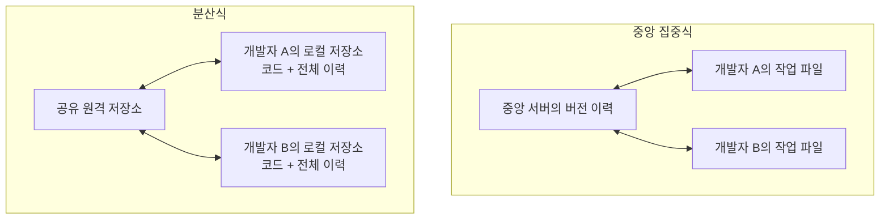
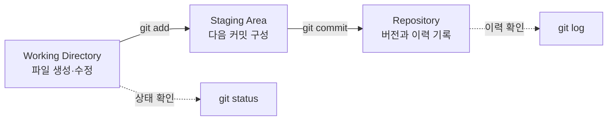
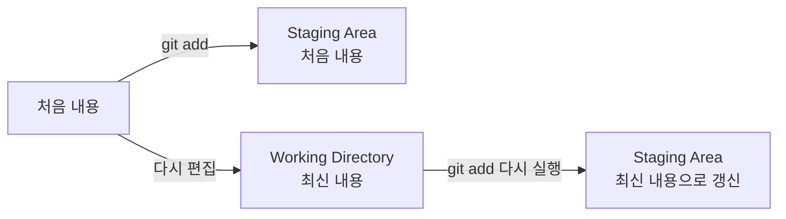

# Git과 버전 관리 1: CLI에서 첫 커밋까지

- 🎯 글의 목표: CLI의 기본 명령과 경로 표현을 익히고, 버전 관리가 필요한 이유와 Git의 세 영역을 이해한 뒤 로컬 저장소에서 변경 사항을 커밋으로 기록한다.
- 🧩 핵심 키워드: CLI, 터미널, 경로, 루트 디렉터리, 홈 디렉터리, 절대 경로, 상대 경로, 버전 관리 시스템, 분산 버전 관리, Working Directory, Staging Area, Repository, commit
- ⭐ 중요도: ★★★★★  
  이후의 모든 Git 학습과 협업 흐름은 파일 시스템을 정확히 이동하고, 변경 사항을 선택해 커밋하는 과정에서 출발한다.
- 📝 한눈에 보는 내용: 이번 강의는 여러 파일에 걸친 코드 변경을 어떻게 안전하게 기록할지라는 질문에서 시작한다. 먼저 터미널과 CLI, 디렉터리와 경로를 익힌다. 이어 버전 관리 시스템의 필요성과 Git의 분산 구조를 살펴보고, `git init` → `git add` → `git commit`으로 첫 번째 버전을 만드는 전체 흐름을 실습한다.
- 🔗 관련 문제 / 주제: 터미널 파일 조작, 로컬 저장소 초기화, 커밋 생성, 변경 상태 확인, 커밋 이력 조회

---

## 1. 들어가며

프로그램을 만들다 보면 파일 하나만 한 번 작성하고 끝나는 경우는 거의 없다. 기능을 추가하고, 잘못된 코드를 고치고, 여러 파일을 함께 수정하는 일이 반복된다. 파일 이름 뒤에 `최종`, `진짜최종`, 날짜와 시간을 붙이는 방식으로도 순간적인 구분은 가능하지만, 어떤 부분이 왜 바뀌었는지까지 체계적으로 남기기는 어렵다.

Git은 코드의 **변경 이력을 기록하고, 필요한 시점의 작업을 다시 확인할 수 있게 하는 버전 관리 도구**다. 다만 Git 명령은 대개 CLI 환경에서 실행하며, 대부분의 명령은 현재 위치와 파일 경로의 영향을 받는다. 따라서 Git을 배우기 전에 터미널에서 현재 위치를 확인하고 디렉터리를 이동하는 감각부터 익혀야 한다.

이번 강의는 **CLI 사용법 → 경로 이해 → 버전 관리의 필요성 → Git의 세 영역 → 커밋 생성** 순서로 이어진다. 각각을 따로 외우기보다, “어디에 있는 파일을 어떤 버전으로 기록하는가?”라는 하나의 질문으로 연결해서 보는 것이 중요하다.

---

## 2. 핵심 개념 정리

이번 강의가 해결하려는 질문은 다음과 같다.

> 여러 파일에 걸쳐 계속 바뀌는 코드를 어떻게 선택해서 하나의 버전으로 기록하고, 그 이력을 다시 확인할 수 있을까?

본문에서는 먼저 컴퓨터에 명령을 전달하는 두 방식인 GUI와 CLI를 비교한다. CLI에서는 현재 위치가 명령의 대상을 결정하므로, 디렉터리와 경로를 읽는 방법을 이어서 익힌다. 그다음 수동으로 파일을 복사하는 방식의 한계를 살펴보며 버전 관리 시스템이 필요한 이유를 확인한다.

Git 부분에서는 작업 공간이 다음 세 단계로 이어진다는 점을 중심에 둔다.

1. **Working Directory**에서 파일을 만들거나 수정한다.
2. **Staging Area**에서 다음 버전에 포함할 변경을 고른다.
3. **Repository**에 선택한 변경을 커밋으로 기록한다.

마지막으로 이 흐름을 `git init`, `git add`, `git commit`, `git status`, `git log` 명령으로 직접 확인한다. 핵심은 명령 자체의 암기보다, 각 명령이 파일의 상태를 어느 단계로 옮기는지 이해하는 것이다.

---

## 3. 본문 정리

이 섹션에서는 터미널의 기초부터 첫 커밋을 만드는 과정까지 강의 순서에 맞춰 정리한다. 모든 명령은 Git Bash를 기준으로 설명하며, 운영체제와 셸에 따라 경로 표현이나 파일 열기 명령이 달라질 수 있다.

### 3.1 GUI와 CLI: 컴퓨터에 명령을 전달하는 두 방식

**GUI(Graphical User Interface)**는 아이콘, 메뉴, 창처럼 눈에 보이는 그래픽 요소를 통해 사용자와 컴퓨터가 상호작용하는 방식이다. 마우스로 폴더를 열거나 휴지통으로 파일을 옮기는 동작이 대표적인 예다. 처음 사용하는 사람도 화면을 보며 조작할 수 있다는 장점이 있다.

**CLI(Command Line Interface)**는 터미널에 텍스트 명령을 입력해 컴퓨터와 상호작용하는 방식이다. 운영체제에 직접 명령을 전달한다는 점을 식당에서 주방장에게 원하는 주문을 정확하게 말하는 상황에 비유할 수 있다.

| 구분 | GUI | CLI |
|---|---|---|
| 입력 방식 | 아이콘, 버튼, 메뉴 | 텍스트 명령 |
| 장점 | 직관적이고 접근하기 쉽다 | 빠르고 정확하며 반복 작업을 자동화하기 쉽다 |
| 세밀한 제어 | 화면에 제공된 기능 중심 | 옵션과 경로를 조합해 구체적으로 제어할 수 있다 |
| 주요 환경 | 파일 탐색기, 데스크톱 앱 | Terminal, Git Bash, 명령 프롬프트 |

CLI를 익혀야 하는 이유는 단순히 개발자가 많이 사용하기 때문만은 아니다. 같은 작업을 명령으로 재현할 수 있고, 여러 명령을 조합하거나 스크립트로 자동화할 수 있으며, 그래픽 환경이 없는 서버에서도 동일한 방식으로 작업할 수 있기 때문이다.

강의에서 강조한 CLI의 장점은 네 가지로 나누어 볼 수 있다.

- **효율성**: 마우스로 여러 창을 오가는 대신 키보드 입력만으로 작업을 이어갈 수 있다. 익숙해지면 파일 생성, 이동, Git 기록처럼 자주 반복하는 흐름이 빨라진다.
- **정밀한 제어**: 화면에 버튼으로 드러나지 않은 옵션도 명령에 직접 지정할 수 있다. “어느 위치의 어떤 대상에 어떤 동작을 할지”를 글자로 분명히 표현한다.
- **자동화**: 한 번 검증한 명령은 다시 실행하거나 여러 명령을 스크립트로 묶을 수 있다. 사람의 반복 클릭을 재현하는 것보다 과정이 명확하다.
- **표준적인 개발 환경**: 서버와 클라우드에는 그래픽 화면이 없거나 제한적인 경우가 많다. 이때도 CLI는 같은 원리로 사용할 수 있다.

예를 들어 GUI에서 새 폴더를 만들려면 파일 탐색기에서 위치를 연 뒤 메뉴를 골라 이름을 입력한다. CLI에서는 현재 위치가 맞다는 전제 아래 다음 한 줄로 같은 의도를 전달한다.

```bash
mkdir project  # 현재 위치에 project 디렉터리를 만든다.
```

CLI가 언제나 GUI보다 우월하다는 뜻은 아니다. 파일 사진을 미리 보거나 여러 창의 배치를 눈으로 비교하는 작업은 GUI가 편할 수 있다. 반면 실행 과정을 정확히 남기고 같은 동작을 반복해야 한다면 CLI가 유리하다. 개발자는 둘 중 하나만 고르는 것이 아니라 작업 성격에 맞춰 함께 사용한다.

터미널(Terminal)은 사용자의 입력을 받고 명령 실행 결과를 문자로 보여주는 프로그램이다. Windows의 명령 프롬프트나 Git Bash, macOS의 Terminal 등이 이에 해당한다.

여기서 **CLI는 상호작용 방식**이고 **터미널은 그 방식을 사용할 수 있게 해 주는 프로그램**이다. 둘을 일상적으로 섞어 부르기도 하지만 개념은 다르다. 과거에는 멀리 있는 대형 컴퓨터에 입력 장치와 화면을 연결한 물리 장비가 선의 끝, 즉 terminal에 있었고, 현대의 터미널 프로그램은 그 문자 기반 사용 방식을 소프트웨어로 재현한다.

📌 핵심: GUI와 CLI는 목적이 다른 도구가 아니라 컴퓨터에 명령을 전달하는 서로 다른 인터페이스다. Git 학습에서는 정확한 위치와 명령을 직접 지정할 수 있는 CLI를 주로 사용한다.

### 3.2 터미널에서 사용하는 기본 명령

터미널을 열면 먼저 **현재 작업 중인 디렉터리**를 기준으로 명령이 실행된다. 따라서 파일을 만들거나 삭제하기 전에 현재 위치와 그 안의 목록을 확인하는 습관이 필요하다.

| 명령 | 역할 | 예시 |
|---|---|---|
| `pwd` | 현재 작업 디렉터리의 경로 출력 | `pwd` |
| `ls` | 현재 디렉터리의 폴더와 파일 목록 출력 | `ls` |
| `touch` | 빈 파일 생성 또는 기존 파일의 수정 시각 갱신 | `touch sample.txt` |
| `mkdir` | 새 디렉터리 생성 | `mkdir project` |
| `cd` | 작업 디렉터리 변경 | `cd project` |
| `start` | Windows에서 폴더나 파일 열기 | `start sample.txt` |
| `open` | macOS에서 폴더나 파일 열기 | `open sample.txt` |
| `rm` | 파일 삭제 | `rm sample.txt` |
| `rm -r` | 디렉터리와 내부 항목을 재귀적으로 삭제 | `rm -r project` |

#### 명령 한 줄의 구조 읽기

CLI 명령은 보통 **명령어 + 옵션 + 인자**로 구성된다. 모든 명령이 세 요소를 전부 요구하는 것은 아니지만 이 틀을 알면 처음 보는 명령도 나누어 읽을 수 있다.

```text
rm      -r       practice
명령어   옵션      인자
```

- **명령어 `rm`**은 무엇을 할지 정한다. 여기서는 remove, 즉 삭제다.
- **옵션 `-r`**은 동작 방식을 바꾼다. 여기서는 디렉터리 안쪽까지 재귀적으로 처리한다.
- **인자 `practice`**는 명령의 대상을 지정한다. 현재 위치를 기준으로 한 디렉터리 이름이다.

명령과 옵션, 인자는 공백으로 구분한다. 따라서 `cd practice`와 `cdpractice`는 같은 명령이 아니다. 파일명에 공백이 들어 있다면 셸이 여러 인자로 나누지 않도록 따옴표로 묶는다.

```bash
mkdir "my project"   # 공백을 포함한 이름 전체를 하나의 인자로 전달한다.
cd "my project"      # 같은 이름의 디렉터리로 이동한다.
```

초심자에게는 공백 없는 짧은 영문 디렉터리 이름이 실습 오류를 줄이는 데 도움이 된다. 명령어의 대소문자도 구분되므로 `pwd`를 `PWD`로 바꾸어 입력하지 않는다.

다음 예시는 디렉터리를 만들고 이동한 뒤 파일을 생성하고 확인하는 짧은 흐름이다.

```bash
# 현재 위치를 먼저 확인한다.
pwd

# practice 디렉터리를 만들고 그 안으로 이동한다.
mkdir practice
cd practice

# 빈 텍스트 파일을 만든 뒤 현재 목록을 확인한다.
touch sample.txt
ls
```

실행 결과는 다음처럼 읽을 수 있다. `pwd`의 실제 출력은 사용자 이름과 환경에 따라 달라진다.

```text
/c/Users/ssafy/practice
sample.txt
```

`mkdir`이나 `touch`, `cd`는 성공했을 때 별도 메시지를 출력하지 않는 경우가 많다. **출력이 없다는 사실만으로 실패라고 판단하지 않는다.** `pwd`와 `ls`로 결과를 확인한다. 반대로 오류 메시지가 보이면 명령 철자, 현재 위치, 대상 이름을 차례로 점검한다.

파일 작업에는 관찰 명령과 변경 명령이 있다.

| 성격 | 명령 예 | 실행 전 판단 |
|---|---|---|
| 현재 상태 관찰 | `pwd`, `ls` | 어디에 있고 무엇이 있는지 확인한다. |
| 위치 변경 | `cd` | 이동할 경로가 현재 위치 기준으로 맞는지 확인한다. |
| 항목 생성 | `mkdir`, `touch` | 같은 이름이 이미 있는지 확인한다. |
| 항목 열기 | `start`, `open` | 운영체제에 맞는 명령인지 확인한다. |
| 항목 삭제 | `rm`, `rm -r` | 대상 경로와 삭제 범위를 재확인한다. |

안전한 파일 조작의 기본 순서는 `pwd` → `ls` → 변경 명령 → `ls`다. 특히 삭제는 되돌리기 어려우므로 대상을 먼저 목록에서 확인한다.

```bash
pwd              # 1. 현재 위치를 확인한다.
ls               # 2. 삭제할 파일이 실제로 있는지 확인한다.
rm sample.txt     # 3. 확인한 파일 하나를 삭제한다.
ls               # 4. 목록에서 사라졌는지 검증한다.
```

명령은 현재 위치를 기준으로 동작한다. 같은 `touch sample.txt`를 입력해도 어느 디렉터리에서 실행했는지에 따라 파일이 만들어지는 장소가 달라진다.

⚠️ 주의: `rm`으로 삭제한 파일은 일반적으로 휴지통으로 이동하지 않는다. 특히 `rm -r`은 디렉터리 내부까지 삭제하므로, 실행 전에 `pwd`와 `ls`로 대상이 맞는지 반드시 확인해야 한다.

⚠️ 주의: 이 강의의 명령은 Git Bash 기준이다. Windows 명령 프롬프트나 PowerShell은 일부 명령과 경로 표기가 다르다. 명령이 동작하지 않을 때는 자신이 어느 터미널 프로그램과 셸을 사용 중인지 먼저 확인한다.

### 3.3 경로: 파일과 디렉터리의 주소

경로(Path)는 파일 시스템 안에서 특정 디렉터리나 파일을 찾아가기 위한 주소다. 건물 안의 방이나 물건을 찾으려면 위치를 나타내는 주소가 필요하듯, CLI에서도 명령의 대상을 지정하려면 경로가 필요하다.

디렉터리(directory)라는 말은 전화번호부(telephone directory)처럼 정보를 찾아볼 수 있게 정리한 목록에서 유래했다. GUI에서는 디렉터리를 폴더 아이콘으로 보여주기 때문에 보통 “폴더”라고 부르지만, CLI에서는 “디렉터리”라는 표현을 자주 사용한다.

경로를 읽을 때 먼저 알아야 할 기준점은 다음과 같다.

- **루트 디렉터리 `/`**: 파일 시스템 모든 주소의 시작점이다. 건물의 정문이나 1층 로비에 비유할 수 있다.
- **홈 디렉터리 `~`**: 현재 사용자의 기본 공간이다. 터미널을 처음 열었을 때 시작하는 개인 사무실에 가깝다.
- **현재 디렉터리 `.`**: 지금 작업 중인 위치를 나타낸다.
- **부모 디렉터리 `..`**: 현재 위치의 바로 위 디렉터리를 나타낸다.

네 기호의 관계를 하나의 디렉터리 구조로 보면 더 분명하다. 현재 사용자가 `ssafy`이고 작업 위치가 `practice`라고 가정한다.

```text
/                         ← 루트 디렉터리
└─ c
   └─ Users
      └─ ssafy            ← 홈 디렉터리: ~
         └─ practice      ← 현재 디렉터리: .
            └─ notes

현재 위치 practice에서 .. 는 ssafy를 가리킨다.
```

`/`와 `~`는 같은 위치가 아니다. `/`는 파일 시스템 전체의 시작점이고, `~`는 그 안에 있는 현재 사용자의 개인 공간이다. Git Bash에서 `cd /`를 실행하면 루트로 가지만, `cd ~` 또는 인자 없는 `cd`를 실행하면 홈으로 간다.

```bash
cd /       # 파일 시스템의 루트로 이동한다.
pwd        # Git Bash라면 /가 출력된다.

cd ~       # 현재 사용자의 홈 디렉터리로 이동한다.
pwd        # 예: /c/Users/ssafy

cd .       # 현재 위치로 이동하므로 위치가 바뀌지 않는다.
cd ..      # 바로 위 부모 디렉터리로 이동한다.
```

`.`은 위치를 바꾸지 않을 때만 쓰는 불필요한 기호가 아니다. `./sample.txt`처럼 “현재 디렉터리에 있는 대상”임을 명시할 때도 사용한다. `..`는 두 번 이어 `../..`로 쓰면 부모의 부모를 가리킨다.

홈 디렉터리의 실제 경로는 운영체제에 따라 다르다.

| 운영체제/환경 | 홈 디렉터리 예시 |
|---|---|
| Windows Git Bash | `/c/Users/<사용자>/` |
| Windows 명령 프롬프트 | `C:\Users\<사용자>\` |
| macOS | `/Users/<사용자>/` |
| 많은 Linux 배포판 | `/home/<사용자>/` |

### 3.4 절대 경로와 상대 경로

**절대 경로(Absolute Path)**는 루트 디렉터리부터 목적지까지의 전체 주소다. 현재 위치가 어디든 같은 대상을 가리킨다. 예를 들어 Git Bash에서 `/c/Users/ssafy/Desktop`은 항상 해당 Desktop 디렉터리를 뜻한다.

**상대 경로(Relative Path)**는 현재 위치를 기준으로 표현한 주소다. 현재 디렉터리 안의 `Desktop`으로 가려면 `Desktop/`, 부모 디렉터리로 가려면 `..`를 사용한다. 짧고 편리하지만 현재 위치가 바뀌면 같은 표현이 다른 대상을 가리킬 수 있다.

다음 구조에서 현재 위치가 `/c/Users/ssafy/Desktop/a`라고 가정해 보자.

```text
/c/Users/ssafy/Desktop/
└─ a/                    ← 현재 위치
   ├─ memo.txt
   └─ b/
      └─ c/
```

같은 목적지를 서로 다른 방식으로 표현할 수 있다.

| 목적지 | 절대 경로 | 현재 `a` 기준 상대 경로 |
|---|---|---|
| `memo.txt` | `/c/Users/ssafy/Desktop/a/memo.txt` | `memo.txt` 또는 `./memo.txt` |
| `b` | `/c/Users/ssafy/Desktop/a/b` | `b` 또는 `./b` |
| `c` | `/c/Users/ssafy/Desktop/a/b/c` | `b/c` |
| `Desktop` | `/c/Users/ssafy/Desktop` | `..` |

절대 경로는 길지만 출발 위치에 의존하지 않는다. 상대 경로는 짧지만 반드시 “지금 어디인가?”라는 정보와 함께 해석해야 한다. `pwd`가 상대 경로 해석의 출발점을 알려 주는 이유다.

```bash
# 현재 디렉터리에 foo 파일을 만든다.
touch foo

# 부모 디렉터리에 bar 파일을 만든다.
touch ../bar

# 현재 위치와 무관하게 지정한 절대 경로에 baz 파일을 만든다.
touch /c/Users/ssafy/Desktop/baz
```

첫 번째 명령은 현재 위치가 바뀌면 생성 위치도 바뀐다. 두 번째 명령은 현재 위치의 부모에 만들고, 세 번째 명령은 현재 위치와 관계없이 지정한 Desktop에 만든다. 즉 `touch`의 기능은 같아도 전달한 **경로 인자**가 결과 위치를 결정한다.

경로를 왼쪽부터 한 칸씩 읽으면 오류를 찾기 쉽다. `/c/Users/ssafy/Desktop/baz`라면 루트 `/`에서 시작해 `c` → `Users` → `ssafy` → `Desktop`을 차례로 통과하고 마지막 이름 `baz`를 대상으로 삼는다. 중간 디렉터리 하나라도 존재하지 않으면 파일을 만들 수 없다.

```text
touch: cannot touch '/c/Users/ssafy/Desktoop/baz': No such file or directory
```

이 오류는 `touch` 자체가 틀렸다는 뜻이 아니라, 예시처럼 경로 중 `Desktoop`을 찾지 못했다는 뜻일 수 있다. `ls /c/Users/ssafy`로 실제 이름을 확인한 뒤 경로를 고친다.

CLI 명령의 대부분은 경로의 영향을 받는다. 명령이 실패했을 때는 문법만 확인하지 말고, 현재 위치와 대상 경로가 맞는지도 함께 확인해야 한다.

⚠️ 주의: 상대 경로를 사용하면서 현재 위치를 잘못 기억하면 엉뚱한 곳에 파일을 만들거나 삭제할 수 있다. 긴 작업을 시작하기 전과 디렉터리를 여러 번 이동한 뒤에는 `pwd`로 현재 위치를 다시 확인하는 것이 안전하다.

### 3.5 경로 실습: 중첩 디렉터리 만들고 빠져나오기

경로는 눈으로 읽는 것보다 직접 이동해보는 편이 빠르게 익숙해진다. 먼저 바탕화면에서 `a/b/c` 구조를 만든다.

```bash
# 바탕화면에서 시작한다고 가정한다.
mkdir a        # a 디렉터리를 만든다.
cd a           # a 안으로 이동한다.
mkdir b        # a 안에 b를 만든다.
cd b           # b 안으로 이동한다.
mkdir c        # b 안에 c를 만든다.
cd c           # 가장 깊은 c까지 이동한다.
pwd            # .../a/b/c인지 확인한다.
```

가장 깊은 `c`에서 상대 경로를 이용해 한 단계씩 빠져나올 수 있다.

```bash
# 현재 위치: .../a/b/c
cd ..          # 바로 위 부모인 b로 이동한다.
pwd            # .../a/b인지 확인한다.

cd ..          # 다시 바로 위 부모인 a로 이동한다.
pwd            # .../a인지 확인한다.
```

반대로 `a`에서 `c`까지는 중간 경로를 한 번에 적을 수 있다. 그 후 홈 디렉터리를 기준으로 한 경로를 사용해 다시 `a`로 이동할 수도 있다.

```bash
# 현재 위치: .../a
cd b/c         # b를 거쳐 c까지 한 번에 이동한다.
pwd            # .../a/b/c인지 확인한다.

# 홈 디렉터리 아래 Desktop에 a가 있다고 가정한다.
cd ~/Desktop/a # 현재 위치와 관계없이 a로 이동한다.
pwd            # .../Desktop/a인지 확인한다.
```

여기서 `...`는 설명을 위해 앞부분을 생략한 표시일 뿐 실제 명령에 입력하는 경로가 아니다. 또한 바탕화면의 실제 위치는 컴퓨터 설정에 따라 다를 수 있다.

실습의 이동을 표로 따라가면 상대 경로가 매번 어느 기준에서 해석되는지 확인할 수 있다.

| 실행 전 위치 | 명령 | 실행 후 위치 | 해석 |
|---|---|---|---|
| `~/Desktop` | `cd a` | `~/Desktop/a` | 현재 위치 안의 `a`로 이동 |
| `~/Desktop/a` | `cd b/c` | `~/Desktop/a/b/c` | `b`를 거쳐 `c`로 이동 |
| `~/Desktop/a/b/c` | `cd ..` | `~/Desktop/a/b` | 현재 위치의 부모로 이동 |
| `~/Desktop/a/b` | `cd ..` | `~/Desktop/a` | 다시 부모로 이동 |
| 어디든 가능 | `cd ~/Desktop/a` | `~/Desktop/a` | 홈을 기준으로 지정한 위치로 이동 |

⚠️ 주의: 강의 화면의 절대 경로는 예시다. 사용자 이름이나 Desktop의 실제 위치를 그대로 추측해서 복사하지 말고, 자신의 환경에서 `cd ~/Desktop/a` 후 `pwd`로 확인한 값을 사용한다.

### 3.6 버전 관리 시스템이 필요한 이유

**버전 관리(Version Control)**는 파일의 변화를 기록하고 추적하는 일이다. Google Docs의 버전 기록처럼, 현재 문서만 보관하는 것이 아니라 언제 어떤 변경이 있었는지 이력으로 남긴다.

Google Docs에서 문장을 입력하고 “현재 버전 이름 지정”을 반복하면 버전 목록에서 이전 시점을 고를 수 있다. 각 항목에는 시각과 이름이 붙고, 어느 시점에서 내용이 달라졌는지 확인할 수 있다. 개발자가 코드에 원하는 것도 이와 비슷하다. 단순히 최신 파일을 여는 데서 끝나지 않고 다음 질문에 답할 수 있어야 한다.

- 이 기능을 추가하기 전 코드는 어떤 모습이었는가?
- 언제 어떤 파일이 바뀌었는가?
- 이 변경은 무엇을 하기 위해 만들어졌는가?
- 문제가 생겼을 때 비교할 기준점은 어디인가?

버전을 파일 복사만으로 관리하면 다음 문제가 생긴다.

- `최종`, `진짜최종`, `리얼최종` 같은 파일명이 늘어나 어떤 것이 실제 최신본인지 알기 어렵다.
- 날짜와 시간을 파일명에 넣어도 각 파일 사이에서 무엇이 바뀌었는지 기억하기 어렵다.
- 매 버전의 전체 파일을 복사하면 파일 크기가 클수록 저장 용량이 빠르게 증가한다.
- 변경 사항만 별도 파일에 기록하면 저장 공간은 줄지만, 원본과 변경 기록을 사람이 직접 맞춰 관리해야 한다.

수동 관리가 점점 복잡해지는 과정을 순서대로 보면 버전 관리 시스템의 역할이 선명해진다.

1. 처음에는 `졸업논문-최종.docx`처럼 파일을 복사한다.
2. 최신본이 헷갈려 날짜와 시간을 파일명에 붙인다.
3. 파일 사이의 차이를 기억할 수 없어 변경 사항 문서를 따로 만든다.
4. 전체 파일과 변경 기록이 계속 늘면서 용량과 관리 부담이 함께 커진다.
5. 결국 최신 파일 하나와 여러 변경 기록을 정확히 연결하는 별도 체계가 필요해진다.

버전 관리 시스템은 이 마지막 체계를 자동화한다. 사람은 의미 있는 시점에 이름과 설명을 남기고, 도구는 버전 사이의 연결과 파일 상태를 관리한다.

버전 관리 시스템(VCS)은 이 과정을 도구가 맡도록 한다. 각 버전은 이전 버전과의 변경 사항을 기록하며, 필요할 때 특정 시점의 내용과 변경 이유를 확인할 수 있다. 즉, “현재 파일”만 저장하는 것이 아니라 **파일이 변화해 온 과정**을 함께 관리한다.

#### 스냅샷으로 생각하기

Git에서는 한 버전을 흔히 **스냅샷(snapshot)**에 비유한다. 사진을 찍으면 셔터를 누른 특정 순간의 장면이 고정되듯, 커밋하면 그 시점에 선택한 프로젝트 상태가 기록된다.

이 비유에서 중요한 것은 두 가지다.

- 사진을 찍기 전 장면을 계속 바꾸어도 사진첩에는 아직 새 사진이 생기지 않는다. 파일을 수정한 것과 커밋한 것은 다른 일이다.
- 촬영 대상에 포함한 것만 사진에 남는다. Git에서도 Staging Area에 선택한 변경만 다음 커밋에 들어간다.

Git은 사용자가 매번 프로젝트 전체를 새 이름의 폴더로 복사하도록 요구하지 않는다. 사용자는 의미 있는 순간을 커밋으로 남기고, Git은 그 스냅샷과 앞뒤 이력의 관계를 추적한다.

📌 핵심: 좋은 버전 관리는 파일명에 버전 정보를 억지로 넣는 일이 아니라, 변경 내용과 시점을 별도의 이력으로 일관되게 기록하는 일이다.

### 3.7 중앙 집중식과 분산식 버전 관리

버전 관리 시스템은 저장소를 배치하는 방식에 따라 중앙 집중식과 분산식으로 나눌 수 있다.

| 구분 | 중앙 집중식 | 분산식 |
|---|---|---|
| 버전 저장 위치 | 중앙 서버 | 여러 로컬 저장소에 복제 |
| 기본 작업 방식 | 중앙에서 파일을 받아 수정 후 다시 업로드 | 각 개발자가 로컬에 전체 이력을 두고 작업 |
| 네트워크가 없을 때 | 작업에 제약이 크다 | 로컬에서 이력 기록을 계속할 수 있다 |
| 장애 대응 | 중앙 서버 의존도가 높다 | 여러 복제본을 활용해 복구하기 쉽다 |

중앙 집중식에서는 개발자가 중앙 서버에서 필요한 파일이나 버전을 받아 작업하고, 결과를 다시 중앙으로 보낸다. 중앙 서버가 이력의 중심이므로 네트워크나 서버 상태가 작업 가능 범위에 직접 영향을 준다.

분산식에서는 각 개발자의 저장소가 단순한 작업 파일 묶음이 아니라 버전 이력을 포함한 저장소다. 따라서 중앙 역할을 하는 원격 저장소와 연결되지 않은 동안에도 커밋을 만들고 과거 이력을 조회할 수 있다. 연결이 회복되면 로컬에서 쌓은 이력을 동기화한다.



여기서 “분산”은 중앙 역할의 서버를 절대 사용하지 않는다는 뜻이 아니다. 실제 협업에서는 공유할 원격 저장소를 두는 경우가 많다. 차이는 **각 로컬 저장소도 독립적으로 이력을 기록할 수 있다**는 데 있다.

Git은 **분산 버전 관리 시스템(DVCS)**이다. 각 개발자가 로컬 저장소에 코드와 변경 이력을 기록하고, 나중에 원격 저장소와 동기화할 수 있다. 이 구조에는 다음과 같은 장점이 있다.

- 중앙 서버에 계속 의존하지 않고 여러 작업을 동시에 진행할 수 있다.
- 개발자 간 작업 충돌을 관리하며 병렬 작업의 생산성을 높일 수 있다.
- 중앙 서버에 장애나 손실이 생겨도 여러 로컬 저장소를 백업과 복구에 활용할 수 있다.
- 인터넷이 연결되지 않은 환경에서도 로컬 커밋과 이력 조회를 계속할 수 있다.

Git은 코드의 변경 이력, 즉 히스토리를 관리함으로써 개발 진행 상황을 파악하고 이전 버전과 달라진 내용을 비교할 수 있게 한다.

### 3.8 Git이 관리하는 세 영역

Git의 동작은 세 영역의 관계로 이해하면 명령을 외우기가 훨씬 쉬워진다.

- **Working Directory(작업 디렉터리)**: 실제로 파일을 만들고 수정하는 공간이다.
- **Staging Area(스테이징 영역)**: 변경된 파일 중 다음 버전에 포함할 항목을 선택해 올려두는 중간 준비 공간이다.
- **Repository(저장소)**: 커밋과 파일의 버전 이력이 영구적으로 기록되는 공간이다.



사진을 찍는 상황에 비유하면 Working Directory는 촬영할 장면을 준비하는 공간이고, Staging Area는 이번 사진에 들어갈 대상을 고르는 과정이며, commit은 선택한 상태를 하나의 스냅샷으로 남기는 행위다.

Staging Area가 있기 때문에 작업한 모든 변경을 무조건 한 버전에 넣지 않아도 된다. 여러 파일을 수정했더라도 하나의 목적과 관련된 변경만 골라 커밋할 수 있다.

세 영역은 물리적으로 보이는 폴더 세 개를 사용자가 옮겨 다니는 개념이 아니다. 파일을 편집하는 실제 작업 공간, 다음 커밋의 구성 정보, 이미 확정된 이력을 구분해 설명하는 논리적 모델이다.

| 현재 상태 | Working Directory | Staging Area | Repository |
|---|---|---|---|
| 새 파일 생성 직후 | 새 파일이 존재한다. | 아직 선택되지 않았다. | 기록이 없다. |
| `git add` 직후 | 파일은 그대로 존재한다. | 현재 내용이 다음 커밋 후보로 준비된다. | 아직 새 커밋은 없다. |
| `git commit` 직후 | 파일은 그대로 존재한다. | 커밋한 내용은 비워진다. | 새 버전이 기록된다. |
| 커밋 후 다시 수정 | 최신 수정 내용이 있다. | 방금 수정한 내용은 없다. | 이전 커밋 상태가 남아 있다. |

#### 같은 파일이 staged이면서 modified일 수 있다

`git add`는 파일 이름만 등록하는 것이 아니라 **그 시점의 내용**을 Staging Area에 복사해 다음 커밋 후보로 만든다. 따라서 스테이징한 뒤 같은 파일을 다시 편집하면 두 종류의 상태가 동시에 존재할 수 있다.

```bash
touch note.txt          # 새 파일을 만든다.
git add note.txt        # 현재의 빈 note.txt를 스테이징한다.

# 이 사이에 편집기로 note.txt에 내용을 추가하고 저장했다고 가정한다.
git status              # staged 상태와 아직 staged되지 않은 수정이 함께 보일 수 있다.
```

이때 Staging Area에는 `git add` 당시의 내용이 있고, Working Directory에는 그 뒤에 수정한 최신 내용이 있다. 그대로 커밋하면 스테이징했던 내용만 기록된다. 최신 수정까지 같은 커밋에 넣으려면 `git add note.txt`를 다시 실행해야 한다.



⚠️ 주의: “파일을 한 번 add했으니 이후 수정도 자동으로 포함된다”라고 생각하면 의도와 다른 커밋이 생긴다. 커밋 직전 `git status`로 staged와 unstaged 변경을 구분한다.

### 3.9 커밋: 특정 시점의 버전을 기록하는 행위

**커밋(commit)**은 Staging Area에 준비된 변경 사항을 저장소에 하나의 버전으로 기록하는 행위다. 커밋에는 작성자, 작성 시각, 커밋 메시지, 이전 커밋과의 관계, 변경 내용 등이 연결된다.

커밋 메시지는 “무엇을 기록했는가”를 이력에서 빠르게 알아볼 수 있게 한다. 예를 들어 새 파일을 추가했다면 `add sample.txt`, 기존 내용을 고쳤다면 `update sample.txt`처럼 변경 목적을 분명하게 적을 수 있다.

`first commit`도 첫 실습에서는 흐름을 확인하기 좋은 메시지지만, 실제 이력을 읽을 때는 무엇이 들어갔는지 알려 주지 못한다. `add sample.txt`는 적어도 새 파일 추가라는 행위를 드러낸다. 기능 단위 작업이라면 `add login form`, 오류 수정이라면 `fix login validation`처럼 **행동과 목적**을 함께 나타내는 편이 낫다.

좋은 메시지를 고를 때는 “몇 번째 버전인가?”보다 “무엇이 달라졌는가?”를 묻는다.

| 모호한 메시지 | 더 구체적인 메시지 | 개선되는 점 |
|---|---|---|
| `수정` | `update greeting text` | 무엇을 수정했는지 드러난다. |
| `두 번째 커밋` | `add b.txt` | 순번 대신 변경 내용을 알려 준다. |
| `final` | `fix file path` | 나중에 이력을 검색하고 비교하기 쉽다. |

하나의 커밋에는 가능한 한 하나의 설명 가능한 목적을 담는다. 파일 두 개가 같은 기능을 완성하기 위해 함께 바뀌었다면 한 커밋에 들어갈 수 있다. 반대로 서로 관계없는 변경이라면 Staging Area에서 나누어 기록해야 메시지와 실제 변경이 일치한다.

커밋은 프로젝트 전체 파일을 매번 별도 복사본으로 쌓는 것과 다르다. Git은 각 커밋을 통해 특정 시점의 프로젝트 상태를 추적할 수 있게 하고, 커밋 사이에서 무엇이 달라졌는지 확인할 수 있도록 관리한다.

### 3.10 `git init`: 현재 디렉터리를 로컬 저장소로 초기화하기

Git으로 버전을 기록하려면 먼저 일반 디렉터리를 **로컬 Git 저장소**로 초기화해야 한다. 이 작업에는 `git init`을 사용한다.

```bash
# 실습할 디렉터리를 만들고 이동한다.
mkdir git_practice
cd git_practice

# 현재 디렉터리에서 Git 버전 관리를 시작한다.
git init
```

Git Bash에서는 다음과 비슷한 성공 메시지가 나타난다. 경로는 환경마다 다르다.

```text
Initialized empty Git repository in C:/Users/ssafy/git_practice/.git/
```

`empty Git repository`는 아직 커밋이 하나도 없는 새 저장소라는 뜻이다. `git init` 자체는 파일을 커밋하지도, 기존 파일 내용을 바꾸지도 않는다. 현재 디렉터리에 Git의 이력 관리 구조를 준비할 뿐이다.

명령이 성공하면 현재 디렉터리 안에 숨김 디렉터리 `.git`이 만들어진다. 이곳에는 Git이 버전과 설정을 관리하는 데 필요한 메타데이터가 저장된다. 터미널 프롬프트에 `(master)` 같은 현재 브랜치 이름이 나타날 수도 있다. 브랜치의 자세한 내용은 이후 학습에서 다룬다.

⚠️ 주의: 이미 Git 저장소인 디렉터리 내부의 하위 디렉터리에서 `git init`을 다시 실행해 중첩 저장소를 만들지 않는다. 저장소 안에 또 저장소가 있으면 바깥쪽 저장소가 안쪽 저장소의 변경 사항을 일반 파일처럼 추적할 수 없어 구조가 혼란스러워진다. 초기화 전에는 상위 경로에 `.git`이 있는지 확인하는 것이 좋다.

### 3.11 `git status`와 `git add`: 변경 상태 확인하고 스테이징하기

저장소를 만든 뒤 `sample.txt`를 생성하면 이 파일은 아직 Git이 추적하지 않는 **Untracked** 상태다.

```bash
# Working Directory에 새 파일을 만든다.
touch sample.txt

# 현재 저장소의 파일 상태를 확인한다.
git status
```

첫 커밋 전 새 파일의 대표적인 출력은 다음과 같다. Git 버전과 기본 브랜치 설정에 따라 `master` 대신 다른 이름이 보일 수 있다.

```text
On branch master

No commits yet

Untracked files:
  (use "git add <file>..." to include in what will be committed)
        sample.txt

nothing added to commit but untracked files present
```

출력을 위에서부터 읽으면 현재 브랜치, 아직 커밋이 없다는 사실, 추적되지 않은 파일 목록을 알 수 있다. 마지막 문장은 파일은 있지만 Staging Area에 추가된 내용은 없다는 뜻이다. 오류 메시지가 아니라 현재 상태에 대한 설명이다.

`git status`는 현재 브랜치, 커밋할 변경, 아직 추적하지 않는 파일 등의 상태를 보여준다. 새 파일을 다음 커밋에 포함하려면 `git add`로 Staging Area에 올린다.

```bash
# sample.txt를 다음 커밋의 구성에 포함한다.
git add sample.txt

# 파일이 Staging Area에 올라갔는지 확인한다.
git status
```

스테이징한 뒤에는 `sample.txt`가 커밋할 변경 목록으로 이동한다.

```text
On branch master

No commits yet

Changes to be committed:
  (use "git rm --cached <file>..." to unstage)
        new file:   sample.txt
```

`Changes to be committed`는 “이미 커밋되었다”는 뜻이 아니라 **지금 커밋을 실행하면 포함될 변경**이라는 뜻이다. 출력의 들여쓰기 아래에서 상태와 파일명을 읽는다.

새 파일은 스테이징 후 `new file`로 표시된다. 이미 추적 중인 파일을 수정한 뒤 스테이징하면 `modified`로 표시된다. `git add`는 파일을 단순히 “Git에 등록”하는 일회성 명령이 아니라, **현재 변경 상태를 다음 커밋 후보로 선택하는 명령**이다. 같은 파일을 다시 수정했다면 최신 변경까지 담기 위해 `git add`를 다시 실행해야 한다.

### 3.12 Git 작성자 정보 설정하기

Git은 각 커밋에 작성자(author) 정보를 기록한다. 처음 커밋할 때 이름과 이메일이 설정되어 있지 않으면 작성자를 식별할 수 없다는 오류와 함께 커밋이 중단될 수 있다.

```bash
# 모든 로컬 Git 저장소에서 사용할 이메일을 설정한다.
git config --global user.email "you@example.com"

# 모든 로컬 Git 저장소에서 사용할 이름을 설정한다.
git config --global user.name "Your Name"

# 현재 global 설정을 확인한다.
git config --global -l
```

`--global`을 사용하면 현재 사용자 계정의 모든 저장소에 같은 설정을 적용하므로 저장소마다 반복해서 입력할 필요가 없다. `--global`을 생략하면 현재 저장소에만 적용되는 로컬 설정이 된다.

⚠️ 주의: `user.name`은 Git 서비스의 로그인 ID와 반드시 같은 개념이 아니다. 커밋 이력에 작성자로 남길 이름이며, `user.email`과 함께 프로젝트나 조직의 정책에 맞게 설정해야 한다.

### 3.13 `git commit`: 준비한 변경을 버전으로 남기기

Staging Area에 변경을 올렸다면 `git commit`으로 저장소에 기록한다. `-m` 옵션 뒤에는 해당 버전을 설명하는 커밋 메시지를 적는다.

```bash
# Staging Area의 변경을 first commit이라는 메시지로 기록한다.
git commit -m "first commit"
```

첫 커밋의 전체 흐름을 상태 변화와 함께 다시 따라가 보자. 아래에서는 작성자 설정이 이미 끝났다고 가정한다.

```bash
# 1. 아직 파일이 없는 저장소의 상태를 확인한다.
git status

# 2. 새 파일을 만든다. 이 시점의 sample.txt는 Untracked다.
touch sample.txt
git status

# 3. 현재 파일 내용을 다음 커밋 후보로 선택한다.
git add sample.txt
git status

# 4. 선택한 변경을 첫 번째 스냅샷으로 기록한다.
git commit -m "add sample.txt"

# 5. 기록 뒤 남은 변경이 없는지 확인한다.
git status
```

커밋 결과는 환경에 따라 다음과 비슷하게 나타난다.

```text
[master (root-commit) a1b2c3d] add sample.txt
 1 file changed, 0 insertions(+), 0 deletions(-)
 create mode 100644 sample.txt
```

- `master`는 커밋이 만들어진 브랜치다.
- `root-commit`은 이 저장소의 첫 커밋이라는 뜻이다.
- `a1b2c3d`는 설명을 위한 축약 커밋 해시이며 실제 값은 매번 다르다.
- `1 file changed`는 이 커밋에 관여한 파일 수다.
- `create mode ... sample.txt`는 새 파일이 기록되었음을 보여 준다.

해시는 커밋을 구별하는 식별자다. 사용자가 번호를 직접 매기는 방식과 달리 Git이 생성한다. 따라서 강의 화면과 자신의 해시가 달라도 정상이다.

커밋이 성공하면 커밋 식별자와 함께 변경된 파일 수, 추가되거나 삭제된 줄 수 등이 출력된다. 이후 `git status`를 실행했을 때 추가 변경이 없다면 다음과 같은 상태를 볼 수 있다.

```text
nothing to commit, working tree clean
```

이는 Working Directory와 최근 커밋 사이에 아직 기록하지 않은 변경이 없다는 뜻이다. 파일을 다시 수정하면 `modified` 상태가 되고, `git add`와 `git commit`을 다시 거쳐 두 번째 버전을 만들 수 있다.

#### 두 번째 커밋: 수정과 스테이징을 구분하기

편집기로 `sample.txt`에 `hello`라는 내용을 넣고 저장했다고 가정한다. 파일을 저장하는 행위는 Working Directory만 바꾼다. 아직 Staging Area와 Repository는 첫 커밋 상태다.

```bash
# sample.txt를 수정한 뒤 상태를 확인한다.
git status

# 수정된 현재 상태를 Staging Area에 다시 올린다.
git add sample.txt

# 두 번째 버전으로 기록한다.
git commit -m "update sample.txt"
```

수정 직후 `git status`에서는 다음 영역을 주의해서 읽는다.

```text
Changes not staged for commit:
  (use "git add <file>..." to update what will be committed)
        modified:   sample.txt

no changes added to commit
```

`Changes not staged for commit`은 수정은 존재하지만 다음 커밋 후보에는 아직 반영되지 않았다는 뜻이다. `git add sample.txt`를 실행한 뒤에는 같은 파일이 `Changes to be committed` 아래의 `modified`로 이동한다.

두 번째 커밋이 성공하면 첫 커밋과 다른 새 해시가 생긴다.

```text
[master d4e5f6a] update sample.txt
 1 file changed, 1 insertion(+)
```

이제 Repository에는 “빈 `sample.txt`를 추가한 스냅샷”과 “내용을 추가한 스냅샷”이 순서대로 연결되어 있다. Working Directory에 파일 하나만 보이더라도 Git 이력에는 두 시점이 존재한다.

📌 핵심: `git commit`은 Working Directory의 모든 변경을 자동으로 저장하지 않는다. 오직 `git add`로 Staging Area에 준비한 변경만 기록한다.

### 3.14 `git log`: 커밋 이력 확인하기

생성된 커밋 목록은 `git log`로 확인한다.

```bash
# 작성자, 날짜, 메시지를 포함한 자세한 커밋 이력을 본다.
git log

# 각 커밋을 한 줄로 간단하게 본다.
git log --oneline
```

두 커밋을 만든 저장소의 자세한 로그는 다음과 같은 형태다. 해시, 작성자, 날짜는 예시다.

```text
commit d4e5f6a7890abcdef (HEAD -> master)
Author: SSAFY <ssafy@example.com>
Date:   Mon Jan 19 10:20:00 2026 +0900

    update sample.txt

commit a1b2c3d4567abcdef
Author: SSAFY <ssafy@example.com>
Date:   Mon Jan 19 10:10:00 2026 +0900

    add sample.txt
```

로그는 최신 커밋부터 역순으로 표시된다. 각 블록에서 `commit` 뒤의 해시, `Author`, `Date`, 마지막의 커밋 메시지를 읽는다. `(HEAD -> master)`는 현재 보고 있는 브랜치의 최신 커밋을 가리키는 표시이며, HEAD와 브랜치의 세부 원리는 이후 학습에서 다룬다.

같은 이력을 `--oneline`으로 보면 다음처럼 압축된다.

```text
d4e5f6a (HEAD -> master) update sample.txt
a1b2c3d add sample.txt
```

한 줄 로그에서도 위가 최신이고 아래가 이전 커밋이다. 메시지가 구체적일수록 상세 로그를 열지 않고도 프로젝트의 진행 흐름을 파악하기 쉽다.

⚠️ 주의: `git status`와 `git log`는 서로 대체하지 않는다. `status`는 아직 커밋하지 않은 현재 작업 상태를 보여 주고, `log`는 이미 Repository에 기록된 과거 커밋을 보여 준다.

`git log`에는 각 커밋의 고유 식별자인 해시, 작성자, 날짜, 메시지가 나타난다. `git log --oneline`은 축약된 해시와 메시지를 한 줄씩 보여주므로 전체 흐름을 빠르게 확인할 때 편리하다.

지금까지 사용한 주요 명령을 역할별로 묶으면 다음과 같다.

| 명령 | 확인하거나 바꾸는 대상 |
|---|---|
| `git init` | 현재 디렉터리를 Git 저장소로 초기화 |
| `git status` | Working Directory와 Staging Area의 현재 상태 확인 |
| `git add <파일>` | 변경 사항을 Staging Area에 추가 |
| `git commit -m "메시지"` | 준비된 변경을 Repository에 기록 |
| `git log` | 자세한 커밋 이력 확인 |
| `git log --oneline` | 커밋 이력을 한 줄씩 확인 |
| `git config --global -l` | 사용자 전역 Git 설정 확인 |

### 3.15 전체 실습: 파일을 추가하고 수정하며 세 번 커밋하기

강의의 마지막 실습은 명령을 개별적으로 실행하는 데서 끝나지 않고, 파일 상태가 세 영역을 거쳐 커밋으로 남는 과정을 반복하는 데 목적이 있다.

```bash
# 1. 바탕화면으로 이동하고 실습 저장소를 준비한다.
cd ~/Desktop
mkdir git_commit
cd git_commit
git init

# 2. a.txt를 만들고 첫 번째 커밋을 생성한다.
touch a.txt
git status                 # a.txt가 Untracked인지 확인한다.
git add a.txt              # a.txt를 Staging Area에 올린다.
git commit -m "add a.txt" # 첫 번째 버전으로 기록한다.

# 3. b.txt를 만들고 두 번째 커밋을 생성한다.
touch b.txt
git status                 # 새 b.txt만 Untracked인지 확인한다.
git add b.txt
git status                 # b.txt가 Changes to be committed 아래 있는지 확인한다.
git commit -m "add b.txt"

# 4. 편집기로 a.txt를 수정한 뒤 세 번째 커밋을 생성한다.
git status                    # a.txt가 modified인지 확인한다.
git add a.txt                 # 수정된 상태를 다시 스테이징한다.
git commit -m "update a.txt" # 수정 내용을 새 버전으로 기록한다.

# 5. 지금까지 만든 세 커밋을 한 줄씩 확인한다.
git log --oneline
```

예상되는 한 줄 로그의 형태는 다음과 같다. 해시는 컴퓨터마다 다르지만 메시지 순서는 같아야 한다.

```text
9abc012 (HEAD -> master) update a.txt
789def0 add b.txt
456abc1 add a.txt
```

실습이 정확히 끝났다면 `git status`에는 `working tree clean`이 나타나고, 로그에는 최신 커밋인 `update a.txt`가 맨 위에 보인다. `b.txt`를 추가할 때 `a.txt` 수정까지 섞여 있었다면 먼저 어떤 변경을 한 커밋에 담을지 판단한 뒤 스테이징해야 한다.

파일 내용을 수정하는 작업은 사용 중인 편집기에서 수행하면 된다. 중요한 것은 각 단계에서 `git status`를 확인해 파일이 **Untracked → Staged → Committed**, 또는 **Modified → Staged → Committed**로 이동하는지 읽는 것이다.

### 3.16 로컬이라는 말의 의미

**로컬(local)**은 현재 사용자가 직접 접속하고 조작하는 기기 또는 시스템을 뜻한다. 개인 컴퓨터, 노트북, 태블릿처럼 지금 손으로 다루는 환경이 로컬이다.

따라서 **로컬 저장소(local repository)**는 인터넷 어딘가의 Git 서비스가 아니라 현재 컴퓨터에 있는 Git 저장소다. 지금까지 `git init`, `git add`, `git commit`, `git log`로 수행한 작업은 모두 로컬 안에서 끝난다.

| 용어 | 이 강의에서의 의미 |
|---|---|
| 로컬 기기 | 사용자가 현재 직접 조작하는 컴퓨터 |
| 로컬 디렉터리 | 현재 컴퓨터의 파일 시스템에 있는 디렉터리 |
| 로컬 저장소 | 현재 컴퓨터에서 `.git`과 커밋 이력을 가진 디렉터리 |
| 원격 저장소 | 네트워크를 통해 연결하는 별도 저장소로, 이후 강의에서 다룰 대상 |

Git이 분산 버전 관리 시스템이라는 설명은 이 로컬 저장소와 연결된다. 네트워크가 끊겨도 로컬 파일을 수정하고 커밋하며 `git log`를 조회할 수 있다. 다만 로컬 디스크에만 있는 이력이 자동으로 다른 컴퓨터에 백업되는 것은 아니다. 원격 저장소와의 동기화는 별도 과정이다.

### 3.17 중첩된 `git init` 진단하기

강의의 마지막 주의사항은 저장소 안에 또 저장소를 만들지 말라는 것이다. 예를 들어 `project`가 이미 Git 저장소인데 그 안의 `practice`에서 다시 `git init`을 실행하면 다음 구조가 된다.

```text
project/
├─ .git/             ← 바깥쪽 저장소의 관리 정보
└─ practice/
   └─ .git/          ← 실수로 만든 안쪽 저장소의 관리 정보
```

안쪽 `.git`이 있는 순간 `practice`는 독립 저장소 경계가 된다. 바깥쪽 Git은 그 내부 파일들의 세부 변경을 자기 저장소의 일반 파일처럼 추적하지 못한다. 사용자는 파일을 수정했는데 바깥쪽 `git status`에서 기대한 변경이 보이지 않거나, 위치에 따라 서로 다른 저장소 상태가 나오는 혼란을 겪게 된다.

#### 초기화 전에 확인하기

`git init`을 실행하기 전에는 현재 위치와 현재 디렉터리가 속한 저장소를 확인한다.

```bash
pwd                          # 1. 어느 디렉터리에서 작업 중인지 확인한다.
git status                   # 2. 이미 저장소 안이라면 현재 저장소 상태가 출력된다.
git rev-parse --show-toplevel # 3. 현재 저장소의 최상위 경로를 확인한다.
```

세 번째 명령에서 경로가 출력되면 현재 위치는 이미 그 Git 저장소 안에 있다. `fatal: not a git repository`가 나온다면 현재 위치와 부모 경로에서 Git 저장소를 찾지 못했다는 뜻이다. 이 진단 명령은 새 핵심 작업 흐름이 아니라 중첩 초기화를 예방하기 위한 확인 수단이다.

```text
/c/Users/ssafy/Desktop/project
```

현재 위치가 `.../project/practice`인데 위처럼 `.../project`가 출력된다면 `practice`는 이미 바깥 저장소의 범위 안이다. 그곳에서 다시 `git init`을 실행하지 않는다.

#### 위치마다 상태가 다를 때 확인하기

이미 중첩이 의심된다면 각 위치에서 저장소 최상위 경로를 비교한다.

```bash
cd ~/Desktop/project
git rev-parse --show-toplevel # 바깥 저장소의 루트를 확인한다.

cd practice
git rev-parse --show-toplevel # 다른 경로가 나오면 안쪽 저장소가 존재한다.
```

⚠️ 주의: `.git`은 버전 이력과 저장소 설정이 들어 있는 핵심 디렉터리다. 중첩을 발견했다고 해서 내용을 확인하지 않고 바로 삭제하면 안쪽 저장소의 이력을 잃을 수 있다. 어느 저장소의 이력을 보존할지 판단한 뒤 정리해야 하며, 이 강의에서는 예방과 진단까지만 다룬다.

---

## 4. 적용 관점에서 다시 보기

CLI와 Git을 실제 작업에 적용할 때는 명령을 무작정 입력하기보다 다음 순서로 현재 상황을 확인하는 편이 안전하다.

1. **현재 위치를 확인한다.**  
   `pwd`로 저장소 안에 있는지 확인하고, `ls`로 작업할 파일이 실제로 보이는지 살핀다.

2. **저장소 상태를 확인한다.**  
   `git status`로 새 파일, 수정된 파일, 스테이징된 파일을 구분한다. 무엇을 커밋할지 결정하는 기준점이다.

3. **하나의 목적에 해당하는 변경을 선택한다.**  
   다음 버전에 포함할 파일만 `git add`로 올린다. 여러 목적의 변경을 한 커밋에 모두 넣으면 나중에 이력을 이해하기 어렵다.

4. **변경 목적이 드러나는 메시지로 커밋한다.**  
   `git commit -m "..."`으로 버전을 남긴다. 메시지는 파일명만 나열하기보다 `add`, `update`, `fix`처럼 수행한 변경을 드러내는 편이 좋다.

5. **결과를 검증한다.**  
   다시 `git status`로 남은 변경을 확인하고, `git log --oneline`으로 커밋이 의도한 순서대로 생성되었는지 확인한다.

문제가 생겼을 때 포착해야 할 신호도 명확하다.

- 파일을 찾지 못한다면 먼저 현재 경로와 상대 경로가 맞는지 확인한다.
- 커밋할 내용이 없다고 나온다면 파일이 실제로 변경되었는지, `git add`로 준비되었는지 확인한다.
- 작성자 오류가 나오면 `user.name`과 `user.email` 설정을 확인한다.
- 예상과 다른 저장소가 반응한다면 중첩된 `.git` 디렉터리가 없는지 살핀다.

---

## 5. 배운 점 / 확장 포인트

### 5.1 이번 강의 이전에 몰랐던 것 또는 새로 이해된 것

Git은 수정된 파일을 곧바로 저장소에 기록하는 도구가 아니라, Working Directory와 Staging Area를 거쳐 커밋의 범위를 직접 구성하는 도구라는 점을 이해할 수 있다. 또한 CLI 명령은 현재 경로에 따라 결과가 달라지므로, Git 사용 능력과 경로를 읽는 능력이 긴밀하게 연결되어 있다.

### 5.2 앞으로 이어지는 연결점

로컬에서 커밋을 만들 수 있게 되면 다음 단계에서는 브랜치로 작업 흐름을 나누고, 원격 저장소와 커밋을 주고받으며 협업하는 방법으로 이어진다. 커밋 단위를 명확히 만드는 습관은 병합과 코드 리뷰에서도 그대로 중요하게 작용한다.

### 5.3 더 파볼 만한 주제

파일을 Git의 추적 대상에서 제외하는 `.gitignore`, 스테이징을 취소하거나 커밋을 되돌리는 방법, 브랜치와 `HEAD`, 커밋 해시를 이용한 버전 탐색을 더 살펴볼 수 있다. 중앙 저장소와 로컬 저장소를 연결하는 `remote`, `push`, `pull`, `clone`도 자연스럽게 이어지는 주제다.

---

## 6. 요약 정리

- CLI는 텍스트 명령으로 컴퓨터를 제어하는 인터페이스이며, 빠르고 정확한 반복 작업과 자동화에 적합하다.
- `pwd`, `ls`, `cd`, `mkdir`, `touch`, `rm`은 파일 시스템을 탐색하고 조작하는 기본 명령이다.
- 절대 경로는 루트부터 쓴 전체 주소이고, 상대 경로는 현재 위치를 기준으로 쓴 주소다.
- 버전 관리는 파일의 현재 모습뿐 아니라 변경 이력과 시점을 기록하고 추적하는 일이다.
- Git은 각 개발자가 로컬에 이력을 가질 수 있는 분산 버전 관리 시스템이다.
- Git의 세 영역은 Working Directory, Staging Area, Repository다.
- `git add`는 다음 커밋에 포함할 변경을 선택하고, `git commit`은 그 선택을 하나의 버전으로 기록한다.
- `git status`는 현재 변경 상태를, `git log`는 이미 기록된 커밋 이력을 보여준다.

🧠 기억할 것: Git의 기본 흐름은 **수정 → 상태 확인 → 스테이징 → 커밋 → 이력 확인**이다. 명령을 외울 때도 각 명령이 이 흐름의 어느 지점에 있는지 함께 떠올린다.

---

## 7. 미니 퀴즈 또는 체크리스트

1. GUI와 비교했을 때 CLI가 반복 작업과 서버 환경에서 유리한 이유를 설명할 수 있는가?
2. `/`, `~`, `.`, `..`가 각각 어떤 위치를 나타내는지 설명하고, 절대 경로와 상대 경로의 예를 하나씩 들 수 있는가?
3. Working Directory, Staging Area, Repository 사이에서 `git add`와 `git commit`이 각각 어떤 역할을 하는지 설명할 수 있는가?
4. 새 파일을 만든 뒤 첫 커밋을 생성하고, `git status`와 `git log --oneline`으로 결과를 검증할 수 있는가?
5. Git 저장소 안에서 `git init`을 다시 실행해 중첩 저장소를 만들면 왜 문제가 되는지 설명할 수 있는가?
