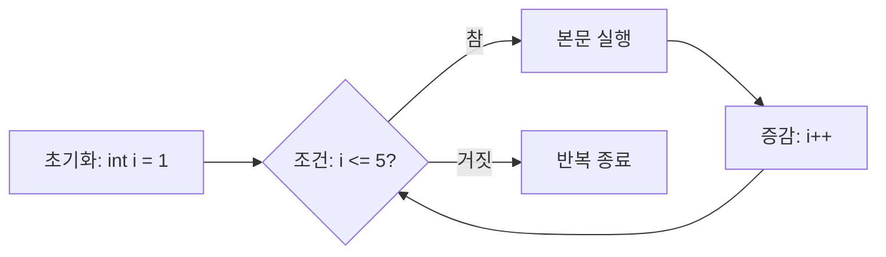

# 07_08 Hello Java: 처음 배우는 Java 기초

- 🎯 글의 목표: Java 프로그램이 만들어지고 실행되는 과정을 이해하고, 변수·자료형·연산자·조건문·반복문으로 작은 프로그램을 직접 작성한다.
- 🧩 핵심 키워드: JDK, JVM, bytecode, `main`, 변수, 기본형, 참조형, 형 변환, 연산자, `if`, `switch`, `for`, `while`, `break`, `continue`
- ⭐ 중요도: ★★★★★
- 📝 한눈에 보는 내용: 사람이 작성한 `.java` 파일은 컴파일러를 거쳐 `.class` 바이트코드가 되고 JVM에서 실행된다. 프로그램은 값을 변수에 저장하고 연산자로 계산하며, 조건문으로 길을 선택하고 반복문으로 같은 일을 여러 번 수행한다.
- 🔗 관련 문제 / 주제: Java 입문, 알고리즘 문제 풀이, 객체지향 프로그래밍의 기초

---

## 1. 들어가며

컴퓨터는 스스로 “무엇을 해야 할지” 생각하지 않는다. 우리가 아주 정확한 순서로 명령을 적어 주어야 한다. 이 명령들의 모음을 **프로그램**이라고 하고, 프로그램을 만드는 일을 **프로그래밍**이라고 한다.

예를 들어 학교에 갈 준비를 프로그램처럼 적으면 다음과 같다.

```text
1. 알람을 끈다.
2. 침대에서 일어난다.
3. 씻는다.
4. 가방을 챙긴다.
5. 비가 오면 우산을 챙긴다.
6. 학교까지 걸음을 반복한다.
```

여기에는 프로그래밍의 핵심이 이미 들어 있다. 순서대로 실행하는 명령, “비가 오면”처럼 상황에 따라 선택하는 조건, 학교에 도착할 때까지 반복하는 행동이다. Java에서는 이런 생각을 컴퓨터가 이해할 수 있는 엄격한 문법으로 적는다.

처음에는 `public static void main` 같은 긴 문장이 낯설고 세미콜론 하나 때문에 오류가 나기도 한다. 이 글에서는 한꺼번에 외우지 않는다. 다음 순서로 작은 블록을 하나씩 쌓는다.

1. Java 코드가 어떻게 실행되는지 이해한다.
2. 값을 담는 변수와 자료형을 배운다.
3. 연산자로 값을 계산하고 비교한다.
4. 조건문으로 실행할 길을 선택한다.
5. 반복문으로 같은 작업을 여러 번 실행한다.

## 2. 핵심 개념 정리

Java 프로그램을 놀이 로봇에 비유해 보자.

- **변수**는 값을 담는 이름표 붙은 상자다.
- **자료형**은 상자에 무엇을 담을 수 있는지 적힌 종류표다.
- **연산자**는 상자의 값을 계산하거나 비교하는 도구다.
- **조건문**은 신호등처럼 어느 길로 갈지 정한다.
- **반복문**은 같은 동작을 정해진 횟수 또는 조건 동안 반복한다.

Java 실행 과정은 다음과 같다.


Java가 “Write Once, Run Anywhere”라고 불리는 이유는 같은 `.class` 바이트코드를 Windows용 JVM, macOS용 JVM, Linux용 JVM이 각 환경에 맞게 실행할 수 있기 때문이다.

## 3. 본문 정리

### 3.1 프로그램과 프로그래밍 언어

컴퓨터의 CPU는 결국 0과 1로 표현된 기계 명령을 처리한다. 사람이 기계어를 직접 작성하는 것은 어렵기 때문에 Java나 Python 같은 고급 언어를 사용한다. 고급 언어는 사람이 읽기 편한 문법을 제공하고, 컴파일러나 인터프리터가 컴퓨터가 실행할 수 있는 형태로 바꾼다.

운영체제도 프로그램이다. Windows, macOS, Linux는 키보드·화면·파일·메모리 같은 컴퓨터 자원을 다른 프로그램이 사용할 수 있도록 관리한다.

### 3.2 컴퓨터는 0과 1로 정보를 표현한다

**비트(bit)**는 0 또는 1 하나를 저장하는 가장 작은 정보 단위다. 전등 하나가 꺼짐과 켜짐 두 상태를 갖는 것과 비슷하다.

**바이트(byte)**는 비트 8개를 묶은 단위다.

```text
1 bit  : 0 또는 1
8 bits : 1 byte
```

비트 1개는 2가지 상태를 표현한다. 비트가 8개면 `2 × 2 × ... × 2`, 즉 `2^8 = 256`가지 상태를 표현할 수 있다.

저장 용량 표기에는 두 기준이 있다.

| 10진수 기준(SI) | 크기 | 2진수 기준(IEC) | 크기 |
|---|---:|---|---:|
| 1 KB | 1,000 B | 1 KiB | 1,024 B |
| 1 MB | 1,000 KB | 1 MiB | 1,024 KiB |
| 1 GB | 1,000 MB | 1 GiB | 1,024 MiB |

그래서 저장 장치 회사가 표시한 GB와 운영체제가 보여 주는 용량이 조금 다르게 느껴질 수 있다.

### 3.3 JDK, JVM, 컴파일을 구분한다

Java 개발을 시작할 때 자주 만나는 세 용어가 있다.

| 용어 | 쉬운 설명 | 주요 역할 |
|---|---|---|
| JDK | Java 개발 도구 상자 | 컴파일러와 실행 도구 등을 포함 |
| JVM | Java 전용 실행 기계 | `.class` 바이트코드를 실행 |
| IDE | 코드를 편하게 쓰는 작업실 | 작성·실행·오류 표시 지원 |

JDK에는 `javac`라는 컴파일러가 있다. 컴파일은 사람이 작성한 `.java` 소스 코드를 JVM이 이해하는 `.class` 바이트코드로 바꾸는 작업이다.

```bash
javac Hello.java
java Hello
```

첫 명령은 `Hello.java`를 컴파일해 `Hello.class`를 만든다. 두 번째 명령은 확장자를 적지 않고 JVM으로 `Hello` 클래스를 실행한다.

Java 9부터 모듈 시스템과 `module-info.java`가 도입되었다. 하지만 작은 입문 프로젝트에서는 모듈을 사용하지 않아도 된다. 중요한 것은 프로젝트가 사용하는 JDK 버전과 컴파일러 버전이 맞는지 확인하는 것이다.

### 3.4 첫 프로그램 `Hello, World!`

```java
public class Hello {
    public static void main(String[] args) {
        System.out.println("Hello, World!");
    }
}
```

처음에는 이 코드를 다음처럼 읽으면 충분하다.

- `public class Hello`: `Hello`라는 프로그램 설계 상자를 만든다.
- `main`: 프로그램이 시작되는 입구다.
- `{ }`: 여러 명령을 하나의 블록으로 묶는다.
- `System.out.println(...)`: 괄호 안의 내용을 화면에 출력하고 줄을 바꾼다.
- `;`: 하나의 명령이 끝났다는 표시다.

파일 이름은 `public class` 이름과 같아야 한다. 따라서 위 코드는 `Hello.java`에 저장한다. Java는 대소문자를 구분하므로 `Hello`와 `hello`는 다른 이름이다.

`main`의 각 단어는 뒤에서 객체지향과 메서드를 배우면 정확히 이해할 수 있다. 첫날에는 JVM이 프로그램을 시작할 때 찾는 약속된 모양이라고 생각하면 된다.

### 3.5 주석은 컴퓨터가 실행하지 않는 설명이다

```java
// 한 줄 주석: 줄 끝까지 설명이다.

/*
여러 줄 주석:
이 범위는 실행되지 않는다.
*/

/**
 * 문서화 주석: 클래스나 메서드의 사용법을 문서로 만들 때 사용한다.
 */
```

주석은 “코드가 무엇을 하는지” 그대로 번역하기보다 **왜 이렇게 작성했는지**를 남기는 데 유용하다. 코드를 임시로 숨기는 용도로 너무 많이 사용하면 오래된 코드가 쌓이므로 버전 관리 도구와 함께 사용한다.

### 3.6 세 가지 출력 방법

```java
public class OutputExample {
    public static void main(String[] args) {
        System.out.print("안녕");
        System.out.print(" Java");

        System.out.println();
        System.out.println("이 문장 뒤에는 줄바꿈이 붙어요.");

        String name = "민수";
        int age = 12;
        System.out.printf("이름: %s, 나이: %d%n", name, age);
    }
}
```

| 메서드 | 특징 |
|---|---|
| `print` | 출력 후 같은 줄에 머문다. |
| `println` | 출력 후 다음 줄로 이동한다. |
| `printf` | 형식 문자열에 값을 끼워 출력한다. |

자주 사용하는 형식 지정자는 `%d` 정수, `%f` 실수, `%s` 문자열, `%c` 문자, `%n` 줄바꿈이다.

```java
double height = 152.3456;
System.out.printf("키: %.2f cm%n", height);  // 소수 둘째 자리까지 출력
```

### 3.7 변수는 이름표가 붙은 저장 상자다

변수는 메모리에 값을 저장하고 이름으로 다시 꺼내 쓰게 해 준다.

```java
int age;       // 선언: int 값을 담을 age 상자를 준비한다.
age = 12;      // 대입: age 상자에 12를 넣는다.

int score = 100;  // 선언과 초기화를 동시에 한다.
```

`=`는 수학의 “같다”가 아니라 오른쪽 값을 왼쪽 변수에 저장하라는 **대입 연산자**다.

```java
int number = 10;
number = number + 1;
```

두 번째 줄은 “number와 number + 1이 같다”는 수학식이 아니다. 기존 `number` 10에 1을 더해 11을 만들고, 그 결과를 다시 `number`에 저장한다.

#### 변수 이름 규칙

- 대소문자를 구분한다: `age`와 `Age`는 다르다.
- 숫자로 시작할 수 없다: `1stScore`는 불가능하다.
- 공백을 넣을 수 없다.
- Java 예약어를 사용할 수 없다: `class`, `public`, `if` 등.
- `$`와 `_`를 사용할 수 있지만 일반 변수는 영문 소문자로 시작하는 `camelCase`가 관례다.
- `a`, `x1`보다 `studentAge`, `totalScore`처럼 의미를 드러낸다.

```java
int studentAge = 12;
int totalScore = 300;
```

### 3.8 기본형과 참조형

Java 자료형은 크게 기본형과 참조형으로 나뉜다.

- 기본형: 변수 상자에 실제 값이 직접 들어간다.
- 참조형: 객체가 있는 위치를 찾아갈 수 있는 참조가 들어간다.

기본형은 8개다.

| 분류 | 자료형 | 크기 | 예시 |
|---|---|---:|---|
| 논리 | `boolean` | JVM 구현에 따라 내부 표현이 달라질 수 있음 | `true`, `false` |
| 문자 | `char` | 2 byte | `'A'`, `'가'` |
| 정수 | `byte` | 1 byte | `100` |
| 정수 | `short` | 2 byte | `30000` |
| 정수 | `int` | 4 byte | `1_000_000` |
| 정수 | `long` | 8 byte | `9_000_000_000L` |
| 실수 | `float` | 4 byte | `3.14F` |
| 실수 | `double` | 8 byte | `3.14` |

입문 단계에서는 정수는 보통 `int`, 실수는 보통 `double`을 사용한다. `long` 리터럴에는 `L`, `float` 리터럴에는 `F`를 붙인다.

```java
boolean isStudent = true;
char grade = 'A';
int count = 20;
long worldPopulation = 8_000_000_000L;
double temperature = 23.5;
String message = "안녕하세요";  // String은 참조형이다.
```

`char`는 작은따옴표로 문자 하나를, `String`은 큰따옴표로 문자열을 표현한다.

⚠️ 주의: 지역 변수는 자동으로 기본값이 들어가지 않는다. 사용하기 전에 반드시 초기화해야 한다.

```java
public static void main(String[] args) {
    int score;
    // System.out.println(score); // 컴파일 오류: 초기화되지 않음
}
```

클래스의 멤버 변수는 숫자 0, `boolean`의 `false`, 참조형의 `null` 같은 기본값으로 초기화된다. 하지만 기본값에 기대기보다 의미 있는 초기값을 명시하는 편이 코드를 읽기 쉽다.

### 3.9 형 변환은 상자의 종류를 바꾸는 일이다

작은 범위의 정수를 큰 범위 자료형에 넣으면 Java가 자동으로 변환할 수 있다.

```java
int number = 10;
double result = number;  // 10이 10.0으로 자동 변환
```

반대로 더 넓거나 정밀한 자료형을 좁은 자료형으로 바꾸면 정보가 사라질 수 있으므로 직접 자료형을 적는다.

```java
double price = 9.99;
int whole = (int) price;
System.out.println(whole);  // 9: 반올림이 아니라 소수 부분을 버린다.
```

```java
int big = 130;
byte small = (byte) big;
System.out.println(small);  // 범위를 넘어서 예상과 다른 음수가 될 수 있다.
```

자료형의 “크고 작음”은 단순 메모리 크기만이 아니라 표현 가능한 값의 범위와 정밀도를 함께 생각해야 한다.

### 3.10 산술 연산자와 정수 나눗셈

```java
int a = 7;
int b = 2;

System.out.println(a + b);  // 9
System.out.println(a - b);  // 5
System.out.println(a * b);  // 14
System.out.println(a / b);  // 3
System.out.println(a % b);  // 1
```

정수끼리 나누면 결과도 정수다. `7 / 2`는 `3.5`가 아니라 소수 부분이 사라진 `3`이다. 실수 결과가 필요하면 적어도 한쪽을 실수로 만든다.

```java
double answer = 7.0 / 2;
System.out.println(answer);  // 3.5
```

나머지 연산 `%`는 홀짝 판별과 주기 반복에 자주 사용한다.

```java
int number = 7;
boolean isEven = number % 2 == 0;
```

### 3.11 비교 연산자는 `boolean` 결과를 만든다

```java
int age = 12;

System.out.println(age == 12);  // true
System.out.println(age != 12);  // false
System.out.println(age > 10);   // true
System.out.println(age <= 13);  // true
```

`=`는 대입이고 `==`는 두 값을 비교한다.

문자열 내용 비교에는 `equals()`를 사용한다.

```java
String first = new String("Java");
String second = new String("Java");

System.out.println(first == second);       // 참조 위치 비교: false
System.out.println(first.equals(second));  // 문자열 내용 비교: true
```

처음에는 “기본형 값 비교는 `==`, 문자열 내용 비교는 `equals()`”로 기억하면 된다.

### 3.12 논리 연산자와 단락 평가

논리 연산자는 여러 조건을 조합한다.

| 연산자 | 뜻 | 예시 |
|---|---|---|
| `&&` | 그리고: 둘 다 참이어야 참 | `age >= 8 && age <= 13` |
| `||` | 또는: 하나라도 참이면 참 | `day == 6 || day == 7` |
| `!` | 반대 | `!isClosed` |

```java
int age = 12;
boolean canEnter = age >= 8 && age <= 13;
```

Java는 결과가 이미 결정되면 뒤 조건을 계산하지 않는다. 이를 단락 평가라고 한다.

```java
String name = null;

if (name != null && name.length() > 0) {
    System.out.println(name);
}
```

앞 조건 `name != null`이 거짓이면 `&&` 전체가 거짓이므로 뒤의 `name.length()`를 실행하지 않는다. 덕분에 `null`에서 메서드를 호출하는 오류를 피한다. 조건 순서가 중요한 이유다.

### 3.13 대입·증감·삼항 연산자

복합 대입 연산자는 계산 후 다시 저장하는 코드를 줄인다.

```java
int score = 10;
score += 5;  // score = score + 5;
score -= 2;
score *= 3;
score /= 2;
score %= 4;
```

증감 연산자는 값을 1 늘리거나 줄인다.

```java
int count = 5;

int before = count++;  // before에 5를 넣은 뒤 count가 6
int after = ++count;   // count를 7로 만든 뒤 after에 7 저장
```

한 줄에서 전치·후치 결과를 섞으면 읽기 어렵다. 입문 단계에서는 독립된 한 줄로 쓰는 편이 안전하다.

삼항 연산자는 간단한 조건에 따라 값 하나를 고른다.

```java
int score = 85;
String result = score >= 60 ? "합격" : "불합격";
```

조건이 복잡하거나 여러 명령을 실행해야 한다면 `if`가 더 읽기 쉽다.

### 3.14 연산자 우선순위는 괄호로 의도를 보여 준다

```java
int result1 = 2 + 3 * 4;      // 14
int result2 = (2 + 3) * 4;    // 20
```

대략 괄호 → 단항 → 산술 → 비교 → 논리 → 대입 순으로 계산한다. 모든 순위를 외우기보다 헷갈리는 식에 괄호를 써서 사람이 읽을 때도 분명하게 만든다.

### 3.15 `if`는 조건이 참일 때만 실행한다

```java
int temperature = 30;

if (temperature >= 28) {
    System.out.println("오늘은 더워요.");
}
```

조건식은 반드시 `boolean` 결과를 만들어야 한다. Python처럼 숫자나 문자열을 조건으로 바로 사용할 수 없다.

`if-else`는 두 길 중 하나를 선택한다.

```java
int score = 55;

if (score >= 60) {
    System.out.println("합격");
} else {
    System.out.println("불합격");
}
```

중괄호는 명령이 하나일 때 생략할 수 있지만, 실수로 조건 밖에 코드를 추가하기 쉬우므로 항상 쓰는 습관이 안전하다.

### 3.16 `else if`와 독립된 `if`를 구분한다

`else if` 묶음에서는 처음으로 참인 한 블록만 실행한다.

```java
int score = 85;

if (score >= 90) {
    System.out.println("A");
} else if (score >= 80) {
    System.out.println("B");
} else if (score >= 70) {
    System.out.println("C");
} else {
    System.out.println("D");
}
```

조건은 위에서 아래로 검사하므로 더 좁고 높은 기준을 먼저 둔다. `score >= 60`을 맨 앞에 두면 95점도 거기에서 끝나 A 등급에 도달하지 못한다.

서로 독립된 조건은 각각 `if`로 쓴다.

```java
int number = 12;

if (number % 2 == 0) {
    System.out.println("짝수");
}

if (number % 3 == 0) {
    System.out.println("3의 배수");
}
```

12는 두 조건을 모두 만족하므로 두 문장이 모두 출력되어야 한다.

### 3.17 `switch`는 하나의 값을 여러 경우와 비교한다

전통적인 `switch` 문은 일치한 `case`부터 실행하며 `break`에서 멈춘다.

```java
int menu = 2;

switch (menu) {
    case 1:
        System.out.println("김밥");
        break;
    case 2:
        System.out.println("떡볶이");
        break;
    case 3:
        System.out.println("라면");
        break;
    default:
        System.out.println("없는 메뉴");
}
```

`break`를 빠뜨리면 다음 `case`까지 계속 실행되는 fall-through가 생긴다. 일부러 여러 case를 묶을 때도 있지만 초보자에게는 흔한 버그다.

Java 14 이상에서는 값을 반환하는 switch expression을 사용할 수 있다.

```java
int grade = 2;

String result = switch (grade) {
    case 1 -> "1등급";
    case 2 -> "2등급";
    case 3 -> "3등급";
    default -> "등급 없음";
};

System.out.println(result);
```

여러 값을 같은 결과로 묶을 수도 있다.

```java
int number = 5;

String size = switch (number) {
    case 1, 2, 3 -> "작은 수";
    case 4, 5, 6 -> "중간 수";
    default -> "큰 수";
};
```

여러 줄 블록에서 값을 반환할 때는 `yield`를 사용한다.

### 3.18 `for`는 반복 횟수를 알 때 편하다

```java
for (int i = 1; i <= 5; i++) {
    System.out.println(i);
}
```

`for`는 다음 순서로 움직인다.



구구단 한 단처럼 횟수가 분명한 작업에 알맞다.

```java
int dan = 3;

for (int i = 1; i <= 9; i++) {
    System.out.printf("%d × %d = %d%n", dan, i, dan * i);
}
```

`for (;;) { }`는 조건이 없는 무한 반복이다. 반드시 내부에 안전한 종료 조건이 있어야 한다.

### 3.19 `while`은 반복 횟수를 미리 모를 때 편하다

```java
int energy = 3;

while (energy > 0) {
    System.out.println("한 걸음 이동");
    energy--;
}
```

조건을 참에서 거짓으로 바꾸는 코드가 없으면 무한 반복이 된다.

`do-while`은 본문을 먼저 한 번 실행한 뒤 조건을 확인한다.

```java
int number = 10;

do {
    System.out.println(number);
    number++;
} while (number < 5);
```

처음부터 조건이 거짓이어도 10이 한 번 출력된다. 메뉴를 최소 한 번 보여 주거나 입력을 최소 한 번 받아야 할 때 사용할 수 있다.

### 3.20 `break`와 `continue`로 반복 흐름을 바꾼다

`break`는 가장 가까운 반복문을 끝낸다.

```java
for (int i = 1; i <= 10; i++) {
    if (i == 5) {
        break;
    }
    System.out.println(i);  // 1, 2, 3, 4
}
```

`continue`는 현재 차례의 남은 코드를 건너뛰고 다음 반복으로 간다.

```java
for (int i = 1; i <= 5; i++) {
    if (i == 3) {
        continue;
    }
    System.out.println(i);  // 1, 2, 4, 5
}
```

중첩 반복문에는 라벨을 붙여 바깥 반복까지 빠져나올 수 있지만 흐름을 따라가기 어려워진다. 가능하면 메서드로 나누거나 조건을 단순하게 만든다.

### 3.21 배운 문법을 하나의 작은 프로그램으로 연결한다

숫자의 홀짝과 등급을 출력하고 합계를 구해 보자.

```java
public class NumberReport {
    public static void main(String[] args) {
        int limit = 5;
        int sum = 0;

        for (int number = 1; number <= limit; number++) {
            sum += number;

            String kind = number % 2 == 0 ? "짝수" : "홀수";
            System.out.printf("%d는 %s입니다.%n", number, kind);
        }

        System.out.printf("1부터 %d까지의 합은 %d입니다.%n", limit, sum);

        if (sum >= 10) {
            System.out.println("합이 10 이상입니다.");
        } else {
            System.out.println("합이 10보다 작습니다.");
        }
    }
}
```

코드 흐름을 손으로 추적하면 다음과 같다.

| 반복 시작의 `number` | `sum += number` 후 `sum` | 홀짝 |
|---:|---:|---|
| 1 | 1 | 홀수 |
| 2 | 3 | 짝수 |
| 3 | 6 | 홀수 |
| 4 | 10 | 짝수 |
| 5 | 15 | 홀수 |

프로그램이 어렵게 느껴질 때는 변수의 현재 값을 표로 적어 보는 것이 가장 좋은 디버깅 방법 중 하나다.

## 4. 적용 관점에서 다시 보기

Java 문제를 처음 받으면 다음 순서로 생각한다.

1. 입력과 출력이 무엇인지 문장으로 적는다.
2. 저장할 값마다 자료형과 의미 있는 변수 이름을 정한다.
3. 필요한 계산을 연산자로 작성한다.
4. 여러 길 중 하나를 고르면 `if-else` 또는 `switch`를 사용한다.
5. 같은 작업을 반복하면 `for` 또는 `while`을 선택한다.
6. 작은 값으로 변수 변화를 손으로 추적한다.
7. 경계값과 예상 출력을 확인한다.

| 문제의 신호 | 떠올릴 문법 |
|---|---|
| “만약”, “일 때” | `if` |
| 여러 조건 중 처음 맞는 하나 | `else if` |
| 하나의 값에 따른 메뉴 선택 | `switch` |
| N번 반복 | `for` |
| 조건이 만족되는 동안 반복 | `while` |
| 반복 즉시 종료 | `break` |
| 이번 차례만 건너뛰기 | `continue` |

컴파일 오류가 나면 오류 메시지의 첫 번째 위치부터 본다. 세미콜론, 중괄호 짝, 클래스와 파일 이름, 변수 선언과 초기화, 자료형을 차례로 확인한다. 실행은 되지만 결과가 틀리면 작은 입력으로 각 변수 값을 출력해 흐름을 추적한다.

## 5. 배운 점 / 확장 포인트

### 5.1 이번 강의 이전에 몰랐던 것 또는 새로 이해된 것

Java 코드는 곧바로 운영체제의 기계어가 되는 것이 아니라 바이트코드로 컴파일된 뒤 JVM에서 실행된다. 또한 변수 선언에 자료형을 적기 때문에 어떤 값을 저장할 수 있는지가 코드에 분명히 드러난다.

### 5.2 앞으로 이어지는 연결점

변수와 제어문은 이후 배열, 메서드, 클래스, 객체를 배우는 바닥이다. 알고리즘 문제도 결국 값을 저장하고, 조건에 따라 선택하고, 반복해서 계산하는 작은 단계들의 조합이다.

### 5.3 더 파볼 만한 주제

입력을 받는 `Scanner`와 빠른 입출력, 배열과 향상된 `for`, 메서드의 매개변수와 반환값을 이어서 학습할 수 있다. 숫자 범위 초과, 부동소수점 오차, 문자열 불변성도 자료형을 더 깊게 이해하는 좋은 주제다.

## 6. 요약 정리

- 프로그램은 컴퓨터가 실행할 명령들의 모음이다.
- 비트는 0 또는 1, 바이트는 비트 8개를 묶은 단위다.
- JDK는 개발 도구, `javac`는 컴파일러, JVM은 바이트코드 실행 환경이다.
- `.java` 소스는 컴파일되어 `.class` 바이트코드가 된다.
- `main`은 Java 프로그램이 시작되는 약속된 입구다.
- 변수는 값을 저장하는 이름 붙은 공간이고 선언 후 초기화하여 사용한다.
- Java의 기본형은 `boolean`, `char`, 네 정수형, 두 실수형으로 8개다.
- 넓은 범위로의 변환은 자동일 수 있지만 좁은 범위로 바꾸면 손실을 확인해야 한다.
- 정수 나눗셈은 소수 부분을 버린다.
- 문자열 내용은 `==`가 아니라 `equals()`로 비교한다.
- `&&`와 `||`는 단락 평가를 하므로 조건 순서가 중요하다.
- `if`는 조건에 따른 선택, `switch`는 하나의 값에 따른 여러 경우에 적합하다.
- `for`는 횟수가 분명한 반복, `while`은 조건 중심 반복에 편하다.
- `break`는 반복을 끝내고 `continue`는 현재 차례의 남은 코드를 건너뛴다.

🧠 기억할 것: 프로그램은 “값을 저장하고 → 계산하고 → 길을 선택하고 → 필요한 만큼 반복하는 것”의 조합이다.

## 7. 미니 퀴즈 또는 체크리스트

1. `.java`, `.class`, JVM은 어떤 순서로 연결되는가?
2. `print`, `println`, `printf`의 차이는 무엇인가?
3. 변수의 선언과 초기화는 각각 무엇인가?
4. `char`와 `String`은 따옴표와 저장 내용이 어떻게 다른가?
5. 지역 변수를 초기화하지 않고 사용할 수 없는 이유는 무엇인가?
6. `9.99`를 `int`로 명시적 변환하면 어떤 값이 되는가?
7. `7 / 2`와 `7.0 / 2`의 결과가 다른 이유는 무엇인가?
8. 문자열 비교에 `equals()`를 사용하는 이유는 무엇인가?
9. `name != null && name.length() > 0`에서 조건 순서가 중요한 이유는 무엇인가?
10. `else if` 묶음과 독립된 여러 `if`는 언제 다르게 동작하는가?
11. 전통적인 `switch`에서 `break`를 빠뜨리면 어떤 일이 생기는가?
12. `for`와 `while` 중 반복 횟수를 알고 있을 때 더 자연스러운 것은 무엇인가?
13. `do-while`이 다른 반복문과 다른 핵심 특징은 무엇인가?
14. `break`와 `continue`의 차이를 예시로 설명할 수 있는가?
15. 다음 사항을 확인했는가?
    - [ ] `public class` 이름과 파일 이름이 같다.
    - [ ] 모든 지역 변수를 사용 전에 초기화했다.
    - [ ] 정수 나눗셈인지 실수 나눗셈인지 확인했다.
    - [ ] 문자열 내용을 `equals()`로 비교했다.
    - [ ] 반복문 조건이 언젠가 거짓이 되는지 확인했다.
    - [ ] 중괄호와 세미콜론 위치를 확인했다.
