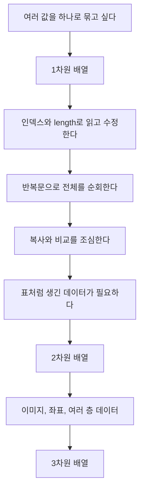
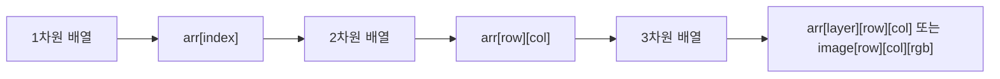

# 07_09 Java 배열: 값을 줄 세우고, 표처럼 다루는 방법

- 학습 목표: Java에서 배열이 왜 필요한지 이해하고, 1차원 배열과 다차원 배열을 직접 만들고 순회하고 복사할 수 있다.
- 핵심 키워드: 배열, 인덱스, `length`, 기본값, 참조, 얕은 복사, 깊은 복사, `Arrays.toString`, `Arrays.copyOf`, 2차원 배열, 비정형 배열, 3차원 배열
- 중요도: 높음. 배열은 반복문과 함께 알고리즘 문제를 풀 때 거의 매일 쓰는 기본 도구다.
- 관련 주제: Java 기본 문법, 반복문, 참조형 변수, 메모리 구조, 알고리즘 입문

---

## 1. 들어가며

지난 시간에는 Java 프로그램을 실행하는 방법, 변수, 자료형, 연산자, 조건문, 반복문을 배웠다. 이번에는 그 다음 단계인 **배열**을 배운다. 배열은 여러 개의 값을 하나의 이름으로 묶어서 다루는 방법이다.

예를 들어 학생 5명의 점수를 저장한다고 생각해 보자. 배열을 쓰지 않으면 다음처럼 변수를 여러 개 만들어야 한다.

```java
int score1 = 90;
int score2 = 80;
int score3 = 85;
int score4 = 100;
int score5 = 70;
```

이렇게 쓰면 5명일 때는 아직 괜찮아 보인다. 하지만 학생이 30명, 100명, 1000명이 되면 변수 이름을 계속 만들어야 한다. 평균을 구하려고 해도 `score1 + score2 + ...`처럼 하나씩 더해야 한다. 이때 배열을 사용하면 같은 종류의 값을 한 줄로 세워 놓고, 번호를 붙여서 꺼내 쓸 수 있다.

```java
int[] scores = {90, 80, 85, 100, 70};
```

이제 `scores`라는 이름 하나로 5개의 점수를 다룰 수 있다. `scores[0]`은 첫 번째 점수, `scores[1]`은 두 번째 점수다. 사람은 보통 첫 번째를 1번이라고 부르지만, Java 배열은 **0번부터 시작**한다. 이 규칙 하나가 처음에는 어색하지만, 배열을 다룰 때 가장 중요한 약속이다.

이번 강의는 크게 두 흐름으로 볼 수 있다.



배열은 단순히 문법 하나를 추가로 외우는 내용이 아니다. 값을 하나씩 따로 보던 사고에서, **값들의 묶음 전체를 하나의 자료로 보는 사고**로 넘어가는 내용이다.

## 2. 핵심 개념 정리

배열은 **같은 자료형의 값 여러 개를 한 줄로 저장하는 자료구조**다. 여기서 자료구조란 값을 저장하고 꺼내기 위한 정리 방식이라고 생각하면 된다. 책상 위에 연필을 아무렇게나 놓으면 찾기 어렵지만, 연필꽂이에 꽂아 두면 순서대로 찾기 쉽다. 배열은 컴퓨터 메모리 안에 값을 순서 있게 꽂아 두는 연필꽂이와 비슷하다.

배열의 중요한 특징은 다음 네 가지다.

| 특징 | 설명 |
|---|---|
| 같은 자료형만 저장 | `int[]`에는 `int` 값만, `String[]`에는 `String` 참조만 넣는다. |
| 인덱스로 접근 | `arr[0]`, `arr[1]`처럼 번호로 요소를 꺼낸다. |
| 크기가 고정 | 한 번 만든 배열의 길이는 바꿀 수 없다. 더 큰 배열이 필요하면 새 배열을 만들어 복사한다. |
| 참조형이다 | 배열 변수에는 배열 자체가 아니라 배열 객체의 위치를 가리키는 참조가 들어간다. |

여기서 **요소(element)**는 배열 안에 들어 있는 각각의 값이다. **인덱스(index)**는 요소의 위치 번호다. **길이(length)**는 배열에 들어갈 수 있는 요소의 개수다.

예를 들어 다음 배열을 보자.

```java
int[] nums = {27, 54, 83};
```

이 배열은 머릿속에서 이렇게 그리면 된다.

```text
nums
  |
  v
+---------+---------+---------+
| nums[0] | nums[1] | nums[2] |
+---------+---------+---------+
|   27    |   54    |   83    |
+---------+---------+---------+
```

`nums`는 배열 전체에 붙은 이름이고, `nums[0]`, `nums[1]`, `nums[2]`는 각각의 칸이다. `nums.length`는 3이다.

배열을 처음 배우는 사람이 가장 자주 헷갈리는 부분은 다음이다.

| 헷갈리는 점 | 바르게 이해하기 |
|---|---|
| 첫 번째 요소는 `arr[1]`인가? | 아니다. 첫 번째 요소는 `arr[0]`이다. |
| 마지막 요소는 `arr[length]`인가? | 아니다. 마지막 요소는 `arr[length - 1]`이다. |
| 배열 길이를 나중에 늘릴 수 있나? | 직접 늘릴 수 없다. 새 배열을 만들어 복사해야 한다. |
| `arr2 = arr1`은 배열 복사인가? | 값 복사가 아니라 같은 배열을 같이 가리키는 참조 복사다. |

## 3. 본문 정리

### 3.1 배열이 필요한 이유

배열이 필요한 가장 쉬운 이유는 **같은 성격의 값을 많이 저장해야 하기 때문**이다. 점수 5개, 학생 이름 30개, 하루 기온 24개, 게임 맵의 칸 정보처럼 값이 여러 개 모이면 변수 하나씩으로는 관리하기 어렵다.

배열을 쓰면 반복문과 잘 맞는다. 반복문은 같은 작업을 여러 번 하는 문법이고, 배열은 여러 값을 순서대로 저장하는 문법이다. 둘을 합치면 “배열의 첫 번째부터 마지막까지 차례대로 처리하기”가 가능해진다.

```java
int[] scores = {90, 80, 85, 100, 70};

for (int i = 0; i < scores.length; i++) {
    System.out.println(scores[i]);
}
```

이 코드는 다음 뜻이다.

1. `i`를 0부터 시작한다.
2. `i`가 `scores.length`보다 작을 동안 반복한다.
3. `scores[i]`를 출력한다.
4. 한 번 출력할 때마다 `i`를 1씩 증가시킨다.

`scores.length`가 5라면 `i`는 0, 1, 2, 3, 4까지만 움직인다. 그래서 인덱스 범위를 벗어나지 않는다.

### 3.2 배열 선언

배열을 사용하려면 먼저 배열 변수를 선언할 수 있다. Java에서 배열 선언은 보통 다음 형식을 쓴다.

```java
자료형[] 배열이름;
```

예시는 다음과 같다.

```java
int[] intArray;
char[] charArray;
boolean[] boolArray;
String[] strArray;
float[] floatArray;
```

Java에서는 아래처럼 쓸 수도 있다.

```java
int intArray[];
```

하지만 일반적으로는 `int[] intArray;`처럼 자료형 옆에 `[]`를 붙이는 방식을 더 많이 쓴다. 이유는 “`int` 여러 개를 담는 배열”이라는 뜻이 더 잘 보이기 때문이다.

선언은 이름표만 만든 상태다. 아직 실제 배열 칸이 생긴 것은 아니다.

```java
int[] nums;
```

이 코드는 `nums`라는 배열 변수를 만들 뿐이다. 실제로 3칸짜리 배열을 만들려면 `new int[3]`처럼 생성해야 한다.

### 3.3 배열 생성과 초기화

배열을 만드는 기본 문법은 다음과 같다.

```java
자료형[] 배열이름 = new 자료형[길이];
```

예를 들어 정수 3개를 저장할 배열을 만들려면 이렇게 쓴다.

```java
int[] nums = new int[3];
```

이 순간 `nums[0]`, `nums[1]`, `nums[2]` 세 칸이 생긴다. 아직 값을 직접 넣지 않았으므로 Java가 자료형에 맞는 기본값을 넣어 둔다.

| 자료형 | 기본값 | 설명 |
|---|---:|---|
| `boolean` | `false` | 참/거짓 중 기본은 거짓 |
| `char` | `'\u0000'` | 널 문자, 화면에 거의 보이지 않음 |
| `byte`, `short`, `int`, `long` | `0` | 정수 기본값 |
| `float`, `double` | `0.0` | 실수 기본값 |
| 참조형, 예: `String` | `null` | 아직 아무 객체도 가리키지 않음 |

배열을 만들면서 바로 값을 넣을 수도 있다.

```java
int[] nums = new int[] {27, 54, 83};
```

선언과 동시에 초기화할 때는 더 짧게 쓸 수 있다.

```java
int[] nums = {27, 54, 83};
```

단, 짧은 초기화 문법은 선언과 동시에 쓸 때 자연스럽다.

```java
int[] nums;
nums = new int[] {27, 54, 83}; // 가능

// nums = {27, 54, 83};       // 불가능
```

배열의 생성 과정을 그림처럼 생각하면 다음과 같다.

```text
int[] nums = new int[3];

nums
  |
  v
+---------+---------+---------+
| nums[0] | nums[1] | nums[2] |
+---------+---------+---------+
|    0    |    0    |    0    |
+---------+---------+---------+
```

값을 넣으면 칸의 내용이 바뀐다.

```java
nums[0] = 11;
nums[1] = 7;
nums[2] = 23;
```

```text
nums
  |
  v
+---------+---------+---------+
| nums[0] | nums[1] | nums[2] |
+---------+---------+---------+
|   11    |    7    |   23    |
+---------+---------+---------+
```

`String[]`처럼 참조형 배열은 처음에 각 칸이 `null`이다.

```java
String[] names = new String[3];
```

```text
names
  |
  v
+----------+----------+----------+
| names[0] | names[1] | names[2] |
+----------+----------+----------+
|   null   |   null   |   null   |
+----------+----------+----------+
```

`names[0] = "pear";`처럼 값을 넣으면 해당 칸이 문자열 객체를 가리키게 된다.

### 3.4 인덱스와 `length`

배열의 각 칸에 접근하려면 `[]` 안에 인덱스를 넣는다.

```java
int[] nums = {27, 54, 83};

System.out.println(nums[0]); // 27
System.out.println(nums[1]); // 54
System.out.println(nums[2]); // 83
```

인덱스는 0부터 시작한다. 길이가 3인 배열의 인덱스는 0, 1, 2다. 길이가 5인 배열의 인덱스는 0, 1, 2, 3, 4다.

배열 길이는 `배열이름.length`로 구한다.

```java
int[] nums = {27, 54, 83};
System.out.println(nums.length); // 3
```

여기서 `length` 뒤에는 괄호를 붙이지 않는다. 배열의 `length`는 메서드가 아니라 배열이 가진 값처럼 사용하는 속성이다.

```java
nums.length;   // 배열 길이
"hello".length(); // 문자열 길이 메서드
```

배열 범위를 벗어나면 실행 중 오류가 난다.

```java
int[] nums = {27, 54, 83};

System.out.println(nums[3]); // 오류
```

`nums`의 마지막 인덱스는 2인데 3번 칸을 읽으려고 했기 때문이다. 이런 오류를 `ArrayIndexOutOfBoundsException`이라고 한다.

주의할 점은 다음 세 가지다.

| 잘못된 접근 | 왜 문제인가 |
|---|---|
| `nums[-1]` | 인덱스는 음수가 될 수 없다. |
| `nums[nums.length]` | 길이가 3이면 마지막 인덱스는 2다. |
| 반복문에서 `i <= nums.length` | 마지막에 `nums[3]`처럼 범위를 벗어난다. |

반복문 조건은 보통 이렇게 쓴다.

```java
for (int i = 0; i < nums.length; i++) {
    System.out.println(nums[i]);
}
```

`i < nums.length`는 배열을 다룰 때 거의 기본 공식처럼 자주 나온다.

### 3.5 배열 순회

**순회**는 배열의 요소를 처음부터 끝까지 하나씩 방문한다는 뜻이다. 배열 안의 값을 모두 출력하거나, 합계를 구하거나, 조건에 맞는 값을 찾을 때 순회가 필요하다.

인덱스가 필요한 경우에는 일반 `for`문을 쓴다.

```java
int[] intArray = {1, 3, 5, 7, 9};

for (int i = 0; i < intArray.length; i++) {
    System.out.println(i + "번 인덱스 값: " + intArray[i]);
}
```

이 코드는 인덱스와 값을 둘 다 사용할 수 있다. 값을 수정해야 할 때도 일반 `for`문이 좋다.

```java
int[] nums = {1, 2, 3};

for (int i = 0; i < nums.length; i++) {
    nums[i] = nums[i] * 10;
}

System.out.println(java.util.Arrays.toString(nums)); // [10, 20, 30]
```

값을 읽기만 할 때는 향상된 `for`문, 즉 for-each 문을 쓸 수 있다.

```java
int[] intArray = {1, 3, 5, 7, 9};

for (int x : intArray) {
    System.out.println(x);
}
```

이 문장은 “`intArray`에서 값을 하나씩 꺼내 `x`에 담고 출력한다”는 뜻이다. 인덱스가 보이지 않으므로 코드가 읽기 쉽다.

하지만 for-each 문에서는 현재 값의 인덱스를 바로 알기 어렵고, 요소 자체를 바꾸는 작업에는 적합하지 않다.

```java
int[] nums = {1, 2, 3};

for (int x : nums) {
    x = x * 10; // x만 바뀐다. nums 배열의 칸은 바뀌지 않는다.
}

System.out.println(java.util.Arrays.toString(nums)); // [1, 2, 3]
```

for-each의 `x`는 배열 칸 자체가 아니라 그 칸의 값을 복사해서 받은 변수라고 생각하면 쉽다. 그래서 배열 값을 수정하려면 인덱스를 사용해야 한다.

### 3.6 배열 출력

배열을 그냥 출력하면 우리가 기대한 값 목록이 나오지 않는다.

```java
int[] numbers = {10, 20, 30};
System.out.println(numbers);
```

이 코드는 `[I@...` 같은 이상해 보이는 문자열을 출력할 수 있다. 배열 안의 값이 아니라 배열 객체의 정보가 출력되는 것이다.

배열 내용을 보기 좋게 출력하려면 `java.util.Arrays` 클래스의 `toString`을 사용한다.

```java
import java.util.Arrays;

public class ArrayPrintExample {
    public static void main(String[] args) {
        int[] numbers = {10, 20, 30};
        System.out.println(Arrays.toString(numbers));
    }
}
```

출력은 다음과 같다.

```text
[10, 20, 30]
```

2차원 배열을 한 번에 보고 싶을 때는 `Arrays.deepToString`을 사용할 수 있다.

```java
import java.util.Arrays;

public class TwoDimensionalPrintExample {
    public static void main(String[] args) {
        int[][] scores = {
            {90, 80, 85},
            {100, 70, 60}
        };

        System.out.println(Arrays.deepToString(scores));
    }
}
```

출력은 다음처럼 배열 안의 배열까지 보여 준다.

```text
[[90, 80, 85], [100, 70, 60]]
```

### 3.7 얕은 복사와 깊은 복사

배열에서 아주 중요한 개념이 **복사**다. 다음 코드를 보자.

```java
import java.util.Arrays;

public class ShallowCopyExample {
    public static void main(String[] args) {
        int[] original = {1, 2, 3};
        int[] shallowCopy = original;

        shallowCopy[0] = 10;

        System.out.println("원본 배열: " + Arrays.toString(original));
        System.out.println("복사본 배열: " + Arrays.toString(shallowCopy));
    }
}
```

출력은 다음과 같다.

```text
원본 배열: [10, 2, 3]
복사본 배열: [10, 2, 3]
```

분명 `shallowCopy[0]`만 바꿨는데 `original[0]`도 바뀌었다. 이유는 `shallowCopy = original`이 배열 값을 새로 복사한 것이 아니라, **같은 배열을 가리키는 이름표를 하나 더 만든 것**이기 때문이다.

```text
original      shallowCopy
    |              |
    +------v-------+
      +---+---+---+
      | 1 | 2 | 3 |
      +---+---+---+
```

이런 복사를 **얕은 복사**라고 부른다. 배열의 내용은 하나이고, 그 배열을 가리키는 변수가 두 개다.

진짜로 새로운 배열을 만들고 값을 따로 복사하려면 `Arrays.copyOf`를 사용할 수 있다.

```java
import java.util.Arrays;

public class DeepCopyExample {
    public static void main(String[] args) {
        int[] original = {1, 2, 3};
        int[] deepCopy = Arrays.copyOf(original, original.length);

        deepCopy[0] = 10;

        System.out.println("원본 배열: " + Arrays.toString(original));
        System.out.println("복사본 배열: " + Arrays.toString(deepCopy));
    }
}
```

출력은 다음과 같다.

```text
원본 배열: [1, 2, 3]
복사본 배열: [10, 2, 3]
```

이번에는 원본이 바뀌지 않는다.

```text
original
   |
   v
 +---+---+---+
 | 1 | 2 | 3 |
 +---+---+---+

deepCopy
   |
   v
 +----+---+---+
 | 10 | 2 | 3 |
 +----+---+---+
```

이런 방식은 새로운 배열 객체를 만들기 때문에 원본과 복사본이 서로 독립적이다.

다만 “깊은 복사”라는 말은 상황에 따라 조심해야 한다. `int[]`처럼 기본형 배열은 `Arrays.copyOf`로 각 칸의 값이 복사되므로 충분하다. 하지만 배열 안에 객체가 들어 있는 경우에는 객체 자체까지 새로 복사되는 것은 아니다. 이 부분은 객체지향을 배운 뒤 더 정확히 다루면 된다. 이번 강의에서는 “배열 칸을 새 배열로 복사해서 원본과 다른 배열을 만든다” 정도로 이해하면 충분하다.

### 3.8 배열 크기를 바꾸고 싶을 때

배열은 한 번 만들면 길이를 바꿀 수 없다.

```java
int[] arr = {1, 2, 3, 4, 5};
```

이 배열은 길이가 5다. 여기서 10칸으로 늘리고 싶다면 기존 배열을 직접 늘리는 것이 아니라, 10칸짜리 새 배열을 만든 뒤 값을 복사해야 한다.

```java
import java.util.Arrays;

public class ArrayResizeExample {
    public static void main(String[] args) {
        int[] arr = {1, 2, 3, 4, 5};
        int[] tmp = Arrays.copyOf(arr, 10);

        System.out.println(Arrays.toString(tmp));
    }
}
```

출력은 다음과 같다.

```text
[1, 2, 3, 4, 5, 0, 0, 0, 0, 0]
```

앞의 5칸은 기존 값이 복사되고, 새로 생긴 칸은 `int`의 기본값인 0으로 채워진다.

```text
arr
  |
  v
+---+---+---+---+---+
| 1 | 2 | 3 | 4 | 5 |
+---+---+---+---+---+

tmp
  |
  v
+---+---+---+---+---+---+---+---+---+---+
| 1 | 2 | 3 | 4 | 5 | 0 | 0 | 0 | 0 | 0 |
+---+---+---+---+---+---+---+---+---+---+
```

배열 복사에 자주 쓰는 메서드는 다음과 같다.

| 메서드 | 설명 |
|---|---|
| `Arrays.copyOf(original, newLength)` | 원본 배열을 새 길이로 복사한다. |
| `Arrays.copyOfRange(original, from, to)` | `from`부터 `to - 1`까지 복사한다. |
| `System.arraycopy(src, srcPos, dest, destPos, length)` | 원본의 일부를 목적지 배열의 특정 위치에 빠르게 복사한다. |

`copyOfRange`에서 끝 인덱스는 포함되지 않는다.

```java
import java.util.Arrays;

public class CopyRangeExample {
    public static void main(String[] args) {
        int[] numbers = {10, 20, 30, 40, 50};
        int[] subArray = Arrays.copyOfRange(numbers, 1, 4);

        System.out.println(Arrays.toString(subArray));
    }
}
```

출력은 다음과 같다.

```text
[20, 30, 40]
```

인덱스 1, 2, 3만 복사되고 인덱스 4는 포함되지 않는다.

### 3.9 배열 비교

배열 두 개가 같은지 비교할 때 `==`를 쓰면 주의해야 한다.

```java
int[] arr1 = {1, 2, 3, 4, 5};
int[] arr2 = {1, 2, 3, 4, 5};

System.out.println(arr1 == arr2); // false
```

두 배열의 값은 같지만 결과는 `false`다. `==`는 두 변수가 같은 배열 객체를 가리키는지 비교한다. 값이 같은지 비교하는 것이 아니다.

배열의 내용이 같은지 비교하려면 `Arrays.equals`를 사용한다.

```java
import java.util.Arrays;

public class ArrayEqualsExample {
    public static void main(String[] args) {
        int[] arr1 = {1, 2, 3, 4, 5};
        int[] arr2 = {1, 2, 3, 4, 5};

        System.out.println(Arrays.equals(arr1, arr2)); // true
    }
}
```

`String[]`도 마찬가지로 배열 내용 비교에는 `Arrays.equals`를 쓰면 된다.

```java
import java.util.Arrays;

public class StringArrayEqualsExample {
    public static void main(String[] args) {
        String[] arr1 = {"pig", "cow", "dog", "fish"};
        String[] arr2 = {"pig", "cow", "dog", "fish"};

        System.out.println(Arrays.equals(arr1, arr2)); // true
    }
}
```

2차원 배열처럼 배열 안에 배열이 들어 있는 경우에는 `Arrays.deepEquals`를 사용할 수 있다.

### 3.10 실습 1: 최대, 최소, 합, 평균 구하기

배열 실습의 첫 번째 문제는 주어진 배열에서 최솟값, 최댓값, 합계, 평균을 구하는 것이다.

```java
int[] nums = {64, 53, 123, 23, 444, 98, 12};
```

처음 배우는 입장에서 이 문제를 푸는 생각 순서는 다음과 같다.

1. 최솟값과 최댓값은 배열의 첫 번째 값으로 시작한다.
2. 합계는 0으로 시작한다.
3. 배열을 처음부터 끝까지 순회한다.
4. 현재 값이 최솟값보다 작으면 최솟값을 바꾼다.
5. 현재 값이 최댓값보다 크면 최댓값을 바꾼다.
6. 현재 값을 합계에 더한다.
7. 평균은 합계를 배열 길이로 나눈다.

```java
public class ArrayMinMaxAverage {
    public static void main(String[] args) {
        int[] nums = {64, 53, 123, 23, 444, 98, 12};

        int min = nums[0];
        int max = nums[0];
        int sum = 0;

        for (int i = 0; i < nums.length; i++) {
            int current = nums[i];

            if (current < min) {
                min = current;
            }

            if (current > max) {
                max = current;
            }

            sum += current;
        }

        double average = (double) sum / nums.length;

        System.out.println("최솟값: " + min);
        System.out.println("최댓값: " + max);
        System.out.println("합계: " + sum);
        System.out.println("평균: " + average);
    }
}
```

평균을 구할 때 `(double) sum`처럼 형 변환을 한 이유는 소수점까지 얻기 위해서다. `sum / nums.length`가 둘 다 정수이면 정수 나눗셈이 되어 소수점 아래가 버려질 수 있다.

### 3.11 실습 2: 빈도수 구하기

두 번째 실습은 0부터 9까지의 숫자가 들어 있는 배열에서 각 숫자가 몇 번 등장했는지 세는 문제다.

```java
int[] intArray = {3, 7, 2, 5, 7, 7, 9, 2, 8, 1, 1, 5, 3};
```

이 문제에서는 “숫자마다 카운터를 하나씩 둔다”는 생각이 중요하다. 숫자가 0부터 9까지이므로 길이 10짜리 배열을 만들면 된다.

```text
counts[0] -> 숫자 0이 나온 횟수
counts[1] -> 숫자 1이 나온 횟수
counts[2] -> 숫자 2가 나온 횟수
...
counts[9] -> 숫자 9가 나온 횟수
```

코드는 다음과 같다.

```java
public class FrequencyExample {
    public static void main(String[] args) {
        int[] intArray = {3, 7, 2, 5, 7, 7, 9, 2, 8, 1, 1, 5, 3};
        int[] counts = new int[10];

        for (int i = 0; i < intArray.length; i++) {
            int number = intArray[i];
            counts[number]++;
        }

        for (int i = 0; i < counts.length; i++) {
            if (counts[i] > 0) {
                System.out.println(i + " : " + counts[i] + "번");
            }
        }
    }
}
```

`counts[number]++`가 핵심이다. 예를 들어 `number`가 7이면 `counts[7]`을 1 증가시킨다. 배열의 인덱스를 “위치 번호”로만 보는 것이 아니라, 여기서는 “숫자 자체를 세기 위한 칸 번호”로 활용한다.

이 방식은 알고리즘에서 매우 자주 나온다. 특히 값의 범위가 작고 정해져 있을 때 빠르고 단순하게 빈도를 셀 수 있다.

### 3.12 다차원 배열

다차원 배열은 배열 안에 또 다른 배열이 들어 있는 구조다. 가장 많이 쓰는 것은 2차원 배열이다. 2차원 배열은 표, 좌표, 행렬처럼 행과 열이 있는 데이터를 표현할 때 유용하다.

예를 들어 학생 3명의 과목 점수를 표로 나타내면 다음과 같다.

| 학생 | 국어 | 영어 | 수학 |
|---|---:|---:|---:|
| 0번 학생 | 90 | 80 | 85 |
| 1번 학생 | 100 | 80 | 75 |
| 2번 학생 | 50 | 90 | 100 |

이 표는 Java에서 다음처럼 표현할 수 있다.

```java
int[][] scores = {
    {90, 80, 85},
    {100, 80, 75},
    {50, 90, 100}
};
```

2차원 배열은 겉으로 보기에는 표처럼 보이지만, 실제로는 “배열 안에 1차원 배열의 참조가 들어 있는 구조”다.

```text
scores
  |
  v
+-----------+-----------+-----------+
| scores[0] | scores[1] | scores[2] |
+-----------+-----------+-----------+
      |           |           |
      v           v           v
  +---+---+---+ +---+---+---+ +---+---+---+
  |90 |80 |85 | |100|80 |75 | |50 |90 |100|
  +---+---+---+ +---+---+---+ +---+---+---+
```

그래서 `scores[0]`은 첫 번째 행 배열이고, `scores[0][1]`은 첫 번째 행의 두 번째 열 값이다.

### 3.13 2차원 배열 선언과 생성

2차원 배열 선언은 다음처럼 쓴다.

```java
int[][] arr1;
int[] arr2[];
int arr3[][];
```

세 문법 모두 가능하지만, 보통은 `int[][] arr1;`을 가장 많이 쓴다. 이 방식이 “int의 2차원 배열”이라는 뜻을 가장 잘 보여 준다.

크기가 정해진 2차원 배열은 다음처럼 만든다.

```java
int[][] arr = new int[3][3];
```

이 코드는 3행 3열 배열을 만든다. 기본값은 모두 0이다.

```text
arr[0] -> [0, 0, 0]
arr[1] -> [0, 0, 0]
arr[2] -> [0, 0, 0]
```

값으로 바로 초기화할 수도 있다.

```java
int[][] arr = {
    {1, 2, 3},
    {4, 5, 6},
    {7, 8, 9}
};
```

여기서 `arr[1][2]`는 2번째 행, 3번째 열이므로 값은 6이다. 사람 말로 “2번째”라고 부르는 것과 코드 인덱스가 1인 것을 헷갈리지 말아야 한다.

### 3.14 2차원 배열은 꼭 네모 모양이어야 할까?

Java의 2차원 배열은 반드시 모든 행의 길이가 같을 필요가 없다. 이유는 2차원 배열이 진짜 네모난 한 덩어리가 아니라, 1차원 배열들을 가리키는 배열이기 때문이다.

```java
int[][] jagged = new int[3][];

jagged[0] = new int[2];
jagged[1] = new int[4];
jagged[2] = new int[1];
```

이런 배열을 비정형 배열 또는 jagged array라고 부를 수 있다.

```text
jagged
  |
  v
+-----------+-----------+-----------+
| jagged[0] | jagged[1] | jagged[2] |
+-----------+-----------+-----------+
      |           |           |
      v           v           v
   +---+---+   +---+---+---+---+   +---+
   | 0 | 0 |   | 0 | 0 | 0 | 0 |   | 0 |
   +---+---+   +---+---+---+---+   +---+
```

그래서 2차원 배열을 순회할 때 열의 길이를 항상 `arr[0].length`로 고정하면 위험할 수 있다. 행마다 길이가 다를 수 있으므로 보통은 다음처럼 현재 행의 길이를 사용한다.

```java
for (int row = 0; row < jagged.length; row++) {
    for (int col = 0; col < jagged[row].length; col++) {
        System.out.println(jagged[row][col]);
    }
}
```

### 3.15 2차원 배열의 메모리 구조

강의의 중요한 그림 중 하나는 다음 코드의 메모리 구조다.

```java
int[][] arr = new int[2][];

arr[0] = new int[3];
arr[0][1] = 100;

arr[1] = new int[3];
arr[1][2] = 1000;
```

이 코드는 한 번에 2행 3열 배열을 만드는 것이 아니라, 먼저 “행을 담을 배열”을 만들고, 각 행을 나중에 따로 만든다.

처음 상태는 다음과 같다.

```text
arr
 |
 v
+--------+--------+
| arr[0] | arr[1] |
+--------+--------+
|  null  |  null  |
+--------+--------+
```

`arr[0] = new int[3];`을 실행하면 첫 번째 행만 생긴다.

```text
arr
 |
 v
+--------+--------+
| arr[0] | arr[1] |
+--------+--------+
    |      null
    v
 +---+---+---+
 | 0 | 0 | 0 |
 +---+---+---+
```

`arr[0][1] = 100;`을 실행하면 첫 번째 행의 두 번째 칸이 바뀐다.

```text
arr[0]
  |
  v
+---+-----+---+
| 0 | 100 | 0 |
+---+-----+---+
```

그 다음 두 번째 행을 만들고 값을 넣으면 다음과 비슷한 구조가 된다.

```text
arr
 |
 v
+--------+--------+
| arr[0] | arr[1] |
+--------+--------+
    |        |
    v        v
 +---+-----+---+    +---+---+------+
 | 0 | 100 | 0 |    | 0 | 0 | 1000 |
 +---+-----+---+    +---+---+------+
```

이 그림을 이해하면 2차원 배열에서 `NullPointerException`이 왜 생기는지도 이해할 수 있다. 예를 들어 `arr[1]`이 아직 `null`인데 `arr[1][0]`에 접근하면, 존재하지 않는 행의 칸을 찾으려는 것이므로 오류가 난다.

### 3.16 2차원 배열 순회

2차원 배열은 보통 반복문 두 개를 겹쳐서 순회한다. 바깥 반복문은 행을 움직이고, 안쪽 반복문은 열을 움직인다.

```java
int[][] scores = {
    {90, 80, 85, 100},
    {100, 80, 75, 60},
    {50, 90, 100, 100}
};

for (int row = 0; row < scores.length; row++) {
    for (int col = 0; col < scores[row].length; col++) {
        System.out.println("scores[" + row + "][" + col + "] = " + scores[row][col]);
    }
}
```

읽는 순서는 다음과 같다.

```text
scores[0][0] -> scores[0][1] -> scores[0][2] -> scores[0][3]
scores[1][0] -> scores[1][1] -> scores[1][2] -> scores[1][3]
scores[2][0] -> scores[2][1] -> scores[2][2] -> scores[2][3]
```

`scores.length`는 행의 개수다. `scores[row].length`는 현재 행의 열 개수다.

### 3.17 실습 3: 3의 배수는 0으로 바꾸기

2차원 배열 실습 문제는 전체 요소를 순회하면서 3의 배수라면 0으로 바꾸는 문제다.

```java
import java.util.Arrays;

public class MultipleOfThreeExample {
    public static void main(String[] args) {
        int[][] arr = {
            {1, 2, 3},
            {4, 5, 6},
            {7, 8, 9}
        };

        for (int row = 0; row < arr.length; row++) {
            for (int col = 0; col < arr[row].length; col++) {
                if (arr[row][col] % 3 == 0) {
                    arr[row][col] = 0;
                }
            }
        }

        System.out.println(Arrays.deepToString(arr));
    }
}
```

핵심은 `%` 연산자다. `값 % 3 == 0`이면 3으로 나누어떨어진다는 뜻이다.

출력은 다음과 같다.

```text
[[1, 2, 0], [4, 5, 0], [7, 8, 0]]
```

2차원 배열 문제는 “모든 칸을 한 번씩 방문한다”가 기본 출발점이다. 그다음 각 칸에서 조건을 검사하고, 필요하면 값을 바꾼다.

### 3.18 실습 4: 가장 시끄러운 자리 찾기

강의에는 “가장 시끄러운 자리” 문제도 등장한다. 각 칸에는 그 자리의 소음 정도가 들어 있다. 그런데 어떤 자리의 진짜 소음은 자기 자신뿐 아니라 위, 아래, 왼쪽, 오른쪽의 소음까지 더한 값이다.

가운데 칸을 기준으로 보면 다음 모양이다.

```text
    위
왼쪽 나 오른쪽
    아래
```

배열 좌표로 생각하면 현재 위치가 `(row, col)`일 때 주변은 다음과 같다.

| 방향 | 행 변화 | 열 변화 |
|---|---:|---:|
| 자기 자신 | `0` | `0` |
| 위 | `-1` | `0` |
| 아래 | `1` | `0` |
| 왼쪽 | `0` | `-1` |
| 오른쪽 | `0` | `1` |

코드로는 방향 배열을 만들어 처리할 수 있다.

```java
public class NoiseSeatExample {
    public static void main(String[] args) {
        int[][] noise = {
            {3, 1, 2},
            {4, 8, 1},
            {2, 5, 6}
        };

        int[] dr = {0, -1, 1, 0, 0};
        int[] dc = {0, 0, 0, -1, 1};

        int maxNoise = Integer.MIN_VALUE;
        int maxRow = -1;
        int maxCol = -1;

        for (int row = 0; row < noise.length; row++) {
            for (int col = 0; col < noise[row].length; col++) {
                int total = 0;

                for (int dir = 0; dir < dr.length; dir++) {
                    int nextRow = row + dr[dir];
                    int nextCol = col + dc[dir];

                    boolean inRow = 0 <= nextRow && nextRow < noise.length;
                    boolean inCol = 0 <= nextCol && nextCol < noise[nextRow].length;

                    if (inRow && inCol) {
                        total += noise[nextRow][nextCol];
                    }
                }

                if (total > maxNoise) {
                    maxNoise = total;
                    maxRow = row;
                    maxCol = col;
                }
            }
        }

        System.out.println("가장 시끄러운 자리: (" + maxRow + ", " + maxCol + ")");
        System.out.println("소음 합계: " + maxNoise);
    }
}
```

이 문제에서 가장 조심할 점은 배열 밖으로 나가지 않는 것이다. 예를 들어 맨 윗줄의 칸에서 “위”를 보려고 하면 행 인덱스가 `-1`이 된다. 그래서 더하기 전에 `0 <= nextRow` 같은 범위 검사를 해야 한다.

### 3.19 3차원 배열

3차원 배열은 배열 안에 2차원 배열이 들어 있는 구조다. 문법은 다음과 같다.

```java
int[][][] arr = new int[크기A][크기B][크기C];
```

처음 보면 복잡하지만, 의미를 층으로 생각하면 조금 쉬워진다.

```text
arr[층][행][열]
```

또는 이미지 데이터에서는 다음처럼 생각할 수 있다.

```text
image[행][열][색상]
```

강의에서는 2x2 픽셀 이미지를 3차원 배열로 저장하는 예시가 나온다. 각 픽셀은 빨강(R), 초록(G), 파랑(B) 세 값을 가진다.

```text
왼쪽 위     오른쪽 위
rgb(243,103,224)  rgb(255,159,67)

왼쪽 아래   오른쪽 아래
rgb(21,210,211)   rgb(84,160,255)
```

이를 Java 배열로 나타내면 다음처럼 쓸 수 있다.

```java
public class ImageArrayExample {
    public static void main(String[] args) {
        int[][][] image = new int[2][2][3];

        image[0][0][0] = 243; // (0, 0) 픽셀의 Red
        image[0][0][1] = 103; // (0, 0) 픽셀의 Green
        image[0][0][2] = 224; // (0, 0) 픽셀의 Blue

        image[0][1][0] = 255;
        image[0][1][1] = 159;
        image[0][1][2] = 67;

        image[1][0][0] = 21;
        image[1][0][1] = 210;
        image[1][0][2] = 211;

        image[1][1][0] = 84;
        image[1][1][1] = 160;
        image[1][1][2] = 255;

        for (int row = 0; row < image.length; row++) {
            for (int col = 0; col < image[row].length; col++) {
                System.out.println(
                    "pixel (" + row + ", " + col + ") - "
                        + "R: " + image[row][col][0] + ", "
                        + "G: " + image[row][col][1] + ", "
                        + "B: " + image[row][col][2]
                );
            }
        }
    }
}
```

이 예시에서 `image[1][0][2]`는 1번 행, 0번 열 픽셀의 Blue 값이다. 값은 211이다.

3차원 배열은 처음에는 어려워 보이지만, 사실 1차원 배열의 규칙이 반복될 뿐이다.



차원이 늘어날수록 인덱스도 하나씩 더 필요하다. 1차원은 인덱스 1개, 2차원은 인덱스 2개, 3차원은 인덱스 3개가 필요하다.

## 4. 적용 관점

배열은 알고리즘 문제를 풀 때 기본 체력 같은 역할을 한다. 특히 다음 문제 유형에서 자주 등장한다.

| 문제 유형 | 배열을 쓰는 이유 |
|---|---|
| 최댓값, 최솟값 찾기 | 여러 값을 순서대로 검사해야 한다. |
| 합계, 평균 구하기 | 모든 요소를 누적해야 한다. |
| 빈도수 세기 | 숫자별 카운터 배열을 만들 수 있다. |
| 배열 비교 | 같은 위치의 값이 모두 같은지 확인한다. |
| 표 형태 데이터 | 2차원 배열로 행과 열을 표현한다. |
| 좌표 이동 | 상하좌우 탐색에 2차원 배열을 쓴다. |
| 이미지 RGB | 행, 열, 색상 값을 3차원 배열로 표현할 수 있다. |

배열 문제를 풀 때는 먼저 다음 질문을 던지면 좋다.

1. 값이 몇 개 필요한가?
2. 값의 자료형은 무엇인가?
3. 한 줄 데이터인가, 표 데이터인가?
4. 값을 읽기만 하는가, 수정해야 하는가?
5. 인덱스가 필요한가?
6. 배열 밖으로 나갈 위험이 있는가?

예를 들어 최댓값 문제는 한 줄 데이터이므로 1차원 배열을 순회하면 된다. 좌석 소음 문제는 행과 열이 있으므로 2차원 배열을 써야 한다. RGB 이미지는 한 픽셀에 색상 값 3개가 있으므로 3차원 배열로 표현할 수 있다.

또 하나 중요한 관점은 **배열은 크기가 고정되어 있다**는 점이다. 그래서 값이 계속 추가되고 삭제되는 상황에는 배열만으로는 불편할 수 있다. Java에는 나중에 `ArrayList` 같은 컬렉션을 배우게 되는데, 그때 배열과 리스트의 차이를 더 잘 이해할 수 있다. 지금은 배열을 통해 인덱스, 순회, 메모리 참조의 기초를 익히는 것이 중요하다.

## 5. 헷갈리기 쉬운 부분

### 5.1 인덱스는 0부터 시작한다

길이가 5인 배열의 인덱스는 0부터 4까지다.

```text
길이: 5
인덱스: 0, 1, 2, 3, 4
마지막 인덱스: length - 1
```

반복문 조건을 `i <= arr.length`로 쓰면 마지막에 범위를 벗어난다.

```java
for (int i = 0; i < arr.length; i++) {
    // 안전한 순회
}
```

### 5.2 `length`와 `length()`를 구분한다

배열 길이는 `arr.length`다. 문자열 길이는 `str.length()`다.

```java
int[] arr = {1, 2, 3};
String str = "hello";

System.out.println(arr.length);  // 3
System.out.println(str.length()); // 5
```

### 5.3 배열 변수에는 참조가 들어 있다

배열 변수는 배열 칸들을 직접 품고 있는 상자가 아니라, 배열 객체를 가리키는 이름표라고 생각하는 편이 좋다.

```java
int[] a = {1, 2, 3};
int[] b = a;
```

이 코드는 배열이 두 개가 되는 것이 아니라, 하나의 배열을 `a`와 `b`가 같이 가리키는 것이다.

### 5.4 for-each는 읽기에 좋지만 수정에는 조심한다

for-each 문은 값을 읽기 편하다.

```java
for (int value : arr) {
    System.out.println(value);
}
```

하지만 배열 칸 자체를 바꾸려면 인덱스를 사용해야 한다.

```java
for (int i = 0; i < arr.length; i++) {
    arr[i] = arr[i] * 2;
}
```

### 5.5 2차원 배열에서 열 길이는 행마다 다를 수 있다

항상 `arr[0].length`만 쓰면 비정형 배열에서 문제가 생길 수 있다.

```java
for (int row = 0; row < arr.length; row++) {
    for (int col = 0; col < arr[row].length; col++) {
        System.out.println(arr[row][col]);
    }
}
```

현재 행의 길이는 `arr[row].length`로 확인한다.

### 5.6 2차원 배열의 행이 `null`일 수도 있다

다음 코드를 보자.

```java
int[][] arr = new int[2][];
System.out.println(arr[0][0]); // 오류
```

`arr[0]`은 아직 실제 1차원 배열을 가리키지 않는다. 값은 `null`이다. 그래서 `arr[0][0]`에 접근하면 오류가 난다. 먼저 행 배열을 만들어야 한다.

```java
arr[0] = new int[3];
System.out.println(arr[0][0]); // 0
```

## 6. 요약

배열은 같은 자료형의 값을 여러 개 저장하기 위한 자료구조다. 배열의 각 값은 요소라고 부르고, 요소의 위치 번호는 인덱스라고 부른다. Java 배열의 인덱스는 0부터 시작하며, 길이가 `n`인 배열의 마지막 인덱스는 `n - 1`이다.

배열은 `자료형[] 배열이름 = new 자료형[길이];`로 만들 수 있고, 선언과 동시에 `{값1, 값2, 값3}` 형태로 초기화할 수도 있다. 값을 넣지 않으면 자료형에 맞는 기본값이 들어간다. `int`는 0, `boolean`은 `false`, 참조형은 `null`이 기본값이다.

배열 전체를 처리할 때는 반복문을 사용한다. 인덱스가 필요하거나 값을 수정해야 하면 일반 `for`문을 쓰고, 값을 읽기만 하면 for-each 문을 사용할 수 있다. 배열을 출력할 때는 `Arrays.toString`, 2차원 배열처럼 중첩된 배열은 `Arrays.deepToString`이 편리하다.

배열 복사에서는 참조 복사와 실제 값 복사를 구분해야 한다. `copy = original`은 같은 배열을 같이 가리키는 얕은 복사다. 원본과 독립된 배열이 필요하면 `Arrays.copyOf`나 `Arrays.copyOfRange`를 사용한다.

2차원 배열은 배열 안에 1차원 배열 참조가 들어 있는 구조다. 표, 좌표, 행렬처럼 행과 열이 있는 데이터를 표현할 때 사용한다. 2차원 배열은 모든 행의 길이가 같을 수도 있고, 행마다 길이가 다를 수도 있다. 그래서 순회할 때는 현재 행의 길이인 `arr[row].length`를 사용하는 습관이 좋다.

3차원 배열은 배열 안에 2차원 배열이 들어 있는 구조다. 이미지의 RGB 값처럼 `행`, `열`, `색상` 세 축이 필요한 데이터를 표현할 수 있다. 차원이 늘어나면 필요한 인덱스 개수도 늘어난다.

## 7. 복습 문제

1. 길이가 4인 `int` 배열을 만들면 사용할 수 있는 인덱스는 무엇인가?
2. `arr.length`와 `str.length()`의 차이는 무엇인가?
3. `int[] a = {1, 2, 3}; int[] b = a; b[0] = 10;`을 실행하면 `a[0]`은 몇인가?
4. 배열 내용을 보기 좋게 출력하려면 어떤 메서드를 사용할 수 있는가?
5. `Arrays.copyOfRange(numbers, 1, 4)`는 몇 번 인덱스부터 몇 번 인덱스까지 복사하는가?
6. 2차원 배열에서 `arr[row][col]`의 `row`와 `col`은 각각 무엇을 의미하는가?
7. 비정형 2차원 배열을 순회할 때 왜 `arr[row].length`를 써야 하는가?
8. `image[row][col][0]`, `image[row][col][1]`, `image[row][col][2]`를 RGB로 해석하면 각각 어떤 색상 값인가?

정답을 생각할 때는 외우려고 하기보다 작은 배열을 직접 그려 보는 것이 좋다. 배열은 그림으로 그리면 훨씬 빨리 익숙해진다.
