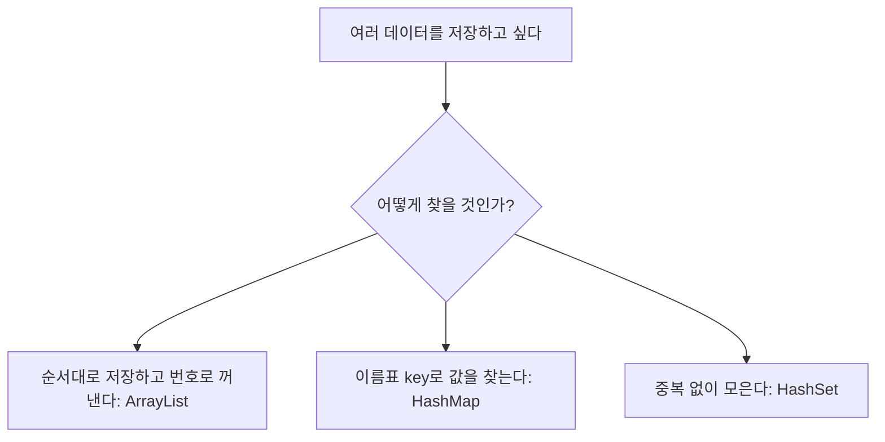
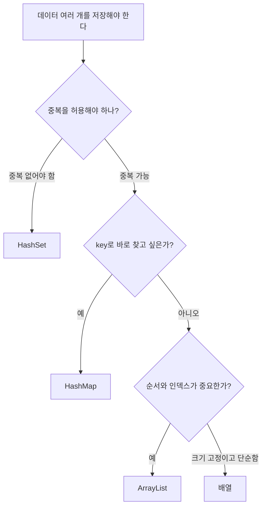

# 07_10 Java 컬렉션 기초: ArrayList, HashMap, HashSet으로 데이터 묶기

- 학습 목표: 배열 다음 단계로 `ArrayList`, `HashMap`, `HashSet`의 용도와 기본 메서드를 이해하고, 어떤 상황에서 어떤 자료구조를 선택해야 하는지 판단한다.
- 핵심 키워드: 컬렉션, `ArrayList`, 제네릭스, `add`, `get`, `size`, `remove`, `HashMap`, key-value, `put`, `getOrDefault`, `HashSet`, 중복 제거
- 중요도: 높음. 배열은 알고리즘 기초이고, 컬렉션은 실제 Java 코드에서 데이터를 다루는 핵심 도구다.
- 참고 자료: 점프 투 자바 03-07 리스트, 03-08 맵, 03-09 집합

---

## 1. 들어가며

07_09 노트에서 배열을 배웠다. 배열은 같은 자료형의 값을 여러 개 저장할 수 있는 기본 도구다.

```java
int[] scores = {90, 80, 100};
```

하지만 배열에는 불편한 점이 있다. **길이가 고정**되어 있다는 것이다.

```java
int[] scores = new int[3];
```

이 배열은 3칸이다. 네 번째 값을 자연스럽게 추가할 수 없다. 더 큰 배열을 새로 만들고 기존 값을 복사해야 한다.

실제 프로그램에서는 데이터 개수가 처음부터 정해져 있지 않은 경우가 많다.

- 게시글 댓글 수
- 장바구니 상품 개수
- 학생 명단
- 검색 결과 목록
- 중복을 제거해야 하는 태그 목록
- 단어와 뜻을 연결하는 사전

이럴 때 Java의 **컬렉션(Collection)**을 사용한다. 컬렉션은 여러 데이터를 더 편하게 저장하고 꺼내기 위해 Java가 제공하는 자료구조 묶음이다.

이번 노트에서는 입문 단계에서 가장 먼저 만나면 좋은 세 가지를 다룬다.



## 2. 핵심 개념 정리

배열과 컬렉션의 차이를 먼저 잡자.

| 구분 | 배열 | 컬렉션 |
|---|---|---|
| 크기 | 고정 | 보통 동적으로 변함 |
| 기본형 저장 | `int[]` 가능 | 기본형은 wrapper 사용, 예: `Integer` |
| 기능 | 단순 | 추가, 삭제, 검색 등 메서드 제공 |
| 대표 예 | `int[]`, `String[]` | `ArrayList`, `HashMap`, `HashSet` |

컬렉션을 처음 배울 때는 세 가지 질문으로 구분하면 된다.

| 질문 | 적합한 자료구조 |
|---|---|
| 순서가 있고, 몇 번째 값인지 중요하다 | `ArrayList` |
| key로 value를 빠르게 찾고 싶다 | `HashMap` |
| 중복 없이 값들을 모으고 싶다 | `HashSet` |

그리고 컬렉션에는 보통 제네릭스를 함께 사용한다.

```java
ArrayList<String> names = new ArrayList<>();
```

`<String>`은 이 리스트에 `String`만 담겠다는 뜻이다. 상자에 “여기는 이름표만 넣는 칸”이라고 적어두는 것과 비슷하다.

## 3. 본문 정리

### 3.1 ArrayList는 크기가 변하는 배열처럼 쓴다

`ArrayList`는 배열과 비슷하게 순서가 있고 인덱스로 값을 꺼낼 수 있다. 하지만 배열과 달리 값을 추가하면 크기가 자동으로 늘어난다.

```java
import java.util.ArrayList;

public class ArrayListExample {
    public static void main(String[] args) {
        ArrayList<String> names = new ArrayList<>();

        names.add("민수");
        names.add("지영");
        names.add("현우");

        System.out.println(names);
    }
}
```

출력은 다음과 같다.

```text
[민수, 지영, 현우]
```

`ArrayList`를 사용하려면 보통 파일 위쪽에 import가 필요하다.

```java
import java.util.ArrayList;
```

`java.util`은 Java가 제공하는 유용한 도구들이 들어 있는 패키지라고 생각하면 된다.

### 3.2 ArrayList 기본 메서드

`ArrayList`의 기본 메서드는 다음과 같다.

| 메서드 | 의미 |
|---|---|
| `add(value)` | 값을 맨 뒤에 추가 |
| `add(index, value)` | 특정 위치에 값 삽입 |
| `get(index)` | 특정 인덱스의 값 꺼내기 |
| `set(index, value)` | 특정 인덱스의 값 바꾸기 |
| `size()` | 요소 개수 확인 |
| `contains(value)` | 값이 들어 있는지 확인 |
| `indexOf(value)` | 값의 인덱스 찾기, 없으면 `-1` |
| `remove(index)` | 특정 인덱스의 값 삭제 |
| `remove(value)` | 특정 값 삭제 |

예제를 보자.

```java
import java.util.ArrayList;

public class ArrayListMethods {
    public static void main(String[] args) {
        ArrayList<String> pitches = new ArrayList<>();

        pitches.add("138");
        pitches.add("129");
        pitches.add("142");

        System.out.println(pitches.get(1));       // 129
        System.out.println(pitches.size());       // 3
        System.out.println(pitches.contains("142")); // true
        System.out.println(pitches.indexOf("129"));  // 1

        pitches.add(0, "133");
        pitches.set(1, "140");

        System.out.println(pitches);
    }
}
```

`get(1)`이 두 번째 값을 가져오는 이유는 배열처럼 인덱스가 0부터 시작하기 때문이다.

```text
인덱스: 0     1     2
값:    138   129   142
```

### 3.3 `remove`는 인덱스 삭제와 값 삭제가 모두 있다

`remove`는 특히 조심해야 한다. 같은 이름인데 두 가지 방식이 있다.

```java
remove(인덱스)
remove(객체)
```

문자열 리스트에서는 비교적 이해하기 쉽다.

```java
import java.util.ArrayList;

public class RemoveExample {
    public static void main(String[] args) {
        ArrayList<String> names = new ArrayList<>();

        names.add("민수");
        names.add("지영");
        names.add("현우");

        names.remove(0);       // 0번 인덱스 삭제: 민수 삭제
        names.remove("현우");  // 값이 "현우"인 요소 삭제

        System.out.println(names); // [지영]
    }
}
```

하지만 `ArrayList<Integer>`에서는 헷갈릴 수 있다.

```java
import java.util.ArrayList;

public class IntegerRemoveExample {
    public static void main(String[] args) {
        ArrayList<Integer> numbers = new ArrayList<>();

        numbers.add(10);
        numbers.add(20);
        numbers.add(30);

        numbers.remove(1); // 값 1을 지우는 것이 아니라 1번 인덱스를 지운다.

        System.out.println(numbers); // [10, 30]
    }
}
```

정수 값 자체를 삭제하고 싶다면 `Integer.valueOf`를 사용하면 의도가 분명해진다.

```java
numbers.remove(Integer.valueOf(20));
```

### 3.4 제네릭스는 담을 자료형을 정해주는 약속이다

제네릭스는 컬렉션에 어떤 자료형을 담을지 미리 정하는 문법이다.

```java
ArrayList<String> names = new ArrayList<>();
ArrayList<Integer> scores = new ArrayList<>();
```

`ArrayList<String>`에는 문자열만 담을 수 있다.

```java
ArrayList<String> names = new ArrayList<>();

names.add("민수");
// names.add(100); // 컴파일 오류
```

이렇게 하면 잘못된 자료형이 들어가는 실수를 컴파일 단계에서 막을 수 있다.

기본형은 제네릭스에 직접 넣지 않는다.

```java
// ArrayList<int> numbers = new ArrayList<>(); // 불가능
ArrayList<Integer> numbers = new ArrayList<>(); // 가능
```

`int`의 wrapper 클래스는 `Integer`다. Java는 많은 상황에서 `int`와 `Integer`를 자동으로 바꿔 주므로 입문 단계에서는 “리스트에 정수를 담을 때는 `Integer`를 쓴다”로 기억하면 된다.

### 3.5 ArrayList를 한 번에 만들기

`Arrays.asList`를 사용하면 여러 값을 넣은 리스트를 쉽게 만들 수 있다.

```java
import java.util.ArrayList;
import java.util.Arrays;

public class ArrayListInitExample {
    public static void main(String[] args) {
        ArrayList<String> names = new ArrayList<>(
            Arrays.asList("민수", "지영", "현우")
        );

        System.out.println(names);
    }
}
```

Java 9 이상에서는 `List.of`도 사용할 수 있지만, 처음에는 `ArrayList`를 직접 만들고 `add`로 넣는 방식부터 익히는 편이 안전하다.

리스트를 문자열로 합치고 싶다면 `String.join`을 사용할 수 있다.

```java
import java.util.ArrayList;
import java.util.Arrays;

public class JoinExample {
    public static void main(String[] args) {
        ArrayList<String> words = new ArrayList<>(
            Arrays.asList("red", "green", "blue")
        );

        String result = String.join(", ", words);
        System.out.println(result); // red, green, blue
    }
}
```

### 3.6 리스트 정렬

`ArrayList`는 정렬할 수 있다.

```java
import java.util.ArrayList;
import java.util.Arrays;
import java.util.Comparator;

public class SortExample {
    public static void main(String[] args) {
        ArrayList<Integer> numbers = new ArrayList<>(
            Arrays.asList(30, 10, 20)
        );

        numbers.sort(Comparator.naturalOrder());
        System.out.println(numbers); // [10, 20, 30]

        numbers.sort(Comparator.reverseOrder());
        System.out.println(numbers); // [30, 20, 10]
    }
}
```

오름차순은 작은 값에서 큰 값으로, 내림차순은 큰 값에서 작은 값으로 정렬한다.

### 3.7 HashMap은 key로 value를 찾는 사전이다

`HashMap`은 key와 value를 한 쌍으로 저장한다. 사전에서 단어를 찾으면 뜻이 나오듯이, map에서는 key로 value를 찾는다.

```text
people   -> 사람
baseball -> 야구
java     -> 자바
```

Java 코드로는 다음과 같다.

```java
import java.util.HashMap;

public class HashMapExample {
    public static void main(String[] args) {
        HashMap<String, String> dictionary = new HashMap<>();

        dictionary.put("people", "사람");
        dictionary.put("baseball", "야구");
        dictionary.put("java", "자바");

        System.out.println(dictionary.get("java")); // 자바
    }
}
```

`HashMap<String, String>`에서 첫 번째 `String`은 key의 자료형, 두 번째 `String`은 value의 자료형이다.

```java
HashMap<String, Integer> scores = new HashMap<>();
```

이 경우 key는 문자열, value는 정수다. 예를 들어 이름과 점수를 연결할 수 있다.

### 3.8 HashMap 기본 메서드

| 메서드 | 의미 |
|---|---|
| `put(key, value)` | key-value 쌍 추가 또는 수정 |
| `get(key)` | key에 해당하는 value 가져오기 |
| `getOrDefault(key, defaultValue)` | key가 없으면 기본값 반환 |
| `containsKey(key)` | key가 있는지 확인 |
| `remove(key)` | key에 해당하는 항목 삭제 |
| `size()` | 저장된 쌍의 개수 |
| `keySet()` | 모든 key 모음 반환 |

예제를 보자.

```java
import java.util.HashMap;

public class HashMapMethods {
    public static void main(String[] args) {
        HashMap<String, Integer> scores = new HashMap<>();

        scores.put("민수", 90);
        scores.put("지영", 100);

        System.out.println(scores.get("민수")); // 90
        System.out.println(scores.get("현우")); // null
        System.out.println(scores.getOrDefault("현우", 0)); // 0
        System.out.println(scores.containsKey("지영")); // true
        System.out.println(scores.size()); // 2
    }
}
```

`get`은 key가 없으면 `null`을 반환한다. 이때 바로 계산에 쓰면 오류가 날 수 있으므로, 기본값이 필요하면 `getOrDefault`를 사용한다.

빈도수 세기에도 `HashMap`을 쓸 수 있다.

```java
import java.util.HashMap;

public class WordCountExample {
    public static void main(String[] args) {
        String[] words = {"apple", "banana", "apple", "orange", "banana", "apple"};
        HashMap<String, Integer> counts = new HashMap<>();

        for (String word : words) {
            int oldCount = counts.getOrDefault(word, 0);
            counts.put(word, oldCount + 1);
        }

        System.out.println(counts);
    }
}
```

출력은 순서가 고정되지 않을 수 있지만 의미는 다음과 같다.

```text
apple -> 3
banana -> 2
orange -> 1
```

`HashMap`은 순서보다 key로 빠르게 찾는 것이 중요할 때 사용한다.

### 3.9 keySet으로 모든 key 순회하기

`keySet()`은 map의 모든 key를 모아서 준다.

```java
import java.util.HashMap;

public class KeySetExample {
    public static void main(String[] args) {
        HashMap<String, Integer> scores = new HashMap<>();

        scores.put("민수", 90);
        scores.put("지영", 100);
        scores.put("현우", 80);

        for (String name : scores.keySet()) {
            System.out.println(name + " : " + scores.get(name));
        }
    }
}
```

주의할 점은 `HashMap`의 순서는 입력한 순서와 다를 수 있다는 것이다. 순서가 꼭 필요하면 `LinkedHashMap`이나 `TreeMap` 같은 다른 Map 구현체를 고려한다.

### 3.10 HashSet은 중복을 허용하지 않는 모음이다

`HashSet`은 값들을 모아두지만 중복을 허용하지 않는다.

```java
import java.util.HashSet;

public class HashSetExample {
    public static void main(String[] args) {
        HashSet<String> tags = new HashSet<>();

        tags.add("java");
        tags.add("spring");
        tags.add("java");

        System.out.println(tags);
    }
}
```

`"java"`를 두 번 넣어도 한 번만 저장된다.

`HashSet`은 다음 상황에 유용하다.

- 중복 제거
- 어떤 값이 이미 있는지 빠르게 확인
- 두 모음의 교집합, 합집합, 차집합 계산

```java
import java.util.HashSet;

public class DuplicateRemoveExample {
    public static void main(String[] args) {
        String[] names = {"민수", "지영", "민수", "현우"};
        HashSet<String> uniqueNames = new HashSet<>();

        for (String name : names) {
            uniqueNames.add(name);
        }

        System.out.println(uniqueNames);
    }
}
```

`HashSet`도 순서가 중요하지 않다. 중복 제거가 목적일 때 좋다.

### 3.11 컬렉션 선택 기준

자료구조를 고르는 기준은 생각보다 단순하다.



처음에는 `ArrayList`를 가장 많이 쓰게 된다. 그다음 “이름으로 점수를 찾고 싶다”처럼 key-value 관계가 나오면 `HashMap`, “중복 제거”가 나오면 `HashSet`을 떠올리면 된다.

## 4. 적용 관점

알고리즘 문제에서 자료구조 선택은 풀이의 절반이다.

| 문제 상황 | 추천 도구 |
|---|---|
| 입력 순서를 유지하며 값을 저장 | `ArrayList` |
| 정렬이 필요 | `ArrayList` + `sort` |
| 학생 이름으로 점수 찾기 | `HashMap<String, Integer>` |
| 단어 빈도수 세기 | `HashMap<String, Integer>` |
| 중복 닉네임 제거 | `HashSet<String>` |
| 방문한 숫자 확인 | `HashSet<Integer>` 또는 boolean 배열 |
| 값 개수가 작고 고정 | 배열 |

예를 들어 “중복 없이 등장한 단어 개수”를 구한다면 `HashSet`이 잘 맞다.

```java
import java.util.HashSet;

public class UniqueWordCount {
    public static void main(String[] args) {
        String text = "java spring java db spring";
        String[] words = text.split(" ");

        HashSet<String> unique = new HashSet<>();

        for (String word : words) {
            unique.add(word);
        }

        System.out.println(unique.size()); // 3
    }
}
```

“단어가 각각 몇 번 나왔는지”가 필요하면 `HashMap`이 맞다.

```java
HashMap<String, Integer> counts = new HashMap<>();

for (String word : words) {
    counts.put(word, counts.getOrDefault(word, 0) + 1);
}
```

비슷해 보여도 목적이 다르다. 중복 제거면 Set, 횟수 세기면 Map이다.

## 5. 헷갈리기 쉬운 부분

### 5.1 배열과 ArrayList는 다르다

```java
int[] arr = new int[3];
ArrayList<Integer> list = new ArrayList<>();
```

배열은 `arr.length`, 리스트는 `list.size()`를 사용한다.

```java
System.out.println(arr.length);
System.out.println(list.size());
```

배열 접근은 `arr[0]`, 리스트 접근은 `list.get(0)`이다.

### 5.2 기본형은 제네릭스에 직접 못 넣는다

```java
// ArrayList<int> numbers = new ArrayList<>(); // 불가능
ArrayList<Integer> numbers = new ArrayList<>(); // 가능
```

`int`는 원시 자료형이고, `Integer`는 객체로 다룰 수 있는 wrapper 클래스다.

### 5.3 HashMap의 key는 중복될 수 없다

```java
HashMap<String, Integer> scores = new HashMap<>();

scores.put("민수", 90);
scores.put("민수", 100);

System.out.println(scores.get("민수")); // 100
```

같은 key로 다시 `put`하면 기존 value가 새 value로 바뀐다.

### 5.4 HashSet은 순서를 보장하지 않는다

`HashSet`은 중복 제거에 좋지만 입력 순서를 그대로 유지한다고 기대하면 안 된다.

```java
HashSet<String> set = new HashSet<>();
set.add("b");
set.add("a");
set.add("c");

System.out.println(set); // 입력 순서와 다를 수 있음
```

### 5.5 `remove(1)`은 값 1이 아니라 인덱스 1일 수 있다

`ArrayList<Integer>`에서 `remove(1)`은 보통 1번 인덱스를 삭제한다. 값 1을 지우고 싶다면 의도를 분명히 써야 한다.

```java
numbers.remove(Integer.valueOf(1));
```

## 6. 요약

컬렉션은 여러 데이터를 편하게 다루기 위한 Java의 자료구조 도구들이다. 배열은 크기가 고정되어 있지만, `ArrayList`는 값을 추가하거나 삭제하면서 크기가 변할 수 있다. 순서와 인덱스가 중요하면 `ArrayList`를 사용한다.

`HashMap`은 key와 value를 한 쌍으로 저장한다. 이름으로 점수를 찾거나, 단어별 등장 횟수를 세는 것처럼 “무언가를 기준으로 값을 찾는” 상황에 잘 맞다. key가 없을 때는 `get`이 `null`을 반환할 수 있으므로 기본값이 필요하면 `getOrDefault`를 사용한다.

`HashSet`은 중복을 허용하지 않는 자료구조다. 중복 제거, 이미 방문한 값 확인, 유일한 값 개수 세기 같은 문제에 적합하다.

자료구조를 고를 때는 “순서가 중요한가?”, “key로 찾아야 하는가?”, “중복을 없애야 하는가?”를 먼저 생각하자.

## 7. 복습 문제

1. 배열과 `ArrayList`의 가장 큰 차이는 무엇인가?
2. `ArrayList`에서 요소 개수를 확인하는 메서드는 무엇인가?
3. `ArrayList<Integer>`에서 값 10을 삭제하려면 어떻게 쓰는 것이 안전한가?
4. `HashMap<String, Integer>`에서 `String`과 `Integer`는 각각 무엇을 의미하는가?
5. `get`과 `getOrDefault`의 차이는 무엇인가?
6. 중복된 이름을 하나만 남기고 싶을 때 어떤 컬렉션이 적합한가?
7. `HashMap`과 `HashSet`은 입력 순서를 보장한다고 기대해도 되는가?
