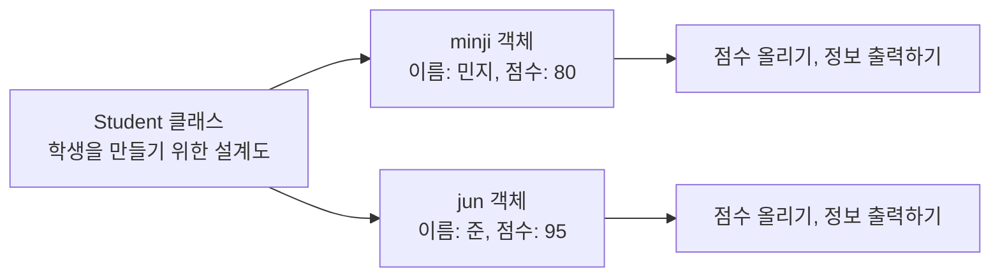
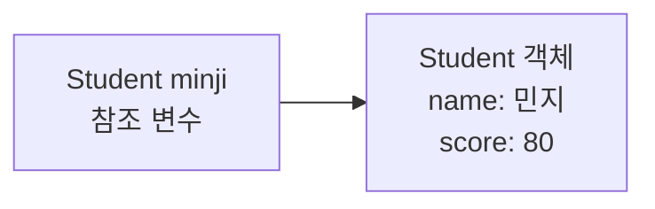
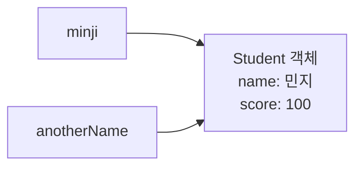

# 07_11 Java 객체지향 첫걸음: 클래스, 객체, 메서드, 생성자

- 학습 목표: `class`, 객체(object), 인스턴스(instance), 필드(field), 메서드(method), 생성자(constructor)가 서로 어떤 관계인지 이해하고, 필요한 상태를 가진 객체를 직접 만든다.
- 핵심 키워드: 클래스, 객체, 인스턴스, `new`, 필드, 메서드, 매개변수, 인수, `return`, `void`, `this`, 생성자, 오버로딩, 참조 변수, `null`
- 중요도: 매우 높음. Java는 객체지향 언어이므로, 이후의 상속·인터페이스·예외 처리·컬렉션도 결국 클래스와 객체를 바탕으로 이해하게 된다.
- 참고 자료: 점프 투 자바 05-01 객체 지향 프로그래밍이란?, 05-02 클래스, 05-03 메서드 더 살펴보기, 05-04 값에 의한 호출과 객체에 의한 호출, 05-06 생성자

---

## 1. 들어가며

앞선 노트에서는 변수, 조건문, 반복문, 배열과 컬렉션을 배웠다. 이 도구들만으로도 프로그램은 만들 수 있다. 다만 프로그램이 커지면 서로 관련 있는 값과 기능이 여기저기 흩어진다.

예를 들어 학생 한 명을 표현하려면 이름, 학번, 점수라는 값이 필요하다. 점수를 올리거나 현재 상태를 출력하는 기능도 필요할 수 있다.

```java
String studentName = "민지";
int studentNumber = 101;
int score = 80;
```

학생이 두 명, 세 명으로 늘어나면 `studentName2`, `studentScore2`처럼 변수 이름을 계속 만들게 된다. 누구의 이름과 점수가 한 묶음인지 눈으로 관리해야 하므로 실수하기 쉽다.

**클래스(class)**는 이렇게 관련 있는 데이터와 기능을 하나의 설계로 묶는 방법이다. 그리고 그 설계로 실제로 만든 각각의 대상을 **객체(object)**라고 한다.



설계도는 하나지만, 실제 학생 객체는 원하는 만큼 만들 수 있다. 중요한 점은 `minji`와 `jun`이 같은 `Student` 설계도에서 만들어졌어도 **각자 자기 값을 따로 가진다**는 것이다.

이번 노트에서는 객체지향의 전체 기능을 한꺼번에 외우지 않는다. 먼저 다음 질문에 답할 수 있으면 충분하다.

1. 클래스와 객체는 무엇이 다른가?
2. 객체 안에 값을 저장하는 필드는 무엇인가?
3. 객체가 하는 일을 적는 메서드는 무엇인가?
4. 객체를 처음 만들 때 필요한 값을 받는 생성자는 왜 필요한가?

## 2. 핵심 개념 정리

| 용어 | 쉬운 비유 | Java에서의 뜻 |
|---|---|---|
| 클래스 | 쿠키 틀, 설계도 | 어떤 값과 기능을 가질지 정한 코드 |
| 객체 | 틀로 찍어 낸 쿠키 한 개 | `new`로 실제 생성한 대상 |
| 인스턴스 | 특정 틀에서 나온 결과물 | 보통 객체와 거의 같은 뜻으로 사용 |
| 필드 | 객체 안의 메모 칸 | 객체가 기억하는 상태, 예: 이름·점수 |
| 메서드 | 객체가 할 수 있는 행동 | 객체 안에 만든 함수, 예: 점수 올리기 |
| 생성자 | 만들 때 실행되는 준비 과정 | `new` 직후 실행되어 처음 상태를 정함 |
| 참조 변수 | 객체의 위치를 적은 메모 | 객체 자체가 아니라 객체를 가리키는 변수 |

아래 코드에는 이 개념이 한 번에 들어 있다.

```java
class Student {
    String name;  // 필드
    int score;    // 필드

    void introduce() {  // 메서드
        System.out.println(name + "의 점수는 " + score + "점입니다.");
    }
}

public class StudentExample {
    public static void main(String[] args) {
        Student minji = new Student();  // Student 객체 생성
        minji.name = "민지";
        minji.score = 80;
        minji.introduce();
    }
}
```

출력:

```text
민지의 점수는 80점입니다.
```

`Student`는 설계도이고, `minji`는 그 설계도로 만든 실제 객체다. `minji.name`처럼 점(`.`)을 사용하면 객체 안의 필드나 메서드에 접근할 수 있다.

## 3. 본문 정리

### 3.1 클래스는 "무엇을 기억하고 무엇을 할 수 있는가"를 정한다

클래스를 만들 때는 먼저 대상을 한 문장으로 말해 본다.

> "학생은 이름과 점수를 기억하고, 점수를 올리거나 자기 정보를 출력할 수 있다."

이 문장에서 **기억하는 것**은 필드로, **할 수 있는 것**은 메서드로 옮길 수 있다.

```java
class Student {
    String name;
    int score;

    void addScore(int amount) {
        score += amount;
    }

    void printInfo() {
        System.out.println(name + ": " + score + "점");
    }
}
```

클래스를 선언했다고 해서 학생이 자동으로 생기지는 않는다. 이 시점에는 `Student`라는 **설계 규칙**만 존재한다.

### 3.2 `new`는 설계도를 바탕으로 실제 객체를 만든다

객체를 만들 때는 `new`를 사용한다.

```java
Student minji = new Student();
```

이 한 줄은 다음처럼 읽는다.

1. `new Student()`가 메모리에 `Student` 객체 하나를 만든다.
2. `minji`라는 변수는 그 객체를 가리키게 된다.

`minji` 안에 학생 전체가 통째로 들어 있다고 생각하기보다는, "민지 학생 객체를 찾아갈 수 있는 표지판"이 들어 있다고 생각하면 좋다. 그래서 `Student minji`는 **참조 변수(reference variable)**다.



객체를 만든 뒤에는 점(`.`)으로 필드에 값을 넣거나 메서드를 호출한다.

```java
minji.name = "민지";
minji.score = 80;
minji.addScore(5);
minji.printInfo();  // 민지: 85점
```

### 3.3 같은 클래스에서 만든 객체라도 필드 값은 서로 독립적이다

하나의 클래스로 객체를 여러 개 만들 수 있다.

```java
Student minji = new Student();
minji.name = "민지";
minji.score = 80;

Student jun = new Student();
jun.name = "준";
jun.score = 95;

minji.addScore(10);

System.out.println(minji.score); // 90
System.out.println(jun.score);   // 95
```

`minji.addScore(10)`은 `minji` 객체의 `score`만 바꾼다. `jun` 객체의 점수까지 함께 바뀌지 않는다. 이 독립성 덕분에 같은 설계도로 학생, 게시글, 상품, 주문 등 여러 대상을 안전하게 표현할 수 있다.

### 3.4 필드의 기본값과 지역 변수의 차이를 구분한다

클래스 몸통에 선언한 변수는 필드다. 객체가 만들어질 때 Java가 기본값을 넣어 준다.

```java
class Student {
    String name;  // 기본값: null
    int score;    // 기본값: 0
    boolean active; // 기본값: false
}
```

| 필드 자료형 | 기본값 |
|---|---|
| 정수형 (`int`, `long` 등) | `0` |
| 실수형 (`double` 등) | `0.0` |
| `boolean` | `false` |
| `char` | `\u0000` |
| 참조형 (`String`, 배열, 객체 등) | `null` |

반면 메서드 안에서 선언한 **지역 변수(local variable)**는 값을 넣기 전에 사용할 수 없다.

```java
void printScore() {
    int bonus;
    // System.out.println(bonus); // 컴파일 오류: 아직 값이 없음
}
```

필드는 "객체가 태어날 때부터 가진 메모 칸"이고, 지역 변수는 "메서드가 실행되는 동안 잠시 쓰는 메모 칸"이라고 구분하면 된다.

### 3.5 `null`은 "아직 가리키는 객체가 없다"는 뜻이다

참조 변수에는 객체의 위치를 저장한다. 아직 객체를 만들지 않았다면 `null`을 넣을 수 있다.

```java
Student student = null;
```

이 상태에서 필드나 메서드에 접근하면 안 된다.

```java
// student.printInfo(); // NullPointerException 발생
```

`null`은 빈 학생 객체가 아니다. **연결할 객체 자체가 없다는 표시**다. 객체가 필요하면 `new`로 먼저 만들어야 한다.

```java
student = new Student();
student.name = "민지";
```

### 3.6 메서드는 객체의 행동을 이름 붙여 묶는다

메서드는 클래스 안에 만드는 함수다. 자주 쓰는 동작을 메서드로 만들면 같은 코드를 반복하지 않고, 이름만 보고도 의도를 알 수 있다.

```java
class Calculator {
    int add(int left, int right) {
        return left + right;
    }
}
```

메서드의 기본 모양은 다음과 같다.

```java
반환자료형 메서드이름(매개변수들) {
    // 실행할 코드
    return 반환값;
}
```

`add` 메서드를 나누어 읽어 보자.

```java
int add(int left, int right) {
    return left + right;
}
```

| 부분 | 뜻 |
|---|---|
| `int` | 메서드가 끝나고 돌려줄 값의 자료형 |
| `add` | 메서드 이름 |
| `int left, int right` | 메서드가 받을 입력값을 담는 매개변수 |
| `return left + right;` | 계산 결과를 호출한 곳으로 돌려줌 |

호출할 때는 객체 뒤에 점을 붙인다.

```java
Calculator calculator = new Calculator();
int result = calculator.add(3, 4);
System.out.println(result); // 7
```

### 3.7 매개변수와 인수는 위치가 다르다

이 두 단어는 자주 섞이지만, 어디에 쓰였는지만 보면 된다.

```java
int add(int left, int right) { // left, right: 매개변수(parameter)
    return left + right;
}

int result = calculator.add(3, 4); // 3, 4: 인수(argument)
```

- **매개변수**: 메서드를 정의할 때, 입력을 받을 이름표
- **인수**: 메서드를 호출할 때, 실제로 전달하는 값

택배에 비유하면 매개변수는 "받는 칸"이고, 인수는 실제로 칸에 넣어 보내는 물건이다.

### 3.8 `return`이 있는 메서드와 `void` 메서드를 구분한다

메서드는 결과값을 돌려줄 수도 있고, 어떤 행동만 하고 끝날 수도 있다.

```java
class Lamp {
    boolean isOn;

    boolean isOn() {
        return isOn;
    }

    void turnOn() {
        isOn = true;
    }
}
```

| 종류 | 예시 | 호출 결과 |
|---|---|---|
| 반환값 있음 | `boolean isOn()` | `true` 또는 `false`를 돌려줌 |
| 반환값 없음 | `void turnOn()` | 상태만 바꾸고 값을 돌려주지 않음 |

`System.out.println()`으로 화면에 글자를 출력했다고 해서 그 메서드가 값을 반환한 것은 아니다.

```java
void sayHello() {
    System.out.println("안녕하세요");
}
```

위 메서드는 화면에 글자를 **출력**하지만, 호출한 쪽에 저장할 결과값은 주지 않는다. 따라서 반환 자료형이 `void`다.

### 3.9 `this`는 "지금 이 메서드를 실행 중인 객체 자신"이다

필드 이름과 매개변수 이름이 같을 때 `this`를 사용하면 어떤 변수를 뜻하는지 분명해진다.

```java
class Student {
    String name;

    void setName(String name) {
        this.name = name;
    }
}
```

`this.name`은 객체가 가진 필드이고, 오른쪽 `name`은 메서드 안으로 들어온 매개변수다.

```text
this.name = name;
필드      매개변수
```

예를 들어 `minji.setName("민지")`를 호출했다면, `this`는 `minji` 객체를 뜻한다. 따라서 이 코드는 사실상 `minji.name = "민지";`와 같은 결과를 만든다.

### 3.10 생성자는 객체가 만들어질 때 필요한 값을 준비한다

객체를 만들고 난 뒤 필드에 값을 하나씩 넣는 방식은 가능하다.

```java
Student minji = new Student();
minji.name = "민지";
minji.score = 80;
```

하지만 이름처럼 꼭 필요한 값이 비어 있는 학생 객체가 잠깐 만들어질 수 있다. 생성자를 사용하면 객체를 만드는 순간 필요한 값을 받도록 정할 수 있다.

```java
class Student {
    String name;
    int score;

    Student(String name, int score) {
        this.name = name;
        this.score = score;
    }
}
```

생성자는 다음 규칙을 가진다.

1. 이름이 클래스 이름과 같다.
2. 반환 자료형을 적지 않는다. `void`도 쓰지 않는다.
3. `new 클래스이름(...)`을 실행할 때 자동으로 호출된다.

```java
Student minji = new Student("민지", 80);
```

이제 `Student`를 만들려면 이름과 점수를 함께 전달해야 한다. 객체가 태어난 순간부터 최소한의 정보를 갖게 되는 것이다.

### 3.11 생성자를 하나라도 직접 만들면 기본 생성자는 자동으로 사라진다

클래스에 생성자를 전혀 쓰지 않으면 Java가 매개변수 없는 기본 생성자를 자동으로 준비한다. 그래서 아래 코드는 가능하다.

```java
class Student {
}

Student student = new Student();
```

그러나 `Student(String name)`처럼 생성자를 하나라도 직접 선언하면, Java는 매개변수 없는 생성자를 자동으로 추가하지 않는다.

```java
class Student {
    String name;

    Student(String name) {
        this.name = name;
    }
}

Student minji = new Student("민지"); // 가능
// Student empty = new Student();     // 컴파일 오류
```

`new Student()`도 허용하고 싶다면 매개변수 없는 생성자를 직접 작성한다.

```java
Student() {
    this.name = "이름 없음";
}
```

### 3.12 생성자도 오버로딩할 수 있다

**오버로딩(overloading)**은 같은 이름을 쓰되, 매개변수 목록을 다르게 해서 여러 형태를 만드는 방법이다. 생성자도 오버로딩할 수 있다.

```java
class Student {
    String name;
    int score;

    Student(String name) {
        this.name = name;
        this.score = 0;
    }

    Student(String name, int score) {
        this.name = name;
        this.score = score;
    }
}
```

```java
Student firstStudent = new Student("민지");
Student scoredStudent = new Student("준", 95);
```

둘 다 `Student`를 만들지만, 전달한 인수의 개수가 다르므로 Java가 알맞은 생성자를 구분한다.

주의할 점은 **반환 자료형만 다르게 해서는 오버로딩이 되지 않는다**는 것이다. 메서드나 생성자를 고르는 기준은 이름과 매개변수 목록이다.

### 3.13 두 참조 변수가 같은 객체를 가리킬 수도 있다

아래 코드는 학생 객체를 두 명 만든 것이 아니다.

```java
Student minji = new Student("민지", 80);
Student anotherName = minji;

anotherName.score = 100;

System.out.println(minji.score); // 100
```

`anotherName = minji`는 객체를 복사한 것이 아니라, 같은 객체를 가리키는 표지판 하나를 더 만든 것이다.



새로운 별도 객체가 필요하면 다시 `new`를 사용해야 한다.

```java
Student anotherStudent = new Student("민지", 80);
```

### 3.14 Java의 메서드 인수 전달: 모든 것은 값이 복사된다

처음에는 "객체는 참조로 전달된다"라고 간단히 말하기도 한다. 하지만 Java는 정확히 말하면 **모든 인수를 값으로 전달(pass by value)**한다. 객체를 전달할 때는 객체 자체가 아니라 "그 객체를 가리키는 참조값"이 복사되어 전달된다.

그래서 메서드 안에서 객체의 필드를 바꾸면 같은 객체를 보고 있으므로 바뀐 내용이 밖에서도 보인다.

```java
class ScoreService {
    void addTen(Student student) {
        student.score += 10;
    }
}

Student minji = new Student("민지", 80);
ScoreService service = new ScoreService();

service.addTen(minji);

System.out.println(minji.score); // 90
```

하지만 메서드 안에서 매개변수에게 새 객체를 대입해도, 호출한 쪽의 변수까지 새 객체를 가리키게 되지는 않는다.

```java
class ScoreService {
    void replaceStudent(Student student) {
        student = new Student("새 학생", 0);
    }
}

Student minji = new Student("민지", 80);
ScoreService service = new ScoreService();

service.replaceStudent(minji);
System.out.println(minji.name); // 민지
```

`replaceStudent` 안의 `student`만 새 객체를 가리키게 된다. `minji`에 들어 있던 참조값은 바뀌지 않는다. 이 차이를 알면 "왜 메서드에서 값은 바뀌었는데 변수 자체는 안 바뀌지?" 같은 혼란을 줄일 수 있다.

### 3.15 한 파일로 연결해 보기

다음 예제는 지금까지의 핵심을 모두 넣은 작은 학습 기록 객체다. 파일 이름은 public 클래스 이름과 같은 `StudyRecordExample.java`로 저장하면 된다.

```java
class StudyRecord {
    String subject;
    int minutes;

    StudyRecord(String subject) {
        this.subject = subject;
        this.minutes = 0;
    }

    StudyRecord(String subject, int minutes) {
        this.subject = subject;
        this.minutes = minutes;
    }

    void addMinutes(int amount) {
        if (amount <= 0) {
            return;
        }

        this.minutes += amount;
    }

    String summary() {
        return subject + " 공부 시간: " + minutes + "분";
    }
}

public class StudyRecordExample {
    public static void main(String[] args) {
        StudyRecord javaStudy = new StudyRecord("Java", 40);
        StudyRecord algorithmStudy = new StudyRecord("알고리즘");

        javaStudy.addMinutes(20);
        algorithmStudy.addMinutes(30);
        algorithmStudy.addMinutes(-10); // 조건에 맞지 않아 아무 일도 하지 않음

        System.out.println(javaStudy.summary());
        System.out.println(algorithmStudy.summary());
    }
}
```

출력:

```text
Java 공부 시간: 60분
알고리즘 공부 시간: 30분
```

이 코드에서 눈여겨볼 흐름은 다음과 같다.

1. `StudyRecord` 클래스가 공부 기록의 공통 설계를 정한다.
2. `new StudyRecord(...)`가 Java와 알고리즘이라는 서로 다른 객체를 만든다.
3. 각 객체는 자기만의 `subject`, `minutes` 필드를 가진다.
4. `addMinutes`는 객체 자신의 시간을 바꾼다.
5. `summary`는 문자열을 만들어 **반환**하고, `main`은 그 값을 출력한다.

## 4. 적용 관점에서 다시 보기

### 4.1 클래스를 만들기 전에 대상의 책임을 문장으로 적는다

처음부터 클래스 문법을 쓰려고 하면 필드와 메서드가 뒤섞이기 쉽다. 먼저 아래처럼 자연어로 적어 본다.

> "장바구니 항목은 상품 이름과 수량을 기억한다. 수량을 늘리거나, 현재 금액을 계산할 수 있다."

그러면 다음처럼 옮길 수 있다.

| 자연어에서 찾은 요소 | 클래스 코드로 옮길 자리 |
|---|---|
| 상품 이름, 수량, 가격을 기억한다 | 필드 |
| 수량을 늘린다 | `addQuantity` 메서드 |
| 현재 금액을 계산한다 | `getTotalPrice` 메서드 |
| 만들 때 상품 이름과 가격이 필요하다 | 생성자 |

클래스는 "현실의 모든 것"을 그대로 복사하는 도구가 아니다. 프로그램에서 필요한 정보와 행동만 골라 담는 **작은 모델**이다.

### 4.2 객체마다 따로 관리해야 하는 값은 필드에 둔다

아래처럼 학생마다 달라지는 이름과 점수는 필드에 둔다.

```java
class Student {
    String name;
    int score;
}
```

반대로 메서드가 계산하는 중 잠깐만 필요한 값은 지역 변수로 둔다.

```java
int getAverage(int total, int count) {
    int average = total / count;
    return average;
}
```

`average`는 계산이 끝난 뒤에도 학생 객체가 기억할 정보가 아니라서 필드일 필요가 없다.

### 4.3 값이 꼭 필요하다면 생성자로 강제한다

상품 이름 없이 장바구니 항목을 만들면 나중에 문제가 생길 수 있다. 이때 생성자는 "처음 만들 때 이 정보는 꼭 주세요"라는 약속이 된다.

```java
class CartItem {
    String productName;
    int price;

    CartItem(String productName, int price) {
        this.productName = productName;
        this.price = price;
    }
}
```

다만 모든 필드를 무조건 생성자에서 받아야 하는 것은 아니다. 처음에는 정해지지 않는 값, 예를 들어 장바구니 수량은 `0`으로 시작하게 할 수도 있다.

```java
class CartItem {
    String productName;
    int price;
    int quantity;

    CartItem(String productName, int price) {
        this.productName = productName;
        this.price = price;
        this.quantity = 0;
    }
}
```

### 4.4 다음 학습으로 이어지는 지점

이번에는 클래스 하나에서 객체를 만드는 법을 배웠다. 다음에 배우는 개념은 이 설계를 더 안전하고 유연하게 만드는 방법이다.

| 다음 개념 | 이번 노트와의 연결 |
|---|---|
| 접근 제어자 | 필드를 아무 곳에서나 바꾸지 않도록 보호한다. |
| 상속 | 공통되는 클래스를 바탕으로 더 구체적인 클래스를 만든다. |
| 인터페이스 | "무엇을 할 수 있어야 하는가"라는 약속을 정한다. |
| 다형성 | 같은 약속을 지키는 여러 객체를 한 방식으로 다룬다. |
| 컬렉션 | `ArrayList<Student>`처럼 객체를 여러 개 모아 관리한다. |

## 5. 헷갈리기 쉬운 부분

### 5.1 클래스와 객체는 같은 것이 아니다

```java
class Student {
}
```

위 코드는 `Student`라는 클래스를 정의했을 뿐, 학생 객체는 아직 없다.

```java
Student minji = new Student();
```

`new Student()`까지 실행해야 실제 객체가 하나 만들어진다.

### 5.2 `Student minji;`만 쓰면 객체가 만들어진 것이 아니다

```java
Student minji;
```

이 코드는 참조 변수를 선언한 것이다. `new`가 없으므로 연결할 `Student` 객체는 아직 만들어지지 않았다.

```java
Student minji = new Student();
```

위처럼 작성해야 선언과 객체 생성을 함께 한다.

### 5.3 `this.name = name`은 같은 값 두 번을 넣는 코드가 아니다

왼쪽과 오른쪽 `name`은 위치가 달라 뜻도 다르다.

```java
this.name = name;
```

| 부분 | 뜻 |
|---|---|
| `this.name` | 현재 객체의 필드 |
| `name` | 생성자 또는 메서드로 들어온 매개변수 |

### 5.4 `void` 메서드는 출력할 수 있어도 반환값은 없다

```java
void printInfo() {
    System.out.println("정보를 출력합니다.");
}
```

화면에 문장이 보이는 일과 호출한 곳에 값이 돌아오는 일은 다르다. 위 메서드는 값을 반환하지 않으므로 다음처럼 쓸 수 없다.

```java
// String result = printInfo(); // 컴파일 오류
```

### 5.5 객체를 대입하면 객체가 복사되는 것이 아니다

```java
Student first = new Student("민지", 80);
Student second = first;
```

이 코드는 객체가 두 개가 아니라 하나다. `first`, `second`가 같은 객체를 함께 가리킨다. 서로 완전히 분리된 객체가 필요할 때는 `new`로 새 객체를 만들어야 한다.

### 5.6 생성자 이름에 `void`를 붙이면 생성자가 아니다

```java
class Student {
    void Student(String name) {
        // 이것은 생성자가 아니라 이름이 Student인 일반 메서드다.
    }
}
```

생성자는 반환 자료형을 쓰지 않는다.

```java
class Student {
    Student(String name) {
        // 올바른 생성자
    }
}
```

## 6. 요약

클래스는 관련 있는 데이터와 기능을 묶어 둔 설계도이고, 객체는 그 설계도로 만든 실제 대상이다. `new`를 실행할 때 객체가 만들어지며, 변수는 그 객체를 가리키는 참조를 저장한다.

객체가 기억하는 값은 필드로, 객체가 하는 일은 메서드로 작성한다. 같은 클래스에서 만든 객체라도 필드는 서로 독립적이다. 메서드의 입력을 받을 때는 매개변수, 호출할 때 넣는 실제 값은 인수라고 한다. `return`은 결과를 돌려주고, `void`는 반환값이 없다는 뜻이다.

생성자는 객체를 만들 때 자동으로 실행된다. 이름은 클래스 이름과 같고 반환 자료형이 없다. 꼭 필요한 값을 생성자로 받으면 불완전한 객체가 만들어지는 일을 줄일 수 있다. `this`는 현재 메서드나 생성자를 실행 중인 객체 자신을 가리킨다.

마지막으로 Java는 모든 인수를 값으로 전달한다. 객체를 메서드에 넣으면 객체를 가리키는 참조값이 복사되므로, 그 참조를 통해 같은 객체의 필드를 바꾸는 일은 가능하지만 호출한 쪽의 참조 변수 자체를 다른 객체로 바꾸지는 못한다.

## 7. 복습 문제와 체크리스트

1. `Student` 클래스와 `Student minji = new Student();`에서 각각 클래스와 객체는 무엇인가?
2. 학생마다 달라지는 이름과 점수는 필드와 지역 변수 중 어디에 두는 것이 적절한가?
3. `int add(int a, int b)`에서 반환 자료형, 메서드 이름, 매개변수는 각각 무엇인가?
4. `System.out.println()`을 실행한 메서드는 반드시 반환값이 있는가?
5. `this.name = name;`의 왼쪽 `name`과 오른쪽 `name`은 무엇이 다른가?
6. 생성자를 직접 하나 만들었는데 `new Student()`에서 오류가 나는 이유는 무엇인가?
7. `Student second = first;`는 학생 객체를 몇 개 만드는가?
8. 메서드 안에서 객체의 필드를 바꾸면 호출한 쪽에서도 변화가 보이는 이유를 "참조값의 복사"라는 말로 설명해 본다.

직접 해 볼 미니 과제:

1. `Book` 클래스를 만들고 `title`, `author`, `currentPage` 필드를 선언한다.
2. 제목과 저자를 받는 생성자를 만든다. `currentPage`는 `0`으로 시작하게 한다.
3. 페이지를 한 장 넘기는 `nextPage()` 메서드를 만든다.
4. `getInfo()` 메서드가 `"제목 - 저자 (현재 n쪽)"` 문자열을 반환하게 한다.
5. 책 객체를 두 개 만들어 각각 독립적으로 페이지가 바뀌는지 확인한다.

## 참고 링크

- [점프 투 자바 - 05장 객체 지향 프로그래밍](https://wikidocs.net/218)
- [점프 투 자바 - 05-02 클래스](https://wikidocs.net/214)
- [점프 투 자바 - 05-03 메서드 더 살펴보기](https://wikidocs.net/225)
- [점프 투 자바 - 05-06 생성자](https://wikidocs.net/281)
- [Oracle Java Tutorials - Passing Information to a Method or a Constructor](https://docs.oracle.com/javase/tutorial/java/javaOO/arguments.html)
