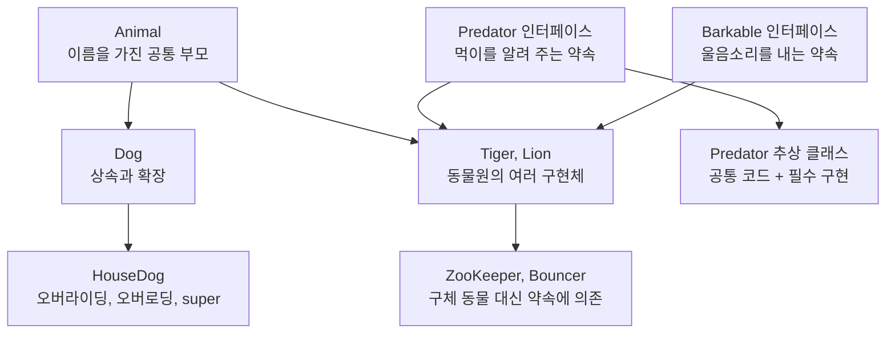
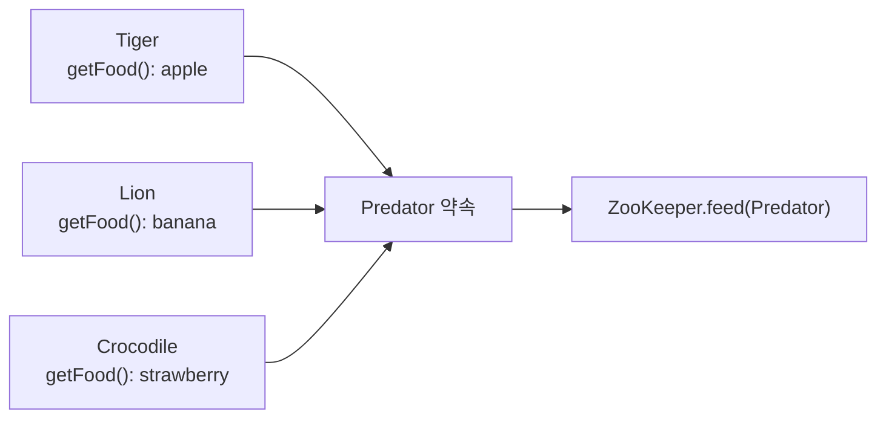

# 07_12 Java 객체지향 확장: 상속, 인터페이스, 다형성, 추상 클래스

- 학습 목표: 점프 투 자바 05장의 연속 예제인 `Animal → Dog → HouseDog → Predator → ZooKeeper` 흐름을 따라가며 상속, 인터페이스, 다형성, 추상 클래스가 왜 필요한지 이해한다.
- 핵심 키워드: `extends`, IS-A, 오버라이딩, 오버로딩, `super`, 단일 상속, `implements`, 인터페이스, `instanceof`, 다형성, `abstract`
- 중요도: 매우 높음. 이 개념들은 "비슷한 객체가 늘어날 때 코드를 어떻게 고칠까?"라는 실제 문제를 해결하는 방법이다.
- 원문 범위: 점프 투 자바 05-05 상속, 05-07 인터페이스, 05-08 다형성, 05-09 추상 클래스
- 연결 노트: 생성자는 [07_11 Java 객체지향 첫걸음](../07_11_Java_OOP_Classes_Objects/07_11_Java_OOP_Classes_Objects.md)에서 먼저 정리했다.

---

## 1. 들어가며: 이번 노트의 한 가지 이야기

이번 내용은 서로 떨어진 문법 목록이 아니다. 하나의 동물원 예제가 조금씩 커지면서 "왜 상속이 필요하고, 왜 인터페이스가 필요하며, 다형성이 왜 편리한가"를 보여 준다.

처음에는 동물에게 이름을 붙이는 기능이 필요하다. `Dog`는 동물이므로 `Animal`의 기능을 물려받는다. 이어서 호랑이, 사자가 늘어나고 사육사(`ZooKeeper`)가 각 동물에게 먹이를 줘야 한다. 동물 종류가 늘어날 때마다 사육사 코드를 수정하지 않기 위해 `Predator` 인터페이스를 만든다. 마지막에는 울음소리 기능을 `Barkable` 인터페이스로 분리해, 긴 조건문을 없앤다.



이번 노트를 읽고 다음 말을 설명할 수 있으면 된다.

1. `Dog extends Animal`은 왜 가능한가?
2. `Animal animal = new Dog()`은 가능한데, `Dog dog = new Animal()`은 왜 불가능한가?
3. 동물이 추가될 때 `ZooKeeper`의 `feed` 메서드를 계속 늘리지 않으려면 왜 인터페이스가 필요한가?
4. `instanceof` 조건문이 길어지는 문제를 다형성은 어떻게 줄이는가?

## 2. 원문에서 선별한 학습 범위

점프 투 자바 05장은 객체지향 예제를 앞에서 뒤로 연결해서 설명한다. 이 TIL에서는 이미 정리된 생성자 부분은 07_11로 연결하고, 나머지 흐름을 다음 순서로 정리한다.

| 원문 | 이번 노트에서 다루는 핵심 | 이유 |
|---|---|---|
| 05-05 상속 | `extends`, IS-A, 오버라이딩·오버로딩, `super`, 단일 상속 | 부모와 자식 클래스의 관계를 만든다. |
| 05-06 생성자 | 07_11 노트로 연결 | 생성자 자체는 이미 별도 노트에서 자세히 다뤘다. |
| 05-07 인터페이스 | `Predator`, `ZooKeeper`, `getFood()` | 구체 클래스 수가 늘어나는 문제를 해결한다. |
| 05-08 다형성 | `Barkable`, 타입별 사용 범위 | 조건 분기 대신 객체에게 행동을 맡긴다. |
| 05-09 추상 클래스 | 추상 `Predator` | 공통 구현과 필수 구현을 함께 둔다. |

## 3. 상속: 공통 기능을 물려받고 필요한 만큼 확장하기

### 3.1 `extends`는 부모 클래스의 기능을 이어받는 문법이다

먼저 모든 동물이 공통으로 가질 이름과 이름을 설정하는 기능을 `Animal`에 둔다.

```java
class Animal {
    String name;

    void setName(String name) {
        this.name = name;
    }
}
```

개도 동물이므로 `Dog`가 `Animal`을 상속하게 만들 수 있다.

```java
class Dog extends Animal {
}
```

`Dog` 안에는 `name`과 `setName()`을 직접 쓰지 않았다. 그래도 `Dog` 객체는 부모인 `Animal`의 멤버를 물려받으므로 사용할 수 있다.

```java
Dog dog = new Dog();
dog.setName("poppy");

System.out.println(dog.name); // poppy
```

상속의 기본 모양은 다음과 같다.

```java
class 자식클래스 extends 부모클래스 {
    // 자식에게만 필요한 필드와 메서드를 추가한다.
}
```

### 3.2 자식 클래스는 부모 기능에 자기 기능을 더한다

개는 이름을 가질 뿐 아니라 잠을 자는 행동도 할 수 있다고 해 보자. 부모에 없는 개만의 기능을 `Dog`에 추가한다.

```java
class Dog extends Animal {
    void sleep() {
        System.out.println(this.name + " zzz");
    }
}
```

```java
Dog dog = new Dog();
dog.setName("poppy"); // Animal에서 받은 메서드
dog.sleep();           // Dog가 추가한 메서드
```

출력:

```text
poppy zzz
```

상속은 부모 코드를 그대로 복사해서 붙여 넣는 일이 아니다. 자식 객체가 부모의 공통 기능을 **자기 기능의 일부로 갖게 하는 관계**다.

### 3.3 IS-A 관계로 상속이 자연스러운지 확인한다

`Dog extends Animal`은 아래 문장이 자연스럽기 때문에 좋은 상속 관계다.

```text
Dog is an Animal.
개는 동물이다.
```

이처럼 "A는 B다"라고 말할 수 있는 관계를 **IS-A 관계**라고 한다.

```text
Tiger is an Animal.  // 자연스럽다: 상속 후보
Lion is an Animal.   // 자연스럽다: 상속 후보
Car is an Animal.    // 어색하다: 상속 관계가 아니다
```

단순히 두 클래스에 비슷한 코드가 있다고 해서 상속하는 것은 좋지 않다. "자식은 부모의 한 종류인가?"를 먼저 확인해야 한다.

### 3.4 자식 객체는 부모 타입 변수에 담을 수 있다

`Dog`는 `Animal`의 한 종류이므로 `Dog` 객체를 `Animal` 타입으로 사용할 수 있다.

```java
Animal animal = new Dog();
```

이 코드는 가능하다. `Dog` 객체에는 `Animal`의 기능이 모두 있기 때문이다.

```java
Animal animal = new Dog();
animal.setName("poppy"); // 가능: Animal에 선언된 메서드
```

하지만 `Dog`에만 있는 `sleep()`은 `Animal` 타입 변수로 바로 호출할 수 없다.

```java
Animal animal = new Dog();
// animal.sleep(); // 컴파일 오류: Animal 타입에는 sleep()이 없음
```

여기서는 두 가지 타입을 분리해서 생각해야 한다.

| 구분 | 예시 | 의미 |
|---|---|---|
| 변수의 선언 타입 | `Animal animal` | 이 변수로 어떤 기능을 사용할 수 있는지 결정한다. |
| 실제 객체의 타입 | `new Dog()` | 실제로 어떤 객체가 만들어졌는지 결정한다. |

반대 방향은 성립하지 않는다.

```java
// Dog dog = new Animal(); // 컴파일 오류
```

모든 개는 동물이지만, 모든 동물이 개인 것은 아니다. `Animal`로 만든 객체가 개라고 보장할 수 없기 때문이다.

### 3.5 모든 클래스는 `Object`를 부모로 가진다

Java에서 직접 `extends Object`를 쓰지 않아도, 모든 클래스는 기본적으로 `Object` 클래스를 상속한다.

```java
class Animal {
}

// 위 코드는 의미상 다음과 같다.
class AnotherAnimal extends Object {
}
```

따라서 모든 Java 객체는 `Object` 타입으로도 다룰 수 있다.

```java
Object animal = new Animal();
Object dog = new Dog();
```

지금은 `Object`의 메서드를 외울 필요가 없다. "Java의 모든 객체에는 가장 위쪽 공통 부모가 있다"는 큰 그림만 알아 두면 충분하다.

### 3.6 오버라이딩: 부모의 동작을 자식 상황에 맞게 다시 정의한다

`Dog`를 상속한 `HouseDog`를 생각해 보자. 일반 개의 잠자는 메시지는 `"happy zzz"`지만, 집에서 키우는 개는 `"happy zzz in house"`라고 표시하고 싶다.

```java
class Dog extends Animal {
    void sleep() {
        System.out.println(this.name + " zzz");
    }
}

class HouseDog extends Dog {
    @Override
    void sleep() {
        System.out.println(this.name + " zzz in house");
    }
}
```

부모 `Dog`에 있던 `sleep()`과 **같은 이름, 같은 매개변수, 같은 반환 형태**의 메서드를 자식 `HouseDog`가 다시 구현했다. 이를 **메서드 오버라이딩(overriding)**이라고 한다.

```java
HouseDog houseDog = new HouseDog();
houseDog.setName("happy");
houseDog.sleep(); // happy zzz in house
```

`@Override`는 컴파일러에게 "이 메서드는 부모 메서드를 재정의하려는 것입니다"라고 알려 주는 표시다. 이름을 잘못 쓰거나 매개변수 형태가 달라졌다면 컴파일러가 오류를 알려 주므로 꼭 붙이는 습관이 좋다.

### 3.7 오버로딩: 같은 이름에 다른 입력 형태를 추가한다

집에서 키우는 개가 몇 시간 잤는지도 출력하고 싶다면 `sleep(int hour)`를 **추가**할 수 있다.

```java
class HouseDog extends Dog {
    @Override
    void sleep() {
        System.out.println(this.name + " zzz in house");
    }

    void sleep(int hour) {
        System.out.println(this.name + " zzz in house for " + hour + " hours");
    }
}
```

```java
houseDog.sleep();    // 매개변수 없음
houseDog.sleep(3);   // int 매개변수 하나
```

같은 이름 `sleep`을 쓰되, 매개변수 목록이 달라서 Java가 어떤 메서드인지 구분할 수 있다. 이것이 **메서드 오버로딩(overloading)**이다.

| 구분 | 오버라이딩 | 오버로딩 |
|---|---|---|
| 관계 | 부모와 자식 클래스 사이 | 같은 클래스 안에서도 가능 |
| 메서드 이름 | 같다 | 같다 |
| 매개변수 목록 | 부모와 같다 | 반드시 다르다 |
| 하는 일 | 부모 동작을 새로 정의 | 같은 이름의 입력 방법을 늘림 |
| 예시 | `HouseDog.sleep()` | `sleep()`과 `sleep(int)` |

### 3.8 `super`는 부모 클래스의 멤버를 가리킨다

오버라이딩했더라도 부모의 메서드를 함께 실행하고 싶을 수 있다. 이때 `super`를 쓴다.

```java
class HouseDog extends Dog {
    void sleepTogether() {
        super.sleep(); // 부모 Dog의 sleep() 호출
        System.out.println("and " + this.name + " zzz in house");
    }
}
```

`this`가 현재 객체 자신을 가리킨다면, `super`는 현재 객체가 물려받은 **부모 쪽 기능**을 가리킨다.

생성자에서 `super(...)`를 쓰는 방법은 07_11 생성자 노트와 함께 이해하면 좋다. 자식 객체를 만들 때 부모 쪽의 초기화도 먼저 필요한 경우에 부모 생성자를 호출한다.

### 3.9 Java 클래스는 하나의 부모 클래스만 상속한다

Java의 클래스는 동시에 두 개 이상의 클래스를 상속할 수 없다.

```java
// class C extends A, B { } // 문법 오류
```

`A`, `B` 양쪽에 같은 이름의 메서드가 있을 때 어느 부모 메서드를 써야 하는지 애매해질 수 있기 때문이다. Java는 클래스의 다중 상속을 허용하지 않아 이 모호함을 피한다.

대신 "여러 역할을 지킨다"는 문제는 인터페이스를 여러 개 구현해서 해결할 수 있다. 이 내용은 뒤에서 다시 나온다.

## 4. 인터페이스: 구체적인 동물 대신 공통 약속을 받기

### 4.1 동물 종류마다 `feed`를 만들면 사육사 코드가 계속 커진다

동물원 사육사가 호랑이에게는 사과, 사자에게는 바나나를 준다고 해 보자. 처음에는 다음처럼 작성할 수 있다.

```java
class ZooKeeper {
    void feed(Tiger tiger) {
        System.out.println("feed apple");
    }

    void feed(Lion lion) {
        System.out.println("feed banana");
    }
}
```

이 코드는 동작한다. 또한 메서드 이름은 `feed`로 같지만 매개변수 타입이 다르므로 오버로딩이다.

문제는 `Crocodile`, `Leopard`처럼 새로운 육식동물 클래스가 늘어날 때마다 사육사의 `feed` 메서드도 계속 추가해야 한다는 점이다.

```text
동물 하나 추가
   -> ZooKeeper에 feed 메서드 하나 추가
   -> 동물이 많아질수록 사육사 클래스가 비대해짐
```

사육사가 정말 알아야 하는 것은 "이 동물이 호랑이인가, 사자인가"가 아니다. **먹이를 알려 줄 수 있는 육식동물인가**이다.

### 4.2 `Predator` 인터페이스로 공통 약속을 만든다

먼저 "육식동물이라면 먹이를 알려 줄 수 있다"는 약속을 인터페이스로 표현한다.

```java
interface Predator {
    String getFood();
}
```

인터페이스는 `class`가 아니라 `interface` 키워드로 선언한다. `getFood()`에는 메서드 몸통이 없다. 인터페이스는 "어떻게 할지"보다 "무엇을 제공해야 하는지"를 먼저 정하는 규칙이기 때문이다.

호랑이와 사자가 이 약속을 구현하도록 `implements`를 사용한다.

```java
class Tiger extends Animal implements Predator {
    @Override
    public String getFood() {
        return "apple";
    }
}

class Lion extends Animal implements Predator {
    @Override
    public String getFood() {
        return "banana";
    }
}
```

`Tiger`, `Lion`이 `Predator`를 구현했다면 `getFood()`를 반드시 구현해야 한다. 구현하지 않으면 컴파일 오류가 난다. 인터페이스의 메서드를 구현할 때는 `public`으로 작성한다.

### 4.3 `ZooKeeper`는 동물 이름 대신 `Predator` 약속을 받는다

이제 사육사의 메서드 매개변수를 구체 클래스가 아니라 인터페이스로 바꾼다.

```java
class ZooKeeper {
    void feed(Predator predator) {
        System.out.println("feed " + predator.getFood());
    }
}
```

```java
ZooKeeper zooKeeper = new ZooKeeper();

zooKeeper.feed(new Tiger()); // feed apple
zooKeeper.feed(new Lion());  // feed banana
```

사육사는 `Tiger`와 `Lion`의 구체적인 이름을 알 필요가 없다. `Predator`라는 약속을 지키는 객체라면 모두 `feed`에 전달할 수 있다.



나중에 `Crocodile`을 추가해도 `Predator`를 구현하면 된다. `ZooKeeper`의 `feed` 메서드를 새로 만들 필요는 없다.

```java
class Crocodile extends Animal implements Predator {
    @Override
    public String getFood() {
        return "strawberry";
    }
}
```

### 4.4 인터페이스가 필요한 핵심 이유: 호출하는 코드를 독립시킨다

`ZooKeeper`가 `Tiger`, `Lion` 같은 구체 클래스에 직접 의존하면, 새 동물이 생길 때 사육사 코드도 바뀐다. 반면 `Predator`에 의존하면 사육사는 약속만 알면 된다.

| 사육사가 받는 타입 | 새 동물 추가 시 사육사 수정 |
|---|---|
| `Tiger`, `Lion` 각각 | 보통 새 `feed` 메서드가 필요함 |
| `Predator` 하나 | 새 동물이 `Predator`를 구현하면 됨 |

인터페이스의 장점은 메서드 수를 단순히 줄이는 데 있지 않다. 중요한 클래스가 특정 구현체의 개수와 종류에 덜 묶이게 만드는 데 있다.

## 5. 다형성: 여러 타입으로 볼 수 있는 하나의 객체

### 5.1 `instanceof` 분기는 동물이 늘어날수록 길어진다

울음소리를 내는 경비원(`Bouncer`)을 처음 만들 때는 다음처럼 실제 타입을 검사할 수 있다.

```java
class Bouncer {
    void barkAnimal(Animal animal) {
        if (animal instanceof Tiger) {
            System.out.println("어흥");
        } else if (animal instanceof Lion) {
            System.out.println("으르렁");
        }
    }
}
```

`instanceof`는 "이 객체가 특정 클래스의 객체인가?"를 확인하는 연산자다. 위 코드는 현재는 동작하지만, 악어와 표범이 추가되면 조건문도 계속 고쳐야 한다.

```text
새 동물 추가
   -> Bouncer의 else if 추가
   -> Bouncer가 모든 동물의 종류를 알아야 함
```

### 5.2 `Barkable` 인터페이스로 "울 수 있다"는 역할을 분리한다

경비원에게 필요한 것은 "이 동물이 호랑이인가"가 아니라 "울음소리를 낼 수 있는가"다. 이 역할을 별도 인터페이스로 만든다.

```java
interface Barkable {
    void bark();
}
```

호랑이와 사자는 `Predator`뿐 아니라 `Barkable`도 구현한다.

```java
class Tiger extends Animal implements Predator, Barkable {
    @Override
    public String getFood() {
        return "apple";
    }

    @Override
    public void bark() {
        System.out.println("어흥");
    }
}

class Lion extends Animal implements Predator, Barkable {
    @Override
    public String getFood() {
        return "banana";
    }

    @Override
    public void bark() {
        System.out.println("으르렁");
    }
}
```

클래스는 부모 클래스를 하나만 상속하지만, 쉼표로 구분해 여러 인터페이스를 구현할 수 있다.

```java
class Tiger extends Animal implements Predator, Barkable {
}
```

### 5.3 긴 조건문 대신 `bark()` 하나를 호출한다

`Bouncer`가 `Barkable`을 받게 바꾸면, 실제 동물의 종류를 검사할 필요가 없다.

```java
class Bouncer {
    void barkAnimal(Barkable animal) {
        animal.bark();
    }
}
```

```java
Bouncer bouncer = new Bouncer();
bouncer.barkAnimal(new Tiger()); // 어흥
bouncer.barkAnimal(new Lion());  // 으르렁
```

호출하는 코드는 늘 `animal.bark()` 한 줄이다. 하지만 실제 `Tiger` 객체가 들어오면 `Tiger.bark()`가, `Lion` 객체가 들어오면 `Lion.bark()`가 실행된다.

이처럼 한 객체를 여러 공통 타입으로 다룰 수 있고, 같은 호출이 실제 객체에 맞게 다르게 동작하는 성질을 **다형성(polymorphism)**이라고 한다.

### 5.4 같은 `Tiger` 객체도 선언 타입에 따라 보이는 기능이 다르다

호랑이 객체 하나를 여러 타입으로 표현할 수 있다.

```java
Tiger tiger = new Tiger();
Animal animal = new Tiger();
Predator predator = new Tiger();
Barkable barkable = new Tiger();
```

네 줄 모두 실제로는 `Tiger` 객체를 만든다. 하지만 변수의 선언 타입이 다르므로 바로 사용할 수 있는 기능도 달라진다.

| 선언 타입 | 바로 호출할 수 있는 대표 기능 |
|---|---|
| `Tiger` | `setName()`, `getFood()`, `bark()` 모두 |
| `Animal` | `setName()`처럼 `Animal`에 선언된 기능 |
| `Predator` | `getFood()`처럼 `Predator`에 선언된 기능 |
| `Barkable` | `bark()`처럼 `Barkable`에 선언된 기능 |

```java
Predator predator = new Tiger();
System.out.println(predator.getFood()); // 가능
// predator.bark(); // 컴파일 오류: Predator 약속에는 bark()가 없음
```

변수의 타입을 공통 타입으로 좁혀 쓰는 이유는, 호출하는 코드가 꼭 필요한 약속에만 의존하게 하기 위해서다.

### 5.5 인터페이스도 다른 인터페이스를 상속할 수 있다

먹이 기능과 울음 기능을 모두 가진 역할을 하나로 부르고 싶다면, 두 인터페이스를 함께 상속하는 인터페이스를 만들 수 있다.

```java
interface BarkablePredator extends Predator, Barkable {
}
```

인터페이스는 여러 인터페이스를 `extends`할 수 있다. 일반 클래스의 단일 상속 규칙과 다른 점이다.

```java
class Lion extends Animal implements BarkablePredator {
    @Override
    public String getFood() {
        return "banana";
    }

    @Override
    public void bark() {
        System.out.println("으르렁");
    }
}
```

`BarkablePredator`는 `Predator`와 `Barkable`의 약속을 모두 물려받는다. 그래서 `Lion`은 두 메서드를 모두 구현해야 한다.

## 6. 추상 클래스: 공통 구현과 필수 구현을 함께 두기

### 6.1 `Predator`를 인터페이스 대신 추상 클래스로 만들 수 있다

앞에서 `Predator`는 약속만 가진 인터페이스였다.

```java
interface Predator {
    String getFood();
}
```

그런데 육식동물끼리 공유하는 필드, 생성자, 일반 메서드도 함께 두고 싶을 수 있다. 이때 `abstract class`를 사용할 수 있다.

```java
abstract class Predator extends Animal {
    abstract String getFood();

    void printFood() {
        System.out.println("my food is " + getFood());
    }
}
```

추상 클래스에는 두 종류의 메서드가 함께 있을 수 있다.

| 메서드 종류 | 예 | 뜻 |
|---|---|---|
| 추상 메서드 | `abstract String getFood();` | 자식이 반드시 구현해야 하는 빈 약속 |
| 일반 메서드 | `void printFood() { ... }` | 부모가 이미 구현해 주는 공통 기능 |

`getFood()`는 동물마다 답이 다르므로 자식에게 맡긴다. `printFood()`는 어떤 육식동물이든 같은 형식으로 출력하므로 부모가 한 번 구현해 제공한다.

### 6.2 추상 클래스를 상속한 자식은 추상 메서드를 구현해야 한다

```java
class Tiger extends Predator implements Barkable {
    @Override
    String getFood() {
        return "apple";
    }

    @Override
    public void bark() {
        System.out.println("어흥");
    }
}
```

`Tiger`는 `Predator`의 자식이므로 `getFood()`를 구현해야 한다. 구현하지 않으려면 `Tiger`도 `abstract` 클래스로 남아야 한다.

추상 클래스는 직접 객체를 만들 수 없다.

```java
// Predator predator = new Predator(); // 불가능
Predator tiger = new Tiger();           // 가능
```

왜냐하면 `Predator`는 `getFood()`의 구체적인 답을 아직 갖지 않은, 일부가 비어 있는 설계이기 때문이다.

### 6.3 인터페이스와 추상 클래스의 선택 기준

| 구분 | 인터페이스 | 추상 클래스 |
|---|---|---|
| 핵심 목적 | "이 기능을 제공한다"는 약속 | 공통 코드와 공통 상태를 제공 |
| 일반 메서드 | `default`, `static` 메서드 등을 둘 수 있음 | 일반 메서드를 자유롭게 둘 수 있음 |
| 인스턴스 필드·생성자 | 둘 수 없음 | 둘 수 있음 |
| 클래스와의 관계 | 여러 개 구현 가능 | 하나만 상속 가능 |
| 직접 객체 생성 | 불가능 | 불가능 |

처음에는 다음 기준으로 판단하면 된다.

- 서로 관련이 없어도 같은 기능을 제공해야 한다면 인터페이스를 먼저 생각한다.
- 자식 클래스들이 공통 필드, 생성자, 구현된 메서드를 실제로 공유해야 한다면 추상 클래스를 생각한다.

## 7. 원문 흐름을 연결한 전체 예제

아래 코드는 점프 투 자바의 동물원 흐름을 하나로 연결한 학습용 예제다. 파일 이름은 public 클래스와 같은 `ZooExample.java`로 저장한다.

```java
interface Predator {
    String getFood();

    default void printFood() {
        System.out.println("my food is " + getFood());
    }
}

interface Barkable {
    void bark();
}

class Animal {
    String name;

    void setName(String name) {
        this.name = name;
    }
}

class Tiger extends Animal implements Predator, Barkable {
    @Override
    public String getFood() {
        return "apple";
    }

    @Override
    public void bark() {
        System.out.println("어흥");
    }
}

class Lion extends Animal implements Predator, Barkable {
    @Override
    public String getFood() {
        return "banana";
    }

    @Override
    public void bark() {
        System.out.println("으르렁");
    }
}

class ZooKeeper {
    void feed(Predator predator) {
        System.out.println("feed " + predator.getFood());
    }
}

class Bouncer {
    void barkAnimal(Barkable animal) {
        animal.bark();
    }
}

public class ZooExample {
    public static void main(String[] args) {
        Tiger tiger = new Tiger();
        tiger.setName("호돌이");

        Lion lion = new Lion();
        lion.setName("사자왕");

        ZooKeeper zooKeeper = new ZooKeeper();
        zooKeeper.feed(tiger);
        zooKeeper.feed(lion);

        Bouncer bouncer = new Bouncer();
        bouncer.barkAnimal(tiger);
        bouncer.barkAnimal(lion);

        tiger.printFood();
    }
}
```

출력:

```text
feed apple
feed banana
어흥
으르렁
my food is apple
```

이 예제에서 각 클래스와 인터페이스의 책임을 정리하면 다음과 같다.

| 요소 | 책임 |
|---|---|
| `Animal` | 모든 동물이 공통으로 쓰는 이름 기능 |
| `Predator` | 먹이를 알려 줘야 한다는 약속 |
| `Barkable` | 울음소리를 낼 수 있다는 약속 |
| `Tiger`, `Lion` | 각자 먹이와 울음소리의 실제 구현 |
| `ZooKeeper` | `Predator`에게 먹이 주기 |
| `Bouncer` | `Barkable`에게 울음 요청하기 |

## 8. 헷갈리기 쉬운 부분

### 8.1 상속과 인터페이스를 같은 문법으로 생각하지 않는다

```java
class Tiger extends Animal implements Predator, Barkable {
}
```

- `extends Animal`: 호랑이는 동물의 한 종류라는 **상속 관계**다.
- `implements Predator, Barkable`: 호랑이는 먹이를 알려 주고 울 수 있다는 **기능 약속**을 구현한다.

### 8.2 `Predator predator = new Tiger()`에서 `bark()`는 바로 호출할 수 없다

```java
Predator predator = new Tiger();
predator.getFood(); // 가능
// predator.bark(); // 불가능
```

실제 객체는 `Tiger`지만, `predator`라는 변수는 `Predator` 약속으로 선언되어 있다. 따라서 `Predator`에 적힌 `getFood()`만 바로 사용할 수 있다.

### 8.3 인터페이스를 구현하면 필요한 메서드를 빠뜨릴 수 없다

```java
interface Barkable {
    void bark();
}

class Tiger implements Barkable {
    // bark()를 구현하지 않으면 컴파일 오류
}
```

인터페이스는 선택 사항이 아니라 약속이다. 구현하겠다고 선언했다면 약속에 적힌 메서드를 구현해야 한다.

### 8.4 `instanceof` 자체가 나쁜 것은 아니다

`instanceof`는 객체의 실제 타입을 확인해야 할 때 쓸 수 있는 도구다. 하지만 "타입마다 다른 행동"을 처리하려고 긴 `if - else if`가 계속 늘어난다면, 인터페이스와 다형성으로 역할을 분리할 수 있는지 먼저 생각해 보자.

### 8.5 추상 클래스와 인터페이스는 둘 다 직접 `new`할 수 없다

둘 다 불완전한 설계이기 때문이다. 인터페이스는 약속만 있고, 추상 클래스는 일부 추상 메서드가 남아 있을 수 있다. 실제 코드는 그 약속을 구현하거나 추상 클래스를 상속한 구체 클래스에서 완성한다.

## 9. 요약

상속은 `Dog extends Animal`처럼 "자식은 부모의 한 종류다"라는 IS-A 관계를 표현한다. 자식은 부모 기능을 물려받고 자기 기능을 추가할 수 있다. 부모 메서드와 같은 형태로 다시 구현하면 오버라이딩이고, 매개변수를 다르게 같은 이름의 메서드를 추가하면 오버로딩이다.

인터페이스는 `Predator`, `Barkable`처럼 "이 기능을 제공해야 한다"는 약속이다. `ZooKeeper`가 `Tiger`나 `Lion` 대신 `Predator`를 받으면 새 동물 종류가 늘어나도 사육사 코드를 바꾸지 않고 확장할 수 있다.

다형성은 `Tiger` 객체를 `Animal`, `Predator`, `Barkable` 등 여러 공통 타입으로 다룰 수 있는 성질이다. 호출하는 쪽은 구체적인 종류를 검사하는 대신 공통 약속의 메서드를 호출한다. 그래서 객체가 늘어날 때 긴 조건문과 수정 범위를 줄일 수 있다.

추상 클래스는 인터페이스의 필수 구현과 일반 클래스의 공통 코드를 함께 쓰고 싶을 때 사용한다. 공통 코드가 필요하면 추상 클래스를, 여러 종류가 같은 역할을 해야 한다면 인터페이스를 먼저 검토한다.

## 10. 복습 문제와 체크리스트

1. `Dog extends Animal`이 자연스러운 이유를 IS-A 관계로 설명해 본다.
2. `Animal animal = new Dog()`에서 `sleep()`을 바로 호출할 수 없는 이유는 무엇인가?
3. `HouseDog`의 `sleep()`은 오버라이딩인가, 오버로딩인가? `sleep(int hour)`은 무엇인가?
4. `super.sleep()`은 어떤 메서드를 호출하는가?
5. 동물 종류가 계속 늘어날 때 `ZooKeeper`가 `feed(Tiger)`, `feed(Lion)`을 계속 만드는 방식의 문제는 무엇인가?
6. `Predator` 인터페이스의 `getFood()`를 `Tiger`와 `Lion`이 구현해야 하는 이유는 무엇인가?
7. `Bouncer`의 `instanceof` 조건문을 `Barkable`로 바꾸면 어떤 점이 좋아지는가?
8. `Tiger` 객체를 `Predator` 타입 변수에 담았을 때 바로 사용할 수 있는 메서드는 무엇인가?
9. 인터페이스와 추상 클래스의 차이를 "공통 코드"와 "여러 역할"이라는 말로 설명해 본다.

직접 해 볼 미니 과제:

1. `Animal`을 상속하는 `Rabbit` 클래스를 만든다.
2. `Rabbit`이 `Barkable`을 구현하도록 하고 `bark()`에서 자기만의 소리를 출력한다.
3. `Bouncer.barkAnimal(new Rabbit())`이 기존 `Bouncer` 수정 없이 동작하는지 확인한다.
4. `Rabbit`이 먹이도 알려 줘야 한다면 `Predator`라는 이름이 어울리는지 생각해 본다. 어울리지 않는다면 `Feedable`처럼 더 넓은 역할 이름을 새로 만드는 이유를 한 문장으로 적는다.

## 참고 링크

- [점프 투 자바 - 05-05 상속](https://wikidocs.net/280)
- [점프 투 자바 - 05-07 인터페이스](https://wikidocs.net/217)
- [점프 투 자바 - 05-08 다형성](https://wikidocs.net/269)
- [점프 투 자바 - 05-09 추상 클래스](https://wikidocs.net/219)
