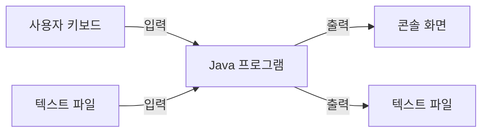
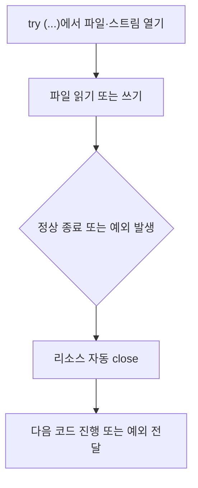

# 07_13 Java 입출력: 콘솔 입력과 파일 읽기·쓰기

- 학습 목표: 콘솔에서 값을 입력받는 방법과 텍스트 파일을 읽고 쓰는 방법을 이해한다. 특히 `Scanner`, `BufferedReader`, `PrintWriter`, `try-with-resources`의 역할을 구분한다.
- 핵심 키워드: 입출력, 스트림, `System.in`, `System.out`, `System.err`, `InputStream`, `InputStreamReader`, `BufferedReader`, `Scanner`, `FileWriter`, `PrintWriter`, `FileReader`, `IOException`, `try-with-resources`
- 중요도: 높음. 지금까지의 프로그램이 계산 후 화면에 결과만 보여 줬다면, 입출력은 사용자 입력과 파일 데이터를 프로그램 안으로 연결하는 첫 단계다.
- 원문 범위: 점프 투 자바 06-01 콘솔 입출력, 06-02 파일 입출력

---

## 1. 들어가며: 프로그램 밖과 안을 연결하는 입출력

지금까지 작성한 Java 프로그램은 코드 안에 값을 직접 적어 두고 결과를 콘솔에 출력하는 일이 많았다.

```java
int score = 90;
System.out.println(score);
```

하지만 실제 프로그램은 사용자가 입력한 값, 저장되어 있던 파일, 서버가 보낸 데이터처럼 **프로그램 밖에서 오는 정보**를 다룬다. 이때 밖에서 프로그램 안으로 데이터를 가져오는 일을 **입력(input)**, 프로그램 안의 데이터를 밖으로 내보내는 일을 **출력(output)**이라고 한다.



이번 노트에서 다루는 두 공간은 다음과 같다.

| 공간 | 입력 예시 | 출력 예시 |
|---|---|---|
| 콘솔 | 사용자가 키보드로 입력한 이름 | `System.out.println()`으로 보여 주는 결과 |
| 파일 | `memo.txt`에 이미 저장된 문장 | 프로그램이 새로 기록하는 `study-log.txt` |

## 2. 핵심 개념 정리

| 용어 | 뜻 |
|---|---|
| 스트림(stream) | 데이터가 한쪽에서 다른 쪽으로 이어서 이동하는 흐름 |
| 표준 입력 | 보통 키보드 입력. Java에서는 `System.in` |
| 표준 출력 | 보통 콘솔 화면 출력. Java에서는 `System.out` |
| 표준 오류 | 오류·경고 메시지용 출력. Java에서는 `System.err` |
| 바이트(byte) | 파일과 입출력의 가장 낮은 단위. 글자 하나가 항상 1바이트인 것은 아니다. |
| 문자(character) | 사람이 읽는 글자 단위 |
| 리소스(resource) | 파일, 입력 장치처럼 사용 후 정리해야 하는 외부 자원 |

스트림은 수도관처럼 생각하면 이해하기 쉽다. 키보드나 파일이 데이터를 보내고, Java 프로그램이 그 흐름에서 필요한 만큼 읽는다. 프로그램은 결과를 콘솔이나 파일 쪽으로 다시 보낼 수도 있다.


## 3. 콘솔 입출력

### 3.1 콘솔은 프로그램과 사용자가 글자로 대화하는 창이다

콘솔(console)은 프로그램이 실행되면서 입력과 출력을 주고받는 창을 통틀어 부르는 말이다. IntelliJ 같은 IDE에서 실행했다면 IDE 아래쪽의 콘솔 창이고, 명령 프롬프트에서 실행했다면 그 명령 창이 콘솔이다.

```text
이름을 입력하세요: 민지       <- 사용자가 입력
안녕하세요, 민지님!           <- 프로그램이 출력
```

Java는 콘솔과 연결된 기본 도구를 `System` 클래스에 준비해 둔다.

| 표현 | 역할 |
|---|---|
| `System.in` | 키보드 등에서 들어오는 표준 입력 |
| `System.out` | 일반 결과를 보여 주는 표준 출력 |
| `System.err` | 오류·경고를 보여 주는 표준 오류 출력 |

### 3.2 `System.in`은 바이트 흐름을 받는다

`System.in`은 `InputStream` 형태의 표준 입력이다. `InputStream`은 데이터를 바이트 단위로 읽는 도구다.

```java
import java.io.IOException;
import java.io.InputStream;

public class ReadOneByte {
    public static void main(String[] args) throws IOException {
        InputStream in = System.in;
        int value = in.read();

        System.out.println(value);
    }
}
```

`in.read()`는 입력 흐름에서 한 바이트를 읽는다. 읽은 결과는 `byte`가 아니라 `int`로 돌려주는데, 읽을 수 있는 바이트 값과 입력이 끝났다는 표시인 `-1`을 함께 표현해야 하기 때문이다.

영문 `a`를 입력하면 흔히 `97`이 출력된다. 이는 `a`에 해당하는 문자 코드값이다. 원문의 `abc` 예제처럼 영어·숫자 중심의 ASCII 문자를 읽을 때는 한 글자와 한 바이트가 대응하는 모습을 보기 쉽다.

다만 한국어 같은 문자는 인코딩에 따라 여러 바이트로 저장될 수 있다. 그래서 실제 사용자 텍스트를 다룰 때는 바이트 숫자를 직접 읽기보다, 문자를 읽는 도구나 `Scanner`를 쓰는 편이 훨씬 자연스럽다.

### 3.3 `InputStreamReader`는 바이트를 문자로 해석한다

`InputStreamReader`는 바이트 입력 스트림을 문자 입력으로 바꾸어 읽게 해 주는 연결 도구다.

```java
import java.io.IOException;
import java.io.InputStreamReader;

public class ReadCharacters {
    public static void main(String[] args) throws IOException {
        InputStreamReader reader = new InputStreamReader(System.in);
        char[] chars = new char[3];

        reader.read(chars);
        System.out.println(chars);
    }
}
```

원문의 `InputStream → InputStreamReader` 연결은 다음처럼 이해하면 된다.

```text
키보드에서 온 바이트
    -> InputStream: 바이트를 받음
    -> InputStreamReader: 바이트를 문자로 해석함
```

위 예제는 학습용으로 3글자만 읽는다. 실제 입력 길이를 미리 알 수 없는 경우에는 다음의 `BufferedReader` 또는 `Scanner`가 더 편하다.

### 3.4 `BufferedReader`는 한 줄 전체를 읽기 좋다

`BufferedReader`를 사용하면 사용자가 Enter를 누를 때까지 입력한 한 줄을 `String`으로 읽을 수 있다.

```java
import java.io.BufferedReader;
import java.io.IOException;
import java.io.InputStreamReader;

public class ReadLineExample {
    public static void main(String[] args) throws IOException {
        BufferedReader br = new BufferedReader(
            new InputStreamReader(System.in)
        );

        System.out.print("한 줄을 입력하세요: ");
        String line = br.readLine();

        System.out.println("입력한 내용: " + line);
    }
}
```

```text
한 줄을 입력하세요: Java 입출력 어렵지만 해 보자
입력한 내용: Java 입출력 어렵지만 해 보자
```

도구가 여러 겹으로 보이는 이유는 각자 맡은 일이 다르기 때문이다.

| 도구 | 이 노트에서 기억할 역할 |
|---|---|
| `InputStream` | 바이트 입력을 받는다. |
| `InputStreamReader` | 바이트를 문자로 해석한다. |
| `BufferedReader` | 문자 입력을 모아 한 줄 문자열로 읽는다. |

`readLine()`은 입력을 기다릴 수 있고, 입출력 중 문제가 생길 수 있으므로 `IOException` 처리가 필요하다. 지금은 `main` 뒤의 `throws IOException`을 "입출력에서 문제가 생기면 호출한 쪽에 알린다"는 표시로 이해하면 된다. 예외 처리 자체는 뒤에서 더 자세히 배운다.

### 3.5 `Scanner`는 입문자가 콘솔 값을 읽기 가장 편하다

일반적인 콘솔 입력은 `java.util.Scanner`를 사용하면 간단하게 처리할 수 있다.

```java
import java.util.Scanner;

public class ScannerExample {
    public static void main(String[] args) {
        Scanner scanner = new Scanner(System.in);

        System.out.print("이름을 입력하세요: ");
        String name = scanner.nextLine();

        System.out.print("나이를 입력하세요: ");
        int age = scanner.nextInt();

        System.out.println(name + "님의 내년 나이는 " + (age + 1) + "세입니다.");
    }
}
```

`Scanner`에서 자주 쓰는 메서드는 다음과 같다.

| 메서드 | 읽는 단위 | 예시 입력 |
|---|---|---|
| `next()` | 공백 전까지의 토큰 하나 | `hello world` 입력 시 `hello` |
| `nextLine()` | Enter 전까지의 한 줄 전체 | `hello world` 입력 시 전체 문장 |
| `nextInt()` | 정수 | `42` |
| `nextDouble()` | 실수 | `3.14` |

**토큰(token)**은 공백, 줄바꿈 같은 구분 기호로 나뉘는 작은 입력 단위다. 이름 하나나 숫자 하나를 읽을 때는 `next()`, 공백을 포함한 문장을 읽을 때는 `nextLine()`이 맞다.

### 3.6 `nextInt()` 다음의 `nextLine()`은 줄바꿈을 먼저 읽을 수 있다

`Scanner`를 처음 쓸 때 자주 만나는 현상이다.

```java
int age = scanner.nextInt();
String message = scanner.nextLine();
```

사용자가 `20`을 입력하고 Enter를 누르면 `nextInt()`는 숫자 `20`만 읽는다. Enter에 해당하는 줄바꿈은 입력에 남아 있어서 바로 다음 `nextLine()`이 그 빈 줄바꿈을 읽어 버릴 수 있다.

해결하려면 숫자를 읽은 뒤 남은 줄바꿈을 한 번 소비한다.

```java
int age = scanner.nextInt();
scanner.nextLine(); // 남아 있던 줄바꿈을 읽어 버림

System.out.print("한 줄 소개를 입력하세요: ");
String introduction = scanner.nextLine();
```

또는 모든 입력을 `nextLine()`으로 받고 필요할 때 숫자로 변환하는 방법도 있다.

```java
int age = Integer.parseInt(scanner.nextLine());
```

### 3.7 콘솔 출력은 `System.out`, 오류 메시지는 `System.err`를 쓴다

지금까지 사용한 `System.out.println()`은 일반 결과를 콘솔에 출력한다.

```java
System.out.println("저장이 완료되었습니다.");
```

오류나 경고 성격의 메시지는 `System.err.println()`으로 구분할 수 있다.

```java
System.err.println("점수는 0 이상이어야 합니다.");
```

IDE 콘솔에서는 둘 다 비슷하게 보일 수 있지만, 실행 환경에 따라 일반 출력과 오류 출력을 따로 처리하거나 기록할 수 있다. 당장은 "정상 결과는 `out`, 오류 안내는 `err`"라고 구분하면 충분하다.

## 4. 파일 출력: 데이터를 프로그램이 끝난 뒤에도 남기기

### 4.1 파일을 쓰기 전에 경로를 생각한다

파일 입출력에서 경로는 "어느 폴더에 어떤 이름으로 저장할지"를 뜻한다.

```java
"study-log.txt"       // 현재 실행 위치를 기준으로 한 상대 경로
"data/study-log.txt"  // 현재 실행 위치 아래 data 폴더의 파일
```

원문처럼 절대 경로를 넣을 수도 있지만, 예를 들어 `C:/out.txt`는 운영체제와 권한에 따라 쓰기 어려울 수 있다. 학습용 코드에서는 프로젝트 또는 실행 위치 안의 `study-log.txt`처럼 상대 경로를 먼저 쓰는 편이 안전하다. 단, `data/study-log.txt`처럼 중간 폴더를 적었다면 그 `data` 폴더는 미리 있어야 한다.

### 4.2 `FileOutputStream`은 바이트를 파일에 쓴다

`FileOutputStream`은 파일에 바이트 데이터를 쓸 때 사용하는 도구다. 파일이 없으면 새 파일을 만들 수 있다.

```java
import java.io.FileOutputStream;
import java.io.IOException;

public class WriteBytes {
    public static void main(String[] args) throws IOException {
        try (FileOutputStream output = new FileOutputStream("study-log.txt")) {
            byte[] data = "Java IO".getBytes();
            output.write(data);
        }
    }
}
```

문자열을 쓰려면 `getBytes()`로 바이트 배열로 바꾸어야 하므로, 사람에게 읽히는 텍스트를 쓸 때는 조금 번거롭다. 텍스트 파일에는 다음의 `FileWriter`나 `PrintWriter`가 더 읽기 쉽다.

### 4.3 `FileWriter`는 문자열을 파일에 쓴다

`FileWriter`는 문자열을 바로 쓸 수 있다.

```java
import java.io.FileWriter;
import java.io.IOException;

public class WriteText {
    public static void main(String[] args) throws IOException {
        try (FileWriter writer = new FileWriter("study-log.txt")) {
            writer.write("첫 번째 기록\n");
            writer.write("두 번째 기록\n");
        }
    }
}
```

`new FileWriter("study-log.txt")`는 기본적으로 파일을 새로 쓰는 모드로 연다. 이미 파일에 내용이 있다면 기존 내용을 덮어쓸 수 있으므로, 기존 기록을 이어 붙이고 싶은지 먼저 판단해야 한다.

### 4.4 `PrintWriter`는 `println()`으로 줄 단위 기록을 편하게 만든다

`FileWriter`도 문자열을 쓸 수 있지만, 줄바꿈 문자를 직접 넣어야 한다. `PrintWriter`는 콘솔의 `System.out.println()`처럼 `println()`을 사용할 수 있어 텍스트 목록을 쓰기 편하다.

```java
import java.io.IOException;
import java.io.PrintWriter;

public class PrintWriterExample {
    public static void main(String[] args) throws IOException {
        try (PrintWriter writer = new PrintWriter("study-log.txt")) {
            writer.println("Java 배열 복습");
            writer.println("Java 객체지향 복습");
            writer.println("Java 입출력 학습");
        }
    }
}
```

다음 두 코드는 "한 줄을 출력한다"는 점은 비슷하지만, 대상이 다르다.

| 코드 | 출력 대상 |
|---|---|
| `System.out.println("완료");` | 콘솔 화면 |
| `writer.println("완료");` | `writer`가 연결된 파일 |

### 4.5 파일을 덮어쓸지, 끝에 추가할지 구분한다

일기나 학습 기록처럼 기존 파일 뒤에 새 내용을 붙이고 싶다면 **추가 모드(append mode)**로 연다. `FileWriter`의 두 번째 인수에 `true`를 전달한다.

```java
import java.io.FileWriter;
import java.io.IOException;
import java.io.PrintWriter;

public class AppendFile {
    public static void main(String[] args) throws IOException {
        try (PrintWriter writer = new PrintWriter(
                new FileWriter("study-log.txt", true))) {
            writer.println("새로운 학습 기록을 덧붙입니다.");
        }
    }
}
```

| 생성 방식 | 동작 |
|---|---|
| `new FileWriter("study-log.txt")` | 기존 내용을 덮어쓸 수 있음 |
| `new FileWriter("study-log.txt", true)` | 기존 내용 뒤에 이어 씀 |

기록 파일을 만들 때 `true`를 빠뜨리면 이전 기록을 잃을 수 있으므로 특히 주의한다.

## 5. 파일 입력: 저장된 텍스트를 다시 읽기

### 5.1 `FileInputStream`은 파일을 바이트 배열로 읽는다

`FileInputStream`은 파일의 바이트를 직접 읽는다.

```java
import java.io.FileInputStream;
import java.io.IOException;

public class ReadBytes {
    public static void main(String[] args) throws IOException {
        byte[] buffer = new byte[1024];

        try (FileInputStream input = new FileInputStream("study-log.txt")) {
            int count = input.read(buffer);

            if (count != -1) {
                String text = new String(buffer, 0, count);
                System.out.println(text);
            }
        }
    }
}
```

`read(buffer)`가 실제로 읽은 바이트 수를 `count`에 저장한다. 파일이 더 짧으면 1024칸 전체가 아닌 읽은 부분만 문자열로 바꾸어야 하므로 `new String(buffer, 0, count)`처럼 범위를 지정했다.

이 방식은 이미지, 음성처럼 바이트 자체를 다뤄야 할 때의 출발점이다. 하지만 텍스트 파일을 줄 단위로 읽기에는 `BufferedReader`가 더 자연스럽다.

### 5.2 `BufferedReader`와 `FileReader`로 한 줄씩 읽는다

파일의 한 줄을 읽고, 더 읽을 줄이 없으면 `readLine()`은 `null`을 반환한다. 이 특징을 이용하면 파일 끝까지 반복할 수 있다.

```java
import java.io.BufferedReader;
import java.io.FileReader;
import java.io.IOException;

public class ReadLines {
    public static void main(String[] args) throws IOException {
        try (BufferedReader reader = new BufferedReader(
                new FileReader("study-log.txt"))) {

            String line;
            while ((line = reader.readLine()) != null) {
                System.out.println(line);
            }
        }
    }
}
```

반복문을 차근차근 읽어 보자.

```java
line = reader.readLine(); // 파일에서 다음 한 줄을 읽음
line != null;             // 읽은 줄이 있으면 true
System.out.println(line); // 그 줄을 콘솔에 출력
```

파일 끝에 도달하면 `readLine()`이 `null`을 반환하고 `while` 조건이 거짓이 되어 반복이 끝난다.

## 6. `try-with-resources`: 파일은 자동으로 닫히게 한다

### 6.1 왜 `close()`가 필요한가

파일, 입력 스트림처럼 외부 자원을 열었다면 사용이 끝난 뒤 닫아야 한다. 닫지 않으면 저장이 제때 끝나지 않거나, 다른 프로그램이 파일에 접근하기 어려울 수 있다.

예전 방식은 마지막에 직접 `close()`를 호출하는 것이다.

```java
PrintWriter writer = new PrintWriter("study-log.txt");
writer.println("기록");
writer.close();
```

하지만 중간에 예외가 발생하면 `close()` 줄까지 도달하지 못할 수 있다. Java 7부터는 `try-with-resources`를 사용해 이 문제를 줄일 수 있다.

```java
try (PrintWriter writer = new PrintWriter("study-log.txt")) {
    writer.println("기록");
} // try 블록을 나갈 때 writer.close()가 자동으로 호출됨
```

### 6.2 입출력 코드에서는 `try-with-resources`를 기본 습관으로 둔다

괄호 안에 만든 리소스는 `try` 블록이 끝날 때 자동으로 닫힌다. 정상적으로 끝나든, 중간에 문제가 생기든 정리된다는 점이 핵심이다.



앞으로 파일을 읽거나 쓸 때는 다음 뼈대를 먼저 떠올리면 좋다.

```java
try (도구이름 변수이름 = new 도구이름(...)) {
    // 읽기 또는 쓰기
}
```

## 7. 콘솔 입력을 파일에 기록하는 작은 프로그램

다음 예제는 이번 노트의 핵심을 연결한다. 사용자에게 오늘 배운 내용을 입력받고, `study-log.txt` 파일 끝에 한 줄로 추가한다. 파일 이름은 public 클래스와 같은 `StudyLogApp.java`로 저장한다.

```java
import java.io.FileWriter;
import java.io.IOException;
import java.io.PrintWriter;
import java.util.Scanner;

public class StudyLogApp {
    public static void main(String[] args) throws IOException {
        Scanner scanner = new Scanner(System.in);

        System.out.print("오늘 배운 내용을 입력하세요: ");
        String topic = scanner.nextLine();

        System.out.print("공부 시간을 분 단위로 입력하세요: ");
        int minutes = Integer.parseInt(scanner.nextLine());

        try (PrintWriter writer = new PrintWriter(
                new FileWriter("study-log.txt", true))) {
            writer.println(topic + " - " + minutes + "분");
        }

        System.out.println("study-log.txt에 기록했습니다.");
    }
}
```

실행 예시:

```text
오늘 배운 내용을 입력하세요: Java 파일 입출력
공부 시간을 분 단위로 입력하세요: 45
study-log.txt에 기록했습니다.
```

파일에는 다음 한 줄이 추가된다.

```text
Java 파일 입출력 - 45분
```

이 예제에서의 흐름은 다음과 같다.

1. `Scanner`가 콘솔에서 한 줄씩 입력을 받는다.
2. 문자열로 받은 공부 시간을 `Integer.parseInt()`로 정수로 바꾼다.
3. `FileWriter("study-log.txt", true)`가 파일을 추가 모드로 연다.
4. `PrintWriter.println()`이 한 줄을 파일에 기록한다.
5. `try-with-resources`가 파일 쓰기 도구를 자동으로 닫는다.

## 8. 헷갈리기 쉬운 부분

### 8.1 `next()`와 `nextLine()`은 다르다

```java
scanner.next();     // 공백 전까지 하나만 읽음
scanner.nextLine(); // Enter 전까지 한 줄 전체를 읽음
```

`Java 입출력`을 입력했을 때 공백을 포함해 모두 받아야 한다면 `nextLine()`을 사용한다.

### 8.2 `FileWriter`의 기본은 추가가 아니라 덮어쓰기다

```java
new FileWriter("study-log.txt");       // 기존 내용을 덮어쓸 수 있음
new FileWriter("study-log.txt", true); // 기존 내용 뒤에 추가
```

학습 기록, 로그처럼 계속 쌓아야 하는 파일에는 두 번째 방식이 맞는 경우가 많다.

### 8.3 `BufferedReader.readLine()`의 `null`은 빈 문자열이 아니다

```java
String line = reader.readLine();
```

- 빈 줄을 읽으면 `line`은 `""`일 수 있다.
- 더 읽을 줄이 없으면 `line`은 `null`이다.

파일 끝을 판단할 때는 `line == null`을 확인한다.

### 8.4 파일을 열었다면 닫혀야 한다

직접 `close()`를 호출할 수도 있지만, 파일 입출력에서는 `try-with-resources`를 사용하면 예외가 생겨도 자동으로 정리되므로 더 안전하다.

### 8.5 파일 경로는 프로그램의 실행 위치에 영향을 받는다

```java
new PrintWriter("study-log.txt")
```

이 파일이 정확히 어느 폴더에 생기는지는 IDE와 실행 설정에 따라 달라질 수 있다. 파일이 안 보인다면 코드가 틀렸다고 단정하기 전에, 실행한 프로젝트의 작업 디렉터리를 먼저 확인한다.

## 9. 요약

입출력은 프로그램 밖의 데이터와 프로그램 안의 코드를 연결하는 방법이다. 콘솔 입력은 `System.in`으로 시작하며, 바이트를 직접 이해할 때는 `InputStream`, 한 줄 문자열을 읽을 때는 `BufferedReader`, 입문 단계에서 편하게 입력받을 때는 `Scanner`를 사용한다.

파일 출력은 바이트 단위의 `FileOutputStream`, 문자열을 쓰는 `FileWriter`, 줄 단위 텍스트 기록이 편한 `PrintWriter`로 나눠 생각할 수 있다. 기존 파일을 보존하며 기록을 이어 붙이려면 `FileWriter`의 두 번째 인수에 `true`를 준다.

파일 입력은 바이트를 직접 읽는 `FileInputStream`도 있지만, 텍스트 파일은 `BufferedReader`와 `FileReader`를 조합해 `readLine()`으로 한 줄씩 읽는 방식이 이해하기 쉽다. 파일과 스트림을 열었으면 반드시 닫아야 하므로, 실제 코드에서는 `try-with-resources`를 기본으로 사용한다.

## 10. 복습 문제와 체크리스트

1. `System.in`, `System.out`, `System.err`는 각각 어떤 역할을 하는가?
2. `InputStream`과 `InputStreamReader`의 차이는 무엇인가?
3. 공백이 들어 있는 문장을 읽으려면 `Scanner`의 어떤 메서드를 쓰는가?
4. `nextInt()` 뒤에 `nextLine()`이 빈 값을 읽을 수 있는 이유는 무엇인가?
5. `new FileWriter("memo.txt")`와 `new FileWriter("memo.txt", true)`의 차이는 무엇인가?
6. `BufferedReader.readLine()`이 `null`을 반환하는 때는 언제인가?
7. `PrintWriter`와 `System.out`의 `println()`은 무엇이 다르게 출력되는가?
8. `try-with-resources`를 쓰면 어떤 점이 안전해지는가?

직접 해 볼 미니 과제:

1. 콘솔에서 이름과 오늘의 기분을 `nextLine()`으로 입력받는다.
2. `diary.txt` 파일 끝에 `이름: 기분` 형식으로 한 줄 추가한다.
3. `BufferedReader`로 `diary.txt`를 다시 읽어 전체 내용을 콘솔에 출력한다.
4. 파일이 없을 때, 숫자가 아닌 값을 공부 시간에 입력했을 때 어떤 일이 일어나는지 관찰한다. 예외 처리는 다음 학습에서 더 자세히 다룬다.

## 참고 링크

- [점프 투 자바 - 06-01 콘솔 입출력](https://wikidocs.net/226)
- [점프 투 자바 - 06-02 파일 입출력](https://wikidocs.net/227)
