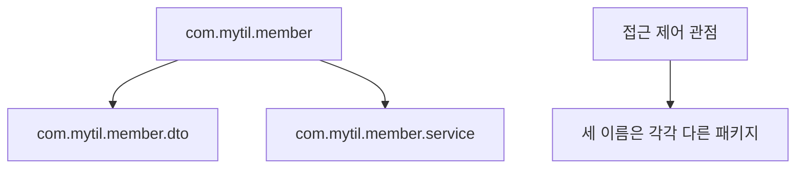

# 07_14 Java 코드 정리와 보호: 패키지, import, 접근 제어자

- 학습 목표: 클래스가 많아졌을 때 패키지로 코드를 정리하고, `private`, default, `protected`, `public`으로 필드와 메서드의 사용 범위를 정한다.
- 핵심 키워드: 패키지, `package`, `import`, FQCN, `java.lang`, 네임스페이스, 접근 제어자, `private`, default(package-private), `protected`, `public`, 캡슐화
- 중요도: 높음. 객체지향에서 클래스를 만들었다면, 다음 단계는 클래스를 어디에 두고 무엇을 외부에 보여 줄지 결정하는 일이다.
- 원문 범위: 점프 투 자바 07-01 패키지, 07-02 접근 제어자

---

## 1. 들어가며: 클래스가 많아지면 정리와 경계가 필요하다

클래스가 한두 개일 때는 파일이 같은 폴더에 있어도 큰 문제가 없다. 하지만 회원, 게시글, 주문, 계산, 파일 저장처럼 클래스가 늘어나면 이름이 섞이고 어떤 코드가 어떤 역할인지 찾기 어려워진다.

```text
src/
  User.java
  UserService.java
  UserRepository.java
  Post.java
  PostService.java
  FileUtil.java
  ...
```

이때 비슷한 성격의 클래스를 묶는 방법이 **패키지(package)**다. 그리고 다른 코드가 객체의 내부 값을 함부로 바꾸지 않게 막는 장치가 **접근 제어자(access modifier)**다.


두 개념은 다음처럼 역할이 다르다.

| 개념 | 해결하는 문제 |
|---|---|
| 패키지 | 관련 클래스를 어디에, 어떤 이름 공간으로 묶을까? |
| 접근 제어자 | 이 필드·메서드를 누가 사용할 수 있게 할까? |

## 2. 패키지: 관련 클래스를 모으고 이름 충돌을 막는 공간

### 2.1 패키지는 Java의 분류 폴더이자 이름 공간이다

패키지는 비슷한 성격의 클래스를 모아 두는 Java의 분류 단위다. 컴퓨터의 폴더로 파일을 정리하는 모습과 비슷하다.

```text
com.mytil.member    -> 회원 관련 클래스
com.mytil.post      -> 게시글 관련 클래스
com.mytil.common    -> 여러 곳에서 함께 쓰는 도구
```

패키지는 단순한 폴더 이름 이상으로, 클래스 이름이 어느 그룹에 속하는지 알려 주는 **이름 공간(namespace)** 역할도 한다.

```text
com.mytil.member.User
com.otherapp.member.User
```

두 클래스의 짧은 이름은 모두 `User`지만, 전체 이름은 다르다. 그래서 서로 다른 패키지에 있다면 같은 클래스명을 사용해도 충돌하지 않는다.

### 2.2 `package` 선언은 Java 파일의 소속을 알린다

`Member.java`를 `com.mytil.member` 패키지에 두려면 파일의 가장 위쪽에 패키지 선언을 적는다.

```java
package com.mytil.member;

public class Member {
    private String name;

    public Member(String name) {
        this.name = name;
    }

    public String getName() {
        return name;
    }
}
```

`package` 선언은 주석과 빈 줄을 제외하면 파일의 첫 번째 코드여야 한다. `import`보다도 먼저 적는다.

```java
package com.mytil.member;

import java.util.ArrayList;
```

패키지 이름의 점(`.`)은 폴더 구조와 보통 연결된다.

```text
src/
  com/
    mytil/
      member/
        Member.java
```

```text
com.mytil.member
```

IDE에서 패키지를 만들면 폴더와 `package` 선언을 함께 만들어 주는 경우가 많다. 그래도 "폴더 위치와 `package` 선언이 맞아야 한다"는 원리는 알고 있어야 오류를 이해하기 쉽다.

### 2.3 패키지 이름은 보통 소문자와 역순 도메인으로 정한다

패키지명은 일반적으로 모두 소문자로 쓴다.

```java
package com.mytil.member;
```

여러 조직의 코드가 함께 사용될 수 있으므로, 실제 프로젝트에서는 조직 도메인을 거꾸로 쓴 이름을 앞에 붙이는 관례가 널리 쓰인다.

| 도메인 | 패키지 앞부분 예시 |
|---|---|
| `mytil.com` | `com.mytil` |
| `ssafy.com` | `com.ssafy` |
| `apache.org` | `org.apache` |

그 뒤에 프로젝트명·기능명을 붙여 구체화한다.

```text
com.mytil.blog.member
com.mytil.blog.post
com.mytil.blog.common
```

혼자 만드는 작은 연습에서는 `member`, `post`처럼 짧게 시작해도 된다. 다만 프로젝트가 커지면 처음부터 일관된 패키지 규칙을 정하는 편이 좋다.

### 2.4 `com.mytil.member`와 `com.mytil.member.dto`는 서로 다른 패키지다

점으로 이어진 이름이 부모·자식 폴더처럼 보이지만, Java의 접근 제어 관점에서는 정확히 같은 패키지가 아니다.

```text
com.mytil.member
com.mytil.member.dto
```

두 이름은 관련된 구조로 정리하기에는 좋지만, default 접근 제어자가 자동으로 공유되는 관계는 아니다. default 멤버에 접근할 수 있으려면 패키지 이름 전체가 정확히 같아야 한다.



이 차이는 뒤에서 default 접근 제어자를 이해할 때 중요하다.

## 3. 다른 패키지의 클래스를 사용하는 `import`

### 3.1 다른 패키지의 클래스를 쓸 때는 `import`한다

`Member` 클래스와 이를 실행하는 `App` 클래스를 다른 패키지에 둔다고 해 보자.

```text
src/
  com/mytil/member/Member.java
  com/mytil/app/App.java
```

`App.java`는 `Member`의 전체 위치를 알려 주는 `import`를 적는다.

```java
package com.mytil.app;

import com.mytil.member.Member;

public class App {
    public static void main(String[] args) {
        Member member = new Member("민지");
        System.out.println(member.getName());
    }
}
```

`import`는 "이 파일에서 `Member`라고 쓰면 `com.mytil.member.Member`를 뜻한다"고 알려 주는 문장이다.

### 3.2 같은 패키지의 클래스끼리는 `import`가 필요 없다

같은 패키지에 속한 클래스는 서로 짧은 이름으로 바로 사용할 수 있다.

```java
package com.mytil.member;

public class MemberPrinter {
    public static void main(String[] args) {
        Member member = new Member("민지");
        System.out.println(member.getName());
    }
}
```

`MemberPrinter`와 `Member`가 모두 `com.mytil.member`에 있으므로 `import com.mytil.member.Member;`를 따로 적지 않아도 된다.

### 3.3 `import 패키지.*`는 그 패키지의 클래스만 가져온다

같은 패키지 안의 클래스를 여러 개 쓸 때는 별표를 사용할 수 있다.

```java
import com.mytil.member.*;
```

하지만 `*`는 그 패키지 바로 안의 클래스만 대상으로 한다. 하위 패키지까지 모두 가져오지는 않는다.

```text
import com.mytil.member.*;

포함:     com.mytil.member.Member
포함 안 됨: com.mytil.member.dto.MemberResponse
```

작은 예제에서는 편할 수 있지만, 실제 코드에서는 필요한 클래스를 하나씩 명시적으로 `import`하면 어디서 온 클래스인지 더 분명하게 보이는 경우가 많다.

### 3.4 FQCN은 `import` 없이 전체 이름을 직접 쓰는 방법이다

**완전한 클래스명(Fully Qualified Class Name, FQCN)**은 패키지부터 클래스명까지 모두 적는 이름이다.

```java
public class App {
    public static void main(String[] args) {
        com.mytil.member.Member member =
            new com.mytil.member.Member("민지");
    }
}
```

이 방법은 길어서 자주 쓰기에는 불편하지만, 같은 짧은 클래스명이 충돌할 때 유용하다.

```java
java.util.Date utilDate = new java.util.Date();
java.sql.Date sqlDate = new java.sql.Date(System.currentTimeMillis());
```

`java.util.Date`와 `java.sql.Date`는 둘 다 `Date`라는 이름을 가지므로, 한 파일에서 함께 쓸 때는 FQCN으로 구분할 수 있다.

### 3.5 `java.lang`의 클래스는 자동으로 사용할 수 있다

그동안 `String`, `System`, `Object`, `Math`를 쓸 때 `import`를 적지 않았다. 이 클래스들은 `java.lang` 패키지에 있고 Java가 자동으로 사용할 수 있게 처리해 주기 때문이다.

```java
String message = "Hello";      // java.lang.String
System.out.println(message);    // java.lang.System
Object object = new Object();   // java.lang.Object
```

반면 `ArrayList`, `Scanner`, `BufferedReader`처럼 `java.lang` 밖에 있는 클래스는 보통 `import`가 필요하다.

```java
import java.util.ArrayList;
import java.util.Scanner;
```

## 4. 접근 제어자: 객체의 내부를 필요한 만큼만 보여 주기

### 4.1 모든 필드를 `public`으로 두면 왜 불편할까

은행 계좌를 생각해 보자. 잔액을 누구나 직접 바꿀 수 있다면 음수 금액을 넣거나, 규칙을 건너뛰고 값을 조작할 수 있다.

```java
class BankAccount {
    public int balance;
}

BankAccount account = new BankAccount();
account.balance = -1000000; // 잘못된 값도 막을 수 없음
```

접근 제어자는 이런 문제를 줄이는 장치다. 내부 값은 숨기고, 꼭 필요한 기능만 공개한다.

```java
class BankAccount {
    private int balance;

    public void deposit(int amount) {
        if (amount > 0) {
            balance += amount;
        }
    }

    public int getBalance() {
        return balance;
    }
}
```

이제 외부 코드는 `balance`를 직접 바꾸지 못하고, `deposit()`이라는 규칙을 거쳐서만 잔액을 변경할 수 있다. 이렇게 객체의 내부 상태를 보호하고, 정해진 메서드로만 다루게 하는 방식을 **캡슐화(encapsulation)**라고 한다.

### 4.2 Java의 접근 제어자는 네 가지다

접근 제어자는 넓게 허용하는 순서로 다음과 같다.

```text
private < default < protected < public
```

| 접근 제어자 | 같은 클래스 | 같은 패키지 | 다른 패키지의 자식 클래스 | 다른 모든 클래스 |
|---|:---:|:---:|:---:|:---:|
| `private` | O | X | X | X |
| default | O | O | X | X |
| `protected` | O | O | O | X |
| `public` | O | O | O | O |

default는 키워드를 쓰지 않았을 때 적용되므로 **package-private**라고도 부른다. 표의 "다른 패키지의 자식 클래스" 칸은 상속받은 멤버를 자식 클래스 안에서 사용하는 경우를 뜻한다.

### 4.3 `private`: 해당 클래스 안에서만 사용한다

`private` 멤버는 선언한 클래스 내부에서만 접근할 수 있다.

```java
public class Member {
    private String password;

    public Member(String password) {
        this.password = password;
    }

    public boolean matchesPassword(String input) {
        return password.equals(input);
    }
}
```

다른 클래스에서는 비밀번호 필드에 직접 접근할 수 없다.

```java
Member member = new Member("secret");
// System.out.println(member.password); // 컴파일 오류
```

대신 공개한 메서드 `matchesPassword()`로만 필요한 확인을 할 수 있다. 일반적으로 객체의 필드는 먼저 `private`로 두고, 꼭 필요한 읽기·변경 기능만 메서드로 공개하는 습관이 좋다.

### 4.4 default: 같은 패키지 안에서만 함께 쓴다

아무 접근 제어자를 적지 않으면 default 접근 제어자가 적용된다.

```java
package com.mytil.member;

class MemberValidator {
    boolean isValidName(String name) {
        return name != null && !name.trim().isEmpty();
    }
}
```

`MemberValidator` 클래스와 `isValidName()` 메서드는 같은 `com.mytil.member` 패키지 안에서만 사용할 수 있다. 외부에 공개할 필요는 없지만, 같은 기능 묶음 안의 다른 클래스와는 공유하고 싶을 때 알맞다.

```java
package com.mytil.member;

public class MemberService {
    public boolean canCreate(String name) {
        MemberValidator validator = new MemberValidator();
        return validator.isValidName(name);
    }
}
```

`com.mytil.member.dto`처럼 이름이 이어져 보여도 정확히 같은 패키지가 아니므로 default 멤버에는 접근할 수 없다.

### 4.5 `protected`: 같은 패키지와 상속 관계에 열어 둔다

`protected` 멤버는 같은 패키지의 클래스에서 사용할 수 있다. 또한 다른 패키지라도 그 클래스를 상속한 자식 클래스 안에서는 사용할 수 있다.

```java
package com.mytil.person;

public class Person {
    protected String name;

    public Person(String name) {
        this.name = name;
    }
}
```

```java
package com.mytil.student;

import com.mytil.person.Person;

public class Student extends Person {
    public Student(String name) {
        super(name);
    }

    public void introduce() {
        System.out.println("저는 " + name + "입니다.");
    }
}
```

`Student`는 다른 패키지에 있지만 `Person`을 상속하므로 자신이 물려받은 `name`을 사용할 수 있다.

처음에는 `protected`를 많이 쓰기보다, "자식 클래스가 부모의 내부 정보를 직접 써야 하는가?"를 신중히 생각하는 편이 좋다. 단순한 데이터 보호에는 `private`와 공개 메서드가 더 안전한 경우가 많다.

### 4.6 `public`: 어떤 패키지에서도 사용할 수 있게 공개한다

`public` 멤버는 다른 패키지를 포함한 어디서든 접근할 수 있다.

```java
package com.mytil.member;

public class Member {
    public String getGreeting() {
        return "안녕하세요";
    }
}
```

```java
package com.mytil.app;

import com.mytil.member.Member;

public class App {
    public static void main(String[] args) {
        Member member = new Member();
        System.out.println(member.getGreeting());
    }
}
```

`public`은 편리하지만, 한 번 외부에 공개한 기능은 다른 코드가 의존하게 될 수 있다. 그래서 "정말 외부에서 써야 하는 기능인가?"를 생각하고 필요한 것만 `public`으로 만든다.

## 5. 클래스와 생성자에도 접근 범위를 정할 수 있다

### 5.1 최상위 클래스에는 `public`과 default만 쓴다

Java 파일의 바깥에 선언하는 최상위 클래스(top-level class)에는 `public` 또는 default만 사용할 수 있다.

```java
// 어떤 패키지에서도 사용할 수 있음
public class PublicMember {
}

// 같은 패키지에서만 사용할 수 있음
class InternalMemberHelper {
}
```

한 파일에 `public` 최상위 클래스가 있다면 파일 이름은 그 클래스 이름과 같아야 한다.

```text
public class Member { }
-> 파일 이름: Member.java
```

패키지 외부에 API로 보여 줄 클래스는 `public`으로, 패키지 내부에서만 쓰는 보조 클래스는 default로 두는 방식이 흔하다.

### 5.2 생성자의 접근 제어자는 객체를 누가 만들 수 있는지 정한다

생성자에도 접근 제어자를 붙일 수 있다.

```java
public class Member {
    private Member() {
    }
}
```

`private` 생성자는 해당 클래스 바깥에서 `new Member()`를 할 수 없게 만든다. 객체 생성을 특별한 메서드로 제한하고 싶을 때 사용하는 방식이다.

```java
public class App {
    public static void main(String[] args) {
        // Member member = new Member(); // 컴파일 오류
    }
}
```

이런 방식은 다음 노트에서 다룰 `static`과 함께 싱글톤 같은 패턴을 이해할 때 다시 나온다. 지금은 "생성자도 접근 제어자가 적용된다"는 점을 기억하면 충분하다.

## 6. 패키지와 접근 제어자를 함께 보는 작은 예제

아래는 간단한 회원 기능을 세 패키지로 나눈 예시다.

```text
src/
  com/mytil/member/Member.java
  com/mytil/member/MemberValidator.java
  com/mytil/app/App.java
```

`Member.java`

```java
package com.mytil.member;

public class Member {
    private String name;

    public Member(String name) {
        this.name = name;
    }

    public String getName() {
        return name;
    }
}
```

`MemberValidator.java`

```java
package com.mytil.member;

class MemberValidator {
    boolean isValidName(String name) {
        return name != null && !name.trim().isEmpty();
    }
}
```

`App.java`

```java
package com.mytil.app;

import com.mytil.member.Member;

public class App {
    public static void main(String[] args) {
        Member member = new Member("민지");

        System.out.println(member.getName());
        // System.out.println(member.name); // private 필드라 접근 불가
        // MemberValidator validator = new MemberValidator();
        // default 클래스라 다른 패키지에서 접근 불가
    }
}
```

이 예제에서의 경계는 다음과 같다.

| 대상 | 접근 범위 | 이유 |
|---|---|---|
| `Member` | `public` | `app` 패키지에서도 회원 객체를 사용해야 함 |
| `Member.name` | `private` | 이름을 직접 바꾸지 못하게 보호 |
| `getName()` | `public` | 외부에 이름을 읽는 기능만 제공 |
| `MemberValidator` | default | 회원 패키지 내부의 보조 역할 |

## 7. 적용 관점에서 다시 보기

### 7.1 처음 만드는 클래스는 이렇게 시작해 본다

처음부터 모든 것을 `public`으로 만들기보다 아래 순서로 생각하면 실수를 줄이기 좋다.

1. 이 클래스가 다른 패키지에서도 필요한가? 필요하면 클래스를 `public`으로 둔다.
2. 객체의 필드는 외부에서 직접 바꿔도 안전한가? 확신이 없다면 `private`으로 둔다.
3. 외부가 꼭 해야 하는 행동은 무엇인가? 그 행동만 `public` 메서드로 제공한다.
4. 같은 패키지에서만 공유할 보조 클래스·메서드는 default를 고려한다.
5. 상속받은 자식이 꼭 써야 할 내부 기능이 있을 때만 `protected`를 검토한다.

### 7.2 `public`을 많이 쓰는 것과 좋은 설계는 다르다

모두 `public`으로 만들면 당장은 코드 작성이 편할 수 있다. 하지만 어느 코드에서나 내부 상태를 바꿀 수 있어 버그가 생겼을 때 원인을 찾기 어려워진다.

```java
// 좋지 않은 시작: 외부 코드가 모든 것을 바꿀 수 있음
public String name;
public int score;

// 더 안전한 시작: 필요한 작업만 메서드로 공개
private String name;
private int score;

public void changeName(String newName) {
    this.name = newName;
}

public int getScore() {
    return score;
}
```

처음에는 조금 더 많은 메서드를 써야 해 보이지만, 객체가 지켜야 할 규칙을 한곳에 모을 수 있다.

### 7.3 다음 학습으로 이어지는 지점

| 다음 개념 | 이번 노트와의 연결 |
|---|---|
| `static` | 클래스 전체가 공유하는 변수·메서드를 `클래스이름.메서드()`로 사용한다. |
| 예외 처리 | 파일 입출력이나 잘못된 입력에서 생긴 문제를 안전하게 처리한다. |
| 싱글톤 | `private` 생성자와 `static` 메서드를 함께 사용해 객체 생성을 제한한다. |
| 프레임워크 | 패키지 구조와 `public` API, `private` 내부 구현을 바탕으로 코드를 구성한다. |

## 8. 헷갈리기 쉬운 부분

### 8.1 하위 패키지는 같은 패키지가 아니다

```text
com.mytil.member
com.mytil.member.dto
```

이름이 이어져 있어도 default 멤버를 함께 쓸 수 있는 같은 패키지가 아니다. default 접근은 패키지 이름이 완전히 같을 때만 가능하다.

### 8.2 `import`는 파일을 복사하는 문장이 아니다

```java
import com.mytil.member.Member;
```

이 문장은 `Member.java` 코드를 현재 파일로 가져와 복사하는 것이 아니다. 컴파일러에게 "여기서 `Member`라는 이름은 이 패키지의 클래스를 뜻한다"고 알려 주는 문장이다.

### 8.3 `protected`는 무조건 모든 자식 객체에 열려 있다는 뜻이 아니다

다른 패키지의 자식 클래스에서는 자신이 상속받은 멤버를 사용할 수 있다. 하지만 상속과 무관한 외부 클래스가 `protected` 멤버에 접근할 수 있는 것은 아니다. 그래서 `protected`는 "상속 설계에 필요한 경우"에 제한적으로 쓰는 편이 좋다.

### 8.4 `private` 필드는 값을 절대 못 읽는다는 뜻이 아니다

외부에서 직접 접근만 막을 뿐이다. 클래스가 `public` getter를 제공하면 안전한 방식으로 값을 읽을 수 있다.

```java
private int score;

public int getScore() {
    return score;
}
```

### 8.5 `public` 클래스는 파일 이름 규칙을 따른다

```java
public class Member {
}
```

이 클래스는 `Member.java` 파일에 있어야 한다. 클래스 이름과 파일 이름이 다르면 컴파일 오류가 난다.

## 9. 요약

패키지는 관련 클래스를 분류하고 클래스 이름 충돌을 막는 Java의 이름 공간이다. `package`로 파일의 소속을 정하고, 다른 패키지의 클래스를 사용할 때는 `import`를 쓴다. 같은 패키지에서는 import가 필요 없고, `java.lang`의 기본 클래스도 자동으로 사용할 수 있다.

접근 제어자는 코드의 사용 범위를 정한다. 필드는 보통 `private`으로 숨기고, 외부에 필요한 기능만 `public` 메서드로 공개한다. default는 같은 패키지에만, `protected`는 같은 패키지와 상속 관계에, `public`은 어디에서나 열어 둔다.

패키지로 코드를 분류하고 접근 제어자로 경계를 만들면, 클래스가 많아져도 구조를 이해하기 쉽고 객체의 내부 상태를 더 안전하게 지킬 수 있다.

## 10. 복습 문제와 체크리스트

1. 패키지가 폴더 정리와 비슷한 점은 무엇인가?
2. `com.mytil.member.User`와 `com.otherapp.member.User`가 함께 존재할 수 있는 이유는 무엇인가?
3. 같은 패키지의 클래스를 사용할 때 `import`가 필요 없는 이유는 무엇인가?
4. `import com.mytil.member.*;`가 `com.mytil.member.dto.MemberResponse`까지 가져오는가?
5. `private`, default, `protected`, `public`을 허용 범위가 좁은 순서대로 적어 본다.
6. 객체 필드를 보통 `private`으로 두는 이유는 무엇인가?
7. `com.mytil.member`와 `com.mytil.member.dto`는 default 접근 제어자를 공유할 수 있는가?
8. `protected`가 필요한 상황 한 가지를 설명해 본다.
9. 최상위 클래스에 쓸 수 있는 접근 제어자는 무엇인가?

직접 해 볼 미니 과제:

1. `com.mytil.book` 패키지에 `Book` 클래스를 만든다.
2. `Book`의 `title`, `author` 필드는 `private`으로 선언한다.
3. 제목과 저자를 받는 `public` 생성자와, 제목을 반환하는 `public getTitle()` 메서드를 만든다.
4. 같은 패키지에 default 접근 제어자인 `BookValidator`를 만들어 제목이 비어 있는지 확인하게 한다.
5. `com.mytil.app` 패키지의 `BookApp`에서 `Book`은 사용하고, `BookValidator`는 직접 사용할 수 없는지 확인한다.

## 참고 링크

- [점프 투 자바 - 07-01 패키지](https://wikidocs.net/231)
- [점프 투 자바 - 07-02 접근 제어자](https://wikidocs.net/232)
