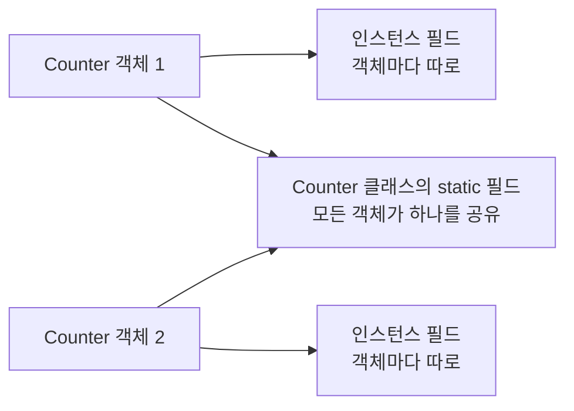
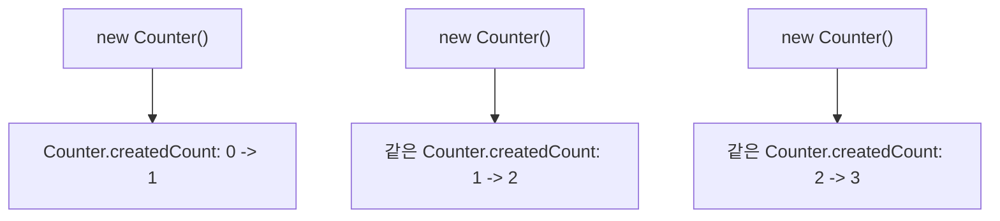
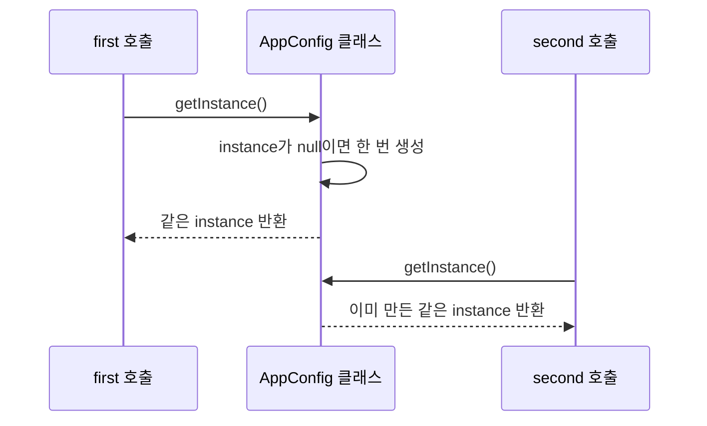

# 07_15 Java 공유 상태와 클래스 기능: static, static final, 싱글톤 기초

- 학습 목표: 객체마다 따로 가져야 하는 값과 클래스 전체가 함께 가져야 하는 값을 구분하고, `static` 변수·메서드·`static final` 상수·싱글톤의 기본 원리를 이해한다.
- 핵심 키워드: 인스턴스 변수, 클래스 변수, `static`, 공유, `static` 메서드, `this`, `static final`, 상수, 유틸리티 메서드, 싱글톤, `getInstance`
- 중요도: 높음. `main`, `Math.max`, 상수, 객체 생성 횟수, 유틸리티 클래스처럼 Java 코드 곳곳에 `static`이 등장한다.
- 원문 범위: 점프 투 자바 07-03 스태틱

---

## 1. 들어가며: "각자 하나씩"과 "모두 하나를 함께" 구분하기

07_11에서 객체는 필드를 각자 따로 가진다고 배웠다. 학생 객체를 두 명 만들면 이름과 점수도 두 세트가 생긴다.

```java
Student minji = new Student("민지", 80);
Student jun = new Student("준", 95);
```

이런 독립성은 아주 중요하다. 하지만 모든 값이 객체마다 따로 있어야 하는 것은 아니다.

- 학급의 **전체 학생 수**
- 프로그램에서 만든 **객체의 총 개수**
- 원의 **원주율**
- 변하지 않는 **최대 점수**

이 값들은 "어떤 객체의 개인 정보"라기보다 **클래스 전체가 함께 보는 정보**에 가깝다. 이때 `static`을 사용한다.



이번 노트의 핵심 질문은 하나다.

> 이 값이나 기능은 **특정 객체 하나**에 속하는가, 아니면 **클래스 전체**에 속하는가?

## 2. 핵심 개념 정리

| 구분 | 인스턴스 멤버 | `static` 멤버 |
|---|---|---|
| 소속 | 객체 하나 | 클래스 하나 |
| 만들어지는 때 | `new`로 객체를 만들 때 | 클래스가 사용될 때 한 번 |
| 개수 | 객체 수만큼 | 클래스마다 하나 |
| 접근 권장 방식 | `객체.필드`, `객체.메서드()` | `클래스이름.필드`, `클래스이름.메서드()` |
| 예시 | 학생의 이름, 장바구니 수량 | 생성된 객체 수, 원주율, 공통 도구 메서드 |

| 키워드 | 뜻 |
|---|---|
| `static` | 클래스 전체가 하나를 공유하게 한다. 값은 바뀔 수 있다. |
| `final` | 변수에 한 번 값을 넣은 뒤 다른 값으로 대입하지 못하게 한다. |
| `static final` | 클래스 전체가 공유하는 변경 불가 상수다. |

## 3. static 변수: 객체가 아니라 클래스에 속하는 값

### 3.1 인스턴스 변수는 객체마다 따로 만들어진다

다음 `Counter` 클래스의 `count`는 `static`이 없는 인스턴스 변수다.

```java
class Counter {
    int count = 0;

    Counter() {
        count++;
        System.out.println(count);
    }
}

public class InstanceCounterExample {
    public static void main(String[] args) {
        Counter first = new Counter();
        Counter second = new Counter();
    }
}
```

출력:

```text
1
1
```

`first`와 `second`는 서로 다른 객체다. 각각 새 `count`를 가지고 `0`에서 `1`로 증가하므로 둘 다 `1`을 출력한다. 이것이 인스턴스 변수의 정상적인 동작이다.

### 3.2 모든 객체가 같은 개수를 세려면 `static`을 붙인다

"현재 객체의 count"가 아니라 "Counter 객체가 지금까지 몇 개 만들어졌는가"를 알고 싶다면 하나의 값을 공유해야 한다.

```java
class Counter {
    static int createdCount = 0;

    Counter() {
        createdCount++;
        System.out.println(createdCount);
    }
}

public class StaticCounterExample {
    public static void main(String[] args) {
        Counter first = new Counter();
        Counter second = new Counter();
        Counter third = new Counter();
    }
}
```

출력:

```text
1
2
3
```

`createdCount` 앞에 `static`을 붙이면 `Counter` 객체마다 따로 생기지 않는다. `Counter` 클래스에 하나만 존재하고, 모든 `Counter` 객체가 그 하나를 함께 사용한다.



### 3.3 static 변수는 클래스 이름으로 접근한다

`static` 변수는 특정 객체의 개인 필드가 아니므로 클래스 이름을 통해 접근하는 것이 가장 명확하다.

```java
System.out.println(Counter.createdCount);
```

객체 변수로도 문법상 접근이 가능한 경우가 있지만, 어떤 객체를 통해 보더라도 같은 공유 값을 보는 것이므로 의미가 흐려진다.

```java
Counter first = new Counter();

System.out.println(Counter.createdCount); // 권장
// System.out.println(first.createdCount); // 가능할 수 있으나 권장하지 않음
```

`Counter.createdCount`라고 쓰면 "Counter 클래스 전체의 생성 횟수"라는 뜻이 바로 보인다.

### 3.4 static은 공유를 위한 것이지, 무조건 메모리 절약용은 아니다

원문은 모든 객체가 같은 값을 가질 때 `static`을 사용해 중복 저장을 줄일 수 있음을 설명한다. 실제 코드에서 더 중요한 판단 기준은 **여러 객체가 같은 값을 함께 봐야 하는가**다.

```java
class Student {
    String name;                 // 학생마다 다름: 인스턴스 변수
    int score;                   // 학생마다 다름: 인스턴스 변수
    static int totalCount = 0;   // 모든 학생 객체 수: 공유 변수
}
```

`name`을 `static`으로 만들면 학생 한 명의 이름을 바꿨을 때 모든 학생이 같은 이름을 보게 된다. 이런 값은 공유하면 안 된다.

```java
class WrongStudent {
    static String name; // 학생별 이름에 사용하면 잘못된 설계
}
```

## 4. static final: 모두가 공유하는 변하지 않는 값

### 4.1 `static`과 `final`은 역할이 다르다

두 키워드는 함께 자주 쓰이지만 뜻이 다르다.

```java
static int totalCount = 0;           // 하나를 공유하지만 값은 바뀔 수 있음
final int maximumScore = 100;        // 객체마다 있을 수 있지만 재대입 불가
static final int MAXIMUM_SCORE = 100; // 하나를 공유하고 재대입도 불가
```

| 선언 | 공유 여부 | 값 변경 | 예시 |
|---|---|---|---|
| `int score` | 객체마다 따로 | 가능 | 학생 개인 점수 |
| `static int totalCount` | 클래스 전체 공유 | 가능 | 생성된 학생 수 |
| `final int id` | 객체마다 따로 | 불가 | 객체를 만든 뒤 고정할 식별 값 |
| `static final int MAX_SCORE` | 클래스 전체 공유 | 불가 | 모두가 쓰는 최대 점수 |

### 4.2 상수는 보통 `static final`과 대문자 이름을 사용한다

프로그램 전체에서 같은 뜻으로 쓰는 변경 불가 값은 상수로 둔다.

```java
class ScoreRule {
    static final int MAX_SCORE = 100;
    static final int MIN_SCORE = 0;
}
```

```java
int score = 95;

if (score >= ScoreRule.MIN_SCORE && score <= ScoreRule.MAX_SCORE) {
    System.out.println("유효한 점수입니다.");
}
```

상수 이름은 보통 모든 단어를 대문자로 쓰고, 단어 사이는 밑줄(`_`)로 연결하는 관례가 있다.

```java
static final int MAX_LOGIN_ATTEMPTS = 5;
static final double TAX_RATE = 0.1;
```

상수를 쓰면 코드 안의 `100`, `5`, `0.1` 같은 숫자가 무엇을 뜻하는지 이름으로 드러난다. 이런 이름 없는 숫자를 매직 넘버(magic number)라고 부르며, 의미가 중요하면 상수로 바꾸는 편이 좋다.

## 5. static 메서드: 객체 없이 클래스 이름으로 부르는 기능

### 5.1 static 메서드는 클래스에 속한다

메서드 앞에 `static`을 붙이면 객체를 만들지 않고 클래스 이름으로 직접 호출할 수 있다.

```java
class Counter {
    static int createdCount = 0;

    Counter() {
        createdCount++;
    }

    static int getCreatedCount() {
        return createdCount;
    }
}

public class StaticMethodExample {
    public static void main(String[] args) {
        new Counter();
        new Counter();

        System.out.println(Counter.getCreatedCount()); // 2
    }
}
```

`getCreatedCount()`는 어느 `Counter` 객체의 개인 상태를 읽는 것이 아니라, 클래스 전체가 공유하는 `createdCount`를 읽는다. 그래서 `Counter.getCreatedCount()`처럼 호출하는 것이 자연스럽다.

### 5.2 static 메서드 안에서는 인스턴스 멤버를 바로 사용할 수 없다

`static` 메서드가 실행될 때는 특정 객체가 정해져 있지 않을 수 있다. 따라서 객체마다 다른 인스턴스 필드나 인스턴스 메서드를 이름만으로 바로 쓸 수 없다.

```java
class Student {
    String name;
    static int totalCount = 0;

    static void printCount() {
        System.out.println(totalCount); // 가능: static 변수
        // System.out.println(name);   // 불가능: 어느 학생의 name인가?
    }
}
```

`name`을 사용하려면 어떤 학생 객체인지 먼저 알아야 한다.

```java
static void printStudentName(Student student) {
    System.out.println(student.name);
}
```

또는 인스턴스 메서드로 만들어 `student.introduce()`처럼 특정 객체를 통해 호출한다.

### 5.3 `main`이 static인 이유와 객체를 사용할 수 있는 이유

Java 프로그램은 객체를 아직 만들지 않은 상태에서도 실행을 시작해야 한다. 그래서 시작점인 `main`은 `static` 메서드다.

```java
public static void main(String[] args) {
}
```

`main` 안에서 인스턴스 필드를 이름만으로 바로 사용할 수는 없다. 하지만 객체를 만든 뒤 그 객체를 통해 접근하는 것은 가능하다.

```java
public static void main(String[] args) {
    Student student = new Student();
    student.name = "민지"; // 객체를 통해 접근하므로 가능
}
```

즉, `main`이 static이라고 해서 객체를 전혀 못 쓰는 것이 아니다. `this.name`처럼 "현재 객체"가 있다고 가정하는 코드를 바로 쓰지 못할 뿐이다.

### 5.4 유틸리티성 기능은 static 메서드와 잘 맞는다

어떤 객체의 상태를 읽거나 바꾸지 않고, 입력값만 받아 결과를 돌려주는 범용 기능은 static 메서드로 만들기 좋다.

```java
class NumberUtil {
    static boolean isEven(int number) {
        return number % 2 == 0;
    }

    static int clamp(int value, int min, int max) {
        if (value < min) {
            return min;
        }
        if (value > max) {
            return max;
        }
        return value;
    }
}
```

```java
System.out.println(NumberUtil.isEven(12));       // true
System.out.println(NumberUtil.clamp(120, 0, 100)); // 100
```

`NumberUtil` 객체를 만들어서 각자 상태를 가질 이유가 없으므로, `NumberUtil.isEven(12)`처럼 클래스 이름으로 쓰는 편이 자연스럽다. Java의 `Math.max()`, `Math.min()`도 비슷한 생각으로 사용하는 대표적인 static 메서드다.

## 6. 싱글톤 기초: 객체를 하나만 만들도록 제한하기

### 6.1 싱글톤은 "한 종류의 객체를 하나만" 유지하는 패턴이다

싱글톤(singleton)은 특정 클래스의 객체가 프로그램 안에서 하나만 만들어지도록 제한하는 설계 방식이다.

예를 들어 애플리케이션 전체 설정, 하나의 공용 로그 관리자처럼 여러 개가 있으면 오히려 혼란스러운 대상에 사용할 수 있다.

싱글톤의 기본 재료는 세 가지다.

1. 외부에서 `new`하지 못하게 하는 `private` 생성자
2. 유일한 객체를 보관하는 `private static` 변수
3. 그 객체를 돌려주는 `public static getInstance()` 메서드

### 6.2 private 생성자는 외부의 `new`를 막는다

```java
class AppConfig {
    private AppConfig() {
    }
}
```

생성자가 `private`이면 클래스 바깥에서는 다음 코드가 불가능하다.

```java
// AppConfig config = new AppConfig(); // 컴파일 오류
```

이 상태만으로는 아무도 객체를 만들 수 없으므로, 클래스 내부에서 하나를 만들고 꺼내 주는 통로가 필요하다.

### 6.3 같은 객체를 계속 돌려주는 기본 싱글톤 코드

```java
class AppConfig {
    private static AppConfig instance;

    private AppConfig() {
    }

    public static AppConfig getInstance() {
        if (instance == null) {
            instance = new AppConfig();
        }
        return instance;
    }
}

public class SingletonExample {
    public static void main(String[] args) {
        AppConfig first = AppConfig.getInstance();
        AppConfig second = AppConfig.getInstance();

        System.out.println(first == second); // true
    }
}
```

처음 `getInstance()`를 호출했을 때만 `instance`가 `null`이므로 객체를 하나 만든다. 그 뒤에는 이미 저장된 같은 객체를 돌려준다.



### 6.4 싱글톤은 항상 써야 하는 문법이 아니다

싱글톤은 "객체가 반드시 하나여야 한다"는 이유가 분명할 때만 사용한다. 무조건 전역 변수처럼 쓰면 코드 사이의 의존성이 커지고 테스트가 어려워질 수 있다.

또한 여러 스레드가 동시에 `getInstance()`를 호출하는 프로그램에서는 위의 단순한 구현만으로 안전하지 않을 수 있다. 스레드와 동시성은 뒤에서 별도로 배우므로, 지금은 싱글톤의 **구조와 목적**을 이해하는 데 집중하면 된다.

## 7. static과 인스턴스를 함께 쓰는 작은 예제

아래 예제는 학생 객체의 개인 정보와, 전체 학생 수를 함께 다룬다. 파일 이름은 public 클래스와 같은 `StudentCountExample.java`로 저장한다.

```java
class Student {
    static final int MAX_SCORE = 100;
    private static int totalCount = 0;

    private String name;
    private int score;

    Student(String name, int score) {
        this.name = name;
        this.score = NumberUtil.clamp(score, 0, MAX_SCORE);
        totalCount++;
    }

    String getInfo() {
        return name + ": " + score + "점";
    }

    static int getTotalCount() {
        return totalCount;
    }
}

class NumberUtil {
    static int clamp(int value, int min, int max) {
        if (value < min) {
            return min;
        }
        if (value > max) {
            return max;
        }
        return value;
    }
}

public class StudentCountExample {
    public static void main(String[] args) {
        Student minji = new Student("민지", 95);
        Student jun = new Student("준", 120);

        System.out.println(minji.getInfo());
        System.out.println(jun.getInfo());
        System.out.println("전체 학생 수: " + Student.getTotalCount());
    }
}
```

출력:

```text
민지: 95점
준: 100점
전체 학생 수: 2
```

이 예제에서 각 멤버의 소속을 구분해 보자.

| 멤버 | 종류 | 이유 |
|---|---|---|
| `name`, `score` | 인스턴스 필드 | 학생마다 값이 다르다. |
| `totalCount` | `private static` 필드 | 모든 학생 객체 수를 하나로 공유한다. |
| `MAX_SCORE` | `static final` 상수 | 모든 학생이 공유하고 바뀌지 않는다. |
| `getInfo()` | 인스턴스 메서드 | 특정 학생의 이름·점수를 사용한다. |
| `getTotalCount()` | static 메서드 | 클래스 전체의 공유 개수를 반환한다. |
| `NumberUtil.clamp()` | static 유틸리티 메서드 | 특정 객체 상태와 무관한 계산이다. |

## 8. 헷갈리기 쉬운 부분

### 8.1 static은 "값이 절대 안 바뀐다"는 뜻이 아니다

```java
static int totalCount = 0;
```

이 값은 하나를 공유할 뿐, 얼마든지 바뀔 수 있다.

```java
totalCount++;
```

바꾸지 못하게 하려면 `final`이 추가로 필요하다.

```java
static final int MAX_SCORE = 100;
```

### 8.2 static 메서드에서는 인스턴스 필드를 바로 쓸 수 없다

```java
class Student {
    String name;

    static void printName() {
        // System.out.println(name); // 오류
    }
}
```

`printName()`이 실행될 때 어느 학생의 `name`을 출력해야 하는지 알 수 없기 때문이다.

### 8.3 인스턴스 메서드에서는 static 멤버를 사용할 수 있다

객체의 메서드는 실행될 때 특정 객체가 정해져 있지만, 클래스 공유 멤버도 함께 볼 수 있다.

```java
class Counter {
    static int totalCount = 0;

    void increase() {
        totalCount++; // 가능
    }
}
```

하지만 가능하다고 해서 객체별 상태와 공유 상태를 섞어도 된다는 뜻은 아니다. 어떤 값이 누구에게 속하는지 계속 구분한다.

### 8.4 `this`는 static 문맥에서 사용할 수 없다

`this`는 "현재 이 메서드를 실행 중인 객체"를 뜻한다. static 메서드는 객체 없이 호출할 수 있으므로 현재 객체가 없을 수 있다.

```java
static void printSomething() {
    // this.name; // 오류
}
```

### 8.5 싱글톤의 private 생성자는 객체를 아예 못 만들게 하려는 것이 아니다

외부의 `new`는 막지만, 클래스 내부의 `getInstance()`는 private 생성자를 호출할 수 있다. 목적은 객체 생성을 금지하는 것이 아니라 **생성 경로를 하나로 제한하는 것**이다.

## 9. 요약

인스턴스 필드와 메서드는 객체마다 따로 존재한다. 이름, 점수, 장바구니 수량처럼 객체별로 달라지는 값에 사용한다. 반면 `static` 멤버는 클래스 전체가 하나를 공유한다. 객체 생성 횟수, 공통 설정, 범용 도구 메서드에 알맞다.

`static` 메서드는 `클래스이름.메서드()` 형태로 객체 없이 호출할 수 있지만, 특정 객체가 정해져 있지 않으므로 인스턴스 멤버를 바로 사용할 수 없다. `static final`은 하나를 공유하면서 변경도 막는 상수이며, 대문자 이름으로 작성하는 관례가 있다.

싱글톤은 private 생성자, static 객체 보관 변수, static `getInstance()` 메서드를 이용해 특정 클래스의 객체를 하나만 유지하는 패턴이다. 다만 객체가 꼭 하나여야 한다는 명확한 이유가 있을 때만 사용한다.

## 10. 복습 문제와 체크리스트

1. 인스턴스 필드와 static 필드의 가장 큰 차이는 무엇인가?
2. 학생의 `name`은 왜 static 필드로 두면 안 되는가?
3. `Counter.createdCount`처럼 클래스 이름으로 static 필드에 접근하는 이유는 무엇인가?
4. `static`과 `final`은 각각 무엇을 보장하는가?
5. `static final int MAX_SCORE = 100;`은 어떤 종류의 값인가?
6. static 메서드에서 인스턴스 필드를 바로 읽지 못하는 이유는 무엇인가?
7. `main`이 static이어도 객체를 만들고 사용할 수 있는 이유는 무엇인가?
8. 유틸리티 메서드가 static과 잘 맞는 이유는 무엇인가?
9. 싱글톤의 세 가지 기본 구성 요소는 무엇인가?

직접 해 볼 미니 과제:

1. `Book` 클래스에 책 제목을 저장하는 인스턴스 필드 `title`을 만든다.
2. 생성된 책 수를 세는 `static int totalCount`를 만든다.
3. 생성자에서 `totalCount`를 1 증가시킨다.
4. `static int getTotalCount()` 메서드로 전체 권 수를 반환하게 한다.
5. `static final int MAX_BORROW_DAYS = 14` 상수를 만들고, 대출 기간이 이 범위를 넘지 않게 하는 메서드를 작성한다.

## 참고 링크

- [점프 투 자바 - 07-03 스태틱](https://wikidocs.net/228)
