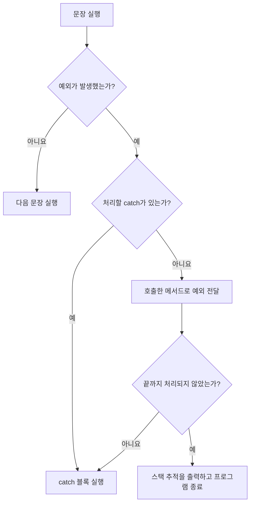
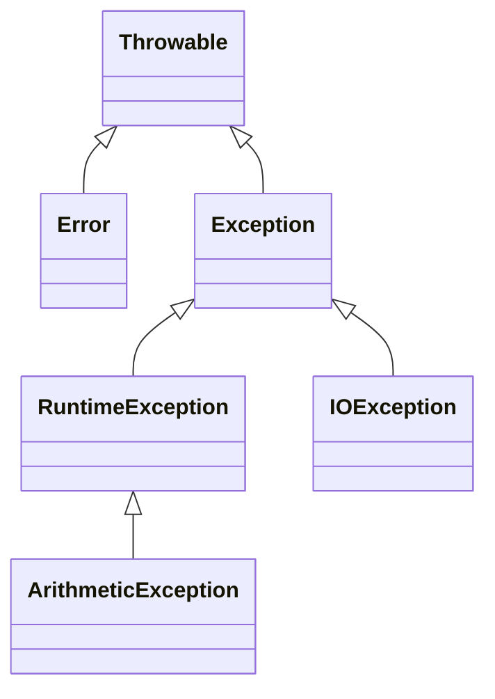
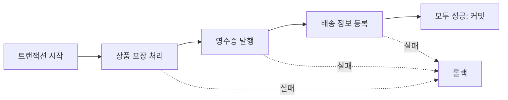

# 07_18 Java 예외 처리: try-catch, throws, 사용자 정의 예외

> 학습 범위: 점프 투 자바 07-04 예외 처리  
> 핵심 키워드: `Exception`, `try-catch`, `finally`, `throw`, `throws`, 검사 예외, 실행 예외, 트랜잭션

## 1. 예외란 무엇일까?

프로그램을 실행하다 보면 문법은 맞지만 작업을 계속할 수 없는 상황이 생긴다.

- 존재하지 않는 파일을 열려고 했다.
- 어떤 수를 0으로 나누려고 했다.
- 배열의 범위를 벗어난 위치에 접근했다.
- 숫자로 바꿀 수 없는 문자열을 숫자로 변환하려고 했다.

Java는 이런 문제 상황을 **예외 객체**로 만들어 프로그램에 알린다. 예외를 아무도 처리하지 않으면 현재 실행 흐름이 중단되고, 호출한 메서드를 거슬러 올라가다가 결국 프로그램이 종료된다.



### 오류와 예외는 어떻게 다를까?

| 구분 | 의미 | 예시 |
| --- | --- | --- |
| 문법 오류 | Java 문법을 어겨 컴파일할 수 없는 상태 | 세미콜론 누락, 잘못된 변수 선언 |
| 예외 | 문법은 맞지만 실행 중 정상적으로 처리할 수 없는 상황 | 파일 없음, 0으로 나누기 |
| `Error` | JVM이나 시스템 수준의 심각한 문제 | 메모리 부족 |

일반적인 애플리케이션 코드는 주로 `Exception`과 그 하위 클래스를 처리한다. `Error`까지 무조건 잡아 프로그램을 계속 실행하려고 하면 오히려 상태가 더 나빠질 수 있다.

## 2. 자주 만나는 예외

### 2.1 존재하지 않는 파일 열기

```java
import java.io.FileInputStream;
import java.io.FileNotFoundException;

public class FileExceptionExample {
    public static void main(String[] args) {
        try {
            FileInputStream input = new FileInputStream("not_exists.txt");
        } catch (FileNotFoundException e) {
            System.out.println("파일을 찾을 수 없습니다: " + e.getMessage());
        }
    }
}
```

`FileInputStream`은 파일이 없을 수 있다는 사실을 `FileNotFoundException`으로 알린다. 이 예외는 컴파일러가 처리를 확인하는 **검사 예외**이므로 `catch`로 처리하거나 `throws`로 전달해야 한다.

### 2.2 0으로 나누기

```java
public class DivideExceptionExample {
    public static void main(String[] args) {
        int result = 10 / 0;
        System.out.println(result);
    }
}
```

정수는 0으로 나눌 수 없으므로 `ArithmeticException`이 발생한다. 이 예외는 `RuntimeException`의 하위 클래스라서 컴파일러가 처리를 강제하지 않는다. 그렇다고 무시해도 된다는 뜻은 아니다. 0이 들어오지 않도록 검사하거나, 발생한 예외를 적절한 위치에서 처리해야 한다.

### 2.3 배열 범위 벗어나기

```java
public class ArrayExceptionExample {
    public static void main(String[] args) {
        int[] numbers = {10, 20, 30};
        System.out.println(numbers[3]);
    }
}
```

길이가 3인 배열의 인덱스는 `0`, `1`, `2`뿐이다. `numbers[3]`에 접근하면 `ArrayIndexOutOfBoundsException`이 발생한다.

예외 메시지를 볼 때는 다음 정보를 차례로 확인한다.

1. 예외 클래스 이름: 어떤 종류의 문제가 생겼는가?
2. 예외 메시지: 문제가 된 값이나 상태는 무엇인가?
3. 스택 추적의 파일명과 줄 번호: 내 코드의 어느 문장에서 시작되었는가?

스택 추적은 메서드 호출의 흔적이다. 보통 위쪽에서 내 프로젝트의 파일명과 줄 번호를 먼저 찾으면 원인을 좁히기 쉽다.

## 3. try-catch로 예외 처리하기

예외가 발생할 가능성이 있는 코드는 `try`에 넣고, 해당 예외가 발생했을 때 실행할 코드는 `catch`에 넣는다.

```java
try {
    // 예외가 발생할 수 있는 코드
} catch (ExceptionType e) {
    // ExceptionType 예외가 발생했을 때 실행할 코드
}
```

`e`는 발생한 예외 객체를 가리키는 변수이다. `e.getMessage()`로 예외에 담긴 설명을 얻을 수 있다.

```java
public class SafeDivideExample {
    public static void main(String[] args) {
        int number = 10;
        int divisor = 0;

        try {
            int result = number / divisor;
            System.out.println("계산 결과: " + result);
        } catch (ArithmeticException e) {
            System.out.println("0으로 나눌 수 없습니다.");
        }

        System.out.println("프로그램을 계속 실행합니다.");
    }
}
```

`number / divisor`에서 예외가 발생하면 `try`의 남은 문장은 건너뛰고 곧바로 일치하는 `catch`로 이동한다. `catch`가 끝난 뒤에는 전체 `try-catch` 다음 문장부터 실행한다.

### 여러 종류의 예외 처리하기

```java
try {
    int index = Integer.parseInt("3");
    int[] numbers = {10, 20};
    System.out.println(numbers[index]);
} catch (NumberFormatException e) {
    System.out.println("정수 형식이 아닙니다.");
} catch (ArrayIndexOutOfBoundsException e) {
    System.out.println("배열 범위를 벗어났습니다.");
}
```

한 `try` 뒤에 여러 `catch`를 둘 수 있다. 발생한 예외와 타입이 맞는 첫 번째 `catch` 하나만 실행된다.

부모 예외는 자식 예외까지 잡을 수 있으므로 **구체적인 예외를 먼저**, 넓은 범위의 예외를 나중에 작성해야 한다.

```java
try {
    // 작업
} catch (NumberFormatException e) {
    // 구체적인 예외를 먼저 처리
} catch (Exception e) {
    // 나머지 예외를 마지막에 처리
}
```

반대로 `Exception`을 먼저 두면 뒤의 구체적인 `catch`에는 절대로 도달할 수 없어 컴파일 오류가 발생한다.

## 4. finally: 성공하든 실패하든 실행할 코드

`finally` 블록은 예외 발생 여부와 관계없이 `try-catch`가 끝날 때 실행된다.

```java
public class FinallyExample {
    public static void main(String[] args) {
        try {
            System.out.println(10 / 2);
        } catch (ArithmeticException e) {
            System.out.println("계산할 수 없습니다.");
        } finally {
            System.out.println("계산 작업을 마칩니다.");
        }
    }
}
```

파일이나 네트워크 연결처럼 사용 후 반드시 닫아야 하는 자원을 정리할 때 `finally`를 사용할 수 있다. 다만 Java 7 이후에는 닫을 수 있는 자원을 다룰 때 `try-with-resources`를 우선 사용하는 편이 안전하고 간결하다.

```java
import java.io.BufferedReader;
import java.io.FileReader;
import java.io.IOException;

public class ResourceExample {
    public static void main(String[] args) {
        try (BufferedReader reader = new BufferedReader(new FileReader("data.txt"))) {
            System.out.println(reader.readLine());
        } catch (IOException e) {
            System.out.println("파일을 읽지 못했습니다: " + e.getMessage());
        }
    }
}
```

괄호 안에서 만든 `reader`는 작업이 성공하든 예외가 발생하든 자동으로 닫힌다.

## 5. 검사 예외와 실행 예외

Java의 예외는 컴파일러가 처리 여부를 확인하는지에 따라 크게 나눌 수 있다.

| 구분 | 상속 관계 | 컴파일러의 처리 확인 | 대표 예외 |
| --- | --- | --- | --- |
| 검사 예외 | `Exception`의 하위 클래스이면서 `RuntimeException`은 아님 | `catch` 또는 `throws`가 필요함 | `IOException`, `FileNotFoundException` |
| 실행 예외 | `RuntimeException`의 하위 클래스 | 처리를 강제하지 않음 | `ArithmeticException`, `NullPointerException`, `NumberFormatException` |

검사 예외를 가끔 "컴파일 시 발생하는 예외"라고 표현하지만, 정확히는 **예외 자체는 실행 중 발생하고 컴파일러가 처리 코드의 존재를 미리 검사한다**는 뜻이다.

실행 예외는 주로 잘못된 값, 잘못된 인덱스, `null` 참조처럼 프로그램 로직을 점검해야 하는 상황에서 발생한다. 컴파일된다고 해서 안전한 것은 아니다.



## 6. throw와 throws는 역할이 다르다

이름이 비슷하지만 쓰임은 분명히 다르다.

| 문법 | 위치 | 역할 |
| --- | --- | --- |
| `throw` | 메서드 내부 | 예외 객체를 지금 발생시킨다. |
| `throws` | 메서드 선언부 | 이 메서드에서 생긴 예외를 호출한 쪽에 전달할 수 있다고 알린다. |

### throw: 예외를 직접 발생시키기

```java
public class AgeValidator {
    public static void validate(int age) {
        if (age < 0) {
            throw new IllegalArgumentException("나이는 0보다 작을 수 없습니다.");
        }
    }

    public static void main(String[] args) {
        try {
            validate(-1);
        } catch (IllegalArgumentException e) {
            System.out.println(e.getMessage());
        }
    }
}
```

`throw` 뒤에는 던질 예외 객체 하나를 적는다. 조건을 만족하지 않으면 메서드는 그 지점에서 멈추고 예외 처리 코드를 찾는다.

### throws: 호출한 쪽으로 책임 전달하기

```java
import java.io.FileNotFoundException;
import java.io.FileReader;

public class ThrowsExample {
    public static void openFile() throws FileNotFoundException {
        new FileReader("data.txt");
    }

    public static void main(String[] args) {
        try {
            openFile();
        } catch (FileNotFoundException e) {
            System.out.println("파일을 열 수 없습니다.");
        }
    }
}
```

`openFile`은 예외를 해결하지 않고 자신을 호출한 `main`에 전달한다. `throws`는 예외를 없애는 문법이 아니라 **처리 책임을 한 단계 위로 넘기는 선언**이다.

## 7. 사용자 정의 예외 만들기

Java가 제공하는 예외만으로 상황의 뜻을 충분히 표현하기 어렵다면 업무 규칙에 맞는 예외 클래스를 만들 수 있다.

```java
class InvalidScoreException extends Exception {
    public InvalidScoreException(String message) {
        super(message);
    }
}

public class ScoreRegistrationExample {
    public static void registerScore(int score) throws InvalidScoreException {
        if (score < 0 || score > 100) {
            throw new InvalidScoreException("점수는 0부터 100 사이여야 합니다.");
        }

        System.out.println("점수를 등록했습니다: " + score);
    }

    public static void main(String[] args) {
        try {
            registerScore(120);
        } catch (InvalidScoreException e) {
            System.out.println("등록 실패: " + e.getMessage());
        } finally {
            System.out.println("점수 등록 요청을 마칩니다.");
        }
    }
}
```

동작 순서는 다음과 같다.

1. `main`이 `registerScore(120)`을 호출한다.
2. 점수가 허용 범위를 벗어났으므로 `throw`가 예외 객체를 만든다.
3. `registerScore`의 `throws` 선언에 따라 예외가 호출한 쪽으로 전달된다.
4. `main`의 `catch`가 `InvalidScoreException`을 처리한다.
5. 마지막으로 `finally`가 실행된다.

사용자 정의 예외를 만들 때는 다음 기준을 생각한다.

- 클래스 이름은 보통 `Exception`으로 끝낸다.
- 예외 메시지에는 무엇이 잘못되었는지 이해할 수 있는 정보를 담는다.
- 호출한 쪽이 반드시 복구 방법을 결정해야 한다면 검사 예외를 고려한다.
- 잘못된 인수나 프로그램 규칙 위반처럼 코드 수정이 필요한 문제라면 `RuntimeException` 상속을 고려한다.

모든 상황마다 새 예외를 만들 필요는 없다. 이미 의미가 잘 맞는 `IllegalArgumentException` 같은 표준 예외가 있다면 먼저 활용한다.

## 8. 어디에서 예외를 처리할 것인가?

예외를 처리하는 위치는 프로그램의 동작 범위를 바꾼다.

```java
public class HandlingPositionExample {
    public static void first() throws Exception {
        throw new Exception("first 작업 실패");
    }

    public static void second() {
        System.out.println("second 작업 실행");
    }

    public static void main(String[] args) {
        try {
            first();
            second();
        } catch (Exception e) {
            System.out.println(e.getMessage());
        }
    }
}
```

`first()`에서 예외가 발생하면 같은 `try` 안의 다음 문장인 `second()`는 실행되지 않는다. 두 작업을 서로 독립적으로 시도해야 한다면 각각 별도의 `try-catch`로 감쌀 수 있다. 반대로 둘 중 하나라도 실패하면 전체를 실패시켜야 한다면 함께 묶는 편이 자연스럽다.

따라서 "가장 가까운 곳에서 무조건 잡는다"가 정답은 아니다. 다음을 결정할 수 있는 계층에서 처리하는 것이 좋다.

- 사용자에게 어떤 메시지를 보여 줄 것인가?
- 작업을 다시 시도할 것인가?
- 다른 값으로 대체할 수 있는가?
- 지금까지 한 작업을 취소해야 하는가?
- 더 상위 계층에 실패 사실을 전달해야 하는가?

## 9. 예외 처리와 트랜잭션

트랜잭션은 여러 작업을 하나의 묶음으로 보고 **전부 성공하거나 전부 취소**되게 하는 개념이다. 예를 들어 온라인 주문은 다음 작업이 모두 성공해야 한다.

1. 상품 포장 상태 변경
2. 영수증 발행
3. 배송 정보 등록

포장은 성공했지만 배송 등록이 실패한 채로 끝난다면 데이터가 서로 맞지 않게 된다.



다음은 구조를 이해하기 위한 의사 코드이다.

```text
트랜잭션 시작
try
    포장 처리
    영수증 발행
    배송 정보 등록
    커밋
catch
    롤백
    실패 사실 전달
```

하위 작업이 예외를 각각 잡고 아무 일도 없었던 것처럼 끝내 버리면 상위 계층은 실패를 알 수 없다. 그러면 커밋해야 할지 롤백해야 할지 결정할 수 없다. 하나로 묶여야 하는 작업에서는 하위 메서드가 예외를 전달하고, 트랜잭션 경계를 관리하는 상위 계층이 전체 실패를 처리하는 방식이 유용하다.

실제 데이터베이스 트랜잭션은 JDBC나 Spring 같은 기술의 트랜잭션 기능으로 관리한다. 위 의사 코드는 예외 처리 위치가 전체 작업의 성공과 실패에 어떤 영향을 주는지 설명하기 위한 것이다.

## 10. 피해야 할 예외 처리

### 10.1 예외를 조용히 무시하기

```java
try {
    riskyWork();
} catch (Exception e) {
}
```

빈 `catch`는 실패 사실과 원인을 모두 숨긴다. 복구할 수 없다면 로그를 남기거나 의미 있는 예외로 다시 전달해야 한다.

### 10.2 모든 예외를 무조건 Exception으로 잡기

```java
catch (Exception e) {
    System.out.println("오류 발생");
}
```

너무 넓은 예외를 잡으면 예상하지 못한 버그까지 같은 방식으로 처리되어 원인을 찾기 어려워진다. 예상 가능한 예외 타입을 구체적으로 처리하고, 넓은 예외 처리가 정말 필요한 경계에서만 `Exception`을 사용한다.

### 10.3 예외를 평범한 조건문의 대신 사용하기

배열 끝을 확인하기 위해 일부러 범위를 벗어나 예외가 발생할 때까지 반복하는 방식은 의도가 불분명하고 비용도 크다. 정상적으로 자주 일어나는 분기는 `if`나 반복 조건으로 표현하고, 예외는 정상 흐름을 계속할 수 없는 상황에 사용한다.

### 10.4 원래 원인을 잃어버리기

다른 예외로 바꾸어 던질 때는 원래 예외를 원인으로 함께 전달하면 추적하기 쉽다.

```java
try {
    loadData();
} catch (Exception e) {
    throw new IllegalStateException("데이터 초기화에 실패했습니다.", e);
}
```

두 번째 인수 `e`가 원래 원인이다. 나중에 스택 추적을 보면 새 예외와 최초 원인을 함께 확인할 수 있다.

## 11. 핵심 정리

- 예외는 실행 중 정상 흐름을 계속할 수 없는 상황을 객체로 표현한 것이다.
- `try`에서 예외가 발생하면 남은 문장을 건너뛰고 일치하는 `catch`를 찾는다.
- `finally`는 성공과 실패에 관계없이 마무리 작업을 수행한다.
- 검사 예외는 컴파일러가 `catch`나 `throws`의 존재를 확인한다.
- 실행 예외는 컴파일러가 처리를 강제하지 않지만, 원인 예방과 적절한 처리가 필요하다.
- `throw`는 예외를 발생시키고, `throws`는 호출한 쪽으로 전달할 수 있음을 선언한다.
- 사용자 정의 예외는 업무 규칙의 실패 의미를 코드에 분명히 드러낼 때 사용한다.
- 예외를 어디에서 처리하느냐에 따라 뒤의 작업 실행 여부와 트랜잭션의 성공 여부가 달라진다.
- 빈 `catch`, 지나치게 넓은 `catch`, 원인을 잃는 재던지기는 피한다.

## 12. 확인 문제

1. `try`의 세 번째 문장에서 예외가 발생하면 네 번째 문장은 실행될까?
2. `throw`와 `throws`는 각각 어디에 작성하며 어떤 역할을 할까?
3. `IOException`과 `ArithmeticException` 중 컴파일러가 처리를 강제하는 것은 무엇일까?
4. `catch (Exception e)`보다 `catch (NumberFormatException e)`를 먼저 작성해야 하는 이유는 무엇일까?
5. 여러 데이터 변경 작업을 하나의 트랜잭션으로 묶을 때 하위 메서드가 예외를 숨기면 어떤 문제가 생길까?

### 정답 확인

1. 실행되지 않는다. 일치하는 `catch`로 이동한다.
2. `throw`는 메서드 내부에서 예외 객체를 발생시키고, `throws`는 메서드 선언부에서 예외 전달 가능성을 알린다.
3. 검사 예외인 `IOException`이다.
4. 부모 타입인 `Exception`을 먼저 쓰면 자식 타입 예외까지 모두 잡아 뒤의 구체적인 `catch`에 도달할 수 없기 때문이다.
5. 상위 계층이 실패를 알지 못해 잘못 커밋하거나, 일부 작업만 반영된 불완전한 상태가 남을 수 있다.

## 참고 자료

- 점프 투 자바, 07-04 예외 처리: <https://wikidocs.net/229>
