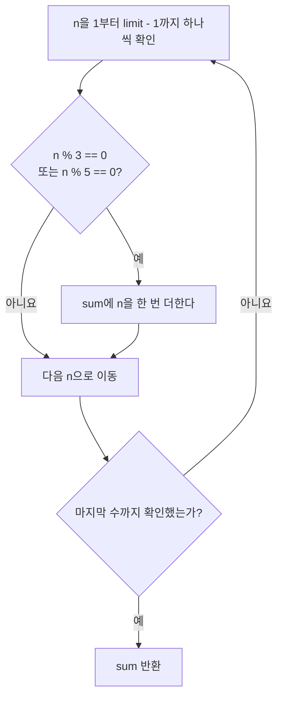
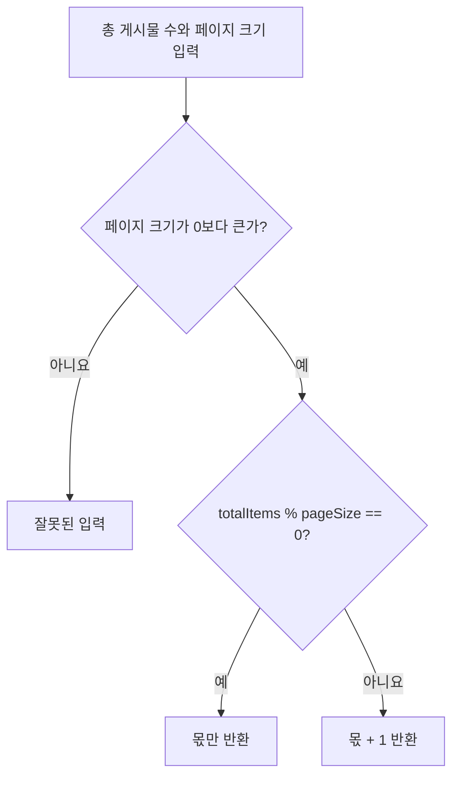

# 07_20 Java 조건문과 반복문으로 문제 풀기: 배수 합과 페이지 수

> 학습 범위: 점프 투 자바 08-02, 08-03  
> 핵심 키워드: `%`, `for`, `if`, `||`, 누적 변수, 정수 나눗셈, 올림, 경계 조건

## 1. 이번 문제에서 익힐 사고 과정

문제를 풀 때 처음부터 코드를 쓰기보다 다음 순서로 생각하면 실수가 줄어든다.

1. **입력과 출력**을 한 문장으로 정리한다.
2. 모든 경우를 나열해 **규칙**을 찾는다.
3. 숫자가 정확히 나누어떨어지는지처럼 **경계 조건**을 따로 확인한다.
4. 작은 입력으로 손으로 결과를 계산한 뒤 코드의 결과와 비교한다.

이번 노트는 그 과정을 두 문제에 적용한다.

| 문제 | 입력 | 출력 | 핵심 규칙 |
| --- | --- | --- | --- |
| 3과 5의 배수 합 | 상한값 `limit` | `limit` 미만의 3 또는 5의 배수 합 | 나머지가 0인지, 중복 없이 한 번만 더하는지 |
| 게시판 페이지 수 | 게시물 수, 페이지당 게시물 수 | 필요한 총 페이지 수 | 나누어떨어질 때는 추가 페이지가 없는지 |

## 2. 문제 1: 3과 5의 배수 합하기

### 2.1 문제를 작게 바꿔 보기

`10` 미만의 자연수 중 3 또는 5의 배수는 `3`, `5`, `6`, `9`다. 합은 `23`이다.

```text
1  2  [3]  4  [5]  [6]  7  8  [9]
```

상한값이 `1000`이면 살펴볼 수는 `1`부터 `999`까지다. `1000 미만`이라는 말은 `1000` 자체를 포함하지 않는다는 뜻이므로 반복 조건은 `n < 1000`이 된다.

### 2.2 배수인지 확인하는 방법: 나머지 연산자 `%`

`%`는 나누고 남은 값을 구한다.

| 식 | 결과 | 뜻 |
| --- | --- | --- |
| `9 % 3` | `0` | 9는 3으로 나누어떨어진다. 즉 3의 배수다. |
| `10 % 3` | `1` | 10은 3의 배수가 아니다. |
| `20 % 5` | `0` | 20은 5의 배수다. |

따라서 어떤 정수 `n`이 3의 배수인지 확인하는 조건은 `n % 3 == 0`이다. 5의 배수 조건은 `n % 5 == 0`이다.

### 2.3 겹치는 수를 두 번 더하지 않기

`15`는 3의 배수이면서 동시에 5의 배수다. 다음처럼 `if`를 둘로 나누면 `15`를 두 번 더하는 문제가 생긴다.

```java
if (n % 3 == 0) {
    sum += n;
}

if (n % 5 == 0) {
    sum += n; // n이 15이면 여기서 한 번 더 더해진다.
}
```

원하는 것은 “3의 배수 **또는** 5의 배수이면 한 번 더하기”다. 하나의 조건에 논리 OR 연산자 `||`를 사용하면 숫자 하나당 `sum += n`은 최대 한 번만 실행된다.



### 2.4 단계별 코드

먼저 합을 저장할 변수를 0으로 준비한다. 이런 변수를 **누적 변수(accumulator)**라고 부른다.

```java
int sum = 0;
```

그다음 `1`부터 상한값 바로 전까지 반복한다.

```java
for (int n = 1; n < limit; n++) {
    // n을 검사한다.
}
```

마지막으로 조건을 만족할 때만 누적 변수에 더한다.

```java
for (int n = 1; n < limit; n++) {
    if (n % 3 == 0 || n % 5 == 0) {
        sum += n;
    }
}
```

### 2.5 완성 메서드와 손으로 검증하기

```java
public static int sumMultiplesBelow(int limit) {
    int sum = 0;

    for (int n = 1; n < limit; n++) {
        if (n % 3 == 0 || n % 5 == 0) {
            sum += n;
        }
    }

    return sum;
}
```

`limit`이 10일 때 반복 중 `sum`이 어떻게 달라지는지 살펴보자.

| n | 3 또는 5의 배수인가? | sum |
| --- | --- | --- |
| 1, 2 | 아니요 | 0 |
| 3 | 예 | 3 |
| 4 | 아니요 | 3 |
| 5 | 예 | 8 |
| 6 | 예 | 14 |
| 7, 8 | 아니요 | 14 |
| 9 | 예 | 23 |

따라서 `sumMultiplesBelow(10)`의 결과는 `23`이다. `sumMultiplesBelow(1000)`은 `233168`을 반환한다.

### 2.6 `||`와 `else if` 중 무엇을 쓸까?

이 문제에서는 다음 두 방식이 같은 결과를 만든다.

```java
if (n % 3 == 0 || n % 5 == 0) {
    sum += n;
}
```

```java
if (n % 3 == 0) {
    sum += n;
} else if (n % 5 == 0) {
    sum += n;
}
```

첫 번째는 “둘 중 하나면 더한다”는 문제의 규칙을 그대로 표현하므로 더 읽기 쉽다. 두 번째도 첫 `if`가 참이면 `else if`를 건너뛰므로 중복 합산이 일어나지 않는다.

## 3. 문제 2: 게시판의 총 페이지 수 구하기

### 3.1 페이지는 왜 ‘올림’이 필요할까?

게시물 25개를 한 페이지에 10개씩 보여 주면 다음 세 페이지가 필요하다.

```text
1페이지: 1~10번 게시물
2페이지: 11~20번 게시물
3페이지: 21~25번 게시물
```

마지막 페이지에는 5개만 있어도 페이지 하나가 필요하다. 그래서 페이지 수는 단순히 나눈 몫이 아니라, 나머지가 있으면 한 페이지를 더한 값이다.

| 총 게시물 수 `totalItems` | 페이지 크기 `pageSize` | `totalItems / pageSize` | 나머지 | 필요한 페이지 수 |
| --- | --- | --- | --- | --- |
| 5 | 10 | 0 | 5 | 1 |
| 15 | 10 | 1 | 5 | 2 |
| 25 | 10 | 2 | 5 | 3 |
| 30 | 10 | 3 | 0 | 3 |

### 3.2 Java의 정수 나눗셈 이해하기

두 피연산자가 모두 `int`이면 Java는 소수점 아래를 버린 정수 몫을 만든다.

```java
System.out.println(25 / 10); // 2
System.out.println(25 % 10); // 5
```

그래서 `totalItems / pageSize + 1`을 항상 사용하면 문제가 생긴다. `30 / 10 + 1`은 `4`지만, 게시물 30개를 10개씩 넣으면 페이지는 정확히 3개다.

### 3.3 가장 읽기 쉬운 풀이

나머지가 0이면 몫만 반환하고, 나머지가 있으면 몫에 1을 더한다.

```java
public static int getTotalPages(int totalItems, int pageSize) {
    if (totalItems % pageSize == 0) {
        return totalItems / pageSize;
    }

    return totalItems / pageSize + 1;
}
```



### 3.4 더 짧은 올림 나눗셈 식

양의 정수에 대해서는 다음 식도 같은 결과를 만든다.

```java
(totalItems + pageSize - 1) / pageSize
```

예를 들어 25개를 10개씩 나누면 `(25 + 10 - 1) / 10`, 즉 `34 / 10`이므로 정수 나눗셈 결과는 `3`이다. 30개라면 `(30 + 10 - 1) / 10`, 즉 `39 / 10`이므로 `3`이다.

하지만 처음에는 조건문 버전이 “왜 나머지가 있을 때만 한 페이지가 더 필요한가”를 더 잘 보여 준다. 짧은 식을 외우기보다 먼저 규칙을 이해하는 편이 좋다.

### 3.5 입력 조건도 확인하기

페이지 크기가 0이면 나눗셈을 할 수 없다. 음수 게시물 수나 음수 페이지 크기는 일반적인 게시판 규칙에 맞지 않는다. 메서드의 사용 조건을 분명히 하거나 잘못된 입력을 막아야 한다.

```java
public static int getTotalPages(int totalItems, int pageSize) {
    if (totalItems < 0) {
        throw new IllegalArgumentException("게시물 수는 0 이상이어야 합니다.");
    }
    if (pageSize <= 0) {
        throw new IllegalArgumentException("페이지 크기는 1 이상이어야 합니다.");
    }

    if (totalItems == 0) {
        return 0;
    }

    return (totalItems + pageSize - 1) / pageSize;
}
```

여기서는 게시물이 0개면 필요한 페이지 수도 0개라고 정했다. 실제 서비스에서는 빈 목록도 첫 페이지 URL로 보여 줄 수 있으므로, 화면 표시 규칙과 계산 결과는 별도로 결정할 수 있다.

## 4. 두 문제를 하나의 프로그램으로 실행하기

아래 코드는 두 문제를 메서드로 분리한 완전한 예제다. `main`은 결과를 확인하는 역할만 하고, 실제 계산 규칙은 각 메서드에 둔다.

```java
public class ConditionLoopProblemExample {

    public static int sumMultiplesBelow(int limit) {
        int sum = 0;

        for (int n = 1; n < limit; n++) {
            if (n % 3 == 0 || n % 5 == 0) {
                sum += n;
            }
        }

        return sum;
    }

    public static int getTotalPages(int totalItems, int pageSize) {
        if (totalItems < 0) {
            throw new IllegalArgumentException("게시물 수는 0 이상이어야 합니다.");
        }
        if (pageSize <= 0) {
            throw new IllegalArgumentException("페이지 크기는 1 이상이어야 합니다.");
        }

        return (totalItems + pageSize - 1) / pageSize;
    }

    public static void main(String[] args) {
        System.out.println(sumMultiplesBelow(10));    // 23
        System.out.println(sumMultiplesBelow(1000));  // 233168

        System.out.println(getTotalPages(5, 10));     // 1
        System.out.println(getTotalPages(15, 10));    // 2
        System.out.println(getTotalPages(25, 10));    // 3
        System.out.println(getTotalPages(30, 10));    // 3
        System.out.println(getTotalPages(0, 10));     // 0
    }
}
```

## 5. 문제 풀이에서 자주 하는 실수

### 5.1 두 조건을 따로 더해 중복 합산하기

3과 5의 공배수인 15, 30, 45 등을 두 번 더하면 답이 커진다. 한 `if`에 `||`를 쓰거나 두 번째 조건을 `else if`로 연결한다.

### 5.2 `limit <= n`으로 상한값을 포함하기

“1000 미만”은 1000을 포함하지 않는다. 반복 조건은 `n < 1000`이다. 반대로 “1000 이하”라면 `n <= 1000`이다.

### 5.3 페이지 수에 무조건 1 더하기

`30`개를 `10`개씩 나누면 나머지가 0이므로 네 번째 페이지가 필요 없다. 몫만으로 충분한 경우를 반드시 테스트한다.

### 5.4 `double`과 `int`를 섞어 의미를 흐리기

`Math.ceil((double) totalItems / pageSize)`도 페이지 수를 구할 수 있다. 하지만 정수 나눗셈과 나머지 연산을 배우는 단계에서는 조건문 또는 정수 올림 나눗셈이 규칙을 더 분명하게 보여 준다.

### 5.5 나눗셈의 분모가 0인 경우를 잊기

`pageSize`가 0이면 `ArithmeticException`이 발생한다. 메서드 시작에서 입력값을 검사하면 원인을 더 분명하게 알릴 수 있다.

## 6. 스스로 점검하기

1. `sumMultiplesBelow(16)`의 결과는 무엇일까? 포함되는 수를 직접 적어 보자.
2. `if (n % 3 == 0)`와 `if (n % 5 == 0)`을 나란히 쓰면 `n = 15`에서 왜 문제가 될까?
3. `getTotalPages(40, 10)`의 결과는 왜 4일까?
4. `getTotalPages(41, 10)`의 결과는 왜 5일까?
5. 페이지 수를 계산할 때 `pageSize <= 0`을 막아야 하는 이유는 무엇일까?

### 정답

1. `60`이다. 포함되는 수는 `3`, `5`, `6`, `9`, `10`, `12`, `15`다.
2. 15는 3과 5 모두로 나누어떨어져 `sum`에 두 번 더해진다.
3. 40은 10으로 정확히 나누어떨어지므로 마지막에 남는 게시물이 없다.
4. 4페이지에 40개를 넣고 1개가 남으므로 5페이지가 필요하다.
5. 0으로 나누는 연산은 불가능하며, 음수 페이지 크기도 게시판 규칙에 맞지 않기 때문이다.

## 7. 핵심 정리

- `%`의 결과가 0이면 해당 수로 나누어떨어진다.
- `||`는 둘 중 하나가 참이면 참이므로 3 또는 5의 배수를 한 번만 누적할 수 있다.
- 누적 변수는 반복하면서 계산 결과를 계속 저장하는 변수다.
- Java의 `int / int`는 소수점 아래를 버린 몫을 만든다.
- 페이지 수는 나머지가 있을 때만 한 페이지를 추가해야 한다.
- 경계 조건인 상한값 포함 여부, 공배수, 나누어떨어짐, 0 입력을 테스트하면 많은 오류를 막을 수 있다.

## 참고 자료

- 점프 투 자바, 08-02 3과 5의 배수 합하기: <https://wikidocs.net/237>
- 점프 투 자바, 08-03 게시판 페이징하기: <https://wikidocs.net/156670>
