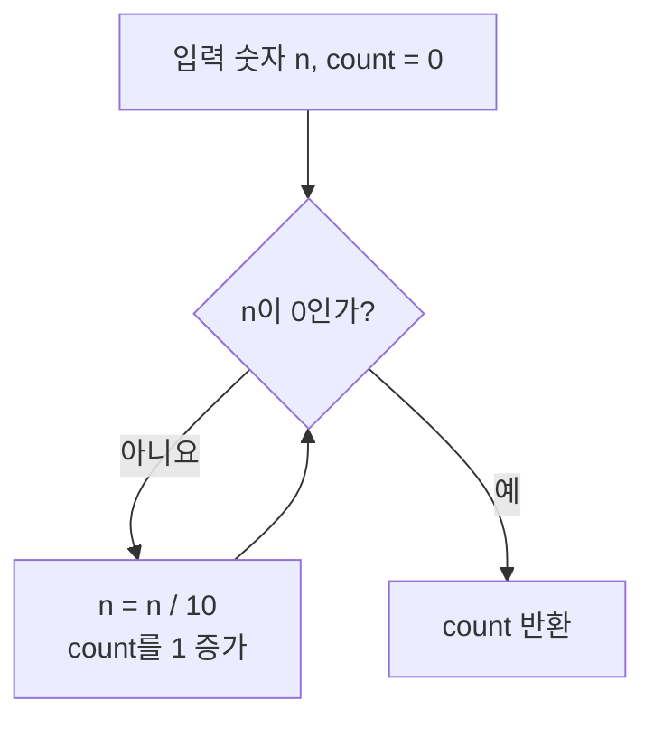
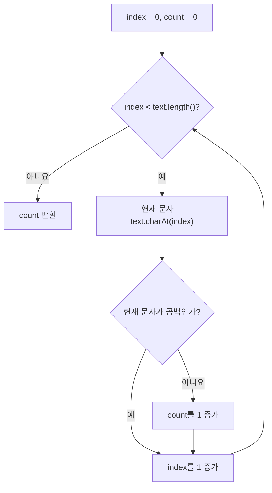

# 07_21 Java 숫자와 문자열을 한 칸씩 다루기: 자릿수와 공백 제외 글자 수

> 학습 범위: 점프 투 자바 08-04, 08-05
> 핵심 키워드: 정수 나눗셈, `%`, `while`, `String.valueOf`, `length()`, `charAt()`, 문자 리터럴

## 1. 이번 문제의 공통점

겉으로는 서로 다른 두 문제지만, 둘 다 대상을 한 칸씩 살피며 답을 누적하는 문제다.

| 문제 | 하나씩 살피는 대상 | 한 번 처리할 때 하는 일 | 종료 조건 |
| --- | --- | --- | --- |
| 자릿수 구하기 | 숫자의 마지막 자리 | 10으로 나누어 마지막 자리를 없앤다 | 숫자가 0이 된다 |
| 공백 제외 글자 수 | 문자열의 각 문자 | 공백이 아니면 개수를 1 늘린다 | 마지막 인덱스까지 확인한다 |

문제를 풀 때는 먼저 “무엇을 한 번씩 살필 것인가?”, “한 번 살핀 뒤 상태가 어떻게 바뀌는가?”, “언제 멈출 것인가?”를 정하면 좋다.

## 2. 문제 1: 양의 정수의 자릿수 구하기

### 2.1 10으로 나누면 마지막 자리가 사라진다

`int`끼리 나누면 Java는 소수점 아래를 버린다. 따라서 123을 10으로 나누면 12가 된다.

```java
System.out.println(123 / 10); // 12
System.out.println(12 / 10);  // 1
System.out.println(1 / 10);   // 0
```

나누기를 한 번 할 때마다 오른쪽 끝 숫자 하나가 없어진다.

```text
1234 / 10 = 123  -> 4 제거, 1회
 123 / 10 = 12   -> 3 제거, 2회
  12 / 10 = 1    -> 2 제거, 3회
   1 / 10 = 0    -> 1 제거, 4회
```

0이 될 때까지 나눈 횟수는 원래 숫자의 자릿수와 같다.



### 2.2 반복문으로 구현하기

```java
public static int getDigitCount(int number) {
    int count = 0;

    while (number > 0) {
        number = number / 10;
        count++;
    }

    return count;
}
```

`number`에는 원래 값이 아니라, 반복 과정에서 점점 짧아지는 값을 저장한다. 원래 값을 나중에 써야 한다면 별도의 변수에 복사해 두는 편이 좋다.

### 2.3 0과 음수도 생각하기

원문 문제는 양의 정수를 전제로 한다. 하지만 `0`을 넣으면 위 반복문은 한 번도 실행되지 않아 0을 반환한다. 보통 숫자 `0`은 한 자리이므로 이 경우를 따로 처리해야 한다.

음수는 `-123`처럼 부호를 제외하면 3자리다. 음수를 허용할지, 입력 오류로 볼지는 메서드의 약속에 따라 결정한다. 아래 예제는 0과 음수를 모두 처리한다.

```java
public static int getDigitCount(int number) {
    if (number == 0) {
        return 1;
    }

    long value = Math.abs((long) number);
    int count = 0;

    while (value > 0) {
        value = value / 10;
        count++;
    }

    return count;
}
```

`(long) number`로 먼저 바꾸는 이유가 있다. `int`의 최솟값인 `-2147483648`은 양수 `2147483648`로 `int`에 담을 수 없어서, `Math.abs(number)`만 쓰면 예외적인 결과가 생길 수 있다. `long`으로 넓힌 뒤 절댓값을 구하면 안전하다.

### 2.4 문자열로 바꾸어 길이 구하기

숫자를 문자열로 바꾼 뒤 `length()`를 구하는 방법도 있다.

```java
public static int getDigitCountWithString(int number) {
    return String.valueOf(number).length();
}
```

다만 음수에서는 `String.valueOf(-123)`이 `"-123"`이므로 길이가 4가 된다. 숫자 자리만 세려면 부호를 제거해야 한다.

```java
public static int getDigitCountWithString(int number) {
    long value = Math.abs((long) number);
    return String.valueOf(value).length();
}
```

두 방법의 차이는 다음과 같다.

| 방법 | 장점 | 생각해 볼 점 |
| --- | --- | --- |
| 10으로 반복 나누기 | 자릿수의 원리를 직접 이해할 수 있다 | 0, 음수 같은 경계 조건을 다뤄야 한다 |
| 문자열 변환 후 `length()` | 코드가 짧고 읽기 쉽다 | 숫자가 문자열로 바뀌며, 부호는 별도로 처리해야 한다 |

둘 중 하나만 절대적으로 맞는 것은 아니다. “숫자의 자리를 하나씩 제거하는 과정”을 연습하려면 나누기, 단순히 자릿수가 필요하면 문자열 변환이 실용적이다.

## 3. 문제 2: 공백을 제외한 글자 수 세기

### 3.1 문자열의 위치는 0부터 시작한다

문자열은 여러 문자가 순서대로 모인 값이다. 각 문자에는 **인덱스(index)**라는 위치 번호가 붙으며, 첫 번째 위치는 0이다.

```text
문자열:  점 프 [공백] 투 [공백] 자 바
인덱스:  0 1    2    3    4    5    6
```

```java
String text = "점프 투 자바";

System.out.println(text.length());  // 7: 공백도 문자 하나로 센다.
System.out.println(text.charAt(0)); // 점
System.out.println(text.charAt(2)); // 공백
```

- `length()`는 문자열에 들어 있는 문자의 개수를 반환한다.
- `charAt(i)`는 인덱스 `i` 위치의 문자 하나를 `char`로 반환한다.
- 마지막 문자의 인덱스는 `length() - 1`이다.

### 3.2 공백이 아닌 문자만 세기

문자열의 처음부터 끝까지 한 글자씩 확인한다. 현재 문자가 공백이 아니면 누적 변수 `count`를 증가시키면 된다.

```java
public static int countNonSpaceCharacters(String text) {
    int count = 0;

    for (int index = 0; index < text.length(); index++) {
        if (text.charAt(index) != ' ') {
            count++;
        }
    }

    return count;
}
```

여기서 `' '`는 공백 문자 하나를 뜻하는 `char` 리터럴이다. Java에서 작은따옴표는 문자 하나, 큰따옴표는 문자열을 표현한다.

```java
char space = ' ';
String word = " ";
```

`charAt(index) != " "`처럼 문자와 문자열을 비교하면 타입이 달라 컴파일할 수 없다.



### 3.3 예시를 따라가 보기

`"hi java"`를 입력하면 `length()`는 7이다. 하지만 가운데 공백 하나는 빼야 하므로 결과는 6이다.

| index | `charAt(index)` | 공백인가? | count |
| --- | --- | --- | --- |
| 0 | `h` | 아니요 | 1 |
| 1 | `i` | 아니요 | 2 |
| 2 | 공백 | 예 | 2 |
| 3 | `j` | 아니요 | 3 |
| 4 | `a` | 아니요 | 4 |
| 5 | `v` | 아니요 | 5 |
| 6 | `a` | 아니요 | 6 |

### 3.4 공백 문자에는 여러 종류가 있다

`' '`는 일반적인 띄어쓰기 하나만 뜻한다. 탭(`\t`)이나 줄 바꿈(`\n`)까지 모두 제외하고 싶을 때는 `Character.isWhitespace()`를 사용할 수 있다.

```java
public static int countNonWhitespaceCharacters(String text) {
    int count = 0;

    for (int index = 0; index < text.length(); index++) {
        if (!Character.isWhitespace(text.charAt(index))) {
            count++;
        }
    }

    return count;
}
```

| 입력 | `' '`만 제외 | 모든 공백 문자 제외 |
| --- | --- | --- |
| `"hi java"` | 6 | 6 |
| `"hi\tjava"` | 7 | 6 |
| `"hi\njava"` | 7 | 6 |

문제에서 말하는 “공백”의 범위를 먼저 확인하는 습관이 중요하다. 단순 띄어쓰기만 제외하라는 문제라면 `' '` 비교가 가장 직접적이다.

## 4. 완성 예제

두 문제를 한 클래스에 모아 실행해 보자.

```java
public class NumberAndStringTraversalExample {

    public static int getDigitCount(int number) {
        if (number == 0) {
            return 1;
        }

        long value = Math.abs((long) number);
        int count = 0;

        while (value > 0) {
            value = value / 10;
            count++;
        }

        return count;
    }

    public static int countNonSpaceCharacters(String text) {
        int count = 0;

        for (int index = 0; index < text.length(); index++) {
            if (text.charAt(index) != ' ') {
                count++;
            }
        }

        return count;
    }

    public static void main(String[] args) {
        System.out.println(getDigitCount(3));       // 1
        System.out.println(getDigitCount(7876));    // 4
        System.out.println(getDigitCount(0));       // 1
        System.out.println(getDigitCount(-123));    // 3

        System.out.println(countNonSpaceCharacters("점프 투 자바")); // 5
        System.out.println(countNonSpaceCharacters("hi java"));     // 6
    }
}
```

## 5. 자주 하는 실수

### 5.1 `while (number >= 0)` 사용하기

0이 된 뒤에도 조건이 계속 참이라 반복문이 끝나지 않는다. 숫자를 계속 10으로 나누는 방식에서는 `number > 0`이 알맞다. 0의 자릿수는 반복 전에 따로 처리한다.

### 5.2 문자열 범위를 하나 넘어가기

```java
for (int index = 0; index <= text.length(); index++) {
    text.charAt(index); // 마지막 반복에서 범위를 벗어난다.
}
```

마지막 인덱스는 `text.length() - 1`이므로, 반복 조건은 `index < text.length()`이어야 한다.

### 5.3 `char`와 `String`을 섞어 쓰기

`text.charAt(index)`의 결과는 문자 하나인 `char`다. 공백 하나와 비교할 때는 작은따옴표를 사용한다.

```java
text.charAt(index) != ' '  // 올바른 비교
```

### 5.4 `null` 문자열을 처리하지 않기

`text`가 `null`이면 `text.length()`에서 `NullPointerException`이 발생한다. 이 노트의 예제는 문자열이 반드시 전달된다고 가정한다. 실제 프로그램에서는 `null`을 허용하지 않는다는 약속을 정하거나, 메서드 시작에서 검사한다.

```java
if (text == null) {
    throw new IllegalArgumentException("문자열은 null일 수 없습니다.");
}
```

## 6. 핵심 정리

- 정수를 10으로 나누면 마지막 자리가 제거된다. 0이 될 때까지 나눈 횟수로 자릿수를 구할 수 있다.
- `int / int`는 정수 몫을 구하므로 `123 / 10`은 12다.
- 0과 음수는 원문 문제의 범위 밖일 수 있으므로, 메서드가 어떻게 다룰지 명확히 정한다.
- 문자열 인덱스는 0부터 시작하고, 마지막 인덱스는 `length() - 1`이다.
- `charAt()`은 문자 하나(`char`)를 반환한다. 공백 문자 하나는 `' '`로 비교한다.
- 단순 띄어쓰기만 제외할지, 탭과 줄 바꿈도 제외할지에 따라 조건을 다르게 작성한다.

## 7. 확인 문제

1. `getDigitCount(1000)`이 4를 반환하는 과정을 설명해 보자.
2. `getDigitCount(0)`을 특별히 처리하지 않으면 어떤 값이 반환될까?
3. `"a b"`에서 `length()`는 얼마이며, 공백 제외 글자 수는 얼마일까?
4. `charAt(text.length())`가 왜 오류인지 설명해 보자.
5. 탭과 줄 바꿈까지 제외하려면 어떤 메서드를 사용할 수 있을까?

### 정답

1. `1000 → 100 → 10 → 1 → 0`으로 네 번 나눈다.
2. 반복문이 한 번도 실행되지 않아 0이 반환된다.
3. 전체 길이는 3, 공백 제외 글자 수는 2다.
4. 유효한 인덱스는 0부터 `text.length() - 1`까지이기 때문이다.
5. `Character.isWhitespace()`를 사용할 수 있다.

## 참고 자료

- 점프 투 자바, 08-04 자릿수 구하기: <https://wikidocs.net/156689>
- 점프 투 자바, 08-05 공백을 제외한 글자 수 세기: <https://wikidocs.net/156695>
