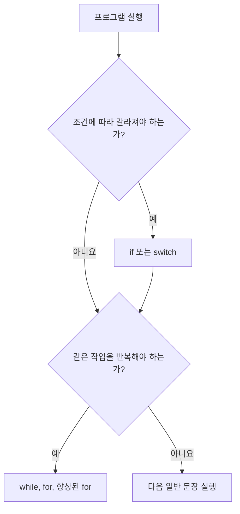

# 07_22 Java 제어문: 조건에 따라 선택하고, 필요한 만큼 반복하기

> 학습 범위: 점프 투 자바 04-01~04-05
> 핵심 키워드: `if`, `else`, `switch`, `while`, `for`, 향상된 `for`, `break`, `continue`

## 1. 제어문이란?

변수와 객체가 프로그램의 재료라면, **제어문**은 그 재료를 어떤 순서로 사용할지 정하는 도구다. Java 코드는 기본적으로 위에서 아래로 한 줄씩 실행되지만, 실제 프로그램은 늘 같은 길만 가지 않는다.

- 로그인에 성공했을 때만 다음 화면으로 이동한다.
- 장바구니가 비어 있으면 주문을 막는다.
- 목록의 모든 상품을 하나씩 확인한다.
- 사용자가 종료를 선택할 때까지 메뉴를 반복해서 보여 준다.

제어문은 크게 두 질문에 답한다.

| 질문 | 사용하는 제어문 |
| --- | --- |
| 이 조건일 때 어떤 코드를 실행할까? | `if`, `switch` |
| 이 작업을 몇 번 반복할까? | `while`, `for`, 향상된 `for` |



## 2. `if`: 조건이 참일 때만 실행하기

`if`의 괄호 안에는 결과가 `true` 또는 `false`인 조건식을 쓴다.

```java
if (condition) {
    // condition이 true일 때 실행한다.
}
```

```java
int age = 15;

if (age >= 14) {
    System.out.println("가입할 수 있습니다.");
}
```

조건이 거짓이면 중괄호 안의 코드는 건너뛴다. Java에서는 `if (age)`처럼 정수 자체를 조건으로 쓸 수 없다. 반드시 비교 연산자 등으로 `boolean` 결과를 만들어야 한다.

### 2.1 `else`: 조건이 거짓일 때의 길

둘 중 하나만 선택해야 하면 `else`를 사용한다.

```java
int score = 70;

if (score >= 60) {
    System.out.println("합격");
} else {
    System.out.println("재도전");
}
```

### 2.2 `else if`: 여러 조건을 순서대로 검사하기

등급처럼 여러 경우 중 하나를 선택할 때 사용한다.

```java
int score = 87;
String grade;

if (score >= 90) {
    grade = "A";
} else if (score >= 80) {
    grade = "B";
} else if (score >= 70) {
    grade = "C";
} else {
    grade = "D";
}

System.out.println(grade); // B
```

`else if`는 위에서부터 차례대로 검사하고, 처음으로 참이 된 블록 하나만 실행한다. 그래서 범위가 넓은 조건을 먼저 쓰면 문제가 생긴다.

```java
// 잘못된 순서: 90점도 score >= 70을 먼저 만족한다.
if (score >= 70) {
    grade = "C";
} else if (score >= 80) {
    grade = "B";
} else if (score >= 90) {
    grade = "A";
}
```

상한선이 아니라 하한선을 비교한다면, 높은 기준부터 낮은 기준 순으로 작성한다.

### 2.3 논리 연산자와 조건 조합

| 연산자 | 뜻 | 예시 |
| --- | --- | --- |
| `&&` | 둘 다 참 | `age >= 14 && age <= 19` |
| `||` | 하나 이상 참 | `role.equals("ADMIN") || role.equals("MANAGER")` |
| `!` | 참과 거짓 반전 | `!isLoggedIn` |

```java
boolean isMember = true;
int price = 30000;

if (isMember && price >= 20000) {
    System.out.println("회원 할인 적용");
}
```

문자열을 비교할 때는 `==` 대신 `equals()`를 사용한다. `==`는 문자열 내용이 아닌 객체가 같은지 비교할 수 있기 때문이다.

```java
String role = "ADMIN";

if ("ADMIN".equals(role)) {
    System.out.println("관리자 메뉴를 보여 줍니다.");
}
```

문자열 상수 쪽에서 `equals()`를 호출하면 `role`이 `null`이어도 `NullPointerException`을 피할 수 있다.

## 3. `switch`: 하나의 값에 따라 여러 갈래 선택하기

같은 변수의 값이 여러 상수 중 무엇인지 비교할 때 `switch`가 읽기 쉬울 수 있다.

```java
int month = 2;
String season;

switch (month) {
    case 12:
    case 1:
    case 2:
        season = "겨울";
        break;
    case 3:
    case 4:
    case 5:
        season = "봄";
        break;
    default:
        season = "그 외 계절";
}

System.out.println(season); // 겨울
```

### 3.1 `break`를 빼면 어떻게 될까?

전통적인 `switch`는 일치한 `case`부터 아래로 계속 실행하는 **fall-through** 특성이 있다. 대부분의 경우 각 경우를 처리한 뒤 `break`로 빠져나와야 한다.

```java
int menu = 1;

switch (menu) {
    case 1:
        System.out.println("커피");
        // break가 없으면 case 2도 이어서 실행된다.
    case 2:
        System.out.println("차");
        break;
    default:
        System.out.println("없는 메뉴");
}
```

출력은 `커피`, `차`가 된다. 위의 계절 예제처럼 의도적으로 여러 `case`를 묶을 때는 fall-through를 활용할 수 있지만, 각 블록에 실행 코드가 있다면 `break`를 확인하는 습관이 필요하다.

### 3.2 언제 `if`와 `switch`를 선택할까?

| 상황 | 더 자연스러운 선택 |
| --- | --- |
| 점수 범위, 크기 비교, 여러 조건 조합 | `if - else if` |
| 메뉴 번호, 요일, 상태 코드처럼 하나의 값이 정해진 경우 | `switch` |

`switch`는 `int`, `char`, `String`, `enum` 등의 값과 함께 쓸 수 있다. “50점 이상”처럼 범위를 검사하는 일에는 `if`가 알맞다.

## 4. `while`: 조건이 참인 동안 반복하기

`while`은 반복 횟수를 미리 정확히 알 수 없고, 어떤 상태가 바뀔 때까지 계속해야 할 때 적합하다.

```java
while (condition) {
    // condition이 true인 동안 반복한다.
}
```

```java
int number = 1;

while (number <= 5) {
    System.out.println(number);
    number++;
}
```

이 코드는 `1`부터 `5`까지 출력한다. `number++`를 빼면 `number`가 계속 1이라 조건이 영원히 참이 되어 무한 반복이 된다.

### 4.1 `break`: 반복문을 즉시 끝내기

```java
int number = 1;

while (true) {
    if (number == 4) {
        break;
    }
    System.out.println(number);
    number++;
}
```

`while (true)`는 스스로 끝나지 않는 반복문이다. 이 경우 반드시 어느 지점에서 `break`, `return`, 예외 발생 등으로 빠져나오는 길이 있어야 한다.

### 4.2 `continue`: 이번 회차만 건너뛰기

```java
for (int number = 1; number <= 5; number++) {
    if (number == 3) {
        continue;
    }
    System.out.println(number);
}
```

`continue`를 만나면 반복문 전체를 끝내는 것이 아니라, 현재 회차의 남은 코드를 건너뛰고 다음 회차로 이동한다. 출력은 `1`, `2`, `4`, `5`다.

## 5. `for`: 시작, 조건, 변화가 한눈에 보이는 반복문

반복 횟수나 인덱스의 변화가 분명할 때는 `for`가 읽기 좋다.

```java
for (초기화; 계속할 조건; 반복 후 변화) {
    // 반복할 코드
}
```

```java
int sum = 0;

for (int number = 1; number <= 10; number++) {
    sum += number;
}

System.out.println(sum); // 55
```

위 코드는 다음 `while`과 같은 의미다.

```java
int sum = 0;
int number = 1;

while (number <= 10) {
    sum += number;
    number++;
}
```

`for`는 초기화, 조건, 증가식이 한 줄에 있어 반복 규칙을 확인하기 쉽다. 반면 사용자 입력이 올 때까지 기다리는 메뉴처럼 반복 횟수를 미리 알 수 없는 경우에는 `while`이 더 자연스럽다.

### 5.1 배열 인덱스로 순회하기

```java
String[] fruits = {"apple", "banana", "orange"};

for (int index = 0; index < fruits.length; index++) {
    System.out.println(index + ": " + fruits[index]);
}
```

배열의 마지막 인덱스는 `length - 1`이다. 그래서 `index <= fruits.length`가 아니라 `index < fruits.length`를 사용해야 범위를 벗어나지 않는다.

## 6. 향상된 `for`: 모든 원소를 하나씩 읽기

향상된 `for`는 배열이나 컬렉션의 원소를 처음부터 끝까지 하나씩 읽을 때 쓴다.

```java
for (자료형 변수 : 배열_또는_컬렉션) {
    // 변수에 원소 하나가 차례로 들어온다.
}
```

```java
String[] fruits = {"apple", "banana", "orange"};

for (String fruit : fruits) {
    System.out.println(fruit);
}
```

인덱스가 필요하지 않고 모든 원소를 읽기만 하면 향상된 `for`가 간결하다. 반대로 “두 번째 원소만 바꾸기”, “현재 인덱스 출력하기”처럼 위치가 필요하면 일반 `for`가 더 적합하다.

| 목적 | 적합한 반복문 |
| --- | --- |
| 일정한 횟수, 인덱스 필요 | 일반 `for` |
| 조건이 바뀔 때까지 반복 | `while` |
| 배열·컬렉션의 모든 원소를 읽기 | 향상된 `for` |

## 7. 제어문을 함께 써 보기

아래 예제는 점수 배열을 순회하며 유효한 점수만 합산하고, 평균에 따라 등급을 정한다.

```java
public class ControlFlowExample {

    public static void main(String[] args) {
        int[] scores = {90, 75, -1, 85};
        int sum = 0;
        int count = 0;

        for (int score : scores) {
            if (score < 0 || score > 100) {
                continue;
            }

            sum += score;
            count++;
        }

        if (count == 0) {
            System.out.println("계산할 점수가 없습니다.");
            return;
        }

        int average = sum / count;
        String grade;

        if (average >= 90) {
            grade = "A";
        } else if (average >= 80) {
            grade = "B";
        } else if (average >= 70) {
            grade = "C";
        } else {
            grade = "D";
        }

        System.out.println("평균: " + average);
        System.out.println("등급: " + grade);
    }
}
```

이 예제에서 `-1`은 유효하지 않은 점수이므로 `continue`로 합계 계산을 건너뛴다. 유효한 점수는 90, 75, 85이며 평균은 83이므로 등급은 B다.

## 8. 자주 하는 실수

1. `if` 조건에 `=`를 사용하기: 비교는 `==`, 대입은 `=`이다.
2. 높은 점수 등급을 뒤에 쓰기: `else if`는 처음 참인 조건 하나만 실행한다.
3. `switch`의 `break`를 빠뜨리기: 다음 `case`까지 이어서 실행될 수 있다.
4. 반복 변수의 변화를 빼먹기: `while`에서 무한 반복이 된다.
5. 배열 길이와 마지막 인덱스를 혼동하기: `index < array.length`를 사용한다.
6. 향상된 `for`에서 원소를 바꿀 수 있다고 생각하기: 반복 변수에 새 값을 넣어도 배열 원소 자체는 바뀌지 않는다.

## 9. 핵심 정리

- `if`는 조건식의 참·거짓에 따라 실행 흐름을 나눈다.
- 여러 범위를 검사할 때는 더 구체적이거나 높은 기준을 먼저 검사한다.
- `switch`는 하나의 값에 따른 여러 선택지에 적합하며, 일반적으로 각 `case` 뒤에 `break`가 필요하다.
- `while`은 종료 조건과 상태 변화를 반드시 함께 설계해야 한다.
- `for`는 반복 횟수나 인덱스 변화가 명확할 때 읽기 쉽다.
- 향상된 `for`는 배열·컬렉션의 원소를 하나씩 읽을 때 간결하다.
- `break`는 반복 전체를 끝내고, `continue`는 현재 회차만 건너뛴다.

## 참고 자료

- 점프 투 자바, 04장 제어문 이해하기: <https://wikidocs.net/189>
