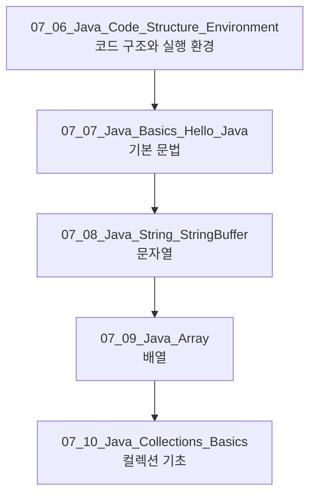

# Java 학습 노트 읽는 순서

이 폴더는 SSAFY 강의 정리 노트와 Wikidocs 보충 노트를 함께 둔다. 기존 강의 노트는 수업 흐름과 실습 맥락이 살아 있고, 새로 추가한 보충 노트는 강의에서 상대적으로 짧게 지나간 개념을 더 자세히 설명한다.

오늘이 2026년 7월 10일이므로, Java 입문 정리 노트는 07_10을 포함하도록 정렬했다. 날짜는 실제 강의 날짜라기보다 TIL 안에서 읽는 순서를 맞추기 위한 prefix다.

## 1. 추천 학습 순서

## 2. 노트별 역할

| 순서 | 파일 | 역할 |
|---:|---|---|
| 1 | [07_06_Java_Code_Structure_Environment](./07_06_Java_Code_Structure_Environment/07_06_Java_Code_Structure_Environment.md) | `.java` 파일, 클래스, `main`, JDK/JVM, 컴파일 흐름을 먼저 잡는다. |
| 2 | [07_07_Java_Basics_Hello_Java](./07_07_Java_Basics_Hello_Java/07_07_Java_Basics_Hello_Java.md) | 변수, 자료형, 연산자, 조건문, 반복문까지 Java 기본 문법을 강의 흐름대로 정리한다. |
| 3 | [07_08_Java_String_StringBuffer](./07_08_Java_String_StringBuffer/07_08_Java_String_StringBuffer.md) | 문자열 비교, 문자열 메서드, `StringBuilder`/`StringBuffer`를 보충한다. |
| 4 | [07_09_Java_Array](./07_09_Java_Array/07_09_Java_Array.md) | 1차원 배열, 복사, 비교, 2차원/3차원 배열을 자세히 정리한다. |
| 5 | [07_10_Java_Collections_Basics](./07_10_Java_Collections_Basics/07_10_Java_Collections_Basics.md) | 배열 이후에 필요한 `ArrayList`, `HashMap`, `HashSet`을 정리한다. |

## 3. 교체 판단

현재 추가된 보충 노트가 더 좋은 부분은 다음과 같다.

| 영역 | 판단 | 이유 |
|---|---|---|
| Java 실행 환경과 코드 구조 | 보충 노트 우선 | 기본 문법 노트에도 일부 있지만, `JDK/JVM/javac/java/main` 구조만 따로 읽기에는 보충 노트가 더 명확하다. |
| 기본 문법 | 기존 강의 노트 유지 | SSAFY 강의 흐름에 맞게 변수, 자료형, 조건문, 반복문이 한 번에 이어져 있어 입문 복습용으로 좋다. |
| 문자열 | 보충 노트 새 기준 | 기존 노트에는 문자열 메서드와 `equals`/`==`, `StringBuilder` 설명이 부족하므로 보충 노트를 우선 읽는다. |
| 배열 | 기존 배열 노트 유지 | 배열은 기존 강의 노트가 충분히 자세하고, 2차원/3차원 배열까지 다룬다. |
| 컬렉션 | 보충 노트 새 기준 | 기존 강의 노트에는 컬렉션이 없으므로 `ArrayList`, `HashMap`, `HashSet` 보충 노트가 새 기준이다. |

## 4. 추천 복습 방식

처음부터 완벽히 외우려고 하기보다 아래 흐름으로 복습한다.

1. `07_06_Java_Code_Structure_Environment`로 Java 파일이 실행되는 큰 그림을 잡는다.
2. `07_07_Java_Basics_Hello_Java`에서 변수, 조건문, 반복문을 직접 손으로 따라 친다.
3. `07_08_Java_String_StringBuffer`에서 문자열 비교와 자주 쓰는 메서드를 익힌다.
4. `07_09_Java_Array`에서 배열 인덱스, 순회, 복사, 2차원 배열을 그림으로 이해한다.
5. `07_10_Java_Collections_Basics`에서 배열로 불편했던 점이 컬렉션에서 어떻게 해결되는지 비교한다.

## 5. 한 줄 기준

- “Java 프로그램이 왜 이렇게 생겼지?” 싶으면 `07_06_Java_Code_Structure_Environment`
- “기본 문법을 처음부터 복습하고 싶다”면 `07_07_Java_Basics_Hello_Java`
- “문자열 비교와 메서드가 헷갈린다”면 `07_08_Java_String_StringBuffer`
- “배열 인덱스와 2차원 배열이 헷갈린다”면 `07_09_Java_Array`
- “배열 다음에 뭘 써야 하지?” 싶으면 `07_10_Java_Collections_Basics`