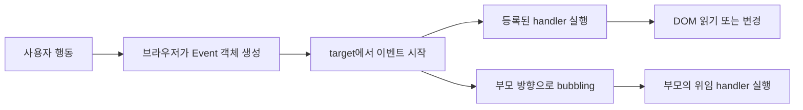
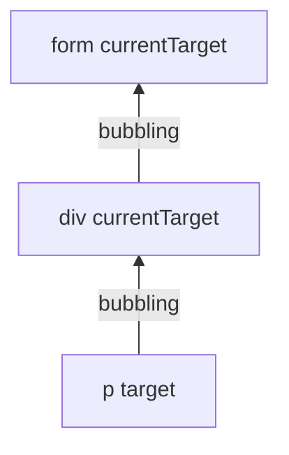

# Controlling Event: 이벤트가 흐르는 길을 이해하고 화면을 제어하기

- 🎯 글의 목표: DOM 이벤트를 등록하고, 이벤트 객체와 버블링을 읽어 사용자 행동에 맞게 화면을 안전하게 변경하는 흐름을 이해한다.
- 🧩 핵심 키워드: Event, `addEventListener`, event handler, `target`, `currentTarget`, bubbling, event delegation, `preventDefault`
- ⭐ 중요도: 매우 높음. 이후 AJAX 요청, 좋아요·팔로우 버튼, 동적 목록처럼 사용자의 행동으로 시작되는 기능의 공통 기반이다.
- 📝 한눈에 보는 내용: 이벤트 등록에서 출발해 이벤트 객체, 버블링, 이벤트 위임을 차례로 이해하고 입력·할 일 목록·form 제어에 적용한다.
- 🔗 관련 문제 / 주제: DOM 조작, 사용자 입력 처리, 동적 UI, form 검증, AJAX

---

## 1. 들어가며

DOM을 선택하고 바꾸는 방법만 알아서는 웹 페이지가 저절로 반응하지 않는다. `textContent`로 문장을 바꿀 수 있어도, **언제 그 코드를 실행할지** 결정하는 장치가 필요하다. 사용자의 클릭, 키 입력, form 제출처럼 브라우저 안에서 일어난 사건과 우리가 작성한 함수를 연결하는 장치가 바로 이벤트다.

이번 강의의 흐름은 세 질문으로 정리할 수 있다. 첫째, 브라우저가 발생시킨 이벤트를 JavaScript는 어떻게 구독하는가. 둘째, 이벤트가 발생했을 때 실제 출발점과 처리 지점은 어떻게 구분하는가. 셋째, 중첩된 DOM에서 이벤트가 부모 쪽으로 올라가는 특성을 어떻게 효율적인 코드로 바꾸는가.

이 흐름을 잡으면 클릭 예제 하나를 외우는 데서 그치지 않는다. 목록에 나중에 추가된 버튼까지 처리하거나, form의 새로고침을 막은 뒤 AJAX 요청을 보내는 식으로 같은 원리를 확장할 수 있다.

## 2. 핵심 개념 정리

이 강의는 **사용자 행동을 감지하고, 그 행동이 일어난 정확한 위치를 찾아, 필요한 화면 변화만 실행하는 과정**을 다룬다.

먼저 `addEventListener`로 특정 요소와 이벤트 핸들러를 연결한다. 핸들러가 실행되면 브라우저는 `Event` 객체를 넘겨주며, 이 객체를 통해 이벤트 종류와 출발점을 읽을 수 있다. DOM이 중첩되어 있다면 이벤트는 부모 요소 쪽으로 전파되는데, 이 버블링 덕분에 여러 자식의 이벤트를 부모 하나에서 처리하는 이벤트 위임이 가능해진다.

마지막에는 입력값을 화면에 반영하고, 할 일을 동적으로 추가하며, form과 링크가 가진 기본 동작을 제어한다. 따라서 본문은 **이벤트 등록 → 이벤트 객체 → 버블링 → 이벤트 위임 → 실제 UI 구현** 순서로 읽으면 된다.



이 도식에서 먼저 구분할 것은 **사건을 만든 주체와 사건을 처리하는 주체**다. 사용자가 행동하면 브라우저가 Event 객체를 만들고, JavaScript는 미리 등록한 핸들러로 그 객체를 받는다. 이 기본 흐름을 잡은 뒤에야 `target`, `currentTarget`, 버블링이 각각 어느 위치를 말하는지 자연스럽게 이해된다.

## 3. 본문 정리

### 3.1 이벤트와 이벤트 핸들러

이벤트는 브라우저에서 일어난 사건을 나타내는 객체다. 사용자가 버튼을 클릭하면 `click`, 입력창의 값이 바뀌면 `input`, form 제출을 시도하면 `submit` 이벤트가 발생한다. JavaScript는 이 사건을 계속 확인하는 대신, 관심 있는 사건에 실행할 함수를 미리 등록해 둔다.


위 자료에서 중요한 점은 이벤트와 핸들러가 서로 다른 역할을 가진다는 것이다. 이벤트는 브라우저가 만든 신호이고, 핸들러는 그 신호를 받았을 때 개발자가 실행하도록 연결한 함수다.

```html
<button id="greeting-button">인사하기</button>
<p id="message"></p>

<script>
  // 1. 반응할 DOM 요소를 먼저 찾는다.
  const button = document.querySelector('#greeting-button')
  const message = document.querySelector('#message')

  // 2. click 이벤트와 실행할 함수를 연결한다.
  button.addEventListener('click', function (event) {
    // 3. 클릭이 발생한 시점에만 화면의 문장을 변경한다.
    message.textContent = '안녕하세요!'
  })
</script>
```

`addEventListener(type, handler)`의 첫 번째 인자는 기다릴 이벤트 이름이고, 두 번째 인자는 이벤트가 발생한 뒤 호출할 콜백 함수다. 위 코드가 처음 실행될 때 핸들러의 본문까지 바로 실행되는 것은 아니다. 브라우저가 리스너를 기억하고 있다가 사용자가 버튼을 클릭한 순간 호출한다.

처음 학습할 때는 이벤트 이름을 전부 외우기보다, **어떤 사용자 행동을 관찰하려는지**부터 생각하는 편이 좋다.

| 관찰하려는 행동 | 주로 사용하는 이벤트 | 발생 시점 |
|---|---|---|
| 버튼·링크를 누름 | `click` | 포인터 클릭 또는 키보드 활성화 |
| 입력값이 바뀌는 과정을 추적 | `input` | 값이 바뀔 때마다 |
| 선택이나 입력이 확정됨 | `change` | 요소 종류에 따른 확정 시점 |
| form을 제출함 | `submit` | 버튼 클릭 또는 Enter로 제출될 때 |
| 키 입력을 확인함 | `keydown`, `keyup` | 키를 누르거나 놓을 때 |
| 문서 준비 뒤 초기화 | `DOMContentLoaded` | HTML 파싱이 끝났을 때 |

`click`을 마우스 전용 사건으로만 이해하면 안 된다. 올바른 `button` 요소는 키보드로도 활성화할 수 있으므로, 의미 있는 HTML 요소에 이벤트를 연결하는 것이 접근성에도 도움이 된다.

⚠️ 주의: `addEventListener('click', handler())`처럼 함수 호출 결과를 전달하면 등록 시점에 함수가 실행된다. 핸들러에는 `handler`처럼 함수 자체를 전달해야 한다.

📌 핵심: DOM 조작이 "무엇을 바꿀지" 정한다면, 이벤트는 "언제 바꿀지" 정한다.

### 3.2 Event 객체에서 사건의 정보를 읽기

브라우저는 핸들러를 호출할 때 첫 번째 인자로 `Event` 객체를 전달한다. 이 객체에는 이벤트 이름, 실제 출발 요소, 리스너가 등록된 요소처럼 처리에 필요한 정보가 담긴다.


```javascript
const button = document.querySelector('#greeting-button')

button.addEventListener('click', function (event) {
  // 발생한 이벤트 종류: 'click'
  console.log(event.type)

  // 사용자의 행동이 실제로 시작된 요소
  console.log(event.target)

  // 현재 이 핸들러가 등록되어 있는 요소
  console.log(event.currentTarget)
})
```

버튼에 직접 리스너를 붙이고 버튼 자체를 클릭한 간단한 예제에서는 `target`과 `currentTarget`이 같아 보인다. 그러나 자식 요소의 이벤트를 부모가 처리하면 둘이 달라진다. 이 차이는 버블링과 이벤트 위임을 이해하는 기준이 된다.

일반 함수 안에서 `this`는 보통 `event.currentTarget`과 같은 요소를 가리킨다. 하지만 화살표 함수는 자체 `this`를 만들지 않으므로 같은 규칙을 기대하면 안 된다. 이벤트 코드에서는 의도가 분명한 `event.currentTarget`을 직접 쓰는 편이 안전하다.

Event 객체에서 자주 확인하는 값도 함께 정리해 두면 디버깅이 쉬워진다.

| 속성·메서드 | 의미 |
|---|---|
| `event.type` | 발생한 이벤트 이름 |
| `event.target` | 이벤트가 실제 시작된 요소 |
| `event.currentTarget` | 현재 핸들러가 등록된 요소 |
| `event.defaultPrevented` | 기본 동작이 이미 취소되었는지 여부 |
| `event.preventDefault()` | 브라우저의 기본 동작 취소 |
| `event.stopPropagation()` | 이후 부모 방향 전파 중단 |

모든 값을 한꺼번에 사용할 필요는 없다. 다만 핸들러가 예상과 다른 요소를 처리할 때는 `type`, `target`, `currentTarget` 세 가지를 먼저 출력하면 사건의 종류와 위치를 빠르게 좁힐 수 있다.

### 3.3 입력 이벤트로 사용자의 값을 실시간 반영하기

`input` 이벤트는 입력 요소의 값이 바뀔 때마다 발생한다. 글자를 입력하거나 지우는 과정에 맞춰 화면을 즉시 갱신하고 싶을 때 사용한다. 반면 `change`는 요소 종류에 따라 포커스가 빠지거나 선택이 확정된 시점에 발생하므로, 두 이벤트는 사용 목적이 다르다.

예를 들어 검색어 미리보기는 입력 과정에 바로 반응해야 하므로 `input`이 자연스럽다. 반면 배송 방법을 선택한 뒤 한 번만 계산해야 하는 `select`는 `change`가 더 읽기 좋다. 이벤트를 선택할 때는 "값이 바뀌는 매 순간"과 "사용자의 선택이 확정된 순간" 중 어느 쪽이 필요한지 판단한다.


```html
<label for="nickname">닉네임</label>
<input id="nickname" type="text">
<p id="preview">아직 입력하지 않았습니다.</p>

<script>
  const nicknameInput = document.querySelector('#nickname')
  const preview = document.querySelector('#preview')

  nicknameInput.addEventListener('input', function (event) {
    // input 이벤트의 target은 값이 바뀐 입력 요소다.
    const value = event.target.value.trim()

    // 빈 문자열까지 고려해 화면에 표시할 내용을 결정한다.
    preview.textContent = value || '아직 입력하지 않았습니다.'
  })
</script>
```

이 예제에서 입력은 사용자의 타이핑이고, 출력은 `preview`의 문자열이다. 핸들러는 입력 요소의 현재 `value`를 읽은 뒤 DOM에 다시 기록한다. 이벤트와 DOM 조작이 한 흐름 안에서 연결되는 가장 작은 예다.

⚠️ 주의: `textContent`는 일반 요소의 표시 문자열을 다루고, `value`는 `input`, `select`, `textarea` 같은 form 요소의 현재 입력값을 다룬다. 입력값을 읽으면서 `textContent`를 사용하면 원하는 값이 나오지 않는다.

### 3.4 이벤트 버블링: 사건은 부모 요소 쪽으로 전파된다

HTML 요소는 부모와 자식으로 중첩된다. 가장 안쪽의 요소를 클릭했을 때 이벤트는 그 요소에서 처리된 뒤 상위 요소 방향으로 올라간다. 물속의 기포가 위로 올라가는 모습과 닮아 이 과정을 **버블링**이라고 부른다.


위 구조에서 `p`를 클릭하면 `p`의 핸들러만 실행되는 것이 아니다. 이벤트가 `div`, `form` 방향으로 올라가기 때문에 세 요소의 핸들러가 차례로 반응할 수 있다.

```html
<form id="form">
  form
  <div id="box">
    div
    <p id="paragraph">p</p>
  </div>
</form>

<script>
  const form = document.querySelector('#form')
  const box = document.querySelector('#box')
  const paragraph = document.querySelector('#paragraph')

  form.addEventListener('click', function (event) {
    console.log('form 처리', event.target)
  })

  box.addEventListener('click', function (event) {
    console.log('div 처리', event.target)
  })

  paragraph.addEventListener('click', function (event) {
    console.log('p 처리', event.target)
  })
</script>
```

`p`를 클릭했을 때 세 로그에서 `event.target`은 모두 `p`다. 사건의 출발점은 전파 중에도 바뀌지 않기 때문이다. 반면 `event.currentTarget`은 각 핸들러가 붙은 `p`, `div`, `form`으로 달라진다.

이벤트 전파에는 실제로 캡처링, target, 버블링 단계가 있다. 이번 강의의 핵심은 기본 설정에서 가장 자주 만나는 버블링이다. `addEventListener`의 세 번째 옵션을 주지 않으면 핸들러는 보통 버블링 단계에서 실행된다. 따라서 입문 단계에서는 "안쪽에서 시작한 사건이 바깥쪽 핸들러에서도 관찰된다"는 흐름을 먼저 정확히 잡으면 충분하다.



위 도식에서 `target`은 처음 클릭한 `p`로 고정된다. 반면 이벤트가 각 핸들러를 통과할 때 `currentTarget`은 `p`, `div`, `form`으로 바뀐다.

⚠️ 주의: 버블링으로 부모 핸들러까지 실행되는 현상을 무조건 오류라고 생각하기 쉽다. 먼저 `target`과 `currentTarget`을 출력해 흐름을 확인하고, 정말 전파를 막아야 하는 경우에만 `stopPropagation()`을 고려한다. 전파를 습관적으로 막으면 이벤트 위임을 사용할 수 없게 된다.

### 3.5 target과 currentTarget을 구분하는 기준

두 속성은 이름이 비슷하지만 질문이 다르다.

| 속성 | 답하는 질문 | 버블링 중 값 |
|---|---|---|
| `event.target` | 실제로 어디에서 사건이 시작됐는가? | 변하지 않음 |
| `event.currentTarget` | 지금 실행 중인 핸들러는 어디에 등록됐는가? | 핸들러마다 달라짐 |


목록의 공통 부모에 리스너를 붙였다고 가정해 보자. 사용자가 두 번째 `li` 안의 `span`을 클릭하면 `target`은 `span`일 수 있고, `currentTarget`은 항상 리스너를 등록한 `ul`이다. 따라서 실제 목록 항목을 찾으려면 클릭된 요소에서 가장 가까운 `li`를 찾아야 한다.

```javascript
const menu = document.querySelector('#menu')

menu.addEventListener('click', function (event) {
  // span처럼 li 내부 요소를 클릭한 경우까지 포함해 가장 가까운 li를 찾는다.
  const menuItem = event.target.closest('li')

  // li가 아니거나 현재 menu 바깥의 li라면 처리하지 않는다.
  if (!menuItem || !event.currentTarget.contains(menuItem)) {
    return
  }

  menuItem.classList.toggle('selected')
})
```

`matches('li')`는 클릭된 요소 자체가 `li`인지 검사한다. `closest('li')`는 클릭된 요소부터 부모 방향으로 올라가며 가장 가까운 `li`를 찾는다. 버튼 안에 아이콘이나 글자 요소가 들어 있는 실제 UI에서는 `closest`가 더 견고한 경우가 많다.

📌 핵심: 이벤트 위임에서는 `currentTarget`으로 처리 영역을 잡고, `target` 또는 `closest()`로 실제 처리 대상을 찾는다.

### 3.6 이벤트 위임: 여러 자식을 부모 하나에서 처리하기

반복되는 항목마다 같은 리스너를 등록하면 코드가 길어지고, 나중에 추가된 항목에는 리스너가 붙지 않는다. 버블링을 이용해 공통 부모에 한 번만 리스너를 등록하면 이 문제를 해결할 수 있다.


```html
<ul id="todo-list">
  <li>
    <span>이벤트 복습하기</span>
    <button type="button" class="delete-button">삭제</button>
  </li>
</ul>

<script>
  const todoList = document.querySelector('#todo-list')

  todoList.addEventListener('click', function (event) {
    // 삭제 버튼 또는 버튼 안쪽 요소가 클릭됐는지 찾는다.
    const deleteButton = event.target.closest('.delete-button')

    // 목록의 다른 빈 영역을 클릭했다면 아무 동작도 하지 않는다.
    if (!deleteButton) {
      return
    }

    // 클릭된 버튼이 속한 li 하나만 제거한다.
    deleteButton.closest('li').remove()
  })
</script>
```

이 구조에서는 페이지가 열린 뒤 새 `li`를 추가해도 삭제 기능이 그대로 동작한다. 새 항목 자체에는 리스너가 없어도 클릭 이벤트가 기존 부모인 `todoList`까지 올라오기 때문이다.

⚠️ 주의: 부모가 받는 모든 클릭을 무조건 처리하면 목록의 빈 영역이나 다른 버튼을 눌러도 코드가 실행된다. 핸들러의 첫 단계에서 선택자와 처리 범위를 확인하는 guard clause를 두는 것이 좋다.

### 3.7 form 제출과 preventDefault

form은 원래 제출 시 서버로 이동하며 페이지를 다시 로드한다. JavaScript에서 입력값을 검사하거나 AJAX 요청을 보낼 때는 이 기본 제출 동작과 우리가 작성한 로직이 충돌한다. `event.preventDefault()`는 이벤트 자체를 없애는 것이 아니라, 브라우저가 그 이벤트 뒤에 수행하려던 기본 행동을 취소한다.


```html
<form id="todo-form">
  <input id="todo-input" type="text" required>
  <button type="submit">추가</button>
</form>
<ul id="todo-list"></ul>

<script>
  const todoForm = document.querySelector('#todo-form')
  const todoInput = document.querySelector('#todo-input')
  const todoList = document.querySelector('#todo-list')

  todoForm.addEventListener('submit', function (event) {
    // 페이지 이동보다 JavaScript의 목록 추가 로직을 사용한다.
    event.preventDefault()

    const content = todoInput.value.trim()
    if (!content) {
      return
    }

    const item = document.createElement('li')
    item.textContent = content
    todoList.appendChild(item)

    // 다음 입력을 위해 값과 포커스를 정리한다.
    todoInput.value = ''
    todoInput.focus()
  })
</script>
```

버튼의 `click`이 아니라 form의 `submit`을 듣는 이유도 중요하다. 사용자는 제출 버튼을 클릭할 수도 있고 입력창에서 Enter를 누를 수도 있다. 두 행동은 모두 form의 제출로 모이므로 `submit` 이벤트에 로직을 연결하면 접근성과 동작 일관성이 좋아진다.

⚠️ 주의: `preventDefault()`와 `stopPropagation()`은 다르다. 전자는 링크 이동이나 form 제출 같은 기본 행동을 막고, 후자는 이벤트가 부모로 전파되는 것을 막는다.

### 3.8 기본 동작, 전파, 핸들러 실행을 따로 보기

이 세 가지는 같은 사건 안에서 일어나지만 서로 다른 제어 대상이다.

| 제어 대상 | 질문 | 관련 API |
|---|---|---|
| 핸들러 실행 | 어떤 함수가 실행되는가? | `addEventListener`, `removeEventListener` |
| 이벤트 전파 | 부모 핸들러까지 전달되는가? | `stopPropagation` |
| 기본 동작 | 브라우저가 원래 하던 행동을 수행하는가? | `preventDefault` |

링크를 클릭하는 상황을 생각해 보자. 클릭 핸들러는 실행될 수 있고, 이벤트는 부모까지 버블링할 수 있으며, 마지막에는 브라우저가 링크 주소로 이동할 수 있다. `preventDefault()`를 호출하면 주소 이동만 취소되고 핸들러 실행과 버블링은 그대로 남는다.

반대로 `stopPropagation()`만 호출하면 부모 핸들러에는 전달되지 않지만 링크 이동은 계속 일어난다. 이 차이를 모르고 두 메서드를 바꾸어 사용하면 화면 이동이나 상위 핸들러 실행이 예상과 달라진다.

또한 모든 이벤트가 취소 가능한 것은 아니다. `event.cancelable`이 `false`인 사건에 `preventDefault()`를 호출해도 취소할 기본 동작이 없다. form 제출과 링크 이동처럼 브라우저 기본 동작이 분명한 상황에서 사용하는 것이 가장 이해하기 쉽다.

### 3.9 할 일 목록 실습을 기능 단위로 분해하기

할 일 목록 실습에는 이번 강의의 개념이 한꺼번에 들어 있다. 코드를 통째로 외우기보다 다음 역할로 나누어 읽는다.

1. `submit` 이벤트는 버튼 클릭과 Enter 입력을 하나의 제출 흐름으로 묶는다.
2. `preventDefault()`는 제출 뒤 페이지가 다시 로드되는 것을 막는다.
3. `input.value.trim()`은 사용자가 입력한 실제 문자열을 얻고 공백 입력을 걸러낸다.
4. `createElement`와 `appendChild`는 검증된 값으로 새 DOM을 만든다.
5. 목록 부모의 `click` 리스너는 나중에 추가된 삭제 버튼까지 이벤트 위임으로 처리한다.
6. `closest()`는 버튼 안쪽 아이콘을 눌러도 기준 버튼이나 목록 항목을 찾게 한다.

이 실습에서 새 항목을 만든 직후 개별 삭제 리스너를 붙일 수도 있다. 하지만 이벤트 위임을 사용하면 항목 생성 로직은 DOM 생성에만 집중하고, 삭제 로직은 목록 부모의 핸들러 한 곳에 유지할 수 있다. 기능이 늘어날수록 이러한 역할 분리가 관리하기 쉬운 구조를 만든다.

### 3.10 이벤트 코드가 동작하지 않을 때 점검 순서

이벤트 오류는 아래 순서로 확인하면 원인을 빠르게 좁힐 수 있다.

1. 선택자가 실제 요소를 찾았는지 콘솔에서 확인한다. `null`이면 리스너를 붙일 대상 자체가 없다.
2. 스크립트 실행 시점에 DOM이 만들어졌는지 확인한다. 필요하면 `defer` 또는 문서 하단 script 배치를 사용한다.
3. 이벤트 이름이 요소와 행동에 맞는지 확인한다. form은 `click`보다 `submit`이 기준이 되는 경우가 많다.
4. 핸들러 첫 줄에서 `event.type`, `target`, `currentTarget`을 출력한다.
5. 위임 구조라면 `matches`나 `closest` 조건이 너무 좁지 않은지 확인한다.
6. 페이지가 갑자기 이동한다면 필요한 위치에서 `preventDefault()`가 호출됐는지 확인한다.
7. 같은 동작이 여러 번 실행된다면 중복 리스너 등록과 버블링 경로를 확인한다.

이 순서를 따르면 "JavaScript가 안 된다"는 큰 문제를 선택, 등록, 발생, 대상 판별, 기본 동작이라는 작은 단계로 나눌 수 있다.

## 4. 적용 관점에서 다시 보기

이벤트 기능을 구현할 때는 다음 순서로 생각하면 흐름이 흔들리지 않는다.

1. **사용자 행동을 정한다.** 클릭인지, 입력 중인지, 제출인지에 따라 `click`, `input`, `submit`을 고른다.
2. **리스너 위치를 정한다.** 대상이 하나면 직접 등록하고, 반복되거나 동적으로 추가되는 자식이면 공통 부모에 위임한다.
3. **이벤트 객체에서 대상을 찾는다.** 단일 요소에서는 `currentTarget`, 위임 구조에서는 `target`과 `closest()`를 함께 본다.
4. **브라우저 기본 동작과 충돌하는지 확인한다.** form이나 링크를 JavaScript가 대신 처리한다면 `preventDefault()`를 검토한다.
5. **DOM을 최소 범위로 변경한다.** 클릭된 항목 하나, 갱신할 문장 하나처럼 필요한 요소만 바꾼다.

디버깅할 때는 핸들러 첫 줄에서 `event.type`, `event.target`, `event.currentTarget`을 출력하면 대부분의 위치 문제를 빠르게 좁힐 수 있다. 핸들러가 아예 실행되지 않는다면 선택자가 올바른지, 스크립트 실행 시점에 요소가 존재하는지, 이벤트 이름이 맞는지부터 확인한다.

## 5. 배운 점 / 확장 포인트

### 5.1 이번 강의 이전에 몰랐던 것 또는 새로 이해된 것

이벤트는 클릭 함수 하나를 실행하는 문법이 아니라, 브라우저가 만든 사건을 DOM 구조 속에서 추적하는 흐름이다. 특히 `target`과 `currentTarget`을 구분하면 중첩된 요소에서 왜 여러 핸들러가 실행되는지 설명할 수 있다.

### 5.2 앞으로 이어지는 연결점

AJAX도 이벤트에서 시작한다. form의 `submit`을 막고 서버에 비동기 요청을 보낸 뒤, 응답을 받아 DOM을 갱신하는 다음 단계가 이번 강의의 구조 위에 그대로 놓인다.

### 5.3 더 파볼 만한 주제

캡처링 단계, `addEventListener`의 `once`·`passive`·`capture` 옵션, `AbortController`를 이용한 리스너 해제는 복잡한 UI의 이벤트 수명 주기를 다룰 때 이어서 살펴볼 만하다.

## 6. 요약 정리

- 이벤트는 브라우저에서 일어난 사건이고, 이벤트 핸들러는 그 사건에 연결한 함수다.
- `addEventListener`는 이벤트 이름과 콜백 함수를 연결한다.
- `target`은 사건의 출발점, `currentTarget`은 현재 핸들러가 등록된 요소다.
- 버블링은 이벤트가 자식에서 부모 방향으로 전파되는 흐름이다.
- 이벤트 위임은 버블링을 이용해 여러 자식을 공통 부모 하나에서 처리한다.
- `preventDefault()`는 브라우저 기본 동작을 막으며, 이벤트 전파를 막지는 않는다.

🧠 기억할 것: **어디에서 발생했는가(`target`)와 어디에서 처리하는가(`currentTarget`)를 분리해서 읽으면 이벤트 코드가 선명해진다.**

## 7. 미니 퀴즈 또는 체크리스트

- [ ] `addEventListener('click', handler)`에서 `handler()`가 아니라 `handler`를 전달하는 이유를 설명할 수 있는가?
- [ ] 자식 버튼을 클릭했을 때 부모 핸들러가 실행되는 이유를 버블링으로 설명할 수 있는가?
- [ ] 이벤트 위임 코드에서 `target`, `currentTarget`, `closest()`의 역할을 각각 설명할 수 있는가?
- [ ] `preventDefault()`와 `stopPropagation()`의 차이를 예로 들 수 있는가?
- [ ] 동적으로 추가되는 목록 항목을 부모 리스너 하나로 처리하는 코드를 작성할 수 있는가?
