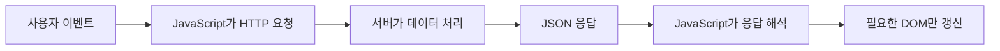
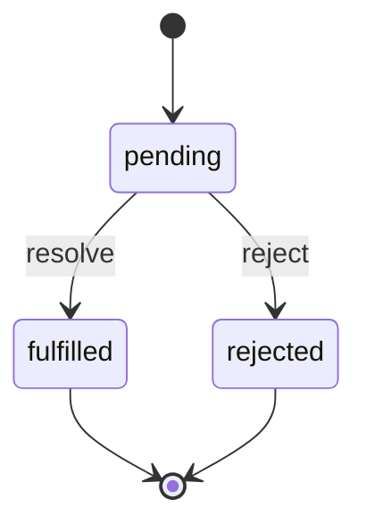

# AJAX: 비동기 흐름을 이해하고 서버 응답으로 화면 바꾸기

- 🎯 글의 목표: JavaScript의 비동기 실행 구조와 Promise를 이해하고, Axios로 서버 데이터를 받아 DOM에 반영하는 전체 흐름을 익힌다.
- 🧩 핵심 키워드: 동기, 비동기, JavaScript runtime, Call Stack, Web API, Task Queue, Event Loop, AJAX, Axios, JSON, Promise
- ⭐ 중요도: 매우 높음. 프론트엔드와 백엔드가 페이지 이동 없이 데이터를 주고받는 기능의 기반이다.
- 📝 한눈에 보는 내용: 비동기가 필요한 이유를 살펴본 뒤 JavaScript 런타임과 이벤트 루프를 이해하고, Axios와 Promise 체이닝으로 요청·응답·화면 갱신을 연결한다.
- 🔗 관련 문제 / 주제: API 호출, 검색 자동완성, 좋아요·팔로우, 무한 스크롤, Django `JsonResponse`

---

## 1. 들어가며

웹 페이지가 서버 응답을 기다릴 때마다 멈춘다면 사용자는 입력도, 스크롤도, 다른 버튼 클릭도 할 수 없다. 네트워크 요청은 컴퓨터 내부 계산보다 훨씬 오래 걸릴 수 있으므로, 요청이 끝날 때까지 모든 작업을 세워 두는 방식은 사용자 경험에 맞지 않는다.

비동기 처리는 오래 걸리는 작업을 브라우저에 맡기고 JavaScript는 다음 코드를 계속 실행하게 만든다. 작업 결과가 준비되면 등록해 둔 콜백이 나중에 실행된다. 여기서 "나중"의 순서를 설명하는 것이 JavaScript 런타임과 이벤트 루프이고, 서버 요청을 다루기 쉽게 감싼 도구가 Axios와 Promise다.

이번 강의는 문법 하나보다 흐름이 중요하다. **요청을 보낸다 → 기다리는 동안 다른 코드를 실행한다 → 응답이 도착한다 → 성공 또는 실패에 맞는 후속 작업을 수행한다 → DOM을 갱신한다**는 시간 순서를 중심에 두고 읽어야 한다.

## 2. 핵심 개념 정리

이 강의가 해결하는 질문은 "응답 시점을 알 수 없는 작업을 JavaScript에서 어떻게 안전하게 이어 갈 것인가"이다.

먼저 동기와 비동기를 실행 순서 관점에서 구분한다. 이어서 단일 스레드인 JavaScript가 브라우저의 Web API, Task Queue, Event Loop와 협력해 비동기 작업을 처리하는 구조를 본다. 그 위에서 AJAX 요청을 보내고, 서버가 돌려준 JSON을 Axios의 Promise로 받아 화면에 반영한다.

마지막에는 콜백 중첩을 줄이기 위해 Promise의 `then`, `catch`, `finally`와 체이닝을 정리한다. 본문은 **시간의 문제 → 런타임의 해결 구조 → AJAX 요청 → Promise로 후속 작업 연결**이라는 순서로 이어진다.

```mermaid
sequenceDiagram
    participant JS as JavaScript Call Stack
    participant Web as Browser Web API
    participant Queue as Task Queue
    participant Loop as Event Loop

    JS->>Web: 타이머 또는 네트워크 작업 등록
    JS->>JS: 다음 동기 코드 계속 실행
    Web-->>Queue: 작업 완료 후 callback 대기
    Loop->>JS: Stack이 비면 callback 이동
    JS->>JS: callback 실행
```

이 그림을 읽을 때 가장 중요한 점은 JavaScript가 네트워크 통신을 직접 붙잡고 기다리는 것이 아니라는 사실이다. 브라우저 환경이 오래 걸리는 작업을 맡고, JavaScript는 결과를 처리할 함수만 준비해 둔다.

## 3. 본문 정리

### 3.1 동기와 비동기는 실행 완료를 기다리는 방식이 다르다

동기 처리는 앞 작업이 끝난 뒤 다음 작업을 시작한다. 순서가 분명해 이해하기 쉽지만, 네트워크 요청처럼 오래 걸리는 작업이 끼면 그 시간 동안 뒤의 작업도 모두 멈춘다. 비동기 처리는 완료를 기다리는 작업을 맡겨 두고 다음 코드를 먼저 실행한다.

동기와 비동기는 어느 쪽이 무조건 더 좋은 방식이 아니다. 계산 결과가 바로 다음 줄의 입력이 된다면 순서대로 기다리는 동기 흐름이 자연스럽다. 반면 완료 시점을 예측하기 어려운 네트워크, 타이머, 사용자 이벤트는 기다리는 동안 다른 일을 할 수 있도록 비동기로 다루는 편이 적합하다.

| 작업 | 완료 시점 | 일반적인 처리 방식 |
|---|---|---|
| 두 숫자의 덧셈 | 즉시 예측 가능 | 동기 |
| 배열의 현재 값 읽기 | 즉시 예측 가능 | 동기 |
| 서버에 HTTP 요청 | 네트워크 상황에 따라 다름 | 비동기 |
| 3초 뒤 함수 실행 | 미래 시점 | 비동기 |
| 사용자의 클릭 기다리기 | 언제 발생할지 모름 | 이벤트 기반 비동기 |


```javascript
console.log('1. 시작')

setTimeout(function () {
  // 타이머가 끝난 뒤 실행할 콜백이다.
  console.log('2. 오래 걸린 작업 완료')
}, 1000)

// 타이머 완료를 기다리지 않고 먼저 실행된다.
console.log('3. 다음 작업')
```

출력 순서는 `1 → 3 → 2`다. 코드의 줄 순서와 실제 완료 순서가 다르기 때문에 비동기 코드는 "아래에 있으니 나중"이라는 위치만으로 읽으면 안 된다. 어떤 작업이 즉시 Call Stack에서 실행되고, 어떤 작업이 브라우저에 맡겨졌다가 콜백으로 돌아오는지 구분해야 한다.

⚠️ 주의: 비동기는 여러 JavaScript 문장이 동시에 실행된다는 뜻이 아니다. JavaScript의 주 실행 흐름은 한 번에 하나의 작업을 처리하며, 브라우저가 타이머나 네트워크 작업을 대신 수행한 뒤 콜백 실행 기회를 돌려준다.

### 3.2 JavaScript 런타임과 이벤트 루프

JavaScript 엔진은 한 번에 하나의 실행 맥락을 Call Stack에서 처리한다. 그런데 브라우저에는 타이머, 네트워크 요청, DOM 이벤트를 처리하는 Web API가 있다. 오래 걸리는 작업을 Web API가 맡으면 JavaScript의 Call Stack은 비워지고 다음 코드를 실행할 수 있다.


`setTimeout` 예제를 런타임 흐름으로 나누면 다음과 같다.

1. 첫 번째 `console.log`가 Call Stack에서 실행되고 제거된다.
2. `setTimeout`이 등록한 타이머는 브라우저 Web API가 관리한다.
3. JavaScript는 기다리지 않고 마지막 `console.log`를 실행한다.
4. 타이머가 끝나면 콜백은 Queue에서 실행 순서를 기다린다.
5. Event Loop는 Call Stack이 비었을 때 Queue의 콜백을 Stack으로 옮긴다.

Call Stack은 함수 호출의 실행 순서를 쌓는 공간이다. 현재 함수가 다른 함수를 호출하면 새 실행 맥락이 위에 쌓이고, 함수가 끝나면 위에서부터 제거된다. 이 Stack이 비지 않은 동안에는 대기 중인 콜백이 끼어들어 실행되지 않는다.

Web API는 JavaScript 언어 자체가 아니라 브라우저가 제공하는 환경 기능이다. `setTimeout`, DOM 이벤트, 네트워크 요청이 여기에 해당한다. 그래서 같은 JavaScript라도 브라우저와 Node.js는 주변 실행 환경이 다를 수 있다.

따라서 `setTimeout(callback, 0)`도 현재 실행 중인 동기 코드보다 먼저 실행될 수 없다. 0ms는 즉시 실행 보장이 아니라, 최소 지연 시간이 지난 뒤 Queue에 들어갈 수 있다는 뜻에 가깝다.

📌 핵심: 이벤트 루프는 비동기 작업을 직접 실행하는 장치가 아니라, **Call Stack이 비었을 때 대기 중인 후속 작업이 실행될 기회를 연결하는 조정자**다.

### 3.3 AJAX는 페이지 전체가 아닌 필요한 데이터만 교환한다

AJAX는 Asynchronous JavaScript and XML의 약자다. 이름에는 XML이 들어 있지만 오늘날에는 대부분 JSON을 사용한다. 핵심은 특정 기술 이름보다, 브라우저가 페이지 전체를 새로 요청해 교체하지 않고 JavaScript로 필요한 데이터만 비동기 요청한다는 데 있다.

AJAX가 등장하기 전의 전통적인 요청 흐름에서는 사용자가 링크나 form을 실행하면 브라우저가 새 HTML 문서를 받고 현재 문서를 교체했다. AJAX에서는 현재 문서를 유지한 채 백그라운드로 요청을 보내고, 받은 데이터로 필요한 부분만 바꾼다.



이 방식은 새로고침이 없다는 장점만 있는 것이 아니다. 서버와 화면의 책임을 분리하게 한다. 서버는 데이터와 처리 결과를 제공하고, 브라우저는 그 데이터를 어느 요소에 어떻게 보여 줄지 결정한다.

초기의 AJAX 구현에는 `XMLHttpRequest` 객체가 주로 사용되었다. Axios는 내부 통신 과정을 더 읽기 쉬운 API와 Promise로 감싼 라이브러리다. 따라서 Axios를 배울 때도 본질은 "비동기 HTTP 요청과 후속 처리"라는 점을 놓치지 않아야 한다.


전통적인 form 요청은 서버 응답으로 새로운 HTML 문서를 받아 페이지를 이동한다. AJAX 방식은 서버가 JSON 같은 데이터만 돌려주고, 브라우저의 JavaScript가 현재 DOM에서 바꿀 부분을 직접 갱신한다.

예를 들어 좋아요 버튼을 눌렀을 때 필요한 정보는 완성된 페이지 전체가 아니다. "좋아요 상태가 켜졌는가"와 "현재 좋아요 수가 몇 개인가" 정도면 충분하다. 서버가 이 값을 JSON으로 응답하면 JavaScript가 버튼 문구와 숫자만 바꿀 수 있다.

### 3.4 Axios가 요청을 Promise로 돌려주는 방식

브라우저의 기본 요청 객체인 `XMLHttpRequest`를 직접 사용할 수도 있지만, 요청 설정과 응답 처리가 장황하다. Axios는 HTTP 요청을 간결하게 작성하게 해 주며, 호출 결과를 Promise로 반환한다.


```html
<script src="https://cdn.jsdelivr.net/npm/axios/dist/axios.min.js"></script>
<script>
  axios({
    method: 'get',
    url: 'https://api.example.com/articles',
  })
    .then(function (response) {
      // 서버가 보낸 실제 응답 본문은 response.data에 들어 있다.
      console.log(response.data)
    })
    .catch(function (error) {
      // 네트워크 오류나 4xx, 5xx 응답을 한곳에서 처리한다.
      console.error(error)
    })
</script>
```

`axios(...)`를 호출하는 순간 요청이 시작되지만 응답 데이터가 즉시 반환되는 것은 아니다. 반환값은 "결과가 나중에 결정될 작업"을 표현하는 Promise다. Promise가 성공 상태가 되면 `then`의 콜백이, 실패 상태가 되면 `catch`의 콜백이 실행된다.

Axios 응답 객체에는 상태 코드, 헤더, 요청 설정 등 여러 정보가 있다. 서버가 JSON으로 보낸 본문은 보통 `response.data`에서 꺼낸다.

요청 설정에서 자주 확인하는 항목은 다음과 같다.

| 항목 | 역할 | 예시 |
|---|---|---|
| `method` | HTTP 요청 방식 | `get`, `post` |
| `url` | 요청 대상 주소 | `/api/articles/` |
| `params` | URL query string으로 보낼 값 | 검색어, 페이지 번호 |
| `data` | 요청 본문으로 보낼 값 | 새 댓글 내용 |
| `headers` | 요청 부가 정보 | CSRF 토큰, 인증 정보 |

GET 조회 조건은 보통 `params`, POST로 생성·변경할 데이터는 `data`에 둔다. Django form과 AJAX를 연결할 때는 CSRF 토큰이 `headers`에 들어간다.

응답 객체도 `data`만 있는 것은 아니다.

```javascript
axios.get('/api/articles/')
  .then(function (response) {
    console.log(response.status)  // HTTP 상태 코드
    console.log(response.headers) // 응답 헤더
    console.log(response.data)    // 서버가 보낸 본문
  })
```

디버깅 단계에서는 상태 코드와 실제 데이터 구조를 함께 확인한다. 화면 코드가 기대하는 필드 이름과 서버 JSON의 필드 이름이 다르면 요청은 성공해도 DOM 갱신에서 오류가 발생한다.

⚠️ 주의: `const data = axios.get(url)`의 `data`는 서버 데이터가 아니라 Promise다. 실제 데이터는 `await`를 사용하거나 `then` 콜백 안에서 다뤄야 한다.

### 3.5 JSON 응답을 DOM으로 옮기기

AJAX의 목적은 요청을 보내는 데서 끝나지 않는다. 받은 데이터를 현재 화면에 반영해야 사용자가 결과를 확인할 수 있다. 이때 서버 응답의 모양을 먼저 확인한 뒤 필요한 필드를 선택해 DOM을 생성한다.


```html
<button id="load-button" type="button">게시글 불러오기</button>
<ul id="article-list"></ul>

<script>
  const loadButton = document.querySelector('#load-button')
  const articleList = document.querySelector('#article-list')

  loadButton.addEventListener('click', function () {
    axios.get('/api/articles/')
      .then(function (response) {
        // 이전 결과를 지운 뒤 새 응답을 그린다.
        articleList.replaceChildren()

        response.data.articles.forEach(function (article) {
          const item = document.createElement('li')
          item.textContent = article.title
          articleList.appendChild(item)
        })
      })
      .catch(function (error) {
        // 실패도 화면 상태의 하나이므로 사용자에게 알려 준다.
        articleList.textContent = '게시글을 불러오지 못했습니다.'
        console.error(error)
      })
  })
</script>
```

입력은 버튼의 클릭이고, 첫 번째 결과는 HTTP 응답이며, 최종 출력은 화면에 추가된 `li` 요소들이다. `then` 안에서만 `response.data`를 사용하는 이유는 그 시점에 비로소 응답이 준비되기 때문이다.

문자열을 `innerHTML`로 조합하는 방법도 있지만, 서버 데이터에 사용자 입력이 포함될 수 있다면 HTML로 해석되면서 보안 문제가 생길 수 있다. 단순 문자열은 `textContent`로 넣고, 구조는 `createElement`로 만드는 편이 안전하다.

### 3.6 콜백 중첩이 만드는 읽기 어려움

비동기 작업이 하나일 때는 콜백도 단순하다. 하지만 첫 요청 결과로 두 번째 요청을 보내고, 그 결과로 세 번째 작업을 수행하면 함수가 계속 안쪽으로 들어간다. 이를 콜백 지옥이라고 부른다.


```javascript
getUser(function (user) {
  getArticles(user.id, function (articles) {
    getComments(articles[0].id, function (comments) {
      console.log(comments)
    })
  })
})
```

이 코드는 실행 순서는 표현하지만, 들여쓰기가 깊어지고 각 단계의 실패 처리를 어디에 둘지 불분명해진다. Promise는 이 비동기 순서를 아래 방향으로 연결하고 성공과 실패의 통로를 구분하기 위해 사용한다.

콜백 자체가 나쁜 것은 아니다. 이벤트 핸들러와 배열 메서드에서도 콜백은 자연스럽게 사용된다. 문제는 **앞 비동기 결과가 다음 비동기 작업의 입력이 되는 구조가 계속 중첩될 때**다. 이때 코드의 주 흐름이 오른쪽으로 깊어지고, 오류를 바깥 단계로 전달하기 어려워진다.

### 3.7 Promise의 상태와 then/catch/finally

Promise는 미래에 완료될 비동기 작업의 결과를 나타내는 객체다. 처음에는 `pending` 상태이며, 성공하면 `fulfilled`, 실패하면 `rejected` 상태가 된다. 한 번 결정된 상태는 다시 바뀌지 않는다.



Promise가 완료되었다는 말과 성공했다는 말은 다르다. `fulfilled`와 `rejected`는 모두 더 이상 `pending`이 아닌 완료 상태지만 결과의 의미가 다르다. `then`은 성공 값을 받고, `catch`는 실패 이유를 받는다.


```javascript
axios.get('/api/profile/')
  .then(function (response) {
    // fulfilled 상태에서 실행된다.
    return response.data.user
  })
  .then(function (user) {
    // 앞 then이 반환한 값을 다음 then이 받는다.
    console.log(`${user.username}님의 프로필`)
  })
  .catch(function (error) {
    // 체인 앞쪽에서 발생한 거절이나 예외가 이곳으로 전달된다.
    console.error('프로필 요청 실패', error)
  })
  .finally(function () {
    // 성공과 실패에 관계없이 로딩 상태를 끝낸다.
    console.log('요청 처리 종료')
  })
```

`then`은 성공 결과를 변환하거나 다음 비동기 작업으로 넘긴다. `catch`는 체인에서 발생한 실패를 모아 처리한다. `finally`는 로딩 표시 해제처럼 성공 여부와 관계없이 실행해야 하는 정리에 적합하다.

### 3.8 Promise 체이닝에서 return이 중요한 이유

여러 비동기 요청을 순서대로 실행하려면 각 `then`에서 다음 Promise를 반환해야 한다. 그래야 다음 `then`이 그 Promise의 완료를 기다린다.


```javascript
axios.get('/api/users/1/')
  .then(function (response) {
    const userId = response.data.id

    // 두 번째 요청의 Promise를 반환한다.
    return axios.get(`/api/users/${userId}/articles/`)
  })
  .then(function (response) {
    // 두 번째 요청이 끝난 뒤 게시글 데이터를 받는다.
    return response.data.articles
  })
  .then(function (articles) {
    console.log(articles)
  })
  .catch(function (error) {
    // 어느 단계에서 실패해도 같은 catch로 이동한다.
    console.error(error)
  })
```

첫 `then`에서 `return`을 빼면 두 번째 요청은 시작되지만 바깥 체인과 연결되지 않는다. 다음 `then`은 기다릴 Promise를 받지 못해 `undefined`를 기준으로 너무 일찍 실행될 수 있다.

⚠️ 주의: 중괄호를 사용하는 화살표 함수는 값을 자동으로 반환하지 않는다. `then(response => { return response.data })`처럼 명시적으로 반환하거나, `then(response => response.data)`처럼 한 줄 표현식을 사용해야 한다.

`async/await`는 같은 Promise 흐름을 동기 코드처럼 읽히게 표현하는 문법이다. 다만 내부 원리는 Promise이므로 `then`과 반환 흐름을 이해하면 `await`에서 무엇을 기다리는지도 정확히 설명할 수 있다.

### 3.9 Promise 체인에서 값과 오류가 이동하는 방식

Promise 체인은 각 단계의 반환값을 다음 단계로 전달한다. 일반 값을 반환하면 다음 `then`이 그 값을 받고, Promise를 반환하면 그 Promise가 완료될 때까지 기다린다. 콜백 안에서 오류를 던지거나 반환한 Promise가 거절되면 뒤의 성공 `then`을 건너뛰고 `catch`로 이동한다.

```javascript
axios.get('/api/articles/1/')
  .then(function (response) {
    if (!response.data.author_id) {
      // 이 예외는 아래 catch에서 처리된다.
      throw new Error('작성자 정보가 없습니다.')
    }

    // 일반 값을 반환하면 다음 then의 인자가 된다.
    return response.data.author_id
  })
  .then(function (authorId) {
    // Promise를 반환하면 다음 단계가 이 요청을 기다린다.
    return axios.get(`/api/users/${authorId}/`)
  })
  .then(function (response) {
    console.log(response.data.username)
  })
  .catch(function (error) {
    console.error(error.message)
  })
```

이 흐름 덕분에 각 단계마다 중첩된 실패 콜백을 작성하지 않고도 체인 뒤쪽의 `catch`에서 오류를 모아 처리할 수 있다. 단, 오류를 `console.log`만 하고 정상 값처럼 계속 진행할지, 실제로 `throw`하여 실패 흐름으로 보낼지는 기능 요구에 맞춰 결정한다.

### 3.10 로딩·성공·실패를 모두 화면 상태로 다루기

서버 요청 화면은 성공 결과만 있는 것이 아니다. 요청 전의 기본 상태, 기다리는 중인 로딩 상태, 데이터가 없는 상태, 실패 상태를 함께 설계해야 한다.

```javascript
loadButton.addEventListener('click', function () {
  loadButton.disabled = true
  articleList.textContent = '불러오는 중입니다.'

  axios.get('/api/articles/')
    .then(function (response) {
      const articles = response.data.articles

      if (articles.length === 0) {
        articleList.textContent = '등록된 게시글이 없습니다.'
        return
      }

      articleList.replaceChildren()
      articles.forEach(function (article) {
        const item = document.createElement('li')
        item.textContent = article.title
        articleList.appendChild(item)
      })
    })
    .catch(function (error) {
      articleList.textContent = '요청을 처리하지 못했습니다.'
      console.error(error)
    })
    .finally(function () {
      // 성공과 실패 어느 쪽에서도 다시 요청할 수 있게 복원한다.
      loadButton.disabled = false
    })
})
```

이 코드는 `finally`의 사용 이유를 실제 UI 상태와 연결한다. 비동기 요청은 데이터뿐 아니라 버튼 활성화, 로딩 문구, 오류 메시지까지 하나의 흐름으로 관리해야 한다.

### 3.11 비동기 요청을 디버깅하는 순서

화면이 바뀌지 않는다고 해서 DOM 코드부터 고치면 원인을 놓치기 쉽다. 브라우저 Network 탭에서 먼저 요청 자체를 확인한다.

1. 요청이 실제로 전송됐는가.
2. URL과 HTTP method가 서버 라우팅과 일치하는가.
3. 상태 코드가 2xx인가, 4xx 또는 5xx인가.
4. Response 본문이 예상한 JSON 구조인가.
5. Console에 Promise 오류나 선택자 오류가 있는가.
6. 마지막으로 DOM 선택자와 갱신 위치가 맞는가.

이 순서는 네트워크, 서버, 데이터 형태, 화면 코드를 분리해서 확인하게 해 준다. 특히 `response.data`의 실제 구조를 콘솔에서 먼저 확인하면 존재하지 않는 필드에 접근하는 오류를 줄일 수 있다.

## 4. 적용 관점에서 다시 보기

AJAX를 구현할 때는 UI 이벤트와 네트워크 흐름을 한꺼번에 섞지 말고 단계별로 확인한다.

1. 클릭이나 submit 이벤트가 발생하는지 확인한다.
2. 필요하다면 `preventDefault()`로 페이지 이동을 막는다.
3. 요청 URL, method, 보낼 데이터를 정한다.
4. Axios가 반환한 Promise에서 성공과 실패를 각각 처리한다.
5. 성공 응답의 JSON 구조를 확인하고 필요한 DOM만 갱신한다.
6. 요청 중 중복 클릭을 막거나 로딩 상태를 보여 주고, `finally`에서 원상 복구한다.

검색 자동완성, 좋아요, 댓글 추가처럼 "페이지 전체는 유지하고 일부 데이터만 바뀌어야 한다"는 신호가 보이면 AJAX를 떠올릴 수 있다. 반대로 단순 링크 이동처럼 새 문서가 필요한 동작까지 무조건 AJAX로 바꿀 필요는 없다.

## 5. 배운 점 / 확장 포인트

### 5.1 이번 강의 이전에 몰랐던 것 또는 새로 이해된 것

비동기는 코드가 동시에 실행되는 마법이 아니라, 브라우저에 작업을 맡기고 결과가 돌아올 때 실행 순서를 다시 연결하는 구조다. 이벤트 루프를 기준으로 보면 출력 순서와 Promise 콜백의 시점을 설명할 수 있다.

### 5.2 앞으로 이어지는 연결점

다음 단계에서는 Django view가 HTML 대신 `JsonResponse`를 반환하고, JavaScript가 CSRF 토큰과 함께 POST 요청을 보낸다. 이번 강의의 Axios·Promise·DOM 갱신 흐름이 팔로우와 좋아요 기능의 뼈대가 된다.

### 5.3 더 파볼 만한 주제

Promise의 microtask queue, `Promise.all`, 요청 취소를 위한 `AbortController`, 반복 입력을 줄이는 debounce, 응답 순서가 뒤바뀌는 race condition을 이어서 살펴볼 수 있다.

## 6. 요약 정리

- 비동기는 오래 걸리는 작업을 기다리는 동안 다음 코드를 실행할 수 있게 한다.
- 브라우저의 Web API가 작업을 맡고, Event Loop가 대기 작업과 빈 Call Stack을 연결한다.
- AJAX는 페이지 전체를 교체하지 않고 필요한 데이터만 서버와 주고받는 방식이다.
- Axios는 HTTP 요청 결과를 Promise로 반환하고, 실제 본문은 보통 `response.data`에 있다.
- `then`은 성공 흐름, `catch`는 실패 흐름, `finally`는 공통 정리를 담당한다.
- Promise 체이닝에서는 다음 값이나 Promise를 `return`해야 순서가 이어진다.

🧠 기억할 것: **비동기 코드는 줄의 위치가 아니라, 어떤 Promise가 무엇을 반환하고 다음 단계가 무엇을 기다리는지로 읽는다.**

## 7. 미니 퀴즈 또는 체크리스트

- [ ] `setTimeout(callback, 0)`의 콜백이 현재 동기 코드보다 늦게 실행되는 이유를 설명할 수 있는가?
- [ ] Call Stack, Web API, Queue, Event Loop의 역할을 순서대로 말할 수 있는가?
- [ ] Axios 호출 결과와 `response.data`의 차이를 설명할 수 있는가?
- [ ] Promise 체이닝에서 `return`이 빠졌을 때 생길 수 있는 문제를 설명할 수 있는가?
- [ ] 화면이 갱신되지 않을 때 Network 탭부터 점검하는 순서를 적용할 수 있는가?
