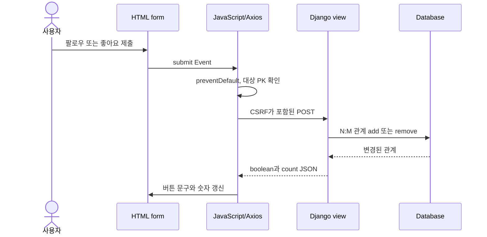
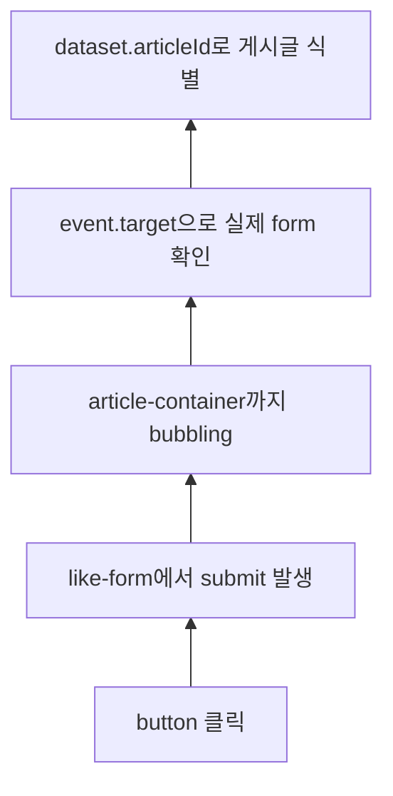

# JavaScript with Django: AJAX로 팔로우와 좋아요를 완성하기

- 🎯 글의 목표: Django의 관계 변경 view와 JavaScript의 Axios 요청을 연결해, 페이지 새로고침 없이 팔로우와 좋아요 상태를 갱신한다.
- 🧩 핵심 키워드: AJAX POST, CSRF, `data-*`, `dataset`, `JsonResponse`, follow, like, DOM update, event bubbling
- ⭐ 중요도: 매우 높음. Django 서버와 브라우저 JavaScript가 역할을 나누어 하나의 기능을 완성하는 대표적인 통합 실습이다.
- 📝 한눈에 보는 내용: 기존 Django form 요청을 AJAX로 바꾸고, 서버가 관계 변경 결과를 JSON으로 응답하면 JavaScript가 버튼 문구와 개수를 즉시 갱신한다.
- 🔗 관련 문제 / 주제: N:M 관계, 팔로우, 좋아요, CSRF 보호, 이벤트 위임, API 응답 설계

---

## 1. 들어가며

Django만으로도 팔로우와 좋아요 기능을 만들 수 있다. form을 제출하면 view가 관계를 추가하거나 제거하고, 다시 원래 페이지로 redirect하면 된다. 기능 자체는 완성되지만 버튼 하나를 누를 때마다 문서 전체가 새로 로드된다.

AJAX를 적용하면 책임이 나뉜다. Django는 로그인 여부와 권한을 검사하고 데이터베이스 관계를 변경한 뒤, 변경 결과를 JSON으로 돌려준다. JavaScript는 form의 기본 제출을 막고 비동기 POST 요청을 보낸 뒤, JSON에 맞춰 현재 화면의 버튼과 숫자만 바꾼다.

이번 강의에서 가장 중요한 것은 코드 조각 하나가 아니라 요청의 왕복이다. **이벤트 발생 → 대상 식별 → CSRF가 포함된 POST 요청 → 서버의 관계 변경 → JSON 응답 → DOM 갱신**의 각 단계를 연결해서 이해해야 한다.

## 2. 핵심 개념 정리

이 강의는 "서버가 가진 진짜 상태를 유지하면서도 화면 전체를 다시 그리지 않으려면 어떻게 해야 하는가"라는 질문을 해결한다.

HTML의 `data-*` 속성으로 Django 템플릿의 식별자를 JavaScript에 전달한다. JavaScript는 `dataset`으로 식별자를 읽고 Axios 요청을 보내며, POST 요청이므로 CSRF 토큰도 함께 전달한다. Django view는 기존과 같은 ORM 로직으로 관계를 토글하지만 redirect 대신 `JsonResponse`를 반환한다.

팔로우 form은 프로필에 하나만 존재하지만, 좋아요 form은 게시글 수만큼 반복된다. 따라서 후반부에서는 여러 form을 `querySelectorAll`로 각각 등록하는 방식과 버블링을 이용해 상위 요소에 위임하는 방식을 비교한다.



이 왕복에서 어느 한 단계라도 빠지면 기능이 완성되지 않는다. 특히 JavaScript는 화면만 바꾸고 DB를 직접 수정할 수 없으며, Django는 JSON을 반환해도 현재 페이지의 DOM을 직접 바꿀 수 없다. 두 쪽이 응답 형식이라는 약속으로 연결된다.

## 3. 본문 정리

### 3.1 AJAX 적용 전후의 역할 분담

기존 방식에서는 form 제출과 동시에 브라우저가 페이지를 이동한다. Django view는 관계를 변경한 뒤 `redirect`로 새 HTML을 요청하게 만든다. AJAX 방식에서는 URL과 ORM 로직은 대부분 유지하고, 응답과 브라우저 처리 방식을 바꾼다.

| 단계 | 일반 form 요청 | AJAX 요청 |
|---|---|---|
| 요청 시작 | 브라우저 기본 제출 | JavaScript `axios` |
| 서버 처리 | ORM 관계 변경 | 동일한 ORM 관계 변경 |
| 서버 응답 | redirect 또는 HTML | JSON |
| 화면 반영 | 문서 전체 재로딩 | 필요한 DOM만 변경 |

서버를 없애고 JavaScript만으로 좋아요 상태를 바꾸는 것이 아니다. 데이터베이스를 변경할 권한은 여전히 서버에 있고, 브라우저는 서버가 확정한 결과를 화면에 표현한다.

처음 구현할 때는 AJAX부터 한꺼번에 붙이지 않는 편이 좋다. 먼저 일반 form 제출과 redirect 방식으로 관계 변경이 정확히 동작하게 만든다. 그다음 동일한 URL과 view를 기반으로 요청 방식과 응답 형식만 AJAX에 맞게 바꾸면 오류가 ORM 로직에 있는지 브라우저 연동에 있는지 구분하기 쉽다.

📌 핵심: AJAX는 서버 로직을 대신하는 기술이 아니라, **서버와 통신한 결과를 페이지 이동 없이 반영하는 통신 방식**이다.

### 3.2 data-*와 dataset으로 식별자 전달하기

JavaScript가 팔로우 요청 URL을 만들려면 현재 프로필 사용자의 PK를 알아야 한다. Django 템플릿에서 렌더링할 수 있는 값을 HTML의 `data-*` 속성에 넣으면 JavaScript가 `dataset`으로 읽을 수 있다.


```html
<!-- profile.html -->
<form id="follow-form" data-user-id="{{ person.pk }}">
  

  
    <input type="submit" value="언팔로우">
  
    <input type="submit" value="팔로우">
  
</form>
```

```javascript
const followForm = document.querySelector('#follow-form')

// data-user-id는 camelCase인 userId로 읽는다.
const userId = followForm.dataset.userId
console.log(userId)
```

HTML 속성에서는 `data-user-id`처럼 kebab-case를 사용하고, JavaScript에서는 `dataset.userId`처럼 camelCase로 접근한다. 문자열로 전달되지만 URL을 조합하는 데는 그대로 사용할 수 있다.

`data-*`는 화면에 보일 필요는 없지만 브라우저 코드가 알아야 하는 값을 HTML 요소와 함께 보관하는 표준 방식이다. 여기서는 form과 팔로우 대상 PK가 한 묶음이라는 사실을 표현한다. 전역 변수에 모든 PK를 따로 저장하는 것보다 반복 요소를 구분하기 쉽다.

| HTML 속성 | JavaScript 접근 | 값의 의미 |
|---|---|---|
| `data-user-id="7"` | `element.dataset.userId` | 팔로우 대상 사용자 PK |
| `data-article-id="12"` | `element.dataset.articleId` | 좋아요 대상 게시글 PK |
| `data-state="liked"` | `element.dataset.state` | 요소에 부가된 문자열 상태 |

dataset 값은 항상 문자열로 읽힌다. 숫자 계산이 필요하면 `Number(...)`로 변환하지만, URL 경로에 넣는 PK라면 문자열 상태로 사용해도 된다.

⚠️ 주의: 화면에 보이는 사용자와 로그인한 사용자를 혼동하면 안 된다. `person.pk`는 팔로우 대상이고, `request.user`는 요청을 보내는 주체다. 자기 자신을 팔로우하지 못하게 하는 검사는 서버에서 수행해야 한다.

### 3.3 form 기본 제출을 막고 CSRF 토큰을 포함해 POST하기

form에 `submit` 이벤트 핸들러를 등록한 뒤 `preventDefault()`를 호출하면 브라우저의 페이지 이동을 막을 수 있다. 그다음 기존 follow URL로 Axios POST 요청을 보낸다.


```javascript
const followForm = document.querySelector('#follow-form')
const csrfToken = document.querySelector('[name=csrfmiddlewaretoken]').value

followForm.addEventListener('submit', function (event) {
  // 브라우저의 form 제출과 페이지 이동을 중단한다.
  event.preventDefault()

  // 이벤트가 발생한 form에 저장된 팔로우 대상의 PK를 읽는다.
  const userId = event.currentTarget.dataset.userId

  axios({
    method: 'post',
    url: `/accounts/${userId}/follow/`,
    headers: {
      // Django CSRF 검증이 읽을 수 있는 요청 헤더다.
      'X-CSRFToken': csrfToken,
    },
  })
    .then(function (response) {
      console.log(response.data)
    })
    .catch(function (error) {
      console.error(error)
    })
})
```

GET 요청은 데이터를 조회하는 의미이고, 팔로우 관계를 추가하거나 제거하는 작업은 서버 상태를 변경하므로 POST가 적절하다. Django의 CSRF 보호는 사용자가 의도하지 않은 외부 사이트에서 상태 변경 요청을 보내는 공격을 막기 때문에, AJAX 요청에서도 토큰을 생략해서는 안 된다.

브라우저가 form을 일반 제출할 때는 hidden input의 CSRF 값이 요청 본문에 포함된다. Axios 요청은 브라우저 기본 제출을 사용하지 않으므로 JavaScript가 토큰을 읽어 Django가 확인하는 `X-CSRFToken` 헤더에 넣는다.

CSRF와 로그인 인증도 구분해야 한다.

- 로그인 인증은 요청한 사용자가 누구인지 확인한다.
- CSRF 검증은 그 사용자의 브라우저에서 의도된 상태 변경 요청인지 확인한다.
- 둘 중 하나만 통과했다고 관계 변경 권한이 완성되는 것은 아니다.

⚠️ 주의: 개발 중 403 응답이 나오면 CSRF 미들웨어를 끄기 전에 Network 탭에서 `X-CSRFToken` 헤더가 실제로 전송됐는지 확인한다. 토큰 선택자가 잘못되었거나 form 밖에서 값을 찾지 못한 경우가 흔하다.

### 3.4 Django view는 redirect 대신 상태를 설명하는 JSON을 반환한다

서버의 관계 토글 로직은 기존 Django 구현과 같다. 달라지는 부분은 마지막 응답이다. 브라우저가 화면을 직접 갱신할 수 있도록 "지금 팔로우 상태인지"와 "팔로워·팔로잉 수"를 JSON으로 반환한다.


```python
# accounts/views.py
from django.contrib.auth import get_user_model
from django.contrib.auth.decorators import login_required
from django.http import JsonResponse
from django.shortcuts import get_object_or_404
from django.views.decorators.http import require_POST


@login_required
@require_POST
def follow(request, user_pk):
    # URL의 PK로 팔로우 대상 사용자를 찾는다.
    person = get_object_or_404(get_user_model(), pk=user_pk)

    # 자기 자신과의 관계는 만들지 않는다.
    if person != request.user:
        if person.followers.filter(pk=request.user.pk).exists():
            # 이미 팔로우 중이면 현재 사용자를 팔로워에서 제거한다.
            person.followers.remove(request.user)
            is_followed = False
        else:
            # 팔로우 중이 아니면 현재 사용자를 팔로워에 추가한다.
            person.followers.add(request.user)
            is_followed = True
    else:
        is_followed = False

    # 템플릿을 다시 렌더링하지 않고 화면 갱신에 필요한 값만 보낸다.
    return JsonResponse({
        'is_followed': is_followed,
        'followers_count': person.followers.count(),
        'followings_count': person.followings.count(),
    })
```

`request.user in person.followers.all()`도 포함 여부를 확인할 수 있지만, 존재 여부만 필요할 때는 `filter(...).exists()`가 의도를 더 직접적으로 표현한다. 응답 필드 이름은 JavaScript가 읽기 쉬운 의미 중심으로 정한다.

`JsonResponse`에 넣는 값은 JSON으로 직렬화할 수 있어야 한다. boolean, 숫자, 문자열, list, dict는 바로 사용할 수 있지만 Django 모델 객체 자체는 그대로 보낼 수 없다. 화면에 필요한 필드만 골라 단순한 값으로 구성해야 한다.

```python
return JsonResponse({
    # 현재 관계 상태는 버튼 문구를 결정한다.
    'is_followed': is_followed,

    # 관계 변경 후의 값이므로 브라우저가 다시 계산할 필요가 없다.
    'followers_count': person.followers.count(),
    'followings_count': person.followings.count(),
})
```

JSON 응답은 템플릿 context와 비슷해 보이지만 목적이 다르다. context는 서버가 HTML을 렌더링할 때 사용하고, JSON은 브라우저 JavaScript가 직접 읽는다.

로그인하지 않은 사용자가 요청하면 `@login_required`가 로그인 페이지로 redirect할 수 있다. 일반 페이지 요청에서는 자연스럽지만 AJAX에서는 HTML 응답이 돌아와 JSON으로 착각할 수 있으므로, 클라이언트 오류 처리와 서버 응답 정책을 함께 고려해야 한다.

### 3.5 JSON을 기준으로 팔로우 버튼과 숫자 갱신하기

클라이언트가 버튼을 누른 직후 임의로 상태를 뒤집지 않고, 서버 응답의 `is_followed`를 기준으로 화면을 바꾼다. 그래야 권한 오류나 서버 실패가 발생했을 때 화면과 데이터베이스 상태가 어긋나지 않는다.


```html
<p>
  팔로잉 <span id="followings-count">{{ person.followings.all|length }}</span>
  /
  팔로워 <span id="followers-count">{{ person.followers.all|length }}</span>
</p>
```

```javascript
const followButton = followForm.querySelector('input[type=submit]')
const followersCount = document.querySelector('#followers-count')
const followingsCount = document.querySelector('#followings-count')

// 앞 절의 axios 호출에 이어지는 성공 처리다.
axios({
  method: 'post',
  url: `/accounts/${followForm.dataset.userId}/follow/`,
  headers: { 'X-CSRFToken': csrfToken },
})
  .then(function (response) {
    const data = response.data

    // 서버가 확정한 현재 상태에 맞춰 다음 행동을 버튼에 표시한다.
    followButton.value = data.is_followed ? '언팔로우' : '팔로우'

    // 관계 변경 뒤의 개수를 서버 응답 그대로 반영한다.
    followersCount.textContent = data.followers_count
    followingsCount.textContent = data.followings_count
  })
  .catch(function (error) {
    console.error('팔로우 요청 실패', error)
  })
```

버튼 문구는 현재 상태를 설명하기보다 사용자가 누르면 수행될 다음 행동을 나타내는 것이 자연스럽다. 현재 팔로우 중이라면 버튼에는 `언팔로우`가 표시된다.

팔로우 기능의 전체 구현 순서를 다시 정리하면 다음과 같다.

1. 프로필 form에 `data-user-id`와 CSRF token을 둔다.
2. JavaScript가 form의 `submit` 이벤트를 등록한다.
3. `preventDefault()`로 redirect가 일어나는 기본 제출을 막는다.
4. `dataset.userId`로 대상 사용자를 식별한다.
5. Axios로 기존 follow URL에 POST 요청을 보낸다.
6. Django view가 로그인과 자기 팔로우 여부를 검사한다.
7. 현재 관계가 있으면 `remove`, 없으면 `add`한다.
8. 최종 상태와 count를 `JsonResponse`로 반환한다.
9. JavaScript가 boolean에 맞춰 버튼 문구를 바꾼다.
10. 같은 응답의 count로 팔로워·팔로잉 숫자를 바꾼다.

이 순서는 단순히 작업 목록이 아니다. 문제가 생겼을 때 어느 경계까지 정상인지 확인하는 디버깅 기준이 된다.


📌 핵심: 관계 변경의 성공 여부와 최종 상태는 서버가 결정하고, JavaScript는 그 응답을 화면에 투영한다.

### 3.6 게시글마다 반복되는 좋아요 form 구분하기

팔로우 form은 프로필 페이지에 하나지만, 좋아요 form은 게시글마다 하나씩 반복된다. `id="like-form"`을 반복하면 HTML의 id 고유성 규칙을 어기고, `querySelector`는 첫 번째 요소만 반환한다. 반복 요소에는 class와 `data-article-id`를 사용한다.


```html

  <article>
    <h2>{{ article.title }}</h2>

    <form class="like-form" data-article-id="{{ article.pk }}">
      
      <button type="submit">
        
          좋아요 취소
        
          좋아요
        
      </button>
      <span class="like-count">{{ article.like_users.all|length }}</span>
    </form>
  </article>

```

```javascript
const likeForms = document.querySelectorAll('.like-form')

likeForms.forEach(function (likeForm) {
  likeForm.addEventListener('submit', function (event) {
    event.preventDefault()

    // 현재 제출된 form에서만 게시글 PK와 CSRF 토큰을 찾는다.
    const articleId = event.currentTarget.dataset.articleId
    const token = event.currentTarget.querySelector(
      '[name=csrfmiddlewaretoken]'
    ).value

    axios({
      method: 'post',
      url: `/articles/${articleId}/likes/`,
      headers: { 'X-CSRFToken': token },
    })
      .then(function (response) {
        const button = event.currentTarget.querySelector('button')
        const count = event.currentTarget.querySelector('.like-count')

        button.textContent = response.data.is_liked
          ? '좋아요 취소'
          : '좋아요'
        count.textContent = response.data.likes_count
      })
      .catch(function (error) {
        console.error(error)
      })
  })
})
```

이 방식은 form마다 리스너를 하나씩 등록한다. 구조가 단순하고 각 form 안에서 필요한 요소를 찾기 쉬워 게시글 수가 많지 않을 때 충분히 명확하다.

`querySelector`와 `querySelectorAll`의 차이도 이 실습에서 분명히 드러난다.

| 메서드 | 반환 | 좋아요 목록에서의 결과 |
|---|---|---|
| `querySelector('.like-form')` | 첫 번째 요소 하나 | 첫 게시글 form만 등록됨 |
| `querySelectorAll('.like-form')` | 모든 요소의 NodeList | 각 form을 순회해 등록 가능 |

id는 문서에서 고유해야 하므로 반복되는 form에는 class를 사용한다. 각 form이 어느 게시글에 속하는지는 `data-article-id`로 구분한다.

### 3.7 좋아요 view도 같은 토글 계약을 사용한다

서버는 URL의 `article_pk`로 게시글을 찾고, 로그인 사용자가 `like_users` 관계에 있는지 검사한다. 관계를 바꾼 뒤 상태와 개수를 JSON으로 반환한다.

```python
# articles/views.py
from django.contrib.auth.decorators import login_required
from django.http import JsonResponse
from django.shortcuts import get_object_or_404
from django.views.decorators.http import require_POST

from .models import Article


@login_required
@require_POST
def likes(request, article_pk):
    article = get_object_or_404(Article, pk=article_pk)

    if article.like_users.filter(pk=request.user.pk).exists():
        article.like_users.remove(request.user)
        is_liked = False
    else:
        article.like_users.add(request.user)
        is_liked = True

    return JsonResponse({
        'is_liked': is_liked,
        'likes_count': article.like_users.count(),
    })
```

팔로우와 좋아요의 대상 모델은 다르지만 요청 계약은 같다. 클라이언트는 대상 PK를 보내고, 서버는 현재 사용자의 관계를 토글한 뒤 최종 boolean과 count를 돌려준다. 이 패턴을 이해하면 북마크, 구독, 관심 목록에도 확장할 수 있다.

토글 로직의 핵심은 현재 상태를 먼저 확인하는 것이다.

```text
관계가 존재함  -> remove -> 최종 상태 false
관계가 존재하지 않음 -> add -> 최종 상태 true
```

브라우저는 요청 전에 버튼 문구만 보고 현재 상태를 결정하지 않는다. 화면이 오래된 상태일 수도 있고, 다른 탭이나 요청에서 DB가 바뀌었을 수도 있기 때문이다. 서버가 관계를 조회하고 확정한 boolean을 응답해야 한다.

### 3.8 버블링으로 좋아요 이벤트를 위임하기

게시글이 동적으로 추가되거나 form 수가 매우 많다면 상위 컨테이너에 submit 이벤트를 한 번만 등록할 수 있다. `submit` 이벤트도 버블링하므로 실제 제출된 form을 `target`으로 찾는다.


```javascript
const articleContainer = document.querySelector('#article-container')

articleContainer.addEventListener('submit', function (event) {
  // 컨테이너 안의 다른 form 제출은 처리하지 않는다.
  const likeForm = event.target.closest('.like-form')
  if (!likeForm) {
    return
  }

  event.preventDefault()

  const articleId = likeForm.dataset.articleId
  const token = likeForm.querySelector('[name=csrfmiddlewaretoken]').value

  axios({
    method: 'post',
    url: `/articles/${articleId}/likes/`,
    headers: { 'X-CSRFToken': token },
  })
    .then(function (response) {
      const button = likeForm.querySelector('button')
      const count = likeForm.querySelector('.like-count')

      button.textContent = response.data.is_liked
        ? '좋아요 취소'
        : '좋아요'
      count.textContent = response.data.likes_count
    })
    .catch(function (error) {
      console.error(error)
    })
})
```


이 코드에서 `event.target`은 실제 제출된 좋아요 form이고, `event.currentTarget`은 리스너가 붙은 전체 컨테이너다. 따라서 게시글 PK와 버튼은 `target`에서 출발해 찾아야 한다.



버튼의 `click` 이벤트보다 form의 `submit` 이벤트를 기준으로 삼으면 사용자가 버튼을 클릭하거나 키보드로 제출하는 경우를 함께 처리할 수 있다. 또한 `target`이 form으로 안정되므로 버튼 안쪽 아이콘을 클릭했을 때 생기는 대상 판별 문제도 줄어든다.

⚠️ 주의: 클릭 이벤트를 위임하면서 `event.target.dataset.articleId`를 바로 읽으면 버튼 안의 아이콘을 클릭했을 때 값이 없을 수 있다. form의 submit 이벤트를 사용하거나 `closest('.like-form')`로 기준 요소를 먼저 찾는다.

### 3.9 네트워크와 화면 상태를 함께 디버깅하기

AJAX 연동 오류는 어느 한쪽 코드만 보고 해결하기 어렵다. 다음 순서로 경계를 나누어 확인한다.

1. submit 핸들러가 실행되고 `preventDefault()`가 호출되는가.
2. `dataset`에서 대상 PK를 올바르게 읽는가.
3. Network 탭의 URL, method, CSRF 헤더가 맞는가.
4. Django view가 2xx와 JSON을 반환하는가.
5. Response의 필드 이름과 JavaScript 접근 이름이 일치하는가.
6. DOM 선택자가 현재 form 내부의 버튼과 count를 가리키는가.

버튼을 빠르게 여러 번 누르면 여러 POST 요청이 겹칠 수 있다. 요청 중 버튼을 비활성화하고 `finally`에서 다시 활성화하면 중복 요청을 줄일 수 있다. 서버는 여전히 모든 요청을 독립적으로 검증해야 한다.

### 3.10 HTTP 응답별로 무엇을 의심해야 하는가

Ajax 연동에서는 상태 코드가 오류 위치를 알려 주는 중요한 단서다.

| 상태 | 먼저 확인할 것 |
|---|---|
| `200` | JSON 필드와 DOM 선택자가 일치하는가 |
| `302` | 로그인되지 않아 로그인 페이지로 redirect 되었는가 |
| `403` | CSRF 토큰이 없거나 권한 검사가 거부했는가 |
| `404` | URL의 대상 PK와 path가 올바른가 |
| `405` | `require_POST` view에 GET을 보냈는가 |
| `500` | Django view 또는 ORM 처리에서 예외가 발생했는가 |

Network 탭에서 Response가 JSON이 아니라 로그인 HTML 문서라면, JavaScript 문법 문제가 아니라 인증 redirect일 가능성이 높다. 상태 코드와 응답 본문을 함께 봐야 서버와 브라우저 중 어느 쪽을 고칠지 판단할 수 있다.

### 3.11 화면을 먼저 바꾸는 방식과 응답 뒤 바꾸는 방식

요청 직후 화면을 먼저 바꾸는 방식을 낙관적 업데이트라고 한다. 반응은 빠르지만 서버 요청이 실패하면 원래 상태로 되돌려야 한다. 이번 강의처럼 서버 응답 뒤 화면을 바꾸는 방식은 한 번 더 기다리지만 DB와 DOM이 어긋날 가능성이 낮아 입문 구현에 적합하다.

처음에는 다음 원칙을 지키는 편이 안전하다.

- 버튼을 누른 직후 관계 상태를 임의로 뒤집지 않는다.
- 서버가 반환한 `is_liked`, `is_followed`를 사용한다.
- count도 기존 숫자에 `+1`, `-1`하지 않고 서버가 계산한 값을 사용한다.
- 실패하면 기존 화면을 유지하고 오류를 기록한다.

이 원칙은 서버를 데이터의 최종 기준으로 두는 방법이다. 이후 사용자 경험을 위해 낙관적 업데이트를 도입하더라도 실패 시 롤백 전략이 필요하다는 점을 이해할 수 있다.

## 4. 적용 관점에서 다시 보기

페이지 일부의 상태만 바꾸는 Django 기능이라면 다음 구현 순서를 사용할 수 있다.

1. redirect 방식으로 먼저 URL과 ORM 로직이 정확히 동작하게 만든다.
2. 템플릿의 대상 요소에 class와 `data-*` 식별자를 부여한다.
3. submit 기본 동작을 막고 CSRF가 포함된 Axios POST를 보낸다.
4. view의 마지막 응답을 화면 갱신에 필요한 JSON으로 바꾼다.
5. 서버 응답을 기준으로 버튼 문구와 count를 갱신한다.
6. 반복 요소라면 각 리스너 등록과 이벤트 위임 중 구조에 맞는 방식을 고른다.

"관계를 토글하고 개수를 즉시 보여 준다"는 요구가 보이면 boolean 상태와 count를 함께 반환하는 응답 계약을 떠올릴 수 있다. UI에서 버튼을 숨기는 것만으로 권한이 보장되지는 않으므로 로그인, 자기 자신 처리, method 제한은 서버 view에 남겨야 한다.

## 5. 배운 점 / 확장 포인트

### 5.1 이번 강의 이전에 몰랐던 것 또는 새로 이해된 것

AJAX 기능은 JavaScript 코드만의 문제가 아니다. HTML의 식별자 전달, Django의 권한 검사와 ORM 변경, JSON 응답, DOM 반영이 하나의 계약으로 맞아야 완성된다.

### 5.2 앞으로 이어지는 연결점

이 흐름은 DRF 기반 API에서도 유지된다. 달라지는 것은 응답을 만드는 도구와 인증 방식이며, 이벤트에서 요청을 시작하고 JSON으로 화면을 갱신하는 브라우저 측 구조는 그대로 이어진다.

### 5.3 더 파볼 만한 주제

낙관적 UI와 롤백, 동시 요청으로 인한 race condition, 인증 만료 응답 처리, API 오류 형식 통일, 접근성을 위한 `aria-pressed` 상태를 함께 살펴볼 수 있다.

## 6. 요약 정리

- `data-*` 속성은 Django 템플릿의 PK를 JavaScript에 전달하는 연결 지점이다.
- AJAX POST에서도 Django의 CSRF 검증을 통과할 토큰을 보내야 한다.
- 서버는 관계를 변경하고 `is_followed`, `is_liked`, count처럼 화면에 필요한 값을 JSON으로 반환한다.
- JavaScript는 임의로 상태를 추측하지 않고 서버 응답을 기준으로 DOM을 바꾼다.
- 반복되는 좋아요 form은 class로 선택하고, 각각 등록하거나 상위 컨테이너에 이벤트를 위임한다.
- 권한과 데이터 무결성 검사는 클라이언트가 아니라 서버가 책임진다.

🧠 기억할 것: **이벤트에서 시작한 요청은 데이터베이스를 거쳐 JSON으로 돌아오고, 그 응답이 다시 DOM의 상태가 된다.**

## 7. 미니 퀴즈 또는 체크리스트

- [ ] `data-user-id`가 JavaScript에서 `dataset.userId`가 되는 규칙을 설명할 수 있는가?
- [ ] AJAX POST 요청에 CSRF 토큰이 필요한 이유와 전송 방법을 설명할 수 있는가?
- [ ] 팔로우 view가 redirect 대신 반환해야 할 JSON 필드를 직접 설계할 수 있는가?
- [ ] 좋아요 form이 여러 개일 때 `querySelector` 하나만 사용하면 안 되는 이유를 설명할 수 있는가?
- [ ] 서버 응답과 화면 상태가 어긋났을 때 Network 탭부터 점검하는 순서를 적용할 수 있는가?
