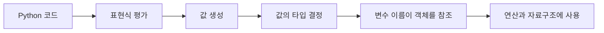
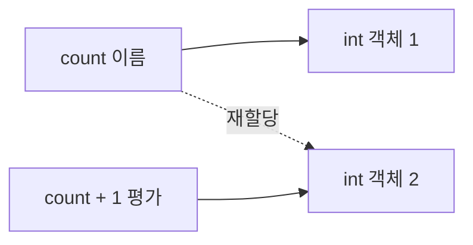
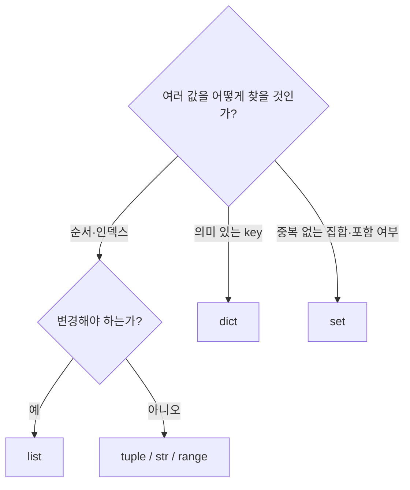

# Python Basic Syntax 1: 값과 타입에서 컬렉션까지

- 🎯 글의 목표: Python 코드가 표현식을 평가해 값을 만들고, 변수가 그 값을 참조하는 방식을 이해한 뒤 기본 자료형과 컬렉션을 상황에 맞게 선택한다.
- 🧩 핵심 키워드: 표현식, 값, 타입, 변수, 객체, `int`, `float`, `str`, `list`, `tuple`, `range`, `dict`, `set`, `None`, `bool`, 형변환
- ⭐ 중요도: 매우 높음. 이후 조건문, 반복문, 함수, 알고리즘에서 사용하는 모든 데이터의 출발점이다.
- 📝 한눈에 보는 내용: Python의 실행 방식과 변수의 의미를 먼저 잡고, 숫자·문자열·시퀀스·비시퀀스 자료형을 비교한다. 마지막에는 암시적·명시적 형변환과 초반 디버깅 기준을 정리한다.
- 🔗 관련 문제 / 주제: 입력값 처리, 문자열 인덱싱, 리스트 순회, 빈도표, 중복 제거, 자료형 선택

---

## 1. 들어가며

Python을 처음 배울 때는 `print()`나 리스트 문법을 빠르게 외우기 쉽다. 그러나 문법 조각만 기억하면 조금만 코드가 달라져도 왜 결과가 그렇게 나오는지 설명하기 어렵다. 먼저 코드가 **표현식을 평가해 값을 만들고, 각 값은 타입을 가지며, 변수는 그 값을 참조한다**는 흐름을 잡아야 한다.

예를 들어 `result = 1 + 2`라는 한 줄에는 여러 개념이 함께 들어 있다. `1 + 2`는 계산할 수 있는 표현식이고, 평가 결과는 정수 값 `3`이다. `3`은 `int` 타입의 객체이며, 이름 `result`가 그 객체를 가리키도록 바인딩된다.

이번 강의는 이 작은 흐름에서 시작해 Python의 주요 자료형을 살펴본다. 자료형을 단순히 문법 목록으로 외우지 않고, **순서가 필요한가, 값을 변경해야 하는가, key로 조회해야 하는가, 중복을 제거해야 하는가**라는 질문으로 선택할 수 있도록 정리한다.

## 2. 핵심 개념 정리

이 강의가 해결하는 첫 번째 질문은 "Python은 작성한 코드를 어떤 값으로 이해하는가"이다. 표현식이 평가되어 값이 되고, 모든 값은 타입을 가진다. 변수는 값을 담는 상자라기보다 객체를 가리키는 이름으로 이해해야 재할당과 가변 객체의 동작을 설명하기 쉽다.

두 번째 질문은 "여러 종류의 데이터를 어떤 자료형으로 표현할 것인가"이다. 숫자에는 `int`, `float`가 있고, 순서 있는 데이터에는 `str`, `list`, `tuple`, `range`가 있다. key와 value의 대응에는 `dict`, 중복 없는 집합에는 `set`이 적합하다. `None`과 `bool`은 값이 없거나 논리 상태를 표현한다.

마지막에는 서로 다른 타입이 연산에 참여할 때 일어나는 형변환을 살펴본다. Python이 안전한 범위에서 자동으로 바꾸는 암시적 형변환과, 개발자가 `int()`, `str()`처럼 의도를 드러내는 명시적 형변환을 구분한다.



## 3. 본문 정리

### 3.1 Python은 표현식을 평가해 값을 만든다

표현식은 하나의 값으로 평가될 수 있는 코드다. 숫자 리터럴 하나도 표현식이고, 연산식이나 함수 호출도 결과를 만들면 표현식이다.

```python
3                 # 정수 값 3으로 평가된다.
1 + 2             # 덧셈 결과인 3으로 평가된다.
len('python')     # 함수 호출 결과인 6으로 평가된다.
'py' + 'thon'     # 문자열 'python'으로 평가된다.
```

평가는 표현식을 계산해 하나의 값으로 만드는 과정이다. 대화형 Python 환경에서는 표현식을 입력하면 평가 결과가 바로 보이지만, `.py` 파일에서는 결과를 화면에 표시하려면 `print()`가 필요하다.

```python
# 계산은 수행되지만 파일 실행 화면에는 표시되지 않는다.
1 + 2

# print가 평가 결과를 표준 출력으로 보낸다.
print(1 + 2)  # 3
```

값은 표현식의 결과이며 프로그램이 다루는 실제 데이터다. 같은 모양처럼 보여도 타입이 다르면 다른 값으로 취급될 수 있다.

```python
print(1)       # 정수
print('1')     # 문자열
print(1 == '1')  # False
```

정수 `1`은 계산에 사용할 수 있고 문자열 `'1'`은 문자 하나의 순서 있는 데이터다. 화면 출력만 보고 두 값을 같다고 판단하면 이후 입력 처리에서 오류가 생긴다.

📌 핵심: 코드를 읽을 때 "이 표현식은 어떤 값으로 평가되며, 그 값의 타입은 무엇인가"를 먼저 질문한다.

### 3.2 모든 값은 타입을 가진다

타입은 값이 어떤 종류인지, 어떤 연산을 지원하는지 설명한다. `type()`으로 객체의 타입을 확인할 수 있다.

```python
print(type(10))          # <class 'int'>
print(type(3.14))        # <class 'float'>
print(type('hello'))     # <class 'str'>
print(type([1, 2, 3]))   # <class 'list'>
```

타입이 중요한 이유는 사용할 수 있는 연산이 달라지기 때문이다.

```python
print(10 + 20)        # 30: int 덧셈
print('10' + '20')    # '1020': str 연결

# int와 str의 덧셈 규칙은 정의되어 있지 않다.
# print(10 + '20')    # TypeError
```

`+` 기호가 같아도 피연산자의 타입에 따라 의미가 달라진다. 오류 메시지에서 `unsupported operand type`이나 `can only concatenate`를 만나면 먼저 양쪽 값의 타입을 확인한다.

### 3.3 변수는 객체를 가리키는 이름이다

변수는 값을 저장하는 이름이다. 더 정확하게 말하면 Python 객체를 참조하도록 붙인 이름이다. 할당문 `name = value`는 오른쪽 표현식을 먼저 평가하고, 결과 객체를 왼쪽 이름이 가리키게 한다.

```python
temperature = 25
language = 'Python'

print(temperature)  # 25
print(language)     # Python
```

할당 기호 `=`는 수학의 같다는 의미가 아니다. 오른쪽 결과를 왼쪽 이름에 연결하는 연산이다.

```python
count = 1
count = count + 1

print(count)  # 2
```

두 번째 줄은 현재 `count`가 가리키는 값 `1`을 읽고, `1 + 1`을 평가해 새 값 `2`를 만든 뒤, 이름 `count`가 `2`를 가리키게 한다.



여러 이름이 같은 객체를 참조할 수도 있다.

```python
original = [1, 2]
copied_name = original

# 두 이름이 같은 list 객체를 참조하므로 한쪽 변경이 함께 보인다.
copied_name.append(3)

print(original)     # [1, 2, 3]
print(copied_name)  # [1, 2, 3]
```

`copied_name = original`은 리스트 내용을 복사한 것이 아니라 같은 객체에 두 번째 이름을 붙인 것이다. 독립된 리스트가 필요하면 상황에 따라 `original.copy()`나 슬라이싱을 사용한다.

⚠️ 주의: 변수 이름은 의미가 드러나게 작성한다. `a`, `b`는 짧은 실습에서는 가능하지만 실제 코드에서는 `student_count`, `max_score`처럼 역할을 표현하는 이름이 이해하기 쉽다.

### 3.4 객체와 메모리 주소를 확인하는 id

Python에서 값은 객체로 존재한다. `id()`는 객체를 식별하는 정수를 반환하며, 두 변수가 같은 객체를 참조하는지 관찰할 때 사용할 수 있다.

```python
numbers = [1, 2, 3]
alias = numbers

print(id(numbers))
print(id(alias))
print(id(numbers) == id(alias))  # True
```

`is`는 두 이름이 같은 객체를 참조하는지 확인하고, `==`는 두 객체의 값이 같은지 비교한다.

```python
left = [1, 2]
right = [1, 2]

print(left == right)  # True: 담긴 값은 같다.
print(left is right)  # False: 서로 다른 list 객체다.
```

값 비교에는 보통 `==`를 사용한다. `is`는 `None`처럼 하나의 특별한 객체인지 확인할 때 주로 사용한다.

```python
result = None

if result is None:
    print('아직 결과가 없습니다.')
```

### 3.5 Numeric Types: 정수와 실수

숫자 자료형 중 가장 자주 사용하는 것은 정수 `int`와 실수 `float`다.

```python
integer_number = 10
negative_number = -3
floating_number = 3.14
```

Python의 정수는 메모리가 허용하는 범위에서 매우 큰 값도 표현할 수 있다. 다른 언어의 고정 크기 정수와 차이가 날 수 있는 부분이다.

#### 정수의 진법 표현

정수 리터럴은 2진수, 8진수, 16진수로도 작성할 수 있다.

```python
binary_number = 0b10      # 2진수 10 -> 10진수 2
octal_number = 0o30       # 8진수 30 -> 10진수 24
hex_number = 0x10         # 16진수 10 -> 10진수 16

print(binary_number)  # 2
print(octal_number)   # 24
print(hex_number)     # 16
```

접두사 `0b`, `0o`, `0x`가 각각 진법을 나타낸다. 출력하면 기본적으로 10진수 형태로 보인다.

#### 산술 연산

```python
print(7 + 3)   # 10
print(7 - 3)   # 4
print(7 * 3)   # 21
print(7 / 3)   # 2.333...: 나눗셈 결과는 float
print(7 // 3)  # 2: 몫
print(7 % 3)   # 1: 나머지
print(2 ** 3)  # 8: 거듭제곱
```

`/`와 `//`를 혼동하기 쉽다. `/`는 일반 나눗셈이고 결과가 `float`이며, `//`는 내림한 몫을 구한다. 음수의 몫은 0 방향이 아니라 작은 정수 방향으로 내림한다는 점도 주의한다.

```python
print(-7 // 3)  # -3
print(-7 % 3)   # 2
```

#### 부동소수점 오차

컴퓨터는 일부 실수를 2진수로 정확하게 표현하지 못한다.

```python
print(0.1 + 0.2)       # 0.30000000000000004
print(0.1 + 0.2 == 0.3)  # False
```

실수를 비교할 때는 오차 허용 범위를 사용하거나 `math.isclose()`를 고려한다.

```python
import math

print(math.isclose(0.1 + 0.2, 0.3))  # True
```

이 현상은 Python의 계산 오류라기보다 부동소수점 표현 방식의 한계다.

### 3.6 Sequence Types의 공통 특징

시퀀스는 여러 값을 **순서대로 나열하여 저장하는 자료형**이다. Python의 대표 시퀀스는 `str`, `list`, `tuple`, `range`다.

시퀀스는 서로 다른 자료형이지만 공통 연산을 지원한다.

| 특징 | 의미 | 예시 |
|---|---|---|
| 순서 | 각 요소의 위치가 정해짐 | 첫 번째, 두 번째 요소 |
| 인덱싱 | 한 위치의 요소 조회 | `data[0]` |
| 슬라이싱 | 일정 범위 조회 | `data[1:4]` |
| 길이 | 요소 개수 확인 | `len(data)` |
| 반복 | 요소를 차례로 사용 | `for item in data` |
| 포함 여부 | 값의 존재 확인 | `item in data` |

Python 인덱스는 0부터 시작한다.

```python
word = 'python'

print(word[0])   # p
print(word[1])   # y
print(word[-1])  # n: 뒤에서 첫 번째
```

존재하지 않는 인덱스에 접근하면 `IndexError`가 발생한다.

```python
# 길이가 6이므로 마지막 인덱스는 5다.
# print(word[6])  # IndexError
```

슬라이싱은 `sequence[start:stop:step]` 형태다. `start`는 포함하고 `stop`은 포함하지 않는다.

```python
word = 'python'

print(word[1:4])   # yth: 인덱스 1, 2, 3
print(word[:3])    # pyt: 처음부터 인덱스 2까지
print(word[3:])    # hon: 인덱스 3부터 끝까지
print(word[::2])   # pto: 두 칸씩 이동
print(word[::-1])  # nohtyp: 역순
```

`stop`을 제외하는 규칙 덕분에 슬라이스 길이를 `stop - start`로 계산하기 쉽고, 구간을 이어 붙일 때 경계가 겹치지 않는다.

### 3.7 str: 문자들의 불변 시퀀스

문자열 `str`은 문자들이 순서대로 나열된 시퀀스다. 작은따옴표나 큰따옴표로 작성할 수 있으며 한 프로젝트에서는 일관된 스타일을 유지한다.

```python
single_quote = 'Python'
double_quote = "Python"
```

문자열 안에 따옴표를 포함하려면 다른 종류의 따옴표로 감싸거나 escape sequence를 사용한다.

```python
message = "It's Python."
quote = '그는 "안녕하세요"라고 말했다.'
escaped = '첫째 줄\n둘째 줄'

print(escaped)
```

대표 escape sequence는 다음과 같다.

| 표현 | 의미 |
|---|---|
| `\n` | 줄바꿈 |
| `\t` | 탭 |
| `\\` | 역슬래시 문자 |
| `\'`, `\"` | 따옴표 문자 |

문자열은 불변 자료형이다. 인덱스로 문자를 읽을 수 있지만 특정 위치를 직접 바꿀 수는 없다.

```python
word = 'python'
print(word[0])

# word[0] = 'P'  # TypeError

# 변경된 새 문자열을 만들어 재할당한다.
word = 'P' + word[1:]
print(word)  # Python
```

#### f-string

f-string은 문자열 안에 표현식 결과를 넣는 방법이다.

```python
name = '민수'
score = 87

message = f'{name}의 점수는 {score}점입니다.'
print(message)
```

중괄호 안에는 변수뿐 아니라 계산식도 넣을 수 있다.

```python
price = 1000
quantity = 3

print(f'총액: {price * quantity}원')
```

문자열 연결을 여러 번 사용하는 것보다 값의 위치가 분명하고 타입을 직접 `str()`로 바꾸지 않아도 된다.

### 3.8 list: 순서가 있고 변경 가능한 컬렉션

리스트는 여러 값을 순서대로 저장하며 요소를 변경할 수 있는 가변 시퀀스다. 대괄호로 작성하고 서로 다른 타입도 함께 담을 수 있다.

```python
numbers = [1, 2, 3]
mixed = [1, 'python', True]
nested = [[1, 2], [3, 4]]
```

알고리즘에서는 같은 의미의 데이터들을 한 리스트에 담는 경우가 많다. 타입을 섞을 수 있다는 사실과 실제로 섞는 것이 좋은지는 별개의 문제다.

```python
scores = [85, 90, 78]

# 인덱스로 한 요소를 변경할 수 있다.
scores[2] = 88

# append는 리스트 끝에 요소 하나를 추가한다.
scores.append(95)

print(scores)  # [85, 90, 88, 95]
```

중첩 리스트는 인덱스를 여러 번 사용해 내부 값에 접근한다.

```python
matrix = [
    [1, 2, 3],
    [4, 5, 6],
]

print(matrix[0])     # [1, 2, 3]
print(matrix[1][2])  # 6
```

⚠️ 주의: 리스트를 곱해 중첩 리스트를 만들면 내부 리스트가 같은 객체를 참조할 수 있다.

```python
wrong_matrix = [[0] * 3] * 2
wrong_matrix[0][0] = 1

print(wrong_matrix)  # [[1, 0, 0], [1, 0, 0]]
```

독립된 행이 필요하면 각 행을 새로 만든다.

```python
matrix = [[0] * 3 for _ in range(2)]
matrix[0][0] = 1

print(matrix)  # [[1, 0, 0], [0, 0, 0]]
```

### 3.9 tuple: 변경할 수 없는 시퀀스

튜플은 리스트처럼 순서가 있지만 요소를 변경할 수 없는 불변 시퀀스다. 소괄호로 표현하는 경우가 많다.

```python
point = (10, 20)
colors = ('red', 'green', 'blue')
```

요소가 하나인 튜플에는 쉼표가 필요하다.

```python
not_tuple = (1)
single_tuple = (1,)

print(type(not_tuple))     # int
print(type(single_tuple))  # tuple
```

튜플을 만드는 핵심은 괄호보다 쉼표다. 함수가 여러 값을 반환할 때도 실제로는 튜플 형태로 묶여 전달된다.

```python
def get_point():
    return 10, 20

result = get_point()
print(result)        # (10, 20)
print(type(result))  # tuple
```

변경되지 않아야 하는 좌표, 설정 값, 여러 반환값을 하나로 묶을 때 적합하다.

### 3.10 range: 연속된 정수 시퀀스를 표현한다

`range`는 연속된 정수 범위를 나타내는 불변 시퀀스다. 모든 숫자를 리스트로 미리 저장하지 않고 시작, 끝, 간격 정보를 이용해 필요한 값을 만든다.

```python
range(stop)
range(start, stop)
range(start, stop, step)
```

```python
print(list(range(5)))        # [0, 1, 2, 3, 4]
print(list(range(2, 6)))     # [2, 3, 4, 5]
print(list(range(1, 10, 2))) # [1, 3, 5, 7, 9]
print(list(range(5, 0, -1))) # [5, 4, 3, 2, 1]
```

슬라이싱과 마찬가지로 `stop` 값은 포함되지 않는다. 반복문에서 횟수나 인덱스 범위를 표현할 때 자주 사용한다.

```python
for number in range(3):
    print(number)
```

아직 반복문을 깊게 다루지 않더라도 `range(3)`이 `0, 1, 2`의 순서를 제공한다는 점을 기억해 둔다.

### 3.11 dict: key와 value의 대응 관계

딕셔너리는 key와 value의 쌍을 저장하는 비시퀀스 자료형이다. 순서 위치보다 이름이나 식별자로 값을 찾고 싶을 때 사용한다.

```python
student = {
    'name': '민수',
    'age': 20,
    'score': 87,
}

print(student['name'])   # 민수
print(student['score'])  # 87
```

key는 중복될 수 없다. 같은 key를 다시 작성하거나 할당하면 이전 value가 새 value로 바뀐다.

```python
student['score'] = 92
student['major'] = 'Computer Science'

print(student)
```

존재하지 않는 key를 대괄호로 조회하면 `KeyError`가 발생한다.

```python
# print(student['email'])  # KeyError

# get은 key가 없을 때 None 또는 지정한 기본값을 반환한다.
print(student.get('email'))
print(student.get('email', '등록되지 않음'))
```

딕셔너리 key에는 변경 불가능한 자료형을 사용해야 한다. 문자열, 정수, 적절한 튜플은 key가 될 수 있지만 리스트는 key가 될 수 없다.

```python
valid = {
    'name': '민수',
    1: 'one',
    (0, 0): 'origin',
}

# invalid = {[1, 2]: 'list key'}  # TypeError
```

리스트와 딕셔너리 선택 기준은 조회 방식이다.

```text
순서 위치로 찾는다 -> list
의미 있는 key로 찾는다 -> dict
```

### 3.12 set: 중복 없는 값의 집합

세트는 순서와 중복이 없는 비시퀀스 자료형이다. 집합 연산과 중복 제거가 필요할 때 사용한다.

```python
numbers = {1, 2, 3, 3}
print(numbers)  # 중복 3은 한 번만 남는다.
```

빈 세트를 만들 때는 `{}`가 아니라 `set()`을 사용한다. `{}`는 빈 딕셔너리다.

```python
empty_dict = {}
empty_set = set()

print(type(empty_dict))  # dict
print(type(empty_set))   # set
```

대표 집합 연산은 다음과 같다.

```python
left = {1, 2, 3}
right = {3, 4, 5}

print(left | right)  # 합집합: {1, 2, 3, 4, 5}
print(left & right)  # 교집합: {3}
print(left - right)  # 차집합: {1, 2}
```

리스트의 중복을 제거할 때 세트로 바꿀 수 있지만 순서는 보장 기준으로 삼으면 안 된다.

```python
values = [3, 1, 3, 2, 1]
unique_values = set(values)

print(unique_values)
```

원래 등장 순서를 유지한 중복 제거가 필요하면 다른 방법을 선택해야 한다.

```python
values = [3, 1, 3, 2, 1]
unique_in_order = list(dict.fromkeys(values))

print(unique_in_order)  # [3, 1, 2]
```

### 3.13 None과 bool

`None`은 값이 없음을 표현하는 특별한 객체다. 아직 결과가 정해지지 않았거나 반환할 유효한 값이 없다는 상태를 나타낼 때 사용한다.

```python
result = None

print(result)        # None
print(type(result))  # NoneType
```

`bool`은 `True`와 `False` 두 값으로 논리 상태를 표현한다.

```python
is_logged_in = True
has_permission = False
```

비교 연산의 결과도 boolean이다.

```python
print(3 < 5)   # True
print(3 == 5)  # False
print(3 != 5)  # True
```

Python은 조건 문맥에서 여러 값을 참과 거짓으로 평가한다. `0`, `0.0`, 빈 문자열, 빈 컬렉션, `None`은 거짓으로 평가된다.

```python
print(bool(0))       # False
print(bool(''))      # False
print(bool([]))      # False
print(bool(None))    # False

print(bool(1))       # True
print(bool('0'))     # True: 비어 있지 않은 문자열
print(bool([0]))     # True: 요소가 있는 리스트
```

문자열 `'False'`도 비어 있지 않으므로 `True`로 평가된다. 문자열 내용이 영어 단어 False인 것과 빈 값 여부는 다른 문제다.

### 3.14 컬렉션을 특성으로 비교하기

컬렉션 자료형을 선택할 때는 순서, 변경 가능성, 중복, 접근 방법을 비교한다.

| 자료형 | 순서 | 변경 가능 | 중복 | 주요 접근 방식 |
|---|---|---|---|---|
| `str` | 있음 | 불가 | 허용 | 인덱스 |
| `list` | 있음 | 가능 | 허용 | 인덱스 |
| `tuple` | 있음 | 불가 | 허용 | 인덱스 |
| `range` | 있음 | 불가 | 범위 규칙에 따름 | 인덱스·반복 |
| `dict` | 삽입 순서 유지 | 가능 | key 중복 불가 | key |
| `set` | 순서를 기준으로 사용하지 않음 | 가능 | 불가 | 포함 여부·집합 연산 |



자료형 선택 예시를 문장으로 바꾸면 다음과 같다.

- 학생 점수를 입력 순서대로 저장하고 수정한다: `list`
- 좌표 `(x, y)`를 하나의 변경되지 않는 값으로 묶는다: `tuple`
- 사용자 이름으로 프로필을 찾는다: `dict`
- 두 반에 공통으로 속한 학생을 찾는다: `set`
- 0부터 N-1까지 반복 범위를 표현한다: `range`

### 3.15 암시적 형변환

형변환은 한 타입의 값을 다른 타입으로 바꾸는 과정이다. Python이 데이터 손실 위험이 낮다고 판단해 자동으로 변환하는 경우를 암시적 형변환이라고 한다.

```python
result = 3 + 5.0

print(result)        # 8.0
print(type(result))  # float
```

정수 `3`이 실수 계산에 참여할 수 있도록 `3.0`으로 해석된다. boolean은 정수의 하위 타입처럼 숫자 연산에 참여할 수 있다.

```python
print(True + 1)   # 2
print(False + 1)  # 1
```

문법적으로 가능하더라도 boolean을 일반 숫자처럼 계산하는 코드는 의도가 불분명할 수 있다. 데이터 개수 계산 등 명확한 경우에만 사용한다.

문자열과 숫자처럼 의미가 크게 다른 타입은 자동으로 변환하지 않는다.

```python
# print('3' + 5)  # TypeError
```

Python은 개발자의 의도를 알 수 없기 때문이다. 문자열 연결을 원하는지 숫자 덧셈을 원하는지 명시해야 한다.

### 3.16 명시적 형변환

명시적 형변환은 개발자가 변환 함수를 직접 호출하는 방식이다.

```python
number_text = '42'
number = int(number_text)

print(number + 8)  # 50
```

대표 변환 함수는 다음과 같다.

| 함수 | 변환 결과 | 예시 |
|---|---|---|
| `int(value)` | 정수 | `int('10')` |
| `float(value)` | 실수 | `float('3.14')` |
| `str(value)` | 문자열 | `str(100)` |
| `list(iterable)` | 리스트 | `list('abc')` |
| `tuple(iterable)` | 튜플 | `tuple([1, 2])` |
| `set(iterable)` | 세트 | `set([1, 1, 2])` |
| `dict(iterable)` | 딕셔너리 | key-value 쌍들의 반복 가능 객체 |

모든 값이 원하는 타입으로 변환되는 것은 아니다.

```python
print(int('10'))      # 10
print(float('3.14'))  # 3.14

# 숫자 형태가 아닌 문자열은 정수로 변환할 수 없다.
# print(int('hello'))  # ValueError

# 소수점 문자열을 int로 바로 바꿀 수 없다.
# print(int('3.14'))   # ValueError
```

`int(float('3.14'))`는 가능하지만 실수 `3.14`를 정수 `3`으로 바꾸면서 소수 부분이 사라진다.

```python
value = int(float('3.14'))
print(value)  # 3
```

입력 함수 `input()`의 반환값이 항상 문자열이라는 점은 형변환을 가장 자주 사용하는 이유다.

```python
age_text = input('나이를 입력하세요: ')
age = int(age_text)

print(f'내년 나이: {age + 1}')
```

⚠️ 주의: 외부 입력은 변환 가능한 형태인지 보장되지 않는다. 이후 예외 처리를 배우면 `ValueError`에 대비할 수 있다.

### 3.17 Style Guide와 주석

Python의 대표 스타일 가이드는 PEP 8이다. 스타일은 실행 결과를 바꾸지 않더라도 다른 사람이 코드를 읽고 유지하는 데 영향을 준다.

기초 단계에서 우선 지킬 기준은 다음과 같다.

- 들여쓰기는 공백 4칸을 사용한다.
- 변수와 함수 이름은 소문자와 밑줄을 사용하는 `snake_case`로 작성한다.
- 상수처럼 취급하는 값은 대문자와 밑줄로 표현한다.
- 연산자 주변과 쉼표 뒤에 적절한 공백을 둔다.
- 한 줄에 여러 동작을 몰아넣지 않는다.
- 이름만 보고 역할을 짐작할 수 있게 한다.

```python
MAX_STUDENT_COUNT = 30

student_name = '민수'
student_score = 90
```

주석은 코드가 무엇을 하는지 그대로 번역하기보다 왜 그렇게 작성했는지 설명할 때 가치가 있다.

```python
# 나쁜 예: score에 10을 더한다.
score = score + 10

# 좋은 예: 보너스 문제 정답자에게 10점을 반영한다.
score = score + 10
```

한 줄 주석은 `#`을 사용하고, 여러 줄 설명이나 함수 문서화에는 이후 docstring을 사용한다.

### 3.18 처음 만나는 오류를 타입 관점에서 읽기

오류 메시지는 실패 사실만 알려 주는 문장이 아니라 문제의 종류와 위치를 제공한다.

| 오류 | 자주 발생하는 원인 |
|---|---|
| `SyntaxError` | 괄호·따옴표 누락, 잘못된 문법 |
| `NameError` | 아직 정의하지 않은 변수 이름 사용 |
| `TypeError` | 지원하지 않는 타입 조합의 연산 |
| `ValueError` | 타입은 맞지만 변환할 수 없는 값 |
| `IndexError` | 시퀀스 범위를 벗어난 인덱스 |
| `KeyError` | 딕셔너리에 없는 key 조회 |

```python
# NameError: 이름이 할당되기 전에 사용했다.
# print(total_score)

# TypeError: 문자열과 정수는 바로 더할 수 없다.
# print('10' + 20)

# ValueError: 문자열 형식이 정수로 해석될 수 없다.
# print(int('ten'))
```

오류를 만났을 때는 다음 순서로 확인한다.

1. traceback의 마지막 줄에서 오류 종류와 메시지를 읽는다.
2. 표시된 코드 줄에서 사용한 변수의 값을 확인한다.
3. `type()`으로 예상한 타입과 실제 타입을 비교한다.
4. 컬렉션이면 인덱스나 key가 실제로 존재하는지 확인한다.
5. 형변환을 추가하기 전에 데이터가 왜 그 타입으로 들어왔는지 확인한다.

## 4. 적용 관점에서 다시 보기

Python 기초 문제를 풀 때는 곧바로 반복문부터 작성하기보다 데이터의 모양을 먼저 결정한다.

### 4.1 입력과 출력의 타입부터 적기

문제의 입력 예시가 숫자처럼 보여도 `input()`의 결과는 문자열이다. 계산 전에 어떤 형변환이 필요한지 정한다.

```python
# 공백으로 구분된 정수 입력을 리스트로 변환한다.
numbers = list(map(int, input().split()))
```

이 표현은 다음 단계를 압축한 것이다.

1. `input()`이 한 줄 문자열을 반환한다.
2. `split()`이 공백 기준 문자열 리스트를 만든다.
3. `map(int, ...)`가 각 문자열을 정수로 변환한다.
4. `list()`가 변환 결과를 리스트로 만든다.

처음에는 단계별 값을 출력해 보는 것이 좋다.

### 4.2 자료형 선택 질문

- 입력 순서와 중복이 중요하면 `list`를 고려한다.
- 값이 바뀌면 안 되는 묶음은 `tuple`을 고려한다.
- 이름이나 번호로 값을 빠르게 찾으려면 `dict`를 고려한다.
- 중복 제거와 포함 여부가 핵심이면 `set`을 고려한다.
- 단순 반복 범위는 전체 숫자 리스트보다 `range`가 적합하다.

### 4.3 변경 가능성을 확인하기

문자열과 튜플은 불변이므로 한 요소를 직접 바꾸지 못한다. 변경된 값을 만들려면 새 객체를 생성하고 변수에 다시 할당한다. 리스트와 딕셔너리와 세트는 가변이므로 메서드나 인덱스 할당으로 객체 내부를 변경할 수 있다.

가변 객체를 다른 변수에 할당할 때는 같은 객체를 공유하는지 확인한다. 독립된 복사가 필요한 문제에서 단순 할당을 사용하면 예상하지 못한 변경이 함께 나타난다.

### 4.4 문제에서 보이는 적용 신호

| 문제 표현 | 떠올릴 자료형·개념 |
|---|---|
| "순서대로", "i번째" | 시퀀스, 인덱싱 |
| "구간", "일부 문자열" | 슬라이싱 |
| "중복 없이" | set 또는 dict key |
| "이름별 점수" | dict |
| "공통 원소" | set 교집합 |
| "숫자로 계산" | 입력 문자열의 형변환 |
| "값이 없다" | None |

## 5. 배운 점 / 확장 포인트

### 5.1 이번 강의 이전에 몰랐던 것 또는 새로 이해된 것

변수는 값을 영구히 담아 두는 상자가 아니라 객체를 가리키는 이름이다. 이 관점으로 보면 재할당과 리스트 별칭 문제를 같은 원리로 설명할 수 있다.

자료형은 문법 모양보다 데이터 사용 방식으로 선택해야 한다. 순서, 변경 가능성, 중복, 조회 기준을 먼저 판단하면 `list`, `dict`, `set` 중 무엇이 필요한지 분명해진다.

### 5.2 앞으로 이어지는 연결점

다음 단계의 조건문은 boolean 평가를 사용하고, 반복문은 시퀀스와 컬렉션의 요소를 차례로 처리한다. 함수는 입력값과 반환값의 타입을 다루므로 이번 강의의 값·타입 개념이 그대로 이어진다.

알고리즘에서는 리스트의 인덱스, 딕셔너리의 key 조회, 세트의 포함 여부를 반복해서 사용한다. 자료구조의 특성을 알면 코드가 동작하는 것뿐 아니라 왜 그 구조가 적합한지도 설명할 수 있다.

### 5.3 더 파볼 만한 주제

얕은 복사와 깊은 복사, 객체의 hash 가능성, 문자열 encoding, float 대신 `Decimal`이 필요한 상황, 각 컬렉션 연산의 시간 복잡도를 이어서 학습할 수 있다.

## 6. 요약 정리

- 표현식은 평가되어 하나의 값을 만들고, 모든 값은 타입을 가진다.
- 변수는 객체를 참조하는 이름이며 재할당하면 다른 객체를 가리킬 수 있다.
- `int`, `float`는 숫자 계산에 사용하며 실수에는 부동소수점 오차가 있을 수 있다.
- `str`, `list`, `tuple`, `range`는 순서가 있는 시퀀스다.
- 리스트는 가변이고 문자열과 튜플은 불변이다.
- 딕셔너리는 key-value 대응, 세트는 중복 없는 집합을 표현한다.
- `None`은 값이 없음을, `bool`은 논리 상태를 표현한다.
- 형변환 전에는 현재 값의 타입과 변환 가능한 형태인지 확인한다.

🧠 기억할 것: **자료형을 고를 때 문법보다 순서, 변경 가능성, 중복, 조회 방식을 먼저 생각한다.**

## 7. 미니 퀴즈 또는 체크리스트

- [ ] 표현식, 값, 타입의 관계를 `result = 1 + 2` 예제로 설명할 수 있는가?
- [ ] `==`와 `is`의 차이를 서로 다른 두 리스트로 설명할 수 있는가?
- [ ] 문자열과 리스트의 변경 가능성 차이를 코드로 보여 줄 수 있는가?
- [ ] 슬라이싱에서 stop 인덱스가 제외되는 규칙을 설명할 수 있는가?
- [ ] 리스트, 튜플, 딕셔너리, 세트 중 상황에 맞는 자료형을 선택할 수 있는가?
- [ ] `input()`으로 받은 숫자를 계산하기 전에 형변환해야 하는 이유를 설명할 수 있는가?
- [ ] `TypeError`, `ValueError`, `IndexError`, `KeyError`의 대표 원인을 구분할 수 있는가?
