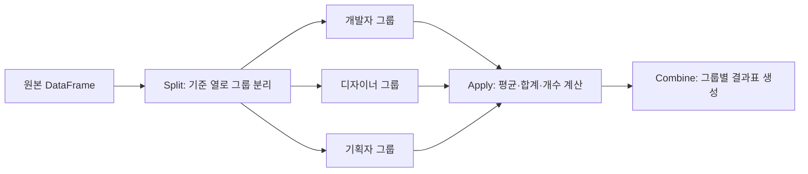
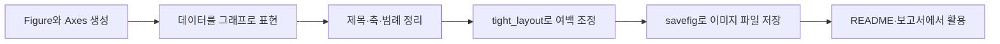

# NumPy, Pandas, Matplotlib 데이터 분석 기초와 Netflix 주가 분석

- 🎯 글의 목표: NumPy, Pandas, Matplotlib의 역할을 하나의 데이터 분석 흐름 안에서 이해하고, Netflix 주가 데이터를 전처리·분석·시각화하는 전 과정을 익힌다.
- 🧩 핵심 키워드: NumPy, `ndarray`, `reshape`, indexing, slicing, copy, Pandas, `DataFrame`, `loc`, `iloc`, 결측치, `groupby`, `pivot_table`, `melt`, Matplotlib, 시계열, Netflix 주가 분석
- ⭐ 중요도: ★★★★★  
  데이터 분석 과제나 프로젝트에서 가장 먼저 만나는 흐름이 바로 `데이터 읽기 → 전처리 → 분석 → 시각화 → 해석`이다. 이번 내용은 이후 금융 데이터, 영화·도서 API 데이터와 차트 프로젝트로 이어지는 기본기다.
- 📝 한눈에 보는 내용:  
  이번 자료는 NumPy로 배열을 다루는 법에서 출발해, Pandas DataFrame으로 CSV 데이터를 읽고 정리하는 흐름으로 확장된다. 그다음 결측치 처리, 그룹화, 정렬, 피벗, melt, apply 같은 실무형 Pandas 기능을 익히고, Matplotlib으로 데이터를 그래프로 표현한다. 마지막에는 Netflix 주가 데이터 프로젝트를 통해 날짜 필터링, 최고·최저 종가 추출, 월별 평균 종가 계산, 월별 최고·최저·종가 시각화를 하나의 데이터 분석 흐름으로 연결한다.
- 🔗 관련 문제 / 주제: 데이터 분석 프로젝트, 금융 데이터 분석, 주식 시계열 분석, Pandas 전처리, Matplotlib 시각화, CSV 처리, Jupyter Notebook

---

## 1. 들어가며

데이터 분석을 처음 배울 때 가장 헷갈리는 부분은 라이브러리 함수 하나하나의 이름보다도, 이 함수들이 어떤 순서로 연결되는지다. `np.array()`를 배우고, `DataFrame`을 만들고, `groupby()`를 쓰고, `plt.plot()`을 그리는 각각의 문법은 따로 보면 단순해 보인다. 하지만 실제 프로젝트에서는 이들이 한 줄씩 이어져 하나의 분석 흐름을 만든다.

이번 강의 자료는 그 흐름을 단계적으로 보여준다. 먼저 NumPy에서는 숫자 데이터를 배열로 다루는 방법을 익힌다. 배열의 모양을 바꾸고, 특정 위치의 값을 꺼내고, 조건에 맞게 값을 바꾸는 방식은 이후 Pandas에서 데이터를 다룰 때도 그대로 이어진다.

그다음 Pandas에서는 CSV 파일을 읽고, DataFrame을 만들고, 특정 행과 열을 선택하며, 결측치를 처리하고, 그룹별 통계를 계산한다. 여기서 중요한 점은 Pandas가 단순히 표를 보여주는 도구가 아니라, “데이터를 분석 가능한 형태로 정리하는 도구”라는 것이다.

마지막으로 Matplotlib은 분석한 데이터를 사람이 읽을 수 있는 그래프로 바꿔준다. 숫자만 보면 흐름을 파악하기 어렵지만, 날짜별 종가, 월별 평균 종가, 최고가·최저가·종가를 그래프로 그리면 데이터의 변화 방향이 훨씬 쉽게 보인다.

이번 자료의 최종 실습은 Netflix 주가 데이터 분석이다. 이 프로젝트에서는 Kaggle에서 받은 `NFLX.csv`를 읽고, 필요한 컬럼을 선택한 뒤, 2021년 이후 데이터를 필터링하고, 최고·최저 종가와 월별 평균 종가를 구한다. 이후 2022년 이후의 최고가, 최저가, 종가를 하나의 그래프로 시각화하며 데이터 분석의 기본 흐름을 경험한다.

---

## 2. 핵심 개념 정리

이번 강의의 큰 질문은 다음과 같다.

> CSV로 주어진 현실 데이터를 어떻게 읽고, 정리하고, 분석하고, 시각화할 수 있을까?

이 질문에 답하려면 세 가지 도구의 역할을 먼저 나누어 이해해야 한다.

첫 번째 도구는 **NumPy**다. NumPy는 숫자 배열을 빠르고 편하게 다루기 위한 라이브러리다. Python 리스트로도 데이터를 저장할 수 있지만, 수치 계산이나 다차원 배열 처리는 NumPy의 `ndarray`가 훨씬 적합하다. `np.arange()`, `reshape()`, `zeros()`, `ones()`, `linspace()` 같은 함수는 배열을 만들고 구조를 바꾸는 기본 도구다.

두 번째 도구는 **Pandas**다. Pandas는 행과 열로 이루어진 표 형태의 데이터를 다룰 때 사용한다. CSV 파일을 읽어 `DataFrame`으로 만들고, `head()`, `info()`, `describe()`로 데이터를 훑어본 뒤, `loc`, `iloc`, boolean indexing으로 필요한 데이터만 선택한다. 이후 결측치를 확인하고, `dropna()`나 `fillna()`로 처리하며, `groupby()`로 그룹별 통계를 계산한다.

세 번째 도구는 **Matplotlib**이다. Matplotlib은 Pandas로 정리한 데이터를 그래프로 표현한다. 선 그래프는 시간 흐름에 따른 변화를 볼 때, 막대 그래프는 범주 간 비교를 할 때, 히스토그램은 분포를 확인할 때 유용하다. 데이터 분석 결과를 문장으로 설명하기 전에 먼저 그래프로 확인하면 이상치나 추세를 더 쉽게 발견할 수 있다.

이 세 도구가 연결되면 다음과 같은 흐름이 된다.

```text
CSV 파일 읽기
→ DataFrame 생성
→ 필요한 컬럼 선택
→ 날짜와 숫자 타입 변환
→ 조건에 맞는 데이터 필터링
→ 통계값 계산
→ 그래프로 시각화
→ 결과 해석
```

Netflix 주가 분석 프로젝트는 이 흐름을 실제 데이터에 적용한 예시다. 그래서 이번 정리는 단순히 함수 목록을 외우는 것이 아니라, 각 함수가 데이터 분석 과정의 어느 위치에서 필요한지 이해하는 방향으로 보는 것이 좋다.

---

## 3. 본문 정리

### 3.1 NumPy 기본 사용법

NumPy는 수치 데이터를 배열 형태로 다루기 위한 라이브러리다. Python의 기본 리스트도 여러 값을 담을 수 있지만, 데이터 분석에서는 배열의 크기, 차원, 자료형, 슬라이싱, 조건 처리 등이 반복적으로 필요하기 때문에 NumPy를 사용하는 편이 훨씬 효율적이다.

가장 먼저 확인해야 할 것은 Python 리스트를 NumPy 배열로 바꾸는 `np.array()`다.

```python
import numpy as np

# Python 기본 리스트
arr = [1, 2, 3, 4, 5]

# 리스트를 NumPy ndarray로 변환한다.
# ndarray가 되면 다차원 배열 연산과 벡터화 연산을 더 편하게 사용할 수 있다.
np_arr = np.array(arr)

print(np_arr)
print(type(np_arr))
```

여기서 `type(np_arr)`를 확인하면 `numpy.ndarray` 형태라는 것을 볼 수 있다. 이 차이는 이후 배열의 차원, 크기, 데이터 타입을 확인하거나 행렬처럼 슬라이싱할 때 중요해진다.

---

#### 3.1.1 배열 생성과 reshape

NumPy에서 자주 사용하는 배열 생성 함수는 `np.arange()`다. Python의 `range()`와 비슷하게 일정 범위의 숫자를 만들 수 있다.

```python
import numpy as np

# 0부터 14까지의 정수를 가진 1차원 배열을 만든다.
arr = np.arange(15)
print(arr)

# 10부터 30 전까지 5 간격으로 값을 만든다.
arr = np.arange(10, 30, 5)
print(arr)
```

배열을 분석에 맞게 다루려면 모양을 바꾸는 과정도 필요하다. 이때 `reshape()`를 사용한다.

```python
# 0부터 14까지 총 15개의 값을 만든 뒤,
# 3행 5열의 2차원 배열로 바꾼다.
arr = np.arange(15).reshape(3, 5)
print(arr)
```

`reshape(3, 5)`는 배열을 3행 5열로 바꾸겠다는 뜻이다. 여기서 중요한 점은 전체 원소 개수가 맞아야 한다는 것이다. 15개 원소는 3×5 구조로 바꿀 수 있지만, 20개 원소를 3×5 구조로 바꾸면 개수가 맞지 않아 에러가 발생한다.

```python
# 20개 원소를 3행 5열로 바꾸려고 하면 15칸만 필요하므로 크기가 맞지 않는다.
# 이런 코드는 ValueError가 발생한다.
arr = np.arange(20).reshape(3, 5)
```

⚠️ 주의: `reshape()`에서 행과 열의 곱은 원래 배열의 원소 개수와 같아야 한다. “대충 모양만 바꾸는 함수”가 아니라, 같은 데이터를 다른 차원 구조로 재배치하는 함수라고 이해해야 한다.

---

#### 3.1.2 0, 1, 특정 값, 균일 간격 배열 만들기

분석이나 실험을 하다 보면 특정 형태의 배열을 빠르게 만들어야 할 때가 많다. 모두 0인 배열, 모두 1인 배열, 특정 값으로 채워진 배열, 균일한 간격의 숫자 배열이 대표적이다.

```python
import numpy as np

# 3행 4열을 모두 0으로 채운다.
zeros = np.zeros((3, 4), dtype=np.int64)
print(zeros)

# 3행 4열을 모두 1로 채운다.
ones = np.ones((3, 4), dtype=np.int64)
print(ones)

# 3행 4열을 모두 0.11로 채운다.
full = np.full((3, 4), 0.11)
print(full)

# -5부터 5까지를 균일한 간격의 10개 숫자로 나눈다.
# 그래프의 x축 좌표를 만들 때 자주 사용된다.
linear = np.linspace(-5, 5, 10)
print(linear)
```

NumPy에서 2차원 배열의 크기는 일반적으로 `(행, 열)` 순서로 작성한다. 처음에는 x축, y축처럼 생각해서 헷갈릴 수 있지만, 표 형태 데이터에서는 “몇 개의 행이 있고, 각 행에 몇 개의 열이 있는가”로 보는 것이 더 자연스럽다.

---

#### 3.1.3 랜덤 값 생성

랜덤 데이터는 테스트용 데이터나 시뮬레이션에 자주 사용된다. NumPy 2.x 기준으로는 `np.random.default_rng()`를 사용해 Generator를 만든 뒤, `random()`이나 `integers()`를 사용하는 방식이 권장된다.

```python
import numpy as np

# 랜덤 숫자를 만들기 위한 Generator를 생성한다.
rng = np.random.default_rng()

# 0 이상 1 미만의 실수 5개를 만든다.
arr = rng.random(5)
print(arr)

# 2행 3열 형태의 랜덤 실수 배열을 만든다.
arr = rng.random((2, 3))
print(arr)

# 0 이상 5 미만의 정수 10개를 만든다.
arr = rng.integers(0, 5, size=10)
print(arr)
```

랜덤 값은 매번 실행할 때마다 결과가 달라질 수 있다. 같은 결과를 재현해야 하는 실험이라면 seed를 설정하는 방식도 함께 알아두면 좋다.

---

#### 3.1.4 배열 정보 확인하기

데이터 분석에서는 배열 안의 값만 보는 것이 아니라, 배열의 모양과 타입을 확인하는 과정도 중요하다. 특히 CSV를 읽거나 모델 입력 데이터를 만들 때는 차원과 자료형이 맞지 않아 에러가 나는 경우가 많다.

```python
arr = np.arange(15).reshape(3, 5)

# 배열의 행과 열 크기를 확인한다.
print(arr.shape)

# 배열의 차원 수를 확인한다.
print(arr.ndim)

# 배열 원소의 데이터 타입을 확인한다.
print(arr.dtype)

# 원소 하나가 차지하는 byte 크기를 확인한다.
print(arr.itemsize)

# 전체 원소 개수를 확인한다.
print(arr.size)
```

이 정보들은 단순 확인용이 아니라, 다음 작업이 가능한지 판단하는 기준이 된다. 예를 들어 `reshape()`를 하기 전에는 `arr.size`를 확인해 원소 개수가 맞는지 볼 수 있고, 숫자 연산이 안 될 때는 `arr.dtype`을 확인해야 한다.

---

#### 3.1.5 Indexing과 Slicing

NumPy의 인덱싱은 Python 리스트와 비슷하지만, 다차원 배열에서는 더 간결하게 쓸 수 있다.

```python
arr = np.arange(25).reshape(5, 5)

# Python 리스트처럼 단계적으로 접근할 수 있다.
print(arr[1][2])

# NumPy에서는 행과 열을 한 번에 지정할 수 있다.
print(arr[1, 2])
```

2차원 배열을 슬라이싱할 때는 `[행 범위, 열 범위]` 순서로 작성한다.

```python
arr = np.arange(25).reshape(5, 5)

# 1번 행 이상 3번 행 미만, 0번 열 이상 2번 열 미만
print(arr[1:3, :2])

# 모든 행에서 0번 열 이상 2번 열 미만
print(arr[:, :2])

# 모든 행과 모든 열을 대상으로 하되, 열은 2칸씩 건너뛴다.
print(arr[:, ::2])

# 1번 행부터 2칸씩, 0번 열부터 4번 열 전까지 3칸씩 선택한다.
print(arr[1::2, 0:4:3])
```

⚠️ 주의: 2차원 배열 슬라이싱에서는 앞쪽이 행, 뒤쪽이 열이다. `arr[행, 열]` 순서를 헷갈리면 원하는 데이터가 아니라 전혀 다른 영역을 선택하게 된다.

---

#### 3.1.6 얕은 복사와 깊은 복사

NumPy 배열도 Python 객체이기 때문에 단순 대입을 하면 값 자체를 새로 복사하는 것이 아니라 같은 배열을 가리킬 수 있다. 이를 얕은 복사라고 이해할 수 있다.

```python
arr = np.arange(15).reshape(3, 5)

# arr2는 arr의 값을 새로 복사한 것이 아니라 같은 배열을 가리킨다.
arr2 = arr

# arr2를 수정했지만 arr도 함께 바뀐다.
arr2[0][0] = 15
print(arr)
```

원본 배열을 보존하려면 `copy()`를 사용해야 한다.

```python
arr = np.arange(15).reshape(3, 5)

# 원본과 독립된 배열을 만든다.
arr2 = arr.copy()

# arr2만 수정된다.
arr2[0][0] = 15

print(arr)
print(arr2)
```

📌 핵심: NumPy 배열을 수정하기 전에 원본을 보존해야 하는 상황이라면 단순 대입이 아니라 `copy()`를 사용해야 한다.

---

### 3.2 Pandas 기본 사용법

Pandas는 표 형태의 데이터를 다루기 위한 라이브러리다. NumPy 배열이 수치 배열 처리에 강하다면, Pandas의 DataFrame은 행과 열 이름이 있는 데이터 분석에 강하다. CSV 파일을 읽어 분석 가능한 표로 만들고, 필요한 행과 열을 선택하고, 데이터를 추가·삭제·수정하는 과정에서 Pandas를 사용한다.

이번 자료에서는 먼저 NumPy로 CSV 파일을 읽은 뒤 DataFrame으로 변환하는 흐름을 보여준다.

```python
import numpy as np
import pandas as pd

# np.loadtxt로 CSV 파일을 2차원 문자열 배열로 읽는다.
def file_open_by_numpy():
    np_arr = np.loadtxt(
        'data/test_data.CSV',
        delimiter=',',
        encoding='cp949',
        dtype=str,
    )
    return np_arr

arr = file_open_by_numpy()

# 첫 번째 행을 컬럼명으로 사용한다.
columns = arr[0]

# 첫 번째 행은 헤더였으므로 실제 데이터에서는 제거한다.
arr = np.delete(arr, 0, 0)

# NumPy 배열을 Pandas DataFrame으로 변환한다.
df = pd.DataFrame(arr, columns=columns)

df.head()
```

이 흐름은 “파일을 읽어서 바로 분석한다”기보다, 파일 안의 구조를 파악하고 헤더와 실제 데이터를 분리한 뒤 DataFrame으로 만드는 과정이다.

---

#### 3.2.1 DataFrame 기본 확인 함수

DataFrame을 만들었다면 먼저 데이터가 어떤 모양인지 확인해야 한다. 이때 자주 사용하는 함수가 `head()`, `tail()`, `dtypes`, `info()`, `describe()`다.

```python
# 처음 5개 행을 확인한다.
df.head(5)

# 마지막 5개 행을 확인한다.
df.tail(5)

# 각 컬럼의 데이터 타입을 확인한다.
df.dtypes

# 행 개수, 컬럼 개수, 결측치 여부, 타입 정보를 함께 확인한다.
df.info()

# 컬럼별 요약 통계량을 확인한다.
df.describe()
```

`describe()`는 숫자형 데이터뿐 아니라 문자열 데이터에서도 고유값 개수, 최빈값, 빈도 등을 보여줄 수 있다. 다만 데이터 타입에 따라 출력되는 통계 항목이 달라질 수 있으므로, `dtypes`와 함께 확인하는 습관이 필요하다.

---

#### 3.2.2 loc와 iloc로 데이터 조회하기

Pandas에서 데이터를 선택할 때 가장 자주 쓰는 도구가 `loc`와 `iloc`다.

- `loc`: index 이름과 column 이름 기준으로 조회한다.
- `iloc`: 정수 위치 기준으로 조회한다.

현재 DataFrame의 index가 기본 숫자 index라면 둘이 비슷하게 보일 수 있지만, 실제로는 기준이 다르다.

```python
# index 이름이 2인 행을 가져온다.
df.loc[2]

# 여러 행을 가져온다.
df.loc[[2, 3]]

# 1부터 4까지의 index 범위를 가져온다.
# loc는 라벨 기반이라 끝 값이 포함될 수 있다.
df.loc[1:4]

# 모든 행에서 '이름' 컬럼만 가져온다.
df.loc[:, '이름']

# 모든 행에서 '이름' 컬럼을 DataFrame 형태로 가져온다.
df.loc[:, ['이름']]

# 특정 행과 특정 컬럼을 동시에 선택한다.
df.loc[[2, 5], ['이름', '직업']]
```

`loc`는 행과 열을 함께 선택할 수 있기 때문에 조건 필터링과 함께 자주 사용된다. 특히 DataFrame에서 특정 컬럼만 뽑거나, 특정 조건에 맞는 행만 남길 때 핵심이 된다.

⚠️ 주의: `df.loc[:, '이름']`은 Series 형태로 나오고, `df.loc[:, ['이름']]`은 DataFrame 형태로 나온다. 한 개 컬럼만 선택하더라도 대괄호를 한 번 더 쓰면 2차원 구조가 유지된다.

---

#### 3.2.3 행 추가와 DataFrame 합치기

DataFrame에 행을 추가할 때는 상황에 따라 `loc`나 `pd.concat()`을 사용한다. 단순히 마지막에 한 행을 추가할 때는 `loc[len(df)]`를 사용할 수 있다.

```python
# 마지막 위치에 새로운 행을 추가한다.
df.loc[len(df)] = ['마지막', '99', '남', '무직', '서울/경기']

df.tail(5)
```

여러 행을 추가하거나 다른 DataFrame을 합칠 때는 `pd.concat()`을 사용한다. Pandas 2.0 이후에는 예전의 `append()` 방식이 제거되었기 때문에 `concat()`을 기준으로 익히는 것이 좋다.

```python
# 추가할 데이터를 DataFrame으로 만든다.
df2 = pd.DataFrame({
    '이름': ['진짜마', '지막임'],
    '나이': ['98', '97'],
    '성별': ['여', '남'],
    '직업': ['개발자', '모델'],
    '사는곳': ['서울/경기', '부산/경남'],
})

# 기존 df와 df2를 세로 방향으로 합친다.
# ignore_index=True를 사용하면 index를 새로 정리한다.
df = pd.concat([df, df2], ignore_index=True)

df.tail(5)
```

⚠️ 주의: `ignore_index=True`를 빼면 기존 index가 그대로 유지되어 중복 index가 생길 수 있다. 이후 loc 기반 조회나 정렬에서 혼란이 생길 수 있으므로, 단순 결합 후 index를 새로 정리하려면 `ignore_index=True`를 사용하는 것이 좋다.

---

### 3.3 Pandas에서 자주 사용하는 실무 함수

Pandas 기본 문법을 익힌 뒤에는 실제 데이터 전처리에서 자주 쓰는 함수들을 알아야 한다. 이번 자료에서는 `read_csv`, `value_counts`, `astype`, `isna`, `dropna`, `fillna`, `groupby`, `unique`, `sort_values`, `pivot_table`, `melt`, `apply`를 다룬다.

---

#### 3.3.1 read_csv 옵션: usecols, nrows, parse_dates

CSV 파일을 읽을 때 모든 데이터를 무조건 가져올 필요는 없다. 필요한 컬럼만 가져오거나, 처음 몇 개 행만 확인하거나, 날짜 컬럼을 바로 날짜 타입으로 바꿀 수 있다.

```python
import pandas as pd

# CSV 파일 전체를 읽는다.
df = pd.read_csv('data/test_data.CSV', encoding='cp949')

# 필요한 열만 읽는다.
df = pd.read_csv(
    'data/test_data.CSV',
    encoding='cp949',
    usecols=['이름', '나이'],
)

# 처음 10개 행만 읽는다.
df = pd.read_csv(
    'data/test_data.CSV',
    encoding='cp949',
    nrows=10,
)
```

`usecols`는 데이터가 클 때 특히 유용하다. 필요 없는 컬럼까지 모두 읽으면 메모리도 많이 쓰고, 이후 분석 코드도 복잡해진다. 처음부터 필요한 컬럼만 가져오면 분석 흐름이 단순해진다.

---

#### 3.3.2 value_counts로 값 분포 확인하기

범주형 데이터에서는 값이 얼마나 자주 등장하는지 확인하는 일이 많다. 예를 들어 성별, 직업, 지역 같은 컬럼에서 각 값의 개수를 확인할 수 있다.

```python
# 성별 컬럼의 값별 개수를 확인한다.
df['성별'].value_counts()

# 비율로 보고 싶다면 normalize=True를 사용한다.
df['성별'].value_counts(normalize=True)
```

`value_counts()`는 데이터의 분포를 빠르게 파악할 때 유용하다. 분석 초반에 어떤 값이 많이 등장하는지 확인하면 이상한 값이나 불균형 데이터도 더 쉽게 발견할 수 있다.

---

#### 3.3.3 astype으로 데이터 타입 바꾸기

데이터 분석 전에는 컬럼의 타입을 확인하고 필요한 타입으로 바꾸는 과정이 거의 필수다. 숫자로 보이는 값도 CSV에서 읽으면 문자열일 수 있고, 문자열처럼 보이는 범주형 데이터는 category로 바꾸면 더 적절할 수 있다.

```python
# 이름 컬럼을 문자열 타입으로 변환한다.
df['이름'] = df['이름'].astype(str)

# 여러 컬럼의 타입을 한 번에 바꿀 때는 딕셔너리를 사용한다.
df = df.astype({
    '성별': 'category',
    '직업': 'str',
})

# 변경된 타입을 확인한다.
df.dtypes
```

⚠️ 주의: 숫자로 변환할 때 값 안에 문자가 섞여 있으면 `astype(int)`에서 에러가 날 수 있다. 이럴 때는 `pd.to_numeric(..., errors='coerce')`를 사용해 변환할 수 없는 값을 NaN으로 처리하는 방법도 있다.

---

#### 3.3.4 결측치 확인: isna와 notna

현실 데이터에는 비어 있는 값이 자주 들어 있다. Pandas에서는 이런 결측값을 보통 `NaN`으로 표시한다. 결측치가 있는지 확인할 때는 `isna()`와 `notna()`를 사용한다.

```python
# 결측값이면 True, 정상 값이면 False를 반환한다.
df.isna()

# 정상 값이면 True, 결측값이면 False를 반환한다.
df.notna()

# 컬럼별 결측값 개수를 확인한다.
df.isna().sum()

# 행별 결측값 개수를 확인한다.
df.isna().sum(axis=1)
```

`isnull()`과 `isna()`는 같은 기능이다. DB에서 비어 있는 값을 `null`이라고 부르는 데 익숙한 사람들을 위해 `isnull()`이라는 별칭이 제공된다고 이해하면 된다.

⚠️ 주의: `np.inf` 같은 무한값이나 `' '`처럼 공백 문자열은 결측값으로 자동 판단되지 않는다. 눈으로 보기에는 비어 있는 값처럼 보여도 실제로는 문자열일 수 있으므로 데이터 확인이 필요하다.

---

#### 3.3.5 dropna와 fillna

결측치를 처리하는 대표적인 방식은 두 가지다. 하나는 버리는 것이고, 다른 하나는 채우는 것이다.

`dropna()`는 결측값이 있는 행이나 열을 제거한다.

```python
# 결측값이 있는 행을 제거한 새 DataFrame을 반환한다.
df.dropna(axis=0)

# 원본 df를 직접 변경하려면 inplace=True를 사용한다.
df.dropna(axis=0, inplace=True)
```

`dropna()`에는 `how`, `thresh` 같은 옵션도 있다.

```python
# 모든 값이 NaN인 행만 제거한다.
df.dropna(axis=0, how='all', inplace=True)

# 결측값이 아닌 값이 4개 이상인 행은 남긴다.
df.dropna(axis=0, thresh=4, inplace=True)
```

반대로 `fillna()`는 결측값을 특정 값으로 채운다.

```python
# 직업 컬럼의 결측값을 '무직'으로 채운다.
df['직업'].fillna('무직', inplace=True)
```

결측값을 무조건 버리는 것이 정답은 아니다. 분석 목적에 따라 결측 행을 제거할 수도 있고, 평균값·최빈값·특정 기본값으로 채울 수도 있다. 중요한 것은 “왜 이 방식으로 처리했는지”를 설명할 수 있어야 한다는 점이다.

---

#### 3.3.6 groupby: Split, Apply, Combine

`groupby()`는 Pandas에서 매우 중요한 함수다. 특정 컬럼의 값에 따라 데이터를 그룹으로 나누고, 각 그룹에 통계 함수를 적용한 뒤, 결과를 다시 하나의 테이블로 합친다.



이 도식처럼 `groupby()`는 기준 컬럼에 따라 행을 나누고, 각 그룹에 같은 집계 함수를 적용한 다음, 결과를 하나의 표로 합친다.

```python
# 직업별 평균 나이를 계산한다.
# 평균은 숫자형 컬럼에만 의미가 있으므로 numeric_only=True를 명시한다.
df.groupby('직업').mean(numeric_only=True)

# 직업과 성별을 함께 기준으로 그룹화한 뒤 평균을 계산한다.
# reset_index()를 사용하면 그룹 기준이 다시 일반 컬럼처럼 정리된다.
df.groupby(['직업', '성별']).mean(numeric_only=True).reset_index()
```

`groupby()`는 단순 통계뿐 아니라 데이터 분석의 질문을 코드로 바꾸는 데 자주 사용된다. 예를 들어 “직업별 평균 나이는?”, “성별과 직업별 평균 나이는?”, “월별 평균 종가는?” 같은 질문은 모두 groupby 흐름으로 해결할 수 있다.

📌 핵심: groupby는 `나누기(Split) → 계산하기(Apply) → 합치기(Combine)`의 흐름으로 이해하면 좋다.

---

#### 3.3.7 unique, nunique, sort_values

데이터 안에 어떤 값들이 있는지 확인할 때는 `unique()`와 `nunique()`를 사용한다.

```python
# 직업 컬럼에 어떤 값들이 있는지 확인한다.
df['직업'].unique()

# 직업 컬럼의 고유값 개수를 확인한다.
df['직업'].nunique()
```

정렬은 `sort_values()`를 사용한다.

```python
# 직업 컬럼 기준 오름차순 정렬
df.sort_values(by='직업')

# 직업 컬럼 기준 내림차순 정렬
df.sort_values(by='직업', ascending=False)

# 직업은 오름차순, 나이는 내림차순으로 정렬
df.sort_values(by=['직업', '나이'], ascending=[True, False])
```

여러 기준으로 정렬할 때는 `by`와 `ascending`의 순서가 서로 맞아야 한다. 첫 번째 정렬 기준에 첫 번째 boolean 값, 두 번째 정렬 기준에 두 번째 boolean 값이 적용된다.

---

#### 3.3.8 pivot_table, melt, apply

실제 리포트나 분석에서는 데이터를 넓은 형태와 긴 형태로 바꾸거나, 행 또는 열 단위로 함수를 적용해야 하는 경우가 많다.

`pivot_table()`은 엑셀의 피벗 테이블처럼 특정 기준으로 데이터를 요약한다.

```python
# 성별과 직업 기준으로 나이 평균을 계산한다.
df['나이'] = pd.to_numeric(df['나이'], errors='coerce')

pd.pivot_table(
    df,
    index='성별',
    columns='직업',
    values='나이',
    aggfunc='mean',
)
```

`melt()`는 넓은 형태의 데이터를 긴 형태로 바꾼다.

```python
wide = pd.DataFrame({
    'id': [1, 2],
    'A': [10, 20],
    'B': [30, 40],
    'C': [50, 60],
})

# A, B, C 열을 col / val 구조로 세로로 풀어낸다.
pd.melt(
    wide,
    id_vars='id',
    value_vars=['A', 'B', 'C'],
    var_name='col',
    value_name='val',
)
```

`apply()`는 행 또는 열 단위로 함수를 적용한다.

```python
# 열별 결측값 개수를 계산한다.
df.apply(lambda col: col.isna().sum(), axis=0)

# 행 기준으로 나이에 따라 레이블을 붙인다.
df.apply(lambda row: '청년' if row['나이'] < 40 else '중장년', axis=1)
```

⚠️ 주의: `apply(axis=0)`은 열 단위, `apply(axis=1)`은 행 단위다. axis 방향을 반대로 이해하면 함수 안에서 접근해야 할 값이 달라져 에러가 발생하기 쉽다.

---

### 3.4 Matplotlib 기본 사용법

Matplotlib은 데이터를 시각화하기 위한 라이브러리다. Pandas로 데이터를 정리했다면, Matplotlib으로 그래프를 그려 데이터의 변화나 분포를 확인할 수 있다.

가장 기본은 선 그래프다.

```python
import matplotlib.pyplot as plt

# x축과 y축에 들어갈 데이터를 만든다.
x = [1, 2, 3, 4, 5]
y = [2, 4, 6, 8, 10]

# 선 그래프를 그린다.
plt.plot(x, y)

# 그래프 제목과 축 이름을 지정한다.
plt.title('Line Graph')
plt.xlabel('x')
plt.ylabel('y')

# 그래프를 화면에 표시한다.
plt.show()
```

선 그래프는 시간에 따라 값이 어떻게 변하는지 볼 때 유용하다. 주가, 매출, 방문자 수처럼 순서가 있는 데이터에 자주 사용된다.

---

#### 3.4.1 여러 선, 막대 그래프, 히스토그램

하나의 그래프에 여러 선을 그리면 여러 지표를 비교할 수 있다.

```python
x = [1, 2, 3, 4, 5]
y1 = [2, 4, 6, 8, 10]
y2 = [3, 6, 9, 12, 15]

plt.plot(x, y1, label='y1')
plt.plot(x, y2, label='y2')

# label을 표시하려면 legend()를 호출한다.
plt.legend()
plt.show()
```

막대 그래프는 범주형 데이터를 비교할 때 사용한다.

```python
x = ['A', 'B', 'C', 'D', 'E']
y = [3, 7, 2, 5, 9]

plt.bar(x, y)
plt.title('Bar Chart')
plt.show()
```

히스토그램은 연속형 데이터의 분포를 확인할 때 사용한다.

```python
import numpy as np
import matplotlib.pyplot as plt

rng = np.random.default_rng()
data = rng.normal(size=1000)

plt.hist(data, bins=30)
plt.title('Histogram')
plt.show()
```

그래프 종류를 고를 때는 “내가 무엇을 비교하고 싶은가”를 먼저 생각해야 한다. 시간 흐름은 선 그래프, 범주 비교는 막대 그래프, 분포 확인은 히스토그램이 기본 선택지다.

---

#### 3.4.2 subplots, scatter, boxplot, savefig

실무에서는 한 화면에 여러 그래프를 배치하거나, 그래프를 파일로 저장해야 할 때가 많다. 이때 `subplots()`, `tight_layout()`, `savefig()`를 사용한다.

```python
import matplotlib.pyplot as plt

# 2행 2열의 그래프 영역을 만든다.
fig, axes = plt.subplots(2, 2, figsize=(8, 6))

# 각 위치의 Axes에 원하는 그래프를 그린다.
axes[0, 0].plot([1, 2, 3], [1, 4, 9])
axes[0, 0].set_title('Line')

axes[0, 1].bar(['A', 'B', 'C'], [3, 7, 2])
axes[0, 1].set_title('Bar')

axes[1, 0].hist([1, 2, 2, 3, 3, 3])
axes[1, 0].set_title('Histogram')

axes[1, 1].scatter([1, 2, 3], [3, 2, 5])
axes[1, 1].set_title('Scatter')

# 그래프끼리 겹치지 않도록 간격을 자동 조정한다.
plt.tight_layout()
plt.show()
```

`savefig()`를 사용하면 그래프를 이미지 파일로 저장할 수 있다.

```python
plt.figure(figsize=(5, 3))
plt.plot([1, 2, 3], [1, 4, 9])
plt.title('Save Example')
plt.tight_layout()

# dpi는 해상도, bbox_inches='tight'는 불필요한 여백을 줄이는 옵션이다.
plt.savefig('data/plot_example.png', dpi=150, bbox_inches='tight')
```



`savefig()`는 현재 Figure를 파일로 저장한다. 보고서용이라면 `dpi`로 해상도를 높이고, `bbox_inches='tight'`로 불필요한 바깥 여백을 줄인다. 저장 후에도 계속 그래프를 만들 경우에는 `plt.close(fig)`로 Figure를 닫아 메모리가 누적되지 않게 한다.

---

### 3.5 Netflix 주가 데이터 분석 프로젝트

이번 자료의 프로젝트는 Netflix 주가 데이터 분석이다. 목표는 Pandas와 Matplotlib을 활용해 외부 CSV 데이터를 읽고, 요구사항에 맞게 전처리·분석·시각화하는 것이다.

금융 프로젝트 명세서의 필수 요구사항은 다음 흐름으로 정리할 수 있다.

| 요구사항 | 내용 |
|---|---|
| F201 | Kaggle에서 Netflix 주가 데이터 다운로드 |
| F202 | `NFLX.csv`를 읽고 `Date`, `Open`, `High`, `Low`, `Close` 필드 선택 |
| F203 | 2021년 이후 데이터 필터링 |
| F204 | 2021년 이후 데이터에서 최고/최저 종가 추출 |
| F205 | 2021년 이후 데이터를 월별로 그룹화해 평균 종가 계산 및 시각화 |
| F206 | 2022년 이후 데이터를 기준으로 월별 최고/최저/종가 시각화 |

이 요구사항들은 따로 떨어진 작업처럼 보이지만, 실제로는 하나의 데이터 분석 파이프라인이다.

```text
CSV 읽기
→ 필요한 컬럼 선택
→ 날짜/숫자 타입 변환
→ 기간 조건 필터링
→ 통계값 계산
→ 그래프 시각화
→ 수치와 그래프를 함께 검증하고 결과 해석
```

---

#### 3.5.1 데이터 전처리: CSV 읽기와 컬럼 선택

`problem.ipynb`에서는 먼저 NumPy로 CSV를 읽고, 첫 번째 행을 컬럼명으로 분리한 뒤 DataFrame으로 변환한다. 이후 필요한 컬럼인 `Date`부터 `Close`까지 선택한다.

```python
import numpy as np
import pandas as pd

# NumPy로 Netflix 주가 CSV 파일을 문자열 배열로 읽는다.
def file_open_by_numpy():
    np_arr = np.loadtxt(
        'archive/NFLX.csv',
        delimiter=',',
        encoding='cp949',
        dtype=str,
    )
    return np_arr

arr = file_open_by_numpy()

# 첫 번째 행은 컬럼명이므로 따로 저장한다.
columns = arr[0]

# 실제 데이터에서는 헤더 행을 제거한다.
arr = np.delete(arr, 0, 0)

# DataFrame으로 변환한다.
df = pd.DataFrame(arr, columns=columns)

# Date부터 Close까지 필요한 컬럼만 선택한다.
df = df.loc[:, 'Date':'Close']

df
```

이 단계에서 중요한 것은 파일을 읽는 것보다 “분석에 필요한 컬럼만 남기는 것”이다. 주가 데이터에는 여러 컬럼이 있을 수 있지만, 이번 필수 요구사항에서는 `Date`, `Open`, `High`, `Low`, `Close`가 핵심이다.

---

#### 3.5.2 2021년 이후 데이터 필터링과 종가 그래프

날짜 조건으로 데이터를 필터링하려면 먼저 `Date` 컬럼을 날짜 타입으로 바꿔야 한다. 문자열 상태로 날짜를 비교하면 의도와 다르게 동작할 수 있으므로 `pd.to_datetime()`을 사용한다.

```python
import matplotlib.pyplot as plt

# Date 컬럼을 날짜 타입으로 변환한다.
df['Date'] = pd.to_datetime(df['Date'])

# Close 컬럼을 숫자 타입으로 변환한다.
df['Close'] = pd.to_numeric(df['Close'])

# 2021년 1월 1일 이후 데이터만 필터링한다.
df_2021 = df[df['Date'] >= '2021-01-01']

# 그래프에 사용할 x, y 데이터를 지정한다.
x = df_2021['Date']
y = df_2021['Close']

# 날짜별 종가를 선 그래프로 그린다.
plt.plot(x, y)

plt.title('NFLX Close Price')
plt.xlabel('Date')
plt.ylabel('Close Price')

# 날짜 라벨이 겹치지 않도록 회전한다.
plt.xticks(rotation=45, ha='right')

plt.show()
```

여기서 `pd.to_numeric()`도 중요하다. CSV에서 읽은 숫자 데이터가 문자열로 들어온 상태라면 `max`, `min`, 평균 계산, 그래프 시각화에서 문제가 생길 수 있다.

⚠️ 주의: 날짜 필터링 전에는 `Date`를 datetime 타입으로 바꾸고, 가격 분석 전에는 가격 컬럼을 숫자 타입으로 바꿔야 한다. 데이터 타입 변환은 시각화 직전이 아니라 분석 초반에 처리하는 것이 안전하다.

---

#### 3.5.3 최고/최저 종가 추출

2021년 이후 데이터에서 종가의 최고값과 최저값을 구한다. 실습 코드에서는 Python의 `max`, `min`을 사용했다.

```python
# 2021년 이후 종가 중 최고값을 구한다.
max_price = max(df_2021['Close'])
print('최고 종가:', max_price)

# 2021년 이후 종가 중 최저값을 구한다.
min_price = min(df_2021['Close'])
print('최저 종가:', min_price)
```

Pandas에서는 `nlargest()`나 `nsmallest()`를 사용하면 값뿐 아니라 해당 행까지 함께 확인할 수 있다.

```python
# 종가가 가장 높은 행 1개를 확인한다.
df_2021.nlargest(1, 'Close')

# 종가가 가장 낮은 행 1개를 확인한다.
df_2021.nsmallest(1, 'Close')
```

값만 필요하면 `max`, `min`으로 충분하지만, “언제 최고가였는지”까지 확인하려면 행 전체를 가져오는 방식이 더 유용하다.

---

#### 3.5.4 월별 평균 종가 계산

날짜별 데이터는 너무 촘촘할 수 있다. 월 단위 흐름을 보고 싶다면 날짜를 월 단위로 묶은 뒤 평균 종가를 계산하면 된다.

```python
# Date 컬럼을 날짜 타입으로 변환한다.
df['Date'] = pd.to_datetime(df['Date'])

# 2021년 이후 데이터를 월 단위로 그룹화하고 Close 평균을 계산한다.
monthly_close = df_2021.groupby(
    df_2021['Date'].dt.to_period('M')
)['Close'].mean()

# PeriodIndex를 Timestamp로 바꿔 그래프 x축에 사용한다.
x = monthly_close.index.to_timestamp()
y = monthly_close.values

plt.plot(x, y)

plt.title('Monthly Average Close Price')
plt.xlabel('Date')
plt.ylabel('Average Close Price')
plt.xticks(rotation=45, ha='right')

plt.show()
```

이 코드는 앞에서 배운 `groupby()`가 실제 시계열 데이터 분석에 어떻게 쓰이는지 보여준다. 기준이 `직업` 같은 범주형 컬럼일 수도 있고, `Date.dt.to_period('M')`처럼 날짜에서 추출한 월 단위일 수도 있다.

📌 핵심: 날짜 데이터를 월별로 묶을 때는 `dt.to_period('M')`로 월 단위 기준을 만들고, groupby로 평균을 계산할 수 있다.

---

#### 3.5.5 월별 최고/최저/종가 시각화

마지막 필수 요구사항은 2022년 이후 데이터를 기준으로 최고가, 최저가, 종가를 하나의 그래프에 시각화하는 것이다.

```python
# High, Low 컬럼을 숫자 타입으로 변환한다.
df['High'] = pd.to_numeric(df['High'])
df['Low'] = pd.to_numeric(df['Low'])

# 2022년 이후 데이터만 선택한다.
df_2022 = df[df['Date'] >= '2022-01-01']

# 시각화할 컬럼을 분리한다.
high_df_2022 = df_2022['High']
low_df_2022 = df_2022['Low']
close_df_2022 = df_2022['Close']

# 세 지표를 같은 x축 기준으로 그린다.
plt.plot(df_2022['Date'], high_df_2022, label='High')
plt.plot(df_2022['Date'], low_df_2022, label='Low')
plt.plot(df_2022['Date'], close_df_2022, label='Close')

plt.xticks(rotation=45, ha='right')
plt.legend()
plt.show()
```

여러 선을 한 그래프에 그릴 때는 `label`과 `legend()`를 함께 사용하는 것이 좋다. 그렇지 않으면 어떤 선이 최고가이고 어떤 선이 종가인지 확인하기 어렵다.

---

### 3.6 안전한 전체 분석 파이프라인

앞에서 함수별 사용법을 배웠다면, 이제 실제 프로젝트에서 어떤 순서로 연결되는지 정리할 차례다. CSV 분석은 보통 `읽기 → 구조 확인 → 타입 변환 → 결측치 처리 → 분석 → 시각화 → 검증` 순서로 진행한다. 중요한 점은 그래프부터 그리지 않는 것이다. 날짜가 문자열이거나 가격이 숫자가 아닌 상태에서는 그래프가 우연히 표시되더라도 분석 결과를 신뢰하기 어렵다.

#### 3.6.1 입력 계약과 타입을 먼저 확인하기

주가 분석에서 최소한 필요한 열은 `Date`, `Close`다. 최고가와 최저가까지 비교하려면 `High`, `Low`도 필요하다. 파일을 읽은 직후에는 열의 존재와 자료형을 확인해, 잘못된 파일을 뒤 단계까지 전달하지 않는다.

```python
from pathlib import Path

import pandas as pd


REQUIRED_COLUMNS = {'Date', 'Close', 'High', 'Low'}


def load_stock_csv(path: Path) -> pd.DataFrame:
    """주가 CSV를 읽고 분석에 필요한 구조와 타입으로 정리한다."""
    df = pd.read_csv(path)

    missing_columns = REQUIRED_COLUMNS - set(df.columns)
    if missing_columns:
        raise ValueError(f'필수 컬럼이 없습니다: {sorted(missing_columns)}')

    # 잘못된 값은 예외 대신 NaT/NaN으로 바꿔 한곳에서 처리한다.
    df['Date'] = pd.to_datetime(df['Date'], errors='coerce')
    for column in ['Close', 'High', 'Low']:
        df[column] = pd.to_numeric(df[column], errors='coerce')

    # 날짜와 종가는 핵심 분석값이므로 둘 중 하나라도 없으면 제외한다.
    cleaned = df.dropna(subset=['Date', 'Close']).copy()

    # 시계열은 날짜순으로 정렬해야 선이 실제 시간 순서대로 이어진다.
    return cleaned.sort_values('Date').reset_index(drop=True)
```

`errors='coerce'`는 변환할 수 없는 값을 날짜의 `NaT` 또는 숫자의 `NaN`으로 통일한다. 이 옵션이 오류를 해결해 주는 것은 아니다. 오류 위치를 결측치라는 하나의 형태로 모아, 개수와 처리 정책을 명시적으로 결정하게 해 주는 것이다.

⚠️ 주의: 모든 결측치를 `0`으로 채우면 실제 가격이 0원이었다는 의미가 된다. 주가의 `Close`가 누락됐다면 해당 행을 제외하는 편이 자연스럽고, 범주형 설명이 누락됐다면 `Unknown` 같은 별도 범주가 적절할 수 있다. 결측치 처리는 데이터의 의미에 따라 달라진다.

#### 3.6.2 분석 함수와 시각화 함수를 분리하기

데이터를 읽는 함수, 통계를 계산하는 함수, 그래프를 그리는 함수를 분리하면 각 단계를 독립적으로 확인할 수 있다. 아래 함수는 시작일 이후의 월별 평균 종가를 계산하며 그래프에 대해서는 알지 못한다.

```python
import pandas as pd


def monthly_average_close(
    stocks: pd.DataFrame,
    start_date: str,
) -> pd.Series:
    """시작일 이후 데이터를 월 단위로 묶어 평균 종가를 반환한다."""
    start = pd.Timestamp(start_date)
    filtered = stocks.loc[stocks['Date'] >= start, ['Date', 'Close']].copy()

    if filtered.empty:
        raise ValueError('선택한 기간에 분석할 데이터가 없습니다.')

    return (
        filtered
        .set_index('Date')['Close']
        .resample('MS')
        .mean()
    )
```

`dt.to_period('M')`과 `groupby()`로도 월별 평균을 구할 수 있다. 여기서는 날짜를 인덱스로 둔 시계열에 자연스럽게 이어지는 `resample('MS')`를 사용했다. `'MS'`는 각 월의 시작 시점을 대표 인덱스로 사용한다.

```python
import matplotlib.pyplot as plt
import pandas as pd


def plot_monthly_close(monthly_close: pd.Series, output_path=None) -> None:
    """월별 평균 종가를 선 그래프로 표현한다."""
    fig, ax = plt.subplots(figsize=(10, 5))
    ax.plot(
        monthly_close.index,
        monthly_close.values,
        marker='o',
        label='Monthly average close',
    )
    ax.set_title('Netflix Monthly Average Close Price')
    ax.set_xlabel('Month')
    ax.set_ylabel('Price (USD)')
    ax.grid(alpha=0.3)
    ax.legend()
    fig.autofmt_xdate()
    fig.tight_layout()

    if output_path is not None:
        fig.savefig(output_path, dpi=150, bbox_inches='tight')

    plt.show()
```

Figure와 Axes 객체를 명시적으로 사용하면 여러 그래프를 만들 때 현재 그래프가 무엇인지 헷갈리지 않는다. 파일 저장은 `show()`보다 먼저 수행하는 편이 안전하며, 반복 실행 환경에서는 필요에 따라 `plt.close(fig)`로 Figure를 닫는다.

#### 3.6.3 결과를 숫자와 그래프로 함께 검증하기

그래프가 자연스러워 보인다고 계산이 맞는 것은 아니다. 다음 항목을 함께 확인해야 한다.

- 필터링 전후의 행 개수와 날짜 범위
- 필수 열의 결측치 개수
- `Close`의 최소·최대·평균
- 월별 집계 결과의 첫 행과 마지막 행
- 원본이 날짜순으로 정렬되었는지
- 최고가·최저가·종가의 단위가 같은지

```python
def validate_stock_data(stocks: pd.DataFrame) -> None:
    """분석 전에 성립해야 하는 기본 조건을 검사한다."""
    assert not stocks.empty, '분석할 행이 없습니다.'
    assert stocks['Date'].notna().all(), '날짜 결측치가 남아 있습니다.'
    assert stocks['Close'].notna().all(), '종가 결측치가 남아 있습니다.'
    assert stocks['Date'].is_monotonic_increasing, '날짜순 정렬이 필요합니다.'
    assert (stocks['Close'] >= 0).all(), '음수 종가가 포함되어 있습니다.'
```

이 검사는 데이터의 모든 의미를 증명하지는 않지만, 잘못된 타입과 정렬, 빈 결과처럼 흔한 오류를 분석 초기에 차단한다. 프로젝트에서는 `assert` 대신 명시적인 예외나 테스트 함수로 옮기면 운영 환경에서도 검증을 유지할 수 있다.

📌 핵심: 데이터 분석의 신뢰도는 복잡한 그래프보다 입력 구조, 타입, 결측치 정책과 중간 결과를 검증하는 과정에서 만들어진다.

---

### 3.7 API·JSON 데이터와의 연결

두 문서에 포함된 도서·영화 프로젝트와 API 예제는 NumPy, Pandas, Matplotlib 학습이 로컬 CSV에서 끝나지 않는다는 점을 보여준다. 다만 이 노트에서 API는 중심 주제가 아니라 **분석할 데이터가 들어오는 또 하나의 입구**로만 이해하면 충분하다.

영화·도서 프로젝트 명세서는 API와 서버의 요청·응답을 이해하고, `requests` 라이브러리로 데이터를 요청하며, API로 받은 JSON 데이터를 List와 Dictionary로 조작하는 것을 목표로 한다.

예제 파일들도 이 흐름을 보여준다.

```python
# requests를 사용해 외부 API에 요청을 보내는 기본 흐름 예시
import requests

url = 'https://example.com/api'
params = {
    'key': 'value',
}

response = requests.get(url, params=params, timeout=10)
response.raise_for_status()

# 응답이 JSON 형태라면 Python dict/list로 변환할 수 있다.
data = response.json()

# JSON 배열이라면 DataFrame으로 정규화한 뒤 같은 분석 흐름을 적용할 수 있다.
df = pd.DataFrame(data)
```

이 흐름은 이후 Vue + DRF API 연동, 금융상품 API, 도서 API, 영화 API 프로젝트와도 연결된다. 데이터는 CSV 파일에서만 오는 것이 아니라, API 응답으로도 들어올 수 있다. 따라서 Pandas로 데이터를 정리하는 능력과 JSON을 다루는 능력은 함께 발전해야 한다.

---

## 4. 적용 관점에서 다시 보기

이번 내용을 실제 프로젝트에 적용할 때는 함수 이름을 외우기보다 데이터 분석 흐름을 먼저 떠올리는 것이 좋다.

첫 번째 단계는 **데이터 읽기**다. CSV 파일이면 `pd.read_csv()`를 우선 생각하고, 필요하면 `usecols`, `nrows`, `parse_dates` 같은 옵션으로 읽는 범위를 조절한다. NumPy로 읽는 방식도 가능하지만, 표 형태 데이터 분석에서는 Pandas가 더 자연스럽다.

두 번째 단계는 **데이터 구조 확인**이다. `head()`, `tail()`, `info()`, `dtypes`, `describe()`로 데이터의 모양과 타입을 확인한다. 이 과정을 건너뛰면 문자열로 들어온 숫자를 그대로 계산하거나, 결측치가 있는 상태에서 평균을 구하는 실수를 하기 쉽다.

세 번째 단계는 **전처리**다. 날짜는 `pd.to_datetime()`, 숫자는 `pd.to_numeric()`으로 변환하고, 결측치는 `isna().sum()`으로 확인한 뒤 `dropna()`나 `fillna()`로 처리한다. 이때 무조건 삭제하거나 무조건 0으로 채우는 것이 아니라, 분석 목적에 맞게 선택해야 한다.

네 번째 단계는 **분석 질문을 코드로 바꾸는 것**이다. “2021년 이후 데이터만 보고 싶다”는 boolean indexing으로 바뀌고, “월별 평균 종가를 보고 싶다”는 `groupby(df['Date'].dt.to_period('M'))['Close'].mean()`으로 바뀐다. 즉, 자연어 질문을 Pandas 코드로 번역하는 감각이 중요하다.

다섯 번째 단계는 **시각화**다. 시간 흐름은 선 그래프, 범주 비교는 막대 그래프, 분포 확인은 히스토그램, 두 변수 관계는 산점도를 고려한다. 그래프에는 제목, 축 이름, 범례, x축 라벨 회전을 넣어야 읽기 쉬운 결과물이 된다.

마지막 단계는 **해석과 회고**다. 그래프가 나왔다고 분석이 끝나는 것이 아니다. 왜 이런 흐름이 나왔는지, 어떤 데이터가 부족한지, 어떤 추가 지표가 있으면 더 좋은지까지 정리해야 프로젝트 회고나 README에서 설득력이 생긴다.

---

## 5. 배운 점 / 확장 포인트

### 5.1 이번 강의 이전에 몰랐던 것 또는 새로 이해된 것

이번 자료를 통해 NumPy, Pandas, Matplotlib이 서로 따로 쓰이는 도구가 아니라 하나의 데이터 분석 흐름에서 연결된다는 점을 이해할 수 있다. NumPy는 배열 기반의 수치 데이터를 다루고, Pandas는 표 형태의 데이터를 정리하며, Matplotlib은 정리한 데이터를 그래프로 표현한다.

또한 Pandas에서 필터링과 타입 변환이 얼마나 중요한지도 확인할 수 있다. `Date`를 날짜 타입으로 바꾸지 않거나, `Close`를 숫자 타입으로 바꾸지 않으면 이후 필터링, 최대/최소 계산, 평균 계산이 모두 흔들릴 수 있다.

### 5.2 앞으로 이어지는 연결점

이번 내용은 금융 데이터 분석, 영화·도서 API 분석과 Vue 차트 프로젝트로 이어진다. 예를 들어 금융상품 데이터를 받아 금리순으로 정렬하거나, 영화 데이터를 받아 평점과 관객 수의 관계를 분석하거나, 도서 API 데이터를 받아 장르별 통계를 내는 작업은 모두 Pandas와 시각화 기본기를 필요로 한다.

### 5.3 더 파볼 만한 주제

이번 강의에서 더 확장할 수 있는 주제는 시계열 분석, 이동평균, 수익률 계산, 상관관계 분석, 이상치 탐지, 데이터 시각화 디자인이다. 특히 주가 데이터는 단순 가격 그래프보다 이동평균선, 월별 수익률, 변동성, 거래량과의 관계를 함께 보면 더 깊게 분석할 수 있다.

Pandas 쪽에서는 `merge`, `join`, `resample`, `rolling`, `corr` 같은 함수도 이어서 학습할 만하다. Matplotlib 이후에는 Seaborn이나 Plotly처럼 더 편리하거나 인터랙티브한 시각화 도구로 확장할 수도 있다.

---

## 6. 요약 정리

📌 핵심

- NumPy는 수치 배열을 다루는 기본 도구이고, `ndarray`, `reshape`, indexing, slicing, copy 개념이 중요하다.
- Pandas는 표 형태 데이터를 읽고 정리하는 도구이며, DataFrame을 중심으로 행과 열을 선택하고 수정한다.
- `loc`는 라벨 기반, `iloc`는 위치 기반 조회에 사용한다.
- 데이터 분석 전에는 `head()`, `info()`, `dtypes`, `describe()`로 구조를 먼저 확인해야 한다.
- 결측치는 `isna()`로 확인하고, 상황에 따라 `dropna()`나 `fillna()`로 처리한다.
- `groupby()`는 Split, Apply, Combine 흐름으로 그룹별 통계를 계산한다.
- `pivot_table`, `melt`, `apply`는 실무형 데이터 재구성과 함수 적용에 자주 사용된다.
- Matplotlib은 분석 결과를 그래프로 표현하는 도구이며, 선 그래프, 막대 그래프, 히스토그램, 산점도 등을 상황에 맞게 선택한다.
- Netflix 주가 분석 프로젝트는 CSV 읽기, 컬럼 선택, 날짜 필터링, 최고/최저 종가 추출, 월별 평균 계산, 시각화 흐름을 연습하는 과제다.

🧠 기억할 것

> 데이터 분석은 함수 암기가 아니라 흐름이다.  
> 먼저 데이터를 읽고, 구조를 확인하고, 타입을 맞추고, 필요한 데이터만 필터링한 뒤, 통계와 그래프로 질문에 답해야 한다.

---

## 7. 미니 퀴즈 또는 체크리스트

1. NumPy의 `reshape()`를 사용할 때 원소 개수와 어떤 관계를 확인해야 하는가?
2. `arr[1:3, :2]`에서 앞쪽 범위와 뒤쪽 범위는 각각 무엇을 의미하는가?
3. NumPy 배열에서 단순 대입과 `copy()`의 차이는 무엇인가?
4. Pandas에서 `df.loc[:, '이름']`과 `df.loc[:, ['이름']]`의 반환 형태는 어떻게 다른가?
5. CSV를 읽은 뒤 `dtypes`를 확인해야 하는 이유는 무엇인가?
6. `isna()`와 `notna()`는 각각 어떤 값을 True로 반환하는가?
7. `dropna()`와 `fillna()`는 결측치를 처리하는 관점에서 어떻게 다른가?
8. `groupby()`의 Split, Apply, Combine은 각각 어떤 단계인가?
9. `pivot_table()`과 `melt()`는 각각 어떤 형태의 데이터 변환에 사용되는가?
10. Matplotlib에서 시간 흐름을 보여줄 때 주로 어떤 그래프를 사용하는가?
11. Netflix 주가 분석에서 날짜 필터링 전에 `Date` 컬럼을 변환해야 하는 이유는 무엇인가?
12. 2021년 이후 월별 평균 종가를 구할 때 `dt.to_period('M')`를 사용하는 이유는 무엇인가?
13. 최고가, 최저가, 종가를 한 그래프에 그릴 때 `label`과 `legend()`가 필요한 이유는 무엇인가?
14. 그래프가 자연스러워 보여도 날짜 정렬, 결측치, 집계 결과를 별도로 검증해야 하는 이유는 무엇인가?
