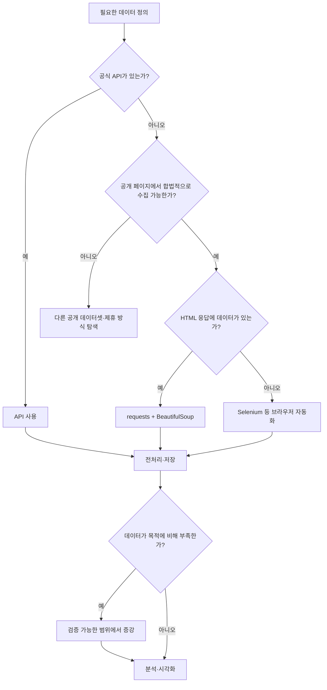

# 04_30 Python 데이터 크롤링 파이프라인

- 🎯 글의 목표: 데이터 수집 방법의 우선순위를 판단하고, 정적·동적 웹 페이지에서 데이터를 수집한 뒤 전처리·증강·저장하는 전체 파이프라인을 설계한다.
- 🧩 핵심 키워드: Data Collection, Crawling, Scraping, `requests`, BeautifulSoup, Selenium, CSS Selector, Explicit Wait, 무한 스크롤, 중복 제거, Pandas, 정규표현식, IQR, 데이터 증강
- ⭐ 중요도: ★★★★★
- 📝 한눈에 보는 내용: 공개 API를 우선 검토하고, API가 없을 때 정적 페이지는 `requests`와 BeautifulSoup, JavaScript로 렌더링되거나 사용자 행동이 필요한 페이지는 Selenium을 사용한다. 수집한 댓글은 결측치·중복·불필요한 패턴을 제거하고, 필요하면 검증된 방식으로 증강한 뒤 JSON 또는 CSV로 저장한다.
- 🔗 관련 문제 / 주제: 웹 스크래핑, 브라우저 자동화, 텍스트 전처리, 데이터 파이프라인, PJT 06

---

## 1. 들어가며

프로젝트에 필요한 데이터가 항상 잘 정리된 파일이나 API로 제공되는 것은 아니다. 데이터가 여러 페이지에 흩어져 있거나, 화면을 클릭하고 스크롤해야 다음 내용이 나타나는 경우도 있다. 이때 필요한 정보를 자동으로 가져오는 과정이 데이터 수집이다.

하지만 데이터 수집은 웹 페이지에서 텍스트를 복사하는 작업으로 끝나지 않는다. 원본 데이터에는 중복, 빈 값, 메뉴 문구, 특수문자만 있는 댓글, 지나치게 짧거나 긴 텍스트가 섞인다. 분석과 모델 학습에 사용하려면 수집 기준을 기록하고, 사용할 수 있는 형태로 정제하고, 결과를 재현 가능한 형식으로 저장해야 한다.

이번 강의와 PJT 06은 다음 흐름을 단계적으로 다룬다.

```text
수집 목적 정의
→ API 제공 여부 확인
→ 정적/동적 페이지 판별
→ 데이터 수집
→ 중복·결측·노이즈 전처리
→ 필요한 경우 데이터 증강
→ JSON/CSV 저장과 품질 확인
```

여기서 가장 중요한 것은 Selenium 문법 자체가 아니다. 어떤 상황에서 어떤 수집 방법을 선택하고, 실패하기 쉬운 외부 페이지를 어떻게 안전한 데이터 파이프라인으로 감쌀 것인지가 핵심이다.

## 2. 핵심 개념 정리

데이터를 확보하는 대표적인 방법은 API, 웹 스크래핑, 데이터 증강이다.

| 방법 | 의미 | 장점 | 주의점 |
|---|---|---|---|
| API | 제공자가 정한 규칙으로 데이터 요청 | 구조적이고 비교적 안정적 | 인증·호출 제한·제공 범위 |
| Scraping | 특정 페이지에서 필요한 값 추출 | 화면에 공개된 정보를 활용 | HTML 변경과 이용 정책 |
| Crawling | 여러 페이지나 링크를 자동 탐색 | 넓은 범위 수집 가능 | 중복·무한 탐색·부하 관리 |
| Augmentation | 기존 데이터로 변형 데이터를 생성 | 부족한 데이터 보강 | 품질 저하·편향·원본 추적 |

수집 방법은 다음 우선순위로 판단한다.



API가 있다면 일반적으로 API가 우선이다. 스키마와 호출 방식이 문서화되어 있고 페이지 디자인 변경의 영향을 덜 받기 때문이다. 스크래핑은 API가 없고 공개 페이지의 이용 조건이 허용할 때 고려한다. Selenium은 그중에서도 JavaScript 렌더링이나 클릭·검색·스크롤이 반드시 필요할 때 선택하는 비용이 큰 도구다.

## 3. 본문 정리

### 3.1 수집 전에 목적·범위·규칙을 먼저 정한다

“댓글을 모은다”만으로는 구현 기준이 부족하다. 다음 항목을 문서로 정해야 한다.

- 수집 대상: 어떤 회사·게시판·기간의 댓글인가?
- 필요한 필드: 본문, 작성 시각, URL, 종목 코드 중 무엇인가?
- 종료 조건: 댓글 수, 페이지 수, 날짜 중 무엇으로 멈추는가?
- 중복 기준: 본문만 같은 댓글을 중복으로 볼 것인가?
- 실패 정책: 일부 페이지가 실패하면 재시도할 것인가, 건너뛸 것인가?
- 저장 형식: JSON, CSV, DB 중 다음 단계에 적합한 형식은 무엇인가?

또한 공개 페이지라고 해서 자동 수집이 항상 허용되는 것은 아니다. 사이트 이용약관, `robots.txt`, 저작권, 개인정보, 요청 빈도와 서비스 부하를 확인해야 한다. 로그인·CAPTCHA·접근 차단을 우회하는 방식은 사용하지 않는다.

📌 핵심: 기술적으로 가져올 수 있다는 사실과 수집해도 된다는 사실은 다르다.

### 3.2 정적 페이지는 `requests`와 BeautifulSoup로 가볍게 처리한다

정적 페이지는 서버가 보낸 HTML 안에 필요한 데이터가 이미 들어 있다. 브라우저를 띄우지 않아도 HTTP 요청과 HTML 파서만으로 수집할 수 있다.

```python
from dataclasses import asdict, dataclass

import requests
from bs4 import BeautifulSoup


@dataclass
class Quote:
    text: str
    author: str
    tags: list[str]


def fetch_quotes(url: str) -> list[Quote]:
    """정적 HTML에서 인용문 목록을 구조화해 반환한다."""
    response = requests.get(
        url,
        timeout=10,
        headers={'User-Agent': 'learning-crawler/1.0'},
    )
    response.raise_for_status()

    soup = BeautifulSoup(response.text, 'html.parser')
    result = []

    for card in soup.select('.quote'):
        text_node = card.select_one('.text')
        author_node = card.select_one('.author')

        # 구조가 바뀐 불완전한 카드는 조용히 잘못 저장하지 않고 건너뛴다.
        if text_node is None or author_node is None:
            continue

        result.append(
            Quote(
                text=text_node.get_text(strip=True),
                author=author_node.get_text(strip=True),
                tags=[
                    node.get_text(strip=True)
                    for node in card.select('.tag')
                ],
            ),
        )

    return result
```

BeautifulSoup에는 태그 중심의 `find()`·`find_all()`과 CSS 선택자 중심의 `select_one()`·`select()`가 있다.

| 메서드 | 반환 | 용도 |
|---|---|---|
| `find()` | 첫 요소 또는 `None` | 태그·속성으로 하나 찾기 |
| `find_all()` | 요소 리스트 | 일치하는 모든 태그 찾기 |
| `select_one()` | 첫 요소 또는 `None` | CSS 선택자로 하나 찾기 |
| `select()` | 요소 리스트 | CSS 선택자로 모두 찾기 |

`element.text`보다 `element.get_text(' ', strip=True)`가 중첩 태그의 공백을 정리하기 편하다. 속성은 `element.get('href')`처럼 읽으면 누락 시 `None`을 얻을 수 있다.

⚠️ 주의: `requests.get()`이 성공했다고 원하는 데이터가 있다는 뜻은 아니다. 상태 코드, `Content-Type`, 추출 결과 개수와 필수 필드를 함께 검증해야 한다.

### 3.3 동적 페이지는 HTML 원문만으로 판단하지 않는다

동적 페이지는 첫 HTML을 받은 뒤 JavaScript가 API를 호출하거나 DOM을 변경해 데이터를 표시한다. `requests`로 받은 `response.text`에는 화면에서 보이는 댓글이 없을 수 있다.

확인 순서는 다음과 같다.

1. 브라우저 개발자 도구에서 실제 요소가 DOM에 생기는지 확인한다.
2. Network 탭에 공식적으로 사용할 수 있는 JSON 요청이 있는지 확인한다.
3. 사용할 수 있는 API가 없다면 사용자 행동이 필요한지 확인한다.
4. 마지막 수단으로 Selenium 같은 브라우저 자동화를 선택한다.

Selenium은 실제 브라우저를 실행하므로 느리고 환경 의존성이 크다. 대신 클릭, 키 입력, URL 변화, 무한 스크롤처럼 사용자 행동을 재현할 수 있다.

### 3.4 Selenium은 명시적 대기로 화면 상태를 기다린다

`time.sleep(3)`은 무조건 3초를 기다린다. 페이지가 0.5초에 준비되어도 낭비하고, 4초가 걸리면 실패한다. `WebDriverWait`는 필요한 상태가 될 때까지만 기다린다.

```python
from selenium import webdriver
from selenium.webdriver.common.by import By
from selenium.webdriver.support import expected_conditions as EC
from selenium.webdriver.support.ui import WebDriverWait


def open_page(url: str):
    options = webdriver.ChromeOptions()
    options.add_argument('--window-size=1280,900')

    # 최신 Selenium은 Selenium Manager로 호환 드라이버를 관리할 수 있다.
    driver = webdriver.Chrome(options=options)
    driver.get(url)

    WebDriverWait(driver, 10).until(
        EC.presence_of_element_located((By.TAG_NAME, 'body')),
    )
    return driver
```

실습 파일에는 로컬 `chromedriver.exe` 경로를 직접 지정한 코드가 있다. 학습 환경을 고정하기에는 편하지만 브라우저 버전과 드라이버 버전이 다르면 실행되지 않는다. 가능하면 최신 Selenium의 드라이버 관리 기능을 사용하고, 팀 프로젝트에서는 브라우저·Selenium 버전을 문서화한다.

브라우저는 예외가 나더라도 반드시 닫아야 한다.

```python
driver = open_page('https://example.com')

try:
    # 탐색과 수집 작업
    title = driver.title
    print(title)
finally:
    driver.quit()
```

### 3.5 검색·이동·종목 코드 추출을 작은 단계로 나눈다

PJT 06의 동적 페이지 실습은 메인 페이지 접속, 검색창 열기, 회사명 입력, 이동된 URL에서 종목 코드 추출, 커뮤니티 페이지 이동 순서다. 한 함수 안에 모두 넣으면 어느 단계에서 실패했는지 알기 어렵다.

```python
from urllib.parse import urlparse

from selenium.webdriver.common.by import By
from selenium.webdriver.common.keys import Keys
from selenium.webdriver.support import expected_conditions as EC
from selenium.webdriver.support.ui import WebDriverWait


def search_company(driver, company_name: str) -> None:
    body = WebDriverWait(driver, 10).until(
        EC.presence_of_element_located((By.TAG_NAME, 'body')),
    )
    body.send_keys('/')

    search_input = WebDriverWait(driver, 10).until(
        EC.element_to_be_clickable(
            (By.CSS_SELECTOR, "input[placeholder='검색어를 입력해주세요']"),
        ),
    )
    search_input.send_keys(company_name, Keys.ENTER)


def extract_stock_code(current_url: str) -> str:
    """URL의 /stocks/<code>/ 구간에서 종목 코드를 추출한다."""
    parts = [part for part in urlparse(current_url).path.split('/') if part]

    try:
        stocks_index = parts.index('stocks')
        return parts[stocks_index + 1]
    except (ValueError, IndexError) as error:
        raise ValueError(f'종목 코드를 찾을 수 없는 URL: {current_url}') from error


def wait_for_stock_page(driver) -> str:
    WebDriverWait(driver, 15).until(EC.url_contains('/stocks/'))
    return extract_stock_code(driver.current_url)
```

페이지 주소와 DOM 구조는 사이트 개편으로 달라질 수 있다. 따라서 URL 조각을 무조건 인덱싱하지 않고 기대한 구간이 있는지 검사한다.

### 3.6 선택자는 의미가 안정적인 속성부터 찾는다

크롤러는 HTML 구조와 결합되어 있어 선택자가 가장 쉽게 깨진다. 다음 우선순위가 비교적 안정적이다.

1. 서비스가 테스트용으로 제공한 `data-testid` 등 안정된 속성
2. 의미가 분명하고 고유한 `id`
3. 접근성 역할·레이블·입력 이름
4. 의미 있는 클래스와 짧은 CSS 선택자
5. 깊은 DOM 경로와 자동 생성 클래스

```python
# 깊고 자동 생성된 클래스에 의존하는 선택자는 깨지기 쉽다.
fragile = 'div > div.tc3tm81 > div > div.tc3tm85 > span > span'

# 가능하다면 의미 있는 컨테이너 안으로 범위를 좁힌다.
comments = driver.find_elements(
    By.CSS_SELECTOR,
    '#stock-content article span',
)
```

여러 후보 선택자를 순서대로 시도하는 것은 임시 대응이 될 수 있지만, 전혀 다른 텍스트를 댓글로 오인할 위험도 있다. 선택자가 성공했다는 사실뿐 아니라 추출 개수, 길이, 예상 샘플을 검증해야 한다.

### 3.7 무한 스크롤은 종료 조건과 중복 제거가 핵심이다

동적 피드는 스크롤할 때 새 항목을 불러온다. 무한 루프를 피하려면 목표 개수, 최대 스크롤 횟수, 페이지 높이 변화 중 하나 이상으로 종료해야 한다.

```python
from selenium.webdriver.common.by import By
from selenium.webdriver.support import expected_conditions as EC
from selenium.webdriver.support.ui import WebDriverWait


def collect_visible_comments(
    driver,
    *,
    limit: int = 20,
    max_scroll: int = 10,
) -> list[str]:
    comments = []
    seen = set()
    last_height = driver.execute_script('return document.body.scrollHeight')

    for _ in range(max_scroll):
        nodes = driver.find_elements(
            By.CSS_SELECTOR,
            '#stock-content article span',
        )

        for node in nodes:
            text = node.text.strip()
            if text and text not in seen:
                seen.add(text)
                comments.append(text)

        if len(comments) >= limit:
            return comments[:limit]

        driver.execute_script(
            'window.scrollTo(0, document.body.scrollHeight);',
        )

        try:
            WebDriverWait(driver, 5).until(
                lambda current: current.execute_script(
                    'return document.body.scrollHeight',
                ) > last_height,
            )
        except Exception:
            # 제한 시간 동안 높이가 늘지 않으면 더 불러올 내용이 없다고 본다.
            break

        last_height = driver.execute_script(
            'return document.body.scrollHeight',
        )

    return comments[:limit]
```

리스트에서 `text not in comments`를 반복하면 데이터가 커질수록 매번 전체 리스트를 검색한다. `set`을 함께 사용하면 중복 여부를 빠르게 확인하면서 리스트로 수집 순서를 보존할 수 있다.

⚠️ 주의: 화면 전체 높이가 변하지 않아도 가상 스크롤은 기존 DOM을 교체할 수 있다. 대상 사이트가 어떤 방식으로 항목을 렌더링하는지 확인하고, 필요하면 마지막 항목의 ID나 텍스트 변화를 기다려야 한다.

### 3.8 수집과 전처리를 분리해 원본을 보존한다

수집 함수에서 특수문자를 즉시 삭제하면 나중에 잘못된 규칙을 수정할 수 없다. 원본과 정제본을 따로 보관하는 편이 안전하다.

```text
raw_comments.json       # 수집 당시 원문과 출처
        ↓
전처리 규칙 v1
        ↓
clean_comments.csv      # 분석용 정제 결과
```

전처리에서는 결측치, 공백, 중복, 불필요한 패턴을 먼저 다룬다.

```python
import re

import pandas as pd


def clean_comments(comments: list[str]) -> pd.DataFrame:
    df = pd.DataFrame({'original': comments})

    # None 제거, 문자열 변환, 양끝 공백 정리
    df = df.dropna(subset=['original']).copy()
    df['original'] = df['original'].astype(str).str.strip()
    df = df[df['original'].ne('')]

    # 한글·영문·숫자·공백을 남기고 연속 공백을 하나로 합친다.
    df['clean'] = df['original'].map(
        lambda text: re.sub(r'[^가-힣a-zA-Z0-9\s]', '', text),
    )
    df['clean'] = (
        df['clean']
        .str.replace(r'\s+', ' ', regex=True)
        .str.strip()
    )

    # 정제 후 같은 문장이 된 중복도 제거한다.
    df = df[df['clean'].ne('')].drop_duplicates(subset=['clean'])

    noise = (
        df['clean'].str.fullmatch(r'\d+')
        | df['clean'].str.fullmatch(r'[ㅋㅎ]+')
        | df['clean'].str.lower().eq('none')
    )

    return df.loc[~noise].reset_index(drop=True)
```

특수문자를 모두 제거하는 규칙은 이모지와 문장 부호에 담긴 감정 정보도 없앤다. 감성 분석이 목적이라면 이모지나 `!`, `?`를 보존하는 편이 나을 수 있다. 전처리는 정답이 아니라 분석 목적에 따른 선택이다.

### 3.9 IQR 길이 필터는 자동 정답이 아니다

실습은 댓글 길이를 이용해 지나치게 짧거나 긴 값을 이상치로 제거한다. IQR은 중앙 50% 범위인 `Q3 - Q1`을 이용한다.

```text
lower = Q1 - 1.5 × IQR
upper = Q3 + 1.5 × IQR
```

```python
def filter_length_outliers(df: pd.DataFrame) -> pd.DataFrame:
    if len(df) < 5:
        return df[df['clean'].str.len() >= 3].copy()

    result = df.copy()
    result['length'] = result['clean'].str.len()

    q1 = result['length'].quantile(0.25)
    q3 = result['length'].quantile(0.75)
    iqr = q3 - q1
    lower = max(3, q1 - 1.5 * iqr)
    upper = q3 + 1.5 * iqr

    return result[result['length'].between(lower, upper)].copy()
```

긴 댓글이 곧 잘못된 댓글은 아니다. 표본이 적거나 길이 분포가 한쪽으로 치우치면 정상 의견도 제거될 수 있다. 제거 전후 개수와 샘플을 기록하고, 삭제된 원문을 검토할 수 있게 남겨야 한다.

📌 핵심: 이상치는 통계적으로 드문 값이지 자동으로 틀린 값이 아니다.

### 3.10 LLM 필터링과 증강 결과도 외부 입력으로 검증한다

강의는 LLM으로 부적절한 댓글 번호를 판별하고, 정제 문장을 다른 표현으로 증강하는 흐름을 다룬다. 여기서 모델 응답은 항상 요청 형식대로 온다고 가정하면 안 된다.

```python
import json


def parse_indices(response_text: str, size: int) -> list[int]:
    """LLM의 JSON 배열 응답을 검증해 유효한 인덱스만 반환한다."""
    parsed = json.loads(response_text)
    if not isinstance(parsed, list):
        raise ValueError('응답은 JSON 배열이어야 합니다.')

    result = set()
    for value in parsed:
        # bool은 int의 하위 타입이므로 명시적으로 제외한다.
        if type(value) is int and 0 <= value < size:
            result.add(value)

    return sorted(result)


def remove_by_indices(items: list[str], indices: list[int]) -> list[str]:
    remove_set = set(indices)
    return [item for index, item in enumerate(items) if index not in remove_set]
```

원본 리스트에서 `pop()`으로 지울 때는 큰 인덱스부터 제거해야 위치가 밀리지 않는다. 하지만 새 리스트를 만드는 방식은 원본을 보존하고 의도도 더 분명하다.

데이터 증강에는 추가 검증이 필요하다.

- 결과가 리스트인지 확인한다.
- 원본과 증강 데이터에 `source` 필드를 두어 구분한다.
- 원문의 의미와 레이블이 바뀌지 않았는지 샘플 검수한다.
- 동일하거나 지나치게 비슷한 문장을 중복 제거한다.
- 실제 사용자가 쓴 문장과 생성 문장을 같은 근거로 취급하지 않는다.

```python
def attach_provenance(original: list[str], augmented: list[str]) -> list[dict]:
    return [
        *({'text': text, 'source': 'original'} for text in original),
        *({'text': text, 'source': 'augmented'} for text in augmented),
    ]
```

LLM을 이용한 유해성 분류는 오탐과 누락이 생길 수 있고, 민감한 사용자 텍스트를 외부 서비스로 전송하는 문제가 있다. 전송 권한과 개인정보를 확인하고, 중요한 moderation은 전용 정책·모델과 사람의 검토를 함께 사용한다.

### 3.11 저장 형식에는 데이터와 수집 맥락을 함께 남긴다

텍스트만 저장하면 언제, 어디서, 어떤 규칙으로 수집했는지 알 수 없다. 최소한 출처 URL, 수집 시각, 수집 기준과 파이프라인 버전을 함께 남긴다.

```python
import json
from datetime import datetime, timezone
from pathlib import Path


def save_json(
    path: Path,
    *,
    source_url: str,
    records: list[dict],
) -> None:
    payload = {
        'source_url': source_url,
        'collected_at': datetime.now(timezone.utc).isoformat(),
        'pipeline_version': '1.0',
        'count': len(records),
        'records': records,
    }

    path.write_text(
        json.dumps(payload, ensure_ascii=False, indent=2),
        encoding='utf-8',
    )
```

CSV는 표 분석에 편하지만 중첩 구조와 메타데이터 표현에는 불편하다. JSON은 구조 보존에 유리하고, DB는 반복 수집·검색·중복 제약이 필요할 때 적합하다.

### 3.12 전체 파이프라인은 단계별 함수로 조립한다

외부 사이트와 LLM은 자주 실패하는 경계다. 각 단계를 함수로 나누면 중간 결과를 저장하고 특정 단계만 다시 실행할 수 있다.

```python
def run_pipeline(company_name: str) -> list[dict]:
    raw_comments = crawl_comments(company_name)
    raw_frame = clean_comments(raw_comments)
    clean_frame = filter_length_outliers(raw_frame)

    clean_texts = clean_frame['clean'].tolist()
    augmented = augment_and_validate(clean_texts)

    return attach_provenance(clean_texts, augmented)
```

위 코드는 구조를 보여 주는 예시다. `crawl_comments()`와 `augment_and_validate()`는 브라우저·모델 제공자에 따라 구현하고, 단위 테스트에서는 가짜 함수로 바꿔 외부 호출 없이 전처리와 결합 로직을 검사한다.


## 4. 적용 관점에서 다시 보기

크롤링 과제를 받으면 다음 순서로 구현한다.

1. 필요한 데이터와 최소 필드를 적는다.
2. 공식 API와 공개 데이터셋을 먼저 찾는다.
3. 이용 정책과 수집 허용 범위를 확인한다.
4. HTML 응답에 데이터가 있으면 `requests`를 사용한다.
5. 사용자 행동이 필요할 때만 Selenium을 사용한다.
6. 한 페이지·한 항목 수집부터 성공시킨다.
7. 종료 조건과 중복 제거를 추가한다.
8. 원본을 먼저 저장한 뒤 전처리를 별도 단계로 실행한다.
9. 전처리 전후의 개수와 제거 샘플을 기록한다.
10. 증강 데이터는 원본과 구분하고 품질을 검수한다.

디버깅은 다음 경계 순서로 진행한다.

| 순서 | 확인할 내용 |
|---|---|
| 1 | URL·네트워크·상태 코드 |
| 2 | 페이지 로딩과 리다이렉트 |
| 3 | 선택자 일치 개수 |
| 4 | 스크롤 후 새 항목 발생 여부 |
| 5 | 원본 중복과 빈 값 |
| 6 | 정규식·IQR 제거 결과 |
| 7 | LLM 응답 형식과 인덱스 범위 |
| 8 | 저장 파일의 인코딩·스키마·개수 |

페이지에서 요소를 찾지 못할 때 `sleep`을 늘리는 것부터 시도하지 않는다. 현재 URL, 페이지 제목, 오류 화면, 선택자 일치 개수와 스크린샷을 남겨 실제 상태를 확인한다.

## 5. 배운 점 / 확장 포인트

### 5.1 이번 강의 이전에 몰랐던 것 또는 새로 이해된 것

크롤링은 데이터를 가져오는 한 함수가 아니라 수집 기준, 종료 조건, 전처리, 출처 기록까지 포함한 파이프라인이다. 특히 Selenium은 강력하지만 정적 페이지와 API보다 비용과 유지보수 부담이 크므로 선택 기준이 필요하다.

### 5.2 앞으로 이어지는 연결점

정제한 데이터는 Pandas 분석, 감성·키워드 분석, 시각화 대시보드와 연결할 수 있다. 반복 실행이 필요해지면 수집 시각과 고유 ID를 저장하고, 작업 큐·스케줄러·DB의 중복 제약으로 파이프라인을 운영할 수 있다.

### 5.3 더 파볼 만한 주제

HTTP 재시도와 지수 백오프, 비동기 수집, 구조화 로그, 데이터 품질 테스트를 살펴볼 수 있다. 브라우저 자동화에서는 Page Object 패턴과 네트워크 요청 관찰을, 데이터 관리에서는 원본·정제본의 lineage와 스키마 버전 관리를 이어서 학습할 만하다.

## 6. 요약 정리

- 데이터 수집은 원본 정보를 분석 가능한 구조로 바꾸는 첫 단계다.
- 공식 API가 있으면 API를 우선하고, 정적 HTML은 `requests`와 BeautifulSoup를 사용한다.
- JavaScript 렌더링과 사용자 행동이 필요할 때 Selenium을 고려한다.
- 고정 `sleep`보다 `WebDriverWait`로 필요한 화면 상태를 기다린다.
- 선택자는 의미가 안정적인 속성을 우선하고 추출 결과도 검증한다.
- 무한 스크롤에는 목표 개수, 최대 반복, 새 데이터 부재 같은 종료 조건이 필요하다.
- 원본과 정제본을 분리하고 전처리 규칙과 제거 결과를 기록한다.
- IQR에서 벗어난 값이 반드시 잘못된 데이터인 것은 아니다.
- LLM 응답은 외부 입력이므로 타입·범위·스키마를 검증한다.
- 증강 데이터는 원본과 구분하고 의미 보존과 편향을 검수한다.
- 저장 결과에는 출처 URL, 수집 시각, 파이프라인 버전을 함께 남긴다.
- 이용약관·개인정보·저작권·서비스 부하를 기술 구현보다 먼저 고려한다.

🧠 기억할 것: 좋은 크롤러는 많이 가져오는 프로그램이 아니라, 허용된 범위에서 필요한 데이터를 재현 가능하게 수집하고 품질을 설명할 수 있는 파이프라인이다.

## 7. 미니 퀴즈 또는 체크리스트

1. API, 정적 스크래핑, Selenium을 선택하는 기준을 설명할 수 있는가?
2. Crawling과 Scraping의 차이는 무엇인가?
3. `response.raise_for_status()`가 필요한 이유는 무엇인가?
4. `select_one()`이 `None`을 반환할 때 어떤 상황을 의심해야 하는가?
5. 고정 `sleep`과 명시적 대기의 차이는 무엇인가?
6. 무한 스크롤 루프에 필요한 세 가지 종료 조건은 무엇인가?
7. 리스트와 `set`을 함께 사용해 중복을 제거하는 이유는 무엇인가?
8. 특수문자 제거가 감성 분석에 손해가 될 수 있는 이유는 무엇인가?
9. IQR 범위 밖의 댓글을 무조건 삭제하면 안 되는 이유는 무엇인가?
10. LLM이 반환한 삭제 인덱스에서 어떤 항목을 검증해야 하는가?
11. 증강 데이터에 `source`를 기록해야 하는 이유는 무엇인가?
12. 다음 사항을 수집 전에 확인했는가?
    - [ ] 공식 API와 공개 데이터셋을 먼저 검토했다.
    - [ ] 사이트 이용 정책과 개인정보 범위를 확인했다.
    - [ ] 수집 필드와 종료 조건을 문서화했다.
    - [ ] 요청 간격과 최대 요청 수를 제한했다.
    - [ ] 원본 데이터와 정제 데이터를 분리했다.
    - [ ] 선택자 변경과 외부 서비스 실패를 감지할 로그가 있다.
