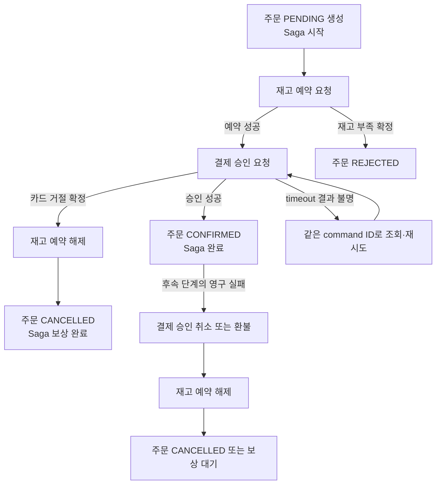

# Saga와 보상 트랜잭션: 여러 서비스의 업무 흐름을 끝까지 복구하기

- 🎯 글의 목표: 서비스마다 DB가 다른 주문·재고·결제 흐름을 local transaction의 연속으로 설계하고, 실패 시 재시도 또는 보상으로 일관된 업무 상태에 도달한다.
- 🧩 핵심 키워드: Saga, Local Transaction, Orchestration, Choreography, Compensation, Forward Recovery, Eventual Consistency, Idempotency, Semantic Lock
- ⭐ 중요도: ★★★★★ — 주문 DB transaction 하나로 재고·결제 서비스의 DB까지 함께 rollback할 수 없으므로, 중간 성공과 이후 실패를 업무 흐름으로 관리해야 한다.
- 📝 한눈에 보는 내용: 주문 생성 → 재고 예약 → 결제 승인 단계를 Saga로 연결한다. 기술 장애는 안전한 재시도로 이어가고, 결제 거절은 재고 해제와 주문 취소로 보상한다. 실행 상태·재시도 키·보상 실패를 저장해 프로세스가 재시작되어도 이어 간다.
- 🧱 선수 지식: Spring local transaction, 이벤트·Transactional Outbox, 멱등성 키, 비관적·낙관적 동시성 제어
- 🔗 이전 노트: [Transactional Outbox와 이벤트 발행 일관성](../25_09_23_Transactional_Outbox_and_Event_Publishing/09_23_Transactional_Outbox_and_Event_Publishing.md)

> 정리 기준일: 2026-09-26. Spring Boot 서비스에서 별도 DataSource를 가진 주문·재고·결제 서비스가 메시지로 통신하는 개념 예제다. Saga DB와 broker 구현은 특정 제품에 종속되지 않으며, Java 코드는 실행 애플리케이션에 연결된 완성 프로젝트가 아니다. 이 노트에서는 Java·DB·broker 통합 테스트를 실행하지 않았다.

## 1. 주문을 취소해도 이미 승인된 결제는 자동으로 돌아오지 않는다

한 고객의 주문을 처리하려면 보통 여러 서비스가 각자 데이터를 변경한다.

```text
주문 서비스: 주문을 PENDING으로 생성
재고 서비스: 상품 수량을 예약
결제 서비스: 카드 결제를 승인
주문 서비스: 주문을 CONFIRMED로 변경
```

각 서비스가 자기 DB에 local transaction을 사용하면 해당 서비스 안에서는 commit·rollback이 가능하다. 하지만 주문 DB transaction이 재고 DB나 결제 사업자의 transaction까지 하나로 묶지는 않는다.

| 실패 시점 | 이미 확정된 일 | 남은 문제 |
| --- | --- | --- |
| 재고 예약 전 | PENDING 주문 생성 | 주문을 거절 상태로 정리할 수 있다 |
| 재고 예약 뒤, 결제 요청 전 | 재고가 확보됨 | 실패가 영구적이면 예약 해제가 필요하다 |
| 결제 거절 | 재고 예약은 성공 | 재고를 풀고 주문을 취소해야 한다 |
| 결제 승인 응답 timeout | 결제 승인 여부 불명 | 승인됐다고 가정해 취소하거나, 실패라고 가정해 다시 결제하면 위험하다 |
| 결제 승인 뒤, 주문 확정 처리 실패 | 재고와 결제가 이미 성공했을 수 있음 | 주문 완료를 재시도하거나 결제 취소·재고 해제를 진행해야 한다 |

Saga는 이 과정을 여러 **local transaction**과 메시지로 구성한다. 앞 단계가 commit된 뒤 다음 단계가 실행된다. 일부가 실패하면 workflow는 실패 지점과 이미 성공한 단계를 알고, 계속 재시도할지 보상 작업을 시작할지 결정한다. AWS 가이드도 Saga를 local transaction의 sequence로 설명하며 기술 장애에는 forward recovery, 업무 실패에는 compensating transaction을 고려한다.

## 2. Saga 흐름을 주문 예제로 그려 보기

아래는 재고 예약과 결제 승인을 차례로 수행하는 흐름이다. 보상 작업은 이미 성공한 업무 효과를 새 업무 transaction으로 상쇄한다.



결제 승인이 timeout됐다는 이유만으로 즉시 재고를 풀고 주문을 취소하면 안 된다. 결제사가 승인했지만 응답만 유실되었을 수 있기 때문이다. 결제 provider에 같은 idempotency key로 조회·재시도하거나 승인 결과를 확인한 뒤 다음 상태를 결정한다.

## 3. 전진 재시도와 보상은 서로 다른 결정이다

실패를 하나의 `catch (Exception)`으로 다루면 네트워크 timeout, 카드 거절, 재고 부족을 같은 오류로 취급하게 된다. Saga는 실패 종류에 따라 다음 행동을 구별한다.

| 실패 분류 | 예 | 일반적인 판단 | 다음 행동 |
| --- | --- | --- | --- |
| 일시적 기술 실패 | 네트워크 단절, 503, DB failover | 결과가 확정됐는지 확인한다 | 같은 단계·같은 command ID로 제한 재시도 또는 결과 조회 |
| 명확한 업무 거절 | 재고 부족, 카드 한도 초과 | 업무 규칙상 성공할 수 없다 | 이미 완료된 앞 단계를 보상하고 terminal 상태로 이동 |
| 결과 불명(timeout) | 결제 요청을 보냈지만 응답을 못 받음 | 실패로 단정할 수 없다 | provider 상태 조회 또는 동일 멱등 키 재전송으로 결과 확정 |
| 보상 실패 | 재고 해제 API timeout, 결제 void 거절 | 원래 성공으로 되돌릴 수 없다 | 보상 단계 자체를 재시도하고 `COMPENSATING`·운영 확인 상태 유지 |

일시 장애마다 즉시 보상하면 잠깐의 broker 장애 때문에 정상 결제를 취소한 뒤, 재시도와 보상 이벤트가 경합할 수 있다. 반대로 카드 거절을 무한 재시도하면 사용자에게 성공 가능성이 없는 작업을 계속 붙잡는다.

재시도에는 최대 횟수, 지수 backoff, jitter, timeout, circuit breaker, terminal 상태가 필요하다. 횟수를 넘었다고 업무 효과가 사라지는 것은 아니다. `MANUAL_REVIEW` 같은 상태로 남기고 사람이 조회·재처리할 관찰 경로를 제공한다.

## 4. 보상 트랜잭션은 DB rollback과 다르다

DB rollback은 아직 commit하지 않은 한 local transaction의 변경을 원자적으로 취소한다. 보상 트랜잭션은 **이미 commit된 작업 이후에 별도로 실행하는 업무 명령**이다.

| 이미 성공한 작업 | 가능한 보상 예시 | 실제 의미 |
| --- | --- | --- |
| 재고 1개 예약 | 예약 해제 | 예약을 다시 판매 가능 수량으로 돌린다. 다른 주문이 이미 예약했을 수 있다. |
| 카드 승인만 완료 | 승인 void | 실제 매입 전 승인 상태를 취소한다. provider가 허용하는 시점과 상태를 확인해야 한다. |
| 카드 매입까지 완료 | 환불 | 매입 기록을 삭제하지 않는다. 별도의 환불 transaction과 정산 지연이 발생한다. |
| 배송 요청 접수 | 배송 취소 요청 또는 반품 흐름 시작 | 이미 출고됐다면 배송이 과거 상태로 돌아가지는 않는다. |
| 이메일 발송 | 정정·취소 안내 발송 | 이미 받은 메시지를 회수할 수 없다. |

따라서 보상은 `undo()`가 아니라 현재 상태와 외부 시스템 정책을 고려한 새 명령이다. 이전 변경을 완벽히 지우지 못할 수 있고, 보상 자체가 거절되거나 중복될 수도 있다. 업무 담당자와 “최종적으로 무엇을 복구 완료라고 볼 것인지” 먼저 합의한다.

## 5. Choreography와 Orchestration

### 5.1 Choreography: 각 서비스가 이벤트에 반응한다

```text
OrderPlaced → Inventory 서비스가 예약 → InventoryReserved
            → Payment 서비스가 승인 → PaymentAuthorized
            → Shipping 서비스가 배송 준비
```

각 서비스는 이벤트를 구독하고 자신의 다음 transaction과 이벤트를 발행한다. 중앙 제어기가 없어 서비스 간 결합을 줄일 수 있고 참여자가 적은 짧은 흐름에 적합하다. 서비스와 분기·보상 경로가 늘면 “어떤 이벤트가 어느 서비스를 깨우고, 전체 Saga가 지금 어느 단계인지” 추적하기 어려워진다.

### 5.2 Orchestration: coordinator가 command와 결과를 관리한다

```text
Saga Orchestrator → ReserveInventory command → Inventory Service
Saga Orchestrator ← InventoryReserved event  ← Inventory Service
Saga Orchestrator → AuthorizePayment command → Payment Service
Saga Orchestrator ← PaymentDeclined event    ← Payment Service
Saga Orchestrator → ReleaseInventory command → Inventory Service
```

중앙 orchestrator가 현재 단계, 다음 command, 실패 시 보상 순서를 관리한다. 여러 participant와 분기가 있을 때 전체 흐름을 한곳에서 조회하기 쉽다. 대신 orchestrator의 상태 저장과 복구가 필수고, coordinator가 잘못 설계되면 단일 장애 지점이나 지나치게 큰 중앙 서비스가 될 수 있다.

| 기준 | Choreography | Orchestration |
| --- | --- | --- |
| 다음 단계 결정 | 각 서비스가 수신 이벤트에 반응 | coordinator가 결과를 보고 command 결정 |
| 전체 상태 조회 | 여러 서비스의 이벤트·로그를 모아 해석 | Saga instance에서 현재 단계 조회 |
| 참여자 수·분기 | 작고 단순한 흐름에 적합 | participant·조건·보상이 많은 흐름에 적합 |
| 주요 위험 | 이벤트 의존성·순환·흐름 추적 난이도 | coordinator 복잡도·가용성·중앙 결합 |

둘 중 하나가 항상 정답은 아니다. 운영자가 장애 시 질문할 “이 주문이 지금 어디에서 멈췄나?”에 실제로 답할 수 있는 방식을 선택한다.

## 6. Saga 상태를 DB에 저장한다

orchestrator를 Java 프로세스의 메모리 변수에만 두면 배포·재시작 뒤 진행 중인 workflow를 복구할 수 없다. 최소한 Saga ID, 업무 ID, 상태, 현재 단계, 재시도 시각을 내구성 있게 저장한다.

### 6.1 Flyway migration 예시

서비스 프로젝트에서는 다음 사용 가능한 Flyway 번호를 지정한다. 아래 SQL은 Saga instance와 단계 시도를 분리하는 최소 예시다.

```sql
CREATE TABLE order_saga ( -- 하나의 주문 workflow 진행 상태를 저장한다.
    saga_id UUID PRIMARY KEY, -- 전역 Saga 식별자이며 메시지 correlation ID로도 쓴다.
    order_id BIGINT NOT NULL UNIQUE, -- 이 예제에서는 주문 하나에 Saga 하나를 연결한다.
    status VARCHAR(32) NOT NULL, -- 현재 workflow 상태다.
    current_step VARCHAR(80) NOT NULL, -- 대기·실행 중인 논리 단계다.
    version BIGINT NOT NULL DEFAULT 0, -- 같은 Saga의 동시 상태 갱신을 감지한다.
    next_action_at TIMESTAMPTZ, -- retry 또는 timeout 검사 대상 시각이다.
    last_error_code VARCHAR(100), -- 개인정보 없이 원인 범주를 찾는다.
    started_at TIMESTAMPTZ NOT NULL DEFAULT CURRENT_TIMESTAMP, -- Saga 생성 시각이다.
    updated_at TIMESTAMPTZ NOT NULL DEFAULT CURRENT_TIMESTAMP, -- 마지막 상태 전이 시각이다.
    finished_at TIMESTAMPTZ, -- 성공·거절·보상 완료 등 terminal 시각이다.
    CONSTRAINT ck_order_saga_status CHECK ( -- 코드가 처리하는 값만 허용한다.
        status IN ( -- Saga 상태 후보 목록이다.
            'STARTED', -- 주문과 Saga가 만들어졌다.
            'WAITING_INVENTORY', -- 재고 예약 결과를 기다린다.
            'WAITING_PAYMENT', -- 결제 승인 결과를 기다린다.
            'COMPENSATING', -- 앞서 성공한 효과를 되돌리는 단계다.
            'COMPLETED', -- 정상 주문 완료 상태다.
            'REJECTED', -- 업무 규칙에 따른 거절 상태다.
            'COMPENSATED', -- 필요한 보상이 모두 완료된 상태다.
            'MANUAL_REVIEW' -- 자동 복구를 멈추고 운영 판단이 필요하다.
        ) -- 상태 후보를 끝낸다.
    ) -- 상태 check를 끝낸다.
); -- Saga instance table을 만든다.

CREATE TABLE order_saga_step ( -- 각 forward·compensation 실행 이력을 남긴다.
    step_id BIGINT GENERATED ALWAYS AS IDENTITY PRIMARY KEY, -- 시도 행의 DB 기본키다.
    saga_id UUID NOT NULL REFERENCES order_saga(saga_id), -- 부모 Saga를 참조한다.
    step_name VARCHAR(80) NOT NULL, -- ReserveInventory 등 논리 단계다.
    action_type VARCHAR(20) NOT NULL, -- FORWARD 또는 COMPENSATE다.
    command_id UUID NOT NULL, -- 재시도에도 유지하는 참가자 멱등성 키다.
    attempt_number INTEGER NOT NULL, -- 같은 단계의 실행 시도 번호다.
    result VARCHAR(24) NOT NULL, -- 실행·성공·재시도·실패 상태다.
    started_at TIMESTAMPTZ NOT NULL DEFAULT CURRENT_TIMESTAMP, -- 시도 시작 시각이다.
    completed_at TIMESTAMPTZ, -- 성공 또는 확정 거절 응답을 기록한 시각이다.
    error_code VARCHAR(100), -- 제한된 오류 코드다.
    CONSTRAINT uq_order_saga_step_attempt UNIQUE (saga_id, step_name, action_type, attempt_number), -- 이력 중복을 막는다.
    CONSTRAINT ck_order_saga_action CHECK (action_type IN ('FORWARD', 'COMPENSATE')), -- 동작 종류를 제한한다.
    CONSTRAINT ck_order_saga_step_result CHECK (result IN ('RUNNING', 'SUCCEEDED', 'RETRY_WAIT', 'FAILED')) -- 이력 상태를 제한한다.
); -- 단계 이력 table을 만든다.

CREATE INDEX ix_order_saga_due -- 시간 만료된 Saga를 점검할 때 찾는다.
    ON order_saga (next_action_at, saga_id) -- 재시도 시각 순으로 탐색한다.
    WHERE status IN ('WAITING_INVENTORY', 'WAITING_PAYMENT', 'COMPENSATING'); -- 진행 중 Saga만 인덱싱한다.
```

모든 서비스가 saga table 하나를 공유하는 구조는 피한다. Orchestrator는 자기 상태 저장소만 소유하며, 재고·결제 participant는 각자 예약·결제 상태를 소유한다. `order_saga_step` 이력과 participant의 command inbox는 관측·중복 방지·재처리 요구에 따라 보존 기간을 정한다.

`version` 숫자 컬럼을 두기만 해서는 동시 상태 전이가 막히지 않는다. JPA에서는 `@Version`에 매핑하고, SQL에서는 `UPDATE ... WHERE saga_id = :id AND version = :expectedVersion` 같은 compare-and-set 조건을 사용해 승자 한 요청만 상태를 바꾸게 한다.

## 7. Coordinator는 상태 변경과 다음 command를 함께 저장한다

Orchestrator가 결제 거절을 받았다고 하자. 상태를 `COMPENSATING`으로 저장하고 `ReleaseInventory` command를 broker로 직접 보내면, DB commit 뒤 프로세스가 죽을 때 상태만 바뀌고 command는 유실될 수 있다. 이전 노트의 Outbox처럼 **Saga 상태 변경과 다음 command의 outbox 행을 같은 local transaction**에 저장한다.

```java
package com.example.orderstudy.saga; // 주문 Saga 조정 코드의 패키지다.

import java.util.UUID; // Saga와 message ID에 사용한다.

import org.springframework.stereotype.Service; // 조정 서비스를 Spring Bean으로 등록한다.
import org.springframework.transaction.annotation.Transactional; // 상태·inbox·outbox를 local transaction으로 묶는다.

@Service // participant 응답을 다음 단계로 연결한다.
public class OrderSagaCoordinator {

    private final OrderSagaRepository sagaRepository; // Saga 상태를 읽고 변경한다.
    private final OrderRepository orderRepository; // 주문 상태를 갱신한다.
    private final ConsumerInboxRepository inboxRepository; // 같은 결과 event 중복 처리를 막는다.
    private final OutboxEventRepository outboxRepository; // 다음 command를 내구성 있게 기록한다.
    private final SagaCommandFactory commandFactory; // Saga 단계별 command envelope를 만든다.

    public OrderSagaCoordinator( // 로컬 데이터 접근 의존성을 주입받는다.
            OrderSagaRepository sagaRepository, // Saga 저장소다.
            OrderRepository orderRepository, // 주문 저장소다.
            ConsumerInboxRepository inboxRepository, // 결과 event dedup 저장소다.
            OutboxEventRepository outboxRepository, // command outbox 저장소다.
            SagaCommandFactory commandFactory // command 생성기다.
    ) { // 생성자 본문을 시작한다.
        this.sagaRepository = sagaRepository; // Saga 저장소를 보관한다.
        this.orderRepository = orderRepository; // 주문 저장소를 보관한다.
        this.inboxRepository = inboxRepository; // inbox 저장소를 보관한다.
        this.outboxRepository = outboxRepository; // outbox 저장소를 보관한다.
        this.commandFactory = commandFactory; // command 생성기를 보관한다.
    } // 생성자를 끝낸다.

    @Transactional // 주문·Saga·첫 command outbox를 한 DB transaction으로 만든다.
    public UUID start(PlaceOrderRequest request) { // 주문 Saga를 시작한다.
        Order order = orderRepository.save( // 주문 서비스 DB에 임시 주문을 만든다.
                Order.pending(request.customerId(), request.totalAmount()) // 재고·결제 전이므로 PENDING이다.
        ); // 주문 저장을 끝낸다.
        UUID sagaId = UUID.randomUUID(); // 진행 상태와 모든 후속 메시지를 묶을 ID를 만든다.
        OrderSaga saga = OrderSaga.start(sagaId, order.getId()); // STARTED 상태와 현재 단계를 초기화한다.
        saga.moveTo(SagaStatus.WAITING_INVENTORY, "RESERVE_INVENTORY"); // 첫 participant 결과를 기다린다.
        sagaRepository.save(saga); // 진행 상태를 영속화한다.
        outboxRepository.save( // 같은 transaction에서 첫 command를 기록한다.
                commandFactory.reserveInventory(saga, order) // relay가 재고 서비스에 보낼 메시지를 만든다.
        ); // outbox 저장을 끝낸다.
        return sagaId; // 이후 상태 조회에 쓸 식별자를 반환한다.
    } // Saga 시작을 끝낸다.

    @Transactional // 처리 표시·상태 변경·다음 command를 함께 확정한다.
    public void onInventoryReserved(InventoryReserved event) { // 재고 서비스의 성공 event를 받는다.
        int firstDelivery = inboxRepository.claim("order-saga", event.eventId()); // event ID를 local inbox에 원자적으로 claim한다.
        if (firstDelivery == 0) { // 이미 commit된 결과 event를 다시 받은 경우다.
            return; // 주문·Saga·outbox를 반복해서 바꾸지 않는다.
        } // 중복 event 분기를 끝낸다.

        OrderSaga saga = sagaRepository.findById(event.sagaId()) // correlation ID로 진행 상태를 찾는다.
                .orElseThrow(SagaNotFoundException::new); // 상태가 없으면 무시하지 않고 관측 가능한 오류로 처리한다.
        if (saga.getStatus() != SagaStatus.WAITING_INVENTORY) { // 기대 단계의 응답인지 확인한다.
            throw new UnexpectedSagaEventException(event.eventId()); // inbox claim까지 rollback해 event를 유실하지 않는다.
        } // Saga 단계 guard를 끝낸다.

        saga.moveTo(SagaStatus.WAITING_PAYMENT, "AUTHORIZE_PAYMENT"); // 다음 단계와 현재 작업을 기록한다.
        sagaRepository.save(saga); // Saga의 상태 전이를 저장한다.
        outboxRepository.save( // 같은 transaction에 다음 command를 추가한다.
                commandFactory.authorizePayment(saga, event.reservationId()) // 재고 예약 ID를 결제 단계에 전달한다.
        ); // outbox command 저장을 끝낸다.
    } // 재고 성공 handler를 끝낸다.

    @Transactional // inbox·주문 확정·Saga 완료 상태를 한 local transaction으로 묶는다.
    public void onPaymentAuthorized(PaymentAuthorized event) { // 결제 participant의 승인 결과를 받는다.
        int firstDelivery = inboxRepository.claim("order-saga", event.eventId()); // 중복 결과 event를 먼저 판정한다.
        if (firstDelivery == 0) { // 이미 commit된 결과라면 같은 성공을 재생한다.
            return; // 주문 상태와 Saga 상태를 다시 변경하지 않는다.
        } // 중복 분기를 끝낸다.

        OrderSaga saga = sagaRepository.findById(event.sagaId()) // Saga correlation ID로 진행 상태를 찾는다.
                .orElseThrow(SagaNotFoundException::new); // 없는 상태는 조용히 성공 처리하지 않는다.
        if (saga.getStatus() != SagaStatus.WAITING_PAYMENT) { // 기대 단계의 결제 승인인지 확인한다.
            throw new UnexpectedSagaEventException(event.eventId()); // inbox와 함께 rollback해 결과를 잃지 않는다.
        } // 단계 guard를 끝낸다.

        orderRepository.markConfirmed(saga.getOrderId(), event.paymentReference()); // 결제 참조와 함께 주문을 확정한다.
        saga.moveTo(SagaStatus.COMPLETED, "DONE"); // 정상 완료 terminal 상태로 이동한다.
        sagaRepository.save(saga); // 완료 상태를 같은 transaction으로 기록한다.
    } // 결제 승인 handler를 끝낸다.

    @Transactional // 거절 처리도 상태와 보상 command를 함께 확정한다.
    public void onPaymentDeclined(PaymentDeclined event) { // 결제사가 최종 거절한 event를 받는다.
        int firstDelivery = inboxRepository.claim("order-saga", event.eventId()); // 중복 결과를 차단한다.
        if (firstDelivery == 0) { // 이미 처리한 event ID다.
            return; // 보상 command를 중복 생성하지 않는다.
        } // 중복 event 분기를 끝낸다.

        OrderSaga saga = sagaRepository.findById(event.sagaId()) // 해당 주문 Saga를 조회한다.
                .orElseThrow(SagaNotFoundException::new); // 누락 상태를 명시적으로 알린다.
        if (saga.getStatus() != SagaStatus.WAITING_PAYMENT) { // 결제 응답이 기대 단계에 도착했는지 검사한다.
            throw new UnexpectedSagaEventException(event.eventId()); // inbox claim까지 rollback해 event를 유실하지 않는다.
        } // 단계 guard를 끝낸다.

        saga.moveTo(SagaStatus.COMPENSATING, "RELEASE_INVENTORY"); // 결제 거절 뒤 재고 해제를 시작한다.
        orderRepository.markCancellationPending(saga.getOrderId()); // UI에 보상 진행 중임을 보여준다.
        sagaRepository.save(saga); // 보상 중 상태를 저장한다.
        outboxRepository.save( // 다음 단계 메시지를 영속 기록한다.
                commandFactory.releaseInventory(saga, event.reservationId()) // 같은 Saga의 예약을 해제한다.
        ); // 보상 command 저장을 끝낸다.
    } // 결제 거절 handler를 끝낸다.

    @Transactional // 재고 해제 결과와 최종 상태를 함께 확정한다.
    public void onInventoryReleased(InventoryReleased event) { // participant가 보상을 완료했음을 받는다.
        int firstDelivery = inboxRepository.claim("order-saga", event.eventId()); // 중복 보상 결과를 차단한다.
        if (firstDelivery == 0) { // 이미 commit된 event다.
            return; // terminal 처리를 반복하지 않는다.
        } // 중복 event 분기를 끝낸다.

        OrderSaga saga = sagaRepository.findById(event.sagaId()) // Saga 상태를 조회한다.
                .orElseThrow(SagaNotFoundException::new); // 잘못된 correlation ID를 오류로 처리한다.
        if (saga.getStatus() != SagaStatus.COMPENSATING) { // 보상 결과를 대기하는 상태인지 확인한다.
            throw new UnexpectedSagaEventException(event.eventId()); // inbox claim까지 rollback해 event를 유실하지 않는다.
        } // 단계 guard를 끝낸다.

        orderRepository.markCancelled(saga.getOrderId()); // 주문을 사용자에게 취소 완료로 표시한다.
        saga.moveTo(SagaStatus.COMPENSATED, "DONE"); // 필요한 보상이 끝난 terminal 상태다.
        sagaRepository.save(saga); // 마지막 상태를 local DB에 저장한다.
    } // 재고 해제 handler를 끝낸다.
} // Coordinator 예제를 끝낸다.
```

위 코드는 transaction boundary를 보여 주는 축약 예제다. `InventoryReserved` 등의 record, repository, outbox event builder, 보상 재시도 job은 실제 프로젝트에서 정의해야 한다. 메서드의 inbox claim과 Saga 상태, 다음 outbox command는 같은 DataSource와 transaction manager에 있어야 한다. consumer가 broker ack를 언제 하는지는 broker adapter의 commit/ack 설정에 맞추며, DB commit 전에 ack해 이벤트를 잃지 않도록 한다.

`start()`도 HTTP `POST`에서 재호출될 수 있다. 이전 멱등성 노트처럼 사용자 key·요청 fingerprint·최초 응답을 활용하고, 가능하면 주문·Saga 생성과 같은 Order DB transaction에서 최초 요청 claim을 함께 확정해야 timeout 뒤 API 재시도가 두 번째 주문·Saga를 만들지 않는다.

상태 guard는 중복뿐 아니라 늦게 도착한 응답도 다룬다. `COMPENSATING`으로 이미 이동한 뒤 `PaymentAuthorized`가 도착하면 승인 자체를 무시할 수 없다. 현재 provider 결과를 조회하고 결제 void를 추가하는 식으로 **실제 외부 상태를 확인한 복구 경로**가 필요하다. 예제의 `UnexpectedSagaEventException`은 inbox claim까지 rollback하므로 broker 재전달이 가능하다. 반복 재전달만으로 해결되지 않는 순서 오류는 무한 retry하지 말고, durable quarantine/DLQ에 원본 event와 Saga ID를 저장한 뒤 운영·reconciliation 흐름으로 넘긴다.

## 8. Participant도 command를 멱등하게 처리한다

Orchestrator가 응답을 받지 못하면 이미 성공한 command를 다시 보낼 수 있다. 동일 command 재전송이 새로운 재고 예약이나 새로운 카드 승인이 되지 않게 participant에 command ID를 전달한다.

| Command | participant 멱등 키 예시 | 처리 결과 재생 |
| --- | --- | --- |
| `ReserveInventory` | `commandId` 또는 `(sagaId, stepName)` | 기존 예약 ID와 성공·거절 결과를 반환 |
| `ReleaseInventory` | 보상 command ID | 이미 RELEASED면 성공으로 응답하고 재고를 다시 더하지 않음 |
| `AuthorizePayment` | 결제 provider가 지원하는 idempotency key | 이미 승인한 결제 결과를 조회·반환 |
| `VoidAuthorization` | provider command key | 이미 취소된 승인인지 확인하고 같은 결과를 반환 |

재고 예약의 로컬 transaction 안에서 command 중복 기록과 수량 변경을 함께 처리하는 SQL 아이디어는 다음과 같다. 중복 key일 때는 저장된 기존 command 결과를 조회해 응답하며 수량 UPDATE를 다시 실행하지 않는다.

```sql
UPDATE product_stock -- 재고 서비스가 소유한 상품 재고 행이다.
SET available_quantity = available_quantity - :quantity -- 요청한 수량만큼 가용 재고를 줄인다.
WHERE product_id = :product_id -- 주문 상품을 찾는다.
  AND available_quantity >= :quantity; -- 초과 판매를 막는 조건을 같은 UPDATE에 넣는다.
```

영향 행 수 1일 때만 reservation 행과 command 결과를 같은 transaction에 commit한다. 영향 행 수 0은 상품 없음과 재고 부족이 합쳐진 결과일 수 있으므로 participant의 API 계약에 맞는 오류로 응답한다. `ReleaseInventory`는 `(saga_id, reservation_id)` unique 기록 또는 reservation 상태 전이를 이용해 두 번 수량을 복구하지 않도록 구현한다.

결제 provider가 멱등성 키를 지원하더라도 key 보관 기한과 조회 API 정책을 확인한다. 시스템이 만든 command ID는 Saga 재시도 동안 안정적으로 유지한다. retry마다 새 UUID를 생성하면 provider 입장에서는 매번 다른 결제로 인식할 수 있다.

## 9. 보상 단계도 진행 중인 Saga다

보상 command를 발행했다고 곧바로 `COMPENSATED`로 바꾸면 안 된다. 재고 서비스가 실제 예약을 풀고 결과를 알려 준 뒤 최종 상태로 바꾼다.

| 현재 상태 | 응답·실패 | 다음 상태 | 기록·발행할 일 |
| --- | --- | --- | --- |
| `STARTED` | Saga 초기화 성공 | `WAITING_INVENTORY` | 주문 `PENDING` + `ReserveInventory` outbox |
| `WAITING_INVENTORY` | 예약 성공 | `WAITING_PAYMENT` | reservation ID 저장 + `AuthorizePayment` outbox |
| `WAITING_INVENTORY` | 재고 부족 확정 | `REJECTED` | 주문 `REJECTED`, 예약 보상은 없음 |
| `WAITING_PAYMENT` | 승인 성공 | `COMPLETED` | 결제 참조 저장 + 주문 `CONFIRMED` |
| `WAITING_PAYMENT` | 카드 거절 확정 | `COMPENSATING` | 예약 해제 command를 outbox에 넣음 |
| `WAITING_PAYMENT` | timeout, 결과 불명 | `WAITING_PAYMENT` | 같은 command ID로 조회·재시도하고 보상은 보류 |
| `COMPENSATING` | 예약 해제 성공 | `COMPENSATED` | 주문 `CANCELLED`와 최종 이력 저장 |
| `COMPENSATING` | 보상 재시도 한도 초과 | `MANUAL_REVIEW` | alert·상태 조회·수동 재처리 경로 제공 |

실패 후 보상은 성공한 단계의 역방향으로 실행하는 경우가 많다. 여러 보상을 병렬화할 수 있는지는 업무 의존성을 따져 결정한다. 예를 들어 결제 승인 취소가 확인되기 전에 주문을 완전히 닫아도 되는지, 재고 해제와 결제 void가 독립적인지 정책을 확인한다.

## 10. Saga에는 전체 ACID 격리가 없다

각 local transaction이 따로 commit되므로 Saga가 끝날 때까지 전체 시스템을 하나의 snapshot으로 잠그지 않는다. 진행 중인 `PENDING` 주문을 다른 요청이 읽고 취소·배송·재결제를 시작할 수 있다.

이 문제를 막기 위해서는 업무 의미를 가진 잠금(semantic lock)을 둘 수 있다.

- 주문이 `PENDING`이면 결제 재시도·사용자 취소·관리자 취소의 우선순위를 정한다.
- Saga 상태와 주문 `version`을 조건부로 바꿔 오래된 이벤트가 새로운 상태를 덮지 않게 한다.
- 재고를 예약 상태로 분리해 확정 주문과 미완료 주문의 수량 의미를 구분한다.
- 결제·배송 command에 `sagaId`, `orderId`, `commandId`, 현재 version을 넣어 상관관계를 확인한다.
- 여러 Saga가 같은 계정·재고 한도를 건드릴 때 local DB 잠금 또는 낙관적 version 검사로 participant 불변식을 지킨다.

사용자 화면에도 eventual consistency를 숨기지 않는다. `주문 접수 중`, `결제 확인 중`, `취소 처리 중`, `확인 필요` 같은 상태를 보여 주면 서버가 최종 결과를 확인하기 전 성공·실패를 섣불리 단정하지 않게 된다.

## 11. 장애 대응과 운영 관찰

Saga는 일반 API 로그만으로 추적하기 어렵다. `sagaId`를 correlation ID로 모든 command·event·로그·trace에 전파한다.

- 진행 중 Saga 수와 가장 오래 멈춘 단계·시간
- participant 별 timeout·기술 재시도·업무 거절 비율
- `COMPENSATING` 체류 시간과 보상 완료·실패 건수
- `MANUAL_REVIEW` 수, 원인 코드, 마지막 재처리 시각
- 중복 command·event 수와 participant inbox 충돌 수
- outbox backlog와 broker 전송 지연
- retry budget 소진 뒤 자동 재개·운영자 재개 이력

수동 재처리 버튼은 Saga 상태를 무조건 `STARTED`로 되돌리는 기능이 아니다. 대상 단계, 현재 participant 실측 결과, 기존 command ID의 재사용 여부, 다음에 실행할 forward 또는 compensation 동작을 검증하는 운영 절차여야 한다.

Saga에는 고객 지원·감사·재무 reconciliation에 필요한 상태 이력을 보존하되, 카드 번호·access token·민감 payload를 복제하지 않는다. `last_error_code`는 조회 가능한 제한 코드로 저장하고 상세 예외는 접근이 제어된 로그·trace에 남긴다.

## 12. 테스트 시나리오

실제 데이터베이스와 broker를 연결하는 프로젝트에서는 정상 경로만으로 끝내지 말고 결과 불명·중복·보상 실패를 확인한다.

| 시나리오 | 기대 결과 |
| --- | --- |
| 재고 예약 성공 → 결제 승인 성공 | 주문 `CONFIRMED`, Saga `COMPLETED` |
| 재고 부족의 확정 응답 | 결제 command 없이 주문 `REJECTED` |
| 결제의 명확한 거절 | 같은 Saga의 예약 해제 뒤 주문 `CANCELLED`, Saga `COMPENSATED` |
| 결제 승인 성공 후 응답 timeout | 새 key로 승인하지 않고 기존 command 결과를 조회·재전달 |
| 참가자 command가 중복 전달 | participant 업무 효과 한 번, 같은 결과를 재생 |
| participant가 성공한 뒤 결과 event 유실 | outbox 재전달 뒤 coordinator가 한 번 전이 |
| coordinator의 상태 update와 다음 outbox insert 중 실패 | 둘 다 commit 또는 둘 다 rollback |
| compensation event가 중복 전달 | 수량 복구·결제 void가 반복 적용되지 않음 |
| 보상 participant가 오래 장애 | Saga `COMPENSATING` 유지 후 retry 또는 `MANUAL_REVIEW` |
| 오래된 success event가 compensation 이후 도착 | 실제 외부 상태를 조회하고 필요한 추가 보상으로 정합성을 회복 |
| 같은 주문에 사용자 취소와 결제 승인 event가 경합 | version·상태 조건에 따라 허용된 한 전이만 성공 |

특히 timeout 테스트는 “요청이 실패했다”는 단정 대신 “요청 결과를 아직 모른다”는 상태를 재현해야 한다. 결제사가 실제 승인했지만 응답만 유실된 경우를 포함하지 않으면 중복 청구 위험을 찾기 어렵다.

## 13. 자주 하는 오해

### “보상하면 전체 시스템이 처음 상태로 돌아간다”

항상 그렇지 않다. 보상은 현재 가능한 새 업무 작업이다. 결제 환불은 승인 취소와 다르고, 배송·이메일·재고 선점은 다른 고객의 후속 작업 때문에 과거 상태로 완전히 돌아가지 못할 수 있다.

### “participant가 한 번 실행됐으니 성공으로 기록한다”

호출 횟수와 commit 결과는 다르다. participant가 commit하고 응답이 유실되면 orchestrator는 성공을 모를 수 있다. command ID로 결과를 재생하거나 실제 상태를 조회한다.

### “기술 오류면 보상, 업무 오류면 실패 처리다”

기술 오류는 결과가 불명확할 수 있어 안전한 같은 단계 재시도가 우선일 때가 많다. 명확한 업무 거절은 앞선 성공을 보상할 수 있다. 장애 종류와 외부 side effect를 보고 결정한다.

### “Saga 상태를 마지막 로그에서 복원할 수 있다”

로그는 관찰 자료이지 실행 상태 저장소가 아니다. 어느 단계까지 성공했는지, 다음에 어떤 command를 보낼지, 보상을 완료했는지를 DB나 내구성 있는 workflow engine에 저장한다.

### “Saga는 모든 경우에 분산 transaction보다 낫다”

Saga는 eventual consistency, 재시도, 보상, 운영 관찰을 수용할 수 있는 장기 업무에 유용하다. 짧고 강한 원자성이 꼭 필요한 한 DB 작업은 하나의 local transaction으로 끝내는 편이 단순하다. 여러 서비스의 데이터를 하나로 강하게 묶어야 한다면 데이터 소유권·경계 자체를 다시 살펴본다.

## 14. 핵심 정리와 다음 학습

1. 각 서비스는 자기 데이터에 local transaction을 사용하고, Saga는 그 단계들을 업무 workflow로 연결한다.
2. 기술 장애·결과 불명은 같은 command ID로 결과를 확인하며 안전하게 재시도한다.
3. 명확한 업무 거절은 이미 성공한 단계에 대한 compensating transaction을 시작한다.
4. 보상은 DB rollback이 아니며 환불·예약 해제·취소 안내 같은 새로운 업무 효과다.
5. 상태 전이·다음 command outbox·inbox deduplication을 local transaction으로 묶어 crash와 중복에서 복구한다.
6. orchestration은 중앙 상태 조회와 분기 관리가 명확하고, choreography는 participant 간 직접 event 반응으로 단순한 흐름을 연결한다.
7. Saga는 전체 ACID isolation을 제공하지 않으므로 업무 상태 guard·version·semantic lock이 필요할 수 있다.
8. 보상 실패·timeout·late event를 숨기지 않고 `COMPENSATING` 또는 `MANUAL_REVIEW`로 남긴다.

🧠 기억할 것: **Saga는 여러 DB를 한 번에 rollback하는 기능이 아니라, 각 단계의 결과를 저장하고 재시도·보상으로 합의한 최종 업무 상태에 도달하는 workflow다.**

다음 확장 주제는 **분산 시스템의 timeout·재시도·circuit breaker**다. Saga participant가 느리거나 장애일 때 retry budget·backoff·circuit breaker·bulkhead를 어떻게 조합할지 살펴본다.

## 15. 복습 퀴즈

1. 재고 서비스의 transaction이 이미 commit된 뒤 주문 서비스 transaction에서 rollback하면 재고 수량도 자동으로 복구되는가?
2. 결제 승인 요청이 timeout되었을 때 왜 곧바로 승인 실패로 보고 보상해서는 안 되는가?
3. 재고 예약 해제와 DB rollback은 어떤 차이가 있는가?
4. Saga participant에 같은 `commandId`를 재사용하는 이유는 무엇인가?
5. 결제 거절 event를 두 번 받았을 때 두 번째 event가 재고를 다시 늘리지 않도록 어디서 막는가?
6. `COMPENSATING`을 보상 command 발행 직후 terminal 상태로 바꾸면 안 되는 이유는 무엇인가?
7. Saga의 eventual consistency와 isolation 부족은 사용자/API·동시성 설계에 어떤 요구를 만드는가?

<details>
<summary>정답과 해설</summary>

1. 아니다. 서로 다른 서비스·DB의 local transaction은 별개다. 재고 예약 해제 같은 보상 command를 보내야 한다.
2. 결제사가 승인을 commit했지만 응답만 유실됐을 수 있다. provider 상태를 확인하거나 같은 멱등 key로 결과를 재생한 뒤 결정한다.
3. rollback은 아직 확정되지 않은 local transaction을 취소한다. 예약 해제는 commit된 재고 예약을 나중에 취소하는 별도의 업무 작업이며 실패할 수 있다.
4. 응답 유실·orchestrator 재시작 뒤 command가 다시 전달되어도 participant가 같은 논리 작업의 결과를 찾아 중복 side effect를 막기 위해서다.
5. inbox의 event ID unique key와 재고 예약 상태 전이·보상 command 멱등성으로 반복 적용을 막는다.
6. participant가 실제 해제를 완료했는지 아직 확인하지 못했다. 결과 event를 받고 최종 주문 상태와 Saga 상태를 확정해야 한다.
7. 처리 중 상태를 사용자에게 보여 주고, 동시에 들어온 요청은 version·상태 guard·semantic lock으로 충돌을 제어해야 한다.

</details>

## 16. 공식 문서로 이어서 읽기

- [AWS Prescriptive Guidance — Saga patterns](https://docs.aws.amazon.com/prescriptive-guidance/latest/cloud-design-patterns/saga-patterns.html): local transaction, continuation·compensation, choreography와 orchestration
- [AWS Prescriptive Guidance — Saga orchestration pattern](https://docs.aws.amazon.com/prescriptive-guidance/latest/cloud-design-patterns/saga-orchestration.html): eventual consistency, participant 멱등성, isolation·semantic locking, 관찰성
- [AWS Step Functions — Handling errors](https://docs.aws.amazon.com/step-functions/latest/dg/concepts-error-handling.html): workflow task의 retry, exponential backoff, catch와 복구 전이
- [Spring Framework — Declarative transaction management](https://docs.spring.io/spring-framework/reference/data-access/transaction/declarative/annotations.html): 각 서비스의 local `@Transactional` 경계
- [Transactional Outbox와 이벤트 발행 일관성](../25_09_23_Transactional_Outbox_and_Event_Publishing/09_23_Transactional_Outbox_and_Event_Publishing.md): command·event를 transaction과 연결하는 outbox 흐름
- [멱등성 키와 중복 요청 방지](../24_09_22_Idempotency_Key_and_Duplicate_Requests/09_22_Idempotency_Key_and_Duplicate_Requests.md): 재전달된 논리 요청의 결과 재생 원칙
