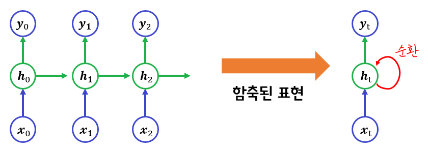
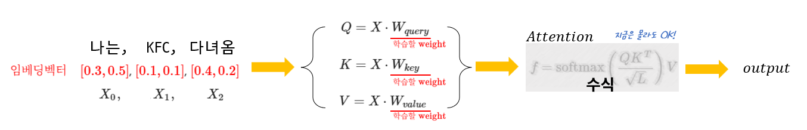
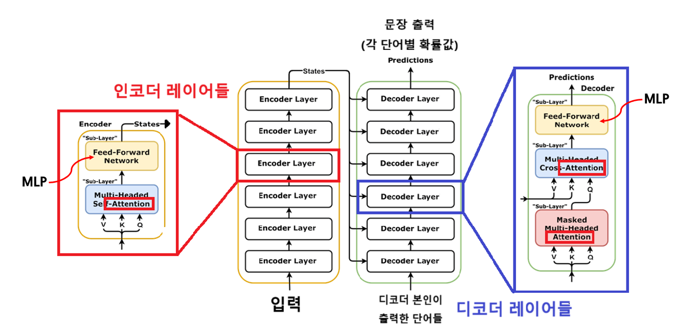
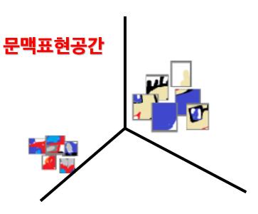

# 이미지 생성, 평가, 전이학습까지: Transformer 시대의 멀티모달 학습 노트

- 🎯 글의 목표: RNN에서 Transformer로 이어지는 흐름을 바탕으로, 텍스트-투-이미지 생성, CLIP 평가, CNN 비교, 전이학습, Knowledge Distillation까지 하나의 실습 파이프라인으로 이해한다.
- 🧩 핵심 키워드: RNN, Attention, Transformer, 멀티모달, Foundation Model, Diffusion, Stable Diffusion, SANA, CLIP, ResNet, Transfer Learning, Linear Probing, Knowledge Distillation
- ⭐ 중요도: 상
- 📝 한눈에 보는 내용: 이 노트는 "왜 Transformer가 멀티모달 시대의 중심이 되었는가"를 먼저 설명한 뒤, 실제 실습에서 어떻게 이미지 생성과 평가, 그리고 소규모 분류 모델 학습으로 이어지는지를 묶어서 정리한다.
- 🔗 관련 문제 / 주제(있다면): Text-to-Image 생성, Zero-shot 분류, 이미지 분류, 합성 데이터셋 구축, 리니어 프로빙, 모델 경량화

---

## 1. 들어가며

이번 강의는 겉으로 보면 이미지 생성 실습처럼 보이지만, 실제로는 더 큰 흐름 안에 놓여 있다.  
예전의 순차 모델이 왜 한계를 가졌는지, Transformer가 어떤 방식으로 그 한계를 넘었는지, 그리고 그 결과로 왜 텍스트와 이미지를 함께 다루는 모델이 자연스럽게 등장했는지를 먼저 이해해야 뒤의 실습이 끊기지 않는다.

이 흐름을 잡고 나면 뒤에서 나오는 Diffusion, CLIP, ResNet 비교, 전이학습, 지식 증류가 각각 따로 떨어진 기술이 아니라는 점이 보인다.  
쉽게 말하면, 이번 강의는 **Transformer 시대의 멀티모달 파이프라인을 한 번에 훑어보는 수업**이다.

이 글은 다음 순서로 읽으면 가장 자연스럽다.

1. 순차 모델의 한계와 Transformer의 등장을 이해한다.
2. 텍스트와 이미지가 같은 표현 공간에서 만난다는 감각을 잡는다.
3. 그 위에서 텍스트로 이미지를 만들고, 텍스트로 이미지를 평가하는 과정을 본다.
4. 마지막으로 생성한 데이터를 다시 CNN 학습에 활용하며, 작은 모델을 더 똑똑하게 만드는 방법까지 연결한다.

---

## 2. 핵심 개념 정리

강의 전체 흐름은 아래처럼 잡아두면 좋다.

- **RNN**은 순서가 있는 데이터를 다루는 출발점이었다.
- 하지만 긴 문맥을 기억하기 어렵고, 학습도 불안정했다.
- **Transformer**는 순차적으로 기억을 넘기는 대신, 한 번에 관계를 보는 Attention으로 이 문제를 풀었다.
- 이 구조는 텍스트뿐 아니라 이미지, 음성, 비디오처럼 서로 다른 **모달**에도 확장되었다.
- 그 결과, 텍스트로 이미지를 만들고, 이미지와 텍스트의 의미를 비교하고, 여러 입력을 함께 받아 답하는 **Foundation Model** 시대가 열렸다.
- 실습에서는 이 흐름을 실제 코드로 확인한다.
  - Diffusion으로 이미지를 생성하고
  - CLIP으로 텍스트-이미지 정합도를 평가하고
  - ResNet과 비교하여 모델 성격 차이를 보고
  - 생성 이미지로 데이터셋을 만들어 전이학습을 수행하고
  - Teacher-Student 구조로 Knowledge Distillation까지 확장한다.

이때 중요한 점은, 뒤에 나오는 모든 실습이 독립적인 기능 데모가 아니라는 점이다.  
**"같은 표현 공간으로 정렬한다"**, **"사전학습된 표현을 재사용한다"**, **"데이터가 부족하면 생성과 전이를 함께 쓴다"**는 감각이 전체를 관통한다.

---

## 3. 본문 정리

## 3.1 RNN에서 Transformer로 넘어가는 이유

RNN은 순서가 있는 데이터를 다루기 위해 등장한 대표적인 모델이다.  
핵심 아이디어는 단순하다. 이전 시점의 정보를 `hidden state`에 담아 다음 시점 예측에 계속 활용하는 방식이다.



위 그림을 볼 때 가장 먼저 잡아야 할 점은, 정보가 시간축을 따라 차례대로 흘러간다는 것이다.  
처음에는 이 구조가 자연스럽게 보인다. 문장을 읽을 때도 앞 단어가 뒤 단어 해석에 영향을 주기 때문이다.

하지만 이 방식은 문장이 길어질수록 문제가 생긴다.

- 오래전 정보가 뒤까지 잘 전달되지 않는다.
- 역전파가 길게 이어지면서 기울기 소실이나 폭발 문제가 생기기 쉽다.
- 순차적으로 계산해야 하므로 병렬화에도 불리하다.

쉽게 말하면, RNN은 **"조금 전에 본 것"**은 잘 기억하지만, **"한참 전에 본 것"**은 점점 희미해지기 쉽다.  
그래서 긴 문맥이 중요한 문제에서는 성능과 학습 안정성 모두에서 한계를 드러낸다.

### 자주 하는 오해

- RNN이 과거 정보를 전혀 못 쓰는 것은 아니다.
- 문제는 **길이가 길어질수록 중요한 정보가 약해지기 쉽다**는 데 있다.
- LSTM, GRU 같은 개선형이 나왔지만, 구조 자체의 순차성까지 없애지는 못했다.

📌 핵심: **RNN의 한계는 "순서대로 넘겨받는 기억"에 의존한다는 점에서 시작된다.**

---

## 3.2 Attention은 무엇을 바꿨는가

Transformer의 핵심은 RNN처럼 정보를 한 칸씩 넘기는 대신, 입력 전체 안에서 **무엇이 무엇과 관련 있는지 직접 계산**한다는 데 있다.  
이때 중심에 있는 연산이 Attention이다.



Attention은 보통 아래처럼 정리한다.

\[
Q = XW_Q, \quad K = XW_K, \quad V = XW_V
\]

여기서 중요한 건 수식 자체보다 역할이다.

- **Query(Q)**: 지금 내가 참고하고 싶은 기준
- **Key(K)**: 각 토큰이 가진 검색용 단서
- **Value(V)**: 실제로 가져올 정보

즉, 각 토큰은 다른 토큰들과의 관련도를 계산하고, 그 관련도만큼 정보를 섞어 새로운 문맥 표현을 만든다.

이 아이디어가 중요한 이유는 분명하다.

1. 멀리 떨어진 단어끼리의 관계도 직접 볼 수 있다.
2. 순차 처리 대신 한 번에 관계를 계산하므로 병렬화에 유리하다.
3. 문맥 전체를 반영한 표현을 만들 수 있다.

쉽게 말하면, RNN이 "앞에서 뒤로 기억을 전달하는 방식"이었다면, Attention은 "문장 전체를 펼쳐놓고 지금 필요한 부분을 바로 참고하는 방식"에 가깝다.

### 왜 여기서 막히기 쉬운가

처음 보면 `Q`, `K`, `V`가 각각 다른 데이터처럼 느껴질 수 있다.  
하지만 실제로는 **같은 입력 임베딩을 서로 다른 목적에 맞게 선형변환한 결과**라고 이해하는 편이 훨씬 쉽다.

- 같은 입력에서
- 검색 기준용 표현을 만들고
- 비교용 표현을 만들고
- 실제 전달용 표현을 따로 만든다

이렇게 생각하면 Attention이 갑자기 낯선 연산으로 보이지 않는다.

📌 핵심: **Attention은 입력 전체의 관계를 한 번에 보면서 문맥 표현을 다시 만드는 연산이다.**

---

## 3.3 Transformer와 멀티모달의 연결

Transformer는 Attention을 여러 층으로 쌓아 더 풍부한 문맥 표현을 만든다.  
텍스트에서는 단어 간 관계를 보고, 이미지에서는 패치 간 관계를 보며, 더 나아가 텍스트와 이미지 사이의 관계까지 같은 방식으로 다룰 수 있다.



위 구조를 볼 때 중요한 점은, Transformer가 특정 입력 형식 하나에만 묶인 모델이 아니라는 것이다.  
입력을 적절한 토큰 또는 패치 형태의 표현으로 바꾸기만 하면, 같은 원리로 처리할 수 있다.

그래서 "모달"이라는 개념이 자연스럽게 등장한다.

- 텍스트는 텍스트 토큰으로
- 이미지는 이미지 패치로
- 음성은 프레임 또는 특징 벡터로

바꾸어 넣을 수 있고, 이렇게 다른 형태의 입력을 함께 다루는 모델이 멀티모달 모델이다.



이 지점에서 CLIP 같은 모델이 이해된다.  
CLIP은 텍스트와 이미지를 각각 인코딩한 뒤, 둘을 **같은 의미 공간에 가깝게 정렬**한다.  
그러면 "이 이미지는 어떤 문장과 가장 잘 맞는가"를 유사도 비교로 바로 계산할 수 있다.

### Foundation Model 관점에서 보면

Foundation Model은 대규모 데이터로 미리 학습되어 다양한 작업에 재사용할 수 있는 기반 모델이다.  
이 수업에서 만나는 모델들도 이 범주 안에 놓여 있다.

- Stable Diffusion: 텍스트 조건 기반 이미지 생성
- CLIP: 텍스트-이미지 정렬과 zero-shot 분류
- YOLOS: Transformer 기반 객체 탐지
- SmolVLM 계열: 이미지와 텍스트를 함께 보고 응답 생성

즉, 이번 강의의 실습은 단순한 기능 체험이 아니라, **Foundation Model을 실제 문제에 어떻게 조합해 쓰는가**를 경험하는 과정이라고 볼 수 있다.

📌 핵심: **Transformer는 텍스트만 잘하는 모델이 아니라, 여러 모달을 같은 표현 원리로 다룰 수 있게 만든 기반 구조다.**

---

## 3.4 Diffusion으로 텍스트에서 이미지를 만든다는 것

텍스트-투-이미지 생성은 "문장을 넣으면 그림이 나오는 마법"처럼 보일 수 있다.  
하지만 내부 원리는 비교적 분명하다. Diffusion 모델은 **노이즈를 점점 제거하면서 이미지로 복원하는 과정**을 학습한다.

학습과 추론을 나누어 보면 이해가 더 쉽다.

| 과정 | 무엇을 하는가 |
|---|---|
| Forward | 원본 이미지에 노이즈를 조금씩 추가한다 |
| Reverse | 노이즈에서 출발해 원래 이미지 구조를 복원하도록 학습한다 |

이때 텍스트 프롬프트는 "어떤 방향으로 복원해야 하는가"를 알려주는 조건 신호가 된다.  
그래서 단순히 노이즈를 지우는 것이 아니라, **"강아지처럼 보이게"**, **"석양 창가의 고양이처럼 보이게"**라는 방향이 붙는다.

### Stable Diffusion 파이프라인

강의 노트에서는 `diffusers` 라이브러리를 활용해 Stable Diffusion 파이프라인을 불러오고, 프롬프트로 이미지를 생성한다.

```python
from diffusers import StableDiffusionPipeline
import torch

# 사전학습된 Stable Diffusion 파이프라인을 불러온다.
# float16을 사용하면 GPU 메모리 사용량을 줄이는 데 도움이 된다.
pipe = StableDiffusionPipeline.from_pretrained(
    "runwayml/stable-diffusion-v1-5",
    torch_dtype=torch.float16
).to("cuda")

# 프롬프트는 생성하고 싶은 장면을 구체적으로 설명한다.
image = pipe(
    prompt="a photo of a cat sitting on a windowsill, sunset",
    num_inference_steps=50,   # 디노이징 단계 수
    guidance_scale=7.5        # 프롬프트 충실도
).images[0]

image.save("generated.png")
```

여기서 자주 보는 파라미터는 아래 세 가지다.

| 파라미터 | 의미 | 감각적으로 이해하면 |
|---|---|---|
| `prompt` | 생성 장면 설명 | 무엇을 그릴지 |
| `num_inference_steps` | 디노이징 반복 수 | 얼마나 공들여 복원할지 |
| `guidance_scale` | 프롬프트 충실도 | 문장을 얼마나 강하게 따를지 |

### 프롬프트 엔지니어링

생성 품질은 프롬프트에 크게 좌우된다.  
강의에서는 Positive Prompt와 Negative Prompt를 함께 사용한다.

```python
# 주제, 스타일, 조명, 품질 키워드를 함께 넣어 장면을 더 구체화한다.
prompt = "a golden retriever puppy, studio photography, soft lighting, 4k, detailed"

# 원하지 않는 요소를 빼는 방식으로 결과를 안정화한다.
negative = "blurry, low quality, distorted"

image = pipe(
    prompt=prompt,
    negative_prompt=negative
).images[0]
```

이 방식이 중요한 이유는, 생성 모델이 "무엇을 넣을지"뿐 아니라 "무엇을 피할지"도 반영하기 때문이다.  
특히 흐림, 왜곡, 저화질처럼 자주 나오는 문제를 줄이는 데 효과적이다.

### 시드 제어와 재현성

같은 프롬프트인데도 결과가 달라지는 이유는 초기 노이즈가 다르기 때문이다.  
그래서 실험을 다시 재현하고 싶다면 시드를 고정해야 한다.

```python
# 같은 시드를 쓰면 같은 초기 노이즈에서 시작하므로 결과 재현이 가능하다.
generator = torch.Generator(device="cuda").manual_seed(42)

image = pipe(
    prompt=prompt,
    generator=generator,
    num_inference_steps=50
).images[0]
```

### 자주 하는 실수 / 디버깅 포인트

- `guidance_scale`를 너무 높이면 프롬프트에는 맞지만 과하게 인위적인 결과가 나오기 쉽다.
- `num_inference_steps`를 무작정 늘린다고 항상 좋아지지 않는다.
- 시드를 고정하지 않으면 결과 차이가 프롬프트 때문인지 초기 노이즈 때문인지 구분하기 어렵다.
- GPU 메모리가 부족할 때는 더 가벼운 파이프라인(SANA 등)이나 해상도 축소를 고려해야 한다.

📌 핵심: **Diffusion 기반 텍스트-투-이미지는 "문장 조건을 따라 노이즈를 이미지로 복원하는 과정"으로 이해하면 된다.**

---

## 3.5 CLIP은 생성 결과를 어떻게 평가하는가

이미지를 만들었다고 해서 끝은 아니다.  
이제 정말로 내가 원한 의미가 반영되었는지 확인해야 한다. 이때 등장하는 모델이 CLIP이다.

CLIP은 이미지와 텍스트를 같은 임베딩 공간에 놓고 유사도를 계산한다.  
그래서 "이 이미지가 어떤 문장과 가장 잘 맞는가?"를 바로 물어볼 수 있다.

### 기본 흐름

1. 생성된 이미지 하나를 준비한다.
2. 정답 후보와 혼동 가능한 오답 후보 문장들을 만든다.
3. CLIP이 이미지-문장 유사도를 계산한다.
4. 가장 높은 확률을 가진 문장을 확인한다.

```python
from PIL import Image
from transformers import CLIPProcessor, CLIPModel
import torch

# CLIP 모델과 전처리기를 로드한다.
processor = CLIPProcessor.from_pretrained("openai/clip-vit-base-patch32")
model = CLIPModel.from_pretrained("openai/clip-vit-base-patch32")

# 평가할 이미지와 텍스트 후보를 준비한다.
image = Image.open("generated_image_0.png")
labels = [
    "a watercolor painting of a red fox",
    "a watercolor painting of a golden retriever",
    "a photograph of a fox",
]

# 이미지와 텍스트를 같은 배치로 전처리한다.
inputs = processor(
    text=labels,
    images=image,
    return_tensors="pt",
    padding=True
)

# 유사도를 계산한다.
with torch.no_grad():
    outputs = model(**inputs)

logits_per_image = outputs.logits_per_image
probs = logits_per_image.softmax(dim=1)

# 가장 유사한 문장을 고른다.
best_idx = probs.argmax(dim=1).item()
print("예측:", labels[best_idx])
print("확률:", probs)
```

### 왜 CLIP이 중요한가

기존 분류 모델은 보통 미리 정해진 클래스 안에서만 답할 수 있다.  
반면 CLIP은 텍스트 후보를 내가 직접 만들 수 있기 때문에 훨씬 유연하다.

예를 들어, 같은 "여우" 이미지라도 아래처럼 더 세밀한 비교가 가능하다.

- 수채화 여우 그림
- 유화 스타일 여우 그림
- 실제 사진 속 여우
- 숲 바닥에 앉아 있는 여우

즉, CLIP은 단순히 사물을 맞히는 것보다 **설명과 이미지가 얼마나 잘 맞는지**를 보는 데 강하다.

### 예시 출력 해석

과제 노트에서는 "1960년대 빨간색 컨버터블이 해안 도로를 달리는 장면"을 생성한 뒤 CLIP으로 평가했는데, 정답 라벨이 약 **0.9992**의 확률로 가장 높게 나왔다.  
반면 "현대식 빨간 세단", "스케치", "숲 속 컨버터블" 같은 오답 라벨의 확률은 거의 0에 가까웠다.

이 결과는 생성된 이미지가 단순히 "차"처럼 보이는 수준이 아니라, **시대·차종·배경 문맥까지 비교적 잘 반영되었다**는 뜻으로 해석할 수 있다.

### CLIP Score를 볼 때 주의할 점

CLIP 점수가 높다고 해서 이미지가 항상 "좋다"고 말할 수는 없다.  
CLIP은 어디까지나 **텍스트-이미지 정합도**를 보는 지표다.

- 프롬프트와 잘 맞는지: 잘 본다.
- 해상도가 좋은지: 직접 보지 못한다.
- 아티팩트가 적은지: 직접 보지 못한다.
- 시각적으로 아름다운지: 별도 판단이 필요하다.

즉, CLIP은 생성 품질 평가의 한 축이지, 전체 품질을 대체하는 단일 지표는 아니다.

### 자주 하는 실수 / 디버깅 포인트

- 정답 라벨만 넣고 평가하면 의미 있는 비교가 되지 않는다.
- 오답 후보를 너무 엉뚱하게 만들면 CLIP이 잘 맞추는 것처럼 보이기만 한다.
- "고양이 vs 강아지"처럼 쉬운 비교보다, 실제로 혼동할 수 있는 후보를 넣는 편이 더 좋은 평가다.
- softmax 확률이 높다고 절대적 진실로 보지 말고, **후보 집합 안에서의 상대 비교**라고 이해해야 한다.

📌 핵심: **CLIP은 "이 이미지가 어떤 문장과 가장 잘 맞는가"를 묻는 모델이며, 생성 결과의 의미 정합도를 빠르게 점검하는 데 특히 유용하다.**

---

## 3.6 ResNet-50과 CLIP을 왜 함께 비교하는가

CLIP이 유연하다면, 전통적인 이미지 분류 모델은 어떤 장단점이 있을까.  
이 차이를 가장 분명하게 보여주는 비교 대상이 ResNet-50이다.

ResNet은 CNN 계열의 대표 모델이고, ImageNet처럼 고정된 분류 문제에서 매우 강력하다.  
특히 Skip Connection 덕분에 깊은 네트워크도 안정적으로 학습할 수 있다.

```python
import torchvision.models as models
import torch
from PIL import Image

# ImageNet 사전학습 가중치를 불러온다.
weights = models.ResNet50_Weights.IMAGENET1K_V2
model = models.resnet50(weights=weights)
model.eval()

# 가중치에 맞는 전처리를 그대로 사용하는 것이 가장 안전하다.
preprocess = weights.transforms()

# 이미지 전처리 후 배치 차원을 추가한다.
image = Image.open("test.jpg")
input_tensor = preprocess(image).unsqueeze(0)

# 추론을 수행하고 확률을 계산한다.
with torch.no_grad():
    output = model(input_tensor)
    probabilities = torch.softmax(output, dim=1)

# Top-5 예측을 본다.
top5_probs, top5_indices = probabilities.topk(5)
categories = weights.meta["categories"]

for i in range(5):
    idx = top5_indices[0][i].item()
    prob = top5_probs[0][i].item()
    print(categories[idx], prob)
```

### 비교 포인트

| 비교 항목 | ResNet-50 | CLIP |
|---|---|---|
| 분류 방식 | 고정된 ImageNet 클래스 | 자유 텍스트 후보와의 유사도 |
| 새 클래스 대응 | 재학습 필요 | zero-shot 가능 |
| 입력 | 이미지 | 이미지 + 텍스트 |
| 강점 | 정해진 범주 분류 정확도 | 유연한 의미 비교 |

### 예시 출력 해석

과제 노트에서 같은 클래식 자동차 이미지를 ResNet-50으로 분류했을 때, 1순위는 **convertible (0.5696)**였다.  
그 아래에는 `sports car`, `promontory`, `cliff` 같은 ImageNet 범주의 단어가 뒤따랐다.

이 결과를 CLIP과 비교하면 차이가 선명하다.

- **ResNet-50**은 "무엇이 보이는가"를 고정된 범주 안에서 잘 맞힌다.
- **CLIP**은 "어떤 설명과 가장 잘 맞는가"를 문장 수준에서 유연하게 비교한다.

그래서 "수채화 스타일", "1960년대", "해안 도로", "녹슨 폐차" 같은 설명은 CLIP이 더 잘 다루고,  
"ImageNet 안에 있는 1000개 클래스 중 무엇인가"를 묻는 문제는 ResNet이 강하다.

### 왜 둘 다 알아야 할까

현업이나 프로젝트에서는 항상 최신 멀티모달 모델만 쓰는 것이 아니다.

- 고정 클래스 분류라면 CNN이 더 단순하고 빠를 수 있다.
- 라벨이 자주 바뀌거나 설명 기반 평가가 필요하면 CLIP이 더 유리하다.
- 결국 중요한 것은 모델 이름이 아니라 **문제의 형태가 무엇인가**다.

📌 핵심: **ResNet은 고정된 분류 문제에 강하고, CLIP은 텍스트로 의미를 정의해야 하는 문제에 강하다.**

---

## 3.7 생성한 데이터를 다시 학습에 쓰기: ResNet-18 전이학습

이번 강의에서 특히 실용적인 부분은 여기다.  
이미지를 생성하는 것으로 끝내지 않고, 그 생성 이미지를 다시 데이터셋으로 만들어 분류 모델을 학습한다.

이 아이디어가 중요한 이유는 현실에서는 늘 데이터가 부족하기 때문이다.  
실제 사진을 대량으로 수집하기 어렵다면, 생성 모델로 **합성 데이터**를 만들어 초기 실험을 해볼 수 있다.

### 데이터셋 구성 감각

노트에서는 클래스별 폴더 구조를 사용했다.

| 경로 | 의미 |
|---|---|
| `data/train/{클래스명}/` | 학습용 이미지 |
| `data/test/{클래스명}/` | 테스트용 이미지 |

이 구조를 쓰면 `ImageFolder`가 폴더 이름을 자동으로 라벨로 인식한다.

```python
from torchvision import transforms
from torchvision.datasets import ImageFolder
from torch.utils.data import DataLoader

# 학습용은 데이터 증강을 넣어 다양성을 늘린다.
train_transforms = transforms.Compose([
    transforms.RandomResizedCrop((224, 224)),
    transforms.RandomHorizontalFlip(),
    transforms.ToTensor(),
    transforms.Normalize([0.485, 0.456, 0.406],
                         [0.229, 0.224, 0.225])
])

# 테스트용은 평가 일관성을 위해 단순 전처리만 적용한다.
test_transforms = transforms.Compose([
    transforms.Resize((224, 224)),
    transforms.ToTensor(),
    transforms.Normalize([0.485, 0.456, 0.406],
                         [0.229, 0.224, 0.225])
])

train_dataset = ImageFolder("data/train", transform=train_transforms)
test_dataset = ImageFolder("data/test", transform=test_transforms)

train_loader = DataLoader(train_dataset, batch_size=4, shuffle=True)
test_loader = DataLoader(test_dataset, batch_size=4, shuffle=False)
```

### 왜 ResNet-18을 쓰는가

ResNet-50보다 가볍고 빠르기 때문이다.  
소규모 실습에서는 아주 큰 모델보다, 빠르게 실험 가능한 모델이 오히려 더 적합할 때가 많다.

또한 ImageNet 사전학습 모델은 이미 에지, 텍스처, 형태 같은 범용 시각 특징을 학습한 상태다.  
그래서 모든 층을 처음부터 다시 학습할 필요 없이, 마지막 분류기만 바꿔도 꽤 좋은 출발점을 얻을 수 있다.

### 리니어 프로빙 구현

```python
import torch.nn as nn
import torch.optim as optim
from torchvision.models import resnet18, ResNet18_Weights

# 사전학습된 ResNet-18을 불러온다.
model = resnet18(weights=ResNet18_Weights.IMAGENET1K_V1)

# 백본은 그대로 두고, 기존 특징 추출 능력을 보존한다.
for param in model.parameters():
    param.requires_grad = False

# 마지막 분류층만 현재 데이터셋 클래스 수에 맞게 바꾼다.
num_classes = len(train_dataset.classes)
model.fc = nn.Linear(model.fc.in_features, num_classes)
model = model.to(device)

# 학습은 fc 레이어만 수행한다.
criterion = nn.CrossEntropyLoss()
optimizer = optim.SGD(model.fc.parameters(), lr=0.01, momentum=0.9)
```

이 구조를 **리니어 프로빙(linear probing)**이라고 부른다.  
핵심은 "기존 표현은 재사용하고, 마지막 해석기만 바꾼다"는 데 있다.

### 학습 루프

```python
for epoch in range(num_epochs):
    model.train()
    running_loss = 0.0

    for images, labels in train_loader:
        images, labels = images.to(device), labels.to(device)

        # 이전 step의 기울기를 지운다.
        optimizer.zero_grad()

        # 현재 배치에 대한 예측을 만든다.
        outputs = model(images)

        # 예측과 정답 사이의 손실을 계산한다.
        loss = criterion(outputs, labels)

        # 손실을 기준으로 역전파를 수행한다.
        loss.backward()

        # 학습 가능한 파라미터(fc)를 업데이트한다.
        optimizer.step()

        running_loss += loss.item()

    model.eval()
    correct, total = 0, 0
    with torch.no_grad():
        for images, labels in test_loader:
            images, labels = images.to(device), labels.to(device)
            outputs = model(images)
            _, predicted = outputs.max(1)
            correct += (predicted == labels).sum().item()
            total += labels.size(0)

    print(f"Epoch {epoch+1}: Loss={running_loss/len(train_loader):.4f}, "
          f"Test Acc={correct/total:.2%}")
```

### 결과를 어떻게 봐야 하나

강의 노트의 예시에서는 3에폭만 학습해도 검증 정확도가 **90%** 수준까지 올라가는 흐름을 보여주었고,  
과제 노트에서는 생성한 `brand_new` / `rusty_abandoned` 자동차 데이터셋에서 테스트 정확도 **100%**가 출력되었다.

이 결과는 "합성 데이터만으로 언제나 완벽한 모델을 만들 수 있다"는 뜻은 아니다.  
다만 최소한 다음 사실은 분명히 보여준다.

- 생성 모델은 데이터 부족 상황에서 유용한 출발점을 줄 수 있다.
- 사전학습 백본과 결합하면 적은 데이터로도 빠르게 실험할 수 있다.
- 문제를 아주 작게 잘 정의하면, 작은 분류 모델도 충분히 작동한다.

### 자주 하는 실수 / 디버깅 포인트

- `ImageFolder`의 클래스 인덱스는 폴더명 알파벳 순으로 정해진다.
- 학습용과 테스트용 전처리를 같은 방식으로 두면 평가가 왜곡될 수 있다.
- `requires_grad=False`를 빼먹으면 백본 전체가 학습되어 속도와 메모리 사용량이 크게 늘어난다.
- 정규화된 이미지를 그대로 시각화하면 색이 이상하게 보이므로 역정규화가 필요하다.

```python
import torch

def denormalize(img_tensor,
                mean=[0.485, 0.456, 0.406],
                std=[0.229, 0.224, 0.225]):
    # [C, H, W] 텐서를 사람이 볼 수 있는 색 범위로 되돌린다.
    mean_t = torch.tensor(mean).view(-1, 1, 1)
    std_t = torch.tensor(std).view(-1, 1, 1)
    img = img_tensor.cpu() * std_t + mean_t
    return img.clamp(0, 1)
```

📌 핵심: **전이학습은 "처음부터 다 배우는 것"이 아니라, 이미 배운 표현을 내 문제에 맞게 빠르게 재사용하는 방법이다.**

---

## 3.8 Knowledge Distillation은 왜 필요한가

전이학습까지 이해했다면, 이제 한 단계 더 나아갈 수 있다.  
큰 모델이 더 잘 안다면, 그 지식을 작은 모델에게 옮길 수 없을까? 이 질문에 대한 답이 Knowledge Distillation이다.

핵심은 Teacher 모델의 출력 확률분포를 Student가 따라 배우게 하는 것이다.  
여기서 중요한 것은 정답 하나만 보는 것이 아니라, **나머지 클래스에 얼마나 비슷하다고 보는지**까지 같이 배우는 점이다.

### Soft Label의 의미

예를 들어 어떤 이미지에 대해 Teacher가 아래처럼 예측했다고 하자.

- cat: 0.7
- dog: 0.2
- fox: 0.1

정답이 cat이라고 하더라도, 이 분포에는 "dog와도 약간 비슷하다"는 정보가 들어 있다.  
이런 정보는 0 또는 1만 있는 hard label에는 들어 있지 않다.

### Temperature를 쓰는 이유

Temperature를 1보다 크게 두면 확률분포가 더 부드러워진다.

```python
import torch
import torch.nn.functional as F

teacher_logits = torch.tensor([5.0, 2.0, 1.0])
T = 3.0

hard_labels = F.softmax(teacher_logits, dim=0)
soft_labels = F.softmax(teacher_logits / T, dim=0)

print("Hard Labels:", hard_labels)
print("Soft Labels:", soft_labels)
```

이렇게 하면 가장 큰 클래스만 강조되는 것이 아니라, 다른 클래스와의 상대적 관계도 더 잘 드러난다.

### KD 학습 루프

```python
import torch.nn.functional as F
from torchvision.models import resnet50, ResNet50_Weights

# Teacher는 더 큰 모델을 사용한다.
teacher_model = resnet50(weights=ResNet50_Weights.IMAGENET1K_V2)
for param in teacher_model.parameters():
    param.requires_grad = False
teacher_model.fc = nn.Linear(teacher_model.fc.in_features, num_classes)
teacher_model = teacher_model.to(device)

# Student는 더 작은 모델을 사용한다.
student_model = resnet18(weights=ResNet18_Weights.IMAGENET1K_V1)
for param in student_model.parameters():
    param.requires_grad = False
student_model.fc = nn.Linear(student_model.fc.in_features, num_classes)
student_model = student_model.to(device)

student_optimizer = optim.SGD(student_model.fc.parameters(), lr=0.01, momentum=0.9)
ce_criterion = nn.CrossEntropyLoss()

T = 4.0
alpha = 0.7

for epoch in range(kd_epochs):
    student_model.train()
    running_loss = 0.0

    for images, labels in train_loader:
        images, labels = images.to(device), labels.to(device)

        # Teacher는 학습하지 않고, 현재 배치에 대한 soft target만 만든다.
        with torch.no_grad():
            teacher_logits = teacher_model(images)
            teacher_soft = F.softmax(teacher_logits / T, dim=1)

        # Student 예측을 같은 Temperature로 부드럽게 만든다.
        student_logits = student_model(images)
        student_log_soft = F.log_softmax(student_logits / T, dim=1)

        # Teacher 분포와 Student 분포를 가깝게 만든다.
        kl_loss = F.kl_div(
            student_log_soft,
            teacher_soft,
            reduction="batchmean"
        ) * (T * T)

        # 실제 정답도 함께 반영한다.
        ce_loss = ce_criterion(student_logits, labels)

        # 두 손실을 가중합하여 최종 손실을 만든다.
        loss = alpha * kl_loss + (1 - alpha) * ce_loss

        student_optimizer.zero_grad()
        loss.backward()
        student_optimizer.step()

        running_loss += loss.item()
```

### 여기서 중요한 해석

- Teacher는 큰 모델이라 더 풍부한 표현을 가지고 있다.
- Student는 작고 빠르지만 정보량이 적다.
- KD는 Teacher의 판단 구조를 Student가 흉내 내게 하여, 작은 모델이 더 똑똑하게 일반화하도록 돕는다.

과제 노트에서도 이 구조를 선택 과제로 확장했다.  
즉, 이번 강의는 단순히 분류기를 하나 학습시키는 수준을 넘어, **모델 압축과 지식 전달이라는 현대적 주제**까지 연결하고 있다.

### 자주 하는 실수 / 디버깅 포인트

- Teacher를 `eval()`로 고정하지 않으면 결과가 흔들릴 수 있다.
- `T^2` 보정을 빼먹으면 KL 손실의 스케일이 달라져 학습이 불안정해질 수 있다.
- KL 손실만 쓰면 실제 정답과 어긋날 수 있으므로 CE 손실을 함께 쓰는 경우가 많다.
- `alpha`를 너무 크게 두면 Teacher 분포만 과하게 따라가고, 너무 작게 두면 KD 효과가 약해진다.

📌 핵심: **Knowledge Distillation은 큰 모델의 "정답 외 정보"까지 작은 모델에 전달하는 학습 방식이다.**

---

## 4. 적용 관점에서 다시 보기

이제 본문에서 본 내용을 실제 문제풀이와 구현 관점으로 다시 묶어보자.  
여기서는 새로운 개념을 추가하지 않고, 앞에서 정리한 흐름을 실전 감각으로 연결한다.

### 4.1 어떤 상황에서 어떤 모델을 떠올리면 좋을까

- **문장 설명으로 이미지를 만들고 싶다**  
  → Diffusion 기반 Text-to-Image 모델을 먼저 떠올린다.

- **생성된 이미지가 프롬프트와 얼마나 맞는지 빠르게 확인하고 싶다**  
  → CLIP처럼 텍스트-이미지 정렬 모델을 떠올린다.

- **라벨이 고정된 분류 문제를 빠르게 처리하고 싶다**  
  → ResNet 같은 CNN 기반 사전학습 모델이 여전히 강력하다.

- **데이터가 적지만 사전학습 표현을 활용하고 싶다**  
  → ResNet-18 리니어 프로빙처럼 전이학습을 떠올린다.

- **작은 모델 성능을 조금 더 끌어올리고 싶다**  
  → Teacher-Student 기반 KD를 고려한다.

### 4.2 문제를 보면 어떤 신호를 포착해야 하는가

- "프롬프트를 바꿨는데 결과가 안정적이지 않다"  
  → 시드, guidance scale, negative prompt를 먼저 점검한다.

- "이미지가 맞아 보이는데 자동 평가가 필요하다"  
  → CLIP 후보 문장을 잘 설계해야 한다.

- "실제 데이터가 너무 적다"  
  → 생성 모델로 합성 데이터를 만들고, 전이학습으로 빠르게 실험할 수 있다.

- "정답 클래스는 적은데 모델이 너무 크다"  
  → 작은 Student 모델 + KD가 더 현실적일 수 있다.

### 4.3 구현 순서를 어떻게 잡으면 좋을까

1. **문제를 언어로 정의한다.**  
   무엇을 만들고, 무엇을 비교하고, 무엇을 분류할 것인지 먼저 문장으로 정리한다.

2. **생성 파이프라인을 만든다.**  
   프롬프트, 시드, 해상도, 스텝 수를 고정하여 재현 가능한 생성 환경을 만든다.

3. **CLIP으로 의미 정합도를 본다.**  
   정답 후보와 혼동 후보를 함께 넣어 프롬프트 품질과 생성 결과를 점검한다.

4. **필요하면 데이터셋으로 확장한다.**  
   클래스별 폴더 구조를 만들고, 학습/평가용 이미지를 나눈다.

5. **사전학습 모델로 빠르게 분류 실험을 한다.**  
   처음부터 거대한 모델을 새로 학습하지 않는다.

6. **작은 모델 한계가 보이면 KD로 보강한다.**  
   이 단계는 "더 좋은 구조"라기보다 "더 작은 모델을 효율적으로 쓰기 위한 전략"에 가깝다.

### 4.4 실전에서 특히 자주 틀리는 부분

- 프롬프트를 한 번 잘 만들고도 시드를 고정하지 않아 실험 비교가 흐려진다.
- CLIP 평가에서 후보 문장을 너무 쉽게 만들어 모델 차이가 안 드러난다.
- `weights.transforms()` 대신 임의 전처리를 써서 사전학습 모델 성능이 불안정해진다.
- 전이학습에서 freeze를 빼먹어 시간이 오래 걸리고 과적합이 생긴다.
- 정규화된 이미지를 그대로 시각화해 예측 실패처럼 오해한다.
- KD에서 `Teacher soft label`과 `정답 hard label`의 역할 차이를 구분하지 못한다.

---

## 5. 배운 점 / 느낀 점 / 확장 포인트

이번 강의에서 가장 크게 남는 점은, 이미지 생성 실습이 결코 독립된 장난감 기능이 아니라는 것이다.  
생성, 평가, 분류, 압축까지 모두 **사전학습 표현을 어떻게 재사용할 것인가**라는 큰 문제 안에서 연결된다.

특히 다음 세 가지가 중요하다.

첫째, **텍스트와 이미지를 같은 표현 공간에서 다룬다**는 생각이 CLIP을 이해하는 핵심이었다.  
이 감각이 잡히면 zero-shot 분류나 멀티모달 검색이 왜 가능한지도 자연스럽게 이어진다.

둘째, **생성 모델은 데이터 부족 문제를 완전히 해결하지는 않지만, 실험을 시작하게 해주는 강력한 도구**가 될 수 있다.  
실제 데이터가 없거나 적을 때 합성 데이터를 만들어 빠르게 가설을 검증하는 흐름은 매우 실용적이다.

셋째, **큰 모델을 그대로 쓰는 것만이 정답은 아니다.**  
상황에 따라서는 작은 모델을 전이학습하거나, Teacher의 지식을 증류받게 하는 편이 더 현실적이다.

더 공부해볼 만한 확장 포인트도 분명하다.

- CLIP Score 외에 FID, IS 같은 생성 품질 지표
- full fine-tuning과 linear probing의 차이
- LoRA 같은 경량 적응 기법
- VLM 계열(Image-Text to Text) 모델의 추론 방식
- 객체 탐지, 세그멘테이션 같은 다운스트림 비전 태스크로의 확장

---

## 6. 요약 정리

📌 핵심

- RNN은 순차 기억 구조 때문에 긴 문맥 처리에 한계가 있었다.
- Transformer는 Attention으로 입력 전체의 관계를 직접 보며 문맥 표현을 만든다.
- 이 구조는 텍스트뿐 아니라 이미지까지 확장되며 멀티모달 시대를 열었다.
- Diffusion 모델은 노이즈를 점진적으로 제거하며 텍스트 조건에 맞는 이미지를 생성한다.
- CLIP은 이미지와 텍스트를 같은 공간에 놓고 정합도를 비교한다.
- ResNet은 고정된 클래스 분류에 강하고, CLIP은 자유 텍스트 기반 비교에 강하다.
- 생성 데이터와 사전학습 모델을 결합하면 적은 데이터로도 빠르게 분류 실험을 할 수 있다.
- Knowledge Distillation은 큰 모델의 soft label 정보를 작은 모델에게 전달하는 방법이다.

🧠 기억할 것

- **생성 → 평가 → 분류 → 압축**은 따로 노는 기술이 아니라 하나의 파이프라인이다.
- **좋은 실험은 재현 가능해야 하므로, 시드와 전처리 조건을 관리해야 한다.**
- **모델 선택은 유행보다 문제 구조가 먼저다.**

---

## 7. 미니 퀴즈 또는 체크리스트

1. RNN이 긴 문장에서 불리해지는 이유를 `hidden state` 관점에서 설명해보자.
2. Attention에서 Query, Key, Value가 각각 어떤 역할을 하는지 자신의 말로 정리해보자.
3. CLIP이 ResNet보다 유연한 이유를 "라벨을 누가 정의하는가"라는 관점에서 설명해보자.
4. 생성 모델로 만든 합성 데이터를 전이학습에 활용할 때 장점과 한계를 각각 한 가지씩 적어보자.
5. Knowledge Distillation에서 hard label만 쓰는 것과 soft label까지 함께 쓰는 것의 차이를 설명해보자.

### 체크리스트

- [ ] 나는 Diffusion이 "노이즈 제거 기반 생성"이라는 점을 설명할 수 있다.
- [ ] 나는 CLIP이 텍스트-이미지 정합도를 보는 모델이라는 점을 설명할 수 있다.
- [ ] 나는 ResNet과 CLIP을 어떤 문제에서 각각 선택할지 말할 수 있다.
- [ ] 나는 리니어 프로빙이 왜 적은 데이터 실험에 유리한지 설명할 수 있다.
- [ ] 나는 KD에서 Temperature와 `alpha`가 왜 필요한지 설명할 수 있다.
