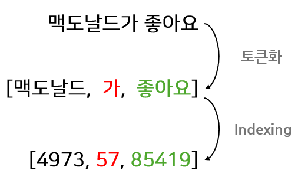
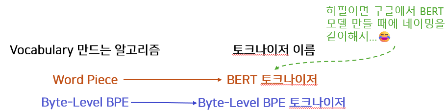
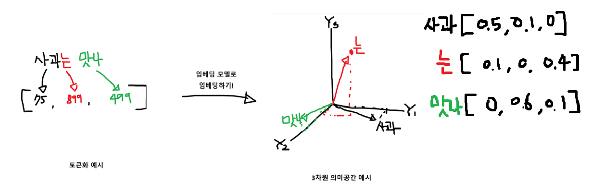
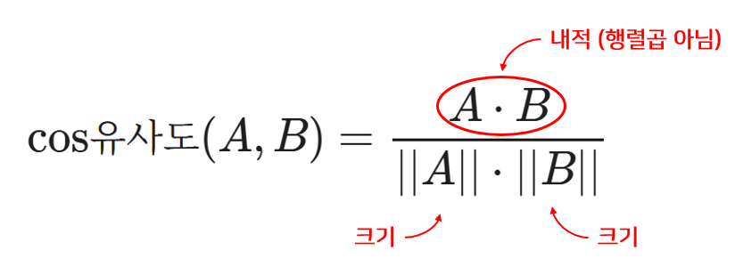

# 토큰화와 임베딩부터 Seq2Seq·Attention·Transformer까지

- 🎯 글의 목표: 문장을 모델 입력으로 바꾸는 전처리의 핵심인 **토큰화와 임베딩**을 출발점으로 삼아, 왜 RNN·LSTM·Attention·Transformer 구조가 등장했는지까지 하나의 흐름으로 정리한다.
- 🧩 핵심 키워드: Tokenizer, Vocabulary, BPE, Byte-Level BPE, Embedding, Pooling, RNN, Seq2Seq, LSTM, Attention, Hugging Face, Encoder-only, Decoder-only, Position Embedding, Cosine Similarity
- ⭐ 중요도: 상
- 📝 한눈에 보는 내용: 텍스트는 바로 모델에 넣을 수 없다. 먼저 토큰으로 나누고, 각 토큰을 숫자 ID로 바꾸고, 다시 의미를 담은 벡터로 바꿔야 한다. 그다음 순서를 읽는 모델(RNN/LSTM)과 중요한 부분을 골라보는 장치(Attention), 그리고 이를 더 크게 확장한 Transformer 구조로 이어진다.
- 🔗 관련 문제 / 주제(있다면): 서브워드 토크나이징, 임베딩 벡터 비교, Seq2Seq 번역 구조, Hugging Face 실습, 최신 임베딩 모델 활용

---

## 1. 들어가며

이번 강의 묶음은 겉으로 보면 `토크나이저`, `임베딩`, `RNN`, `Attention`, `Hugging Face`, `Transformer 아키텍처`처럼 여러 주제가 나뉘어 있는 것처럼 보인다. 그런데 실제로는 모두 같은 질문에 답하는 과정이라고 볼 수 있다.

> **컴퓨터는 문장을 어떻게 읽고, 그 안의 의미와 순서를 어떻게 이해하게 될까?**

텍스트는 사람에게는 자연스럽지만, 모델에게는 바로 처리할 수 없는 비정형 데이터다. 신경망은 결국 숫자 텐서만 다룬다. 그래서 문장을 잘게 나누고, 숫자로 바꾸고, 의미가 담긴 벡터 공간으로 옮긴 뒤, 그 벡터들의 관계를 읽는 구조가 필요하다. 이 흐름을 이해하지 못하면 토크나이저는 그저 “문장 자르는 도구”, 임베딩은 “숫자 벡터 만드는 층”, Transformer는 “그냥 성능 좋은 모델”처럼 따로따로 외워지기 쉽다.

이번 정리에서는 이 과정을 한 줄기로 묶어 보려고 한다. 먼저 토큰화가 왜 필요한지부터 잡고, BPE 같은 서브워드 토크나이저가 어떻게 동작하는지 살펴본다. 그 다음에는 임베딩이 왜 필요한지, 그리고 순차 모델이 어떻게 문맥을 읽는지 이어서 본다. 마지막에는 Hugging Face 실습과 Transformer 아키텍처 분류까지 연결해서, 실제 모델을 사용할 때 무엇을 떠올려야 하는지까지 정리한다.

---

## 2. 핵심 개념 정리

이 강의의 큰 흐름은 아래처럼 잡아두면 이해가 훨씬 쉽다.

1. **토큰화(Tokenization)**  
   문장을 모델이 다룰 수 있는 작은 단위로 나눈다. 이 단위는 글자일 수도 있고, 단어일 수도 있고, 서브워드일 수도 있다.

2. **정수 ID 변환(Indexing)**  
   토큰을 그대로 쓰는 것이 아니라, 미리 준비된 Vocabulary의 인덱스로 바꾼다.

3. **임베딩(Embedding)**  
   토큰 ID를 바로 쓰지 않고, 의미를 담은 밀집 벡터로 바꾼다. 이 단계가 있어야 비슷한 의미의 단어가 비슷한 방향을 갖도록 학습할 수 있다.

4. **순차 문맥 처리(RNN / LSTM / Seq2Seq)**  
   토큰 벡터를 순서대로 읽으며, 앞에서 본 내용을 은닉 상태에 누적한다. 여기서 “문장의 순서”를 본격적으로 다루기 시작한다.

5. **Attention**  
   긴 문장에서 중요한 부분을 한 번에 다 기억하기 어렵기 때문에, 필요한 시점에 입력의 관련 부분을 다시 참조한다.

6. **Transformer와 아키텍처 분화**  
   Attention을 중심으로 모델 구조가 확장되면서, 입력 이해에 강한 Encoder-only, 생성에 강한 Decoder-only, 입력과 출력이 모두 필요한 Encoder-Decoder 구조가 정착했다.

7. **실전 활용(Hugging Face / 최신 토크나이저 / 임베딩 모델)**  
   이론을 직접 구현하는 것만으로 끝나지 않고, 실제로는 사전학습된 토크나이저와 모델을 불러와 빠르게 활용하는 방식이 많이 쓰인다.

쉽게 말하면, 이 강의는 **“문장을 잘게 자르는 법”에서 시작해서, “그 문장을 의미 있는 벡터로 바꾸고”, 마지막에는 “그 벡터들 사이의 관계를 읽는 법”까지 올라가는 과정**이다.

---

## 3. 본문 정리

### 3.1 토크나이저란 무엇인가

토크나이저는 텍스트를 모델이 처리할 수 있는 단위로 나누고, 그 결과를 정수 ID로 바꿔주는 도구다.

처음 보면 단순히 문자열을 쪼개는 작업처럼 보이지만, 여기서 중요한 점은 단순 분할이 아니라 **모델이 반복해서 사용할 수 있는 사전 체계(Vocabulary)를 만든다**는 데 있다. 같은 문장이라도 어떤 토큰 단위를 선택하느냐에 따라 모델이 보는 입력 구조가 완전히 달라진다.

문장을 그냥 통째로 숫자 하나로 바꿀 수는 없다. 가능한 문장이 사실상 무한대이기 때문이다. 그래서 문장을 더 작은 단위로 나누고, 자주 등장하는 단위를 중심으로 사전을 만든다.



위 그림처럼, 모델은 결국 문장을 바로 이해하는 것이 아니라 **토큰 → ID → 계산 가능한 입력**의 단계로 접근한다. 여기서 토큰 단위를 어떻게 잡느냐가 성능과 일반화에 직접 영향을 준다.

예를 들어 `"안녕하세요"`를 하나의 토큰으로만 처리하면, 처음 보는 변형 표현이나 오탈자에 매우 약해질 수 있다. 반대로 너무 잘게 나누면 의미 단위가 너무 작아져 문맥 파악이 어려워진다. 그래서 실제 NLP에서는 **단어와 글자의 중간쯤 되는 서브워드(subword)**가 자주 쓰인다.

💡 포인트:  
토크나이저는 단순 전처리 도구가 아니라, **모델이 세상을 어떤 언어 단위로 바라볼지 정하는 첫 관문**이다.

⚠️ 주의:  
토큰화와 인덱싱을 같은 것으로 생각하기 쉽다. 하지만 토큰화는 “무엇으로 나눌지”에 가깝고, 인덱싱은 “나눈 결과를 어떤 번호와 연결할지”에 가깝다.

📌 핵심: 토크나이저는 문장을 자르는 도구이면서 동시에, 모델 입력의 기준 사전을 결정하는 장치다.

---

### 3.2 Vocabulary와 OOV 문제

Vocabulary는 토크나이저가 알고 있는 토큰 목록이다. 각 토큰은 고유한 정수 ID와 연결된다.

여기서 자주 부딪히는 문제가 **OOV(Out Of Vocabulary)**, 즉 사전에 없는 단어 문제다. 단어 단위 토크나이저만 쓰면, 학습 때 보지 못한 단어가 들어왔을 때 `[UNK]` 같은 미지 토큰으로 처리되는 경우가 많다. 이 경우, 낯선 단어가 가진 내부 구조를 거의 활용하지 못한다.

예를 들어 새로운 고유명사나 오타가 들어오면, 모델은 그것을 통째로 모르는 토큰으로 보게 된다. 그런데 서브워드 단위라면 `맥도날드`, `McDonald's`, 낯선 합성어, 신조어도 더 작은 조각으로 나눠 어느 정도 의미를 이어 받을 수 있다.

강의 실습에서는 BERT 토크나이저를 불러와 낯선 문자열을 토큰화하며 `[UNK]`가 생기는지 확인하는 예제가 등장한다. 이 실습의 핵심은 단순히 토큰 결과를 보는 것이 아니라, **왜 더 세밀한 토크나이저 학습이 필요한지**를 체감하는 데 있다.

```python
from transformers import BertTokenizer

# 사전학습된 WordPiece 토크나이저 로드
tokenizer = BertTokenizer.from_pretrained("bert-base-uncased")

# 일부러 낯선 문자열을 넣어 OOV 상황을 관찰
text = "놔뉸 쏴쁴 컄첌앺늬돠"
tokens = tokenizer.tokenize(text)

print(tokens)  # 사전에 없는 단위가 많으면 [UNK]가 보일 수 있다.
```

이 코드는 아주 짧지만 중요한 메시지를 담고 있다.  
토크나이저의 성능은 “문장을 예쁘게 자르는가”만이 아니라, **처음 보는 문자열을 얼마나 덜 망가지게 분해할 수 있는가**와도 연결된다.

⚠️ 주의:  
`[UNK]`가 나온다고 해서 항상 나쁜 것은 아니다. 다만 `[UNK]`가 너무 자주 나오면 모델이 세부 정보를 잃어버리기 쉽다.

📌 핵심: Vocabulary는 토큰과 ID의 대응표이고, 서브워드 토크나이징은 OOV 문제를 줄이기 위해 등장했다.

---

### 3.3 BPE는 왜 필요한가

BPE(Byte Pair Encoding)는 가장 자주 등장하는 인접 심볼 쌍을 반복적으로 합치면서 서브워드 단위를 만들어가는 알고리즘이다.

처음에는 문자 단위처럼 아주 작은 조각에서 시작한다. 그리고 데이터에서 자주 붙어 다니는 쌍을 계속 합치다 보면, 자주 등장하는 부분 문자열이 하나의 토큰으로 성장한다. 이렇게 하면 너무 큰 단어 사전을 만들지 않으면서도, 자주 쓰이는 표현을 효과적으로 담을 수 있다.

쉽게 말하면, BPE는 **“처음엔 잘게 쪼개 두고, 자주 같이 나타나는 조합만 조금씩 합쳐 가는 방식”**이다. 그래서 완전히 새로운 단어가 나와도 문자 수준까지는 복원 가능하고, 자주 등장하는 단어는 더 큰 단위로 빠르게 처리할 수 있다.



위 흐름은 토크나이저가 “정답 사전”을 하늘에서 받아오는 것이 아니라, **데이터를 보고 사전을 점점 학습해 간다**는 점을 보여준다.

#### BPE의 핵심 코드 1: 인접 쌍의 빈도 세기

```python
def get_stats(vocab):
    pairs = {}

    # vocab은 "심볼이 공백으로 분리된 문자열" -> "빈도수" 형태라고 가정한다.
    for word, freq in vocab.items():
        symbols = word.split()

        # 인접한 두 심볼을 하나의 쌍으로 보며 빈도를 누적한다.
        for i in range(len(symbols) - 1):
            pair = (symbols[i], symbols[i + 1])
            pairs[pair] = pairs.get(pair, 0) + freq

    return pairs


# 예시 vocab
vocab = {
    "l o w </w>": 5,
    "l o w e r </w>": 2,
    "n e w </w>": 6,
}

stats = get_stats(vocab)
for pair, freq in sorted(stats.items(), key=lambda x: -x[1])[:3]:
    print(pair, freq)
```

이 함수는 BPE의 출발점이다. 어떤 쌍이 자주 함께 등장하는지 세지 못하면, 무엇을 합쳐야 할지 결정할 수 없다.

#### BPE의 핵심 코드 2: 가장 자주 나온 쌍 병합하기

```python
import re

def merge_vocab(pair, vocab):
    new_vocab = {}

    # ('l', 'o') 같은 pair를 정규식으로 안전하게 처리하기 위한 준비
    bigram = re.escape(" ".join(pair))
    pattern = re.compile(r"(?<!\S)" + bigram + r"(?!\S)")

    for word, freq in vocab.items():
        # 공백으로 떨어져 있는 두 토큰만 정확히 붙인다.
        new_word = pattern.sub("".join(pair), word)
        new_vocab[new_word] = freq

    return new_vocab


vocab = {
    "l o w </w>": 5,
    "l o w e r </w>": 2,
    "n e w </w>": 6,
}

for step in range(5):
    pairs = get_stats(vocab)
    best = max(pairs, key=pairs.get)  # 가장 자주 등장한 쌍 선택
    vocab = merge_vocab(best, vocab)

    print(f"Merge {step + 1}: {best[0]} + {best[1]} -> {''.join(best)}")
    print(vocab)
```

이 코드는 BPE의 전체 감각을 잘 보여준다.  
**빈도 계산 → 가장 흔한 쌍 선택 → 병합 → 다시 빈도 계산**이 반복된다.

💡 포인트:  
BPE는 단어 전체를 외우는 방식과 문자만 보는 방식의 중간에 있다. 그래서 표현력과 일반화 사이의 균형을 잡기 좋다.

⚠️ 주의:  
BPE 구현에서 가장 흔한 실수는 “인접 토큰 쌍만 병합해야 하는데 문자열 일부까지 엉뚱하게 합쳐 버리는 것”이다. 그래서 정규식 경계 처리(`(?<!\S)`, `(?!\S)`)가 중요하다.

📌 핵심: BPE는 자주 함께 나오는 심볼 쌍을 합치며, 작은 단위에서 출발해 실용적인 서브워드 사전을 학습한다.

---

### 3.4 WordPiece와 Byte-Level BPE, 그리고 최신 토크나이저

강의 자료에는 BERT 계열 토크나이저와 GPT 계열 Byte-Level BPE 토크나이저가 함께 등장한다. 둘 다 서브워드 토크나이저지만, 처리 단위와 실제 활용 방식에서 차이가 있다.

- **WordPiece**: BERT 계열에서 많이 쓰이며, 자주 등장하는 서브워드를 중심으로 토큰을 구성한다.
- **Byte-Level BPE**: 문자보다 더 아래인 바이트 단위에서 출발하기 때문에, 낯선 문자나 특수 기호에도 강하고 다양한 입력을 안정적으로 처리할 수 있다.

최근 LLM 쪽에서는 Byte-Level BPE나 그에 가까운 토크나이저 설계가 많이 쓰인다. 강의의 easy 노트에서는 Hugging Face에서 모델 저장소를 직접 열어 보고, `tokenizer.json`, `tokenizer_config.json` 같은 파일을 다운로드한 뒤 로컬 폴더에서 토크나이저를 불러오는 흐름까지 이어진다. 이 부분이 중요한 이유는, 토크나이저가 단순 라이브러리 함수가 아니라 **실제 모델과 함께 배포되는 자산**이라는 점을 보여주기 때문이다.

```python
from transformers import AutoTokenizer

# 허깅페이스에서 받은 토크나이저 파일이 들어 있는 로컬 폴더를 사용
tokenizer = AutoTokenizer.from_pretrained("./tokenizer_deepseek")

korean = "저는 맥도날드에 다녀왔어요."
english = "I went to McDonald's."

tokens_kor = tokenizer.tokenize(korean)
tokens_eng = tokenizer.tokenize(english)

ids_kor = tokenizer.convert_tokens_to_ids(tokens_kor)
ids_eng = tokenizer.convert_tokens_to_ids(tokens_eng)

print("[한글]")
print(tokens_kor)
print(ids_kor)

print("[영어]")
print(tokens_eng)
print(ids_eng)
```

이 예제를 보면 같은 토크나이저가 한국어와 영어를 모두 어떻게 자르는지 비교할 수 있다. 중요한 건 “잘게 잘렸는가”보다, **모델이 기대하는 방식으로 일관되게 잘렸는가**다.

💡 포인트:  
모델과 토크나이저는 짝이다. 모델만 바꾸고 토크나이저를 아무거나 쓰면 입력 표현이 어긋날 수 있다.

⚠️ 주의:  
`AutoTokenizer.from_pretrained()`에서 모델 이름 또는 폴더 경로를 잘못 지정하면, 토크나이저 파일은 있어도 필요한 설정 파일이 부족해 로딩 오류가 날 수 있다.

📌 핵심: 최신 모델에서는 토크나이저도 모델의 일부처럼 함께 관리해야 하며, WordPiece와 Byte-Level BPE의 차이를 감으로 익혀 두는 것이 좋다.

---

### 3.5 임베딩은 왜 필요한가

토큰 ID만으로는 의미를 충분히 표현하기 어렵다. 12번 토큰과 13번 토큰이 숫자로 가깝다고 해서 의미가 비슷한 것은 아니기 때문이다. 그래서 토큰 ID를 그대로 쓰지 않고, **학습 가능한 실수 벡터**로 바꾼다. 이것이 임베딩이다.

임베딩의 핵심은 “번호표”를 “의미 좌표”로 바꾸는 것이다. 비슷한 의미의 단어가 비슷한 방향의 벡터를 갖도록 학습되면, 모델은 표면 형태가 조금 달라도 비슷한 패턴으로 이해할 수 있다.



위 그림이 잘 보여주듯, 토큰화는 입력을 나누는 단계이고, 임베딩은 그 조각들을 **의미 공간으로 옮기는 단계**다. 이 둘을 같은 것으로 보면 안 된다.

#### 가장 기본적인 임베딩 층

```python
import torch
import torch.nn as nn

# 100개의 토큰을 다룰 수 있고,
# 각 토큰을 256차원 벡터로 바꾸는 임베딩 테이블
embedding = nn.Embedding(num_embeddings=100, embedding_dim=256)

# 예시 입력: 토큰 ID 3개
x = torch.LongTensor([1, 5, 3])

# 각 ID가 대응되는 임베딩 벡터를 조회
embedded = embedding(x)

print(f"입력 shape: {x.shape}")          # torch.Size([3])
print(f"임베딩 shape: {embedded.shape}") # torch.Size([3, 256])
```

여기서 중요한 점은, 임베딩이 단순 계산식이라기보다 **룩업 테이블**처럼 동작한다는 것이다. ID를 넣으면 그 ID에 해당하는 벡터를 꺼낸다. 하지만 이 테이블의 값 자체는 학습을 통해 업데이트된다.

⚠️ 주의:  
임베딩 입력은 보통 정수형(LongTensor)이어야 한다. 실수형 텐서를 넣으면 에러가 나기 쉽다.

📌 핵심: 임베딩은 토큰 번호를 의미가 담긴 밀집 벡터로 바꾸는 학습 가능한 변환이다.

---

### 3.6 문장 벡터가 필요할 때: Pooling과 코사인 유사도

토큰 임베딩만 얻었다고 끝은 아니다. 어떤 작업에서는 단어별 벡터가 아니라 **문장 전체를 대표하는 하나의 벡터**가 필요하다. 이때 자주 사용하는 것이 Pooling이다.

가장 쉬운 방식은 **Mean Pooling**이다. 문장을 구성하는 각 토큰 벡터를 평균 내서 하나의 문장 벡터로 만든다. 강의에서는 “여러 개 벡터를 하나로 합체하는 과정”으로 설명하고 있는데, 이 비유가 꽤 직관적이다.

```python
from transformers import AutoTokenizer, AutoModel
import torch

words = ["cat", "dog", "tiger", "lion"]

tokenizer = AutoTokenizer.from_pretrained("intfloat/e5-small-v2")
model = AutoModel.from_pretrained("intfloat/e5-small-v2")

tokens = tokenizer(words, padding=True, return_tensors="pt")

with torch.no_grad():
    outputs = model(**tokens)

    # 각 토큰의 임베딩(last_hidden_state)을 평균 내어
    # 문장/단어 단위 표현으로 압축
    embeddings = outputs.last_hidden_state.mean(dim=1)

print(embeddings.shape)
```

이렇게 얻은 벡터들은 서로 유사도를 비교할 수 있다. 이때 자주 쓰는 지표가 **코사인 유사도(Cosine Similarity)**다. 임베딩에서는 절대적인 좌표값보다 벡터의 방향이 더 중요하다고 보는 경우가 많기 때문이다.



코사인 유사도는 두 벡터의 방향이 얼마나 비슷한지를 본다. 방향만 비교하려면 먼저 벡터 길이를 1로 맞추는 **L2 정규화**를 자주 적용한다.

```python
import torch.nn.functional as F

# L2 정규화: 벡터 길이를 1로 맞춘다.
embeddings = embeddings / embeddings.norm(dim=1, keepdim=True)

pairs = [("cat", "dog"), ("cat", "tiger")]

# 예시용 인덱스
word_to_id = {word: idx for idx, word in enumerate(words)}

for a, b in pairs:
    vec_a = embeddings[word_to_id[a]]
    vec_b = embeddings[word_to_id[b]]

    similarity = F.cosine_similarity(vec_a.unsqueeze(0), vec_b.unsqueeze(0))
    print(a, b, similarity.item())
```

💡 포인트:  
토큰 임베딩은 단어 수준 표현이고, pooling을 거치면 문장 수준 표현으로 압축할 수 있다.

⚠️ 주의:  
`mean(dim=1)`을 무조건 쓰면 패딩 토큰까지 평균에 섞이는 문제가 생길 수 있다. 실제 서비스에서는 attention mask를 고려한 pooling이 더 안전하다.

📌 핵심: 임베딩 벡터는 pooling으로 문장 표현으로 압축할 수 있고, 이 표현은 코사인 유사도로 비교하는 경우가 많다.

---

### 3.7 RNN은 문장의 순서를 어떻게 읽는가

토큰을 벡터로 바꿨다고 해서 문장의 순서가 자동으로 반영되는 것은 아니다. `"나는 밥을 먹었다"`와 `"밥을 나는 먹었다"`는 비슷한 토큰을 쓰더라도 순서가 다르다. 그래서 순서를 따라 읽는 구조가 필요하고, 그 대표적인 초기 모델이 RNN이다.

RNN은 현재 입력과 이전 은닉 상태를 함께 사용해 새로운 은닉 상태를 만든다. 즉, **지금 읽는 단어와 지금까지 읽은 기억을 합쳐 다음 상태를 만든다**는 구조다.

\[
h_t = \tanh(W_{xh} x_t + W_{hh} h_{t-1} + b)
\]

이 수식에서 핵심은 `h_(t-1)`이 다음 시점으로 넘어간다는 점이다. 그래서 같은 단어라도 앞 문맥이 다르면 다른 상태가 나올 수 있다.

```python
import torch
import torch.nn as nn

# 먼저 토큰을 벡터로 바꾼다.
embedding = nn.Embedding(num_embeddings=100, embedding_dim=256)
x = torch.LongTensor([1, 5, 3])
embedded = embedding(x)

# RNN은 보통 (batch, seq_len, embed_dim) 형태의 입력을 받는다.
rnn = nn.RNN(input_size=256, hidden_size=512, num_layers=1, batch_first=True)

# 현재 예시는 배치가 1개뿐이므로 차원을 하나 추가한다.
input_seq = embedded.unsqueeze(0)  # (1, 3, 256)

output, hidden = rnn(input_seq)

print(output.shape)  # 모든 시점의 출력
print(hidden.shape)  # 마지막 은닉 상태
```

여기서 `output`은 각 시점의 출력을 모두 담고 있고, `hidden`은 마지막 시점의 요약 상태에 가깝다. 번역이나 요약처럼 “입력 문장을 읽고 하나의 요약 벡터로 넘기고 싶을 때”는 마지막 hidden state를 많이 사용한다.

⚠️ 주의:  
RNN 입력 차원을 자주 헷갈린다. `batch_first=True`면 `(batch, seq_len, feature)` 순서다. 이 설정을 바꾸면 차원 해석이 달라진다.

📌 핵심: RNN은 현재 입력과 이전 기억을 합치며, 문장의 순서를 반영한 상태를 시점별로 만든다.

---

### 3.8 Seq2Seq는 입력 문장을 어떻게 출력 문장으로 바꾸는가

Seq2Seq는 말 그대로 하나의 시퀀스를 다른 시퀀스로 바꾸는 구조다. 대표적으로 기계 번역에서 많이 등장한다. 입력 문장을 인코더가 읽고, 디코더가 그 내용을 바탕으로 출력 문장을 한 토큰씩 생성한다.

처음 배울 때 막히는 지점은, 인코더와 디코더가 단순히 이어 붙은 것이 아니라는 점이다. 인코더는 입력을 읽어 **컨텍스트 벡터**를 만들고, 디코더는 이 벡터를 기반으로 출력을 시작한다.

#### Encoder 구현

```python
import torch
import torch.nn as nn

class Encoder(nn.Module):
    def __init__(self, vocab_size, embed_dim, hidden_dim):
        super().__init__()

        # 입력 토큰 ID를 임베딩 벡터로 변환
        self.embedding = nn.Embedding(vocab_size, embed_dim)

        # 임베딩 시퀀스를 순차적으로 읽는 RNN
        self.rnn = nn.RNN(embed_dim, hidden_dim, batch_first=True)

    def forward(self, x):
        # x: (batch, seq_len)
        embedded = self.embedding(x)         # (batch, seq_len, embed_dim)
        output, hidden = self.rnn(embedded)  # hidden: (1, batch, hidden_dim)

        # 마지막 은닉 상태를 문장 요약 벡터처럼 사용
        return hidden


encoder = Encoder(vocab_size=100, embed_dim=256, hidden_dim=512)
source = torch.LongTensor([[1, 5, 3, 7]])
context = encoder(source)

print(context.shape)
```

#### Decoder 구현

```python
class Decoder(nn.Module):
    def __init__(self, vocab_size, embed_dim, hidden_dim):
        super().__init__()

        self.embedding = nn.Embedding(vocab_size, embed_dim)
        self.rnn = nn.RNN(embed_dim, hidden_dim, batch_first=True)

        # RNN 출력(hidden_dim)을 다시 어휘 분포(vocab_size)로 투영
        self.fc = nn.Linear(hidden_dim, vocab_size)

    def forward(self, x, hidden):
        # x: (batch, 1) 현재 시점 입력 토큰
        embedded = self.embedding(x)               # (batch, 1, embed_dim)
        output, hidden = self.rnn(embedded, hidden)
        prediction = self.fc(output)               # (batch, 1, vocab_size)
        return prediction, hidden


decoder = Decoder(vocab_size=100, embed_dim=256, hidden_dim=512)
target = torch.LongTensor([[2]])  # 시작 토큰
pred, new_hidden = decoder(target, context)

print(pred.shape)
```

이 구조를 보면, 디코더는 한 번에 전체 문장을 내놓는 것이 아니라 **시작 토큰부터 출발해 한 토큰씩 예측**한다는 점을 알 수 있다.

⚠️ 주의:  
Seq2Seq 초반 구현에서 흔한 실수는 인코더의 hidden shape와 디코더가 기대하는 hidden shape를 맞추지 못하는 것이다. 층 수, batch 차원, hidden dim이 모두 맞아야 한다.

📌 핵심: Seq2Seq는 인코더가 입력을 압축하고, 디코더가 그 압축된 정보를 바탕으로 출력을 한 단계씩 생성하는 구조다.

---

### 3.9 RNN의 한계와 LSTM의 등장

RNN은 순서를 읽는다는 점에서 큰 진전이었지만, 긴 문장을 처리할 때는 앞부분 정보를 오래 유지하기 어려웠다. 이른바 **기울기 소실(Vanishing Gradient)** 문제가 생기기 때문이다.

문장이 길어질수록 과거 정보가 점점 희미해지고, 중요한 단서가 뒤쪽 계산에 충분히 전달되지 않는다. 그래서 장기 의존성을 더 잘 다루기 위해 **LSTM(Long Short-Term Memory)**이 등장했다.

LSTM은 은닉 상태 외에도 **셀 상태(cell state)**를 두고, 입력 게이트·망각 게이트·출력 게이트를 통해 어떤 정보를 넣고, 버리고, 꺼낼지 조절한다. 그래서 “무조건 다 기억”이 아니라, **기억할 것과 잊을 것을 나눠 관리**한다는 감각이 중요하다.

```python
import torch
import torch.nn as nn

lstm = nn.LSTM(
    input_size=256,
    hidden_size=512,
    num_layers=2,
    batch_first=True,
    dropout=0.3
)

embedded = torch.randn(4, 10, 256)  # (batch=4, seq=10, embed=256)
output, (hidden, cell) = lstm(embedded)

print(output.shape)  # 모든 시점의 출력
print(hidden.shape)  # 마지막 은닉 상태
print(cell.shape)    # 마지막 셀 상태
```

RNN과 비교해 LSTM은 상태가 하나 더 있다는 점에서 헷갈릴 수 있다. 하지만 오히려 이 셀 상태 덕분에 긴 문장에서 중요한 흐름을 더 오래 유지할 수 있다.

💡 포인트:  
RNN이 “지나간 기억이 계속 희미해지는 구조”라면, LSTM은 “기억을 관리할 수 있게 만든 구조”라고 볼 수 있다.

⚠️ 주의:  
LSTM 출력은 `output, (hidden, cell)` 형태다. RNN처럼 `output, hidden`만 받는다고 생각하면 unpacking에서 바로 오류가 난다.

📌 핵심: LSTM은 게이트와 셀 상태를 이용해, 긴 시퀀스의 중요한 정보를 더 안정적으로 유지하려고 만든 구조다.

---

### 3.10 Attention은 왜 필요한가

LSTM이 RNN보다 낫다고 해도, 입력 전체를 하나의 컨텍스트 벡터로만 압축하는 방식은 여전히 한계가 있다. 긴 문장을 통째로 하나의 요약 벡터에 집어넣으면 정보가 병목처럼 눌릴 수 있기 때문이다.

이 문제를 해결하기 위해 등장한 것이 **Attention**이다. 디코더가 출력 토큰을 생성할 때, 입력 전체를 다시 훑으면서 **지금 필요한 부분에 더 집중**할 수 있도록 만든다.

쉽게 말하면, Attention은 “입력 문장을 통째로 한 번 요약해서 끝내는 것”이 아니라, **출력할 때마다 입력의 어느 부분을 볼지 다시 결정하는 방식**이다.

#### Attention score, weight, context vector 계산

```python
import torch

encoder_outputs = torch.randn(1, 5, 512)  # (batch, src_len, hidden)
decoder_output = torch.randn(1, 1, 512)   # (batch, 1, hidden)

# 1) 현재 디코더 상태와 인코더 출력들의 관련성을 점수로 계산
scores = torch.bmm(decoder_output, encoder_outputs.transpose(1, 2))
# shape: (batch, 1, src_len)

# 2) 점수를 softmax로 정규화해 attention weight로 바꿈
attn_weights = torch.softmax(scores, dim=-1)

# 3) 가중합으로 context vector 생성
context = torch.bmm(attn_weights, encoder_outputs)
# shape: (batch, 1, hidden)

print(scores.shape)
print(attn_weights.shape)
print(context.shape)
```

이 계산의 의미는 아주 중요하다.

- `score`: 지금 출력하려는 시점에서 입력의 각 위치가 얼마나 관련 있는가
- `weight`: 그 관련성을 확률처럼 정규화한 값
- `context`: 관련성이 높은 입력 위치에 더 큰 비중을 준 요약 벡터

#### Luong Attention 구현

```python
import torch
import torch.nn as nn

class LuongAttention(nn.Module):
    def __init__(self, hidden_dim):
        super().__init__()
        self.hidden_dim = hidden_dim

    def forward(self, decoder_output, encoder_outputs):
        # decoder_output: (batch, 1, hidden)
        # encoder_outputs: (batch, src_len, hidden)

        # 현재 디코더 상태와 각 인코더 시점의 유사도를 계산
        scores = torch.bmm(decoder_output, encoder_outputs.transpose(1, 2))

        # 입력의 어느 위치를 더 볼지 확률처럼 바꿈
        attn_weights = torch.softmax(scores, dim=-1)

        # 관련성이 높은 위치를 더 크게 반영한 컨텍스트 벡터
        context = torch.bmm(attn_weights, encoder_outputs)

        return context, attn_weights
```

#### Attention을 붙인 Decoder

```python
class AttentionDecoder(nn.Module):
    def __init__(self, vocab_size, embed_dim, hidden_dim):
        super().__init__()

        self.embedding = nn.Embedding(vocab_size, embed_dim)
        self.lstm = nn.LSTM(embed_dim, hidden_dim, batch_first=True)
        self.attention = LuongAttention(hidden_dim)

        # 디코더 출력 + 컨텍스트 벡터를 합쳐 다음 토큰 분포 생성
        self.fc = nn.Linear(hidden_dim * 2, vocab_size)

    def forward(self, x, hidden, cell, encoder_outputs):
        embedded = self.embedding(x)                         # (batch, 1, embed)
        dec_out, (hidden, cell) = self.lstm(embedded, (hidden, cell))

        context, attn_weights = self.attention(dec_out, encoder_outputs)

        # 현재 시점 출력과 문맥 요약을 합쳐 더 풍부한 표현으로 만듦
        combined = torch.cat([dec_out, context], dim=-1)    # (batch, 1, hidden*2)
        prediction = self.fc(combined)                      # (batch, 1, vocab_size)

        return prediction, hidden, cell, attn_weights
```

⚠️ 주의:  
Attention 구현에서 가장 많이 틀리는 부분은 텐서 차원이다. 특히 `torch.bmm()`는 `(batch, n, m)`과 `(batch, m, p)` 형태여야 하므로 transpose 위치를 자주 점검해야 한다.

📌 핵심: Attention은 출력 시점마다 입력의 관련 부분을 다시 참조하게 해, 긴 문장에서 정보 병목을 줄여 준다.

---

### 3.11 Hugging Face를 통해 사전학습 모델 활용하기

강의 후반부에서 Hugging Face 라이브러리가 등장하는 이유는 분명하다. 이론을 이해한 뒤, 실제로는 이미 잘 학습된 토크나이저와 모델을 불러와 빠르게 실험하는 경우가 훨씬 많기 때문이다.

#### AutoTokenizer: 모델에 맞는 토크나이저 불러오기

```python
from transformers import AutoTokenizer

tokenizer = AutoTokenizer.from_pretrained("bert-base-uncased")

encoded = tokenizer("Hello, world!", return_tensors="pt")

print(encoded["input_ids"])
print(encoded["attention_mask"])
print(tokenizer.convert_ids_to_tokens(encoded["input_ids"][0]))

decoded = tokenizer.decode(encoded["input_ids"][0])
print(decoded)
```

여기서는 토큰화, 인덱싱, 마스크 생성, 디코딩까지 한 번에 이어진다. 즉, 앞에서 배운 개념들이 실제 라이브러리 안에서 어떻게 합쳐져 있는지 보여주는 예제다.

#### AutoModel / 분류 모델 사용

```python
from transformers import AutoModelForSequenceClassification

model = AutoModelForSequenceClassification.from_pretrained(
    "bert-base-uncased",
    num_labels=3
)

print(type(model).__name__)
print(sum(p.numel() for p in model.parameters()))
```

이 코드를 보면 모델 내부 구조를 처음부터 직접 구현하지 않아도, 목적에 맞는 헤드가 붙은 모델을 바로 불러올 수 있다는 점을 알 수 있다.

#### pipeline API: 더 높은 수준의 추상화

```python
from transformers import pipeline

classifier = pipeline("sentiment-analysis")
result = classifier("I love this movie!")
print(result)

generator = pipeline("text-generation", model="gpt2")
text = generator("Once upon a time", max_length=30, num_return_sequences=1)
print(text[0]["generated_text"])
```

이 부분에서 중요한 것은 pipeline이 “마법”이라는 점이 아니라, **토크나이저 → 모델 입력 구성 → 추론 → 후처리**를 묶어주는 고수준 인터페이스라는 점이다. 내부 원리를 알고 쓰면 훨씬 안정적으로 활용할 수 있다.

⚠️ 주의:  
간단한 실습에서는 pipeline이 편하지만, 실제 서비스나 세밀한 디버깅에서는 tokenizer와 model을 직접 다루는 방식이 더 유리한 경우가 많다.

📌 핵심: Hugging Face는 사전학습 토크나이저와 모델을 표준화된 방식으로 불러와, 이론을 빠르게 실험으로 연결하게 해 준다.

---

### 3.12 Transformer 아키텍처는 어떻게 나뉘는가

Transformer는 Attention을 중심으로 한 구조지만, 실제 모델은 목적에 따라 크게 세 가지 흐름으로 나뉜다.

| 아키텍처 | 핵심 특징 | 대표 용도 |
|---|---|---|
| Encoder-only | 입력 전체를 양방향으로 읽음 | 분류, 검색, 문장 이해 |
| Decoder-only | 이전 토큰만 보고 다음 토큰 생성 | 문장 생성, 대화형 LLM |
| Encoder-Decoder | 입력을 읽고 출력 시퀀스를 생성 | 번역, 요약, 질의응답 |

이 구분은 단순 분류표가 아니라, **어떤 방향의 문맥을 보느냐**에 따라 모델의 성격이 달라진다는 점을 보여준다.

#### Encoder-only: BERT 계열

```python
from transformers import AutoModel, AutoTokenizer

tokenizer = AutoTokenizer.from_pretrained("bert-base-uncased")
model = AutoModel.from_pretrained("bert-base-uncased")

inputs = tokenizer("Hello, world!", return_tensors="pt")
outputs = model(**inputs)

print(outputs.last_hidden_state.shape)
```

BERT는 입력 전체를 양방향으로 읽으므로 문장 이해에 강하다. 감성 분류, 문장 분류, 토큰 분류 같은 과제에서 자주 사용된다.

#### Decoder-only: GPT 계열

```python
from transformers import AutoModelForCausalLM, AutoTokenizer

tokenizer = AutoTokenizer.from_pretrained("gpt2")
model = AutoModelForCausalLM.from_pretrained("gpt2")

inputs = tokenizer("The future of AI is", return_tensors="pt")
outputs = model.generate(inputs["input_ids"], max_length=20)

print(tokenizer.decode(outputs[0]))
```

GPT 계열은 이전 토큰만 보면서 다음 토큰을 생성하는 **causal language modeling** 구조다. 그래서 생성 작업에 강하다.

📌 핵심: Transformer는 하나의 구조라기보다, 입력 이해 중심인지 생성 중심인지에 따라 다른 방식으로 잘라 쓴 아키텍처의 가족이라고 보는 편이 정확하다.

---

### 3.13 Transformer 내부에서 꼭 잡아둘 구성 요소

Transformer를 겉으로만 보면 “Attention이 전부”처럼 느껴질 수 있다. 하지만 실제 블록을 이루는 핵심 구성요소는 몇 가지가 함께 움직인다.

#### 1) Layer Normalization

레이어 정규화는 각 토큰 표현의 스케일을 안정적으로 맞춰 학습을 더 잘 되게 돕는다.

```python
import torch
import torch.nn as nn

hidden_dim = 768
layer_norm = nn.LayerNorm(hidden_dim)

x = torch.randn(1, 5, hidden_dim)
output = layer_norm(x)

print(output.mean(dim=-1))
print(output.std(dim=-1))
```

#### 2) Residual Connection

입력을 그대로 더해 주는 잔차 연결은 깊은 네트워크에서도 정보와 기울기가 잘 흐르도록 돕는다.

강의 노트의 핵심 패턴은 아래 한 줄로 요약된다.

```python
x = x + self.attention(self.norm1(x))
x = x + self.mlp(self.norm2(x))
```

이 코드는 Transformer 블록의 감각을 아주 잘 보여 준다.  
정규화 후 연산을 하고, 원래 입력을 다시 더한다. 즉, **새로운 정보는 배우되 기존 정보의 흐름은 끊지 않는 구조**다.

#### 3) Position Embedding

Self-Attention만으로는 순서 정보가 자동으로 들어가지 않기 때문에, 토큰 임베딩에 위치 정보를 더해 준다.

```python
class TokenEmbedding(nn.Module):
    def __init__(self, vocab_size, hidden_dim, max_len=512):
        super().__init__()
        self.token_emb = nn.Embedding(vocab_size, hidden_dim)
        self.pos_emb = nn.Embedding(max_len, hidden_dim)

    def forward(self, x):
        # x: (batch, seq_len)
        positions = torch.arange(x.size(1), device=x.device)

        # 토큰 의미 + 위치 정보를 더해 순서를 반영
        return self.token_emb(x) + self.pos_emb(positions)
```

#### 4) Feed-Forward Network

Attention으로 토큰 간 관계를 본 뒤에는, 각 위치별로 비선형 변환을 한 번 더 거친다.

```python
class FeedForward(nn.Module):
    def __init__(self, hidden_dim, ff_dim):
        super().__init__()
        self.fc1 = nn.Linear(hidden_dim, ff_dim)
        self.fc2 = nn.Linear(ff_dim, hidden_dim)
        self.gelu = nn.GELU()

    def forward(self, x):
        return self.fc2(self.gelu(self.fc1(x)))
```

⚠️ 주의:  
Transformer를 공부할 때 Attention에만 집중하면, 실제 블록이 왜 안정적으로 학습되는지 놓치기 쉽다. LayerNorm, Residual, Position Embedding, FFN까지 함께 봐야 전체 구조가 보인다.

📌 핵심: Transformer 블록은 Attention 하나가 아니라, 정규화·잔차 연결·위치 정보·FFN이 함께 맞물리는 구조다.

---

### 3.14 최신 임베딩 모델 활용: E5와 Qwen3 예시

강의 자료에는 단순 토크나이저 실습을 넘어서, 실제 임베딩 모델을 사용해 유사도 비교를 해보는 예시도 포함되어 있다. 여기서 중요한 포인트는 임베딩 모델이 “그 자체로 정답을 내는 모델”이 아니라, **문장을 비교 가능한 벡터로 바꿔 주는 기반 모델**이라는 점이다.

예를 들어 `intfloat/e5-small-v2`는 비교적 가벼운 임베딩 모델로, 여러 단어를 벡터로 바꾸고 평균 풀링 후 유사도를 계산하는 실습에 잘 맞는다. 또 `Qwen/Qwen3-Embedding-0.6B`는 query/document 구분을 고려해 문장 검색이나 매칭 같은 작업에 더 실전적으로 활용할 수 있다.

```python
from sentence_transformers import SentenceTransformer
import torch

model = SentenceTransformer("Qwen/Qwen3-Embedding-0.6B")

queries = [
    "한국의 수도는?",
    "미국의 수도는?"
]

documents = [
    "베이징",
    "부산",
    "한국은 서울이 수도죠.",
    "워싱턴DC"
]

# query임을 명시하면 모델이 더 적절한 표현을 만들 수 있다.
query_embeddings = model.encode(queries, prompt_name="query")
document_embeddings = model.encode(documents)

similarity = model.similarity(query_embeddings, document_embeddings)
print(similarity)

max_index = torch.argmax(similarity, dim=1).tolist()
for i in range(len(queries)):
    print(f"{queries[i]} -> {documents[max_index[i]]}")
```

이 예제의 핵심은 “정답 라벨을 직접 예측한다”가 아니라, **질문과 문서를 같은 의미 공간에 올려 놓고 가장 가까운 것을 찾는다**는 데 있다. 검색, 추천, 분류의 많은 문제가 사실은 이런 유사도 비교 문제로 바뀔 수 있다.

📌 핵심: 최신 임베딩 모델은 문장을 벡터 공간에 배치해, 검색·분류·매칭을 유사도 비교 문제로 바꾸는 데 강하다.

---

## 4. 적용 관점에서 다시 보기

이제 본문에서 본 내용을 실제 문제풀이와 구현 관점에서 다시 묶어 보자.

### 4.1 어떤 상황에서 무엇을 떠올려야 하는가

- **처음 보는 단어, 신조어, 다국어, 특수문자가 많이 섞인 입력**  
  → 단어 단위보다 서브워드/Byte-Level 토크나이저를 먼저 떠올린다.

- **문장 전체 의미를 비교하거나 검색/유사도 문제를 풀어야 할 때**  
  → 임베딩 + pooling + cosine similarity 흐름을 떠올린다.

- **입력 순서 자체가 중요할 때**  
  → RNN/LSTM 같은 순차 처리 개념을 먼저 이해해야 한다.

- **긴 문장에서 특정 부분을 선택적으로 참고해야 할 때**  
  → Attention의 필요성을 떠올린다.

- **분류냐 생성이냐, 입력 이해냐 출력 생성이냐가 갈릴 때**  
  → Encoder-only / Decoder-only / Encoder-Decoder 구조를 구분해서 생각한다.

### 4.2 구현 순서를 어떻게 잡으면 좋은가

실습이나 프로젝트에서 텍스트 모델 파이프라인을 만들 때는 보통 아래 순서로 잡으면 흐름이 안정적이다.

1. 입력 문장을 어떤 단위로 자를지 정한다.  
2. 해당 모델과 맞는 토크나이저를 선택한다.  
3. 토큰을 ID로 바꾸고, 패딩/마스크를 포함한 배치를 구성한다.  
4. 임베딩 또는 사전학습 모델 출력을 얻는다.  
5. 필요한 경우 pooling으로 문장 표현을 만든다.  
6. 분류/검색/생성 목적에 맞는 헤드를 붙인다.  
7. 결과를 유사도, 분류 확률, 생성 텍스트 형태로 해석한다.

### 4.3 문제를 보면 어떤 신호를 포착해야 하는가

- **“사전에 없는 단어가 많다”** → OOV, 서브워드, BPE
- **“문장 벡터 하나로 비교하고 싶다”** → pooling
- **“긴 문장에서 앞부분 정보가 뒤로 갈수록 사라진다”** → RNN 한계, LSTM
- **“출력할 때 입력의 특정 위치를 봐야 한다”** → attention weights
- **“문장 이해와 생성의 목적이 다르다”** → 아키텍처 분화

### 4.4 실전에서 자주 하는 실수

- 토크나이저와 모델을 서로 다른 계열로 섞어 쓴다.
- 임베딩 벡터와 토큰 ID를 같은 정보처럼 생각한다.
- pooling 시 패딩 토큰을 무시하지 않아 문장 표현이 흐려진다.
- RNN/LSTM의 입력 shape를 `batch_first` 설정과 다르게 넣는다.
- attention 계산에서 transpose 축을 잘못 잡아 차원 오류를 낸다.
- Hugging Face pipeline의 편리함만 기억하고 내부 입력 구조를 놓친다.

---

## 5. 배운 점 / 느낀 점 / 확장 포인트

이번 강의 묶음을 통해 가장 크게 배울 수 있는 점은, 텍스트 처리가 결코 한 단계짜리 작업이 아니라는 사실이다. 문장을 자르는 것과 의미를 담는 것, 순서를 반영하는 것과 필요한 부분을 다시 참조하는 것은 서로 다른 문제이고, 모델 구조는 바로 그 문제들을 하나씩 해결해 온 결과다.

토크나이저를 이해하면 왜 최신 모델이 특정 토큰화 방식을 고르는지 보이기 시작하고, 임베딩을 이해하면 왜 검색과 추천 문제를 벡터 유사도로 풀 수 있는지 감이 온다. 또 RNN과 LSTM, Attention 흐름을 따라가면 Transformer가 단순히 “유행하는 구조”가 아니라 이전 모델의 한계를 넘기 위해 등장했다는 것도 자연스럽게 이해된다.

확장 포인트도 분명하다.

- BPE 외에 SentencePiece, Unigram 같은 토크나이저 학습 방식 비교
- Mean Pooling 외에 CLS 토큰, max pooling, attention pooling 비교
- Encoder-only 임베딩 모델과 Decoder-only 생성 모델의 사용 목적 구분
- Retrieval-Augmented Generation(RAG)에서 임베딩 모델이 실제로 어떻게 쓰이는지 확장
- Cross-Encoder와 Bi-Encoder 차이까지 이어서 학습

---

## 6. 요약 정리

📌 핵심  
텍스트 모델의 출발점은 토큰화다. 문장을 어떤 단위로 나누는지가 이후의 모든 입력 표현을 결정한다.

📌 핵심  
Vocabulary는 토큰과 정수 ID의 대응표이며, 서브워드 토크나이저는 OOV 문제를 줄이는 데 강하다.

📌 핵심  
BPE는 자주 등장하는 인접 심볼 쌍을 반복 병합해 실용적인 서브워드 사전을 만든다.

📌 핵심  
임베딩은 토큰 번호를 의미가 담긴 밀집 벡터로 바꾸는 단계다. 번호 그 자체에는 의미가 없지만, 임베딩 공간에서는 비슷한 의미가 비슷한 방향을 갖는다.

📌 핵심  
RNN은 순서를 반영해 문장을 읽고, LSTM은 긴 문장에서 기억을 더 안정적으로 관리한다.

📌 핵심  
Attention은 출력 시점마다 입력의 중요한 부분을 다시 보게 해 정보 병목을 줄인다.

📌 핵심  
Transformer는 Encoder-only, Decoder-only, Encoder-Decoder 구조로 나뉘며, 과제 목적에 따라 쓰임이 달라진다.

🧠 기억할 것  
토크나이저와 모델은 항상 한 세트로 생각하는 습관이 중요하다.

🧠 기억할 것  
임베딩 모델은 정답을 직접 내놓기보다, 문장을 비교 가능한 벡터로 바꾸는 기반 모델일 때가 많다.

🧠 기억할 것  
이론을 배우는 이유는 Hugging Face 같은 도구를 더 정확하고 안정적으로 쓰기 위해서다.

---

## 7. 미니 퀴즈 또는 체크리스트

1. 단어 단위 토크나이저보다 서브워드 토크나이저가 OOV 문제에 더 강한 이유를 설명해보자.

2. BPE가 “가장 자주 등장하는 인접 심볼 쌍을 합친다”는 말이 왜 서브워드 학습으로 이어지는지, 간단한 예시와 함께 설명해보자.

3. 토큰 ID를 그대로 모델에 넣지 않고 임베딩 층을 거치는 이유는 무엇인가?

4. RNN의 마지막 hidden state만으로 문장을 요약하는 방식이 긴 입력에서 왜 한계를 가질 수 있는가?

5. Attention에서 score, weight, context vector가 각각 어떤 의미를 가지는지 말해보자.

6. BERT와 GPT가 같은 Transformer 계열이면서도 서로 다른 과제에 강한 이유를 아키텍처 관점에서 설명해보자.

7. 실제 프로젝트에서 “토크나이저는 A 모델용, 모델은 B 계열”처럼 섞어 쓰면 왜 문제가 될 수 있는가?

